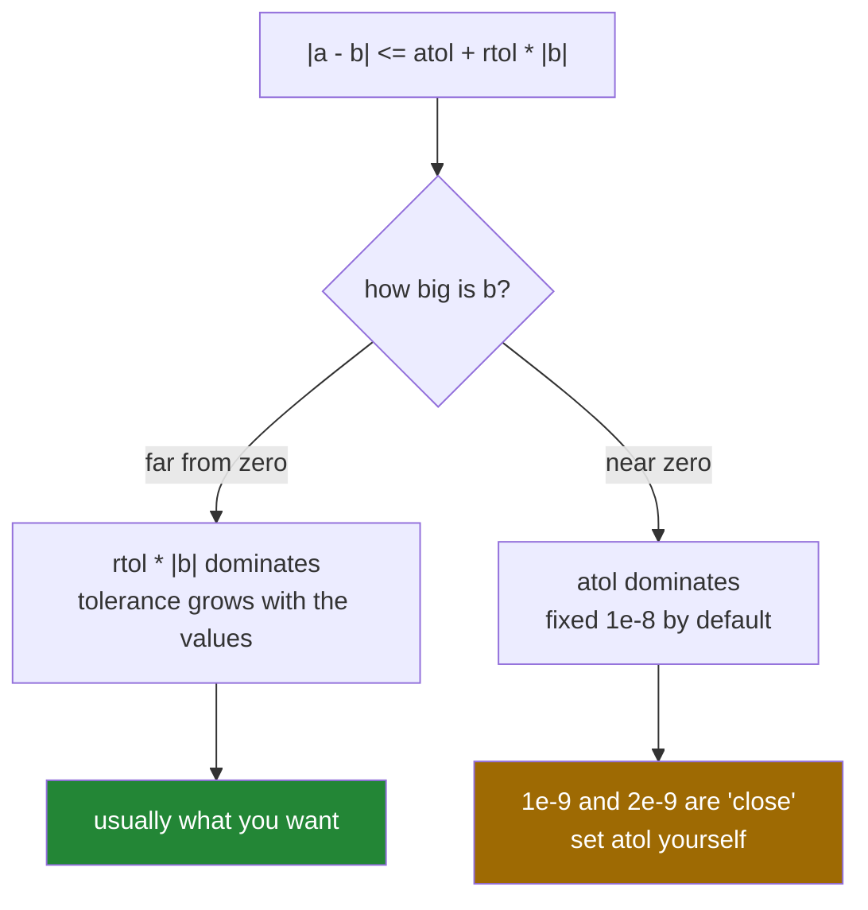

# 1.6 — `isclose` and `allclose` — comparing floats, and the tolerance you have to state

## One-line answer

`==` on floats compares exact bit patterns and fails on arithmetic that is mathematically correct, so
you compare with a **tolerance** — `np.isclose` per element, `np.allclose` for one answer — and the
default tolerance is a decision somebody already made for you.

---

## The story

Two people measure the same room to decide whether a sofa will fit.

One says the wall is 3.42 metres. The other says 3.41. Nobody thinks one of them is wrong; a tape
measure held by a person is good to about a centimetre, and both numbers mean the same thing.

If they were measuring a machine part, one centimetre would be an enormous difference and "3.42 or
3.41" would be a failure of the process.

The measurement has not changed. What changed is how close two numbers have to be before you call them
the same, and that is a property of the job, not of the numbers. Somebody has to say it out loud.

---

## The idea in plain language

Floating-point numbers store fractions in binary, and most decimal fractions cannot be stored exactly
([Day 20, 2.3](../../../day-20-arrays-and-dtypes/parts/02-dtypes/2.3-floats-nan-and-precision.md)).
`0.1 + 0.2` is `0.30000000000000004`, so `0.1 + 0.2 == 0.3` is `False`. Nothing is broken; the
arithmetic did the best it could with the representation, and `==` reported the truth about the bits.

So floats are compared with a tolerance:

**`np.isclose(a, b)`** returns a **mask**, one answer per element
([Day 21, 3.1](../../../day-21-indexing-and-views/parts/03-boolean-masks/3.1-a-comparison-makes-an-array.md)).

**`np.allclose(a, b)`** returns one `bool`: are they all close?

The rule both use is:

```
|a - b| <= atol + rtol * |b|
```

with `rtol=1e-05` and `atol=1e-08` by default. Two parts, because two different problems need solving.

**`rtol` — relative tolerance.** A proportion of the size of `b`. For values near a million, being
within 1e-5 of each other proportionally means within about 10; for values near 1, within 0.00001. This
is what you want almost always, because floating-point error grows with the size of the numbers.

**`atol` — absolute tolerance.** A fixed amount, and it exists for one reason: near zero, a relative
tolerance is useless. `rtol * |0|` is 0, so without `atol` nothing would ever be close to zero, not even
`1e-300`.

Three consequences of that formula, and each one has caught people out.

**The comparison is asymmetric.** `rtol * |b|` uses the **second** argument, so `isclose(a, b)` and
`isclose(b, a)` can disagree when the two differ by about the tolerance. Put the expected value second
and be consistent.

**Near zero, `atol` decides everything.** `np.isclose(1e-9, 2e-9)` is `True` — they differ by 100% and
both are far below the default `atol` of 1e-8. If you are comparing very small numbers, the default is
lying to you and you must set `atol` yourself.

**`nan` is not close to anything, including itself**, unless you pass `equal_nan=True`. `inf` **is**
close to `inf`, because they are equal.

For tests there are two better tools. `np.testing.assert_allclose(actual, desired, rtol=...)` raises
with a report showing both arrays, the mismatched positions and the largest difference — far more
useful than `assert np.allclose(...)`, which tells you only `False`. And
`np.testing.assert_array_equal` is the right call when the values genuinely should be bit-identical,
such as integer results or a copy.

---

## Why Setu needs it

- **Every test on every remaining day** that checks a float uses one of these. `==` in a test is a test
  that passes on your machine and fails on somebody else's
  ([Day 22, 5.2](../../../day-22-broadcasting-and-shape/parts/05-the-module/5.2-the-test-that-can-go-red.md)).
- **Day 76's checks** assert that scaled columns have mean zero, which is zero to about 1e-16 and never
  exactly.
- **Day 130's gradient check** compares an analytic gradient with a numerical one, and the tolerance
  there is a real engineering decision — too tight and it fails on correct code, too loose and it
  passes on a bug.
- **Day 155's retrieval tests** compare similarity scores computed two ways, where the operations run
  in a different order and the last bits differ.
- **Day 44's reproducibility checks** compare a saved result against a fresh run, where a library
  version change moves the final digits.

---

## The mechanism

Why `==` is not the tool:

```python
import numpy as np

a = 0.1 + 0.2
print("0.1 + 0.2        :", repr(a))
print("== 0.3           :", a == 0.3)
print("np.isclose       :", np.isclose(a, 0.3))
print("difference       :", a - 0.3)

shares = np.array([0.1, 0.2, 0.3, 0.4])
print("sum == 1.0       :", shares.sum() == 1.0)
print("isclose to 1.0   :", np.isclose(shares.sum(), 1.0))
print("allclose         :", np.allclose(shares, [0.1, 0.2, 0.3, 0.4]))
print("nan vs nan       :", np.isclose(np.nan, np.nan), "| equal_nan:", np.isclose(np.nan, np.nan, equal_nan=True))
print("inf vs inf       :", np.isclose(np.inf, np.inf))
```

**Line by line:**

- `repr(a)` rather than `print(a)` — `repr` shows every digit Python has, where printing rounds for
  display ([Day 7, 3.3](../../../day-07-strings/parts/03-formatting/3.3-repr-and-the-debugging-f-string.md)).
  **The rounding in `print` is what hides this problem from beginners.**
- `a == 0.3` — `False`. Correct, and useless as a check.
- `np.isclose(a, 0.3)` — `True`, at the default tolerance.
- `a - 0.3` — about 5.6e-17, which is the size of the error being tolerated. Printing the difference is
  the fastest way to choose a tolerance.
- `shares.sum() == 1.0` — `True` here, and **that is luck**. These four values happen to add up
  exactly; change one of them and the same expression is `False`.
- `np.isclose(np.nan, np.nan)` — `False`. Two missing values are not "close", because neither is a
  value ([Day 20, 2.3](../../../day-20-arrays-and-dtypes/parts/02-dtypes/2.3-floats-nan-and-precision.md)).
  `equal_nan=True` says "treat them as matching", which is right when comparing two results that should
  have missing values in the same places.
- `np.isclose(np.inf, np.inf)` — `True`, because infinities are handled as equal rather than through the
  tolerance formula.

```text
0.1 + 0.2        : 0.30000000000000004
== 0.3           : False
np.isclose       : True
difference       : 5.551115123125783e-17
sum == 1.0       : True
isclose to 1.0   : True
allclose         : True
nan vs nan       : False | equal_nan: True
inf vs inf       : True
```

The formula, and which part is doing the work:



The two places the default misleads:

```python
import numpy as np

print("small pair  :", np.isclose(1e-9, 2e-9), "(they differ by 100%)")
print("with atol=0 :", np.isclose(1e-9, 2e-9, atol=0.0))
print("large pair  :", np.isclose(1e9, 1e9 + 1), "(they differ by 1)")
print("tighter rtol:", np.isclose(1e9, 1e9 + 1, rtol=1e-12, atol=0.0))
print("asymmetric a:", np.isclose(1.0, 1.1, rtol=0.095))
print("asymmetric b:", np.isclose(1.1, 1.0, rtol=0.095))
```

**Line by line:**

- `np.isclose(1e-9, 2e-9)` — `True`, and they differ by a factor of two. The default `atol` of 1e-8 is
  larger than either number, so **everything below 1e-8 is close to everything else below 1e-8**.
- `atol=0.0` — turns off the absolute part, and now the relative comparison gives the honest `False`.
  When you are working with very small values, this is the setting to reach for.
- `np.isclose(1e9, 1e9 + 1)` — `True`, and they differ by exactly 1. At that scale, `rtol=1e-5` allows
  a difference of 10 000, which is the right behaviour for accumulated floating-point error and the
  wrong behaviour if you are checking a counter.
- `rtol=1e-12, atol=0.0` — the tight version, which correctly says these two are different.
- The last two lines: **the same pair, in two orders, with two answers.** `rtol * |b|` uses the second
  argument, so 0.095 × 1.1 is enough and 0.095 × 1.0 is not. Convention: **actual first, expected
  second**, matching `np.testing.assert_allclose`.

```text
small pair  : True (they differ by 100%)
with atol=0 : False
large pair  : True (they differ by 1)
tighter rtol: False
asymmetric a: True
asymmetric b: False
```

---

## When it breaks

**The equality test that fails on somebody else's machine:**

```text
$ uv run python -c "
import numpy as np
values = np.array([0.1, 0.2, 0.3])
scaled = values * 3.0 / 3.0
print('same values? :', np.array_equal(scaled, values))
print('close?       :', np.allclose(scaled, values))
print('differences  :', scaled - values)
"
same values? : False
close?       : True
differences  : [1.38777878e-17 2.77555756e-17 0.00000000e+00]
```

**What it means.** Multiplying by three and dividing by three did not return the original values — two
of the three elements are out by about 1e-17, and the third happens to be exact. `np.array_equal` is `False` and the code is entirely correct. This is why a
test asserting float equality is a test that fails at some point for reasons unrelated to the change
being made, usually on a different processor or a different NumPy build.

**The report you get from the testing helper:**

```text
$ uv run python -c "
import numpy as np
np.testing.assert_allclose(np.array([1.0, 2.0]), np.array([1.0, 2.001]), rtol=1e-6)
"
Not equal to tolerance rtol=1e-06, atol=0

Mismatched elements: 1 / 2 (50%)
Mismatch at index:
 [1]: 2.0 (ACTUAL), 2.001 (DESIRED)
Max absolute difference among violations: 0.001
Max relative difference among violations: 0.00049975
 ACTUAL: array([1., 2.])
 DESIRED: array([1.   , 2.001])
```

**What it means.** The tolerance that was applied, how many elements failed, **which** ones, both
values, and the largest difference in absolute and relative terms. Compare that with
`assert np.allclose(a, b)`, whose entire failure message is `assert False`. Note also that
`assert_allclose` defaults to `atol=0`, which is different from `np.allclose`'s `1e-8` — so a test
comparing values against zero needs an explicit `atol`
([Day 22, 5.2](../../../day-22-broadcasting-and-shape/parts/05-the-module/5.2-the-test-that-can-go-red.md)).

**The tolerance that let a bug through:**

```text
$ uv run python -c "
import numpy as np
correct = np.array([1000.0, 2000.0, 3000.0])
buggy = np.array([1000.0, 2000.0, 3001.0])
print('allclose default :', np.allclose(correct, buggy))
print('allclose rtol=0  :', np.allclose(correct, buggy, rtol=0, atol=0.5))
print('the difference is:', (buggy - correct).max())
"
allclose default : False
allclose rtol=0  : False
the difference is: 1.0
```

**What it means.** Here the default caught it — a difference of 1 in 3000 is above `rtol=1e-5`. Push
the values up by three orders of magnitude and it would not: at values near a million, the default
tolerance permits a difference of about 10. **A tolerance is only meaningful next to the scale of the
data**, which is why a test on large values should state `rtol` rather than inherit it.

**Comparing results that both contain missing values:**

```text
$ uv run python -c "
import numpy as np
expected = np.array([1.0, np.nan, 3.0])
actual = np.array([1.0, np.nan, 3.0])
print('allclose          :', np.allclose(actual, expected))
print('with equal_nan    :', np.allclose(actual, expected, equal_nan=True))
print('array_equal       :', np.array_equal(actual, expected))
print('array_equal equal_nan:', np.array_equal(actual, expected, equal_nan=True))
"
allclose          : False
with equal_nan    : True
array_equal       : False
array_equal equal_nan: True
```

**What it means.** Two identical arrays compare as not-close, because `nan != nan`. Every comparison
function has an `equal_nan` argument for this, and forgetting it turns a passing test into a mystery.
Decide explicitly: if the missing values are part of what you are asserting, pass `equal_nan=True`; if
they should not be there at all, assert that separately with `np.isnan(...).any()`.

---

## In production

**What a professional writes instead of the teaching version.** The tolerance is named, justified and
scaled to the quantity:

```python
from __future__ import annotations

import numpy as np

# Scores are similarities in [0, 1]. Two implementations summing in a different order
# agree to about 1e-12; anything looser would hide a real ranking change.
SCORE_RTOL = 1e-9
SCORE_ATOL = 1e-12


def scores_agree(actual: np.ndarray, expected: np.ndarray) -> bool:
    """Whether two score arrays match to within the tolerance this project uses."""
    if actual.shape != expected.shape:
        raise ValueError(f"shapes differ: {actual.shape} and {expected.shape}")
    return bool(np.allclose(actual, expected, rtol=SCORE_RTOL, atol=SCORE_ATOL, equal_nan=True))


def worst_disagreement(actual: np.ndarray, expected: np.ndarray) -> dict[str, float]:
    """Where and by how much two arrays differ, for a log line rather than a bool."""
    difference = np.abs(actual - expected)
    if not difference.size:
        return {"count": 0, "max_absolute": 0.0, "max_relative": 0.0}
    scale = np.maximum(np.abs(expected), SCORE_ATOL)
    return {
        "count": float(np.count_nonzero(difference > 0)),
        "max_absolute": float(np.nanmax(difference)),
        "max_relative": float(np.nanmax(difference / scale)),
    }
```

**Line by line:**

- `SCORE_RTOL` and `SCORE_ATOL` as named constants **with the reasoning in a comment above them**. The
  comment says what the quantity is, what the observed disagreement is, and what a looser tolerance
  would hide — which is everything the next person needs in order to change it responsibly.
- `atol=1e-12` rather than the default `1e-8` — scores live in `[0, 1]` and a difference of 1e-8 in a
  similarity score is not noise, it is a different answer.
- `equal_nan=True` — stated, because these arrays can legitimately contain missing scores and two
  results with missing values in the same places should agree.
- `bool(...)` around `np.allclose` — it returns a `np.bool_`, and a plain `bool` is what a caller or a
  JSON encoder expects
  ([Day 19, 3.4](../../../day-19-typing-dataclasses-and-concurrency/parts/03-pydantic/3.4-model-dump-and-the-boundary.md)).
- `worst_disagreement` — the second function is the important one in production. **A boolean tells you
  something is wrong and nothing about how wrong**, and when a nightly comparison starts failing, the
  size of the difference is what separates "a library changed its summation order" from "the model is
  broken".
- `np.maximum(np.abs(expected), SCORE_ATOL)` — the denominator floored, so a zero expected value does
  not divide to `inf` ([1.3](1.3-divide-by-zero-warns.md)).
- `np.nanmax` — missing values skipped rather than making the whole summary `nan`
  ([2.5](../02-statistics/2.5-the-nan-family.md)).

**What changes at scale.** Tolerance stops being a testing detail and becomes an interface. When two
systems compute the same quantity — a model in training and the same model in a serving runtime, a
batch job and a streaming one — they will not agree bit for bit, because the operations run in a
different order and floating-point addition is not associative
([2.6](../02-statistics/2.6-float-summation-and-the-drift.md)). So "the same" has to be defined
numerically, written down, and monitored: the *distribution* of disagreement is tracked, not just a
pass or fail, because a slow drift upwards is a real signal. The other scale effect is that a
comparison over a billion values will find the worst case, so a tolerance that passes on a thousand
rows will fail on a billion for reasons that are still not bugs.

**The failure that only appears with real data.** A regression test compared model outputs against a
stored reference with `np.allclose` at the default tolerance. The outputs were log-probabilities, all
around −1e-6, so `atol=1e-8`… still mattered, and everything looked fine. Then the model was retrained
and its outputs moved into the range −20 to −0.001. At the larger end, the default `rtol=1e-5`
tolerated a difference of 2e-4 in a log-probability — a visible change in ranking — and the test kept
passing through three genuinely broken releases. The tolerance had never been chosen; it had been
inherited.

**The review comment a senior engineer leaves.** *"`assert np.allclose(a, b)` — when this fails, the
message is `assert False`. Use `np.testing.assert_allclose` with an explicit `rtol` so the failure
prints both arrays and the largest difference. And state the tolerance: the default is relative to the
values, and these are around 1e6."*

**The interview question.** *"How do you compare two floating-point arrays?"* Not with `==`, because
binary floating point cannot represent most decimal fractions exactly, so mathematically equal
expressions differ in the last bits — `0.1 + 0.2 == 0.3` is `False`. I use `np.isclose` for a per-element
mask or `np.allclose` for one answer, and in tests `np.testing.assert_allclose`, which reports which
elements failed and by how much. The part worth stating is the tolerance: the rule is
`|a - b| <= atol + rtol * |b|`, so `rtol` scales with the values and `atol` covers the region near zero
where a relative tolerance is meaningless. The defaults are `rtol=1e-5, atol=1e-8`, which means
anything below 1e-8 is "close" to anything else below it — so with very small numbers you must set
`atol` yourself. And `nan` is never close to `nan` unless you pass `equal_nan=True`.

---

## Check yourself

```bash
uv run python -c "
import numpy as np
print('0.1+0.2 == 0.3 :', 0.1 + 0.2 == 0.3)
print('isclose        :', np.isclose(0.1 + 0.2, 0.3))
print('tiny pair      :', np.isclose(1e-9, 2e-9))
print('tiny, atol=0   :', np.isclose(1e-9, 2e-9, atol=0.0))
print('nan            :', np.isclose(np.nan, np.nan), np.isclose(np.nan, np.nan, equal_nan=True))
print('order matters  :', np.isclose(1.0, 1.1, rtol=0.095), np.isclose(1.1, 1.0, rtol=0.095))
"
```

Two of those lines show the default tolerance saying something you would not agree with. Say which.

**Answer out loud, without scrolling up:**

> Write the formula `np.isclose` uses, say which of its two tolerances matters near zero, and say what
> `np.isclose(nan, nan)` returns.

---

**Next:** [1.7 — `reduce`, `accumulate` and `at`](1.7-reduce-accumulate-and-at.md).
