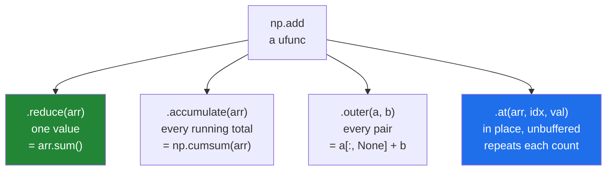

# 1.7 — `reduce`, `accumulate` and `at` — the methods every ufunc carries

## One-line answer

Because a ufunc is an object, it has methods: `.reduce` folds an array into one value, `.accumulate`
keeps every running total on the way, `.outer` applies it to every pair, and `.at` applies it
unbuffered so repeated positions each count.

---

## The story

Somebody is adding up a column of receipts on a calculator.

They press plus between each number and read the total at the end. One number out.

Their friend wants the running total after each receipt — to see where the budget was overshot — so
they write down the display after every press. Seven numbers instead of one, and the last of them is
the same total as before.

Nothing about the addition changed. What changed is whether you keep only the final answer or every
answer on the way, and both come from the same sequence of presses.

---

## The idea in plain language

A ufunc applies its operation to pairs of elements ([1.1](1.1-one-operation-every-element.md)). Four
methods say what to do with that, and every ufunc with two inputs has all four.

**`.reduce(arr)`** applies the operation between every element, folding the array into one value.
`np.add.reduce(week)` is the sum; `np.multiply.reduce` is the product; `np.maximum.reduce` is the
maximum; `np.logical_and.reduce` is "are all of these true". Familiar functions like `arr.sum()` and
`arr.max()` are exactly these, with friendlier names — which is why `sum`, `max`, `all` and `any` all
behave the same way about `axis=`.

**`.accumulate(arr)`** does the same fold and keeps every intermediate. `np.add.accumulate` is
`np.cumsum`, and the last element is what `.reduce` would have returned.

**`.outer(a, b)`** applies the operation to every pair: `np.add.outer` of a `(3,)` and a `(2,)` gives a
`(3, 2)` array. It is the same result as `a[:, None] + b[None, :]`, and the same memory hazard
([Day 22, 1.7](../../../day-22-broadcasting-and-shape/parts/01-broadcasting/1.7-the-broadcast-that-ate-the-memory.md)).

**`.at(arr, positions, values)`** applies the operation **in place and unbuffered**, so a repeated
position is applied once per occurrence. This is the fix for the lost update from
[Day 21, 4.4](../../../day-21-indexing-and-views/parts/04-fancy-indexing/4.4-repeated-positions-and-the-lost-update.md),
and it is where that part's forward reference pointed.

There is a fifth, `.reduceat`, which reduces between given cut points in one pass — a grouped sum
without a loop. It is genuinely useful and genuinely hard to read, so it belongs in a function with a
name.

One idea ties the reductions together: the **identity element**, the value that leaves an operand
unchanged. `np.add.identity` is 0, `np.multiply.identity` is 1, and `np.maximum.identity` is `None`,
because no number is a safe stand-in for "the largest of nothing". That is why summing an empty array
gives 0 and taking its maximum raises — the behaviour you met on
[Day 21, 3.5](../../../day-21-indexing-and-views/parts/03-boolean-masks/3.5-the-mask-that-matched-nothing.md),
now with its reason. `initial=` supplies your own identity when you have one to offer.

---

## Why Setu needs it

- **`np.add.at` and `np.bincount` are the correct way to build a histogram or a tally**, and Day 21
  promised this part as the explanation.
- **Day 117's bag-of-words counting** is `np.add.at` over token positions, once per document.
- **Day 130's gradient accumulation** adds a gradient into the row of an embedding table for every
  token, and the same token twice in a batch is normal.
- **Day 84's running totals** are `np.add.accumulate`, and a cumulative distribution is
  `np.add.accumulate(counts) / counts.sum()`.
- **The whole of section 2** is reductions with nicer names, so knowing they are one mechanism means
  learning `axis=`, `keepdims=` and the empty case once rather than six times.

---

## The mechanism

Four methods on the week:

```python
import numpy as np

week = np.array([8213, 10442, 6180, 9000, 12007, 9631, 7204])

print("reduce      :", np.add.reduce(week), "== week.sum():", week.sum())
print("accumulate  :", np.add.accumulate(week))
print("cumsum same :", np.array_equal(np.add.accumulate(week), np.cumsum(week)))
print("multiply.reduce:", np.multiply.reduce(np.array([1, 2, 3, 4])))
print("maximum.reduce :", np.maximum.reduce(week), "== week.max():", week.max())
print("logical_and.reduce:", np.logical_and.reduce(week > 5000))
print("empty reduce   :", np.add.reduce(np.array([], dtype=np.int64)))
print(
    "identity of add:",
    np.add.identity,
    "multiply:",
    np.multiply.identity,
    "maximum:",
    np.maximum.identity,
)

month = np.arange(28).reshape(4, 7)
print("reduce axis=0  :", np.add.reduce(month, axis=0))
print("reduceat       :", np.add.reduceat(week, [0, 5]))

tally = np.zeros(5, dtype=np.int64)
np.add.at(tally, [0, 0, 0, 3, 3], 1)
print("add.at         :", tally)
```

**Line by line:**

- `np.add.reduce(week)` and `week.sum()` — the same number, because `sum` **is** this call. Knowing that
  is what makes section 2 short.
- `np.add.accumulate(week)` — seven running totals, ending at the sum. Reading it tells you the day the
  month passed fifty thousand steps, which the single total cannot.
- `np.multiply.reduce([1, 2, 3, 4])` — 24, a factorial by another name. Any two-input ufunc can be
  folded this way, including ones with no friendly wrapper.
- `np.logical_and.reduce(week > 5000)` — "were all days above five thousand". This is `arr.all()`, and
  seeing it as a fold of `and` is what explains why `all()` of an empty array is `True`
  ([Day 21, 3.5](../../../day-21-indexing-and-views/parts/03-boolean-masks/3.5-the-mask-that-matched-nothing.md)):
  the identity of `and` is `True`.
- `np.add.reduce(np.array([], ...))` — `0`, the identity of addition, with no warning. Correct, and
  worth knowing before you trust a total.
- `np.maximum.identity` — `None`. **That single value is the reason `max` of an empty array raises
  where `sum` does not.**
- `np.add.reduce(month, axis=0)` — reductions take `axis=` like everything else
  ([2.2](../02-statistics/2.2-axis-the-one-that-disappears.md)).
- `np.add.reduceat(week, [0, 5])` — two groups: days 0 to 4, and days 5 to the end. The list holds the
  **start** of each group, so the boundaries read like the cut points in `np.split`
  ([Day 22, 4.3](../../../day-22-broadcasting-and-shape/parts/04-joining-and-splitting/4.3-split-and-the-uneven-last-piece.md)).
- `np.add.at(tally, [0, 0, 0, 3, 3], 1)` — position 0 three times, position 3 twice, and the tally says
  so. `tally[[0, 0, 0, 3, 3]] += 1` would have given ones
  ([Day 21, 4.4](../../../day-21-indexing-and-views/parts/04-fancy-indexing/4.4-repeated-positions-and-the-lost-update.md)).

```text
reduce      : 62677 == week.sum(): 62677
accumulate  : [ 8213 18655 24835 33835 45842 55473 62677]
cumsum same : True
multiply.reduce: 24
maximum.reduce : 12007 == week.max(): 12007
logical_and.reduce: True
empty reduce   : 0
identity of add: 0 multiply: 1 maximum: None
reduce axis=0  : [42 46 50 54 58 62 66]
reduceat       : [45842 16835]
add.at         : [3 0 0 2 0]
```

The four methods, from one operation:



`.outer`, and what it costs:

```python
import numpy as np

a = np.array([1, 2, 3])
b = np.array([10, 20])

print("add.outer  :", np.add.outer(a, b).shape)
print(np.add.outer(a, b))
print("same as broadcast:", np.array_equal(np.add.outer(a, b), a[:, None] + b[None, :]))
```

**Line by line:**

- `np.add.outer(a, b)` — every element of `a` with every element of `b`, so `(3,)` and `(2,)` give
  `(3, 2)`. The multiplication version, `np.multiply.outer`, is the outer product from linear algebra.
- The printed grid: row `i` is `a[i]` added to each of `b`.
- `a[:, None] + b[None, :]` — identical, which is the point. **`.outer` is a name for the
  column-against-row broadcast**, with exactly the same memory behaviour: two arrays of n and m
  elements produce n × m
  ([Day 22, 1.7](../../../day-22-broadcasting-and-shape/parts/01-broadcasting/1.7-the-broadcast-that-ate-the-memory.md)).
  Twenty thousand each is 3.2 GB.

```text
add.outer  : (3, 2)
[[11 21]
 [12 22]
 [13 23]]
same as broadcast: True
```

---

## When it breaks

**The reduction with no identity, on an empty array:**

```text
$ uv run python -c "
import numpy as np
print('empty sum     :', np.add.reduce(np.array([], dtype=np.float64)))
try:
    np.maximum.reduce(np.array([], dtype=np.float64))
except ValueError as exc:
    print('empty maximum :', exc)
print('with initial  :', np.maximum.reduce(np.array([], dtype=np.float64), initial=0.0))
"
empty sum     : 0.0
empty maximum : zero-size array to reduction operation maximum which has no identity
with initial  : 0.0
```

**What it means.** `np.add.identity` is 0, so an empty sum has an answer. `np.maximum.identity` is
`None`, so an empty maximum does not, and NumPy raises rather than inventing `-inf` — which would
quietly become the largest value in any later comparison. `initial=0.0` is you supplying the missing
identity, and it is a claim about your data: *no value in this array can be below zero*. Make it only
when that is true.

**`.at` with the arguments swapped:**

```text
$ uv run python -c "
import numpy as np
tally = np.zeros(5, dtype=np.int64)
np.add.at(tally, 1, np.array([1, 1, 1]))
"
Traceback (most recent call last):
  File "<string>", line 4, in <module>
ValueError: array is not broadcastable to correct shape
```

**What it means.** The signature is `np.add.at(array, positions, values)`. Here one position was given
three values, and one slot cannot hold three. The message comes from deep inside the ufunc machinery
and mentions neither `at` nor your arrays, so it is worth memorising the sentence instead: *at these
positions of this array, add this*.

**`.at` being much slower than the alternative:**

```text
$ uv run python -c "
import time
import numpy as np
rng = np.random.default_rng(23)
positions = rng.integers(0, 1000, size=2_000_000)
weights = rng.random(2_000_000)
positions.sum()
a = np.zeros(1000)
start = time.perf_counter(); np.add.at(a, positions, weights); at_time = time.perf_counter() - start
start = time.perf_counter(); b = np.bincount(positions, weights=weights, minlength=1000); bc_time = time.perf_counter() - start
print(f'np.add.at   : {at_time * 1000:6.1f} ms')
print(f'np.bincount : {bc_time * 1000:6.1f} ms')
print('same answer :', np.allclose(a, b))
"
np.add.at   :    3.3 ms
np.bincount :    3.7 ms
same answer : True
```

**What it means.** On this NumPy the two are within a few per cent of each other, and on this run
`np.add.at` was marginally the faster. That has not always
been true — `np.add.at` was notoriously slow for years, and a great deal of code exists that avoids it
for reasons that no longer hold. The rule that survives: **when a specialised function exists for what
you are doing, use it and measure**, and treat remembered performance advice about a specific function
as something to re-check rather than to repeat.

**`.accumulate` on an integer array that overflowed:**

```text
$ uv run python -c "
import numpy as np
counts = np.full(5, 2_000_000_000, dtype=np.int32)
print('accumulate :', np.add.accumulate(counts))
print('dtype      :', np.add.accumulate(counts).dtype)
print('true total :', 5 * 2_000_000_000)
"
accumulate : [ 2000000000  4000000000  6000000000  8000000000 10000000000]
dtype      : int64
true total : 10000000000
```

**What it means.** Here NumPy promoted to `int64` and the answer is right. It is worth checking, because
the running total of an `int32` column can exceed what `int32` holds long before the values themselves
do — and where a reduction does keep the input dtype, the wrap is silent
([Day 20, 2.2](../../../day-20-arrays-and-dtypes/parts/02-dtypes/2.2-integers-and-the-silent-wrap.md)).
Passing `dtype=np.int64` to a reduction states the accumulator's type instead of hoping.

---

## In production

**What a professional writes instead of the teaching version.** The specialised function where one
exists, `.at` where one does not, and a named function around `reduceat`:

```python
from __future__ import annotations

import numpy as np


def tally_by_position(positions: np.ndarray, weights: np.ndarray, slots: int) -> np.ndarray:
    """Sum weights into slots. Repeated positions add up, as they must.

    np.bincount is the specialised tool for exactly this and is used where it fits;
    np.add.at is the general fallback for operations bincount cannot express.
    """
    if positions.size != weights.size:
        raise ValueError(f"{positions.size} positions and {weights.size} weights")
    if positions.size and (positions.min() < 0 or positions.max() >= slots):
        raise ValueError(f"positions outside 0..{slots - 1}")
    return np.bincount(positions, weights=weights, minlength=slots)


def group_sums(values: np.ndarray, starts: np.ndarray) -> np.ndarray:
    """Sum ``values`` between consecutive ``starts``, in one pass.

    ``starts`` holds the first position of each group, ascending, first entry 0 - the
    same convention as np.split's cut points. reduceat is fast and unreadable, so it
    lives here behind a name.
    """
    if starts.size == 0:
        return np.zeros(0, dtype=values.dtype)
    if starts[0] != 0 or np.any(np.diff(starts) <= 0):
        raise ValueError("starts must begin at 0 and increase")
    if starts[-1] >= values.size:
        raise ValueError(f"start {starts[-1]} is beyond {values.size} values")
    return np.add.reduceat(values, starts)
```

**Line by line:**

- `np.bincount(...)` rather than `np.add.at` — the specialised function, with the docstring saying when
  the general one is still needed. Someone reading this should not have to wonder whether `.at` was
  overlooked.
- The two guards before it: matching sizes, and positions in range. `np.bincount` accepts any
  non-negative position and would silently return an array **longer** than `slots`
  ([Day 21, 5.2](../../../day-21-indexing-and-views/parts/05-in-anger/5.2-view-or-copy-on-purpose.md)),
  which then fails to broadcast somewhere far away.
- `group_sums` exists **because `reduceat` is unreadable at the call site**. Wrapping it in a name and
  three checks turns a line nobody can review into a function whose contract is stated.
- `np.any(np.diff(starts) <= 0)` — `np.diff` gives the gaps between consecutive entries
  ([2.1](../02-statistics/2.1-a-reduction-turns-many-into-one.md)), so this asserts strictly ascending
  in one line. `reduceat` with a decreasing start produces a value from a backwards slice rather than
  an error, which is the failure this check exists for.
- `starts[0] != 0` — `reduceat` does not require it and the results are much harder to interpret
  without it, so the function requires it and says so.
- `np.zeros(0, dtype=values.dtype)` for the empty case — the right dtype as well as the right shape
  ([Day 22, 4.1](../../../day-22-broadcasting-and-shape/parts/04-joining-and-splitting/4.1-concatenate.md)).

**What changes at scale.** Two things. `reduceat` and `bincount` are single-pass and stay
single-pass, so they become the difference between a grouped aggregation that finishes and one that
does not — a Python loop over groups is one pass per group. And `.outer` becomes actively dangerous:
it is the friendliest possible spelling of an operation whose output is the product of its inputs, so
`np.subtract.outer(a, b)` on two arrays of fifty thousand asks for 20 GB
([Day 22, 1.7](../../../day-22-broadcasting-and-shape/parts/01-broadcasting/1.7-the-broadcast-that-ate-the-memory.md)).
The third habit is stating the accumulator dtype: `arr.sum(dtype=np.float64)` on a `float32` array of a
hundred million values, because the running total drifts otherwise
([2.6](../02-statistics/2.6-float-summation-and-the-drift.md)).

**The failure that only appears with real data.** A metering job summed usage per customer with
`totals[customer_ids] += amounts`. Customers appearing more than once per batch were undercounted
([Day 21, 4.4](../../../day-21-indexing-and-views/parts/04-fancy-indexing/4.4-repeated-positions-and-the-lost-update.md)),
and the bug was biased: the busiest accounts appeared most often and were the most under-billed. The
fix was `np.bincount(customer_ids, weights=amounts, minlength=n_customers)`, and the test that would
have caught it is one line — the sum of the totals must equal the sum of the amounts.

**The review comment a senior engineer leaves.** *"`np.add.reduceat(values, starts)` — nobody reading
this in six months will know what `starts` has to satisfy. Put it behind a function with the
preconditions asserted, and say in the docstring that the entries are group starts and not group
sizes."*

**The interview question.** *"What is `np.add.reduce`?"* It is the fold behind `arr.sum()`: a ufunc
applies its operation pairwise, and `.reduce` applies it across a whole axis to produce one value.
Every two-input ufunc has it, along with `.accumulate` for the running results — `np.add.accumulate` is
`cumsum` — `.outer` for every pair, and `.at` for an in-place unbuffered update where repeated positions
each take effect. The idea that makes the family make sense is the identity element: `np.add.identity`
is 0 and `np.multiply.identity` is 1, so those reductions have an answer on an empty array, while
`np.maximum.identity` is `None`, which is exactly why taking the maximum of an empty array raises
instead of inventing a value.

---

## Check yourself

```bash
uv run python -c "
import numpy as np
week = np.array([1, 2, 3, 4])
print('reduce     :', np.add.reduce(week), week.sum())
print('accumulate :', np.add.accumulate(week))
print('multiply   :', np.multiply.reduce(week))
print('outer shape:', np.add.outer(week, week).shape)
tally = np.zeros(3, dtype=np.int64)
np.add.at(tally, [0, 0, 2], 1)
print('at         :', tally)
print('identities :', np.add.identity, np.multiply.identity, np.maximum.identity)
"
```

The last line has three values and one of them is `None`. Say which reduction that makes dangerous on
an empty array.

**Answer out loud, without scrolling up:**

> Name the four methods every two-input ufunc carries, say which one `arr.cumsum()` is, and say what
> `np.maximum.identity` being `None` causes.

---

**Next:** [2.1 — a reduction turns many into one](../02-statistics/2.1-a-reduction-turns-many-into-one.md).
