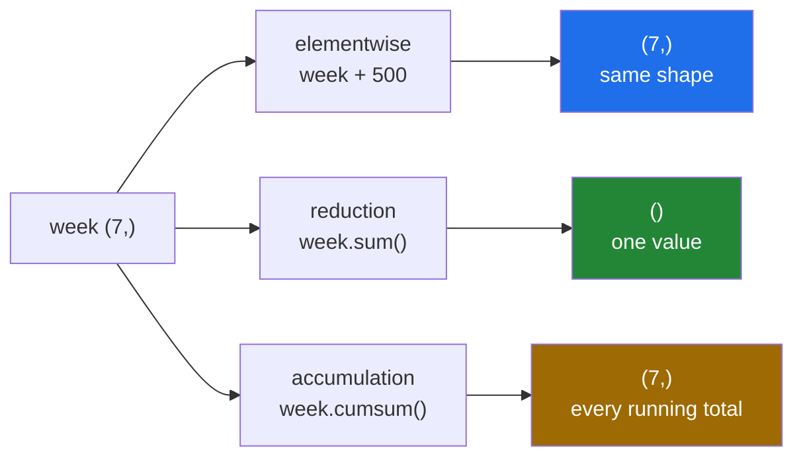

# 2.1 — A reduction turns many numbers into one

## One-line answer

A **reduction** takes an array and gives back a single value — `sum`, `mean`, `min`, `max`, `any`,
`all` — and it is the opposite of everything so far today, which gave back an array of the same shape.

---

## The story

Somebody looks at the week of step counts and somebody else asks how it went.

They do not read out seven numbers. They say "about nine thousand a day", or "the best day was just
over twelve thousand", or "sixty-two thousand for the week".

Each of those is one number standing in for seven, and each throws away something different. "About
nine thousand" loses the good day and the bad day. "Just over twelve thousand" loses everything except
the best. "Sixty-two thousand" cannot tell you whether it was even across the week or all on Friday.

Nobody minds, because the point of the summary is that it fits in a sentence. But it is worth being
clear that a summary is a **loss** — deliberate, chosen, and not reversible.

---

## The idea in plain language

Everything in section 1 was **elementwise**: an array in, an array of the same shape out
([1.1](../01-ufuncs/1.1-one-operation-every-element.md)).

A **reduction** is the other shape of operation. Many values go in and one comes out, because the
operation is applied *between* the elements rather than *to* each of them. `week.sum()` is
`np.add.reduce(week)` under a friendlier name ([1.7](../01-ufuncs/1.7-reduce-accumulate-and-at.md)),
and the whole family works the same way.

The ones you will use constantly:

| Call | Gives | Notes |
|---|---|---|
| `arr.sum()` | the total | identity 0, so an empty array gives 0 |
| `arr.mean()` | the average | `nan` on an empty array, with a warning |
| `arr.min()`, `arr.max()` | the smallest and largest | **raise** on an empty array |
| `np.ptp(arr)` | max minus min, the "peak to peak" range | one pass |
| `arr.argmin()`, `arr.argmax()` | the **position** of the smallest or largest | not the value |
| `arr.prod()` | the product | identity 1 |
| `arr.any()`, `arr.all()` | is any true, are all true | folds of `or` and `and` |

Two near-relatives are not reductions and belong in the same list because they answer similar
questions. `arr.cumsum()` keeps every running total, so it gives an array back
([1.7](../01-ufuncs/1.7-reduce-accumulate-and-at.md)), and `np.diff(arr)` gives the gaps between
consecutive values, so it returns one fewer element than it received.

Three things to know before section 2 goes further.

**A reduction result is a NumPy scalar, not a Python number.** `week.sum()` is a `np.int64` — it
prints like an integer, behaves like one in arithmetic, and is not one
([Day 21, 1.1](../../../day-21-indexing-and-views/parts/01-one-element/1.1-index-and-the-negative-index.md)).
At the boundary of your program — JSON, a database, a dictionary somebody serialises — convert with
`int()` or `float()`.

**`argmin` and `argmax` return positions, not values.** They are the bridge from a statistic back to
the data ([3.2](../03-sorting-and-searching/3.2-argsort-the-positions.md)), and the commonest mistake
is using one where you meant the other.

**The empty case differs per reduction**, and the reason is the identity element from
[1.7](../01-ufuncs/1.7-reduce-accumulate-and-at.md): `sum` gives 0, `all` gives `True`, `mean` gives
`nan` with a warning, and `max` raises. You met that behaviour on
[Day 21, 3.5](../../../day-21-indexing-and-views/parts/03-boolean-masks/3.5-the-mask-that-matched-nothing.md);
now you know why it varies.

---

## Why Setu needs it

- **Day 25's phase gate** is a vectorised statistics module, and this is the vocabulary it is written
  in.
- **Day 58's descriptive statistics** — mean, spread, shape of a distribution — is this section with
  the mathematics attached.
- **Day 84's exploratory analysis** starts every column with `min`, `max`, `mean` and a count of
  missing values.
- **Day 130's training loop** reduces a batch of losses to one number on every step, and that number is
  what the optimiser follows.
- **Day 172's eval harness** reduces per-example scores to a headline number, which is where "a summary
  is a deliberate loss" stops being a philosophical point.

---

## The mechanism

Nine summaries of one week:

```python
import numpy as np

week = np.array([8213, 10442, 6180, 9000, 12007, 9631, 7204])

print("sum      :", week.sum(), "shape", np.shape(week.sum()))
print("mean     :", round(float(week.mean()), 1))
print("min, max :", week.min(), week.max())
print("ptp      :", np.ptp(week))
print("argmin   :", week.argmin(), "argmax:", week.argmax())
print("prod     :", np.prod(np.array([1, 2, 3, 4])))
print("cumsum   :", week.cumsum())
print("diff     :", np.diff(week))
print("type of a reduction result:", type(week.sum()).__name__)
print("as a python int           :", type(int(week.sum())).__name__)
```

**Line by line:**

- `np.shape(week.sum())` — `()`, the empty tuple. **A reduction to a single value has no axes at all**,
  which is the same shape a plain number broadcasts with
  ([Day 22, 1.2](../../../day-22-broadcasting-and-shape/parts/01-broadcasting/1.2-the-rule-in-three-lines.md)).
- `round(float(week.mean()), 1)` — converted before rounding, so what is printed is an ordinary Python
  float. Rounding is for display; it does not make the value exact
  ([Day 20, 2.3](../../../day-20-arrays-and-dtypes/parts/02-dtypes/2.3-floats-nan-and-precision.md)).
- `np.ptp(week)` — "peak to peak", the largest minus the smallest, in one pass. A single number for how
  spread out the week was, and a much cruder one than the standard deviation
  ([2.3](2.3-std-var-and-ddof.md)).
- `week.argmin()` and `week.argmax()` — **2 and 4**, which are positions. The values there are 6180 and
  12007. Reading these as values is the mistake; `week[week.argmax()]` is the value, and `week.max()`
  is the shorter way to get it.
- `np.diff(week)` — six numbers from seven, the change from each day to the next. Negative means the
  day was quieter than the one before.
- `type(week.sum()).__name__` — `int64`, a NumPy scalar. `int(...)` converts it, and that conversion
  belongs at the edge of the program
  ([Day 19, 3.4](../../../day-19-typing-dataclasses-and-concurrency/parts/03-pydantic/3.4-model-dump-and-the-boundary.md)).

```text
sum      : 62677 shape ()
mean     : 8953.9
min, max : 6180 12007
ptp      : 5827
argmin   : 2 argmax: 4
prod     : 24
cumsum   : [ 8213 18655 24835 33835 45842 55473 62677]
diff     : [ 2229 -4262  2820  3007 -2376 -2427]
type of a reduction result: int64
as a python int           : int
```

Elementwise against reduction:



The middle column is the shape of the answer, and it is the only thing that distinguishes the three.

What each summary throws away:

```python
import numpy as np

steady = np.array([9000, 9000, 9000, 9000, 9000, 9000, 8677])
spiky = np.array([0, 0, 0, 0, 0, 0, 62677])

for name, week in (("steady", steady), ("spiky", spiky)):
    print(
        f"{name:<7} sum {week.sum():>6} mean {week.mean():>8.1f} "
        f"max {week.max():>6} ptp {np.ptp(week):>6}"
    )
print("same total, and only two of the four summaries can tell them apart")
```

**Line by line:**

- Two weeks with **the same total**, built that way deliberately.
- `sum` — identical, by construction. A total says nothing about distribution.
- `mean` — identical too, because the mean is the sum divided by a count that is the same.
- `max` and `ptp` — completely different, and these are the two that notice.
- The f-string alignments (`:>6`, `:>8.1f`) line the columns up
  ([Day 7, 3.2](../../../day-07-strings/parts/03-formatting/3.2-the-format-spec.md)), which is what
  makes the comparison readable at a glance.
- **The lesson is the last line**: choosing a summary is choosing what to be blind to, and reporting
  one number without a spread alongside it hides exactly this.

```text
steady  sum  62677 mean   8953.9 max   9000 ptp    323
spiky   sum  62677 mean   8953.9 max  62677 ptp  62677
```

---

## When it breaks

**The position mistaken for the value:**

```text
$ uv run python -c "
import numpy as np
week = np.array([8213, 10442, 6180, 9000, 12007, 9631, 7204])
print('argmax     :', week.argmax())
print('max        :', week.max())
print('week[argmax]:', week[week.argmax()])
print('a busy day was', week.argmax(), 'steps? no - it was day', week.argmax())
"
argmax     : 4
max        : 12007
week[argmax]: 12007
a busy day was 4 steps? no - it was day 4
```

**What it means.** `argmax` gives 4, which is a day number, and dropping it into a report as a step
count gives an absurd answer that a shape check cannot catch — both are integers. The names are
`arg`-prefixed precisely because they return **arg**uments, meaning positions. When both a position and
a value are in play, name the variables accordingly: `best_day` and `best_count`, never both `best`.

**The empty array, four different ways:**

```text
$ uv run python -c "
import numpy as np
empty = np.array([], dtype=np.float64)
print('sum  :', empty.sum())
print('prod :', empty.prod())
print('all  :', empty.all(), 'any:', empty.any())
try:
    empty.max()
except ValueError as exc:
    print('max  :', exc)
print('mean :', empty.mean())
"
sum  : 0.0
prod : 1.0
all  : True any: False
max  : zero-size array to reduction operation maximum which has no identity
mean : nan
```

**What it means.** Four behaviours from one empty array, each following from the identity element of
its operation ([1.7](../01-ufuncs/1.7-reduce-accumulate-and-at.md)). The dangerous ones are `all`
returning `True` — an empty batch passes every check — and `mean` returning `nan` with a warning that
scrolls past. Guard with a size check before reducing anything that might be empty
([Day 21, 3.5](../../../day-21-indexing-and-views/parts/03-boolean-masks/3.5-the-mask-that-matched-nothing.md)).

**The NumPy scalar that would not serialise:**

```text
$ uv run python -c "
import json
import numpy as np
week = np.array([8213, 10442, 6180])
try:
    print(json.dumps({'total': week.sum()}))
except TypeError as exc:
    print('json  :', exc)
print('fixed :', json.dumps({'total': int(week.sum())}))
"
json  : Object of type int64 is not JSON serializable
fixed : {"total": 24835}
```

**What it means.** `week.sum()` is a `np.int64`, and `json.dumps` refuses it. The failure happens at the
boundary — a response, a log line, a message on a queue — usually a long way from the reduction that
produced it. Convert where the value leaves NumPy, not where it is created, and the conversion is one
call.

**The integer total that wrapped:**

```text
$ uv run python -c "
import numpy as np
counts = np.full(100, 30_000_000, dtype=np.int32)
print('default sum :', counts.sum(), 'dtype', counts.sum().dtype)
print('true total  :', 100 * 30_000_000)
print('int32 sum   :', counts.sum(dtype=np.int32))
"
default sum : 3000000000 dtype int64
true total  : 3000000000
int32 sum   : -1294967296
```

**What it means.** NumPy's default accumulator for an integer sum is at least as wide as the platform's
default integer, so the first line is right. Ask for the sum **in the input's dtype** and it wraps
silently to a negative number ([Day 20, 2.2](../../../day-20-arrays-and-dtypes/parts/02-dtypes/2.2-integers-and-the-silent-wrap.md)).
`dtype=` on a reduction is the accumulator's type, and narrowing it is a decision that should never be
made to save memory on a single number.

---

## In production

**What a professional writes instead of the teaching version.** One pass, several statistics, plain
types out, and the count reported alongside:

```python
from __future__ import annotations

from dataclasses import dataclass

import numpy as np


@dataclass(frozen=True, slots=True)
class Summary:
    """What a run of counts looks like. Every field is a plain Python type."""

    count: int
    total: int
    mean: float
    best: int
    best_day: int
    spread: int


def summarise(counts: np.ndarray) -> Summary:
    """Describe a run of counts, refusing an empty one rather than returning nan."""
    if counts.ndim != 1:
        raise ValueError(f"expected one run of counts, got shape {counts.shape}")
    if counts.size == 0:
        raise ValueError("cannot summarise an empty run of counts")
    best_day = int(counts.argmax())
    return Summary(
        count=int(counts.size),
        total=int(counts.sum(dtype=np.int64)),
        mean=float(counts.mean()),
        best=int(counts[best_day]),
        best_day=best_day,
        spread=int(np.ptp(counts)),
    )
```

**Line by line:**

- `count` is the **first** field, deliberately. A mean without the number of values behind it is
  unreadable: 9 000 from seven days and 9 000 from two days are different claims, and a report that
  omits the count invites the reader to assume the wrong one.
- `best` and `best_day` as separate fields with distinguishable names — the fix for the `argmax`
  confusion above.
- `if counts.size == 0: raise` — refusing rather than returning a `nan` mean. A caller can catch an
  exception; nobody catches a `nan`
  ([Day 21, 3.5](../../../day-21-indexing-and-views/parts/03-boolean-masks/3.5-the-mask-that-matched-nothing.md)).
- `counts.sum(dtype=np.int64)` — **the accumulator's type stated**, so a `int32` input cannot wrap. It
  costs nothing and removes a whole class of silent failure.
- `int(...)` and `float(...)` on every field — the conversion at the boundary, in one place, so nothing
  downstream meets a NumPy scalar
  ([Day 19, 3.4](../../../day-19-typing-dataclasses-and-concurrency/parts/03-pydantic/3.4-model-dump-and-the-boundary.md)).
- `counts[best_day]` rather than `counts.max()` — the position is computed once and reused, so the two
  fields cannot disagree. With `max()` they would be two passes and two opportunities to change one
  without the other.
- `frozen=True, slots=True` — a record of the past should not be edited, and `slots` catches a mistyped
  field name ([Day 19, 2.3](../../../day-19-typing-dataclasses-and-concurrency/parts/02-dataclasses/2.3-frozen-slots-kw-only.md)).

**What changes at scale.** Two things. Each reduction is a full pass over the data, so a summary of six
statistics reads a 4 GB array six times; when that matters, the statistics that decompose —
count, sum, sum of squares, min, max — are accumulated in one pass and the rest derived from them,
which is what a database's aggregate does. The second is precision: summing a hundred million
`float32` values in `float32` drifts measurably, so `dtype=np.float64` on the reduction is standard for
large float arrays ([2.6](2.6-float-summation-and-the-drift.md)). And with very large data the summary
stops being a nicety and becomes the only thing anybody looks at, which makes the choice of *which*
summaries to report a design decision rather than a formatting one.

**The failure that only appears with real data.** A dashboard reported the mean latency per endpoint
and nothing else. One endpoint's mean was steady for months while its slowest requests grew from 300
milliseconds to eleven seconds — the volume of fast requests kept the mean flat. The customers
complaining were all in the tail that the summary could not see. Adding the maximum and the 99th
percentile ([2.4](2.4-median-percentile-and-quantile.md)) made the problem obvious in a day, and the
lesson is the one from the mechanism: **a summary is a deliberate loss, and reporting only one is
choosing what not to see.**

**The review comment a senior engineer leaves.** *"This returns a mean and no count, so a reader cannot
tell an average over 10 000 requests from an average over three. Add the count, and return plain floats
— that `np.float64` will break the JSON encoder at the API boundary."*

**The interview question.** *"What is a reduction?"* An operation that collapses many values into one:
`sum`, `mean`, `min`, `max`, `any`, `all`. It is the counterpart to an elementwise operation, which
returns an array of the same shape — and underneath it is a ufunc fold, so `arr.sum()` is
`np.add.reduce(arr)`. Two things follow that people get wrong: the empty case differs per reduction,
because it comes from the operation's identity element — `sum` gives 0, `all` gives `True`, `mean`
gives `nan` and `max` raises — and the result is a NumPy scalar rather than a Python number, so it
needs converting at any boundary that serialises. And `argmax` returns a position, not a value, which
is a distinction worth putting in the variable names.

---

## Check yourself

```bash
uv run python -c "
import numpy as np
week = np.array([8213, 10442, 6180, 9000, 12007, 9631, 7204])
print('sum shape :', np.shape(week.sum()))
print('mean      :', week.mean().round(1))
print('argmax    :', week.argmax(), 'value there:', week[week.argmax()])
print('diff len  :', np.diff(week).size, 'from', week.size)
print('cumsum end:', week.cumsum()[-1] == week.sum())
print('type      :', type(week.sum()).__name__)
"
```

The fourth line returns one fewer number than it was given. Say why that is the only possible answer.

**Answer out loud, without scrolling up:**

> Name four reductions and say what each gives on an empty array. Then say what `argmax` returns and
> how you would name the two variables to keep it straight.

---

**Next:** [2.2 — `axis`, the one that disappears](2.2-axis-the-one-that-disappears.md).
