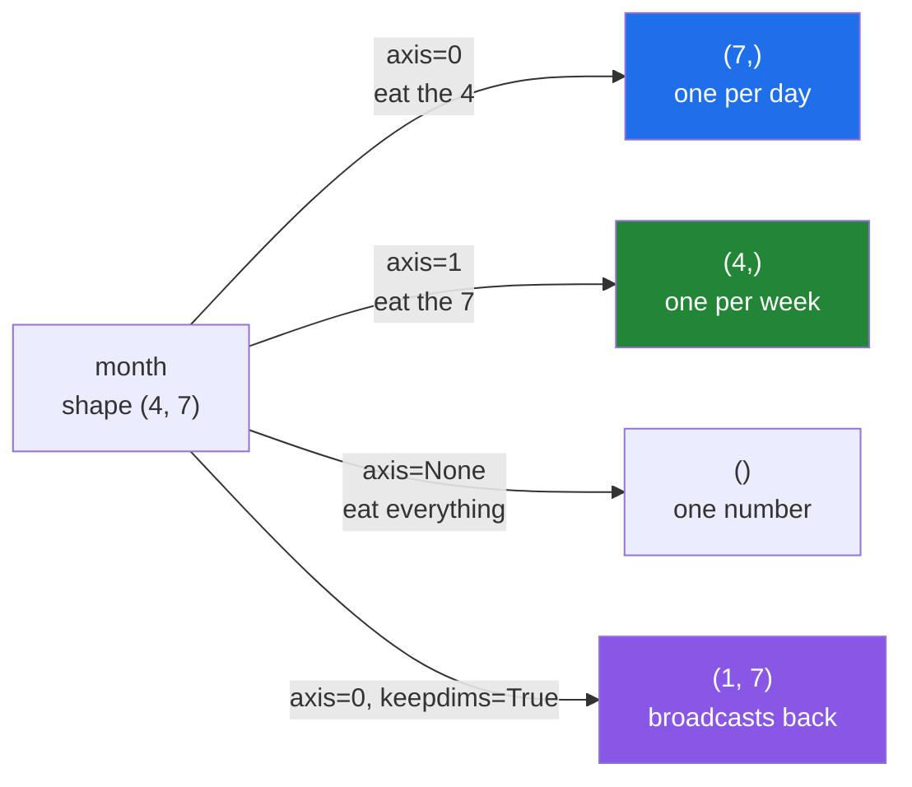

# 2.2 — `axis` — the one that disappears

## One-line answer

`axis=` names the axis a reduction **eats**: the numbers along that axis are combined into one, so
that axis vanishes from the shape and every other axis survives unchanged.

---

## The story

The month of step counts is written on squared paper: four rows, one per week, seven boxes across,
one per day.

Somebody asks two questions about it, and they sound almost the same.

"How did each week go?" — you read along a row, add up seven numbers, and write one number at the end
of the row. Four rows, four answers.

"Which day of the week is my best?" — you read down a column, add up four numbers, and write one
number under the column. Seven columns, seven answers.

Both questions are "add things up". Both are answered by running a finger over the same grid. The only
difference is the **direction** the finger moves, and that difference decides whether you end up with
four numbers or seven.

Getting it backwards is not a small mistake. Ask for the best day of the week, get four numbers back,
and you have quietly answered a different question — one about weeks, labelled as though it were about
days.

---

## The idea in plain language

[2.1](2.1-a-reduction-turns-many-into-one.md) showed reductions that swallow the whole array:
`month.sum()` gives one number for all twenty-eight values. That is the special case, not the normal
one. The normal one names a direction.

An **axis** is one of the numbered directions of an array. A two-dimensional array has two: `axis=0`
runs **down** the rows, and `axis=1` runs **across** the columns. The numbering matches the order of
`arr.shape`, so for a `(4, 7)` array `axis=0` is the 4 and `axis=1` is the 7. You met axis numbers on
Day 22, where they decided which way a shape was stretched
([Day 22, 1.2](../../../day-22-broadcasting-and-shape/parts/01-broadcasting/1.2-the-rule-in-three-lines.md)).

Here is the whole rule, and it is worth learning as a single sentence:

> **The axis you name is the axis that disappears.**

`month` has shape `(4, 7)`. Reduce along `axis=0` and the 4 is consumed: the four weeks are combined
into one number for each of the seven day positions, so the answer has shape `(7,)`. Reduce along
`axis=1` and the 7 is consumed: the seven days of each week are combined, so the answer has shape
`(4,)`.

That phrasing is more reliable than "rows" and "columns". "Rows" stops meaning anything as soon as an
array has three axes, and every array you meet after Day 125 has three or four. "The named axis
disappears" keeps working no matter how many there are.

Three more things `axis=` accepts.

**A negative number**, counted from the end, exactly like a list index
([Day 21, 1.1](../../../day-21-indexing-and-views/parts/01-one-element/1.1-index-and-the-negative-index.md)).
`axis=-1` is always the last axis. This is the form to prefer when a function must work on an array
whose number of axes you do not know, and it is why library code is full of `axis=-1`.

**A tuple**, to eat several axes at once. `month.sum(axis=(0, 1))` consumes both and gives one number.
That is the same answer as `month.sum()`, with the direction stated out loud.

**`None`**, which is the default, and means "every axis". That is why the bare `month.sum()` of
[2.1](2.1-a-reduction-turns-many-into-one.md) collapsed everything.

Finally, the argument that puts the axis back. `keepdims=True` leaves the eaten axis in the shape with
a length of 1 instead of removing it, so `(4, 7)` reduced along `axis=0` becomes `(1, 7)` rather than
`(7,)`. That is not cosmetic. It is what lets the answer broadcast back against the array it came from
([Day 22, 1.4](../../../day-22-broadcasting-and-shape/parts/01-broadcasting/1.4-keepdims-and-the-column.md)).

---

## Why Setu needs it

- **[2.3](2.3-std-var-and-ddof.md) and [2.5](2.5-the-nan-family.md)** take the same `axis=` argument.
  Every reduction on this day does.
- **Day 25's gate module** reports per-week and per-day statistics from one `(weeks, 7)` array. Both
  come out of the same function, and the only difference is the axis.
- **Day 76's feature scaling** subtracts a per-column mean, which is `axis=0` on a `(rows, features)`
  table. Getting it wrong scales every row by its own mean and destroys the features silently.
- **Day 125's softmax** is `axis=-1` with `keepdims=True`, and the version without `keepdims` is one of
  the two most common bugs in hand-written neural network code.
- **Day 155's similarity search** normalises embeddings along `axis=1` — one length per vector, not one
  length per dimension.

---

## The mechanism

The same grid, both directions, and the shapes that come back:

```python
import numpy as np

month = np.array(
    [
        [8213, 10442, 6180, 9000, 12007, 9631, 7204],
        [7788, 9120, 11345, 8402, 6733, 14210, 5096],
        [9004, 8765, 7621, 10188, 9950, 8317, 11002],
        [6540, 12488, 9873, 7106, 8899, 10540, 9218],
    ]
)

print("month.shape      :", month.shape)
print("month.sum()      :", month.sum())
print("axis=0 (per day) :", month.sum(axis=0), month.sum(axis=0).shape)
print("axis=1 (per week):", month.sum(axis=1), month.sum(axis=1).shape)
print("axis=0 keepdims  :", month.sum(axis=0, keepdims=True).shape)
print("axis=(0,1)       :", month.sum(axis=(0, 1)))
print("axis=-1          :", month.sum(axis=-1).shape)
print("mean axis=0      :", month.mean(axis=0).round(1))
print("argmax flat      :", month.argmax())
print("argmax axis=1    :", month.argmax(axis=1))
print("unravel_index    :", np.unravel_index(month.argmax(), month.shape))
```

**Line by line:**

- `month.shape` — `(4, 7)`. Read it as "four of the first thing, seven of the second". The 4 sits at
  position 0, so it is `axis=0`; the 7 sits at position 1, so it is `axis=1`. **The shape tuple is the
  axis numbering**, and there is nothing more to memorise.
- `month.sum()` — no axis named, so every axis is eaten and one number comes out. This is `axis=None`,
  written by leaving it out.
- `month.sum(axis=0)` — the 4 disappears, leaving `(7,)`: seven totals, one per day of the week. The
  finger moved **down** the columns. Say it as "eat the weeks" rather than "sum the columns" and you
  will not get it backwards.
- `month.sum(axis=1)` — the 7 disappears, leaving `(4,)`: four totals, one per week.
- `keepdims=True` — the eaten axis stays at length 1, giving `(1, 7)` instead of `(7,)`. Nothing about
  the numbers changed; only the shape did, and the shape is what decides whether the next broadcast
  lines up.
- `axis=(0, 1)` — a tuple eats both. The answer equals `month.sum()`, which is the point: the default
  is a tuple of every axis, written shorter.
- `axis=-1` — the last axis, counted from the right. On a `(4, 7)` array that is `axis=1`, and on a
  `(32, 4, 7)` array it would still be the sevens. **This is the form that survives an extra axis being
  added later.**
- `month.mean(axis=0).round(1)` — the same direction, a different reduction. Every reduction takes
  `axis=`, so learning it once covers `mean`, `std`, `min`, `max`, `any` and `all`.
- `month.argmax()` — **with no axis this flattens first**, so the answer `12` is a position in the flat
  run of twenty-eight. It is not a row and not a column. This trips people up more than any other
  reduction.
- `month.argmax(axis=1)` — one answer per week: the position **within that row**. Four rows, four
  positions, each in the range 0 to 6.
- `np.unravel_index(month.argmax(), month.shape)` — turns the flat position `12` back into the pair
  `(1, 5)`: week one, Saturday. **This is the only correct way to use a flat `argmax` on a
  two-dimensional array.** Writing `month[month.argmax()]` instead gives you a whole row.

```text
month.shape      : (4, 7)
month.sum()      : 254882
axis=0 (per day) : [31545 40815 35019 34696 37589 42698 32520] (7,)
axis=1 (per week): [62677 62694 64847 64664] (4,)
axis=0 keepdims  : (1, 7)
axis=(0,1)       : 254882
axis=-1          : (4,)
mean axis=0      : [ 7886.2 10203.8  8754.8  8674.   9397.2 10674.5  8130. ]
argmax flat      : 12
argmax axis=1    : [4 5 6 1]
unravel_index    : (np.int64(1), np.int64(5))
```

The seven numbers on the `axis=0` line answer "which day of the week is my best": Saturday, at 42 698
steps across the month. The four numbers on the `axis=1` line answer "how did each week go". Both came
from one grid and one function.

Which axis goes, drawn:



The fourth arrow is the one worth remembering. `(1, 7)` lines up against `(4, 7)` under the
broadcasting rule, and `(7,)` only happens to. When the array is square, `(7,)` lines up too — against
the wrong axis, with no error.

---

## When it breaks

**An axis that does not exist:**

```text
$ uv run python -c "
import numpy as np
month = np.zeros((4, 7))
month.sum(axis=2)
"
Traceback (most recent call last):
  File "<string>", line 4, in <module>
  File "...\numpy\_core\_methods.py", line 49, in _sum
    return umr_sum(a, axis, dtype, out, keepdims, initial, where)
           ^^^^^^^^^^^^^^^^^^^^^^^^^^^^^^^^^^^^^^^^^^^^^^^^^^^^^
numpy.exceptions.AxisError: axis 2 is out of bounds for array of dimension 2
```

**What it means.** A `(4, 7)` array has axes 0 and 1, and that is all. `axis=2` would be a third
direction that does not exist. Read the message as a count: *dimension 2* is the number of axes, so the
legal values are `0`, `1`, `-1` and `-2`. In practice this appears when a function written for
`(rows, features, time)` data is handed a `(rows, features)` array. The fix is upstream — the array
lost an axis earlier, usually to a `.squeeze()` or to an index that should have been a slice
([Day 22, 4.4](../../../day-22-broadcasting-and-shape/parts/04-joining-and-splitting/4.4-newaxis-and-expand-dims.md)).

**An axis on a one-dimensional array:**

```text
$ uv run python -c "
import numpy as np
np.array([1, 2, 3]).sum(axis=1)
"
Traceback (most recent call last):
  File "<string>", line 3, in <module>
  File "...\numpy\_core\_methods.py", line 49, in _sum
    return umr_sum(a, axis, dtype, out, keepdims, initial, where)
           ^^^^^^^^^^^^^^^^^^^^^^^^^^^^^^^^^^^^^^^^^^^^^^^^^^^^^
numpy.exceptions.AxisError: axis 1 is out of bounds for array of dimension 1
```

**What it means.** The same error, and this is the one you will actually meet. A `(4, 7)` array indexed
with `month[0]` gives a `(7,)` array, because the axis was consumed by the index
([Day 21, 1.3](../../../day-21-indexing-and-views/parts/01-one-element/1.3-slicing-one-axis.md)). Code
written for the grid then asks for `axis=1` on a single row. `AxisError` is a subclass of both
`ValueError` and `IndexError`, so an existing `except ValueError` is already catching it, quite
possibly by accident.

**The axis that was silently wrong:**

```text
$ uv run python -c "
import numpy as np
square = np.arange(49).reshape(7, 7)
print('axis=0 :', square.sum(axis=0))
print('axis=1 :', square.sum(axis=1))
print('same shape:', square.sum(axis=0).shape == square.sum(axis=1).shape)
"
axis=0 : [147 154 161 168 175 182 189]
axis=1 : [ 21  70 119 168 217 266 315]
same shape: True
```

**What it means.** This is the failure with no error text, which is why it gets its own block. On a
square array both axes give the same shape, so every shape assertion downstream passes, every plot
draws, and every number is wrong. The array in a real pipeline is `(batch, features)`, and it is square
exactly once — on the day somebody runs it with a batch size that happens to equal the feature count.
**Test on a rectangular fixture, never a square one**, which is the rule Day 22's test file was built
around
([Day 22, 5.2](../../../day-22-broadcasting-and-shape/parts/05-the-module/5.2-the-test-that-can-go-red.md)).

---

## In production

**What a professional writes instead of the teaching version.** They never pass a bare axis number
across a function boundary. The axis is named once, next to the shape it belongs to:

```python
from __future__ import annotations

import numpy as np

WEEK_AXIS = 0  # (weeks, 7): eating this gives one number per day of the week
DAY_AXIS = -1  # eating this gives one number per week; -1 survives a batch axis being added


def per_day_of_week(weeks: np.ndarray) -> np.ndarray:
    """One mean per day of the week, learned across every week given."""
    if weeks.ndim != 2:
        raise ValueError(f"expected (weeks, days), got {weeks.ndim} axes: shape {weeks.shape}")
    return np.nanmean(weeks, axis=WEEK_AXIS)


def per_week(weeks: np.ndarray) -> np.ndarray:
    """One mean per week, whatever leading axes the caller has stacked on."""
    return np.nanmean(weeks, axis=DAY_AXIS)
```

**Line by line:**

- `WEEK_AXIS = 0` with the shape written in the comment — the constant is worth nothing without the
  shape it refers to, because `axis=0` means something different for `(weeks, days)` than for
  `(days, weeks)`. **The comment is the contract.**
- `DAY_AXIS = -1` rather than `1` — `per_week` then works unchanged on `(weeks, 7)` and on
  `(people, weeks, 7)`. Positive axis numbers count from the left, so they break the moment somebody
  stacks a batch axis on the front, and that always happens eventually.
- `weeks.ndim != 2` in `per_day_of_week`, and no such check in `per_week` — a deliberate asymmetry.
  `per_day_of_week` uses a positive axis, so it is only correct for exactly two axes and must say so.
  `per_week` uses `-1`, so it does not care. **A function that checks `ndim` is telling you it uses a
  positive axis.**
- The message includes `weeks.shape`, not only `weeks.ndim`. When this fires at three in the morning,
  the shape is the thing that identifies which array arrived wrong.
- `np.nanmean` rather than `mean` — a real month has days nobody recorded, and `mean` returns `nan` for
  the whole row if one value is missing ([2.5](2.5-the-nan-family.md)).

**What changes at scale.** The axis you eat decides how much memory the machine touches, not only what
the answer means. NumPy stores a `(rows, cols)` array row by row
([Day 20, 1.3](../../../day-20-arrays-and-dtypes/parts/01-the-block/1.3-one-block-and-strides.md)), so
reducing along the last axis walks straight through memory in order. Reducing along the first axis
jumps a row's width between every pair of values it adds. On arrays that fit in cache the difference is
nothing. On a multi-gigabyte array the wrong direction can cost several times the run time for an
identical answer, which is why `axis=-1` is the fast direction for C-ordered data, and why libraries
that care put the reduced axis last.

**The failure that only appears with real data.** A feature pipeline scaled its columns with
`X - X.mean(axis=1, keepdims=True)` — a per-**row** mean, written where a per-column one was meant.
Every test passed, because the test fixture was ten rows by ten columns. In production the matrix was
sixty thousand by ten, the operation subtracted each sample's own average from its own features, and
the model's accuracy dropped by a fifth. The bug was found by a reviewer who checked the shape of the
mean, not the shape of the result.

**The review comment a senior engineer leaves.** *"`axis=1` here is a per-row statistic. The docstring
says per-feature. Which is it, and can the fixture be `(3, 5)` so the test can tell?"*

**The interview question.** *"What does `axis=1` mean?"* The axis you name is the one the reduction
eats, so `axis=1` on a `(4, 7)` array combines the seven and leaves four. The detail worth adding is
that `axis=-1` is safer than a positive number, because it keeps meaning "the last axis" when a batch
axis is added on the front, and that `keepdims=True` is not cosmetic — it leaves the eaten axis at
length 1 so the answer broadcasts back against the original. The trap to mention is that on a square
array the wrong axis produces the right shape and the wrong numbers, with no error at all, which is why
test fixtures should never be square.

---

## Check yourself

```bash
uv run python -c "
import numpy as np
month = np.arange(28).reshape(4, 7)
print('axis=0 shape :', month.sum(axis=0).shape)
print('axis=1 shape :', month.sum(axis=1).shape)
print('keepdims     :', month.sum(axis=1, keepdims=True).shape)
print('axis=-1      :', np.array_equal(month.sum(axis=-1), month.sum(axis=1)))
print('flat argmax  :', month.argmax(), '->', np.unravel_index(month.argmax(), month.shape))
print('broadcasts   :', (month - month.mean(axis=1, keepdims=True)).shape)
"
```

Now take the `keepdims=True` off the last line and run it again. Say why it refuses, using the word
"right" about how shapes are lined up.

**Answer out loud, without scrolling up:**

> An array has shape `(32, 4, 7)`. Which axis do you name to get one number per week, and what shape
> comes back? Then say why `axis=-1` is the better spelling of your answer.

---

**Next:** [2.3 — `std`, `var` and the `ddof` nobody states](2.3-std-var-and-ddof.md).
