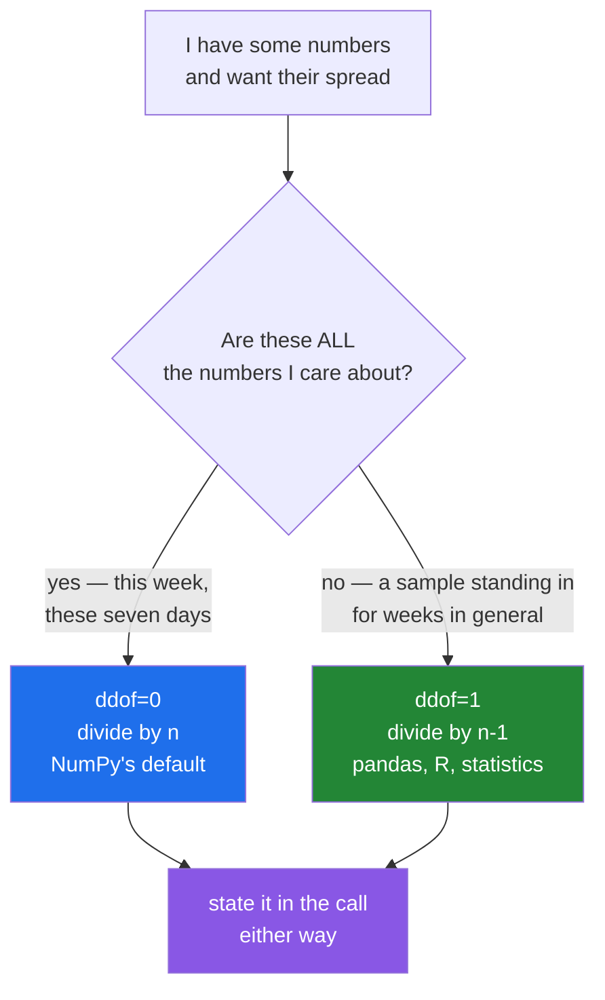

# 2.3 — `std`, `var` and the `ddof` nobody states

## One-line answer

`std` and `var` measure how spread out the numbers are, and NumPy divides by `n` while almost every
other tool divides by `n - 1` — so the `ddof=` argument is the difference between two answers that are
both correct and are not the same.

---

## The story

Two people are looking at the same week of step counts. They agree on the average without any
argument: about nine thousand a day.

Then one of them says "but it was a steady week", and the other says "no it wasn't, Wednesday was
terrible and Friday was huge". They are not disagreeing about the numbers. They are disagreeing about
a second thing the average does not carry: how far the days sat from that average.

So they work it out. Take each day, see how far it is from nine thousand, and average those distances.
Simple enough — except they get two different answers, because one of them divided by seven and the
other divided by six.

Neither of them made an arithmetic mistake. They were answering slightly different questions, and
neither of them said which. That is the whole of this document.

---

## The idea in plain language

The **mean** is one number standing in for many
([2.1](2.1-a-reduction-turns-many-into-one.md)). It says nothing about whether the values huddled
around it or were scattered all over.

**Variance** is the standard measurement of that scatter. You take each value's distance from the mean,
square each distance so that being under counts the same as being over, and then average the squares.
`np.var` does this.

**Standard deviation** is the square root of the variance. Squaring the distances made the units wrong
— squared steps are not a thing anyone can picture — and the square root puts them back, so a standard
deviation of 1 824 steps is a statement about steps. `np.std` does this. They are the same measurement
in two units, and `np.std(x) ** 2` equals `np.var(x)`.

Now the part that causes the arguments. To average the squared distances, you divide by a count. Which
count?

- **Divide by `n`**, the number of values. This describes *these seven days*, exactly, and claims
  nothing about any other week. This is called the **population** variance.
- **Divide by `n - 1`**. This treats the seven days as a **sample** — a handful drawn from some larger
  set of all possible weeks — and estimates the spread of that larger set. This is called the **sample**
  variance.

The reason `n - 1` is not arbitrary: you did not know the true mean of the larger set, so you used
these seven values' own mean instead. The values are, by construction, closer to their own mean than to
the true one, so dividing by `n` gives an answer that is systematically a bit too small. Dividing by
`n - 1` cancels exactly that bias out. The subtracted 1 is the one piece of information you spent on
estimating the mean.

NumPy exposes the choice as **`ddof`**, short for **delta degrees of freedom**. The divisor is
`n - ddof`. So `ddof=0` is the population version and `ddof=1` is the sample version.

**NumPy defaults to `ddof=0`.** This is the detail that matters, because most other tools default the
other way — pandas, R and the `statistics` module in the standard library all default to the sample
version. Two programs computing "the standard deviation" of the same column will therefore disagree,
and nothing in either program says so.

On seven values the gap is not subtle. The ratio between the two variances is exactly `n / (n - 1)`,
which for seven values is about 1.167 — a sixteen per cent difference in variance, and about eight per
cent in standard deviation. On seven million values the ratio is 1.0000001 and nobody would ever
notice. **The default only hurts on small groups, which is exactly where per-group statistics live.**

---

## Why Setu needs it

- **Day 25's gate module** reports a standard deviation per week, over seven values. That is precisely
  the size where `ddof` changes the answer visibly, so the module must state it.
- **Day 58's statistics phase** is built on this distinction, and Day 69's confidence intervals are
  wrong by a fixed factor if the wrong divisor is used.
- **Day 76's standard scaler** divides features by a standard deviation. scikit-learn uses `ddof=0`
  there, deliberately, and a hand-rolled scaler using `ddof=1` will not reproduce it.
- **Day 91 onwards**, any metric reported "± one standard deviation" across five cross-validation folds
  is computed on five numbers, where `n` against `n - 1` is a twelve per cent difference in the error
  bar you publish.

---

## The mechanism

One week, both divisors, and the exact ratio between them:

```python
import numpy as np

month = np.array(
    [
        [8213, 10442, 6180, 9000, 12007, 9631, 7204],
        [7788, 9120, 11345, 8402, 6733, 14210, 5096],
        [9004, 8765, 7621, 10188, 9950, 8317, 11002],
        [6540, 12488, 9873, 7106, 8899, 10540, 9218],
    ]
)
week = month[0]

print("week        :", week)
print("var  ddof=0 :", week.var())
print("var  ddof=1 :", week.var(ddof=1))
print("std  ddof=0 :", round(float(week.std()), 4))
print("std  ddof=1 :", round(float(week.std(ddof=1)), 4))
print(
    "ratio       :", round(float(week.var(ddof=1) / week.var()), 6), "= n/(n-1) =", round(7 / 6, 6)
)
print("month std0  :", round(float(month.std()), 4))
print("std axis=0  :", month.std(axis=0).round(2))
```

**Line by line:**

- `week = month[0]` — seven values, which is small enough for `ddof` to matter and small enough to
  check by hand. Indexing one row consumes an axis, so `week` has shape `(7,)`
  ([Day 21, 1.3](../../../day-21-indexing-and-views/parts/01-one-element/1.3-slicing-one-axis.md)).
- `week.var()` — no `ddof` given, so `ddof=0`. The divisor is 7. **This is the line whose silence is
  the problem**: nothing in it says which of the two questions is being answered.
- `week.var(ddof=1)` — the divisor is 6. Same data, same code path, larger answer.
- `round(float(...), 4)` — `float()` first because a NumPy reduction returns a `np.float64`, not a
  Python `float`
  ([Day 20, 2.5](../../../day-20-arrays-and-dtypes/parts/02-dtypes/2.5-nep-50-and-the-python-number.md)),
  and rounding only so the two standard deviations line up on screen.
- `week.var(ddof=1) / week.var()` — the ratio is printed rather than asserted, because seeing it come
  out at exactly `7 / 6` is what makes the rule stick. **The ratio never depends on the data**, only on
  `n`.
- `month.std()` — no axis, so all twenty-eight values at once. This is the spread of the whole month
  including the differences between weeks, which is a different quantity from any per-week spread.
- `month.std(axis=0)` — seven answers, one per day of the week, each over four values
  ([2.2](2.2-axis-the-one-that-disappears.md)). Four values is small enough that `ddof=1` would raise
  each of these numbers by about fifteen per cent.

```text
week        : [ 8213 10442  6180  9000 12007  9631  7204]
var  ddof=0 : 3328864.9795918367
var  ddof=1 : 3883675.8095238097
std  ddof=0 : 1824.5177
std  ddof=1 : 1970.7044
ratio       : 1.166667 = n/(n-1) = 1.166667
month std0  : 1996.6628
std axis=0  : [ 891.37 1459.37 1992.15 1110.3  1901.5  2188.87 2207.64]
```

A hundred and forty-six steps separate the two standard deviations. If you report "9 000 ± 1 825" and
somebody else reports "9 000 ± 1 971" for the same week, neither of you is wrong and one of you has to
say which divisor you used.

The decision, as a question you can answer in one word:



The last box is the actual advice. The choice is defensible in both directions; leaving it implicit is
not.

---

## When it breaks

**`ddof` as large as the count:**

```text
$ uv run python -c "
import numpy as np
print('one value, ddof=1 :', np.array([5.0]).var(ddof=1))
"
<string>:3: RuntimeWarning: Degrees of freedom <= 0 for slice
...\numpy\_core\_methods.py:211: RuntimeWarning: invalid value encountered in scalar divide
  ret = ret.dtype.type(ret / rcount)
one value, ddof=1 : nan
```

**What it means.** The divisor is `n - ddof`, which here is `1 - 1 = 0`. Dividing by zero gives `nan`,
and NumPy warns twice: once to say the degrees of freedom went to zero, and once from the division
itself. **It does not raise.** The `nan` flows onward into whatever used it, and the warning scrolls
past in a log nobody reads. This is the failure mode of per-group statistics: group by user, and the
users with exactly one record produce `nan` standard deviations while every other group looks fine. The
fix is to count first and refuse the group, or to use `ddof=0` where a single-value group legitimately
has zero spread.

**A variance that came out negative:**

```text
$ uv run python -c "
import numpy as np
big = np.array([1e9 + 4.0, 1e9 + 7.0, 1e9 + 13.0, 1e9 + 16.0])
n = big.size
naive = (big**2).sum() / n - (big.sum() / n) ** 2
print('textbook formula :', naive)
print('np.var()         :', big.var())
print('true answer      :', np.array([4.0, 7.0, 13.0, 16.0]).var())
"
textbook formula : -128.0
np.var()         : 22.5
true answer      : 22.5
```

**What it means.** The formula every textbook prints — the mean of the squares minus the square of the
mean — is algebraically correct and numerically useless. Both terms here are about `1e18`, they differ
by about 22, and a `float64` carries roughly sixteen significant digits, so the difference is computed
from digits that were rounded away
([Day 20, 2.3](../../../day-20-arrays-and-dtypes/parts/02-dtypes/2.3-floats-nan-and-precision.md)). The
answer comes out **negative**, which a variance cannot be. `np.var` does not use that formula: it
subtracts the mean first and then squares, so the numbers being squared are small. **If you ever
implement variance by hand, subtract the mean first**, and if you see a negative variance in somebody
else's code you have just found this bug.

**The same data in `float32`:**

```text
$ uv run python -c "
import numpy as np
b32 = np.array([1e9 + 4.0, 1e9 + 7.0, 1e9 + 13.0, 1e9 + 16.0], dtype=np.float32)
print('values   :', b32)
print('variance :', b32.var())
"
values   : [1.e+09 1.e+09 1.e+09 1.e+09]
variance : 0.0
```

**What it means.** Nothing went wrong in the variance at all — the data was destroyed before it got
there. A `float32` holds about seven significant digits, so `1e9 + 4` and `1e9 + 16` both round to the
same stored value on the way in. All four values became identical, and identical values genuinely have
zero spread. The lesson is that a suspicious statistic is often a dtype problem one step earlier, and
the way to check is to print the array, not the answer.

---

## In production

**What a professional writes instead of the teaching version.** The divisor is named in the signature,
and the group too small to have a spread is refused rather than allowed to produce `nan`:

```python
from __future__ import annotations

import numpy as np


def spread(values: np.ndarray, *, sample: bool) -> np.float64:
    """Standard deviation of ``values``.

    ``sample=True`` divides by n-1 and estimates the spread of the wider population these
    values were drawn from. ``sample=False`` divides by n and describes only these values.
    The caller must choose, because the two answers differ by sqrt(n/(n-1)) and no default
    is right for both.
    """
    ddof = 1 if sample else 0
    n = np.count_nonzero(~np.isnan(values))
    if n - ddof < 1:
        raise ValueError(f"need more than {ddof} non-missing values, got {n}")
    return np.nanstd(values, ddof=ddof, dtype=np.float64)
```

**Line by line:**

- `*, sample: bool` — keyword-only, so no call site can pass it by position and no reader has to guess
  what a bare `True` meant
  ([Day 10, 1.5](../../../day-10-functions/parts/01-the-signature/1.5-keyword-only-and-positional-only.md)).
  **There is no default**, which is the whole design: the function refuses to make the choice silently
  that NumPy makes silently.
- `sample: bool` rather than `ddof: int` — the argument is named for the question, not for the
  arithmetic. A caller who knows their statistics can still say what they want; a caller who does not is
  asked something answerable.
- `np.count_nonzero(~np.isnan(values))` — the count of values that actually exist, not `values.size`.
  A week with two missing days has five real values, so the divisor must be built from five
  ([2.5](2.5-the-nan-family.md)). `~` is elementwise `not` on a boolean array
  ([Day 21, 3.3](../../../day-21-indexing-and-views/parts/03-boolean-masks/3.3-and-or-not-and-why-and-raises.md)).
- `if n - ddof < 1` — the exact condition NumPy warns about, checked before the call so it becomes an
  exception with a useful message instead of a `nan` and two lines in a log.
- `np.nanstd(..., ddof=ddof)` — the `nan`-aware version, so one unrecorded day does not turn the whole
  answer into `nan`.
- `dtype=np.float64` — the accumulation dtype, stated. On a `float32` input the sum of squared
  deviations accumulates in `float64` and the answer stops drifting with the array's length
  ([2.6](2.6-float-summation-and-the-drift.md)).
- The return type is `np.float64`, not `float`. Say so, because a caller serialising it to JSON will
  discover the difference
  ([Day 20, 2.5](../../../day-20-arrays-and-dtypes/parts/02-dtypes/2.5-nep-50-and-the-python-number.md)).

**What changes at scale.** Two things, in opposite directions. The `ddof` choice stops mattering: at a
million values the two answers agree to six decimal places, so the argument becomes documentation
rather than arithmetic. Accumulation error starts mattering instead: `var` sums `n` squared deviations,
and in `float32` that sum drifts as `n` grows, so a `float32` array of a hundred million values needs
`dtype=np.float64` to give a stable answer ([2.6](2.6-float-summation-and-the-drift.md)). The other
scale problem is memory — `np.var` makes a temporary array of deviations the same size as the input, so
variance over a 4 GB array briefly needs 8 GB. The streaming alternative keeps a running count, mean and
sum of squared deviations, updating each as values arrive, and needs three numbers instead of a second
copy of the data. That is the algorithm behind every database's `stddev()` and every metrics agent.

**The failure that only appears with real data.** A dashboard reported per-user activity spread. It was
verified against a notebook that used pandas, and it disagreed with the production service that used
NumPy — always slightly, never by enough to look like a bug. Nobody suspected the default, because
neither program mentioned `ddof` anywhere. The users with a single recorded session made it visible in
the end: pandas gave `NaN` for them and NumPy gave `0.0`, and that difference was too large to explain
away. Both tools had been right the whole time about different questions.

**The review comment a senior engineer leaves.** *"`.std()` here is `ddof=0`, but the notebook this is
meant to reproduce used pandas, which is `ddof=1`. On seven-day windows that is an eight per cent
difference in the number we alert on. Please state `ddof=` explicitly and say which one the alert
threshold was tuned against."*

**The interview question.** *"What is `ddof` and what does NumPy default to?"* `ddof` is the delta
degrees of freedom: the divisor for the variance is `n - ddof`, so `ddof=0` is the population variance
and `ddof=1` is the sample variance that corrects for having estimated the mean from the same data.
NumPy defaults to `0`, while pandas, R and the standard library's `statistics` module default to `1`,
so the same column gets two different standard deviations depending on which tool you asked. The ratio
is exactly `n / (n - 1)` in variance, so it is invisible at a million values and about sixteen per cent
at seven, which means it matters most for per-group statistics, cross-validation error bars and rolling
windows. The follow-up worth volunteering is that `ddof >= n` gives `nan` with a warning rather than an
error, and that the textbook `E[x²] - E[x]²` formula can return a negative variance on large values,
which is why `np.var` subtracts the mean first.

---

## Check yourself

```bash
uv run python -c "
import numpy as np
week = np.array([8213, 10442, 6180, 9000, 12007, 9631, 7204], dtype=np.float64)
print('var ddof=0 :', week.var())
print('var ddof=1 :', week.var(ddof=1))
print('ratio      :', week.var(ddof=1) / week.var(), 'and n/(n-1) is', 7 / 6)
print('std**2==var:', np.isclose(week.std() ** 2, week.var()))
print('two values :', np.array([1.0, 3.0]).var(ddof=1))
print('one value  :', np.array([1.0]).var(ddof=1))
"
```

The last line prints `nan` and warns twice. Say which of the two warnings you would grep for in a log,
and why the other one is the less useful of the pair.

**Answer out loud, without scrolling up:**

> Your colleague's pandas notebook and your NumPy service report different standard deviations for the
> same seven numbers. Say why, give the exact ratio between the two answers, and say what you would
> change in the code so the question never comes up again.

---

**Next:** [2.4 — `median`, `percentile` and `quantile`](2.4-median-percentile-and-quantile.md).
