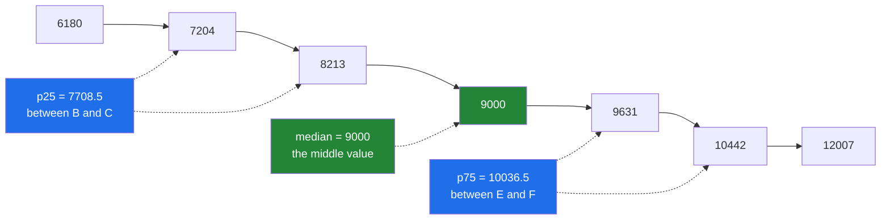

# 2.4 — `median`, `percentile` and `quantile` — the summary one bad day cannot move

## One-line answer

The **median** is the middle value once the numbers are in order, `percentile` and `quantile` are the
same idea at any position rather than the middle, and all three are unmoved by a single extreme value
in a way the mean never is.

---

## The story

Somebody wears a step counter every day for a week, and one of those days they walk a marathon
distance for charity. Forty thousand steps.

At the end of the week they look at the average and it says twelve thousand a day. That is not a lie
exactly, but it is not a description of their week either. Six of the seven days were nothing like
twelve thousand. One enormous day dragged the average up, and the number now describes a week that
nobody actually had.

So they try something else. They write the seven days out in order, smallest to largest, and point at
the one in the middle. That number is about nine thousand, and it is a much better answer to "what is a
normal day for you", because the charity walk is still in the list — it is just at the end of it, where
it counts once, like every other day.

They have not thrown the big day away. They have stopped letting its **size** vote, and let only its
**position** vote.

---

## The idea in plain language

The mean adds every value up and divides. Every value's exact size affects the answer, so one very
large value pulls the answer towards itself as far as it likes.

The **median** works differently. Sort the values, then take the one in the middle. With seven values
the middle is the fourth. With an even count there is no single middle, so the convention is to average
the two middle values — that is why the median of six numbers can be a value that does not appear in
the data at all.

The median only cares about **order**. Make the largest value ten times larger and it is still the
largest, still at the end of the sorted list, and the middle has not moved. This property has a name:
the median is **robust**, meaning a small number of extreme values cannot drag it far. The mean is not
robust.

An **outlier** is a value far away from the rest. The charity walk is one. Outliers are not always
mistakes — sometimes they are the most interesting thing in the data — but they should not be allowed
to quietly redefine what "typical" means.

Once you have the idea of "the value at a position in the sorted list", the median is just one case of
it. The **percentile** generalises it to any position, described as a percentage of the way through:
the 50th percentile is the median, the 25th is a quarter of the way up, and the 90th is the value that
ninety per cent of the data sits below. `np.percentile` takes that percentage from 0 to 100.
`np.quantile` is the identical function with the position given as a fraction from 0 to 1, so
`np.quantile(x, 0.25)` and `np.percentile(x, 25)` are the same call.

There is one complication, and it is the reason percentile has an argument most people never touch.
With seven values there is no value exactly a quarter of the way along — a quarter of the way between
the second and third positions is not a position any value occupies. Something has to decide what to
return. NumPy's default, `method="linear"`, walks a straight line between the two neighbouring values
and returns a point on it. Eight other methods exist, each making a different defensible choice, and
they are catalogued in *Sample Quantiles in Statistical Packages* (1996, DOI
10.1080/00031305.1996.10473566, <https://doi.org/10.1080/00031305.1996.10473566>), which is where the
names `hazen`, `weibull` and `median_unbiased` come from. **They give different answers on small
inputs and converge as the input grows.**

One last term, because it appears everywhere from box plots to alerting. The **interquartile range**,
written IQR, is the 75th percentile minus the 25th: the width of the middle half of the data. It is the
robust counterpart of the standard deviation from [2.3](2.3-std-var-and-ddof.md).

---

## Why Setu needs it

- **Day 25's gate module** reports both a mean and a median, because a summary that reports only one of
  them cannot show that a distribution is skewed.
- **Day 84's exploratory analysis** opens with the five-number summary — minimum, p25, median, p75,
  maximum — which is exactly one `np.percentile` call.
- **Day 76's outlier handling** clips features at p1 and p99 rather than at a fixed number, because the
  right cut-off depends on the data and a percentile is how you ask the data for it.
- **Day 172 onwards**, every latency figure you report about a language model call is a percentile.
  Mean latency hides the slow tail; p95 and p99 are what a service level objective is written in.
- **Day 36's box plot** draws the median, the two quartiles and a whisker length defined as a multiple
  of the IQR, so the chart is a picture of this document.

---

## The mechanism

The same week, summarised four ways:

```python
import numpy as np

month = np.array(
    [
        [8213, 10442, 6180, 9000, 12007, 9631, 7204],
        [7788, 9120, 11345, 8402, 6733, 14210, 5096],
        [9004, 8765, 7621, 10188, 9950, 8317, 11002],
        [6540, 12488, 9873, 7106, 8899, 10540, 9218],
    ]
)
week = month[0]

print("week sorted   :", np.sort(week))
print("mean          :", round(float(week.mean()), 2))
print("median        :", np.median(week))
print("median of six :", np.median(week[:6]), "from", np.sort(week[:6]))
print("percentile 50 :", np.percentile(week, 50))
print("quantile 0.5  :", np.quantile(week, 0.5))
print("p25 p75       :", np.percentile(week, [25, 75]))
print("IQR           :", float(np.diff(np.percentile(week, [25, 75]))[0]))
print("median axis=1 :", np.median(month, axis=1))
```

**Line by line:**

- `np.sort(week)` — printed first because every other line on this list is a statement about that sorted
  order, and seeing it makes the rest checkable by eye. `np.sort` returns a **new** array and leaves
  `week` alone ([3.1](../03-sorting-and-searching/3.1-sort-and-the-copy.md)).
- `week.mean()` — 8 953.86, which sits between the third and fourth sorted values. On this week the mean
  and the median are close, because this week has no charity walk in it.
- `np.median(week)` — 9 000, the fourth of seven sorted values. It is a **function**, not a method:
  there is no `week.median()`, which surprises everyone once.
- `np.median(week[:6])` — six values, so no single middle. The answer 9 315.5 is the average of 9 000
  and 9 631, and **it is not one of the six numbers**. Any code that assumes a median is a real
  observation is wrong half the time.
- `np.percentile(week, 50)` — the same 9 000. The median is the 50th percentile, and printing both is
  the cheapest way to fix that in memory.
- `np.quantile(week, 0.5)` — identical again. `percentile` takes 0 to 100; `quantile` takes 0 to 1.
  **Pick one spelling for a codebase and stick to it**, because mixing them is how `np.quantile(x, 95)`
  gets written.
- `np.percentile(week, [25, 75])` — a **list** of positions gives an array of answers in one pass over
  the data. Two separate calls would sort the array twice.
- `np.diff(...)[0]` — the difference between the two, which is the IQR: 2 328 steps. `np.diff` returns
  one fewer value than it was given, so a two-element input gives a one-element answer
  ([2.1](2.1-a-reduction-turns-many-into-one.md)).
- `np.median(month, axis=1)` — `axis=` works here exactly as it does for every reduction
  ([2.2](2.2-axis-the-one-that-disappears.md)): eat the seven, keep the four, one median per week.

```text
week sorted   : [ 6180  7204  8213  9000  9631 10442 12007]
mean          : 8953.86
median        : 9000.0
median of six : 9315.5 from [ 6180  8213  9000  9631 10442 12007]
percentile 50 : 9000.0
quantile 0.5  : 9000.0
p25 p75       : [ 7708.5 10036.5]
IQR           : 2328.0
median axis=1 : [9000. 8402. 9004. 9218.]
```

Note that `median` returned `9000.0`, a float, from an array of integers. Averaging two middle values
can produce a half, so the function promotes to float for every input rather than sometimes.

Now the argument nobody touches, shown on the one input size where it matters:

```python
import numpy as np

week = np.array([8213, 10442, 6180, 9000, 12007, 9631, 7204])

for name in [
    "inverted_cdf",
    "averaged_inverted_cdf",
    "closest_observation",
    "interpolated_inverted_cdf",
    "hazen",
    "weibull",
    "linear",
    "median_unbiased",
    "normal_unbiased",
]:
    print(f"  {name:26s}", np.percentile(week, 25, method=name))
```

**Line by line:**

- The list is every method NumPy accepts, in the order its documentation lists them, and `linear` in the
  middle is the default you get by not passing the argument at all.
- `f"  {name:26s}"` — a fixed field width so the answers line up in a column, which is the only way the
  spread between them is visible at a glance
  ([Day 7, 3.2](../../../day-07-strings/parts/03-formatting/3.2-the-format-spec.md)).
- `np.percentile(week, 25, method=name)` — the same data and the same requested position every time.
  **Every difference below comes from the method alone.**
- The methods are not ranked. `inverted_cdf` returns a value that is actually in the data, which matters
  when the values are categories or prices; `linear` returns a point between two of them, which matters
  when you want the estimate to move smoothly as data arrives; `median_unbiased` is chosen when the
  percentile feeds a further statistical calculation.

```text
  inverted_cdf               7204
  averaged_inverted_cdf      7204.0
  closest_observation        7204
  interpolated_inverted_cdf  6948.0
  hazen                      7456.25
  weibull                    7204.0
  linear                     7708.5
  median_unbiased            7372.166666666666
  normal_unbiased            7393.1875
```

Seven hundred and sixty steps separate the smallest answer from the largest, on the same seven numbers.
Note also that `inverted_cdf` returned an **integer** while `linear` returned a float — the method
changes the dtype of the result, which is enough on its own to break a downstream comparison.

Where each summary looks in the sorted data:



The two dotted pairs are why `method=` exists: p25 and p75 fall **between** observations, and something
has to decide where.

---

## When it breaks

**A percentile outside the range:**

```text
$ uv run python -c "
import numpy as np
np.percentile(np.array([1, 2, 3]), 150)
"
Traceback (most recent call last):
  File "<string>", line 3, in <module>
ValueError: Percentiles must be in the range [0, 100]
```

**What it means.** Exactly what it says, and the reason to show it is the sibling error one line below.

**A quantile given a percentile:**

```text
$ uv run python -c "
import numpy as np
np.quantile(np.array([1, 2, 3]), 50)
"
Traceback (most recent call last):
  File "<string>", line 3, in <module>
ValueError: Quantiles must be in the range [0, 1]
```

**What it means.** Somebody wrote `quantile` and thought `percentile`. This is the single most common
mistake with these two functions, and NumPy catches it — **but only because 50 is outside `[0, 1]`**.
The dangerous version is `np.quantile(x, 0.95)` written where `np.percentile(x, 95)` was meant in a
codebase that uses both: both are legal, both return a number, and one of them is the 95th percentile
while the other is the 0.95th. Neither raises.

**One missing value takes the median with it:**

```text
$ uv run python -c "
import numpy as np
w = np.array([8213., 10442., 6180., np.nan, 12007., 9631., 7204.])
print('median      :', np.median(w))
print('nanmedian   :', np.nanmedian(w))
print('nanpercentile p75 :', np.nanpercentile(w, 75))
"
median      : nan
nanmedian   : 8922.0
nanpercentile p75 : 10239.25
```

**What it means.** A `nan` has no position in a sorted order, because it compares false against
everything including itself, so NumPy refuses to guess and returns `nan` for the whole answer. This is
the same policy as `mean`, and it has the same fix: the `nan`-prefixed version
([2.5](2.5-the-nan-family.md)). Note that `nanmedian` here returned 8 922.0 — the average of the two
middle values of the **six** remaining numbers, because dropping one value turned an odd count into an
even one.

---

## In production

**What a professional writes instead of the teaching version.** One call, every summary, and the method
stated:

```python
from __future__ import annotations

from dataclasses import dataclass

import numpy as np

QUARTILES = (25.0, 50.0, 75.0)


@dataclass(frozen=True, slots=True)
class Spread:
    """The robust summary of one run of counts. Every field is in the input's units."""

    p25: float
    median: float
    p75: float

    @property
    def iqr(self) -> float:
        """The width of the middle half — the robust counterpart of a standard deviation."""
        return self.p75 - self.p25


def spread(counts: np.ndarray) -> Spread:
    """Quartiles of ``counts``, ignoring days that were never recorded."""
    if np.count_nonzero(~np.isnan(counts)) < 4:
        raise ValueError("quartiles of fewer than four values describe nothing")
    p25, median, p75 = np.nanpercentile(counts, QUARTILES, method="linear")
    return Spread(p25=float(p25), median=float(median), p75=float(p75))
```

**Line by line:**

- `QUARTILES = (25.0, 50.0, 75.0)` as a module constant — one pass over the data for all three, and one
  place to change if the service later wants p90 as well. Floats rather than integers so the dtype of
  the request never influences the dtype of the answer.
- `@dataclass(frozen=True, slots=True)` — three floats that belong together and must not be edited after
  the fact ([Day 19, 2.3](../../../day-19-typing-dataclasses-and-concurrency/parts/02-dataclasses/2.3-frozen-slots-kw-only.md)).
  Returning a bare tuple would make every call site guess the order, and the order of `p25` and `p75`
  is exactly the kind of thing that gets swapped silently.
- `iqr` as a `@property` rather than a stored field — it is derived, so storing it would let it disagree
  with the three values it comes from.
- `np.count_nonzero(~np.isnan(counts)) < 4` — the guard is about the **real** values, not the array
  length. Three observations cannot express a quartile in any meaningful sense, and NumPy will happily
  compute one anyway.
- `method="linear"` written out even though it is the default — this is the argument the answer changes
  with, and a reader comparing these numbers against a dashboard, a database's `percentile_cont`, or a
  notebook needs to know which of the nine was used. **The default is not the same across tools.**
- `np.nanpercentile(counts, QUARTILES, ...)` — a sequence of positions returns an array of answers, and
  unpacking it into three names is what makes the return statement readable.
- `float(p25)` — converting the NumPy scalar to a Python `float` at the boundary. `np.float64` happens to
  be a subclass of Python's `float`, so JSON would have accepted it uncoverted; `np.float32`, `np.int64`
  and `np.bool_` are not, and are refused. **Converting every scalar on the way out is the discipline that
  does not require remembering which of those is which**
  ([Day 20, 2.5](../../../day-20-arrays-and-dtypes/parts/02-dtypes/2.5-nep-50-and-the-python-number.md)).

**What changes at scale.** The mean is one pass over the data; the median needs the data in order, and
that is a fundamentally more expensive question. On five million values, measured on this machine:

```text
mean       : 3.9 ms
median     : 47.4 ms
partition  : 34.1 ms
median/mean: 12x
```

Twelve times the cost, for one number. `np.median` does not fully sort — it uses `np.partition`, which
only guarantees that the element at the requested position is the one that belongs there
([3.3](../03-sorting-and-searching/3.3-top-k-and-argpartition.md)) — and that is already most of the
run time. Two consequences follow. First, if you need several percentiles, ask for them in **one call**
with a list, because each separate call re-partitions the whole array. Second, at a size where the data
does not fit in memory at all, an exact median is not available: production systems use approximate
quantile sketches, which is what a metrics backend is doing when it shows you a p99, and why two
monitoring tools can disagree about the same p99 without either being broken.

The second scale problem is memory. `np.median` **copies** its input so that partitioning does not
disturb the caller's array, which means a 4 GB array briefly needs 8 GB. `overwrite_input=True` skips
the copy and scrambles the caller's array in exchange — an acceptable trade only when you own the array
and will not read it again, and a nasty surprise otherwise
([Day 21, 2.4](../../../day-21-indexing-and-views/parts/02-the-view-trap/2.4-the-function-that-changed-its-input.md)).

**The failure that only appears with real data.** A team reported average response time and it looked
healthy at 180 ms. Customers kept complaining anyway. The distribution had a long tail: most requests
were fast, a few took eight seconds, and the mean sat in a region where almost no request actually
landed. Switching the dashboard to p50 and p99 showed a p50 of 90 ms and a p99 of 6.4 s, and the
complaints suddenly matched the graph. Nothing about the system had changed — only which summary was
believed.

**The review comment a senior engineer leaves.** *"This computes p50, p90 and p99 in three separate
`np.percentile` calls on a five-million-element array. That partitions it three times. Pass
`[50, 90, 99]` once, and please pin `method=` — the notebook we are being compared against uses a
database percentile that is not `linear`."*

**The interview question.** *"When do you report a median rather than a mean?"* When the distribution is
skewed or has outliers, because the mean lets one extreme value move the answer as far as it likes while
the median only counts its position. The follow-up worth volunteering: the median costs about an order
of magnitude more than the mean because it needs the data in order, `np.median` uses a partition rather
than a full sort and still copies the input unless you pass `overwrite_input=True`, and asking for
several percentiles should be one call with a list rather than several calls. The subtle point that
separates people who have used this from people who have read about it is `method=`: NumPy defaults to
`linear` interpolation between neighbouring observations, other tools default differently, and on small
groups the nine methods disagree by a visible margin — so a percentile in a report is only reproducible
if the method is stated.

---

## Check yourself

```bash
uv run python -c "
import numpy as np
week = np.array([8213, 10442, 6180, 9000, 12007, 9631, 7204])
print('median      :', np.median(week))
print('p50         :', np.percentile(week, 50))
print('q0.5        :', np.quantile(week, 0.5))
print('p25 p75     :', np.percentile(week, [25, 75]))
print('with a walk :', week.copy())
big = week.copy(); big[2] = 40000
print('mean moved  :', round(float(week.mean()), 1), '->', round(float(big.mean()), 1))
print('median moved:', np.median(week), '->', np.median(big))
"
```

The last two lines are the whole document. Say how far each summary moved when one day changed, and
which of the two you would put on a dashboard that people are woken up by.

**Answer out loud, without scrolling up:**

> You need p50, p90 and p99 of a five-million-element array. Write the call, say how many times the
> array gets partitioned, and name the one argument you would pin even though it is already the default.

---

**Next:** [2.5 — the `nan` family](2.5-the-nan-family.md).
