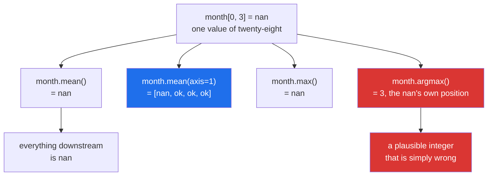

# 2.5 — The `nan` family — one missing day and the answer is gone

## One-line answer

A single `nan` anywhere in an array turns every ordinary reduction over it into `nan`, and the fix is
the parallel family of functions — `nanmean`, `nansum`, `nanmax`, `nanpercentile` — that skip missing
values instead of spreading them.

---

## The story

Somebody has worn a step counter every day this month except one. On the Thursday of the first week the
battery was flat, so there is no number for that day. Not a zero — a blank. Nobody knows how far they
walked.

At the end of the month they ask for the average. The answer comes back blank.

That is annoying, and it is also correct. The honest answer to "what was your average" when one day is
unknown is "I cannot tell you, because I do not know one of the numbers". Filling the gap with a zero
would say they did not move that day, which is a claim nobody has any evidence for. Leaving it out and
dividing by twenty-eight would be arithmetic on twenty-seven numbers, labelled as though it were
twenty-eight.

What they actually want is to be asked the question: should the unknown day be skipped, and if so, is
the answer still called "the monthly average"? Once that question has been answered out loud, the
arithmetic is easy. The trouble only starts when nobody asks it.

---

## The idea in plain language

`nan` stands for **not a number**. It is a special value that a float can hold, alongside all the
ordinary numbers, and it means "there is no value here"
([Day 20, 2.3](../../../day-20-arrays-and-dtypes/parts/02-dtypes/2.3-floats-nan-and-precision.md)). You
have already seen where it comes from: dividing zero by zero produces one
([1.3](../01-ufuncs/1.3-divide-by-zero-warns.md)), and so does reading a CSV with an empty cell in a
numeric column.

`nan` has one rule, and everything about it follows from that rule:

> **Any arithmetic involving `nan` produces `nan`.**

`nan + 1` is `nan`. `nan * 0` is `nan`. And because a sum adds every element in turn, one `nan` in an
array of a million values makes the sum `nan`, which makes the mean `nan`, which makes anything
computed from the mean `nan`. This is called **propagation**, and it is deliberate. The alternative —
quietly ignoring the missing value — would mean a program can never tell the difference between
"the average is 9 106" and "the average is 9 106 as far as I know, but some data was missing".

`nan` also has a stranger property, and it is the one that breaks code written by people who have not
met it. **`nan` is not equal to anything, including itself.** `np.nan == np.nan` is `False`. That means
you cannot find missing values by comparing against `np.nan`, and a mask built that way silently matches
nothing. The correct test is `np.isnan(arr)`, a ufunc that returns a boolean array
([Day 21, 3.1](../../../day-21-indexing-and-views/parts/03-boolean-masks/3.1-a-comparison-makes-an-array.md)).
The same property is why `nan` has no place in a sorted order, which is why it broke the median in
[2.4](2.4-median-percentile-and-quantile.md).

NumPy's answer to all of this is a second family of functions with `nan` on the front. `np.nanmean`
computes a mean over the values that exist and divides by how many of them there were. `np.nansum`,
`np.nanstd`, `np.nanmin`, `np.nanmax`, `np.nanmedian`, `np.nanpercentile`, `np.nanargmax` and a handful
more all behave the same way. **They are not a repair. They are a different question**, asked
deliberately: "summarise the values I have" instead of "summarise all the values".

Two of them behave in a way worth stating in advance, because it catches people out. `np.nansum` of an
array that is entirely `nan` returns **`0.0`**, on the grounds that the sum of no numbers is zero.
`np.nanmean` of the same array returns `nan` with a warning, because the mean of no numbers is not
defined. The two functions disagree about the same input, and both are defensible.

---

## Why Setu needs it

- **Day 25's gate module** must produce a summary of a month that has a hole in it, which is what every
  real month has. A module that returns `nan` for any month with one missing reading is not usable.
- **Day 22's `DayProfile`** already used `nanmean` to learn per-day means
  ([Day 22, 5.1](../../../day-22-broadcasting-and-shape/parts/05-the-module/5.1-mean-centring-the-month.md)),
  and this is the document that explains why.
- **Day 26 onwards**, pandas is built around missing data and has its own rules that differ from these.
  Knowing NumPy's behaviour first is what makes pandas' behaviour learnable rather than magic.
- **Day 76's imputation** is the decision this document leaves open: once you know a value is missing,
  you choose between dropping the row, filling with a statistic, or modelling the gap — and the choice
  must be made on the training split only, or it leaks
  ([Day 22, 5.1](../../../day-22-broadcasting-and-shape/parts/05-the-module/5.1-mean-centring-the-month.md)).
- **Day 91 onwards**, scikit-learn raises on `nan` in most estimators, so a `nan` that survived this far
  becomes a crash a long way from where it was created.

---

## The mechanism

The month with a real hole in it, summarised both ways:

```python
import numpy as np

month = np.array(
    [
        [8213, 10442, 6180, 9000, 12007, 9631, 7204],
        [7788, 9120, 11345, 8402, 6733, 14210, 5096],
        [9004, 8765, 7621, 10188, 9950, 8317, 11002],
        [6540, 12488, 9873, 7106, 8899, 10540, 9218],
    ],
    dtype=np.float64,
)
month[0, 3] = np.nan  # the Thursday the battery was flat

print("month[0]      :", month[0])
print("mean()        :", month.mean())
print("nanmean()     :", round(float(np.nanmean(month)), 2))
print("mean axis=1   :", month.mean(axis=1))
print("nanmean axis=1:", np.nanmean(month, axis=1).round(2))
print("sum()         :", month.sum())
print("nansum()      :", np.nansum(month))
print("max()         :", month.max(), " nanmax():", np.nanmax(month))
print("argmax()      :", month.argmax(), " nanargmax():", np.nanargmax(month))
print("isnan count   :", np.isnan(month).sum())
print("nan == nan    :", np.nan == np.nan)
print("in array      :", (month == np.nan).sum())
```

**Line by line:**

- `dtype=np.float64` on the array — **required**, and this is the first thing to learn. `nan` is a float
  value, so an integer array cannot hold one. Assigning `np.nan` into an `int64` array raises, so a
  dataset with missing values is a float dataset whether you planned it or not
  ([Day 20, 2.1](../../../day-20-arrays-and-dtypes/parts/02-dtypes/2.1-a-dtype-is-a-promise.md)).
- `month[0, 3] = np.nan` — one element, addressed by row and column
  ([Day 21, 1.2](../../../day-21-indexing-and-views/parts/01-one-element/1.2-the-comma-a-list-cannot-do.md)).
  This is the Thursday that Day 22 filled in with `9000` to keep the arithmetic clean; today the hole is
  the subject, so it goes back.
- `month.mean()` — `nan`. Twenty-seven perfectly good numbers, one missing, and the answer carries no
  information at all. **This is propagation doing its job**, however unhelpful it looks.
- `np.nanmean(month)` — 9 106.74, the average of the twenty-seven that exist. Note it is a **function**,
  not a method: there is no `month.nanmean()`.
- `month.mean(axis=1)` — only the **first** row is `nan`; the other three weeks are unaffected. This is
  the important half of propagation. The damage is confined to the reductions that actually touched the
  missing value, so a per-week summary loses one week rather than all four.
- `np.nanmean(month, axis=1)` — all four weeks come back. The first week's mean, 8 946.17, was computed
  over **six** days and divided by six. Nothing in the output says that, which is the risk this function
  carries.
- `month.sum()` against `np.nansum(month)` — 245 882 for the second one. That is a total over
  twenty-seven days being compared, in some later line of code, against a total over twenty-eight. A
  missing value turns a sum into an under-count, silently.
- `month.max()` — `nan`, not 14 210. Even the maximum is destroyed, because the comparison that decides
  which value is larger returns `False` against a `nan` in both directions.
- `month.argmax()` — `3`, the flat position of the `nan` itself. **This is the worst of them.** It
  returns a plausible-looking integer position, and code that then reads `month.flat[3]` gets `nan` and
  carries on. `np.nanargmax` gives `12`: week one, Saturday.
- `np.isnan(month).sum()` — `1`. Counting a boolean array with `sum` works because `True` is 1
  ([4.1](../04-counting/4.1-count-nonzero-and-the-mask.md)), and this one-line check belongs at every
  data boundary.
- `np.nan == np.nan` — `False`. Not a NumPy decision: it is the behaviour fixed by the *IEEE Standard
  for Floating-Point Arithmetic* (IEEE 754-2019, DOI 10.1109/IEEESTD.2019.8766229,
  <https://doi.org/10.1109/IEEESTD.2019.8766229>), which defines `nan` as unordered with respect to
  everything, itself included.
- `(month == np.nan).sum()` — `0`. The mask that finds nothing. **This is the line to remember**, because
  it does not raise, does not warn, and reports that there is no missing data in an array that has some.

```text
month[0]      : [ 8213. 10442.  6180.    nan 12007.  9631.  7204.]
mean()        : nan
nanmean()     : 9106.74
mean axis=1   : [          nan 8956.28571429 9263.85714286 9237.71428571]
nanmean axis=1: [8946.17 8956.29 9263.86 9237.71]
sum()         : nan
nansum()      : 245882.0
max()         : nan  nanmax(): 14210.0
argmax()      : 3  nanargmax(): 12
isnan count   : 1
nan == nan    : False
in array      : 0
```

How one missing value spreads, and where it stops:



The red path is the dangerous one. `nan` propagating loudly is a feature; `argmax` returning a
believable position is not.

---

## When it breaks

**A group with nothing in it:**

```text
$ uv run python -c "
import numpy as np
blank = np.full(3, np.nan)
print('nanmean :', np.nanmean(blank))
print('nansum  :', np.nansum(blank))
"
<string>:4: RuntimeWarning: Mean of empty slice
nanmean : nan
nansum  : 0.0
```

**What it means.** Every value is missing, so there is nothing to average. `nanmean` warns and returns
`nan`, which is honest. `nansum` returns `0.0` without any warning at all, which is arithmetically
defensible — the sum of no numbers is zero — and is a disaster in a report, because `0.0` looks like a
measurement. A user with no recorded days gets a total of zero steps, ranks last on the leaderboard, and
nothing anywhere says the data was missing. **Count the values before you trust a `nansum`.**

**`nanargmax` on a group with nothing in it:**

```text
$ uv run python -c "
import numpy as np
np.nanargmax(np.full(3, np.nan))
"
Traceback (most recent call last):
  File "<string>", line 3, in <module>
  File "...
umpy\lib\_nanfunctions_impl.py", line 624, in nanargmax
    raise ValueError("All-NaN slice encountered")
ValueError: All-NaN slice encountered
```

**What it means. This one raises**, and that is the right behaviour: there is no position of the largest
value when there are no values. It is worth noticing how inconsistent the family is about this — for the
same all-missing input, `nansum` returns `0.0` silently, `nanmean` returns `nan` with a warning, and
`nanargmax` raises. Three functions, three policies. **Do not assume the family behaves uniformly at the
edges**; look up the one you are about to use.

**The `nan` that could not be stored:**

```text
$ uv run python -c "
import numpy as np
counts = np.array([8213, 10442, 6180], dtype=np.int64)
counts[1] = np.nan
"
Traceback (most recent call last):
  File "<string>", line 4, in <module>
ValueError: cannot convert float NaN to integer
```

**What it means.** An integer dtype has no representation for "missing"; every bit pattern it can hold
is already a number
([Day 20, 2.2](../../../day-20-arrays-and-dtypes/parts/02-dtypes/2.2-integers-and-the-silent-wrap.md)).
This error is useful, because it forces the decision early: either the column is `float64` and can
express a gap, or it is an integer column and something else — a separate boolean mask, or a sentinel
value like `-1` that every reader must be told about. The sentinel is how this bug is usually
introduced, and `-1` steps then quietly drag every average downwards.

---

## In production

**What a professional writes instead of the teaching version.** They never call a `nan`-aware function
without also reporting how much was missing:

```python
from __future__ import annotations

from dataclasses import dataclass

import numpy as np

MIN_DAYS_FOR_A_MEAN = 4


@dataclass(frozen=True, slots=True)
class Coverage:
    """A statistic and the evidence behind it. Never report one without the other."""

    value: float
    observed: int
    expected: int

    @property
    def complete(self) -> bool:
        return self.observed == self.expected


def mean_with_coverage(counts: np.ndarray) -> Coverage:
    """Mean of the days that were actually recorded, plus how many that was."""
    if counts.dtype.kind != "f":
        raise TypeError(f"missing values need a float dtype, got {counts.dtype}")
    observed = int(np.count_nonzero(~np.isnan(counts)))
    if observed < MIN_DAYS_FOR_A_MEAN:
        raise ValueError(f"only {observed} of {counts.size} days recorded; refusing to average")
    return Coverage(
        value=float(np.nanmean(counts)),
        observed=observed,
        expected=int(counts.size),
    )
```

**Line by line:**

- `Coverage` carrying `observed` and `expected` alongside `value` — **this is the whole design**. A
  `nan`-aware mean answers a different question from a plain mean, and the only way a caller can tell
  which question was answered is if the function says how many values went into it. A bare float cannot.
- `complete` as a property — the common question ("was anything missing?") gets a name, so call sites
  stop writing `c.observed == c.expected` and getting it subtly wrong.
- `counts.dtype.kind != "f"` — an integer array cannot contain a missing value, so being handed one
  means the gaps were already filled somewhere upstream, probably with zeros. Failing here is how you
  find that. `kind` is a single character describing the dtype family
  ([Day 20, 2.1](../../../day-20-arrays-and-dtypes/parts/02-dtypes/2.1-a-dtype-is-a-promise.md)).
- `np.count_nonzero(~np.isnan(counts))` rather than `counts.size - np.isnan(counts).sum()` — one pass,
  and it reads as "how many are not missing". `count_nonzero` on a boolean array is the direct way to
  ask ([4.1](../04-counting/4.1-count-nonzero-and-the-mask.md)).
- `observed < MIN_DAYS_FOR_A_MEAN` raising rather than returning `nan` — the module's policy, made
  explicit. Four is a judgement, not a law, and putting it in a named constant is what makes it
  reviewable.
- The message names both `observed` and `counts.size`. "Only 2 of 28 days recorded" tells an on-call
  engineer where to look; "not enough data" does not.
- `float(np.nanmean(counts))` — converted at the boundary. `np.float64` is a subclass of Python's `float`
  and would have serialised anyway, but `np.float32` and `np.int64` are not and would raise
  `TypeError: Object of type ... is not JSON serializable`. Converting every scalar on the way out costs
  nothing and removes the need to know which is which
  ([Day 20, 2.5](../../../day-20-arrays-and-dtypes/parts/02-dtypes/2.5-nep-50-and-the-python-number.md)).

**What changes at scale.** Three things. First, `np.isnan` allocates a boolean array the size of the
input, so checking a 4 GB `float64` array for missing values briefly costs another 500 MB — usually
fine, occasionally the thing that pushes a job over its limit. Second, the `nan`-aware functions are
genuinely slower than their plain counterparts, because they cannot use the same vectorised code path;
on large arrays `np.nanmean` typically costs several times what `np.mean` costs, so calling it
defensively on data you know is complete is a real bill. Third, and most important, the missing rate
stops being an occasional oddity and becomes a metric. At a hundred million rows there is *always* some
missing data, so the question changes from "is any missing" to "is the missing rate the same as
yesterday" — a sudden jump from 0.1% to 4% is one of the most reliable signals that an upstream feed has
broken, and it is invisible to anything that only looks at the summary statistic.

**The failure that only appears with real data.** A leaderboard ranked users by total steps and used
`np.nansum`. Users whose device had not synced all month had every value missing, so their total came
back as `0.0`, and they appeared at the bottom of the board as though they had not moved. Nobody
complained about being ranked last — they complained that the app said they had walked zero steps in a
month they had actually been active. The bug had been shipped for a year. The fix was not a different
function; it was reporting the observed count next to the total and refusing to rank a user with no
data.

**The review comment a senior engineer leaves.** *"`nanmean` here silently divides by however many
values happened to exist. A week with six missing days will report a confident average of one day. Can
this return the count as well, and can we alert if coverage drops below ninety per cent?"*

**The interview question.** *"What happens when there is a `nan` in your array?"* Every ordinary
reduction over it returns `nan`, because any arithmetic touching `nan` gives `nan` — and that is
deliberate, since the alternative is a program that cannot distinguish a real answer from a partial one.
The fix is the parallel `nan`-prefixed family, which skips missing values, but they answer a different
question and should be paired with a count of how much was skipped. The details that show experience:
`nan != nan`, so `arr == np.nan` finds nothing and `np.isnan` is the only correct test; `argmax` without
the `nan` prefix returns the position **of the nan**, which looks like a valid answer; the family is not
consistent on an all-missing input, where `nansum` gives `0.0` silently, `nanmean` gives `nan` with a
warning and `nanargmax` raises; and an integer array cannot hold `nan` at all, so missing data forces a
float dtype or a sentinel, and sentinels are how `-1` ends up in an average.

---

## Check yourself

```bash
uv run python -c "
import numpy as np
w = np.array([8213., 10442., 6180., np.nan, 12007., 9631., 7204.])
print('mean        :', w.mean())
print('nanmean     :', round(float(np.nanmean(w)), 2))
print('divided by  :', np.count_nonzero(~np.isnan(w)))
print('== np.nan   :', (w == np.nan).sum())
print('np.isnan    :', np.isnan(w).sum())
print('argmax      :', w.argmax(), 'nanargmax:', np.nanargmax(w))
print('nansum all-nan :', np.nansum(np.full(3, np.nan)))
"
```

Two lines above claim to count missing values and only one of them is right. Say which, and say what a
data quality check built on the wrong one would report every day for a year.

**Answer out loud, without scrolling up:**

> Your monthly average came back as `nan`. Name the one-line check that finds out why, say why comparing
> against `np.nan` will not, and say what you must report alongside the answer once you switch to
> `nanmean`.

---

**Next:** [2.6 — float summation and the drift](2.6-float-summation-and-the-drift.md).
