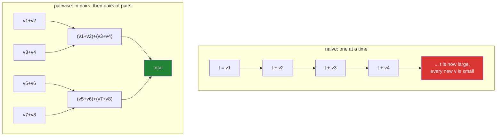

# 2.6 — Float summation and the drift — why the total depends on the order

## One-line answer

Adding floats one at a time loses a little accuracy at every step and the losses accumulate, so
`arr.sum()` on a large `float32` array is measurably wrong — and the fix is one argument,
`dtype=np.float64`.

---

## The story

Somebody is adding up a long column of numbers on a calculator that only shows six digits.

The first few additions are fine. Then the running total gets into the hundreds of thousands, and the
next number to add is a small one — a few pence. Six digits are already used up by the big total, so
the pence have nowhere to go. The calculator rounds them away, and the display does not change at all.

Add one small number to a big total and lose a rounding. Do it once and nobody would notice. Do it a
million times, each one losing a tiny amount in the same direction, and the final total is visibly
wrong — not because any single step was badly done, but because a million careful roundings still add
up to something.

The interesting part is what fixes it. Not a better calculator. Adding the numbers up in a different
**order** — small ones together first, so that they have grown into something big enough to survive
being added to the total. Same numbers, same arithmetic, different answer.

---

## The idea in plain language

A float stores a fixed number of significant digits, not a fixed number of decimal places
([Day 20, 2.3](../../../day-20-arrays-and-dtypes/parts/02-dtypes/2.3-floats-nan-and-precision.md)). A
`float32` carries about seven significant decimal digits and a `float64` carries about sixteen. Those
digits are all it has, wherever the number sits on the scale.

That leads directly to the calculator problem. When a running total is `100000.0` and the next value
is `0.1`, the true answer needs nine significant digits, and a `float32` only has seven. The result
must be rounded to something a `float32` can store, and the fraction of the `0.1` that will not fit is
simply dropped. This is called **absorption**: the small value is absorbed into the large one and
partly disappears.

Add a million values one at a time and absorption happens on nearly every step, always in the same
direction. The errors do not cancel out; they accumulate. That accumulated error is the **drift** in
this document's title.

There are three ways out, and NumPy uses the second one by default.

**Add them in a smarter order.** If you add the values in pairs, then add the pairs in pairs, and keep
going, then every addition is between two numbers of roughly the same size. Nothing small is ever added
to something huge, so absorption almost never happens. This is called **pairwise summation**, and it is
what `arr.sum()` does. The documentation for `numpy.sum` states it directly: NumPy uses "partial
pairwise summation", always when no axis is given, and when an axis **is** given only if that axis is
the fast one in memory
(<https://numpy.org/doc/stable/reference/generated/numpy.sum.html>). That last clause matters — it
means the accuracy of your sum can depend on which axis you reduced
([2.2](2.2-axis-the-one-that-disappears.md)).

**Keep the running total in a wider type.** If the values are `float32` but the total is accumulated in
`float64`, the total has sixteen digits of room instead of seven, and absorption stops happening at the
sizes you care about. This is what `arr.sum(dtype=np.float64)` does, and it is one argument.

**Track the error explicitly.** Keep a second number recording what was rounded away on each step, and
add it back in. This is **compensated summation**, and Python's `math.fsum` does a version of it that is
exactly correct for the values it is given. It is slow, because it cannot be vectorised, and it is the
right tool when you need a reference answer to check the other two against.

One last idea, and it is the one people find unsettling. Floating point addition is **not associative**:
`(a + b) + c` and `a + (b + c)` can give different answers. So there is no single "the sum" of an array
of floats — there is the sum in the order you added them. That is why summing in parallel across four
threads and summing in one thread give slightly different totals, and why a distributed job can produce
a different number each run without anything being broken.

---

## Why Setu needs it

- **Day 25's gate module** computes a mean and a standard deviation over large arrays, and it must state
  its accumulation dtype or its answers change with the input size.
- **[2.3](2.3-std-var-and-ddof.md)'s variance** sums squared deviations, so it has this problem twice
  over — squaring makes the values span a wider range before they are added.
- **Day 125 onwards**, a loss summed over a large batch in `float32` is exactly this situation, which is
  why deep learning frameworks accumulate reductions in `float32` even when the weights are `float16`.
- **Day 155's cosine similarity** is a sum of products over hundreds of dimensions, and embeddings are
  usually stored in `float32` to halve their memory.
- **Day 42's SQL phase** meets the same fact from the other side: a database `SUM()` over a `real`
  column is not reproducible across query plans, for exactly this reason.

---

## The mechanism

The same hundred thousand values, added three ways:

```python
import math

import numpy as np

small = np.full(100_000, 0.1, dtype=np.float32)


def naive_sum(values: np.ndarray) -> np.floating:
    """One at a time, left to right - the way a person would do it."""
    total = values.dtype.type(0)
    for value in values:
        total += value
    return total


print("naive       :", naive_sum(small))
print("numpy       :", small.sum())
print("fsum        :", math.fsum(small.tolist()))
print("error naive :", abs(float(naive_sum(small)) - 10000.0))
print("error numpy :", abs(float(small.sum()) - 10000.0))
```

**Line by line:**

- `np.full(100_000, 0.1, dtype=np.float32)` — a hundred thousand copies of the same value, so the exact
  answer is obvious and any error is entirely the summing. `0.1` is deliberately a value binary cannot
  store exactly, which is the normal case for real data, not a special one.
- `values.dtype.type(0)` rather than `0` — this starts the running total as a `float32`, matching the
  data. Starting with a plain Python `0` would make the first addition promote everything to `float64`
  and quietly fix the bug this function exists to show
  ([Day 20, 2.5](../../../day-20-arrays-and-dtypes/parts/02-dtypes/2.5-nep-50-and-the-python-number.md)).
- `for value in values` — the naive order, one at a time, left to right. **This is what everybody
  assumes `sum` does**, and it is the order that absorbs.
- `small.sum()` — pairwise summation, in compiled code. Same values, same dtype, and the only difference
  from the loop above is the order the additions happen in.
- `math.fsum(small.tolist())` — the reference answer. It is exact for the values it is handed, so it
  says what the other two should have produced. `.tolist()` is needed because `fsum` wants Python
  floats, and that conversion is itself slow enough to rule the function out for large arrays
  ([Day 20, 2.4](../../../day-20-arrays-and-dtypes/parts/02-dtypes/2.4-astype-and-the-copy.md)).
- `abs(float(...) - 10000.0)` — the two errors, printed as plain numbers so the ratio between them is
  readable.

```text
naive       : 9998.557
numpy       : 10000.001
fsum        : 10000.000149011612
error naive : 1.443359375
error numpy : 0.0009765625
```

The naive loop is out by 1.44 steps. NumPy is out by 0.001. **The same numbers, added in a different
order, are fifteen hundred times more accurate.**

There is a subtlety in that `fsum` line worth pausing on. It says 10000.000149, not 10000.0. That is not
an error — `0.1` is not exactly representable in binary, so the value actually stored in each of the
hundred thousand slots is very slightly more than a tenth, and their true total really is
10000.000149. There are two different notions of "correct" here: the sum of the numbers you meant, and
the sum of the numbers you stored. `fsum` gives the second one exactly, and nothing can give you the
first.

Now the version that appears in real work — a `float32` array of the size of a large image:

```python
import numpy as np

big = np.full((4096, 4096), 1.1, dtype=np.float32)

print("size           :", big.size)
print("sum()          :", big.sum())
print("sum(dtype=f8)  :", big.sum(dtype=np.float64))
print("exact          :", 4096 * 4096 * 1.1)
print("mean()         :", big.mean())
print("mean(dtype=f8) :", big.mean(dtype=np.float64))
```

**Line by line:**

- `(4096, 4096)` of `float32` — 16.7 million values, 64 MB. This is an ordinary size: one large image,
  or one modest batch of embeddings.
- `big.sum()` — accumulates in `float32`, because NumPy's default accumulation dtype for a `float32`
  input is `float32`. Pairwise summation is doing its best, and at this many values its best is still
  visibly short.
- `big.sum(dtype=np.float64)` — **the whole fix, in one argument**. The values stay `float32` in memory;
  only the running total is `float64`. There is no extra allocation and the cost is a few per cent.
- `4096 * 4096 * 1.1` — computed in Python floats, which are `float64`, so this line is the target the
  other two are being judged against.
- `big.mean(dtype=np.float64)` — `mean` takes the same argument, and needs it for the same reason: a
  mean is a sum followed by a division, so it inherits the sum's error exactly.

```text
size           : 16777216
sum()          : 1.845494e+07
sum(dtype=f8)  : 18454938.0
exact          : 18454937.6
mean()         : 1.1000001
mean(dtype=f8) : 1.100000023841858
```

Look at what `sum()` printed: `1.845494e+07`. NumPy has switched to scientific notation because the
`float32` result no longer has enough significant digits to be worth writing out in full. **The display
is telling you about the precision loss**, and it is easy to read past.

Why the order matters, drawn on eight values:



In the left column every addition after the first few is "huge plus tiny", which is the shape that
absorbs. In the right column every addition is between two numbers of similar size, all the way to the
top. The error grows roughly with the number of values on the left, and roughly with its logarithm on
the right.

---

## When it breaks

**The total that changed when the axis changed:**

```text
$ uv run python -c "
import numpy as np
rng = np.random.default_rng(7)
flat = rng.random(4_000_000, dtype=np.float32) * 1000
grid = flat.reshape(2000, 2000)
exact = flat.sum(dtype=np.float64)
print('exact (float64) :', exact)
print('flat  .sum()    :', float(flat.sum()), ' off by', round(float(flat.sum()) - exact, 1))
print('axis=1 then sum :', float(grid.sum(axis=1).sum()), ' off by', round(float(grid.sum(axis=1).sum()) - exact, 1))
print('axis=0 then sum :', float(grid.sum(axis=0).sum()), ' off by', round(float(grid.sum(axis=0).sum()) - exact, 1))
print('equal?          :', grid.sum(axis=0).sum() == grid.sum(axis=1).sum())
"
exact (float64) : 1999881409.8461356
flat  .sum()    : 1999881472.0  off by 62.2
axis=1 then sum : 1999881472.0  off by 62.2
axis=0 then sum : 1999881344.0  off by -65.8
equal?          : False
```

**What it means.** The same four million numbers, totalled two ways, disagree by 128 — and the two
errors fall on opposite sides of the true answer. Nothing is broken. Reducing along `axis=1` walks
along rows, which is the fast axis in memory for a C-ordered array
([Day 20, 1.3](../../../day-20-arrays-and-dtypes/parts/01-the-block/1.3-one-block-and-strides.md)), so
NumPy uses pairwise summation and lands on the same answer as the flat array. Reducing along `axis=0`
walks down columns, which is not the fast axis, so the improved precision does not apply — exactly as
the documentation for `numpy.sum` says. **A test that asserts two totals are equal when they were
computed by different routes will fail eventually**, and the fix is `np.isclose` with a stated tolerance
([1.6](../01-ufuncs/1.6-isclose-and-allclose.md)) rather than a hunt for a bug that is not there.

**The counter that stopped counting:**

```text
$ uv run python -c "
import numpy as np
total = np.float32(0.0)
for _ in range(5):
    total += np.float32(1.0)
print('after 5     :', total)
total = np.float32(16_777_216.0)
print('start       :', total)
total += np.float32(1.0)
print('plus one    :', total)
total += np.float32(1.0)
print('plus one    :', total)
"
after 5     : 5.0
start       : 1.6777216e+07
plus one    : 1.6777216e+07
plus one    : 1.6777216e+07
```

**What it means.** The first half is the control: five additions of one give five, so the loop itself is
fine. The second half is the failure. `16777216` is 2²⁴, the point at which a `float32` has spent every
significant digit it has on the integer part, so the gap between one storable value and the next becomes
larger than 1. Adding one lands exactly halfway between two storable values, the tie rounds back to the
value it started from, and the counter never moves again. It does not warn, it does not raise, and no
amount of further adding will shift it. **Anything counting events in a `float32` stops counting at
sixteen million of them, permanently** — which is why a count belongs in an `int64`
([Day 20, 2.2](../../../day-20-arrays-and-dtypes/parts/02-dtypes/2.2-integers-and-the-silent-wrap.md)),
not a float.

---

## In production

**What a professional writes instead of the teaching version.** The accumulation dtype is stated, always,
and the array's own dtype is left alone:

```python
from __future__ import annotations

import numpy as np

# float32 halves memory for storage, and is not enough room to add millions of values in.
# Store narrow, accumulate wide - the dtype= argument does exactly that and costs no memory.
ACCUMULATE_IN = np.float64


def total_steps(counts: np.ndarray) -> float:
    """Sum ``counts`` with an accumulator wide enough that the answer does not depend on n."""
    if counts.dtype.kind != "f":
        raise TypeError(f"expected floats, got dtype {counts.dtype}")
    return float(np.nansum(counts, dtype=ACCUMULATE_IN))


def mean_steps(counts: np.ndarray) -> float:
    """Mean of the recorded days, accumulated wide for the same reason."""
    observed = int(np.count_nonzero(~np.isnan(counts)))
    if observed == 0:
        raise ValueError("no recorded days to average")
    return total_steps(counts) / observed
```

**Line by line:**

- `ACCUMULATE_IN = np.float64` as a named module constant with the reasoning in the comment — the
  argument appears in several calls, and a reader who finds `dtype=np.float64` on a line has to guess
  whether it is about the output type or the accumulator. The name says which.
- `counts.dtype.kind != "f"` — a `float32` input is fine and expected; an integer input means somebody
  filled the missing days already, and this function's `nansum` would then be pointlessly defensive
  ([2.5](2.5-the-nan-family.md)).
- `np.nansum(counts, dtype=ACCUMULATE_IN)` — **`dtype=` here is the accumulator, not a cast of the
  input**. The array stays `float32` in memory. This is the single most valuable thing in this document:
  it costs nothing, it needs no extra array, and it removes an entire class of "the number changed when
  the dataset grew" bug.
- `mean_steps` dividing `total_steps` by an explicit count rather than calling `np.nanmean` — the count
  is a number this module needs to report anyway, and building the mean from parts it already has keeps
  one accumulation dtype instead of two.
- `float(...)` at both boundaries, so nothing downstream inherits a NumPy scalar
  ([Day 20, 2.5](../../../day-20-arrays-and-dtypes/parts/02-dtypes/2.5-nep-50-and-the-python-number.md)).

**What changes at scale.** The error grows with the number of values, so this is one of the very few
bugs that is genuinely invisible in testing and unavoidable in production. A thousand-row fixture will
never show it; a hundred-million-row job always will. Three further things appear at that size. Parallel
reductions split the array into chunks and sum the chunks, so the answer depends on the thread count and
is not reproducible run to run unless the chunking is fixed — which is why a distributed sum needs
either a fixed partitioning or a compensated algorithm before anyone can call it deterministic. GPUs
make this sharper still, because reductions there are aggressively parallel and often run in `float16`
or `bfloat16`, which is why every framework accumulates in `float32` regardless of the weights' dtype.
And money is the case where none of this is acceptable at all: currency is stored in integer minor units
or in a decimal type, never in a float, because a total that is off by 0.001 is a reconciliation
failure, not a rounding.

**The failure that only appears with real data.** A metrics service reported the total bytes served per
day. It matched the billing system to the pound for two years, and then stopped matching — always low,
by a growing amount. The counter was a `float32`. Traffic had grown to the point where the daily total
passed sixteen million, and every increment of one after that was being absorbed into the running total
and lost. The dashboard number simply stopped rising during the busiest hour of the day. The fix was
`int64`, because a count of events is an integer and never should have been a float.

**The review comment a senior engineer leaves.** *"`.sum()` on a `float32` array of ten million values
accumulates in `float32`. Add `dtype=np.float64` — the memory is unchanged, the cost is noise, and
without it this total drifts as the dataset grows and stops matching the batch job."*

**The interview question.** *"Is `a.sum()` on a large `float32` array accurate?"* Not fully, and the
error grows with the number of values, because adding a small value to a large running total loses the
part that does not fit in the available significant digits. NumPy mitigates it with pairwise summation,
which keeps every addition between operands of similar size, but the documentation is explicit that this
only applies when no axis is given or when reducing along the fast axis in memory — so summing along
`axis=0` of a C-ordered array is less accurate than summing along `axis=1`. The fix is
`dtype=np.float64`, which widens the accumulator without changing the array or its memory. The points
that show real experience: float addition is not associative, so there is no single correct total and a
parallel or distributed sum is not reproducible unless the partitioning is fixed; `math.fsum` gives an
exact reference answer but cannot be vectorised; and a `float32` cannot represent consecutive integers
past 2²⁴, so a `float32` event counter silently stops incrementing at sixteen million.

---

## Check yourself

```bash
uv run python -c "
import math
import numpy as np
small = np.full(1_000_000, 0.1, dtype=np.float32)
print('numpy f32   :', small.sum())
print('numpy f64acc:', small.sum(dtype=np.float64))
print('fsum        :', math.fsum(small.tolist()))
stuck = np.float32(16_777_216.0)
print('2**24 plus 1:', stuck + np.float32(1.0))
print('still stuck :', stuck + np.float32(1.0) + np.float32(1.0))
"
```

The last two lines print the same number three times. Say what that means for a `float32` counter in a
service that has been running for a year.

**Answer out loud, without scrolling up:**

> Your nightly total does not match the batch job's total, and the gap gets bigger every month. Name the
> cause, the one argument that fixes it, and say why the same code was correct for the first two years.

---

**Next:** [3.1 — `np.sort` and the copy](../03-sorting-and-searching/3.1-sort-and-the-copy.md).
