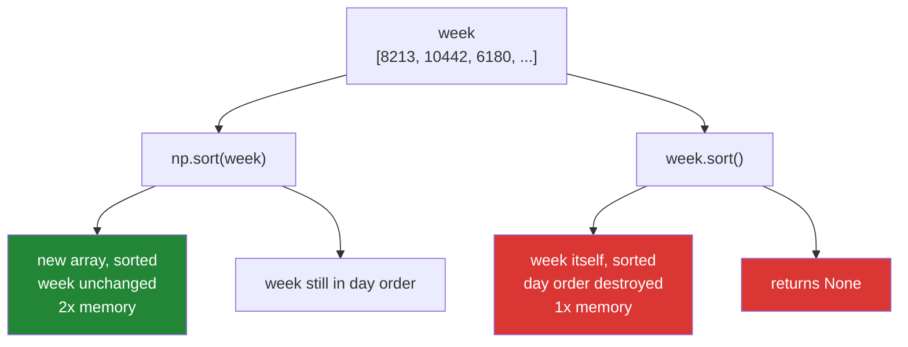

# 3.1 — `np.sort` and `.sort()` — one copies, one does not

## One-line answer

`np.sort(arr)` gives you a **new** sorted array and leaves `arr` untouched, while `arr.sort()` rewrites
`arr` in place and returns `None` — and choosing the wrong one is how a function quietly rearranges data
its caller still needed.

---

## The story

Somebody keeps a week of step counts written down in a notebook, one line per day, in the order the days
happened.

They want to see the week from worst to best. There are two ways to do that with a pen.

The first is to copy the seven numbers onto a fresh page and put the copy in order. Two pages now: the
original week, still in day order, and the sorted list. Nothing was lost.

The second is to cross out and rewrite the numbers on the original page until they are in order. One
page, less writing — and the day order is gone. Which number was Monday's? There is no way to tell any
more, because the only record of that was the order the numbers were written in.

The second way is not wrong. It is faster and it uses less paper. It is only wrong if somebody else was
relying on that page still saying which day was which.

---

## The idea in plain language

**Sorting** means putting values in order, smallest first. NumPy offers it in two shapes, and the
difference between them is the same difference as between the two pens above.

`np.sort(arr)` is a **function**. It allocates a new array, fills it with the sorted values, and returns
it. The array you passed in is not touched. This is a **copy**, in the sense you met on Day 21
([Day 21, 2.3](../../../day-21-indexing-and-views/parts/02-the-view-trap/2.3-copy-and-when-to-pay.md)):
new memory, no connection to the original.

`arr.sort()` is a **method**. It rearranges the values inside `arr` itself and returns `None`. This is
called sorting **in place**. It needs no second array, so it uses half the memory — and the original
order is destroyed.

The `None` is worth dwelling on, because it causes a specific and very common bug. Writing
`week = week.sort()` looks reasonable and leaves `week` bound to `None`, so the next line fails somewhere
confusing. This is the same convention as Python's own `list.sort()`
([Day 8, 1.5](../../../day-08-containers/parts/01-sequences/1.5-sort-sorted-and-key.md)): methods
that change the thing they are called on return nothing, precisely so that this mistake is loud rather
than silent.

One more thing about sorting in NumPy, and it surprises people coming from Python: **there is no
`reverse=True`**. `sorted([3, 1, 2], reverse=True)` works in Python; `np.sort(arr, reverse=True)` does
not exist. To sort descending you sort ascending and then reverse the result with `[::-1]`, which costs
nothing at all because a reversed slice is a view
([Day 21, 1.5](../../../day-21-indexing-and-views/parts/01-one-element/1.5-the-step-and-the-reverse.md)).

Finally, sorting is not free. Adding up seven numbers touches each one once; putting seven numbers in
order requires comparing them against each other. As the array grows, sorting costs roughly `n log n`
comparisons against a sum's `n` additions, which is why the median cost twelve times what the mean cost
in [2.4](../02-statistics/2.4-median-percentile-and-quantile.md). **Sorting is the most expensive thing
in this section, and [3.3](3.3-top-k-and-argpartition.md) is about not doing it.**

---

## Why Setu needs it

- **[3.2](3.2-argsort-the-positions.md)** is this operation returning positions instead of values, and it
  is the one you will actually use. This document exists so that the difference is visible.
- **[2.4](../02-statistics/2.4-median-percentile-and-quantile.md)'s median** is defined in terms of
  sorted order, and `overwrite_input=True` there is exactly the in-place choice made on your behalf.
- **Day 25's gate module** must not rearrange the caller's array, so every sort in it is the copying
  kind, stated in a docstring.
- **Day 155's retrieval** ranks candidate documents by score. Sorting a million scores to show ten of
  them is the mistake [3.3](3.3-top-k-and-argpartition.md) exists to prevent.
- **Day 42's SQL phase** meets `ORDER BY`, which is this operation with the same cost and the same
  question about whether the underlying rows moved.

---

## The mechanism

Both spellings, side by side, with proof about what moved:

```python
import numpy as np

month = np.array(
    [
        [8213, 10442, 6180, 9000, 12007, 9631, 7204],
        [7788, 9120, 11345, 8402, 6733, 14210, 5096],
        [9004, 8765, 7621, 10188, 9950, 8317, 11002],
        [6540, 12488, 9873, 7106, 8899, 10540, 9218],
    ]
)
week = month[0].copy()

print("week       :", week)
print("np.sort    :", np.sort(week))
print("week after :", week)

own = week.copy()
print("own.sort() :", own.sort(), "<- returns None")
print("own after  :", own)

print("descending :", np.sort(week)[::-1])
print("shares mem :", np.shares_memory(np.sort(week), week))
```

**Line by line:**

- `month[0].copy()` — the `.copy()` is not decoration. `month[0]` is a **view** into the month
  ([Day 21, 2.1](../../../day-21-indexing-and-views/parts/02-the-view-trap/2.1-a-slice-does-not-copy.md)),
  so an in-place sort on it would silently reorder the first week inside `month`. Taking a copy first is
  what makes the rest of this file safe to run twice.
- `np.sort(week)` — the function form. A new array comes back sorted; the argument is not modified.
- `print("week after :", week)` — the proof, and the only reason it is printed. Reading a docstring that
  says "returns a sorted copy" is not the same as watching the original come back unchanged.
- `own.sort()` — the method form, printed **inside** the `print` so that its return value is visible.
  It is `None`. Every in-place method in Python does this
  ([Day 8, 1.5](../../../day-08-containers/parts/01-sequences/1.5-sort-sorted-and-key.md)).
- `print("own after  :", own)` — the same array, now in order. Nothing was allocated and the day order is
  gone.
- `np.sort(week)[::-1]` — descending, because there is no `reverse=` argument. The slice with a step of
  `-1` is a view over the sorted copy, so the reversal itself costs nothing
  ([Day 21, 1.5](../../../day-21-indexing-and-views/parts/01-one-element/1.5-the-step-and-the-reverse.md)).
- `np.shares_memory(np.sort(week), week)` — `False`, which is the machine-checkable version of "it made a
  copy" ([Day 21, 2.2](../../../day-21-indexing-and-views/parts/02-the-view-trap/2.2-how-to-tell-base-and-shares-memory.md)).
  **This is the assertion to put in a test**, not a comment saying it copies.

```text
week       : [ 8213 10442  6180  9000 12007  9631  7204]
np.sort    : [ 6180  7204  8213  9000  9631 10442 12007]
week after : [ 8213 10442  6180  9000 12007  9631  7204]
own.sort() : None <- returns None
own after  : [ 6180  7204  8213  9000  9631 10442 12007]
descending : [12007 10442  9631  9000  8213  7204  6180]
shares mem : False
```

The third line is the whole document: after `np.sort`, `week` is exactly as it was.

The two paths:



Neither path is the right one in general. The green box is the right default; the red one is a
deliberate trade you make when the array is large, you own it, and you have said so.

---

## When it breaks

**The assignment that produced `None`:**

```text
$ uv run python -c "
import numpy as np
week = np.array([8213, 10442, 6180, 9000])
week = week.sort()
print('week is', week)
print(week[0])
"
week is None
Traceback (most recent call last):
  File "<string>", line 6, in <module>
TypeError: 'NoneType' object is not subscriptable
```

**What it means.** `.sort()` returned `None` and the assignment threw the array away. The error does not
appear on the line with the bug — it appears on the next line that tries to use the name, and in a
longer function that can be a long way down. Whenever you see `'NoneType' object is not subscriptable`,
the first thing to look for is an assignment from an in-place method. **The fix is either
`week.sort()` with no assignment, or `week = np.sort(week)`, and those two are not the same thing.**

**The function that reordered its caller's data:**

```text
$ uv run python -c "
import numpy as np
month = np.array([[8213, 10442, 6180, 9000], [7788, 9120, 11345, 8402]])

def worst_day(week):
    week.sort()
    return week[0]

print('before  :', month[0])
print('worst   :', worst_day(month[0]))
print('after   :', month[0])
print('and row 2 is fine:', month[1])
"
before  : [ 8213 10442  6180  9000]
worst   : 6180
after   : [ 6180  8213  9000 10442]
and row 2 is fine: [ 7788  9120 11345  8402]
```

**What it means.** No error at all, which is what makes this the dangerous one. `worst_day` returned the
correct answer, 6180, and permanently reordered the caller's first week on the way. Because `month[0]` is
a view, the damage is inside `month` itself rather than in some temporary — and the last line proves it
is confined to the row that was passed, so nothing about the rest of the array looks wrong. The function's signature promises nothing and delivers a side effect,
which is the failure Day 21 built a whole part around
([Day 21, 2.4](../../../day-21-indexing-and-views/parts/02-the-view-trap/2.4-the-function-that-changed-its-input.md)).
The fix is one character of intent: `np.sort(week)[0]`, or `np.min(week)`, which needs no sort at all.

**Sorting text and numbers together:**

```text
$ uv run python -c "
import numpy as np
mixed = np.array([9000, 'unknown', 6180])
print('dtype  :', mixed.dtype)
print('sorted :', np.sort(mixed))
"
dtype  : <U21
sorted : ['6180' '9000' 'unknown']
```

**What it means.** No error, and a wrong answer. One text value turned the whole array into text at
creation time, because an array holds one dtype
([Day 20, 2.1](../../../day-20-arrays-and-dtypes/parts/02-dtypes/2.1-a-dtype-is-a-promise.md)), so the
sort is alphabetical rather than numerical. It happens to look right here because all the numbers have
four digits. Add a five-digit day and `'10442'` sorts before `'6180'`, because `'1'` comes before `'6'`.
**A sorted result that looks nearly right is worse than an exception**, and the way to catch it is to
assert the dtype after loading, not after sorting.

---

## In production

**What a professional writes instead of the teaching version.** The choice between copying and not is
made by the caller, in the signature, with the default being the safe one:

```python
from __future__ import annotations

import numpy as np


def ranked(counts: np.ndarray, *, descending: bool = True, in_place: bool = False) -> np.ndarray:
    """Return ``counts`` in order.

    By default this allocates and the caller's array is untouched. ``in_place=True`` sorts the
    caller's own memory instead: half the peak memory, and the caller's original order is gone
    for good. Passing a view (a slice of a larger array) with ``in_place=True`` reorders that
    larger array too.
    """
    if in_place:
        counts.sort()
        ordered = counts
    else:
        ordered = np.sort(counts)
    return ordered[::-1] if descending else ordered
```

**Line by line:**

- `*, descending, in_place` — both keyword-only, so no call site can read as `ranked(week, True, True)`
  and leave the reader guessing which `True` is which
  ([Day 10, 1.5](../../../day-10-functions/parts/01-the-signature/1.5-keyword-only-and-positional-only.md)).
- `in_place: bool = False` — **the default is the expensive, safe one**. A caller who wants the memory
  saving must ask for it, and asking for it is the moment they think about whether they still need the
  original order.
- The docstring naming the view consequence explicitly — this is the sentence that stops the bug in the
  second failure block above. A docstring that says "sorts in place" is not enough; the reader needs to
  know that "in place" reaches through a view into a parent array.
- `descending: bool = True` rather than a `reverse=` that mimics Python — the argument is named for what
  the answer is, and its default matches what almost every caller of a "ranked" function wants.
- `ordered[::-1]` — the reverse is a **view** of the sorted array, so no third allocation happens. If the
  caller then writes to it, they write into `ordered`, which for the `in_place=True` path is their own
  array. That is consistent with what they asked for.
- Returning `counts` itself from the `in_place` branch rather than `None` — deliberately **not** the
  NumPy convention. This function's return value is the one thing every call site wants, and the two
  branches returning different kinds of thing would be worse than breaking a convention.

**What changes at scale.** Sorting is `n log n` and, more importantly, it is a memory-movement problem
rather than an arithmetic one — the values have to be physically shuffled, which means cache misses
rather than instructions. Three consequences. A copying sort of a 4 GB array needs 8 GB at its peak, and
this is one of the most common causes of a job being killed for memory on data that "obviously fits".
`kind=` chooses the algorithm and the trade is real: the default introsort is fast and unstable, while
`kind="stable"` cost about ten times as much in a measurement in [3.6](3.6-stability-and-kind.md).
And at the point where the array does not fit in memory at all, sorting stops being a call and becomes an
architecture — external merge sort, or a database, or not sorting at all. **The last of those is usually
right**: most code that sorts wants the top few, which is [3.3](3.3-top-k-and-argpartition.md).

**The failure that only appears with real data.** A reporting job took a slice of a large shared array,
sorted it in place to find a percentile, and returned the number. It was correct in every test, because
every test passed it a freshly built array. In production the same array was reused by three later
reports, and those three began producing results that were subtly wrong in a way that depended on the
order the reports ran in. The bug survived two rewrites because nobody suspected the function that
returned the right answer.

**The review comment a senior engineer leaves.** *"`arr.sort()` on an argument mutates the caller's
array, and this one is called with `data[mask]` in one place and `data[:100]` in another — the second is
a view, so this reorders `data`. Either `np.sort` it or rename the function to say it sorts in place."*

**The interview question.** *"What is the difference between `np.sort(a)` and `a.sort()`?"* The function
returns a new sorted array and leaves the input alone; the method sorts the input in place and returns
`None`. The reasons to care are memory and safety: in place needs no second array, which matters at
gigabyte sizes, but it destroys the caller's ordering — and if the array you were handed is a view into a
larger one, it reorders that larger array too. The detail worth adding is that NumPy has no `reverse=`
argument, so descending is `np.sort(a)[::-1]`, and that reversed slice is a free view rather than another
copy. The follow-up that separates experience from reading: most code that sorts does not need a sort at
all, because it only wants the largest few values, and `argpartition` gets those without ordering the
rest.

---

## Check yourself

```bash
uv run python -c "
import numpy as np
week = np.array([8213, 10442, 6180, 9000, 12007, 9631, 7204])
copy_sorted = np.sort(week)
print('copy sorted :', copy_sorted)
print('week intact :', week)
print('shares mem  :', np.shares_memory(copy_sorted, week))
print('descending  :', copy_sorted[::-1])
print('reverse view:', np.shares_memory(copy_sorted[::-1], copy_sorted))
own = week.copy()
print('method ret  :', own.sort())
print('own now     :', own)
"
```

Two of those lines print a `shares_memory` answer, and they are different. Say why one is `False` and
the other is `True`, and what each one is telling you about where the values physically live.

**Answer out loud, without scrolling up:**

> You are handed `data[:1000]` and asked to return its median. Say which sort you use, what would break
> if you used the other one, and why the caller would never see it in a test.

---

**Next:** [3.2 — `argsort`, the positions rather than the values](3.2-argsort-the-positions.md).
