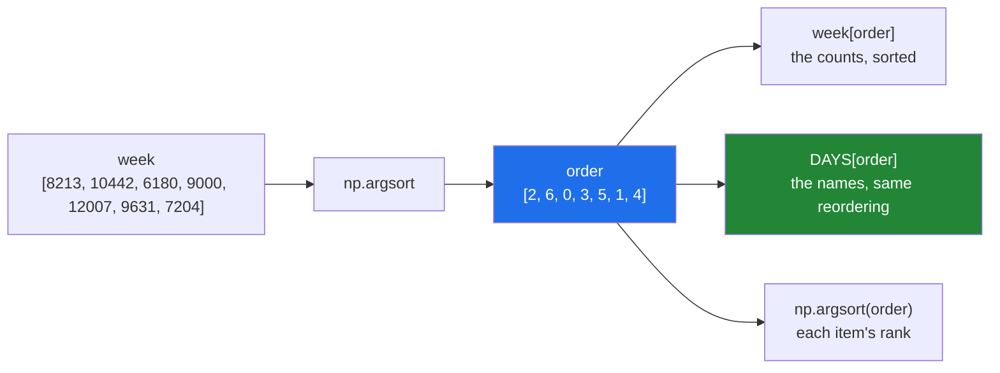

# 3.2 — `argsort` — the positions, not the values

## One-line answer

`np.argsort(arr)` returns the **positions** that would put `arr` in order, so you can use that one
answer to reorder any number of other arrays the same way — which is how you keep labels attached to
their numbers.

---

## The story

Somebody has two lists on the same page. Down the left, the days of the week. Down the right, the step
count for each day. The pairing is not written down anywhere; it is just that the third name is opposite
the third number.

They want the days listed from the laziest to the busiest. So they sort the numbers.

Now the right-hand column is in order and the left-hand column is not, and the pairing that made the page
mean anything has been destroyed. Wednesday is still in the third position on the left, but the third
number on the right is no longer Wednesday's.

The way out is what anybody would do with a real page: instead of moving the numbers, write down the
**order you would read them in**. Third, seventh, first, fourth, and so on. That little list of positions
is not itself the answer — it is a set of instructions, and it can be applied to the left-hand column and
the right-hand column alike. Both stay in step, because both were told to move the same way.

---

## The idea in plain language

[3.1](3.1-sort-and-the-copy.md) sorted values. `np.argsort` sorts **positions**.

Given an array, `np.argsort` returns a new array of integers. Reading them left to right gives the order
you would have to visit the original array's elements in, to see them from smallest to largest. If the
answer starts `[2, 6, 0, ...]`, that means "the smallest value is at position 2, the next smallest is at
position 6, then position 0".

The name is short for *argument of the sort*, in the mathematical sense of "argument" meaning "the input
that produces this". `np.argmax` from [2.1](../02-statistics/2.1-a-reduction-turns-many-into-one.md) is
the same idea for a single value: the position of the largest, not the largest.

The result is used by **indexing with it**. `week[order]` takes the elements of `week` at the positions
listed in `order`, in that order, giving the sorted values back. That is fancy indexing, which you met on
Day 21 ([Day 21, 4.1](../../../day-21-indexing-and-views/parts/04-fancy-indexing/4.1-a-list-of-positions.md)),
and it always returns a copy.

That indirection is the entire point, and it buys two things a plain sort cannot.

**Labels stay attached.** `days[order]` applies the identical reordering to a second array. As long as
the two arrays were lined up before, they are lined up after. This is how you sort a table by one column
without scrambling the rest of it, and it is what every dataframe library is doing underneath.

**The order itself becomes data.** It can be stored, passed to a function, inverted, or applied later.
`np.argsort(order)` — argsorting the order — gives each original element its **rank**: what place it came
in. That trick is worth memorising, because it is not obvious and it is the answer to "which position did
each item finish in".

Two things to be careful of, both mentioned now and both revisited later.

Descending is again `[::-1]` on the result, and it must be applied to the **positions**, not to the
values. `np.argsort(week)[::-1]` gives the positions from largest to smallest.

And when two values are equal, `argsort` has to put one of them first, and which one it picks depends on
the algorithm. That is [3.6](3.6-stability-and-kind.md)'s subject, and it is the difference between a
leaderboard that is stable between refreshes and one that is not.

---

## Why Setu needs it

- **[3.3](3.3-top-k-and-argpartition.md)** is `argsort` used for only the top few, which is the version
  you will write for the rest of the curriculum.
- **Day 25's gate module** returns the best and worst days as **days**, not as counts, so the positions
  are the answer and the values are the by-product.
- **Day 155's vector search** computes a similarity score for every stored document and then needs the
  documents, not the scores. `argsort` on the scores, applied to the identifiers, is the whole retriever.
- **Day 162's RAG pipeline** does the same thing again with a re-ranking model, and the ability to carry
  three parallel arrays through one reordering is what keeps chunk text, source URL and score together.
- **Day 84's exploratory work** sorts a table by one column constantly, and `argsort` is what pandas is
  doing when you call `sort_values`.

---

## The mechanism

Two arrays, one reordering:

```python
import numpy as np

DAYS = np.array(["Mon", "Tue", "Wed", "Thu", "Fri", "Sat", "Sun"])
week = np.array([8213, 10442, 6180, 9000, 12007, 9631, 7204])

order = np.argsort(week)

print("week        :", week)
print("argsort     :", order)
print("week[order] :", week[order])
print("DAYS[order] :", DAYS[order])
print("rank        :", np.argsort(order))
print("best day    :", DAYS[order[-1]], week[order[-1]])
print("worst three :", DAYS[order[:3]])
```

**Line by line:**

- `DAYS` and `week` built separately — **nothing links them but their order**. That is exactly the
  situation `argsort` exists for, and it is what a two-column table is underneath.
- `np.argsort(week)` — the positions. It does not touch `week`, and there is no in-place version, because
  the answer is a different array from the input by definition.
- `order` printed on its own line before it is used. It is `[2 6 0 3 5 1 4]`, and reading that out loud —
  "position 2 first, then 6, then 0" — is the only way this ever stops feeling like magic.
- `week[order]` — fancy indexing with an integer array, so the values come back sorted
  ([Day 21, 4.1](../../../day-21-indexing-and-views/parts/04-fancy-indexing/4.1-a-list-of-positions.md)).
  This is identical to what `np.sort(week)` returns, which is the check that `order` is right.
- `DAYS[order]` — **the same instruction applied to a different array**. Wednesday first, because
  Wednesday's 6 180 was the smallest. Nothing about `DAYS` was sorted; it was reordered by a plan made
  from somebody else's numbers.
- `np.argsort(order)` — argsorting the order gives the **rank** of each original element: Monday's
  8 213 came third from the bottom, so `rank[0]` is 2, counting from zero. Say it as "argsort tells you
  where to look; argsorting that tells you where each item ended up".
- `order[-1]` — the last position in ascending order is the largest value, so this is `argmax` arrived at
  the long way round. For one value `np.argmax` is cheaper; for the top three, `order[-3:]` is the
  natural move, and [3.3](3.3-top-k-and-argpartition.md) is about doing it without the full sort.
- `order[:3]` — the three smallest, in order. Slicing the positions is how every "top n" and "bottom n"
  question is answered.

```text
week        : [ 8213 10442  6180  9000 12007  9631  7204]
argsort     : [2 6 0 3 5 1 4]
week[order] : [ 6180  7204  8213  9000  9631 10442 12007]
DAYS[order] : ['Wed' 'Sun' 'Mon' 'Thu' 'Sat' 'Tue' 'Fri']
rank        : [2 5 0 3 6 4 1]
best day    : Fri 12007
worst three : ['Wed' 'Sun' 'Mon']
```

Friday was the best day. Note that the number 12 007 never had to be looked at to say that — `order[-1]`
is `4`, and `DAYS[4]` is `"Fri"`.

The indirection, drawn:



One arrow in, three arrows out. That is the whole reason to prefer `argsort` over `sort`: the plan can be
reused, and the values cannot.

---

## When it breaks

**Two arrays of different lengths:**

```text
$ uv run python -c "
import numpy as np
DAYS = np.array(['Mon', 'Tue', 'Wed'])
week = np.array([8213, 10442, 6180, 9000])
print(DAYS[np.argsort(week)])
"
Traceback (most recent call last):
  File "<string>", line 5, in <module>
IndexError: index 3 is out of bounds for axis 0 with size 3
```

**What it means.** `argsort` produced positions up to 3, because `week` has four elements, and `DAYS`
only has three. The two arrays were not lined up in the first place. This error is a **gift**: the far
more common version of this bug is two arrays of the *same* length that were never actually
corresponding, in which case every index is legal and the labels are simply wrong. **Assert the lengths
match at the point the arrays are built**, not at the point they are indexed.

**Descending applied to the wrong array:**

```text
$ uv run python -c "
import numpy as np
DAYS = np.array(['Mon', 'Tue', 'Wed', 'Thu', 'Fri', 'Sat', 'Sun'])
week = np.array([8213, 10442, 6180, 9000, 12007, 9631, 7204])
print('right :', DAYS[np.argsort(week)[::-1]])
print('wrong :', DAYS[np.argsort(week)][::-1])
print('also  :', DAYS[np.argsort(week[::-1])])
"
right : ['Fri' 'Tue' 'Sat' 'Thu' 'Mon' 'Sun' 'Wed']
wrong : ['Fri' 'Tue' 'Sat' 'Thu' 'Mon' 'Sun' 'Wed']
also  : ['Fri' 'Mon' 'Sun' 'Thu' 'Tue' 'Sat' 'Wed']
```

**What it means.** The first two agree, which is the trap. Reversing the positions and reversing the
result happen to give the same answer, so a codebase can mix the two spellings for years. The third one
is the real bug, and look at how well it hides: it still starts with Friday, the genuinely best day, and
it still ends with Wednesday, the genuinely worst. Only the five days in the middle are wrong. Reversing
the **input** before argsorting produces positions that refer to the reversed array, and using them to
index the original gives a confident answer with no error at all.
**`[::-1]` belongs on the positions, and only on the positions**, and the reason to prefer that spelling
even though the second also works is that it stops the third from ever looking reasonable.

**A `nan` sorted to the end:**

```text
$ uv run python -c "
import numpy as np
w = np.array([8213., 10442., np.nan, 9000., 6180.])
print('sorted  :', np.sort(w))
print('argsort :', np.argsort(w))
print('largest?:', w[np.argsort(w)[-1]])
"
sorted  : [ 6180.  8213.  9000. 10442.    nan]
argsort : [4 0 3 1 2]
largest?: nan
```

**What it means.** `nan` compares false against everything
([2.5](../02-statistics/2.5-the-nan-family.md)), so it has no legitimate place in a sorted order. NumPy
puts it at the end by convention, which means **the "largest" value found by `order[-1]` is a missing
value**, not the biggest number. A leaderboard built this way puts the user with no data at the top.
There is no `nanargsort`; the fix is to filter first, and to keep the surviving positions so the labels
still line up.

---

## In production

**What a professional writes instead of the teaching version.** The reordering is applied to every
parallel array in one place, and the arrays are checked against each other before anything is sorted:

```python
from __future__ import annotations

import numpy as np


def rank_by(scores: np.ndarray, *labels: np.ndarray) -> tuple[np.ndarray, ...]:
    """Sort ``scores`` from best to worst and reorder every label array to match.

    Missing scores are dropped rather than sorted to the end, so a row with no score
    cannot appear as the winner. Returns the surviving scores followed by each label
    array, in the order they were given.
    """
    for i, label in enumerate(labels):
        if label.shape[0] != scores.shape[0]:
            raise ValueError(
                f"label array {i} has {label.shape[0]} rows, scores has {scores.shape[0]}"
            )
    keep = np.flatnonzero(~np.isnan(scores))
    order = keep[np.argsort(scores[keep])[::-1]]
    return (scores[order], *(label[order] for label in labels))
```

**Line by line:**

- `*labels: np.ndarray` — any number of parallel arrays, so a caller with chunk text, a source URL and a
  document identifier passes all three and gets all three back in step
  ([Day 10, 1.4](../../../day-10-functions/parts/01-the-signature/1.4-args-and-kwargs.md)). One function
  does the reordering, so there is one place for the bug to be rather than three.
- The length check running over **every** label before sorting anything — checking as you go would leave
  the caller with two arrays reordered and one not, which is worse than failing.
- The message naming `i` and both counts. "label array 1 has 4 rows, scores has 7" identifies the caller's
  mistake; "shape mismatch" does not.
- `np.flatnonzero(~np.isnan(scores))` — the **positions** of the scores that exist, not the scores
  themselves. Keeping positions rather than values is what lets the labels be filtered by the same act
  ([Day 21, 3.2](../../../day-21-indexing-and-views/parts/03-boolean-masks/3.2-indexing-with-a-mask.md)).
- `keep[np.argsort(scores[keep])[::-1]]` — read it inside out. Sort the surviving scores, reverse for
  descending, then use those positions to index `keep`, which **translates them back to positions in the
  original array**. This two-step is the part people get wrong: argsorting a filtered array gives
  positions into the filtered array, and using them directly on the original is a silent
  misattribution.
- `[::-1]` on the positions rather than on the result — the spelling argued for above, chosen here so the
  translation through `keep` still works.
- Returning a tuple whose first element is the scores — the caller almost always wants them, and having
  to zip them back on is how they get lost.

**What changes at scale.** `argsort` costs what a sort costs, and it costs a little more, because the
integer positions are a second array: on a million `float32` scores, the `int64` result is 8 MB against
the input's 4 MB. Then the fancy indexing that applies it is a **gather** — reading memory in an
unpredictable order — which on a large array is dominated by cache misses rather than by the copying.
Two habits follow. Use `np.int32` positions when the array is under two billion elements and memory is
tight, via `astype`. And, far more importantly, do not `argsort` at all when you want the top few: at two
million scores, sorting to take ten of them cost 94.8 ms in the measurement in
[3.3](3.3-top-k-and-argpartition.md), against 8.7 ms for the operation that does not sort. Sorting to
find a handful is the single most common avoidable cost in retrieval code.

**The failure that only appears with real data.** A search endpoint scored candidates, argsorted the
scores, and used the positions to index a list of document identifiers. It worked for a year. Then a
caching layer was added that filtered out already-seen candidates before scoring but built the identifier
list before filtering. The two arrays were now different lengths — but only when the cache had a hit, and
only in production. Most requests were fine; some returned confidently ranked results for the wrong
documents, and a few raised `IndexError`. The `IndexError` is what got it noticed, six weeks after the
wrong answers started.

**The review comment a senior engineer leaves.** *"`ids[np.argsort(scores)]` assumes these two are still
parallel. They are built in different functions now. Please assert the lengths where they are created, or
carry them in one structure so they cannot drift apart."*

**The interview question.** *"What does `argsort` give you that `sort` does not?"* The positions rather
than the values, which means the same reordering can be applied to any number of parallel arrays — that
is how you sort a table by one column without scrambling the others, and it is exactly what a vector
search does when it turns similarity scores back into documents. The details worth adding: indexing with
the result is fancy indexing, so it always copies; `np.argsort(np.argsort(x))` gives each element's rank,
which is the non-obvious trick; descending is `[::-1]` on the positions, never on the input, because
reversing the input produces positions that point into the reversed array; and `nan` sorts to the end, so
`order[-1]` on data with missing values returns a missing value rather than the maximum. The follow-up
that shows experience is that you should rarely `argsort` at all when you want the top k, because
`argpartition` gets the same answer around ten times faster.

---

## Check yourself

```bash
uv run python -c "
import numpy as np
DAYS = np.array(['Mon', 'Tue', 'Wed', 'Thu', 'Fri', 'Sat', 'Sun'])
week = np.array([8213, 10442, 6180, 9000, 12007, 9631, 7204])
order = np.argsort(week)
print('order      :', order)
print('sorted vals:', week[order])
print('same as sort:', np.array_equal(week[order], np.sort(week)))
print('labels      :', DAYS[order])
print('rank        :', np.argsort(order))
print('top 3 days  :', DAYS[order[::-1][:3]])
"
```

The `rank` line and the `order` line are both arrays of the same seven integers, and they mean opposite
things. Say what each position of each one is telling you, using Monday as your example.

**Answer out loud, without scrolling up:**

> You have `scores`, `titles` and `urls`, all the same length, and you want the ten best with their
> titles and URLs. Write the two lines, say where `[::-1]` goes and why it must not go anywhere else.

---

**Next:** [3.3 — top-k and `argpartition`](3.3-top-k-and-argpartition.md).
