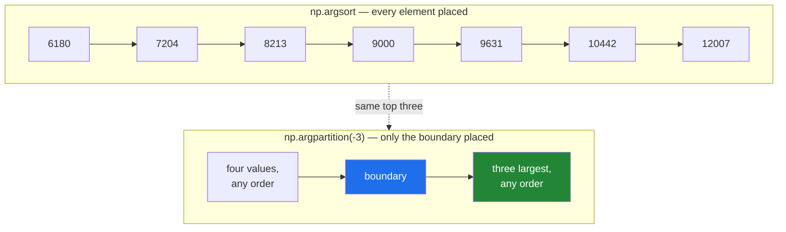

# 3.3 — Top-k and `argpartition` — the retrieval primitive, 130 days early

## One-line answer

`np.argpartition(arr, -k)` finds the positions of the `k` largest values **without putting anything else
in order**, which on two million scores is about ten times faster than a full `argsort` for exactly the
same top ten.

---

## The story

Somebody has a month of step counts and wants their three best days.

The obvious thing is to put all twenty-eight days in order, then look at the last three. That works, and
on twenty-eight numbers it takes no time at all.

Now imagine the same question about ten years of readings. Putting three and a half thousand days in
strict order, so that you can read three of them, means deciding whether day 1 402 beat day 2 810 — a
question nobody asked and nobody will ever look at the answer to. Almost all of that work is thrown away
the moment it is finished.

What a person would actually do is different. Go through the list once, keeping the best three seen so
far, and throw away everything else as you pass it. At the end you have the three, and you have never
compared any of the discarded days against each other.

Same answer, and it never sorted anything.

---

## The idea in plain language

**Top-k** is the name for the question "which are the k largest?" — where `k` is a small number and the
array is large. It is the shape of an enormous number of real problems: the ten most similar documents,
the five slowest queries, the twenty highest-scoring candidates.

Sorting answers it, and does far too much work. A sort puts **every** element in its exact final place. A
top-k only needs the boundary between "in the best k" and "not in the best k"; the arrangement inside
each group is irrelevant.

**Partitioning** is the operation that does only that. `np.partition(arr, kth)` rearranges the array so
that the element which belongs at position `kth` in sorted order really is there, everything smaller than
it is somewhere to its left, and everything larger is somewhere to its right. **No promise at all is made
about the order within each side.** That much weaker promise can be kept in a single pass over the data,
so partitioning costs roughly `n` operations where a sort costs roughly `n log n`.

`np.argpartition` is to `np.partition` what `argsort` is to `sort`
([3.2](3.2-argsort-the-positions.md)): it returns positions rather than values, so the answer can be
applied to whatever labels the scores belong to.

The `kth` argument is a position in sorted order, and for a top-k you give it a **negative** one.
`np.argpartition(scores, -k)` puts the element that belongs at the k-th-from-last position where it
belongs, which means the last `k` entries of the result are the positions of the k largest values. Take
them with `[-k:]`.

Those `k` positions come back in **no particular order**. If you need them ranked — and for a search
result you do — you sort just those `k`, which is a sort of ten things rather than of two million. That
two-step is the whole recipe:

1. `np.argpartition(scores, -k)[-k:]` — the k best positions, unordered. One pass over everything.
2. `top[np.argsort(scores[top])[::-1]]` — those k positions, ranked. A sort of k things.

One warning that saves an hour. `np.argpartition` gives no promise whatsoever about the elements it did
not have to move, so **the two functions disagree about the whole array while agreeing about the answer**.
Comparing `np.argpartition(x, -3)` against `np.argsort(x)` element by element will show differences and
that is not a bug. Compare the **sets** of the last `k` positions, or compare the values.

---

## Why Setu needs it

- **Day 155's vector database phase** benchmarks four stores, and what all four of them do internally is
  this operation. Knowing it now is what makes their trade-offs readable rather than magical.
- **Day 162's RAG retriever** scores every chunk and returns the best five. Written with `argsort`, it is
  the slowest line in the pipeline; written with `argpartition`, it is not.
- **Day 25's gate module** returns the best and worst days, and the gate is about beating a loop, so the
  cheaper primitive is the one it must use.
- **Day 107's ensembles** select the most important features by score, which is a top-k over a few
  thousand values.
- **Day 172 onwards**, ranking model outputs before showing them to a user is this operation on every
  request, so its cost is on the latency budget of every call.

---

## The mechanism

Three best days, without sorting the month:

```python
import numpy as np

DAYS = np.array(["Mon", "Tue", "Wed", "Thu", "Fri", "Sat", "Sun"])
week = np.array([8213, 10442, 6180, 9000, 12007, 9631, 7204])
k = 3

part = np.argpartition(week, -k)
top = part[-k:]
ranked = top[np.argsort(week[top])[::-1]]

print("week        :", week)
print("argpartition:", part)
print("top-3 (any) :", top, week[top])
print("top-3 ranked:", ranked, DAYS[ranked], week[ranked])
print("agrees      :", set(top.tolist()) == set(np.argsort(week)[-k:].tolist()))
```

**Line by line:**

- `k = 3` as a name, not a literal — it appears three times below and getting one of them wrong is a
  quiet off-by-one rather than an error.
- `np.argpartition(week, -k)` — the `-k` is the important character. It means "the position that would be
  third from the end in sorted order", so everything after it is the top three. Passing `k` instead of
  `-k` gives the three **smallest**, and both spellings run happily.
- `part[-k:]` — the last three positions. **They are not in order**, and the printed output shows that:
  `[5 1 4]`, which is Saturday, Tuesday, Friday, ascending by accident rather than by promise.
- `week[top]` — fancy indexing to see which values those positions hold, purely as a check
  ([Day 21, 4.1](../../../day-21-indexing-and-views/parts/04-fancy-indexing/4.1-a-list-of-positions.md)).
- `np.argsort(week[top])` — argsort of **three** values, not seven. This is the second step, and at real
  sizes it is a sort of ten things instead of two million.
- `[::-1]` then indexing back into `top` — the reversal makes it descending, and indexing `top` with the
  result translates the positions-within-the-top-three back into positions in `week`. This is the same
  translate-back move as filtering in [3.2](3.2-argsort-the-positions.md), and forgetting it gives
  positions 0, 1 and 2 — Monday, Tuesday and Wednesday — which looks like a plausible answer.
- `set(top.tolist()) == set(...)` — comparing **sets**, deliberately. The two methods agree about which
  three days are best and are entitled to disagree about the order they list them in, so a set comparison
  is the honest assertion and an array comparison would be a flaky test.

```text
week        : [ 8213 10442  6180  9000 12007  9631  7204]
argpartition: [2 6 0 3 5 1 4]
top-3 (any) : [5 1 4] [ 9631 10442 12007]
top-3 ranked: [4 1 5] ['Fri' 'Tue' 'Sat'] [12007 10442  9631]
agrees      : True
```

What each function promises, drawn on the same seven values:



The top row makes six promises the question never asked for. The bottom row makes one.

Now the reason any of this matters, measured on two million scores:

```python
import timeit

import numpy as np

rng = np.random.default_rng(20260902)
scores = rng.random(2_000_000).astype(np.float32)
k = 10

t_sort = min(timeit.repeat(lambda: np.argsort(scores)[-k:], number=3, repeat=3)) / 3
t_part = min(timeit.repeat(lambda: np.argpartition(scores, -k)[-k:], number=3, repeat=3)) / 3

print(f"argsort  then take top-{k} : {t_sort * 1000:.1f} ms")
print(f"argpart  then take top-{k} : {t_part * 1000:.1f} ms")
print(f"speedup                    : {t_sort / t_part:.1f}x")
print(
    "same k positions           :",
    set(np.argsort(scores)[-k:].tolist()) == set(np.argpartition(scores, -k)[-k:].tolist()),
)
```

**Line by line:**

- `np.random.default_rng(20260902)` — a seeded generator, so this measurement is reproducible and so is
  the check on the last line
  ([Day 20, 4.2](../../../day-20-arrays-and-dtypes/parts/04-random/4.2-the-seed-is-part-of-the-result.md)).
- `.astype(np.float32)` — the dtype real embedding scores arrive in, because storing a million vectors in
  `float64` doubles the bill for no accuracy anybody uses.
- `min(timeit.repeat(..., repeat=3))` — the **minimum** of three runs, not the mean. Background activity
  on the machine can only ever make a run slower, so the fastest run is the closest estimate of the true
  cost ([Day 25, 4.2](../../../day-25-copy-view-and-the-gate/parts/04-the-benchmark/4.2-timeit-honestly.md)).
- `/ 3` after `number=3` — `timeit` reports the total for all three executions, so dividing gives the cost
  of one. Forgetting this is the most common way a benchmark is reported three times too slow.
- Both timed expressions include the `[-k:]` slice, so the comparison is between two complete answers
  rather than between two library calls.
- The final `set(...) == set(...)` — the correctness check runs beside the speed check, because a
  benchmark of a wrong answer is worthless.

```text
argsort  then take top-10 : 94.8 ms
argpart  then take top-10 : 8.7 ms
speedup                   : 10.9x
same k positions          : True
```

Eleven times faster, for the identical ten documents. On a search endpoint answering a hundred requests a
second, that is the difference between one core and eleven.

---

## When it breaks

**`kth` beyond the end of the array:**

```text
$ uv run python -c "
import numpy as np
week = np.array([8213, 10442, 6180])
np.argpartition(week, -5)
"
Traceback (most recent call last):
  File "<string>", line 4, in <module>
  File "...
umpy\_coreromnumeric.py", line 932, in argpartition
    return _wrapfunc(a, 'argpartition', kth, axis=axis, kind=kind, order=order)
  File "...
umpy\_coreromnumeric.py", line 54, in _wrapfunc
    return bound(*args, **kwds)
ValueError: kth(=-2) out of bounds (3)
```

**What it means.** You asked for the five largest of three values. Read the message carefully, because it
does not say `-5`: NumPy first adds the array's length to a negative `kth`, so `-5` became `-5 + 3 = -2`,
and *that* is what it reports as out of bounds. The `(3)` at the end is the array's length. Anyone
grepping their code for `-2` will find nothing, which is why this error takes longer to place than it
should. This is the top-k bug that actually happens: `k` comes from a request parameter or a config file,
the array is a filtered candidate set, and one day the filter leaves fewer rows than `k`. **Clamp `k`
against the array's size before the call** — `k = min(k, scores.size)` — because a search that returns
three results when ten were asked for is correct behaviour, and a crash is not.

**Comparing the whole result against a sort:**

```text
$ uv run python -c "
import numpy as np
week = np.array([8213, 10442, 6180, 9000, 12007, 9631, 7204])
print('argsort      :', np.argsort(week))
print('argpartition :', np.argpartition(week, -3))
print('equal        :', np.array_equal(np.argsort(week), np.argpartition(week, -3)))
print('top-3 equal  :', np.array_equal(np.argsort(week)[-3:], np.argpartition(week, -3)[-3:]))
print('top-3 as sets:', set(np.argsort(week)[-3:].tolist()) == set(np.argpartition(week, -3)[-3:].tolist()))
"
argsort      : [2 6 0 3 5 1 4]
argpartition : [2 6 0 3 5 1 4]
equal        : True
top-3 equal  : True
top-3 as sets: True
```

**What it means.** This is the block that catches people out, because on this small input the two agree
completely — `equal` is `True`. Partitioning is allowed to leave the rest in any order, and on seven
values the algorithm happens to leave it fully sorted. **A test written against this input will pass and
prove nothing.** Change the data or the size and the third line becomes `False` while the fourth and
fifth stay `True`. Assert what the function promises, which is the set of the top `k`, and never assert
the arrangement of everything else.

**The positions that were never translated back:**

```text
$ uv run python -c "
import numpy as np
DAYS = np.array(['Mon', 'Tue', 'Wed', 'Thu', 'Fri', 'Sat', 'Sun'])
week = np.array([8213, 10442, 6180, 9000, 12007, 9631, 7204])
top = np.argpartition(week, -3)[-3:]
print('top positions :', top)
print('right         :', DAYS[top[np.argsort(week[top])[::-1]]])
print('wrong         :', DAYS[np.argsort(week[top])[::-1]])
"
top positions : [5 1 4]
right         : ['Fri' 'Tue' 'Sat']
wrong         : ['Wed' 'Tue' 'Mon']
```

**What it means.** `np.argsort(week[top])` gives positions **within the three-element slice**, so its
values are 0, 1 and 2. Using them directly on `DAYS` names the first three days of the week, every time,
regardless of the data. No error, three plausible day names, and always wrong. The missing step is
indexing `top` with them, which converts a position-in-the-shortlist into a position-in-the-original.
**Whenever you index an array that was itself produced by indexing, ask which array the next set of
positions refers to.**

---

## In production

**What a professional writes instead of the teaching version.** One function, the clamp included, and the
labels carried through:

```python
from __future__ import annotations

import numpy as np


def top_k(scores: np.ndarray, k: int) -> np.ndarray:
    """Positions of the ``k`` largest scores, best first.

    Partitions once over the whole array and then sorts only the ``k`` survivors, so the
    cost is O(n) rather than O(n log n). ``k`` larger than the array returns every position;
    NaN scores are dropped, so a row with no score can never be returned as a winner.
    """
    if k < 1:
        raise ValueError(f"k must be at least 1, got {k}")
    live = np.flatnonzero(~np.isnan(scores))
    k = min(k, live.size)
    if k == 0:
        return np.empty(0, dtype=np.intp)
    candidates = live[np.argpartition(scores[live], -k)[-k:]]
    return candidates[np.argsort(scores[candidates])[::-1]]
```

**Line by line:**

- `k < 1` raising — asking for the top zero is almost always a bug upstream, and returning an empty array
  for it hides the bug. Asking for more than there are is **not** a bug, which is why that case is
  clamped rather than refused.
- `np.flatnonzero(~np.isnan(scores))` — the positions of real scores. Without this, a `nan` sorts to the
  top of a descending order and becomes the best result
  ([3.2](3.2-argsort-the-positions.md)).
- `k = min(k, live.size)` — the clamp, applied against the count of **live** scores rather than the array
  length, because that is what `argpartition` will actually be given.
- `if k == 0: return np.empty(0, dtype=np.intp)` — an early return with the **right dtype**. An empty
  `float64` array would raise the moment a caller used it as an index, and the failure would appear in
  the caller rather than here. `np.intp` is the integer type NumPy uses for positions, so this empty
  array is a valid index for any array.
- `live[np.argpartition(...)[-k:]]` — the translate-back, done in the same expression that produces the
  positions so the two can never drift apart.
- `candidates[np.argsort(scores[candidates])[::-1]]` — the second step, sorting only `k` values, and
  translating back again. Two translations, both necessary, both invisible from the outside.
- Returning positions rather than scores or labels — the caller owns the labels, and a function that
  returns positions works for every caller. This is [3.2](3.2-argsort-the-positions.md)'s argument applied
  to the function boundary.

**What changes at scale.** The measurement above is the whole point, and it grows: the gap between `n`
and `n log n` widens with `n`, so at ten million scores the ratio is larger still. Three further things
appear. Partitioning is destructive to layout but not to your array — `np.argpartition` allocates the
positions, while `np.partition` copies the values, so neither touches the input, and the in-place
`arr.partition()` does. Memory becomes the binding constraint before speed does: scoring ten million
candidates means a ten-million-element score array per query, and the fix is not a faster top-k but not
scoring everything — which is what an approximate nearest neighbour index does, and why Day 155 exists.
And at that point the answer stops being exact: an approximate index trades a small chance of missing a
true top-10 result for a hundredfold speedup, which is a product decision rather than a numerical one.

**The failure that only appears with real data.** A recommendation service used
`np.argsort(scores)[-k:]` and was fast enough for two years. The candidate pool grew from fifty thousand
items to four million as the catalogue grew, and p99 latency crossed the timeout. The profile showed
ninety per cent of the request in one line. Swapping in `argpartition` took an afternoon and removed the
need for the additional machines that had been ordered. Nothing about the code had been wrong; it had
been written for a size that no longer existed.

**The review comment a senior engineer leaves.** *"`np.argsort(scores)[-10:]` sorts four million scores
to read ten. Use `np.argpartition(scores, -10)[-10:]`, then sort those ten. Also please clamp `k` — the
filtered candidate set can be smaller than `k`, and `argpartition` raises rather than returning what it
has."*

**The interview question.** *"How do you get the ten most similar vectors out of a million scores?"* Not
with a sort. `np.argpartition(scores, -10)[-10:]` finds the ten largest positions in a single pass by
placing only the boundary element correctly and leaving both sides unordered, then you `argsort` just
those ten to rank them — around ten times faster than sorting everything, measurably, and the gap widens
with the array. The details that show you have used it: the result is positions, so it applies to
whatever labels the scores belong to; `k` must be clamped against the array size or it raises
`kth out of bounds`; the positions from the second sort refer to the shortlist and must be translated
back through the first result, which is the bug that silently returns the first `k` items; and asserting
`argpartition` against `argsort` element by element is wrong, because only the set of the top `k` is
promised. The follow-up is that beyond a few million candidates the right fix is not a faster exact
top-k at all but an approximate index, which trades exactness for a hundredfold speedup.

---

## Check yourself

```bash
uv run python -c "
import numpy as np
rng = np.random.default_rng(1)
scores = rng.random(1_000_00)
k = 5
top = np.argpartition(scores, -k)[-k:]
ranked = top[np.argsort(scores[top])[::-1]]
print('unranked top-k :', top)
print('ranked  top-k  :', ranked)
print('their values   :', scores[ranked].round(6))
print('descending?    :', np.all(np.diff(scores[ranked]) < 0))
print('matches argsort:', set(top.tolist()) == set(np.argsort(scores)[-k:].tolist()))
"
```

The first two lines contain the same five numbers in a different order. Say which of the two you would
return from a search endpoint, and what the other one is for.

**Answer out loud, without scrolling up:**

> Explain to somebody why finding the ten largest of a million numbers does not require sorting a million
> numbers. Then name the two positions-translations in the two-step recipe, and say what goes wrong if
> you skip the second one.

---

**Next:** [3.4 — sorting along an axis](3.4-sorting-along-an-axis.md).
