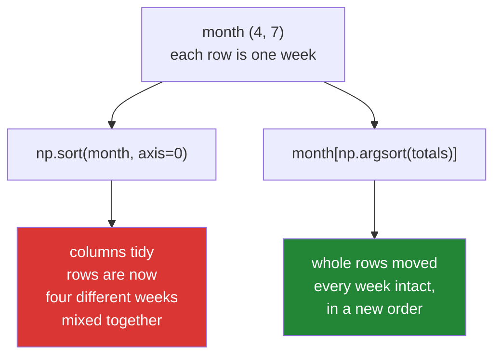

# 3.4 — Sorting along an axis — and the rows that came apart

## One-line answer

`np.sort(arr, axis=n)` sorts each line of values along that axis **independently**, so sorting a table
by a column does not reorder its rows — it shreds them, and the fix is to `argsort` one column and index
the whole table with the result.

---

## The story

Somebody has the month written on squared paper again: four rows, one per week, seven boxes across, one
per day.

They want to see the whole month tidied up, so they take a pair of scissors to it. Cut the grid into
seven vertical strips, one per day of the week. Sort the four numbers inside each strip. Lay the strips
back down side by side.

The result looks beautifully organised. Every column now runs from small at the top to large at the
bottom.

And it is nonsense. The top row of the tidied grid is the smallest Monday, the smallest Tuesday, the
smallest Wednesday — four numbers from four different weeks, sitting in a row that claims to be a week.
Add them up and you get the total of a week that never happened.

The scissors were the mistake. Tidying a grid one strip at a time destroys the only thing the rows meant.

---

## The idea in plain language

Every reduction on this day takes `axis=`, and it means "the axis that disappears"
([2.2](../02-statistics/2.2-axis-the-one-that-disappears.md)). Sorting takes `axis=` too, and it means
something different, because sorting does not reduce anything.

For a sort, `axis=` names the direction the values are put in order **along**. Nothing disappears; the
result has exactly the same shape as the input. And each line of values along that axis is sorted
**separately from every other line**.

So on a `(4, 7)` month:

- `np.sort(month, axis=1)` sorts each **week's seven days** among themselves. Four independent sorts of
  seven values. Rows stay rows: week one's numbers are still week one's numbers, in a different order.
- `np.sort(month, axis=0)` sorts each **day-of-the-week column** among themselves. Seven independent
  sorts of four values. **Rows stop being weeks**, because each column moved on its own.

The default is `axis=-1`, the last axis, which for a two-dimensional array is `axis=1`. So a bare
`np.sort(month)` sorts within each row. And `axis=None` flattens the array first and returns a
one-dimensional sorted copy — a genuinely different shape, which is easy to trip over.

Whether the independent sorting is right depends entirely on what the rows mean. If each row is a
separate sample and you want each one's values in order — the seven daily readings of one week, sorted —
then it is exactly right. If each row is a **record**, where position 3 across is a field with a meaning,
then it is destruction.

Sorting a table by one of its columns is the second case, and it needs the indirection from
[3.2](3.2-argsort-the-positions.md). Argsort the one column you are sorting by, which gives a row order,
then index the **whole table** with that order. `month[row_order]` takes whole rows in the given
sequence, so every field stays with the record it belongs to.

One more function belongs here, and it is the one people do not know exists. When you have argsorted
along an axis, indexing with the result does **not** work the way you expect: `month[order]` treats
`order` as a list of row numbers, not as per-row positions. The function that applies a per-row ordering
is `np.take_along_axis(month, order, axis=1)`. It is the correct partner to `np.argsort(..., axis=1)`,
and the two are almost always used together.

---

## Why Setu needs it

- **Day 25's gate module** ranks the weeks of a month by total. That is a table sorted by a derived
  column, so it is the `argsort`-then-index pattern, not `np.sort(axis=0)`.
- **Day 26 onwards**, `DataFrame.sort_values` is exactly this pattern with the bookkeeping hidden, and
  knowing what it is doing is what makes its `inplace=` and `kind=` arguments meaningful.
- **Day 155's retrieval** scores a batch of queries at once, giving a `(queries, documents)` matrix, and
  the top-k for every query in one call is `argpartition(..., axis=1)` followed by `take_along_axis`.
- **Day 125 onwards**, batched neural network outputs are `(batch, classes)`, and getting each row's
  best class is a per-row `argmax`. The batched version of every ranking operation lives on this
  document.
- **Day 84's tables** are sorted by a column constantly, and the failure below is the one that produces
  a plausible, publishable, wrong chart.

---

## The mechanism

The same month, sorted both ways, with the damage measured:

```python
import numpy as np

month = np.array(
    [
        [8213, 10442, 6180, 9000, 12007, 9631, 7204],
        [7788, 9120, 11345, 8402, 6733, 14210, 5096],
        [9004, 8765, 7621, 10188, 9950, 8317, 11002],
        [6540, 12488, 9873, 7106, 8899, 10540, 9218],
    ]
)

print("within each week (axis=1):")
print(np.sort(month, axis=1))
print()
print("each day column alone (axis=0):")
print(np.sort(month, axis=0))
print()
print("week totals before      :", month.sum(axis=1))
print("week totals after axis=0:", np.sort(month, axis=0).sum(axis=1))
```

**Line by line:**

- `np.sort(month, axis=1)` — four independent sorts, one per row. Every row still contains the same seven
  numbers it started with, which is what makes this the harmless one.
- `np.sort(month, axis=0)` — seven independent sorts, one per column. Every **column** still contains the
  same four numbers, and every row now contains numbers from four different weeks.
- `month.sum(axis=1)` before and after — **the measurement that proves it**. If the rows had survived,
  the four totals would be the same four numbers in some order. They are not even close.
- Printing the arrays on their own lines rather than inside a formatted string — a two-dimensional array
  is only readable when NumPy is allowed to lay it out as a grid.

```text
within each week (axis=1):
[[ 6180  7204  8213  9000  9631 10442 12007]
 [ 5096  6733  7788  8402  9120 11345 14210]
 [ 7621  8317  8765  9004  9950 10188 11002]
 [ 6540  7106  8899  9218  9873 10540 12488]]

each day column alone (axis=0):
[[ 6540  8765  6180  7106  6733  8317  5096]
 [ 7788  9120  7621  8402  8899  9631  7204]
 [ 8213 10442  9873  9000  9950 10540  9218]
 [ 9004 12488 11345 10188 12007 14210 11002]]

week totals before      : [62677 62694 64847 64664]
week totals after axis=0: [48737 58665 67236 80244]
```

The four real weeks all totalled between 62 000 and 65 000. The four rows after the `axis=0` sort total
48 737 and 80 244 — a "week" that never happened and a "week" nobody walked. **No error, no warning, and
a chart of that table would look tidier than the real one.**

Now the correct way to order the weeks, by their totals, with the rows kept whole:

```python
import numpy as np

month = np.array(
    [
        [8213, 10442, 6180, 9000, 12007, 9631, 7204],
        [7788, 9120, 11345, 8402, 6733, 14210, 5096],
        [9004, 8765, 7621, 10188, 9950, 8317, 11002],
        [6540, 12488, 9873, 7106, 8899, 10540, 9218],
    ]
)

totals = month.sum(axis=1)
row_order = np.argsort(totals)[::-1]

print("totals      :", totals)
print("row order   :", row_order)
print("sorted table:")
print(month[row_order])
print("totals now  :", month[row_order].sum(axis=1))
```

**Line by line:**

- `month.sum(axis=1)` — one number per week, which is the column being sorted by. It is derived rather
  than stored, and that is the normal case: you sort by a total, a score, a date, a similarity.
- `np.argsort(totals)` — positions **of rows**, because `totals` has one entry per row. There are four
  of them, and they are row numbers.
- `[::-1]` — descending, applied to the positions
  ([3.2](3.2-argsort-the-positions.md)).
- `month[row_order]` — **indexing the whole table with row numbers**. This takes complete rows in the
  order given, so every one of the seven days stays with its own week. This is the line the whole
  document is about, and it is a one-dimensional fancy index applied to a two-dimensional array
  ([Day 21, 4.1](../../../day-21-indexing-and-views/parts/04-fancy-indexing/4.1-a-list-of-positions.md)).
- `month[row_order].sum(axis=1)` — the same check as before, and this time the four totals are the
  original four in descending order. **That is what "the rows survived" looks like as an assertion**,
  and it is a better test than checking the shape.

```text
totals      : [62677 62694 64847 64664]
row order   : [2 3 1 0]
sorted table:
[[ 9004  8765  7621 10188  9950  8317 11002]
 [ 6540 12488  9873  7106  8899 10540  9218]
 [ 7788  9120 11345  8402  6733 14210  5096]
 [ 8213 10442  6180  9000 12007  9631  7204]]
totals now  : [64847 64664 62694 62677]
```

The two operations, side by side:



---

## When it breaks

**The per-row order used as row numbers:**

```text
$ uv run python -c "
import numpy as np
month = np.array([[8213, 10442, 6180, 9000],
                  [7788, 9120, 11345, 8402],
                  [9004, 8765, 7621, 10188],
                  [6540, 12488, 9873, 7106]])
order = np.argsort(month, axis=1)
print('order        :'); print(order)
print()
print('month[order] shape :', month[order].shape)
print('take_along_axis    :'); print(np.take_along_axis(month, order, axis=1))
"
order        :
[[2 0 3 1]
 [0 3 1 2]
 [2 1 0 3]
 [0 3 2 1]]

month[order] shape : (4, 4, 4)
take_along_axis    :
[[ 6180  8213  9000 10442]
 [ 7788  8402  9120 11345]
 [ 7621  8765  9004 10188]
 [ 6540  7106  9873 12488]]
```

**What it means.** `month[order]` did not raise; it produced a **three-dimensional** array of shape
`(4, 4, 4)`. NumPy read `order` as a `(4, 4)` grid of row numbers, looked each one up as a whole row of
length 4, and stacked the results. It is doing exactly what fancy indexing is defined to do
([Day 21, 4.2](../../../day-21-indexing-and-views/parts/04-fancy-indexing/4.2-two-index-arrays.md)); it is
simply not what you meant. `np.take_along_axis` is the function that applies a per-row ordering per row.
**The tell is the extra axis in the shape**, and it is why asserting the shape after a reorder is worth
the line.

Note that this table is square. On a table with more columns than rows the same mistake raises
`IndexError: index 3 is out of bounds for axis 0 with size 3` instead, because the per-row positions run
past the number of rows. That is the lucky case; the square one above is the case that ships.

**A bare `np.sort` on a table:**

```text
$ uv run python -c "
import numpy as np
records = np.array([[3, 100], [1, 300], [2, 200]])
print('records   :'); print(records)
print('np.sort   :'); print(np.sort(records))
print('by col 0  :'); print(records[np.argsort(records[:, 0])])
"
records   :
[[  3 100]
 [  1 300]
 [  2 200]]
np.sort   :
[[  3 100]
 [  1 300]
 [  2 200]]
by col 0  :
[[  1 300]
 [  2 200]
 [  3 100]]
```

**What it means.** `np.sort(records)` with no axis sorted **within each row**, pairing the identifier
against the value — and because each row happened to be ascending already, it returned the table
unchanged. That is the worst possible outcome, because it looks like the sort worked. On a table where
the second column is sometimes smaller than the first, this silently swaps an identifier with a
measurement. **Never call `np.sort` on a table of records without an axis**, and preferably never call it
on one at all.

**Sorting flattened by accident:**

```text
$ uv run python -c "
import numpy as np
month = np.arange(12).reshape(3, 4)
print('axis=-1 shape :', np.sort(month, axis=-1).shape)
print('axis=None     :', np.sort(month, axis=None))
print('axis=None shape:', np.sort(month, axis=None).shape)
"
axis=-1 shape : (3, 4)
axis=None     : [ 0  1  2  3  4  5  6  7  8  9 10 11]
axis=None shape: (12,)
```

**What it means.** `axis=None` on a sort does not mean "every axis" the way it does on a reduction — it
means "flatten first". The shape changes from `(3, 4)` to `(12,)`, and any code downstream expecting a
grid gets a run. This is a small inconsistency in the API worth knowing about, because `axis=None` is the
default for `np.argmax` and **not** for `np.sort`, so the two functions behave differently when the
argument is left out.

---

## In production

**What a professional writes instead of the teaching version.** Sorting a table is a named operation that
takes the column by name and asserts that the rows survived:

```python
from __future__ import annotations

import numpy as np


def order_rows_by(table: np.ndarray, key: np.ndarray, *, descending: bool = True) -> np.ndarray:
    """Reorder whole rows of ``table`` by ``key``, one key per row.

    Rows are moved intact: this never sorts within a row, so every field stays with its
    record. Returns a new array; the caller's table is untouched.
    """
    if table.ndim != 2:
        raise ValueError(f"expected a 2-D table, got shape {table.shape}")
    if key.shape != (table.shape[0],):
        raise ValueError(
            f"key must be one value per row: expected {(table.shape[0],)}, got {key.shape}"
        )
    order = np.argsort(key)
    if descending:
        order = order[::-1]
    return table[order]
```

**Line by line:**

- `key: np.ndarray` as a separate argument rather than a column index — the thing you sort by is very
  often derived (a total, a score, a distance) and not a column of the table at all. Taking it separately
  covers both cases and makes the shape check meaningful.
- `key.shape != (table.shape[0],)` — **the check that prevents the whole document's failure**. A key of
  the wrong length means the caller passed a column when they meant a row statistic, or passed
  `table.sum(axis=0)` when they meant `axis=1`. On a square table both are legal shapes and only this
  check tells them apart.
- The message printing both the expected and the actual shape — a shape mismatch is only diagnosable when
  you can see both numbers.
- `table.ndim != 2` — the function's promise is about rows, and "row" is meaningless for a
  one-dimensional array. Refusing is better than silently treating it as a single row.
- `table[order]` and never `np.sort(table, axis=...)` — the function does not contain the dangerous call
  at all. That is deliberate: the way to stop a mistake being made is to make the correct operation the
  easy one to reach for.
- Returning a new array, with the docstring saying so — this is fancy indexing, which always copies
  ([Day 21, 4.3](../../../day-21-indexing-and-views/parts/04-fancy-indexing/4.3-fancy-indexing-always-copies.md)),
  and a caller planning around memory needs that stated.

**What changes at scale.** `table[order]` is a **gather**: it reads rows in an unpredictable order and
writes them out in sequence, so it is bound by memory latency rather than by comparisons. On a table with
many columns it moves the entire table, which is why sorting a wide table by one column costs far more
than sorting the column alone. Two techniques follow from that. Sort an **index** rather than the data —
keep the table where it is and carry the row order around as a small integer array, materialising the
sorted table only if something genuinely needs it in order. And when several sorted views of the same
table are needed, store several orders rather than several copies; a million-row order array is 8 MB
against the table's gigabytes. This is what a database index is, and it is why `ORDER BY` on an indexed
column is cheap and on an unindexed one is not.

**The failure that only appears with real data.** A monthly report sorted a `(regions, months)` table
with `np.sort(table, axis=0)` to show regions from worst to best. Every column was independently sorted,
so the "worst region" row was made of the worst month of each region — twelve different regions, in one
row labelled with one region's name. The chart was published for eight months. It was found when someone
added up a row and the total did not match that region's known annual figure, which is exactly the check
the mechanism section above prints.

**The review comment a senior engineer leaves.** *"`np.sort(table, axis=0)` sorts each column
independently and breaks the row alignment — the rows here are records. Use
`table[np.argsort(table[:, 2])]`, and please assert that the row totals are a permutation of the
originals so this cannot come back."*

**The interview question.** *"How do you sort a 2-D array by one of its columns?"* Not with `np.sort`,
which sorts along an axis independently for each line and therefore shreds the rows. You `argsort` the
column to get a row order and then index the whole table with it: `table[np.argsort(table[:, i])]`. The
details that show experience: the per-row ordering from `np.argsort(a, axis=1)` cannot be used to index
`a` directly — that adds an axis and gives a three-dimensional result — and the correct partner is
`np.take_along_axis`; `np.sort` defaults to `axis=-1` while `np.argmax` defaults to `axis=None`, so
leaving the argument out means different things in different functions; and at scale you carry the order
array rather than the reordered table, because the gather moves the whole table and the order is a few
megabytes, which is the same reasoning as a database index.

---

## Check yourself

```bash
uv run python -c "
import numpy as np
month = np.array([[8213, 10442, 6180, 9000, 12007, 9631, 7204],
                  [7788, 9120, 11345, 8402, 6733, 14210, 5096],
                  [9004, 8765, 7621, 10188, 9950, 8317, 11002],
                  [6540, 12488, 9873, 7106, 8899, 10540, 9218]])
before = np.sort(month.sum(axis=1))
after_bad = np.sort(np.sort(month, axis=0).sum(axis=1))
order = np.argsort(month.sum(axis=1))[::-1]
after_good = np.sort(month[order].sum(axis=1))
print('row totals            :', before)
print('after axis=0 sort     :', after_bad)
print('after argsort reorder :', after_good)
print('axis=0 kept the rows? :', np.array_equal(before, after_bad))
print('reorder kept the rows?:', np.array_equal(before, after_good))
"
```

The last two lines are the test this document argues for. Say why comparing sorted row totals is a better
assertion than comparing shapes.

**Answer out loud, without scrolling up:**

> You have a `(1000, 20)` table of records and want it ordered by column 7, largest first. Write the one
> line, then say what `np.sort(table, axis=0)` would have done to row 4 and how you would have found out.

---

**Next:** [3.5 — `searchsorted`, binary search on an array you promised was sorted](3.5-searchsorted.md).
