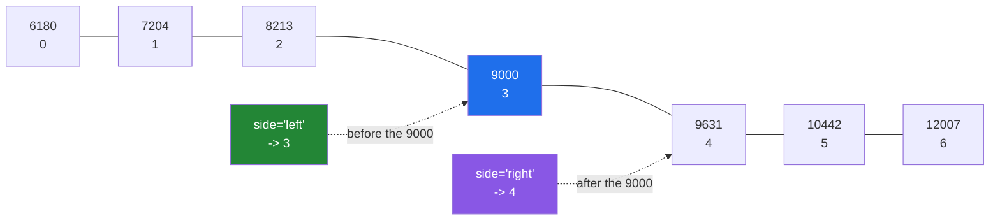

# 3.5 — `searchsorted` — binary search, and the promise it does not check

## One-line answer

`np.searchsorted(sorted_arr, values)` says where each value **would go** to keep the array in order, in
about `log n` steps instead of `n` — and it trusts you that the array is sorted, without ever looking.

---

## The story

Somebody is looking up a word in a paper dictionary.

They do not start at page one and read forwards. They open it near the middle, see they have gone too
far, open again halfway back, and after five or six of those they are on the right page. A dictionary of
two thousand pages takes about eleven of those steps, and a dictionary of four thousand takes twelve.
Doubling the book adds one step.

That only works because the dictionary is in order. Hand somebody a pile of pages in a random sequence
and the middle page tells them nothing at all — they have to look at every page, and doubling the pile
doubles the work.

Nobody checks a dictionary is alphabetical before using it. It says "dictionary" on the front, and that
is the promise. If someone had shuffled it, the lookup would not fail loudly; it would just come back
with the wrong page, confidently.

---

## The idea in plain language

**Binary search** is the dictionary method written down. Look at the middle element. If the value you
want is larger, throw away the left half; if smaller, throw away the right half. Repeat. Each step halves
what is left, so the number of steps is `log₂ n` — about twenty steps for a million elements, and
twenty-one for two million.

`np.searchsorted` is NumPy's binary search, and it answers a slightly more useful question than "is it
there". It returns the **position where the value would have to be inserted** to keep the array in order.
If the value is present, that position is where it sits; if it is absent, it is the gap it belongs in.
That one answer covers looking things up, finding where a range starts and ends, and putting values into
bins.

There is one argument, `side`, and it decides what happens with a tie. If the value already appears in
the array, there are two legal insertion points: just before the existing copy, and just after it.
`side="left"` (the default) gives the position before, so the answer is the index of the first equal
element. `side="right"` gives the position after. On an array with no duplicates the two differ by one
only when the value is present, which is precisely how you test membership: the value is in the array if
and only if `right - left` is at least one, and that difference also counts how many copies there are.

Now the part that matters more than anything else here. **`np.searchsorted` does not check that the array
is sorted.** Checking would take `n` steps, which would cost more than the search itself and defeat the
whole point. So it assumes, and on an unsorted array it returns a number — a wrong number, with no error
and no warning. That is not a flaw; it is the contract. The caller owns the promise.

The last thing worth knowing is that it takes an array of values as easily as one, and answers all of
them in one call. That is what makes it a bulk operation rather than a lookup in a loop.

---

## Why Setu needs it

- **Day 25's gate module** buckets each day into a band — under 5 000, 5 000 to 10 000, over 10 000 — and
  `searchsorted` against the band edges does that for the whole month in one call, with no loop and no
  chain of `if`s.
- **[4.4](../04-counting/4.4-histogram-and-the-edges.md)'s histogram** is this operation with the counting
  bolted on, which is why the two share the question of which side an edge belongs to.
- **Day 42's SQL phase** meets the B-tree index, which is this idea generalised to disk: the reason a
  database can find one row in a billion is that the index is kept in order so a binary search is
  possible.
- **Day 76's binning** turns a continuous feature into categories by cut points, and doing it with
  `searchsorted` is the difference between a vectorised transform and a Python loop over every row.
- **Day 155's retrieval** filters candidates by a score threshold on a sorted score array, which is one
  `searchsorted` rather than a comparison against every element.

---

## The mechanism

The week, in order, and where new values would land:

```python
import numpy as np

week = np.array([8213, 10442, 6180, 9000, 12007, 9631, 7204])
ordered = np.sort(week)

print("ordered          :", ordered)
print("insert 9000 left :", np.searchsorted(ordered, 9000, side="left"))
print("insert 9000 right:", np.searchsorted(ordered, 9000, side="right"))
print("insert 9500      :", np.searchsorted(ordered, 9500))
print("many at once     :", np.searchsorted(ordered, [0, 7000, 9500, 99999]))
print(
    "is 9000 present  :",
    np.searchsorted(ordered, 9000, "right") - np.searchsorted(ordered, 9000, "left"),
)
print(
    "is 9500 present  :",
    np.searchsorted(ordered, 9500, "right") - np.searchsorted(ordered, 9500, "left"),
)
```

**Line by line:**

- `ordered = np.sort(week)` — **the promise, kept explicitly on the line above the search**. Every
  `searchsorted` in a codebase should have a visible reason to believe its first argument is sorted, and
  a sort immediately above is the clearest one there is.
- `np.searchsorted(ordered, 9000, side="left")` — `3`. The value 9 000 is genuinely in the array at
  position 3, and "left" means "the first place it could go", which is exactly where it already is.
- `side="right"` — `4`. The place just after the existing 9 000. Neither answer is more correct; they
  answer different questions, and the argument is how you say which.
- `np.searchsorted(ordered, 9500)` — `4`. 9 500 is not in the array; it belongs between 9 000 at position
  3 and 9 631 at position 4, and the insertion point for that gap is 4. `side` makes no difference when
  the value is absent.
- `np.searchsorted(ordered, [0, 7000, 9500, 99999])` — a list of values, one call, four answers. `0`
  belongs at the very start and `99999` belongs at position 7, which is **one past the end** — a valid
  insertion point and an invalid index. Using a `searchsorted` result to index the array without clamping
  it is the bug in the first failure block below.
- The two `right - left` lines — `1` for a value that is present and `0` for one that is not. **This is
  the membership test**, and on a large sorted array it is enormously cheaper than `9000 in ordered`,
  which scans every element.

```text
ordered          : [ 6180  7204  8213  9000  9631 10442 12007]
insert 9000 left : 3
insert 9000 right: 4
insert 9500      : 4
many at once     : [0 1 4 7]
is 9000 present  : 1
is 9500 present  : 0
```

Where the two sides land on a tie:



Now the use that pays for the whole function — putting every day of the month into a band, with no loop:

```python
import numpy as np

month = np.array(
    [
        [8213, 10442, 6180, 9000, 12007, 9631, 7204],
        [7788, 9120, 11345, 8402, 6733, 14210, 5096],
        [9004, 8765, 7621, 10188, 9950, 8317, 11002],
        [6540, 12488, 9873, 7106, 8899, 10540, 9218],
    ]
)
EDGES = np.array([7000, 9000, 11000])
LABELS = np.array(["quiet", "steady", "busy", "big"])

band = np.searchsorted(EDGES, month, side="right")

print("edges     :", EDGES)
print("week one  :", month[0])
print("band index:", band[0])
print("named     :", LABELS[band[0]])
print("counts    :", np.bincount(band.ravel(), minlength=LABELS.size))
```

**Line by line:**

- `EDGES` holding three cut points and `LABELS` holding **four** names — n edges make n+1 bands, and that
  off-by-one is where every binning bug comes from. Writing them next to each other makes the mismatch
  visible if it ever happens.
- `np.searchsorted(EDGES, month, ...)` — **the roles are reversed from the first example**. The sorted
  array is the short list of edges, and the values being placed are the whole month. This is the reading
  that makes the function a binning tool: "for each of these twenty-eight numbers, which gap in this
  little sorted list does it fall in?"
- The second argument being two-dimensional — `searchsorted` accepts any shape and returns the same shape
  of answers, so a `(4, 7)` month comes back as a `(4, 7)` grid of band numbers.
- `side="right"` — the decision about the boundary itself. A day of exactly 9 000 steps goes into the band
  **above** the 9 000 edge with `"right"`, and into the band below it with `"left"`. Neither is more
  correct; what is not acceptable is failing to decide, because the boundary values are the ones people
  argue about later.
- `LABELS[band[0]]` — the band numbers used as positions into the names, which is fancy indexing again
  ([Day 21, 4.1](../../../day-21-indexing-and-views/parts/04-fancy-indexing/4.1-a-list-of-positions.md)).
  This is why the labels array must be exactly one longer than the edges: a band number can be `len(EDGES)`.
- `np.bincount(band.ravel(), minlength=LABELS.size)` — counting how many days fell in each band
  ([4.3](../04-counting/4.3-bincount.md)). `minlength=` guarantees a slot for every band even when one is
  empty, which is what stops a chart's bars from moving when a band happens to have no days in it.

```text
edges     : [ 7000  9000 11000]
week one  : [ 8213 10442  6180  9000 12007  9631  7204]
band index: [1 2 0 2 3 2 1]
named     : ['steady' 'busy' 'quiet' 'busy' 'big' 'busy' 'steady']
counts    : [ 4  9 10  5]
```

Twenty-eight days binned with no loop and no `if`. Watch the Thursday of exactly 9 000 steps: it landed in
band 2, "busy", not band 1. `side="right"` means the insertion point goes *after* an equal edge, so a value
sitting exactly on an edge falls into the band **above** it. Switch to `side="left"` and that one day moves
down a band while the other twenty-seven stay where they are — which is why the boundary rule has to be a
decision somebody wrote down, not a default somebody inherited.

---

## When it breaks

**The insertion point used as an index:**

```text
$ uv run python -c "
import numpy as np
ordered = np.array([6180, 7204, 8213, 9000, 9631, 10442, 12007])
pos = np.searchsorted(ordered, 99999)
print('position :', pos)
print('value    :', ordered[pos])
"
position : 7
Traceback (most recent call last):
  File "<string>", line 6, in <module>
IndexError: index 7 is out of bounds for axis 0 with size 7
```

**What it means.** An array of seven elements has eight legal insertion points — before each element, and
one at the very end — so `searchsorted` can return `7`, which is not a valid index. This is the same
off-by-one as the labels array above, seen from the other side. Anything that uses the result as an index
must either clamp it with `np.clip(pos, 0, len(arr) - 1)` or handle the past-the-end case deliberately.
**The `IndexError` is the good outcome**; the bad one is a two-dimensional array where the out-of-range
position happens to be legal and silently reads a neighbouring row.

**Searching an array that was never sorted:**

```text
$ uv run python -c "
import numpy as np
week = np.array([8213, 10442, 6180, 9000, 12007, 9631, 7204])
print('unsorted   :', week)
print('find 9000  :', np.searchsorted(week, 9000))
print('what is there:', week[np.searchsorted(week, 9000)])
print('find 6180  :', np.searchsorted(week, 6180))
print('really at  :', int(np.flatnonzero(week == 6180)[0]))
"
unsorted   : [ 8213 10442  6180  9000 12007  9631  7204]
find 9000  : 3
what is there: 9000
find 6180  : 0
really at  : 2
```

**What it means.** The first search is **right by luck** — position 3 does hold 9 000 — and the second is
wrong. `searchsorted` never looked at whether the array was sorted; it followed the halving procedure,
which is meaningless on an unordered array, and returned a plausible small integer. This is the failure
this function is famous for, and it has no error message at all. **The defence is not a check inside the
call; it is keeping the sort visible at the call site**, or storing the array in a type whose name says
it is sorted.

**The wrong array in the first position:**

```text
$ uv run python -c "
import numpy as np
EDGES = np.array([7000, 9000, 11000])
month = np.array([8213, 10442, 6180])
print('right way :', np.searchsorted(EDGES, month))
print('wrong way :', np.searchsorted(month, EDGES))
"
right way : [1 2 0]
wrong way : [0 1 3]
```

**What it means.** The two arguments have completely different jobs — the first must be sorted, the second
is the values being placed — and swapping them raises nothing. The "wrong way" answer here even looks
tidy. The way to keep them straight is to read the call as a sentence: *search inside the sorted thing,
for these values*. When the sorted thing is the short one, as in binning, the call reads backwards from
the lookup case, and that is exactly when people swap them.

---

## In production

**What a professional writes instead of the teaching version.** The unchecked promise is turned into a
type that cannot be wrong:

```python
from __future__ import annotations

from dataclasses import dataclass

import numpy as np


@dataclass(frozen=True, slots=True)
class Bands:
    """Cut points and their labels, checked once at construction.

    ``searchsorted`` cannot verify that its first argument is sorted, so this class does it
    on the way in and every later lookup is safe by construction. Values exactly on an edge
    fall into the band ABOVE it.
    """

    edges: np.ndarray
    labels: np.ndarray

    def __post_init__(self) -> None:
        if self.edges.ndim != 1:
            raise ValueError(f"edges must be 1-D, got shape {self.edges.shape}")
        if not np.all(np.diff(self.edges) > 0):
            raise ValueError(f"edges must be strictly increasing, got {self.edges}")
        if self.labels.size != self.edges.size + 1:
            raise ValueError(
                f"{self.edges.size} edges make {self.edges.size + 1} bands, "
                f"but {self.labels.size} labels were given"
            )

    def of(self, values: np.ndarray) -> np.ndarray:
        """The band label for every value, same shape as ``values``."""
        return self.labels[np.searchsorted(self.edges, values, side="right")]
```

**Line by line:**

- `frozen=True` — the edges cannot be changed after `__post_init__` has checked them
  ([Day 19, 2.3](../../../day-19-typing-dataclasses-and-concurrency/parts/02-dataclasses/2.3-frozen-slots-kw-only.md)).
  **That is the entire point of the class**: a mutable object could be sorted at construction and
  scrambled later, and the check would be worthless.
- `__post_init__` doing the validation — a dataclass generates `__init__` for you, and this is the hook
  where the checks go
  ([Day 19, 2.4](../../../day-19-typing-dataclasses-and-concurrency/parts/02-dataclasses/2.4-post-init.md)).
  It runs once; the searches that follow run millions of times and pay nothing.
- `np.all(np.diff(self.edges) > 0)` — **strictly** increasing, not merely non-decreasing. Duplicate edges
  would create a band that can never be reached, and finding out later that one label is never assigned is
  a bad afternoon. `np.diff` gives the gaps between neighbours
  ([2.1](../02-statistics/2.1-a-reduction-turns-many-into-one.md)).
- The label-count message spelling out the arithmetic — "3 edges make 4 bands, but 3 labels were given"
  tells the caller what to do. "Length mismatch" does not.
- `side="right"` written out with its meaning in the docstring — the boundary decision is a policy, and a
  policy that lives only in an unexplained keyword argument will be changed by somebody who does not know
  it was one.
- `self.labels[...]` returning labels rather than band numbers — the caller gets something they can put in
  a report. The past-the-end position that broke the first failure block cannot happen here, because the
  labels array is guaranteed to be exactly one longer than the edges.

**What changes at scale.** This is the operation whose whole reason for existing is scale. A linear scan
of a million sorted values to find one is a million comparisons; `searchsorted` is about twenty. Binning
a million values against ten edges is a million times twenty comparisons, and a Python loop with a chain
of `if`s is a million times ten in the interpreter — which is roughly ten thousand times slower in
practice, not twice. Two further things matter at size. `searchsorted` on a large array is dominated by
cache misses, because each halving step jumps to an unpredictable location, so its real cost grows faster
than `log n` suggests once the array leaves cache; this is why on-disk indexes are B-trees rather than
plain sorted arrays, since a B-tree node is a cache line's worth of keys and each disk read makes more
progress. And keeping the array sorted has a cost of its own: inserting one value into a sorted array of
a million is a million-element copy, so a structure that is searched constantly and appended to constantly
is the wrong shape for this function.

**The failure that only appears with real data.** A pricing service binned customers by spend using
`searchsorted` against a band table loaded from a configuration file. Someone added a new band and put it
in the middle of the file in the wrong place, so the edges were no longer ascending. Nothing raised. The
binning quietly became meaningless for the two bands around the mistake, and the customers in them were
charged on the wrong tier for eleven days. A single `np.all(np.diff(edges) > 0)` on load would have caught
it at start-up.

**The review comment a senior engineer leaves.** *"`np.searchsorted` assumes this array is sorted and this
one comes straight out of a config file. Please validate it once at load, and use the `Bands` type rather
than passing a raw array around — right now three different call sites each have to remember."*

**The interview question.** *"How would you find which bucket each of a million values belongs in?"*
`np.searchsorted` against the bucket edges: one call, no loop, about `log n` comparisons per value. The
detail that matters is `side`, which decides whether a value exactly on an edge goes into the band above
or below, and that decision has to be made deliberately because boundary values are what people query
later. The point that shows real experience is that `searchsorted` **does not check that its first
argument is sorted** — checking would cost more than the search — so on an unsorted array it returns a
plausible wrong number with no error at all, which makes it worth wrapping in a type that validates the
edges once at construction. The follow-up: n edges make n+1 bands, the returned position can be one past
the end, and using that result to index the array without clamping is the classic bug.

---

## Check yourself

```bash
uv run python -c "
import numpy as np
ordered = np.array([6180, 7204, 8213, 9000, 9631, 10442, 12007])
print('left  9000 :', np.searchsorted(ordered, 9000, 'left'))
print('right 9000 :', np.searchsorted(ordered, 9000, 'right'))
print('absent     :', np.searchsorted(ordered, 9500))
print('past end   :', np.searchsorted(ordered, 99999), 'array length', ordered.size)
print('present?   :', np.searchsorted(ordered, 9000, 'right') - np.searchsorted(ordered, 9000, 'left'))
dupes = np.array([1, 5, 5, 5, 9])
print('how many 5s:', np.searchsorted(dupes, 5, 'right') - np.searchsorted(dupes, 5, 'left'))
"
```

The last line counts duplicates without scanning. Say how many comparisons it costs on an array of ten
million, and what the alternative would have cost.

**Answer out loud, without scrolling up:**

> `np.searchsorted` returns a number for an unsorted array instead of raising. Say why that is the right
> design, and describe the one thing you would build so that it can never be called on an unsorted array
> in your codebase.

---

**Next:** [3.6 — stability, `kind=`, and the tie that moved](3.6-stability-and-kind.md).
