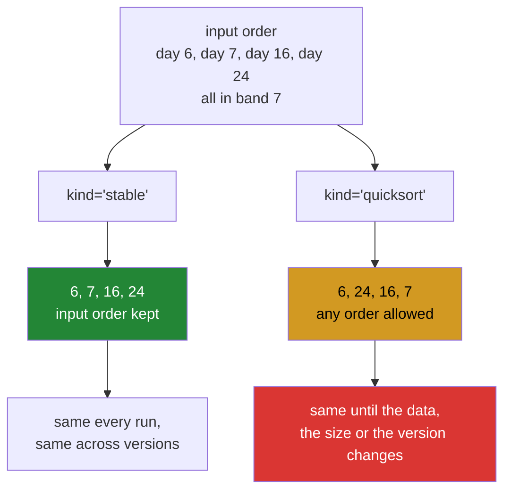

# 3.6 — Stability and `kind=` — the tie that moved

## One-line answer

When two values are equal a sort has to put one of them first, and NumPy's default algorithm makes no
promise about which — so `kind="stable"` is what you pass when equal items must keep the order they
arrived in, and it costs about ten times as much.

---

## The story

Somebody sorts the month's days into rough bands: under seven thousand steps, seven to eight thousand,
eight to nine thousand, and so on. Twenty-eight days, ten bands, so plenty of days share a band.

They print the list on Monday and pin it up. Tuesday morning, nothing about the data has changed, and
they print it again to give someone a copy.

The two printouts are not the same. The bands are identical and the days within a band have swapped
places. Day 19 was above day 7 yesterday and is below it today.

Nobody typed anything. Nobody changed the numbers. The list simply came out differently, because
"put these in order" never said what to do about two days that are equally busy, and the sorting did
something reasonable and arbitrary both times.

---

## The idea in plain language

A sort is asked to put values in order. When two values are **equal**, order does not tell you which
should come first, so the algorithm is free to choose. Different algorithms choose differently, and some
choose differently on different days depending on the data around them.

A sort is called **stable** when it makes a promise about that choice: equal items come out in the same
relative order they went in. If day 7 was before day 19 in the input and they tie, day 7 is before day 19
in the output. A sort that makes no such promise is **unstable**. Unstable does not mean random or
broken; it means unspecified, which is worse in one particular way — it can be consistent for years and
then change.

NumPy exposes the choice through `kind=`, on `sort`, `argsort`, `partition` and `argpartition`. The names
are historical and slightly misleading:

| `kind=` | What you actually get | Stable |
|---|---|---|
| `"quicksort"` (default) | introsort — quicksort that switches to heapsort on bad inputs | no |
| `"stable"` | radix sort for small integers, timsort/mergesort otherwise | **yes** |
| `"mergesort"` | an alias for `"stable"` | **yes** |
| `"heapsort"` | heapsort, with a guaranteed worst case | no |

Two things are worth knowing about that table. The default `"quicksort"` is not plain quicksort — plain
quicksort has a catastrophic worst case on already-sorted or adversarial input, so NumPy uses introsort,
which detects the bad case and falls back. And `"mergesort"` and `"stable"` select the same thing, so
seeing both in one codebase means somebody learned the API at two different times.

Why does stability matter at all, when the values are equal anyway? Because in real work the values being
sorted are almost never the whole record. You sort documents by score and two documents tie; the scores
are equal, the documents are not. Which one appears first is visible to a user, gets clicked, gets
cached, gets compared against yesterday's output in a test.

Stability also enables a technique worth having: **sorting by several keys, one at a time**. Sort by the
least important key first, then by the next, and so on up to the most important. Each stable sort
preserves the arrangement the previous ones made within its own ties, so the final result is ordered by
all of them. It only works if every sort after the first is stable. NumPy also offers `np.lexsort`, which
does the whole thing in one call and takes its keys in that same reversed order — least important first —
which is the argument order everybody gets wrong the first time.

The cost is real, and it is the reason `"stable"` is not the default. Keeping the promise means the
algorithm cannot move elements as freely, and for most dtypes it needs a scratch array as large as the
input.

---

## Why Setu needs it

- **Day 25's gate module** groups days into bands and lists them. A list that reorders itself between two
  runs on unchanged data is a bug a reviewer will find before you do.
- **Day 155's retrieval** returns ranked documents, and ties in a similarity score are common when
  embeddings are quantised. An unstable tie-break means the same query returns a different first result
  on different days.
- **Day 162's RAG evaluation** compares today's retrieved chunks against a recorded set. A test written
  against an unstable order is a flaky test, and flaky tests get deleted rather than fixed.
- **Day 26 onwards**, `DataFrame.sort_values` passes `kind=` straight through to NumPy and defaults to
  `"quicksort"` for a single column, so this decision follows you into pandas.
- **Day 107's feature importances** are sorted to pick the top n, and features with identical importance
  are exactly what happens when a tree never split on either of them.

---

## The mechanism

The month's days, grouped into thousands, sorted twice:

```python
import numpy as np

month = np.array(
    [
        [8213, 10442, 6180, 9000, 12007, 9631, 7204],
        [7788, 9120, 11345, 8402, 6733, 14210, 5096],
        [9004, 8765, 7621, 10188, 9950, 8317, 11002],
        [6540, 12488, 9873, 7106, 8899, 10540, 9218],
    ]
)
flat = month.ravel()
band = flat // 1000

quick = np.argsort(band, kind="quicksort")
stable = np.argsort(band, kind="stable")

print("band       :", band)
print("quicksort  :", quick)
print("stable     :", stable)
print("identical  :", np.array_equal(quick, stable))
print("quick bands:", band[quick])
print("stable bands:", band[stable])
```

**Line by line:**

- `month.ravel()` — twenty-eight days in one run, because ties are what this document is about and a
  `(4, 7)` grid would sort each row separately
  ([3.4](3.4-sorting-along-an-axis.md)). `ravel` is a view here, so nothing was copied
  ([Day 22, 2.4](../../../day-22-broadcasting-and-shape/parts/02-reshape/2.4-ravel-and-flatten.md)).
- `flat // 1000` — integer division, which throws away everything below the thousand and **manufactures
  ties on purpose**. Twenty-eight days across ten bands means most bands hold two or three days. This is
  not a contrived example: rounding a continuous value into a category is one of the most common things
  done to data, and it creates ties every time.
- `kind="quicksort"` written out rather than left to the default — the two calls sit next to each other
  and the only difference between them should be visible.
- `np.array_equal(quick, stable)` — the answer is `False`. **Two calls, same data, different results, no
  error.**
- `band[quick]` and `band[stable]` — the proof that both are correct. The band values come out in exactly
  the same non-decreasing order for both; only the days within each band differ.

```text
band       : [ 8 10  6  9 12  9  7  7  9 11  8  6 14  5  9  8  7 10  9  8 11  6 12  9
  7  8 10  9]
quicksort  : [13  2 11 21  6 24 16  7 19 15 10 25  0 14  3  8  5 27 23 18 17 26  1  9
 20  4 22 12]
stable     : [13  2 11 21  6  7 16 24  0 10 15 19 25  3  5  8 14 18 23 27  1 17 26  9
 20  4 22 12]
identical  : False
quick bands: [ 5  6  6  6  7  7  7  7  8  8  8  8  8  9  9  9  9  9  9  9 10 10 10 11
 11 12 12 14]
stable bands: [ 5  6  6  6  7  7  7  7  8  8  8  8  8  9  9  9  9  9  9  9 10 10 10 11
 11 12 12 14]
```

Look at the four days in band 7. Stable lists them as `6, 7, 16, 24` — ascending, which is the order they
appeared in the month. Quicksort lists them as `6, 24, 16, 7`, which is a perfectly valid answer to a
question nobody asked precisely enough.

What each algorithm promises:



The amber box is not wrong. The red box is why the amber box costs you an afternoon eventually.

Now the price, measured on two million values:

```python
import timeit

import numpy as np

rng = np.random.default_rng(20260902)
scores = rng.random(2_000_000).astype(np.float32)

for kind in ["quicksort", "stable", "heapsort"]:
    seconds = min(timeit.repeat(lambda k=kind: np.sort(scores, kind=k), number=3, repeat=3)) / 3
    print(f"  {kind:10s} {seconds * 1000:.1f} ms")
```

**Line by line:**

- `lambda k=kind: ...` — the default argument captures `kind` **at the moment the lambda is made**.
  Writing `lambda: np.sort(scores, kind=kind)` would look up `kind` when the lambda runs, by which time
  the loop has moved on, and every measurement would be of the last algorithm. This is the late-binding
  closure trap
  ([Day 10, 2.4](../../../day-10-functions/parts/02-scope/2.4-closures-and-late-binding.md)), and a
  benchmark loop is where it does the most damage, because the numbers still look plausible.
- `min(timeit.repeat(...))` — the minimum of three runs. Other work on the machine can only make a run
  slower, so the fastest is the best estimate of the true cost.
- `np.sort` rather than `argsort` — timing the values-only version keeps the comparison about the
  algorithm rather than about allocating a second array of positions.
- `float32` random data with no ties — deliberately the case where stability buys nothing, so the number
  below is the price of the promise on its own.

```text
  quicksort  15.9 ms
  stable     168.6 ms
  heapsort   16.1 ms
```

Ten times. That is the whole argument for the default, and it is also the reason to reach for `"stable"`
knowingly rather than everywhere.

---

## When it breaks

**A test that passes on the fixture and fails in production:**

```text
$ uv run python -c "
import numpy as np
small = np.array([2, 1, 2, 1, 0])
print('small quick :', np.argsort(small, kind='quicksort'))
print('small stable:', np.argsort(small, kind='stable'))
print('agree       :', np.array_equal(np.argsort(small, kind='quicksort'), np.argsort(small, kind='stable')))
rng = np.random.default_rng(3)
big = rng.integers(0, 3, size=40)
print('big agree   :', np.array_equal(np.argsort(big, kind='quicksort'), np.argsort(big, kind='stable')))
"
small quick : [4 1 3 0 2]
small stable: [4 1 3 0 2]
agree       : True
big agree   : False
```

**What it means.** On five values the two algorithms agree, because introsort switches to insertion sort
below a size threshold and insertion sort happens to be stable. On forty values they do not. **A unit
test with a small fixture cannot detect an unstable sort**, and that is exactly the shape of bug that
ships: green locally, different in production, and impossible to reproduce on the fixture. If ordering
within ties matters, the test has to assert it on data large enough for the fallback not to hide it — or,
better, the code has to say `kind="stable"` so the question never arises.

**`lexsort` with the keys the wrong way round:**

```text
$ uv run python -c "
import numpy as np
band = np.array([2, 1, 2, 1])
steps = np.array([9000, 5000, 8000, 6000])
print('band first :', np.lexsort((steps, band)))
print('steps first:', np.lexsort((band, steps)))
print('band[a]    :', band[np.lexsort((steps, band))], 'steps', steps[np.lexsort((steps, band))])
print('band[b]    :', band[np.lexsort((band, steps))], 'steps', steps[np.lexsort((band, steps))])
"
band first : [1 3 2 0]
steps first: [1 3 2 0]
band[a]    : [1 1 2 2] steps [5000 6000 8000 9000]
band[b]    : [1 1 2 2] steps [5000 6000 8000 9000]
```

**What it means.** Both spellings agree here, which is the trap in miniature — this data cannot tell them
apart. `np.lexsort` takes its keys **last-is-primary**: the final element of the tuple is the main sort
key and everything before it breaks ties. So `np.lexsort((steps, band))` sorts by band and uses steps to
break ties, which is almost certainly what was meant, and reads exactly backwards. When the two spellings
do differ, neither raises, and the difference is only visible in the rows where the primary key ties.
**Write the tuple with a comment naming the primary key**, every time.

**The `kind` that is not what its name says:**

```text
$ uv run python -c "
import numpy as np
rng = np.random.default_rng(0)
data = rng.integers(0, 5, size=30)
a = np.argsort(data, kind='mergesort')
b = np.argsort(data, kind='stable')
c = np.argsort(data, kind='quicksort')
print('mergesort == stable :', np.array_equal(a, b))
print('quicksort == stable :', np.array_equal(c, b))
"
mergesort == stable : True
quicksort == stable : False
```

**What it means.** `"mergesort"` and `"stable"` are the same selector — NumPy's documentation says
`"mergesort"` is kept as an alias and that the actual algorithm chosen may be radix sort or timsort
depending on the dtype
(<https://numpy.org/doc/stable/reference/generated/numpy.sort.html>). This is not a bug, but it does mean
that reading `kind="mergesort"` in a codebase tells you the author wanted stability, not that a merge sort
is running. Prefer `"stable"`, which says what you want rather than how you imagined it would be done.

---

## In production

**What a professional writes instead of the teaching version.** The tie-break is made explicit rather
than inherited from an algorithm:

```python
from __future__ import annotations

import numpy as np


def rank_with_tiebreak(scores: np.ndarray, arrival: np.ndarray) -> np.ndarray:
    """Positions of ``scores`` from best to worst, ties broken by earliest ``arrival``.

    Does not rely on sort stability. Two rows with the same score are ordered by ``arrival``,
    which is a value in the data, so the result is identical across NumPy versions, array
    sizes and machines.
    """
    if scores.shape != arrival.shape:
        raise ValueError(f"scores {scores.shape} and arrival {arrival.shape} must match")
    # lexsort takes keys LAST-IS-PRIMARY: the final key is the main sort, earlier keys
    # break its ties. Primary key is -scores, so larger scores come first.
    return np.lexsort((arrival, -scores))
```

**Line by line:**

- `arrival: np.ndarray` as a required argument — **the design decision of the whole function**. A tie-break
  that lives in the data is reproducible; one that lives in an algorithm's internals is not. Every ranking
  that a person will look at twice needs a column like this, and the usual candidates are a timestamp, an
  identifier, or an insertion counter.
- The docstring's first line saying "does not rely on sort stability" — this tells a future maintainer that
  changing `kind=` here would not silently change behaviour, because there is nothing left for stability to
  decide.
- The comment above `lexsort` spelling out the key order — the argument order is genuinely backwards from
  how it is spoken, and this is one of the few places where a comment restating the API earns its keep.
- `-scores` as the primary key rather than reversing the result with `[::-1]` — reversing the whole result
  would also reverse the tie-break, turning "earliest arrival first" into "latest arrival first" among
  equals. **This is the subtle one**: `[::-1]` on a lexsort result is almost never right.
- `np.lexsort` rather than two chained stable sorts — one call, one pass of bookkeeping, and no chance of
  someone later "optimising" the first sort to `kind="quicksort"` and quietly breaking the second.
- The shape check before anything else, naming both shapes — the two arrays are parallel by convention
  only, exactly as in [3.2](3.2-argsort-the-positions.md).

**What changes at scale.** The ten-times cost measured above is the headline, and it grows in absolute
terms with the array: at two million values it is 150 ms per sort, which on a request path is a budget of
its own. Memory is the second cost — a stable sort needs a scratch buffer the size of the input for most
dtypes, so sorting a 4 GB array stably needs 8 GB, and this is a common cause of a job that sorts fine on
a sample and is killed on the full dataset. Then there is a third thing that only appears once the data no
longer fits on one machine: a distributed sort has no meaningful notion of "the order they arrived in",
because the input order is a property of the partitioning, so stability stops being available at all and
an explicit tie-break column is the only option. That is why every serious ranking system stores one.

**The failure that only appears with real data.** A results page ranked items by a score rounded to two
decimal places, which produced a great many ties. The default sort was used. For eighteen months the page
was consistent, because the candidate set was small enough that introsort's insertion-sort fallback ran
and happened to be stable. The catalogue grew, the fallback stopped triggering, and users started
reporting that refreshing the page reshuffled results. The report was dismissed twice as a caching
problem. The fix was one keyword and one extra sort key.

**The review comment a senior engineer leaves.** *"These scores are quantised, so ties are the normal
case, not the edge case. The default sort makes no promise about their order, and the snapshot test will
start failing the first time the candidate pool crosses the insertion-sort threshold. Add an explicit
tie-break on `document_id` with `lexsort` rather than switching to `kind='stable'` — that way the order is
a property of the data instead of a property of NumPy's build."*

**The interview question.** *"What does a stable sort guarantee, and when do you need one?"* That equal
elements keep the order they were in before the sort. You need it whenever the values being sorted are
not the whole record — ranked search results with tied scores, a table sorted by one column where the
others still matter, or any output compared against a previous run. The details that show experience:
NumPy's default `kind="quicksort"` is really introsort and is **unstable**, `"stable"` and `"mergesort"`
select the same thing, and stability costs roughly ten times the run time plus a scratch buffer the size
of the input. The point that separates people who have been bitten is that an unstable sort is not random
— it is consistent until the size or the version changes, so a small test fixture can hide it for years,
because introsort falls back to a stable insertion sort below a size threshold. And the better fix is
usually not `kind="stable"` at all: it is an explicit tie-break key with `np.lexsort`, which makes the
order a property of the data rather than of the library, and which is the only option once the sort is
distributed.

---

## Check yourself

```bash
uv run python -c "
import numpy as np
rng = np.random.default_rng(3)
band = rng.integers(0, 3, size=40)
q = np.argsort(band, kind='quicksort')
s = np.argsort(band, kind='stable')
print('same order      :', np.array_equal(q, s))
print('same bands out  :', np.array_equal(band[q], band[s]))
print('stable is input order within ties:', np.array_equal(s, np.lexsort((np.arange(40), band))))
"
```

The first line is `False` and the second is `True`. Say precisely what each one is telling you, and which
of the two a test should assert.

**Answer out loud, without scrolling up:**

> Your ranked list reshuffles between runs on unchanged data. Name the cause, give the one-keyword fix and
> the better fix, and say why the bug did not appear for the first eighteen months.

---

**Next:** [4.1 — `count_nonzero` and the mask](../04-counting/4.1-count-nonzero-and-the-mask.md).
