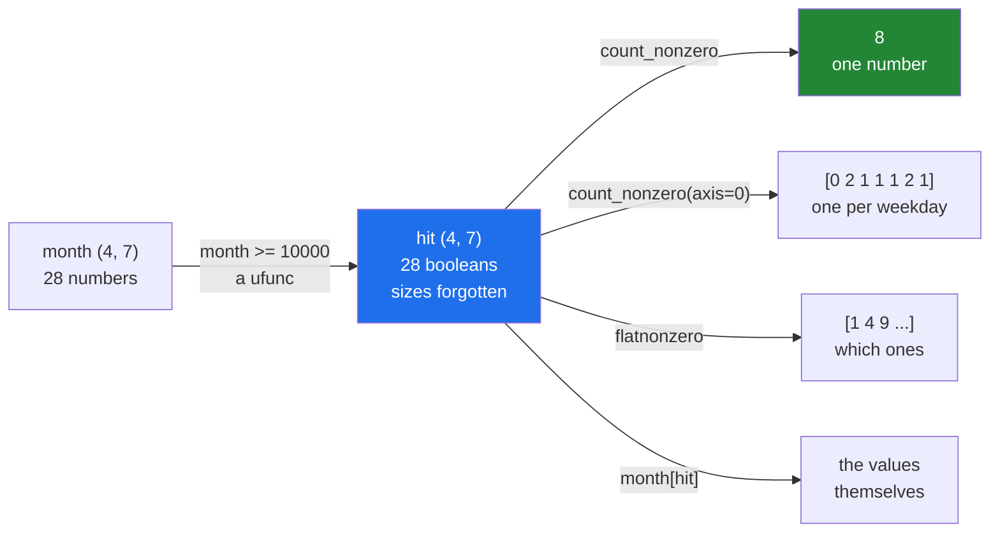

# 4.1 — `count_nonzero` — counting a mask, and the `sum` that also works

## One-line answer

A comparison gives you an array of `True` and `False`, and counting how many are `True` is
`np.count_nonzero(mask)` — or `mask.sum()`, which gives the same number and a different dtype.

---

## The story

Somebody has the month of step counts and one simple question: how many days did I hit ten thousand?

They do it the way anybody would. Run a finger down the list, and for each day say yes or no. Then count
the yeses.

Two steps, and they are genuinely different. The first step turns twenty-eight numbers into twenty-eight
yes-or-no answers. The second turns twenty-eight yes-or-no answers into one number.

It is worth noticing that after the first step the original numbers do not matter any more. A day of
10 001 steps and a day of 14 210 steps have both become the same thing: a yes. Whatever was interesting
about the difference between them has been thrown away, deliberately, because the question did not ask.

---

## The idea in plain language

Day 21 showed that comparing an array against a number gives a **boolean array** — an array of `True` and
`False` values, the same shape as the input, with one answer per element
([Day 21, 3.1](../../../day-21-indexing-and-views/parts/03-boolean-masks/3.1-a-comparison-makes-an-array.md)).
That array is called a **mask**, because its usual job is to select things.

This document is about the other thing you do with a mask: count it.

`np.count_nonzero(mask)` returns how many elements are `True`. The name is odd for a boolean array, and
the reason is that the function is older and more general than that: it counts elements that are not
zero, and `False` is zero while `True` is one. Give it an array of numbers and it counts the non-zeros;
give it a mask and it counts the `True`s. Same function, one meaning.

`mask.sum()` gives the same number, and it is worth knowing why. When a boolean array is summed, each
`True` contributes 1 and each `False` contributes 0, so the total is the number of `True`s.

On NumPy 2.5 both spellings return an `np.int64`, not a Python `int`. That is worth checking rather than
assuming, because it is exactly the kind of detail that shifts between versions and that people repeat
from memory: run `type(np.count_nonzero(mask)).__name__` yourself rather than trusting any sentence about
it, including this one. What follows from it is that **neither spelling is ready to leave your process**.
An `np.int64` is not JSON-serialisable, so a count crossing an API boundary needs an explicit `int()`
([Day 20, 2.5](../../../day-20-arrays-and-dtypes/parts/02-dtypes/2.5-nep-50-and-the-python-number.md)).

So the choice between the two is about reading, not about types. `count_nonzero` says what it does when
the array is a mask; `sum` is shorter and relies on the reader knowing that `True` is 1. Prefer
`count_nonzero` in code somebody else will read.

Both take `axis=`, and it means what it always means: the axis you name is the one that disappears
([2.2](../02-statistics/2.2-axis-the-one-that-disappears.md)). So `np.count_nonzero(hit, axis=1)` gives
one count per week and `axis=0` gives one count per day of the week.

Two nearby functions round the set out, and they answer questions that a count cannot.

`mask.any()` is `True` if at least one element is `True`, and `mask.all()` is `True` only if every one is.
They are the boolean equivalents of `sum` — reductions that fold `or` and `and` over the array rather
than `+`. Their value is that they can stop early: `any` on an array whose first element is `True` does
not need to look at the rest.

`np.flatnonzero(mask)` gives the **positions** of the `True` values rather than how many there are. This
is the counting section's link back to [3.2](../03-sorting-and-searching/3.2-argsort-the-positions.md):
when you need to know *which* days rather than *how many*, positions are the answer, and they are what
lets you carry labels along. Its two-dimensional cousin `np.nonzero(mask)` returns a tuple of arrays, one
per axis, which is a shape that surprises people the first time.

---

## Why Setu needs it

- **[2.5](../02-statistics/2.5-the-nan-family.md)'s coverage count** was `np.count_nonzero(~np.isnan(x))`,
  and every `nan`-aware statistic in this curriculum reports one alongside its answer.
- **Day 25's gate module** counts how many days hit the goal, per week and for the month, from one mask.
- **Day 76's data quality checks** are almost entirely counts of masks: how many rows are missing, how
  many are out of range, how many are duplicated.
- **Day 91 onwards**, a confusion matrix is four counts of four masks, and accuracy is
  `np.count_nonzero(predicted == actual) / actual.size`.
- **Day 162's RAG evaluation** counts how many retrieved chunks were relevant, which is this operation on
  a boolean array produced by a comparison.

---

## The mechanism

One question, asked six ways:

```python
import numpy as np

month = np.array(
    [
        [8213, 10442, 6180, 9000, 12007, 9631, 7204],
        [7788, 9120, 11345, 8402, 6733, 14210, 5096],
        [9004, 8765, 7621, 10188, 9950, 8317, 11002],
        [6540, 12488, 9873, 7106, 8899, 10540, 9218],
    ]
)
goal = 10_000
hit = month >= goal

print("hit dtype     :", hit.dtype, "shape", hit.shape)
print("count_nonzero :", np.count_nonzero(hit))
print("sum()         :", hit.sum(), hit.sum().dtype)
print("per week      :", np.count_nonzero(hit, axis=1))
print("per day       :", np.count_nonzero(hit, axis=0))
print("any / all     :", hit.any(), hit.all())
print("flatnonzero   :", np.flatnonzero(hit))
print("nonzero()     :", np.nonzero(hit))
```

**Line by line:**

- `goal = 10_000` — a named constant with an underscore separator for readability. The comparison below
  reads as a sentence because of it.
- `month >= goal` — the comparison is a ufunc
  ([1.1](../01-ufuncs/1.1-one-operation-every-element.md)), so it is elementwise and broadcasts the single
  number against all twenty-eight. The result is a **new** `(4, 7)` array of booleans, and the month is
  untouched.
- `hit.dtype` — `bool`, and one byte per element rather than one bit. A mask over a billion elements is a
  gigabyte, which is the fact behind the memory note in the production section below.
- `np.count_nonzero(hit)` — `8`. Eight days of twenty-eight reached the goal.
- `hit.sum()` — also `8`, and also an `np.int64`. **Two spellings, one answer, the same type.** Printing
  the dtype beside it is how you find that out, and it is a habit worth keeping: NumPy scalar types are
  where boundary bugs come from, and they are invisible unless you ask.
- `np.count_nonzero(hit, axis=1)` — one count per week: `[2 2 2 2]`. A remarkably even month.
- `np.count_nonzero(hit, axis=0)` — one count per day of the week: `[0 2 1 1 1 2 1]`. The leading zero is
  the useful part — **no Monday all month reached ten thousand**, which a total of eight could never have
  told you.
- `hit.any()` and `hit.all()` — "was there at least one" and "was it every day". `all()` is `False`, which
  in a data quality check is the shape of "not every row passed validation".
- `np.flatnonzero(hit)` — the positions in the flattened month, `[1 4 9 12 17 20 22 26]`. Eight positions
  for eight `True`s, which is the count arrived at differently.
- `np.nonzero(hit)` — a **tuple of two arrays**: all the row numbers, then all the column numbers. Read
  them in pairs and `(0, 1)` is week one Tuesday. This shape is what lets `month[np.nonzero(hit)]` work as
  an index, and it is why `np.nonzero` looks strange when printed
  ([Day 21, 4.2](../../../day-21-indexing-and-views/parts/04-fancy-indexing/4.2-two-index-arrays.md)).

```text
hit dtype     : bool shape (4, 7)
count_nonzero : 8
sum()         : 8 int64
per week      : [2 2 2 2]
per day       : [0 2 1 1 1 2 1]
any / all     : True False
flatnonzero   : [ 1  4  9 12 17 20 22 26]
nonzero()     : (array([0, 0, 1, 1, 2, 2, 3, 3]), array([1, 4, 2, 5, 3, 6, 1, 5]))
```

The two steps, and what each one throws away:



The mask in the middle is the reusable thing. It was built once and answered four different questions,
and that is the reason to give it a name rather than repeating the comparison.

---

## When it breaks

**Counting an array that is not a mask:**

```text
$ uv run python -c "
import numpy as np
month = np.array([[8213, 10442], [6180, 9000]])
print('count of month  :', np.count_nonzero(month))
print('count of mask   :', np.count_nonzero(month >= 10000))
zeros = np.array([0, 5, 0, 3])
print('with real zeros :', np.count_nonzero(zeros), 'of', zeros.size)
"
count of month  : 4
count of mask   : 1
with real zeros : 2 of 4
```

**What it means.** `np.count_nonzero(month)` counted every element, because every step count is non-zero.
It is not an error and it is not a count of anything anybody wanted. The missing character is the
comparison. This bites hardest when the array **does** contain zeros for a real reason — a day with no
recorded activity, a feature that is legitimately zero — because then the answer is neither obviously
right nor obviously wrong. **Name the mask on its own line**, and the mistake becomes impossible to make
silently.

**A rate that was always zero:**

```text
$ uv run python -c "
import numpy as np
month = np.array([[8213, 10442, 6180, 9000], [7788, 9120, 11345, 8402]])
hit = month >= 10000
print('fraction wrong :', np.count_nonzero(hit) // month.size)
print('fraction right :', np.count_nonzero(hit) / month.size)
print('count type     :', type(np.count_nonzero(hit)).__name__)
"
fraction wrong : 0
fraction right : 0.25
count type     : int64
```

**What it means.** `//` is integer division, so two days out of eight came back as `0`. It never raises,
it never warns, and `0` is exactly what a healthy failure rate is supposed to look like — which is why
this survives in reporting code for years. **Any rate written with `//` is wrong**, and the way to catch
it is a test whose true answer is strictly between zero and one.

**A count handed straight to `json.dumps`:**

```text
$ uv run python -c "
import json
import numpy as np
hit = np.array([[True, False], [True, True]])
print('count:', repr(np.count_nonzero(hit)))
json.dumps({'days': np.count_nonzero(hit)})
"
count: np.int64(3)
Traceback (most recent call last):
  File "<string>", line 6, in <module>
  File "...\json\__init__.py", line 231, in dumps
    return _default_encoder.encode(obj)
  File "...\json\encoder.py", line 180, in default
    raise TypeError(f'Object of type {o.__class__.__name__} '
TypeError: Object of type int64 is not JSON serializable
```

**What it means.** `np.count_nonzero` returns an `np.int64` on NumPy 2.5, and so does `hit.sum()` — both
spellings need an explicit `int()` before the value leaves your process. The `repr` on the first line is
the tell: `np.int64(3)` rather than `3`, which is how NumPy 2 prints its scalars precisely so that this
is visible
([Day 20, 2.5](../../../day-20-arrays-and-dtypes/parts/02-dtypes/2.5-nep-50-and-the-python-number.md)).
This is a boundary problem rather than a counting one, and it belongs in the same place as every other
conversion out of NumPy's world
([Day 19, 3.4](../../../day-19-typing-dataclasses-and-concurrency/parts/03-pydantic/3.4-model-dump-and-the-boundary.md)).

**`and` instead of `&`:**

```text
$ uv run python -c "
import numpy as np
month = np.array([[8213, 10442, 6180, 9000], [7788, 9120, 11345, 8402]])
print(np.count_nonzero(month >= 8000 and month < 10000))
"
Traceback (most recent call last):
  File "<string>", line 4, in <module>
ValueError: The truth value of an array with more than one element is ambiguous. Use a.any() or a.all()
```

**What it means.** Python's `and` needs a single yes or no from each side, and a mask is eight answers, so
it refuses rather than guessing. The fix is `&` with brackets around each comparison:
`(month >= 8000) & (month < 10000)`. The brackets are not optional, because `&` binds more tightly than
`>=` and leaving them off gives a different, confusing error. This is Day 21's rule
([Day 21, 3.3](../../../day-21-indexing-and-views/parts/03-boolean-masks/3.3-and-or-not-and-why-and-raises.md)),
and it appears here because combining two conditions before counting is the normal case rather than the
exception.

---

## In production

**What a professional writes instead of the teaching version.** A count is never reported alone; it comes
with what it was counted out of:

```python
from __future__ import annotations

from dataclasses import dataclass

import numpy as np


@dataclass(frozen=True, slots=True)
class Tally:
    """How many, out of how many. Never report the first without the second."""

    matched: int
    total: int

    @property
    def rate(self) -> float:
        """Proportion matched, or 0.0 when there was nothing to match."""
        return self.matched / self.total if self.total else 0.0


def tally(mask: np.ndarray) -> Tally:
    """Count the True values in ``mask``, keeping the denominator."""
    if mask.dtype != np.bool_:
        raise TypeError(f"expected a boolean mask, got dtype {mask.dtype}")
    return Tally(matched=int(np.count_nonzero(mask)), total=int(mask.size))
```

**Line by line:**

- `Tally` carrying `total` as well as `matched` — **the design decision**. "Eight days hit the goal" is
  meaningless without knowing whether the month had twenty-eight days or three; and a count of zero out of
  zero is a very different thing from zero out of a million, which is exactly the distinction an alert
  needs to make.
- `rate` as a property with the `if self.total else 0.0` guard — division by zero on an empty input is the
  most common crash in reporting code, and it happens the first time a filter matches nothing.
- `mask.dtype != np.bool_` — **this is the check that makes the first failure block impossible**. Handing
  this function the raw month rather than a comparison is a mistake the type system will not catch, and
  one line here does.
- `np.bool_` rather than `bool` — the NumPy boolean type. Comparing against Python's `bool` also happens to
  work for this test, but naming the NumPy type says which world the dtype lives in.
- `int(...)` around both values — **not optional**. Both `np.count_nonzero` and `mask.size` hand back
  values that `json.dumps` refuses, and converting here means every consumer of a `Tally` gets plain
  Python numbers, which is the second failure block above turned into a rule.
- `mask.size` rather than a separately passed length — the denominator comes from the same object as the
  numerator, so the two cannot drift apart.

**What changes at scale.** A boolean mask is one **byte** per element, not one bit, so a mask over a
billion-row column is a gigabyte of temporary memory. That is usually fine and occasionally fatal, and
chained conditions multiply it: `(a > 1) & (b < 2) & (c != 3)` allocates three masks plus two
intermediates, five gigabytes at that size, for an answer that is one integer. Two habits follow.
`np.count_nonzero(a > 1)` never materialises a named mask beyond the one temporary, and for a chain,
`np.logical_and(m1, m2, out=m1)` reuses a buffer rather than making a third
([1.2](../01-ufuncs/1.2-out-and-the-temporaries.md)). The second habit is to prefer `any()` to a count
when the question is "is there at least one", because `any` can stop at the first `True` and a count
cannot — on a mask whose first element is `True`, that is the difference between reading one byte and a
gigabyte.

**The failure that only appears with real data.** A data quality job reported the proportion of rows
failing validation as `failures // total`, using integer division. For two years it printed `0`, which
everybody read as "no failures". It was actually "fewer than half the rows failed". The real failure rate
had drifted from 0.1 per cent to nine per cent over eighteen months and the dashboard said `0` the whole
time. It was found when someone asked why the count and the rate disagreed.

**The review comment a senior engineer leaves.** *"This returns a bare count. An alert on `matched > 100`
fires differently at ten thousand rows and at ten million. Please return the denominator too, and guard
the division — the filter upstream can legitimately match nothing."*

**The interview question.** *"How do you count how many elements of an array satisfy a condition?"*
Compare, which gives a boolean mask, then `np.count_nonzero(mask)` — or `mask.sum()`, which works because
`True` is 1. On current NumPy both return an `np.int64` rather than a Python `int`, so either way the
value needs an explicit `int()` before it is serialised; `count_nonzero` is worth preferring only because
it says what it means. Both take `axis=`, so per-row and per-column counts are the same call. The details that show experience: a boolean mask costs one byte per
element rather than one bit, so chained conditions on a large array allocate several full-size temporaries
for what is ultimately one integer; `any()` should be preferred to a count when the question is "at least
one", because it can stop early; and combining conditions needs `&` with brackets, since Python's `and`
raises `The truth value of an array with more than one element is ambiguous`.

---

## Check yourself

```bash
uv run python -c "
import numpy as np
month = np.array([[8213, 10442, 6180, 9000, 12007, 9631, 7204],
                  [7788, 9120, 11345, 8402, 6733, 14210, 5096],
                  [9004, 8765, 7621, 10188, 9950, 8317, 11002],
                  [6540, 12488, 9873, 7106, 8899, 10540, 9218]])
hit = month >= 10000
print('count       :', repr(np.count_nonzero(hit)))
print('sum         :', repr(hit.sum()))
print('same type   :', type(np.count_nonzero(hit)) is type(hit.sum()))
print('per weekday :', np.count_nonzero(hit, axis=0))
print('rate        :', np.count_nonzero(hit) / month.size)
band = (month >= 8000) & (month < 10000)
print('in band     :', np.count_nonzero(band))
print('mask bytes  :', hit.nbytes, 'for', hit.size, 'elements')
"
```

The first two lines print `np.int64(8)` rather than `8`. Say what breaks when that value goes into a JSON
response, and what one call fixes it. Then read the last line: it reports one byte per element, so say
what a mask over a billion rows costs, and what you would write instead if the answer only had to be
"was there at least one".

**Answer out loud, without scrolling up:**

> Name two ways to count the `True` values in a mask, say the one real difference between them, and say
> what `np.count_nonzero(month)` counts when you forget the comparison.

---

**Next:** [4.2 — `np.unique` and the four extra arrays](4.2-unique.md).
