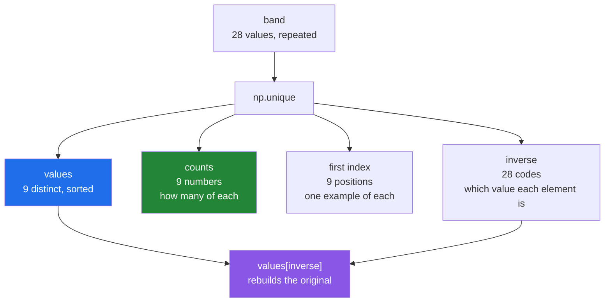

# 4.2 — `np.unique` — the distinct values, and the four extra arrays

## One-line answer

`np.unique(arr)` returns the distinct values, **sorted**, and its four optional return arrays turn it
from a deduplicator into a complete answer to "what is in here, how many of each, and where".

---

## The story

Somebody is going through the month of step counts and wants to know what sort of days they actually
have. Not the exact numbers — those are all different — but the shape of the month.

So they round each day to the nearest thousand and write the rounded number on a sticky note. Twenty-eight
notes. Then they gather the notes into piles: all the eights together, all the nines together, and so on.

At the end there are nine piles. That already answers the first question — the month contains nine
different kinds of day. Counting the notes in each pile answers a second one, and it turns out the pile
of nines is the biggest, with seven days in it.

And there is a third thing, which people forget they have. Each note can remember which day it came from.
So the piles are not only a summary; they are a way back to the original days, grouped.

---

## The idea in plain language

**Distinct values** means the values with duplicates removed. Python has a tool for this already — a set
([Day 8, 2.1](../../../day-08-containers/parts/02-sets-and-dicts/2.1-a-set-is-a-hash-table.md)) — and
`np.unique` is the array version, with two differences that matter.

The first is that the result is **sorted**. A Python set has no order at all; `np.unique` always returns
its answer smallest first. That is not a bonus feature, it is a consequence of how the function works: it
sorts the array and then walks it looking for neighbours that differ, which is why it costs about
`n log n` rather than the `n` a hash-based set would cost.

The second difference is that `np.unique` can return four more arrays alongside the values, and this is
what makes it worth learning properly rather than reaching for a set. Each is switched on by a keyword
argument.

**`return_counts=True`** gives how many times each distinct value appeared. This is the pile sizes, and it
is by far the most used of the four. `values, counts = np.unique(arr, return_counts=True)` is one of the
handful of NumPy lines worth knowing by heart.

**`return_index=True`** gives, for each distinct value, the position of its **first** appearance in the
original array. That is how you go from a summary back to a representative row.

**`return_inverse=True`** gives, for **every element of the original array**, which distinct value it is —
as a position into the values array. This one takes a moment to see and then becomes indispensable:
`values[inverse]` rebuilds the original array exactly. It is how you turn text categories into integer
codes, which is what every encoder in machine learning does
([Day 76's encoding](../../../day-22-broadcasting-and-shape/parts/05-the-module/5.1-mean-centring-the-month.md)
is the same idea applied to a column).

**`equal_nan=True`** is the default and decides whether multiple `nan` values collapse into one. Since
`nan` is not equal to itself ([2.5](../02-statistics/2.5-the-nan-family.md)), the honest answer would be
to keep every one of them as distinct; NumPy folds them together by default because that is almost always
what people mean.

One more argument, and it changes what "a value" means. `np.unique(arr, axis=0)` treats each **row** as
the thing to be deduplicated rather than each element. That is how you find distinct records in a table,
and it is the answer to "are there duplicate rows in this dataset".

---

## Why Setu needs it

- **[4.3](4.3-bincount.md)** counts the same way and much faster, but only for small non-negative
  integers. Knowing where `unique` is necessary and where `bincount` is enough is the point of having
  both.
- **Day 25's gate module** reports how many distinct step-bands the month contains, which is a
  `return_counts` call.
- **Day 76's categorical encoding** is `return_inverse` under a different name, and the leak it can cause
  — fitting the code table on the whole dataset rather than the training split — is the same leak Day 22
  designed out
  ([Day 22, 5.1](../../../day-22-broadcasting-and-shape/parts/05-the-module/5.1-mean-centring-the-month.md)).
- **Day 84's exploratory work** starts every categorical column with value counts, which is this call.
- **Day 91 onwards**, checking class balance before training is `np.unique(y, return_counts=True)`, and
  the answer decides whether accuracy is a meaningful metric at all.
- **Day 117's NLP phase** builds a vocabulary, which is exactly `unique` plus `return_inverse` to turn
  tokens into identifiers.

---

## The mechanism

The month, rounded into bands, and all four extras:

```python
import numpy as np

month = np.array(
    [
        [8213, 10442, 6180, 9000, 12007, 9631, 7204],
        [7788, 9120, 11345, 8402, 6733, 14210, 5096],
        [9004, 8765, 7621, 10188, 9950, 8317, 11002],
        [6540, 12488, 9873, 7106, 8899, 10540, 9218],
    ]
)
band = (month // 1000).ravel()

values, first, inverse, counts = np.unique(
    band, return_index=True, return_inverse=True, return_counts=True
)

print("band       :", band)
print("values     :", values)
print("counts     :", counts)
print("pairs      :", list(zip(values.tolist(), counts.tolist())))
print("first index:", first)
print("inverse    :", inverse)
print("rebuild ok :", np.array_equal(values[inverse], band))
```

**Line by line:**

- `month // 1000` — integer division, which drops everything below the thousand and turns twenty-eight
  distinct numbers into nine repeated ones. **Without this step `unique` would return all twenty-eight
  values and teach nothing**, which is the honest reason real data is binned before it is counted.
- `.ravel()` — one flat run, because `np.unique` flattens by default anyway and doing it explicitly means
  the `inverse` positions line up with something you can point at. `ravel` is a view here
  ([Day 22, 2.4](../../../day-22-broadcasting-and-shape/parts/02-reshape/2.4-ravel-and-flatten.md)).
- All four keywords at once — the return values come back in a fixed order: **values, index, inverse,
  counts**, regardless of the order you passed the keywords in. Getting that order wrong is the most
  common mistake with this function, and the fix is to unpack into named variables on the spot rather
  than subscripting the result later.
- `values` — `[5 6 7 8 9 10 11 12 14]`. Nine bands, sorted, and note that **13 is absent**: no day in the
  month landed between thirteen and fourteen thousand. A list of distinct values has gaps, which is
  exactly the difference between this function and [4.3](4.3-bincount.md).
- `counts` — `[1 3 4 5 7 3 2 2 1]`, lined up with `values` position by position. The 7 sits under the 9,
  so seven days were in the nine-thousands.
- `list(zip(values.tolist(), counts.tolist()))` — the two arrays zipped into pairs for reading.
  `.tolist()` converts to Python numbers so the printed output is `(9, 7)` rather than a row of
  `np.int64(...)` wrappers.
- `first` — `[13 2 6 0 3 1 9 4 12]`. Position 13 in the flat month is the first day in band 5. Use it as
  `month.ravel()[first]` to get one real example of each band.
- `inverse` — twenty-eight numbers, one per original day, each saying **which of the nine values that day
  is**. The first day was band 8, and 8 is at position 3 in `values`, so `inverse[0]` is 3.
- `np.array_equal(values[inverse], band)` — `True`, and this is the line that explains what `inverse` is
  for. **The pair `(values, inverse)` is a complete, lossless, compressed representation of the original
  array**: nine values plus twenty-eight small codes. That is what a categorical dtype is.

```text
band       : [ 8 10  6  9 12  9  7  7  9 11  8  6 14  5  9  8  7 10  9  8 11  6 12  9
  7  8 10  9]
values     : [ 5  6  7  8  9 10 11 12 14]
counts     : [1 3 4 5 7 3 2 2 1]
pairs      : [(5, 1), (6, 3), (7, 4), (8, 5), (9, 7), (10, 3), (11, 2), (12, 2), (14, 1)]
first index: [13  2  6  0  3  1  9  4 12]
inverse    : [3 5 1 4 7 4 2 2 4 6 3 1 8 0 4 3 2 5 4 3 6 1 7 4 2 3 5 4]
rebuild ok : True
```

The four outputs and what each is a map from:



`values` and `counts` are a summary. `values` and `inverse` are a **substitute** for the data.

Now the version that finds duplicate records:

```python
import numpy as np

readings = np.array(
    [
        [1, 8213],
        [2, 10442],
        [1, 8213],
        [3, 6180],
        [2, 10442],
    ]
)

rows, counts = np.unique(readings, axis=0, return_counts=True)

print("readings   :")
print(readings)
print("distinct   :")
print(rows)
print("counts     :", counts)
print("duplicated :")
print(rows[counts > 1])
```

**Line by line:**

- `axis=0` — **the argument that changes what "a value" means**. Without it, `unique` would flatten the
  table and return the distinct numbers `[1 2 3 6180 8213 10442]`, which answers a question nobody asked
  about a table.
- The rows are compared whole, so two rows count as the same only if every column matches. That is the
  definition of a duplicate record, and it is why this is the standard duplicate check.
- `return_counts=True` alongside `axis=0` — the counts now say how many times each **row** appeared.
- `rows[counts > 1]` — a boolean mask over the distinct rows
  ([4.1](4.1-count-nonzero-and-the-mask.md)), selecting the ones that appeared more than once. **This is
  the duplicate report**, and it is two lines rather than a loop.
- `readings` printed on its own line — the deduplicated output is only meaningful next to the input.

```text
readings   :
[[    1  8213]
 [    2 10442]
 [    1  8213]
 [    3  6180]
 [    2 10442]]
distinct   :
[[    1  8213]
 [    2 10442]
 [    3  6180]]
counts     : [2 2 1]
duplicated :
[[    1  8213]
 [    2 10442]]
```

Note that the distinct rows came back sorted by their first column, not in the order they were first seen.
`np.unique` always sorts, including with `axis=0`.

---

## When it breaks

**The return values unpacked in the wrong order:**

```text
$ uv run python -c "
import numpy as np
band = np.array([9, 8, 9, 7, 9])
values, counts = np.unique(band, return_counts=True)
print('right  :', values, counts)
values, counts = np.unique(band, return_index=True)
print('wrong  :', values, counts)
"
right  : [7 8 9] [1 1 3]
wrong  : [7 8 9] [3 1 0]
```

**What it means.** The second call asked for `return_index` and unpacked it into a variable called
`counts`. Both calls return two arrays of the same length and the same dtype, so nothing raises and
nothing looks odd — but `[3 1 0]` is a list of positions, not a list of counts, and a chart drawn from it
would be confidently wrong. **The defence is the variable names at the call site**, and never writing
`np.unique(x, return_counts=True)[1]`, which loses the only clue about what the second element is.

**Assuming the values are consecutive:**

```text
$ uv run python -c "
import numpy as np
band = np.array([5, 9, 9, 14])
values, counts = np.unique(band, return_counts=True)
print('values :', values)
print('counts :', counts)
print('counts[9] would be:', counts[9] if 9 < counts.size else 'IndexError')
print('correct lookup    :', counts[np.searchsorted(values, 9)])
"
values : [ 5  9 14]
counts : [1 2 1]
counts[9] would be: IndexError
correct lookup    : 2
```

**What it means.** The counts array is indexed by **position in `values`**, not by the value itself.
`counts[9]` is not "how many nines"; it is "the count of the tenth distinct value", which here does not
exist. This is the difference between `unique` and `bincount` ([4.3](4.3-bincount.md)), where the
position *is* the value. The correct lookup goes through `np.searchsorted`, which is cheap because
`values` is sorted by construction
([3.5](../03-sorting-and-searching/3.5-searchsorted.md)).

**`nan` folded together, and floats that should have been:**

```text
$ uv run python -c "
import numpy as np
with_nans = np.array([1.0, np.nan, 2.0, np.nan])
print('default    :', np.unique(with_nans))
print('equal_nan F:', np.unique(with_nans, equal_nan=False))
near = np.array([0.1 + 0.2, 0.3])
print('near       :', np.unique(near), 'size', np.unique(near).size)
print('are equal? :', near[0] == near[1])
"
default    : [ 1.  2. nan]
equal_nan F: [ 1.  2. nan nan]
near       : [0.3 0.3] size 2
are equal? : False
```

**What it means.** Two float traps. `equal_nan=False` keeps every `nan` separately, because `nan != nan`
is the truth and folding them is a convenience — the default is the convenience, and it is usually right.
The second is worse: `0.1 + 0.2` and `0.3` are different `float64` values that **print identically**, so
`np.unique` correctly reports two distinct values and the output shows `[0.3 0.3]`. Deduplicating floats
by exact equality is nearly always a mistake
([1.6](../01-ufuncs/1.6-isclose-and-allclose.md)); round to a stated number of decimals first, and make
that rounding a documented decision rather than an accident.

---

## In production

**What a professional writes instead of the teaching version.** The counts are returned as something that
cannot be indexed by the wrong thing:

```python
from __future__ import annotations

from dataclasses import dataclass

import numpy as np


@dataclass(frozen=True, slots=True)
class ValueCounts:
    """Distinct values and how often each occurred, always the same length."""

    values: np.ndarray
    counts: np.ndarray

    def __post_init__(self) -> None:
        if self.values.shape != self.counts.shape:
            raise ValueError(f"values {self.values.shape} != counts {self.counts.shape}")

    def count_of(self, value: object) -> int:
        """How many times ``value`` occurred. Zero if it never did."""
        position = int(np.searchsorted(self.values, value))
        if position >= self.values.size or self.values[position] != value:
            return 0
        return int(self.counts[position])

    @property
    def most_common(self) -> tuple[object, int]:
        """The value that occurred most often, and how often. Ties broken by value."""
        if self.values.size == 0:
            raise ValueError("no values to summarise")
        best = int(np.argmax(self.counts))
        return self.values[best].item(), int(self.counts[best])


def value_counts(arr: np.ndarray) -> ValueCounts:
    """Distinct values of ``arr`` with their frequencies, smallest value first."""
    values, counts = np.unique(arr, return_counts=True)
    return ValueCounts(values=values, counts=counts)
```

**Line by line:**

- `ValueCounts` holding both arrays — **the design decision**. The two arrays are only meaningful together
  and are trivially swapped when returned as a bare tuple, which is the first failure block above made
  impossible.
- `__post_init__` asserting matching shapes — cheap, once, and it catches the case where somebody
  constructs the object by hand from two unrelated arrays
  ([Day 19, 2.4](../../../day-19-typing-dataclasses-and-concurrency/parts/02-dataclasses/2.4-post-init.md)).
- `count_of` going through `np.searchsorted` — **the fix for the second failure block**. It looks a value
  up by its value rather than by its position, and it is a binary search rather than a scan because
  `np.unique` guarantees the values are sorted
  ([3.5](../03-sorting-and-searching/3.5-searchsorted.md)).
- `if position >= self.values.size or self.values[position] != value` — the two ways `searchsorted` can
  point at something that is not the value you asked for: past the end, or at the gap where it would go.
  **Both must be checked**, and checking only one is a bug that appears exactly when the value is larger
  than every value present.
- `return 0` for an absent value rather than raising — a value that never occurred occurred zero times,
  which is a real answer and is what every caller wants.
- `most_common` using `np.argmax` on the counts — one pass, no sort
  ([2.1](../02-statistics/2.1-a-reduction-turns-many-into-one.md)). The docstring says ties are broken by
  value because `argmax` returns the **first** maximum and the values are sorted ascending, so the
  behaviour is defined rather than incidental
  ([3.6](../03-sorting-and-searching/3.6-stability-and-kind.md)).
- `.item()` on the value — converts a NumPy scalar to the nearest Python type whatever the dtype is, which
  is the general form of the `int()` and `float()` conversions used elsewhere
  ([Day 20, 2.5](../../../day-20-arrays-and-dtypes/parts/02-dtypes/2.5-nep-50-and-the-python-number.md)).

**What changes at scale.** `np.unique` sorts, so it costs `n log n` and — importantly — it **copies**: a
4 GB array needs another 4 GB for the sorted intermediate. At that size the alternatives matter. If the
values are small non-negative integers, `np.bincount` is a single pass with no sort and no copy
([4.3](4.3-bincount.md)), often ten times faster. If you only need to know *whether* there are duplicates
rather than which, comparing `arr.size` against `np.unique(arr).size` still pays the full cost, and a
better answer is often a hash-based structure. And when the array does not fit in memory at all, exact
distinct counts stop being available and you move to a sketch — HyperLogLog and its relatives — which is
what a database means by `APPROX_COUNT_DISTINCT`. The other scale effect is `return_inverse`: on a
hundred million rows with fifty distinct values, storing `values` plus an `int8` inverse instead of the
original `int64` array is an eight-fold saving, and that substitution is precisely what a categorical
column is in pandas and in Parquet.

**The failure that only appears with real data.** A pipeline encoded a categorical column with
`np.unique(column, return_inverse=True)` and stored the codes. It was run on the training data, then run
again on the test data. Both runs produced codes from 0 upward — but the test data was missing one
category, so every code above it was shifted by one, and the model was fed systematically wrong
categories. Accuracy dropped by a third with no error anywhere. **The code table must be fitted once,
on the training split, and then applied**, never re-derived per dataset; that is the same leakage
principle as fitting a scaler
([Day 22, 5.1](../../../day-22-broadcasting-and-shape/parts/05-the-module/5.1-mean-centring-the-month.md)).

**The review comment a senior engineer leaves.** *"`np.unique(x, return_counts=True)[1]` — the `[1]` says
nothing about what it is, and a later reader adding `return_index` will silently get positions here.
Unpack into named variables, and note that this sorts and copies a 3 GB array; the values are small
integers, so `np.bincount` would do it in one pass."*

**The interview question.** *"How do you get the value counts of an array?"*
`values, counts = np.unique(arr, return_counts=True)` — and the two arrays are parallel and sorted by
value. The details worth adding: `unique` sorts, so it costs `n log n` and copies the array, which makes
`np.bincount` the better choice for small non-negative integers; the returned arrays come back in the
fixed order values, index, inverse, counts regardless of which keywords you passed; and the counts array
is indexed by position in `values`, not by the value, so looking up a specific value goes through
`np.searchsorted`. The one that shows real experience is `return_inverse`: `values[inverse]` reconstructs
the original array exactly, which is what a categorical encoding is — and re-deriving that mapping
separately for a training set and a test set silently shifts every code when a category is missing from
one of them.

---

## Check yourself

```bash
uv run python -c "
import numpy as np
band = np.array([9, 8, 9, 7, 9, 14, 8])
values, first, inverse, counts = np.unique(band, return_index=True, return_inverse=True, return_counts=True)
print('values   :', values)
print('counts   :', counts)
print('first    :', first)
print('inverse  :', inverse)
print('rebuilds :', np.array_equal(values[inverse], band))
print('bytes org:', band.nbytes, 'bytes as values+inverse:', values.nbytes + inverse.astype(np.int8).nbytes)
print('most     :', values[np.argmax(counts)], counts.max())
"
```

The last-but-one line compares two ways of storing the same information. Say which is smaller here, why
that reverses on a million rows, and what the technique is called.

**Answer out loud, without scrolling up:**

> Name the four optional return arrays of `np.unique`, say what order they come back in, and explain what
> `values[inverse]` gives you and why that makes it a compression rather than a summary.

---

**Next:** [4.3 — `np.bincount`, counting without a sort](4.3-bincount.md).
