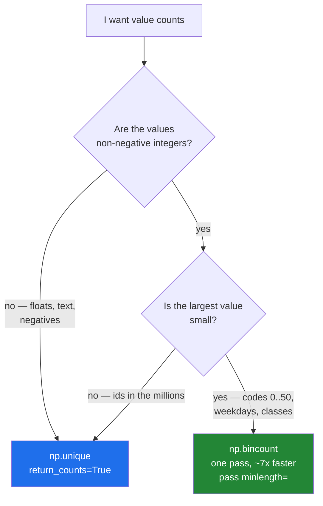

# 4.3 — `np.bincount` — counting without a sort, and the length that surprised you

## One-line answer

`np.bincount(codes)` counts small non-negative integers in a single pass with no sort, returning an array
where **the position is the value** — so its length is decided by the largest value present, not by how
many distinct values there are.

---

## The story

Somebody is counting which day of the week they walk most.

They could write every day on a note and sort the notes into piles, which is what
[4.2](4.2-unique.md) does. But they know something extra here that makes the sorting unnecessary: there
are exactly seven possible answers, and they know them in advance.

So they draw seven boxes on a sheet of paper, labelled Monday to Sunday, and go through the month once.
Each day, put a tick in its box. Twenty-eight days, twenty-eight ticks, one pass, no sorting and no
deciding.

The catch shows up when they try the same trick with the actual step counts instead of the weekdays.
Fourteen thousand two hundred and ten steps needs a box labelled 14 210, and to be ready for every
possible answer they would have to draw fourteen thousand two hundred and eleven boxes — almost all of
them empty forever.

Boxes are cheap when the labels are few and small. They are absurd when the labels are large.

---

## The idea in plain language

`np.bincount` is the boxes. Give it an array of non-negative integers and it returns an array of counts
where **position `i` holds how many times the value `i` appeared**.

That one sentence contains everything that makes it fast and everything that makes it awkward.

It is fast because it never sorts. It walks the input once, adding one to a slot, which costs `n` rather
than `n log n`. Measured on five million values with fifty distinct codes, that was around seven times
quicker than `np.unique(..., return_counts=True)` on the same data.

It is awkward because the result's **length is `max(values) + 1`**, not the number of distinct values.
Count `[0, 5_000_000]` and you get an array of five million and one entries, forty megabytes, of which
two are non-zero. `np.unique` would have returned two values and two counts. This is the whole trade, and
it is a trade about the **range** of the values, not their count.

Three consequences follow, and they are what you actually need to remember.

**Missing values become zeros rather than gaps.** `np.unique` on `[5, 9, 14]` returns three values and
tells you nothing about 6, 7 or 8. `np.bincount` returns fifteen numbers with zeros in every position no
value occupied. For a chart with a fixed set of categories, the zeros are exactly what you want; for a
list of what is present, they are noise.

**The input must be non-negative integers.** A negative value has no box, and a float has no box either.
Both raise rather than being silently rounded or skipped, which is the right choice.

**`minlength=` fixes the length.** Passing `minlength=7` guarantees seven slots even if no Sunday ever
appears in this particular month. Without it, a month with no Sundays would return six counts and every
chart, comparison and test downstream would be misaligned by one. **This argument is not optional in real
code**, and forgetting it is the most common bug with this function.

There is one more argument and it turns the function into something else entirely. `weights=` makes each
element contribute its weight rather than 1. So `np.bincount(day_of_week, weights=steps)` gives the total
**steps** per weekday rather than the number of days — a grouped sum, in one call, with no loop. That is
the whole of `GROUP BY ... SUM(...)` for integer keys, and it is the reason this function is worth more
than its name suggests.

---

## Why Setu needs it

- **Day 25's gate module** totals steps per day of the week. With `weights=`, that is one line and no
  loop, and it is the pattern the gate's speed requirement is built on.
- **[4.4](4.4-histogram-and-the-edges.md)'s histogram** is `searchsorted` to get a bin number followed by
  `bincount` to count them, so this is half of that function.
- **Day 91 onwards**, class balance is `np.bincount(y, minlength=n_classes)`, and the `minlength` is what
  stops a fold with no examples of the rarest class from shifting every later index.
- **Day 107's confusion matrix** is built with `np.bincount` on a combined code, which is the standard
  trick for counting pairs.
- **Day 117's NLP phase** counts token identifiers, which are exactly small non-negative integers by
  construction, so this is the counting function for a vocabulary.

---

## The mechanism

Steps per weekday, in one line and no loop:

```python
import numpy as np

month = np.array(
    [
        [8213, 10442, 6180, 9000, 12007, 9631, 7204],
        [7788, 9120, 11345, 8402, 6733, 14210, 5096],
        [9004, 8765, 7621, 10188, 9950, 8317, 11002],
        [6540, 12488, 9873, 7106, 8899, 10540, 9218],
    ]
)
weekday = np.tile(np.arange(7), 4)

print("weekday        :", weekday)
print("days per weekday:", np.bincount(weekday, minlength=7))
print("steps per weekday:", np.bincount(weekday, weights=month.ravel().astype(float), minlength=7))
print("check with axis :", month.sum(axis=0))
```

**Line by line:**

- `np.tile(np.arange(7), 4)` — the numbers 0 to 6 repeated four times, one weekday label per day of the
  month, matching `month.ravel()`'s order. `arange` gives the seven
  ([Day 20, 3.3](../../../day-20-arrays-and-dtypes/parts/03-creating/3.3-arange-and-the-float-step.md))
  and `tile` repeats the whole block, which is what you want here rather than `repeat`, which would give
  `[0 0 0 0 1 1 1 1 ...]`.
- `np.bincount(weekday, minlength=7)` — four of each, because there are four weeks. This is the "how many"
  question, and it is the plain use of the function.
- `weights=month.ravel().astype(float)` — **the same call becomes a grouped sum**. Each day contributes
  its step count to its weekday's slot instead of contributing 1.
- `.astype(float)` on the weights — `weights` always produces a `float64` result regardless of the input,
  so converting explicitly means the dtype of the answer is a decision rather than a surprise
  ([Day 20, 2.4](../../../day-20-arrays-and-dtypes/parts/02-dtypes/2.4-astype-and-the-copy.md)).
- `minlength=7` on both calls — with only twenty-eight days it happens to be unnecessary here, and it is
  written anyway. **A month that started on a Tuesday and ended on a Saturday would produce six slots**,
  and every comparison against another month would then be silently misaligned.
- `month.sum(axis=0)` — the same answer computed a completely different way, by eating the week axis
  ([2.2](../02-statistics/2.2-axis-the-one-that-disappears.md)). Printing both is the check that the
  weekday labels really did line up with the flattened month, which is the one assumption this code
  makes.

```text
weekday        : [0 1 2 3 4 5 6 0 1 2 3 4 5 6 0 1 2 3 4 5 6 0 1 2 3 4 5 6]
days per weekday: [4 4 4 4 4 4 4]
steps per weekday: [31545. 40815. 35019. 34696. 37589. 42698. 32520.]
check with axis : [31545 40815 35019 34696 37589 42698 32520]
```

The last two lines agree, which is the point: `bincount` with weights reproduced a per-column sum without
the data ever being arranged in columns. That matters because real data does not arrive as a tidy grid —
it arrives as a long list of (key, value) pairs, and this is how you group it.

Now the length trap, shown directly:

```python
import numpy as np

band = np.array([5, 9, 9, 14])

print("band            :", band)
print("unique          :", np.unique(band))
print("unique counts   :", np.unique(band, return_counts=True)[1])
print("bincount        :", np.bincount(band))
print("bincount length :", np.bincount(band).size, "= max + 1 =", band.max() + 1)
print("with minlength  :", np.bincount(band, minlength=20).size)
print("count of nines  :", np.bincount(band)[9])
```

**Line by line:**

- The same four values through both functions, printed together — this is the comparison the whole
  document rests on, and seeing the two answers side by side is worth more than any description of them.
- `np.unique(band)` — `[5 9 14]`. Three values, and nothing at all about 6 through 8 or 10 through 13.
- `np.bincount(band)` — fifteen numbers, `[0 0 0 0 0 1 0 0 0 2 0 0 0 0 1]`, with zeros everywhere no value
  landed. Same information, a different shape, and one of the two shapes is what a bar chart with fixed
  categories needs.
- `np.bincount(band).size` printed next to `band.max() + 1` — **the rule, made checkable**. The length
  has nothing to do with how many distinct values there were.
- `minlength=20` — the length becomes 20. `minlength` is a floor, not a ceiling: it can only extend the
  result, never truncate it, so passing `minlength=3` here would still give fifteen.
- `np.bincount(band)[9]` — `2`. **The position is the value**, so this reads as "how many nines" directly.
  That is precisely what `np.unique`'s counts array cannot do
  ([4.2](4.2-unique.md)), and it is the reason to prefer `bincount` when the values are dense and small.

```text
band            : [ 5  9  9 14]
unique          : [ 5  9 14]
unique counts   : [1 2 1]
bincount        : [0 0 0 0 0 1 0 0 0 2 0 0 0 0 1]
bincount length : 15 = max + 1 = 15
with minlength  : 20
count of nines  : 2
```

Which function to reach for:



The right-hand branch is a question about the **range**, never about the count. A million rows with values
0 to 9 is a perfect fit; four rows with values 0 to 5 000 000 is not.

---

## When it breaks

**A negative value:**

```text
$ uv run python -c "
import numpy as np
np.bincount(np.array([1, -2, 3]))
"
Traceback (most recent call last):
  File "<string>", line 3, in <module>
ValueError: 'list' argument must have no negative elements
```

**What it means.** There is no box numbered minus two. The message says `'list' argument`, which is the
internal name of the parameter and not a hint that you passed a list — that wording confuses people every
time. In practice a negative here means a sentinel has leaked in: `-1` is the near-universal code for
"unknown category", and it survives every earlier step because it is a perfectly good integer. **Decide
what an unknown category counts as before this line**, either by filtering it out or by shifting every
code up by one so that `-1` becomes `0`.

**A float:**

```text
$ uv run python -c "
import numpy as np
np.bincount(np.array([1.0, 2.0]))
"
Traceback (most recent call last):
  File "<string>", line 3, in <module>
TypeError: Cannot cast array data from dtype('float64') to dtype('int64') according to the rule 'safe'
```

**What it means.** `bincount` needs an integer dtype and will not convert one for you, because the
conversion would have to throw information away and `'safe'` casting forbids that
([Day 20, 2.4](../../../day-20-arrays-and-dtypes/parts/02-dtypes/2.4-astype-and-the-copy.md)). This is
almost always a column that became `float64` because it had a missing value in it
([2.5](../02-statistics/2.5-the-nan-family.md)), and the fix is upstream: decide what happens to the
missing rows, then `.astype(np.int64)` deliberately. Casting first and asking questions later turns every
`nan` into an enormous meaningless integer.

**The array that was forty megabytes:**

```text
$ uv run python -c "
import numpy as np
big = np.array([0, 5_000_000])
counts = np.bincount(big)
print('input values :', big.size)
print('result length:', counts.size)
print('result bytes :', counts.nbytes)
print('non-zero     :', np.count_nonzero(counts))
"
input values : 2
result length: 5000001
result bytes : 40000008
non-zero     : 2
```

**What it means.** Two input values produced a forty-megabyte result of which exactly two entries are
non-zero, because the length is driven by the largest value. Scale that up: user identifiers are commonly in the hundreds of millions, so
`np.bincount(user_id)` on a table of a thousand rows allocates an array of hundreds of millions of
`int64`s — gigabytes — and it does it without any warning at all, right up until the process is killed.
**Never call `bincount` on an identifier.** The fix is to map the identifiers to dense codes first, which
is exactly `np.unique(..., return_inverse=True)`
([4.2](4.2-unique.md)), and then count the codes.

---

## In production

**What a professional writes instead of the teaching version.** The number of categories is a fact about
the domain, so it is stated rather than inferred:

```python
from __future__ import annotations

import numpy as np

DAYS_IN_WEEK = 7


def steps_per_weekday(counts: np.ndarray, weekday: np.ndarray) -> np.ndarray:
    """Total steps for each day of the week, always ``DAYS_IN_WEEK`` long.

    ``weekday`` holds a code 0-6 per reading, parallel to ``counts``. A weekday with no
    readings gets 0.0 rather than being absent, so the result can be compared against
    another period's result position by position.
    """
    if weekday.shape != counts.shape:
        raise ValueError(f"weekday {weekday.shape} and counts {counts.shape} must match")
    if weekday.dtype.kind not in "iu":
        raise TypeError(f"weekday codes must be integers, got dtype {weekday.dtype}")
    out_of_range = (weekday < 0) | (weekday >= DAYS_IN_WEEK)
    if out_of_range.any():
        bad = np.unique(weekday[out_of_range])
        raise ValueError(f"weekday codes must be 0-{DAYS_IN_WEEK - 1}, found {bad.tolist()}")
    return np.bincount(
        weekday.ravel(),
        weights=np.nan_to_num(counts.ravel(), nan=0.0).astype(np.float64),
        minlength=DAYS_IN_WEEK,
    )
```

**Line by line:**

- `DAYS_IN_WEEK = 7` as a module constant used for both the range check and `minlength` — **one number,
  one place**. The failure mode this prevents is a check that allows 0 to 6 and a `minlength` of 6, which
  would pass every test that happens to include a Sunday.
- The shape check first — the two arrays are parallel by convention only, the same situation as
  [3.2](../03-sorting-and-searching/3.2-argsort-the-positions.md), and a mismatch here silently attributes
  steps to the wrong weekday when the lengths happen to allow it.
- `weekday.dtype.kind not in "iu"` — signed or unsigned integers. This catches the `float64` case above
  with a message naming the dtype, rather than letting NumPy's `'safe'` casting message do it.
- `(weekday < 0) | (weekday >= DAYS_IN_WEEK)` — **an upper bound as well as a lower one.** `bincount`
  itself only refuses negatives; a stray `7` would silently create an eighth slot, and every downstream
  comparison against a seven-element array would then fail somewhere far away. `|` rather than `or`
  ([Day 21, 3.3](../../../day-21-indexing-and-views/parts/03-boolean-masks/3.3-and-or-not-and-why-and-raises.md)).
- `np.unique(weekday[out_of_range])` in the message — naming **which** bad codes were found, deduplicated.
  A million bad rows produce a short message, and the codes are what identify the upstream bug.
- `np.nan_to_num(counts, nan=0.0)` — `weights` propagates `nan` like any sum
  ([2.5](../02-statistics/2.5-the-nan-family.md)), so one unrecorded day would turn that whole weekday's
  total into `nan`. Treating a missing reading as contributing nothing to a **total** is defensible and is
  stated in the docstring; it would not be defensible for a mean, which is why that function would need a
  count of its own.
- `minlength=DAYS_IN_WEEK` — the guarantee that makes the return value comparable across months. This is
  the line the docstring's second sentence is about.

**What changes at scale.** This is where `bincount` earns its place: one pass, no sort, no copy of the
data. On five million values with fifty distinct codes it measured around seven times faster than
`np.unique(..., return_counts=True)`, and the gap holds as the array grows because one is `n` and the
other is `n log n`. Three cautions come with the size. The output array is the range, so the discipline of
never counting raw identifiers becomes a rule rather than a preference. `bincount` is single-threaded, and
at a billion rows the pass over memory is the cost, so this becomes a bandwidth problem rather than a
compute one. And the `weights=` form always accumulates in `float64` — which is the right default and the
reason it is not `float32` — so a grouped sum here does not suffer the drift of
[2.6](../02-statistics/2.6-float-summation-and-the-drift.md). The related trick worth knowing is counting
**pairs**: to build an n-by-n confusion matrix, compute `actual * n + predicted` and `bincount` that with
`minlength=n * n`, then reshape. One pass for the whole matrix.

**The failure that only appears with real data.** A training pipeline reported class balance with
`np.bincount(y)` and used the length of the result as the number of classes. It worked for months. Then a
cross-validation fold happened to contain no examples of the rarest of twelve classes, the array came back
with eleven entries, and the model was built with eleven output units while the labels still ranged to
eleven. Training did not crash; it silently learned nothing about the last class, and the error surfaced
as an unexplained accuracy drop in one fold. `minlength=n_classes` was a four-character fix.

**The review comment a senior engineer leaves.** *"`np.bincount(user_id)` allocates `max(user_id) + 1`
`int64` slots — our IDs are eight-digit, so that is 800 MB for a table of forty thousand rows. Map to
dense codes with `np.unique(..., return_inverse=True)` first. And add `minlength` to the class-balance
call; a fold with no rare-class examples silently shortens the array."*

**The interview question.** *"When would you use `bincount` instead of `unique`?"* When the values are
small non-negative integers — class labels, weekday codes, token identifiers — because `bincount` is a
single pass with no sort and measurably several times faster, and because the position in the result *is*
the value, so a category that never occurred shows as a zero rather than being missing. The trade is that
the result's length is `max(value) + 1`, so counting anything with a large range — a user identifier, a
timestamp — allocates an enormous mostly-empty array with no warning, and the fix is to map to dense codes
with `return_inverse` first. The detail that shows you have used it: `minlength=` is effectively
mandatory, because a period or a fold that happens to contain no examples of the highest code silently
returns a shorter array and misaligns everything compared against it. The bonus answer is `weights=`,
which turns it into a grouped sum in one call — and the `actual * n + predicted` trick that builds a whole
confusion matrix from a single `bincount`.

---

## Check yourself

```bash
uv run python -c "
import numpy as np
codes = np.array([0, 2, 2, 5])
print('bincount     :', np.bincount(codes))
print('length       :', np.bincount(codes).size, 'max+1 =', codes.max() + 1)
print('minlength 8  :', np.bincount(codes, minlength=8))
print('minlength 3  :', np.bincount(codes, minlength=3), '<- a floor, not a ceiling')
print('count of 2s  :', np.bincount(codes)[2])
print('unique says  :', np.unique(codes, return_counts=True))
weights = np.array([10.0, 20.0, 30.0, 40.0])
print('grouped sum  :', np.bincount(codes, weights=weights, minlength=8))
"
```

The `minlength=3` line returns six numbers, not three. Say why, and say which of the two arguments —
`minlength` or the data — actually decides the length.

**Answer out loud, without scrolling up:**

> Somebody wants value counts of a column of eight-digit customer IDs and reaches for `np.bincount`.
> Say what happens, why nothing warns them, and what the two-step fix is.

---

**Next:** [4.4 — `np.histogram` and which side an edge belongs to](4.4-histogram-and-the-edges.md).
