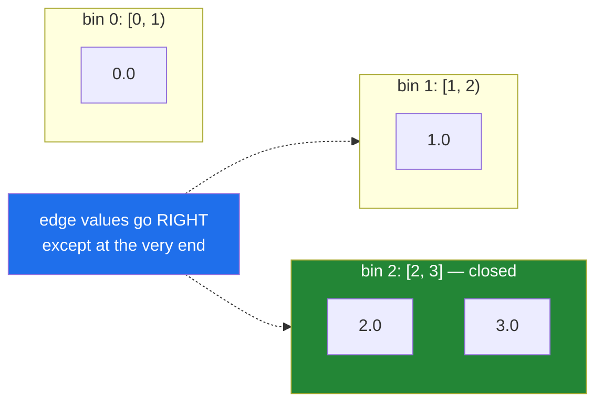

# 4.4 — `np.histogram` — the bins, and which side an edge belongs to

## One-line answer

`np.histogram(values, bins)` counts how many values fall into each of a set of ranges and returns the
counts **and** the edges — where every bin is half-open, `[low, high)`, except the last one, which is
closed at both ends.

---

## The story

Somebody wants to see the shape of their month at a glance. Not twenty-eight numbers and not one average
— something in between.

So they draw four ranges on a page: five to seven and a half thousand, seven and a half to ten, ten to
twelve and a half, and twelve and a half to fifteen. Then they go through the month putting each day into
the range it belongs to and count what ends up in each.

Four numbers, and the shape of the month is immediately visible: a big middle and thin ends.

Then they get to a day of exactly ten thousand steps and stop. It sits on the line between two ranges.

Whichever way they decide is fine. What is not fine is deciding one way this month and the other way next
month, because then the two pictures cannot be compared, and the difference will look like a change in
how much somebody walked.

---

## The idea in plain language

A **histogram** counts how many values fall into each of a series of adjacent ranges. The ranges are
called **bins**, and the numbers that separate them are called **edges**. Four bins need five edges,
because each bin needs a start and an end and neighbouring bins share one.

That "n bins, n+1 edges" relationship is the source of nearly every off-by-one in this area, and it is why
`np.histogram` returns **two** arrays: the counts, which are `n` long, and the edges, which are `n+1`
long. Any code that stores the counts and throws away the edges has kept a picture and lost its axis.

The `bins` argument accepts two quite different things.

**A number** — `bins=4` — means "make four equal-width bins covering the data". NumPy looks at the
smallest and largest values and divides that span evenly. This is the convenient form and the dangerous
one, because the edges then **depend on the data**: run it on this month and on next month and you get two
histograms whose bars are not comparable, because the bars mean different ranges.

**A sequence of edges** — `bins=[5000, 7500, 10000, 12500, 15000]` — states the ranges explicitly. The
edges no longer depend on the data, so two periods can be compared, and any value outside the outermost
edges is **silently dropped**. That last part is important enough to check for: the counts do not have to
add up to the number of values you passed in.

Now the boundary rule, which is the thing worth actually memorising. Every bin is **half-open**: a value
equal to a bin's lower edge falls in that bin, and a value equal to its upper edge falls in the **next**
one. Written as an interval that is `[low, high)`. The exception is the **last** bin, which is closed at
both ends, `[low, high]`, because otherwise the largest value in the dataset would fall outside every bin
and vanish.

So the day of exactly ten thousand steps goes into the bin that *starts* at ten thousand. And a day of
exactly fifteen thousand, with the edges above, goes into the last bin rather than disappearing.

Two related functions are worth knowing exist. `np.histogram_bin_edges` computes the edges without doing
the counting, which is how you decide the edges once on the training data and reuse them. And
`np.histogram2d` does the same thing for pairs of values, which is what a heat map is.

---

## Why Setu needs it

- **Day 25's gate module** reports the distribution of the month, not only its mean and median, because
  two months with the same average can be completely different shapes.
- **Day 36's visualisation phase** draws histograms constantly, and every plotting library is calling
  this function or its own copy of it. Knowing that the bar heights are counts and the edges are a
  separate array is what makes a mis-drawn chart debuggable.
- **Day 76's binning** turns a continuous feature into a categorical one, and the edges must be learned on
  the training split alone or the transformation leaks
  ([Day 22, 5.1](../../../day-22-broadcasting-and-shape/parts/05-the-module/5.1-mean-centring-the-month.md)).
- **Day 84's exploratory work** is largely looking at distributions, and the number of bins chosen changes
  what you believe about the data more than almost any other decision.
- **Day 155's benchmarking** compares latency distributions between four vector stores, and comparing them
  requires that all four use the same fixed edges.

---

## The mechanism

The month, binned both ways:

```python
import numpy as np

month = np.array(
    [
        [8213, 10442, 6180, 9000, 12007, 9631, 7204],
        [7788, 9120, 11345, 8402, 6733, 14210, 5096],
        [9004, 8765, 7621, 10188, 9950, 8317, 11002],
        [6540, 12488, 9873, 7106, 8899, 10540, 9218],
    ]
)
flat = month.ravel()

auto_counts, auto_edges = np.histogram(flat, bins=4)
fixed_counts, fixed_edges = np.histogram(flat, bins=[5000, 7500, 10000, 12500, 15000])

print("auto counts :", auto_counts)
print("auto edges  :", auto_edges)
print("fixed counts:", fixed_counts)
print("fixed edges :", fixed_edges)
print("total binned:", fixed_counts.sum(), "of", flat.size)
```

**Line by line:**

- `flat = month.ravel()` — a histogram is about the values, not the grid, so the shape is flattened first.
  `np.histogram` would flatten it anyway; doing it here means `flat.size` on the last line is obviously the
  right denominator.
- `np.histogram(flat, bins=4)` — the convenient form. **Note that the edges came back at 7374.5 and
  9653**, numbers with nothing to do with steps, because they are the data's own range divided into four.
  Run this on a different month and the edges move.
- `bins=[5000, 7500, 10000, 12500, 15000]` — five edges, four bins, chosen by a person. These are round
  numbers a reader can hold in their head, and they will be the same next month.
- Unpacking into two names on each line — **the counts and the edges are one answer in two arrays**, and
  keeping only the first is how a chart ends up with an axis that does not match its bars.
- `fixed_counts.sum()` against `flat.size` — the check that nothing fell outside the outermost edges. Here
  it is 28 of 28. **Write this check whenever the edges are fixed**, because a value below 5 000 or above
  15 000 would be dropped in silence.

```text
auto counts : [ 6 12  7  3]
auto edges  : [ 5096.   7374.5  9653.  11931.5 14210. ]
fixed counts: [ 6 14  7  1]
fixed edges : [ 5000  7500 10000 12500 15000]
total binned: 28 of 28
```

The two histograms disagree — `[6 12 7 3]` against `[6 14 7 1]` — for the same twenty-eight days. Neither
is wrong. They are pictures of the same data through different windows, and that is precisely why the
edges must travel with the counts.

Now the boundary rule, on four values where it is impossible to miss:

```python
import numpy as np

values = np.array([0.0, 1.0, 2.0, 3.0])
counts, edges = np.histogram(values, bins=[0, 1, 2, 3])

print("values :", values)
print("edges  :", edges)
print("counts :", counts)
print("bins   :", [f"[{edges[i]}, {edges[i + 1]})" for i in range(len(counts))])
```

**Line by line:**

- Four values and four edges, so **three** bins. The mismatch between "four numbers in, three counts out"
  is the n-versus-n+1 rule showing itself in the smallest possible example.
- `bins=[0, 1, 2, 3]` — the ranges are `[0, 1)`, `[1, 2)` and `[2, 3]`, with only the last one closed at
  its top.
- `counts` — `[1 1 2]`. The value `0.0` went into the first bin, `1.0` went into the **second** bin rather
  than the first, `2.0` went into the third, and **`3.0` also went into the third** because the last bin
  includes its upper edge. Four values, three bins, and the last bin holds two of them.
- The f-string list writing the intervals out — the notation is `[` for included and `)` for excluded, and
  seeing it printed next to the counts is what makes the rule stick
  ([Day 7, 3.1](../../../day-07-strings/parts/03-formatting/3.1-what-an-f-string-compiles-to.md)). Note
  that it prints the last bin as `[2.0, 3.0)`, which is a small lie — the code has no way to express the
  exception, and that is the point.

```text
values : [0. 1. 2. 3.]
edges  : [0 1 2 3]
counts : [1 1 2]
bins   : ['[0, 1)', '[1, 2)', '[2, 3)']
```

Where each value lands:



---

## When it breaks

**Values falling outside the edges:**

```text
$ uv run python -c "
import numpy as np
values = np.array([100, 5000, 9000, 20000])
counts, edges = np.histogram(values, bins=[5000, 10000, 15000])
print('values  :', values)
print('counts  :', counts)
print('total   :', counts.sum(), 'of', values.size)
print('missing :', values.size - counts.sum())
"
values  : [  100  5000  9000 20000]
counts  : [2 0]
total   : 2 of 4
missing : 2
```

**What it means.** Two of the four values are outside the outermost edges, and they were **dropped without
a word**. The counts still look like a perfectly good histogram. In a real dataset the values outside the
range are usually the interesting ones — the outliers, the sensor faults, the fraud — and a chart drawn
from this would show a tidy distribution with the anomalies removed. **The one-line defence is
`assert counts.sum() == values.size`**, or, better, reporting the two numbers side by side so a drop is
visible rather than fatal.

**The edges thrown away:**

```text
$ uv run python -c "
import numpy as np
jan = np.array([5100, 5200, 9000, 9100])
feb = np.array([5100, 5200, 14000, 14100])
print('jan counts:', np.histogram(jan, bins=2)[0])
print('feb counts:', np.histogram(feb, bins=2)[0])
print('jan edges :', np.histogram(jan, bins=2)[1])
print('feb edges :', np.histogram(feb, bins=2)[1])
"
jan counts: [2 2]
feb counts: [2 2]
jan edges : [5100. 7100. 9100.]
feb edges : [ 5100.  9600. 14100.]
```

**What it means.** Two months, identical counts, and the months are not remotely alike — February's second
bar covers a range more than twice as wide as January's. Anyone comparing `[2 2]` with `[2 2]` would
conclude the two months were the same. **`bins=<a number>` makes the edges a function of the data**, so
the counts from two such calls are not comparable to each other at all. Any histogram that will be
compared against another one must use explicit edges, computed once and reused.

**Bins that are not increasing:**

```text
$ uv run python -c "
import numpy as np
np.histogram(np.array([1, 2, 3]), bins=[0, 5, 2, 10])
"
Traceback (most recent call last):
  File "<string>", line 3, in <module>
  File "...\numpy\lib\_histograms_impl.py", line 430, in _get_bin_edges
    raise ValueError(
ValueError: `bins` must increase monotonically, when an array
```

**What it means. This one raises**, which is a mercy, and it is the exception rather than the rule in this
document — every other failure here is silent. The cause is almost always edges assembled from a
configuration file or from concatenated pieces
([Day 22, 4.1](../../../day-22-broadcasting-and-shape/parts/04-joining-and-splitting/4.1-concatenate.md)),
and it is the same class of bug as the unsorted array handed to `searchsorted`
([3.5](../03-sorting-and-searching/3.5-searchsorted.md)) — except that `histogram` checks and
`searchsorted` does not.

---

## In production

**What a professional writes instead of the teaching version.** The edges are fixed, stored, and returned
alongside the counts, and nothing is allowed to fall out silently:

```python
from __future__ import annotations

from dataclasses import dataclass

import numpy as np


@dataclass(frozen=True, slots=True)
class Distribution:
    """Counts, the edges they refer to, and what fell outside them."""

    counts: np.ndarray
    edges: np.ndarray
    below: int
    above: int

    def __post_init__(self) -> None:
        if self.edges.size != self.counts.size + 1:
            raise ValueError(
                f"{self.counts.size} bins need {self.counts.size + 1} edges, got {self.edges.size}"
            )

    @property
    def dropped(self) -> int:
        """Values that fell outside the outermost edges and are in no bin."""
        return self.below + self.above


def distribution(values: np.ndarray, edges: np.ndarray) -> Distribution:
    """Bin ``values`` against fixed ``edges``, counting what fell outside.

    Bins are half-open, [low, high), except the last, which includes its upper edge.
    ``edges`` must be supplied by the caller and reused across periods; deriving them
    from the data makes two results incomparable.
    """
    finite = values[~np.isnan(values)]
    counts, used = np.histogram(finite, bins=edges)
    return Distribution(
        counts=counts,
        edges=used,
        below=int(np.count_nonzero(finite < edges[0])),
        above=int(np.count_nonzero(finite > edges[-1])),
    )
```

**Line by line:**

- `edges` stored on the result — **the decision this whole document argues for**. A `Distribution` can be
  compared against another one only if the edges match, and carrying them makes that checkable instead of
  assumed.
- `below` and `above` as separate fields rather than one `dropped` count — which side values fell off tells
  you what went wrong. A rising `above` is a sensor reading too high or a new class of large customer; a
  rising `below` is usually zeros arriving where data should be.
- `__post_init__` asserting `edges.size == counts.size + 1` — the n-versus-n+1 rule, checked once, with a
  message that does the arithmetic for the reader.
- `edges: np.ndarray` as a **required** parameter with no default — there is deliberately no way to call
  this function and get data-derived edges. The comparability problem in the second failure block cannot be
  reached from here.
- `values[~np.isnan(values)]` — `np.histogram` on data containing `nan` produces counts that do not sum to
  the input size, with no indication that missing data rather than out-of-range data was the cause
  ([2.5](../02-statistics/2.5-the-nan-family.md)). Removing them first means `below` and `above` account
  for the whole difference.
- `finite > edges[-1]` using strict `>` while `finite < edges[0]` uses strict `<` — this matches
  `histogram`'s own boundary rule, where the last bin is closed. A value exactly equal to the final edge is
  **inside** the last bin, so it must not be counted as above.
- `int(...)` on both counts — Python integers on the way out
  ([4.1](4.1-count-nonzero-and-the-mask.md)).

**What changes at scale.** `np.histogram` with explicit edges is `n log(bins)` — a binary search per value
([3.5](../03-sorting-and-searching/3.5-searchsorted.md)) — and with equal-width bins NumPy takes a faster
path that computes the bin arithmetically instead, which is `n`. That difference is worth knowing when
choosing edges: evenly spaced edges are meaningfully cheaper than arbitrary ones on large arrays. The
larger effect is what happens when the data does not fit at all. An exact histogram needs one pass, which
is fine; but the moment the question becomes "the distribution over the last thirty days across every
shard", exact binning is replaced by mergeable sketches, because two histograms with the same edges can be
added together element by element while two with different edges cannot. **That is the real reason
production systems fix their edges**: comparability is nice, and addability is what makes distributed
aggregation possible at all. The last scale note is the bin count itself: too few bins hides structure,
too many turns a distribution into noise, and rules of thumb such as Freedman–Diaconis exist precisely
because the choice changes what people conclude — `np.histogram_bin_edges` implements several of them.

**The failure that only appears with real data.** A latency dashboard used `bins=50` on each hour's data
independently. Every hour's chart looked reasonable. Comparing two hours was meaningless, because each had
its own edges derived from its own minimum and maximum, so a quiet hour and a busy hour produced
similar-looking bars covering wildly different millisecond ranges. The problem was discovered when a
genuine tenfold latency regression produced a chart that looked completely normal — the edges had simply
stretched with the data.

**The review comment a senior engineer leaves.** *"`np.histogram(x, bins=30)` derives the edges from this
batch, so today's chart and yesterday's are not comparable and the two cannot be summed for a weekly view.
Pin the edges in the config, return them with the counts, and count what falls outside — right now
out-of-range values are silently dropped, which is exactly where our anomalies live."*

**The interview question.** *"What does `np.histogram` return, and what is the trap?"* Two arrays — the
counts, and the bin edges, which is one longer because n bins need n+1 edges. The first trap is the
boundary rule: bins are half-open, `[low, high)`, so a value on an edge goes into the higher bin, except
in the last bin, which is closed at both ends so the maximum value is not lost. The second, and the one
that actually causes damage, is `bins=<a number>`: it derives the edges from the data's own range, so two
histograms computed that way have different axes and are not comparable and not summable, which is why
production systems fix their edges in configuration. The third is that values outside the outermost edges
are dropped silently, so the counts need not sum to the input size — and out-of-range values are usually
the interesting ones. The detail that shows experience is that equal-width bins take a faster arithmetic
path than arbitrary edges, and that fixed edges are what make histograms mergeable across shards.

---

## Check yourself

```bash
uv run python -c "
import numpy as np
values = np.array([0.0, 1.0, 2.0, 3.0])
counts, edges = np.histogram(values, bins=[0, 1, 2, 3])
print('counts    :', counts, '<- 4 values, 3 bins')
print('edges     :', edges, '<- one longer than counts')
outside = np.array([100, 5000, 9000, 20000])
c2, _ = np.histogram(outside, bins=[5000, 10000, 15000])
print('counts    :', c2, 'total', c2.sum(), 'of', outside.size)
a = np.histogram(np.array([1, 2, 9, 10]), bins=2)[1]
b = np.histogram(np.array([1, 2, 90, 100]), bins=2)[1]
print('edges a   :', a)
print('edges b   :', b)
print('comparable:', np.array_equal(a, b))
"
```

The first block puts two of four values in the last bin. The second loses two of four entirely. Say which
of those two behaviours you would defend in a design review and which you would guard against.

**Answer out loud, without scrolling up:**

> A value sits exactly on a bin edge. Say which bin it goes into, name the one place where that rule is
> reversed, and say why. Then say what `bins=20` does to two charts you intended to compare.

---

**Next:** [4.5 — `np.isin` and membership at scale](4.5-isin-and-membership.md).
