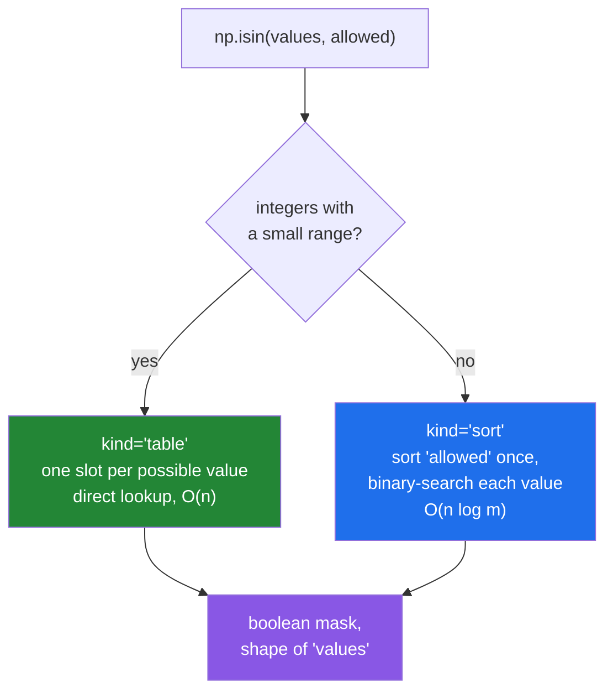

# 4.5 — `np.isin` — asking "is it one of these", for a million values at once

## One-line answer

`np.isin(values, allowed)` returns a mask saying, for every element of `values`, whether it appears
anywhere in `allowed` — one call, no loop, and about seven times faster than the obvious Python version.

---

## The story

Somebody has a month of step counts and a short list of days they were ill.

They want to mark those days so the ill days can be left out of the average. Not "days above a number" and
not "days in a range" — a specific handful, listed out.

The obvious way is to go through the month one day at a time and, for each one, check whether it is on the
list. Twenty-eight days against a list of four: a hundred and twelve comparisons, done by hand, and
perfectly manageable.

Now the same job with ten years of readings and a list of two hundred ill days. Three and a half thousand
times two hundred is seven hundred thousand comparisons, and doing it that way is absurd — not because
computers cannot, but because there is a much better way that anybody who has used a filing cabinet
already knows. Put the two hundred ill dates in order once. Then each of the three and a half thousand
lookups is a flick through a sorted list rather than a walk along all two hundred.

The saving comes from preparing the small list, once, rather than from being faster at the big one.

---

## The idea in plain language

`np.isin(values, allowed)` answers the membership question for a whole array. It returns a **boolean
mask** the same shape as `values`
([4.1](4.1-count-nonzero-and-the-mask.md)), with `True` wherever that element appears somewhere in
`allowed`.

The mask is the useful part, and it is the reason this is one function rather than three. Once you have
it you can count it, select with it, or invert it — which are the three things anybody wants:

- `np.count_nonzero(mask)` — how many matched.
- `values[mask]` — the ones that did ([Day 21, 3.2](../../../day-21-indexing-and-views/parts/03-boolean-masks/3.2-indexing-with-a-mask.md)).
- `values[~mask]` — the ones that did not, which for an exclusion list is the answer you actually wanted.

Underneath, NumPy chooses between two strategies, and knowing which is which explains its performance.
The default, `kind="sort"`, sorts the `allowed` values once and then binary-searches each element of
`values` against them — the filing-cabinet method from the story, and exactly
[3.5](../03-sorting-and-searching/3.5-searchsorted.md) applied in bulk. The alternative, `kind="table"`,
allocates one slot per possible value and looks each element up directly, which is
[4.3](4.3-bincount.md)'s idea and is only available for integers with a small range. NumPy picks between
them automatically, and the `kind=` argument is there for when you need to force one — usually to stop
the table version allocating something enormous.

Two details that catch people.

`np.isin` **flattens `allowed`** but preserves the shape of `values`. So a `(4, 7)` month tested against a
list of four comes back as a `(4, 7)` mask, which is what you want, and passing a two-dimensional
`allowed` does not mean anything special.

The older name `np.in1d` did the same job but always returned a flat result. It is deprecated in favour of
`np.isin`, and seeing it in code is a reliable sign of age.

Finally, `invert=True` gives the negation directly. `np.isin(values, blocked, invert=True)` reads better
than `~np.isin(values, blocked)` when the list is an exclusion list, and it avoids allocating a second
mask.

---

## Why Setu needs it

- **Day 25's gate module** excludes days flagged as unreliable, which is a mask built from a list of
  positions rather than from a comparison.
- **Day 76's feature work** filters rows to a set of allowed categories constantly, and doing it in a
  Python loop over a dataframe is one of the classic reasons a pipeline is slow.
- **Day 91 onwards**, splitting data by a list of identifiers — these users are training, those are test —
  is `np.isin` on the identifier column, and getting it wrong is a leak
  ([Day 22, 5.1](../../../day-22-broadcasting-and-shape/parts/05-the-module/5.1-mean-centring-the-month.md)).
- **Day 117's NLP phase** removes stop words, which is membership against a fixed list applied to every
  token.
- **Day 162's RAG pipeline** filters retrieved chunks against a set of permitted document identifiers,
  which is the security-relevant version of this operation and must not be a loop that can be interrupted
  halfway.

---

## The mechanism

The month, with a handful of days marked:

```python
import numpy as np

month = np.array(
    [
        [8213, 10442, 6180, 9000, 12007, 9631, 7204],
        [7788, 9120, 11345, 8402, 6733, 14210, 5096],
        [9004, 8765, 7621, 10188, 9950, 8317, 11002],
        [6540, 12488, 9873, 7106, 8899, 10540, 9218],
    ]
)
unreliable = np.array([6180, 14210, 5096, 7106])

flagged = np.isin(month, unreliable)

print("flagged shape :", flagged.shape)
print("week one      :", flagged[0])
print("how many      :", np.count_nonzero(flagged))
print("the values    :", month[flagged])
print("the good days :", month[~flagged].size, "of", month.size)
print("mean all      :", round(float(month.mean()), 1))
print("mean good     :", round(float(month[~flagged].mean()), 1))
print("invert= form  :", np.array_equal(np.isin(month, unreliable, invert=True), ~flagged))
```

**Line by line:**

- `unreliable` as a flat array of four values — the "allowed" argument is a set of things to match, and its
  own shape is irrelevant because `isin` flattens it.
- `np.isin(month, unreliable)` — **the shape of the answer follows `month`, not `unreliable`**. A `(4, 7)`
  mask comes back, so it lines up with the month element for element and can be used to index it.
- `flagged[0]` — one week's worth of the mask, printed so the alignment is visible. Wednesday of week one
  is the 6 180 that is on the list, and the mask has `True` in the third position.
- `np.count_nonzero(flagged)` — four, matching the length of `unreliable` because all four values happened
  to be present exactly once. **That is a coincidence of this data**, not a guarantee: a value on the list
  that appears twice contributes two `True`s, and one that appears not at all contributes none.
- `month[flagged]` — the matched values themselves, as a flat array. Boolean indexing always flattens and
  always copies
  ([Day 21, 3.2](../../../day-21-indexing-and-views/parts/03-boolean-masks/3.2-indexing-with-a-mask.md)).
- `month[~flagged]` — the complement, which is the one the average actually needs. `~` is elementwise
  `not` ([Day 21, 3.3](../../../day-21-indexing-and-views/parts/03-boolean-masks/3.3-and-or-not-and-why-and-raises.md)).
- The two means printed together — 9 102.9 against 9 262.1. **Excluding four unreliable days moved the
  monthly average by about a hundred and sixty steps**, which is the sort of change that has to be a
  stated decision rather than an accident. Note it moved *up*: three of the four excluded days were
  unusually low, so the filter is not neutral, and a filter that shifts the headline number in a
  convenient direction is exactly the one a reviewer will ask about.
- `invert=True` compared against `~flagged` — identical, and the keyword form does it without building the
  first mask and then a second.

```text
flagged shape : (4, 7)
week one      : [False False  True False False False False]
how many      : 4
the values    : [ 6180 14210  5096  7106]
the good days : 24 of 28
mean all      : 9102.9
mean good     : 9262.1
invert= form  : True
```

Now the reason to use it rather than the obvious loop, measured on two million values:

```python
import timeit

import numpy as np

rng = np.random.default_rng(20260902)
haystack = rng.integers(0, 10_000_000, size=2_000_000)
needles = rng.integers(0, 10_000_000, size=50_000)
needle_set = set(needles.tolist())

t_isin = min(timeit.repeat(lambda: np.isin(haystack, needles), number=1, repeat=3))
t_loop = min(
    timeit.repeat(
        lambda: np.array([v in needle_set for v in haystack.tolist()]), number=1, repeat=3
    )
)

print(f"np.isin            : {t_isin * 1000:.0f} ms")
print(f"python set-in loop : {t_loop * 1000:.0f} ms")
print(f"ratio              : {t_loop / t_isin:.1f}x")
print(
    "same answer        :",
    np.array_equal(
        np.isin(haystack, needles), np.array([v in needle_set for v in haystack.tolist()])
    ),
)
```

**Line by line:**

- `rng.integers(0, 10_000_000, ...)` — a wide range on purpose, so that NumPy cannot use the table strategy
  and the measurement is of the sort-and-search path, which is the one that always applies.
- `needle_set = set(needles.tolist())` built **outside** the timed lambda — this is the honest comparison.
  Building the set inside would be timing the set construction as well, and the point is to show that even
  a Python set, which is the fastest membership structure Python has, still loses.
- `[v in needle_set for v in haystack.tolist()]` — a comprehension with an `O(1)` hash lookup per element
  ([Day 8, 2.1](../../../day-08-containers/parts/02-sets-and-dicts/2.1-a-set-is-a-hash-table.md)). This is
  the best a competent Python programmer would write without NumPy, and it is what the ratio is measured
  against.
- `.tolist()` on the haystack — converting to Python objects first, which is itself a large part of the
  loop's cost and is exactly the cost that using NumPy avoids
  ([Day 20, 1.4](../../../day-20-arrays-and-dtypes/parts/01-the-block/1.4-a-million-floats-measured.md)).
- `min(timeit.repeat(...))` with `number=1` — one execution per measurement because each one is already
  slow, and the minimum of three because other work on the machine can only make a run slower.
- The `np.array_equal` check on the last line — **a benchmark of a wrong answer is worthless**, so the two
  approaches are confirmed to agree before their times are believed.

```text
np.isin            : 31 ms
python set-in loop : 216 ms
ratio              : 6.9x
same answer        : True
```

Seven times, against Python's fastest membership structure — and the gap is not the lookup, which a hash
set does very well. It is the two million Python objects the comprehension has to create and iterate.

The two strategies:



---

## When it breaks

**A set passed where an array was expected:**

```text
$ uv run python -c "
import numpy as np
month = np.array([8213, 10442, 6180, 9000])
print('with a list:', np.isin(month, [6180, 9000]))
print('with a set :', np.isin(month, {6180, 9000}))
"
with a list: [False False  True  True]
with a set : [False False False False]
```

**What it means.** No error, and every answer is `False`. NumPy turned the Python `set` into a
zero-dimensional **object** array containing one element — the set itself — and then correctly reported
that no step count is equal to a set. The mask is the right shape and entirely wrong. This is one of the
quietest bugs in NumPy, and it appears the moment somebody "tidies up" a list into a set for the usual
reason that sets are faster to look up in. **`allowed` must be a sequence NumPy can turn into an array**:
a list, a tuple or an array. Convert with `list(the_set)` or `np.fromiter(the_set, dtype=...)`.

**Dtypes that do not compare:**

```text
$ uv run python -c "
import numpy as np
ids = np.array(['a1', 'b2', 'c3'])
wanted = np.array([1, 2])
print('mixed dtype:', np.isin(ids, wanted))
nums = np.array([1, 2, 3])
print('num vs text:', np.isin(nums, np.array(['1', '2'])))
"
mixed dtype: [False False False]
num vs text: [False False False]
```

**What it means.** Comparing text against numbers finds nothing, in both directions, with no complaint.
The second line is the one that happens in practice: an identifier column read from a CSV is text, the
allow-list came from a database as integers, and the filter silently matches nothing — so the pipeline
processes zero rows and reports success. **A membership filter that matches nothing deserves a check**,
because "no rows matched" and "the dtypes did not line up" look identical downstream.

**Floats compared exactly:**

```text
$ uv run python -c "
import numpy as np
computed = np.array([0.1 + 0.2, 0.5])
wanted = np.array([0.3, 0.5])
print('isin     :', np.isin(computed, wanted))
print('difference:', computed[0] - wanted[0])
print('isclose  :', np.isclose(computed[:, None], wanted).any(axis=1))
"
isin     : [False  True]
difference: 5.551115123125783e-17
isclose  : [ True  True]
```

**What it means.** `np.isin` uses exact equality, and `0.1 + 0.2` is not exactly `0.3`
([Day 20, 2.3](../../../day-20-arrays-and-dtypes/parts/02-dtypes/2.3-floats-nan-and-precision.md)). The
difference is `5.55e-17` and the answer is `False`. **Membership on computed floats is almost always the
wrong tool**; the workaround shown on the last line broadcasts every value against every target
([Day 22, 1.7](../../../day-22-broadcasting-and-shape/parts/01-broadcasting/1.7-the-broadcast-that-ate-the-memory.md))
and is `n × m` in memory, so it is only safe when the target list is genuinely short. For anything larger,
round both sides to a stated precision first and compare the rounded values, which makes the tolerance a
documented decision instead of an accident.

---

## In production

**What a professional writes instead of the teaching version.** The dtype agreement is checked, and a
filter that matches nothing is treated as suspicious rather than as an answer:

```python
from __future__ import annotations

from dataclasses import dataclass

import numpy as np


@dataclass(frozen=True, slots=True)
class Filtered:
    """What survived a membership filter, and what it cost."""

    kept: np.ndarray
    removed: int
    unmatched_rules: int


def exclude(values: np.ndarray, blocked: np.ndarray) -> Filtered:
    """Everything in ``values`` that is not in ``blocked``.

    Reports how many entries of ``blocked`` matched nothing, because a rule that never
    fires is usually a dtype mismatch or a stale configuration rather than good news.
    """
    if values.dtype.kind != blocked.dtype.kind:
        raise TypeError(
            f"cannot match dtype {values.dtype} against {blocked.dtype}; "
            "convert both at the boundary"
        )
    hit = np.isin(values, blocked)
    used = np.isin(blocked, values)
    return Filtered(
        kept=values[~hit],
        removed=int(np.count_nonzero(hit)),
        unmatched_rules=int(np.count_nonzero(~used)),
    )
```

**Line by line:**

- `values.dtype.kind != blocked.dtype.kind` — comparing the **kind** rather than the exact dtype, so
  `int32` against `int64` is allowed and text against numbers is not
  ([Day 20, 2.1](../../../day-20-arrays-and-dtypes/parts/02-dtypes/2.1-a-dtype-is-a-promise.md)). This is
  the check that turns the second failure block into an exception at the right place.
- The message saying "convert both at the boundary" — the fix is never here; it is wherever the two arrays
  were built. A good error message points at the fix, not at itself.
- `used = np.isin(blocked, values)` — **the same function with its arguments swapped**, asking the reverse
  question: which rules matched anything? This is the idea worth stealing from this document. A blocklist
  entry that matches nothing is either a typo, a dtype problem, or a rule for data that no longer exists,
  and every one of those is worth knowing about.
- `unmatched_rules` on the result rather than a warning — the caller decides whether it is an error. In a
  security filter it should be; in a general cleanup it is a metric.
- `values[~hit]` rather than `np.isin(..., invert=True)` — both are correct, and the explicit `hit` mask is
  reused for the count, so building it once and inverting it is the cheaper of the two here. `invert=True`
  wins when the mask is used only once.
- `Filtered` carrying `removed` — the same reasoning as
  [4.1](4.1-count-nonzero-and-the-mask.md)'s `Tally`: a filter that reports only what it kept cannot be
  monitored, and "we removed 3 rows" and "we removed 300 000 rows" need to look different in a log.

**What changes at scale.** The two strategies scale differently and the choice is not always made well for
you. `kind="sort"` is `O((n + m) log m)` and allocates only the mask; `kind="table"` is `O(n + r)` where
`r` is the **range** of the values, and it allocates a lookup array of that range — which is
[4.3](4.3-bincount.md)'s trap in a different function. NumPy will not choose the table when the range is
huge, but forcing it with `kind="table"` on identifiers will try to allocate gigabytes. Two other things
matter at size. The mask itself is one byte per element
([4.1](4.1-count-nonzero-and-the-mask.md)), so filtering a billion-row column costs a gigabyte of
temporary before anything is selected, and `values[~mask]` then allocates the result as well. And when
`allowed` is genuinely large and reused across many calls — a blocklist checked on every request — sorting
it on every call is waste; sort it once, keep it, and call `np.searchsorted` directly
([3.5](../03-sorting-and-searching/3.5-searchsorted.md)), which is what `isin` would have done anyway
minus the repeated preparation.

**The failure that only appears with real data.** A nightly job split users into cohorts using
`np.isin(user_id, cohort_ids)`. The identifiers came from a CSV as text on one side and from the warehouse
as integers on the other. Nothing matched. The job reported "0 users in cohort A" every night and
completed successfully, and because the cohort was new nobody found the zero suspicious for three weeks.
The reverse check — how many cohort identifiers matched a user — would have said "0 of 40 000 rules
matched" on the first run.

**The review comment a senior engineer leaves.** *"`np.isin(ids, allowed)` where `allowed` is a Python set
gives an all-`False` mask with no error — please pass a list or array. And add the reverse check: if none
of the allow-list entries match anything, that is a dtype bug, not an empty result, and right now it looks
like a successful run."*

**The interview question.** *"How do you filter an array to a set of allowed values?"* `np.isin(values,
allowed)` gives a boolean mask the shape of `values`, and you index with it or its inverse. It is around
seven times faster than a Python comprehension against a `set`, and the reason is not the lookup — a hash
set is excellent at that — but the cost of materialising a million Python objects. The details that show
experience: passing an actual Python `set` as the second argument silently produces an all-`False` mask,
because NumPy wraps it as a single object; the comparison is exact, so it is the wrong tool for computed
floats; and a mismatch of dtype between the two sides matches nothing without any error, which in a
pipeline looks exactly like a legitimately empty result. The habit worth mentioning is running the
membership check in **both directions** — which values matched, and which rules matched anything — because
a rule that never fires is nearly always a bug.

---

## Check yourself

```bash
uv run python -c "
import numpy as np
month = np.array([8213, 10442, 6180, 9000, 12007])
unreliable = np.array([6180, 12007])
mask = np.isin(month, unreliable)
print('mask       :', mask)
print('kept       :', month[~mask])
print('invert=    :', np.isin(month, unreliable, invert=True))
print('as a set   :', np.isin(month, {6180, 12007}))
print('rules used :', np.isin(unreliable, month))
print('text vs num:', np.isin(month, np.array(['6180'])))
"
```

Two of those lines return all `False` and neither raises. Say what is different about each of them, and
which one you would be more likely to ship without noticing.

**Answer out loud, without scrolling up:**

> You filter a million-row identifier column against an allow-list and get zero rows. Name the two most
> likely causes, say which single extra line would have distinguished them, and say why the job still
> reported success.

---

**Next:** [5.1 — `src/setu/summary.py`, the module](../05-the-module/5.1-the-summary-module.md).
