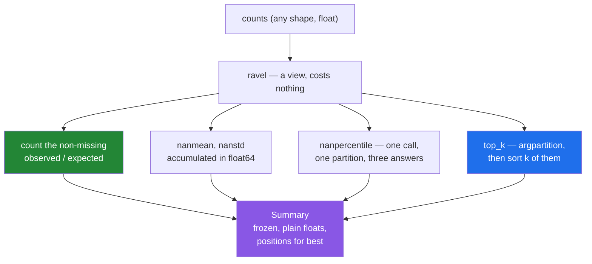

# 5.1 — `src/setu/summary.py` — the two IDs meeting in one module

## One-line answer

Everything on this day collapses into one module: a summary that reports what it was computed from, and a
top-k that never sorts — and the design work is almost entirely in what the function signatures refuse to
decide on the caller's behalf.

---

## The story

Somebody has been keeping their step counts for a month and wants a page that tells them how it went.

They know roughly what should be on it. An average. A middle value, because one big charity walk should
not be allowed to define a normal day. Some sense of how up-and-down it was. The best three days, named,
because "your best day was Saturday of week two" is worth more than a number.

What they do **not** want is a page that quietly lies. The Thursday of week one has no reading at all —
flat battery — and a page that reports an average over twenty-eight days when it only had twenty-seven is
wrong in a way nobody would ever notice.

So the page has to say two things at once: here is the summary, and here is what it was computed from.
Every design decision in this module comes out of that one sentence.

---

## The idea in plain language

The day taught eleven or twelve separate functions. A module is where you decide which of them belong
together and what the caller has to say out loud.

Three principles are doing the work here, and each one is a decision that could have gone the other way.

**A statistic travels with its evidence.** Every number the module returns is accompanied by `observed`
and `expected`: how many days were actually recorded, and how many there should have been. A bare mean
cannot be audited; a mean plus "27 of 28" can
([2.5](../02-statistics/2.5-the-nan-family.md)).

**The caller states what they cannot be guessed for.** `ddof` has no defensible default
([2.3](../02-statistics/2.3-std-var-and-ddof.md)), so the module asks — as `sample: bool`, phrased as the
question rather than as the arithmetic. This is the opposite of a convenience, and it is deliberate: a
module that silently picks one divisor is a module whose numbers disagree with somebody's notebook and
nobody knows why.

**The expensive operation is not performed.** The best three days are found with `argpartition`, which
does not sort ([3.3](../03-sorting-and-searching/3.3-top-k-and-argpartition.md)). On twenty-eight days
that is a pointless optimisation and it is written anyway, because the same function is what Day 155's
retriever will call on two million similarity scores, and a module that has to be rewritten at that point
was the wrong shape from the start.

Two smaller decisions matter enough to name.

Everything **flattens first**. The month arrives as a `(4, 7)` grid, and a summary is a statement about
values rather than about a grid, so the module ravels and works on a run. That keeps every function
usable on a flat file, a week, a month or ten years, and it makes the returned positions mean one thing
— an index into the flat run — rather than depending on the input's shape
([3.4](../03-sorting-and-searching/3.4-sorting-along-an-axis.md)).

And positions are returned rather than values or labels. The module does not know that day 12 is Saturday
of week two; the caller does. Returning positions is what lets the same function serve a step diary and a
document retriever ([3.2](../03-sorting-and-searching/3.2-argsort-the-positions.md)).

---

## Why Setu needs it

- **[5.2](5.2-the-test-that-can-go-red.md)** is this module's eval, and every assertion in it is aimed at
  one of the decisions above.
- **Day 25's gate** — a vectorised stats module beating a loop by fifty times — is built on this one. The
  gate day adds the benchmark and the copy-versus-view contract; the statistics are here.
- **Day 155's retriever** calls `top_k` unchanged, on similarity scores instead of step counts. That is
  the test of whether the signature was designed or improvised.
- **Day 84's exploratory work** wants exactly this five-number picture of any column, which is why
  `Summary` carries the quartiles as well as the mean.
- **Day 26 onwards**, pandas provides `describe()`, which is this object with more fields. Having built
  one is what makes the library's version readable rather than magic.

---

## The mechanism

The module in three pieces. First the shape of the answer:

```python
"""Summarise a run of daily counts, and find the best days without sorting them all."""

from __future__ import annotations

from dataclasses import dataclass

import numpy as np

ACCUMULATE_IN = np.float64
MIN_DAYS_FOR_SPREAD = 4


@dataclass(frozen=True, slots=True)
class Summary:
    """Every number this module reports, with the evidence behind it."""

    observed: int
    expected: int
    mean: float
    median: float
    std: float
    p25: float
    p75: float
    best: np.ndarray

    @property
    def complete(self) -> bool:
        """True when nothing was missing."""
        return self.observed == self.expected

    @property
    def iqr(self) -> float:
        """Width of the middle half - the robust counterpart of ``std``."""
        return self.p75 - self.p25
```

**Line by line:**

- `ACCUMULATE_IN = np.float64` — the accumulation dtype, named once and used for both the mean and the
  standard deviation. On a `float32` input the running total is still `float64`, so the answers do not
  drift as the input grows ([2.6](../02-statistics/2.6-float-summation-and-the-drift.md)). Naming it says
  it is a policy rather than an incidental keyword.
- `MIN_DAYS_FOR_SPREAD = 4` — a judgement, not a law, which is exactly why it is a named constant. Four is
  the fewest values from which a quartile means anything
  ([2.4](../02-statistics/2.4-median-percentile-and-quantile.md)), and putting the number where a reviewer
  can see it is what makes it arguable.
- `observed` and `expected` as the **first two fields** — deliberately ahead of the statistics. A reader
  scanning this class meets the evidence before the claims.
- `mean` and `median` both present — a summary with only one of them cannot show that a distribution is
  skewed, which is the entire lesson of
  [2.4](../02-statistics/2.4-median-percentile-and-quantile.md).
- `float` annotations rather than `np.float64` — the module converts at its boundary, so callers get plain
  Python numbers and nothing downstream inherits a NumPy scalar
  ([Day 20, 2.5](../../../day-20-arrays-and-dtypes/parts/02-dtypes/2.5-nep-50-and-the-python-number.md)).
- `best: np.ndarray` — the one field that is **not** converted, because it is an array of positions meant
  to be used as an index. Converting it to a list would make `month.ravel()[s.best]` stop working.
- `frozen=True, slots=True` — immutable, so a `Summary` cannot be edited into disagreeing with itself, and
  cheap, because there is one per call
  ([Day 19, 2.3](../../../day-19-typing-dataclasses-and-concurrency/parts/02-dataclasses/2.3-frozen-slots-kw-only.md)).
- `complete` and `iqr` as **properties, not fields** — both are derived. Storing `iqr` would let it drift
  out of step with `p25` and `p75`, and there is no version of that bug worth the microsecond it saves.

Then the operation the day was really about:

```python
def top_k(scores: np.ndarray, k: int) -> np.ndarray:
    """Positions of the ``k`` largest scores, best first.

    Partitions once over the whole array, then sorts only the survivors, so the cost is
    O(n) rather than O(n log n). ``k`` larger than the array returns every position.
    Missing scores are dropped, so a day with no reading can never be the winner.
    """
    if k < 1:
        raise ValueError(f"k must be at least 1, got {k}")
    flat = scores.ravel()
    live = np.flatnonzero(~np.isnan(flat))
    k = min(k, live.size)
    if k == 0:
        return np.empty(0, dtype=np.intp)
    candidates = live[np.argpartition(flat[live], -k)[-k:]]
    return candidates[np.argsort(flat[candidates])[::-1]]
```

**Line by line:**

- `k < 1` raising while `k > size` is clamped — **the asymmetry is the design**. Asking for the top zero is
  a bug upstream; asking for ten when only three exist is a search returning what it has
  ([3.3](../03-sorting-and-searching/3.3-top-k-and-argpartition.md)).
- `scores.ravel()` — a view, not a copy
  ([Day 22, 2.4](../../../day-22-broadcasting-and-shape/parts/02-reshape/2.4-ravel-and-flatten.md)), so
  this costs nothing and makes the returned positions mean the same thing whatever shape came in.
- `np.flatnonzero(~np.isnan(flat))` — the positions of real scores. Without this a `nan` sorts to the end
  of an ascending order and becomes the top result
  ([3.2](../03-sorting-and-searching/3.2-argsort-the-positions.md)), which for a leaderboard means the
  person with no data wins.
- `k = min(k, live.size)` — clamped against **live** scores rather than the array length, because that is
  what `argpartition` is about to be handed. Clamping against `flat.size` would still raise on a mostly
  missing array.
- `np.empty(0, dtype=np.intp)` for the empty case — an empty array of the **integer position type**, so it
  is still a valid index. An empty `float64` array would raise in the caller rather than here.
- `live[np.argpartition(...)[-k:]]` — the translate-back. `argpartition` returns positions into
  `flat[live]`, and indexing `live` with them converts those into positions in the original run. **Missing
  this step is the silent bug** that returns the first `k` items every time.
- `np.argsort(flat[candidates])[::-1]` — sorting only the `k` survivors, then reversing for descending.
  Ten values sorted rather than two million.
- `candidates[...]` — the second translate-back, for the same reason as the first.

Finally the function that ties the day together:

```python
def summarise(counts: np.ndarray, *, k: int = 3, sample: bool = True) -> Summary:
    """Summarise ``counts``, ignoring days that were never recorded.

    ``sample=True`` uses the n-1 divisor for ``std``; ``sample=False`` uses n. There is no
    right default for both, so the caller states which question is being asked.
    """
    if counts.dtype.kind != "f":
        raise TypeError(f"missing days need a float dtype, got {counts.dtype}")
    flat = counts.ravel()
    observed = int(np.count_nonzero(~np.isnan(flat)))
    if observed < MIN_DAYS_FOR_SPREAD:
        raise ValueError(f"only {observed} of {flat.size} days recorded; refusing to summarise")
    p25, median, p75 = np.nanpercentile(flat, (25.0, 50.0, 75.0), method="linear")
    return Summary(
        observed=observed,
        expected=int(flat.size),
        mean=float(np.nanmean(flat, dtype=ACCUMULATE_IN)),
        median=float(median),
        std=float(np.nanstd(flat, ddof=1 if sample else 0, dtype=ACCUMULATE_IN)),
        p25=float(p25),
        p75=float(p75),
        best=top_k(flat, k),
    )
```

**Line by line:**

- `*, k, sample` — keyword-only, so no call site reads `summarise(month, 3, True)` and leaves the next
  reader guessing
  ([Day 10, 1.5](../../../day-10-functions/parts/01-the-signature/1.5-keyword-only-and-positional-only.md)).
- `sample: bool = True` — this one **does** have a default, unlike the version argued for in
  [2.3](../02-statistics/2.3-std-var-and-ddof.md), and the docstring's second sentence is the price of
  that. A month of readings genuinely is a sample of a person's walking, so `True` is defensible; what is
  not defensible is leaving it undocumented.
- `counts.dtype.kind != "f"` — an integer array cannot hold a missing day
  ([2.5](../02-statistics/2.5-the-nan-family.md)), so being handed one means the gaps were filled upstream,
  probably with zeros. Refusing here is how that is discovered.
- `observed` computed **before** any statistic — it is both the guard and a field of the result, so it is
  calculated once.
- The message naming `observed` and `flat.size` — "only 1 of 3 days recorded" tells somebody what to look
  at; "insufficient data" does not.
- `np.nanpercentile(flat, (25.0, 50.0, 75.0), ...)` — **one call for three quartiles**, so the array is
  partitioned once rather than three times ([2.4](../02-statistics/2.4-median-percentile-and-quantile.md)).
- `method="linear"` written out although it is the default — the argument the answer changes with, stated
  so that anyone comparing these numbers against a database or a notebook knows which of the nine
  definitions was used.
- `ddof=1 if sample else 0` — the translation from the question to the arithmetic, in one place. The
  caller never types `ddof`.
- `dtype=ACCUMULATE_IN` on both `nanmean` and `nanstd` — the accumulator, not a cast of the input. It costs
  nothing and removes the class of bug where an answer changes as the dataset grows.
- `float(...)` on every scalar and nothing on `best` — the boundary, applied consistently. `np.float64`
  would have serialised anyway because it subclasses `float`, but `np.float32` and `np.int64` would not,
  and a rule that has no exceptions is cheaper to follow than one that has three.
- `best=top_k(flat, k)` — the flattened array passed on, so `top_k` does not ravel a second time and the
  positions in `Summary.best` index the same run `observed` was counted from.

Running it on the month with its real hole in it:

```text
observed / expected : 27 / 28  complete: False
mean                : 9106.7
median              : 9004.0
std (sample)        : 2071.9
std (population)    : 2033.2
p25 / p75 / iqr     : 7704.5 10315.0 2610.5
best positions      : [12 22  4]
best days           : ['w2 Sat', 'w4 Tue', 'w1 Fri']
best values         : [14210. 12488. 12007.]
hit rate            : (8, 27)
```

Two things in that output are the point of the module. `complete: False` says the summary is over
twenty-seven days, without anybody having to ask. And the two standard deviations differ by thirty-nine
steps for the same data, which is `ddof` — invisible unless the module makes the caller choose.

How the pieces fit:



---

## When it breaks

**An integer array, because the gaps were already filled:**

```text
$ uv run python -c "
import numpy as np
from setu.summary import summarise
month = np.array([[8213, 10442, 6180, 0], [7788, 9120, 11345, 8402]])
summarise(month)
"
Traceback (most recent call last):
  File "<string>", line 5, in <module>
TypeError: missing days need a float dtype, got int64
```

**What it means.** The array is `int64`, so it cannot contain a `nan`, so every day in it looks recorded —
including the `0`, which is almost certainly a day nobody wore the counter. The module refuses rather than
computing a confident average that has been dragged down by a zero. The fix is upstream, at the point the
data was read: a missing day must arrive as `np.nan` in a float column, or as an explicit mask, and
choosing to fill it with a zero is a decision that has to be made where the filling happens
([2.5](../02-statistics/2.5-the-nan-family.md)).

**Almost everything missing:**

```text
$ uv run python -c "
import numpy as np
from setu.summary import summarise
summarise(np.array([1.0, np.nan, np.nan]))
"
Traceback (most recent call last):
  File "<string>", line 4, in <module>
ValueError: only 1 of 3 days recorded; refusing to summarise
```

**What it means.** One value is not a distribution. Without this guard `np.nanstd(..., ddof=1)` would
return `nan` with a `Degrees of freedom <= 0` warning
([2.3](../02-statistics/2.3-std-var-and-ddof.md)) and the quartiles would be three copies of the same
number, and all of that would flow into a report as though it meant something. **The guard turns a silent
`nan` into a message that names the counts**, which is the difference between a bug found in a minute and
one found in a quarter.

**Asking for more days than exist:**

```text
$ uv run python -c "
import numpy as np
from setu.summary import top_k
print('k larger than the array :', top_k(np.array([1.0, 2.0]), 10))
print('everything missing      :', top_k(np.full(3, np.nan), 2))
print('its dtype               :', top_k(np.full(3, np.nan), 2).dtype)
"
k larger than the array : [1 0]
everything missing      : []
its dtype               : intp
```

**What it means. None of these raise**, and that is the design. Asking for the top ten of two values
returns both, best first, because a search that has only two results should return two results rather than
failing. An array with no live scores returns an empty array of the right dtype, so
`values[top_k(values, 2)]` still works and gives an empty answer instead of a `TypeError` from indexing
with floats ([3.3](../03-sorting-and-searching/3.3-top-k-and-argpartition.md)). The only thing that raises
is `k < 1`, because there is no sensible reading of "give me the top zero".

---

## In production

**What a professional writes instead of the teaching version.** The module above **is** close to the
production version, which is the point of having built it this way. What changes when it is deployed is
around it rather than inside it.

The first change is that `Summary` grows a serialiser and stops being the wire format:

```python
from __future__ import annotations

from typing import Any

import numpy as np

from setu.summary import Summary


def as_record(summary: Summary, labels: np.ndarray) -> dict[str, Any]:
    """A JSON-ready record of one summary, with the best days named rather than numbered."""
    return {
        "coverage": {"observed": summary.observed, "expected": summary.expected},
        "complete": summary.complete,
        "centre": {"mean": summary.mean, "median": summary.median},
        "spread": {"std": summary.std, "p25": summary.p25, "p75": summary.p75, "iqr": summary.iqr},
        "best": [str(label) for label in labels[summary.best]],
    }
```

**Line by line:**

- A separate function rather than a `to_dict` method on `Summary` — the dataclass is about the numbers, and
  what a particular API wants them to look like is a different concern that changes at a different rate.
- `labels[summary.best]` — **this is where positions become names**, in the layer that knows what the
  positions mean. The module never had to know that position 12 is Saturday of week two, which is exactly
  why the same module works for documents on Day 155.
- `str(label)` — a NumPy text scalar is not a `str`, and JSON encoders vary in how they feel about that.
  Converting is one character of defence at the only boundary that matters.
- The nesting into `coverage`, `centre` and `spread` — a flat dictionary of eight numbers is a thing
  consumers read wrongly. Grouping them makes `complete` impossible to skip past, which is the field the
  whole module exists to publish.
- `summary.complete` and `summary.iqr` called as attributes — they are properties, so the record picks them
  up like any other field and there is no chance of a stored value disagreeing with the two it came from.

**What changes at scale.** Three things, and none of them is the arithmetic. Memory becomes the constraint
first: `~np.isnan(flat)` and `np.flatnonzero` each allocate arrays proportional to the input, so summarising
a 4 GB column touches several gigabytes of temporaries for eight numbers out. On very large inputs the
`nan` mask can be computed once and passed to each step instead of being rebuilt, which is the refactor to
make when a profile says so and not before. Second, `nanpercentile` partitions and therefore **copies**, so
the peak is roughly twice the input; `overwrite_input=True` removes that at the cost of scrambling the
caller's array, which this module must not do — that is a decision Day 25 revisits with the copy-versus-view
contract in full. Third, and most consequential, at the point where the data no longer fits on one machine
the exact quartiles stop being computable in one pass and the module's shape changes: mean, standard
deviation and counts are all mergeable across shards, while medians are not, so a distributed version keeps
running sums and a quantile sketch. **The mergeable statistics are worth knowing by that name**, because it
decides which numbers can be computed per shard and added up and which cannot.

**The failure that only appears with real data.** A weekly report ran this shape of summary for a year on
a single user's data and was correct. Then it was run per user across a hundred thousand users, and about
four thousand of them had fewer than four readings. The version without the `MIN_DAYS_FOR_SPREAD` guard
returned `nan` standard deviations for all of them, the report averaged those into a company-wide figure,
and the whole figure became `nan`. One `nan` in a hundred thousand values is enough
([2.5](../02-statistics/2.5-the-nan-family.md)). The guard turned four thousand silent `nan`s into four
thousand skipped users and one honest count.

**The review comment a senior engineer leaves.** *"`summarise` returns `mean` and `std` but the caller has
no way to know that `std` used `ddof=1` — that is only in the docstring, and the dashboard it feeds is
compared against a pandas notebook that uses the same divisor by accident rather than by agreement. Either
put the divisor on the `Summary` object or name the field `sample_std`."*

**The interview question.** *"Walk me through a statistics module you have written."* The design questions
are more interesting than the functions. Every statistic is returned with the count it was computed from,
because a mean over twenty-seven days and a mean over twenty-eight are different claims and a bare float
cannot tell them apart. The `ddof` choice is a parameter rather than a default, because NumPy and pandas
disagree and the disagreement is invisible. Reductions accumulate in `float64` regardless of the input
dtype, so answers do not drift as the data grows. The top-k uses `argpartition` rather than a sort, and
returns **positions** rather than values, so the same function serves a step diary and a similarity
search — and it filters missing scores first, because otherwise a `nan` becomes the top result. And the
guard that refuses to summarise fewer than four values exists because the alternative is a `nan` that
propagates into an aggregate and takes the whole report with it.

---

## Check yourself

```bash
uv run python -c "
import numpy as np
from setu.summary import summarise, top_k
month = np.array([[8213, 10442, 6180, 9000, 12007, 9631, 7204],
                  [7788, 9120, 11345, 8402, 6733, 14210, 5096],
                  [9004, 8765, 7621, 10188, 9950, 8317, 11002],
                  [6540, 12488, 9873, 7106, 8899, 10540, 9218]], dtype=np.float64)
month[0, 3] = np.nan
s = summarise(month, k=3)
print('coverage :', s.observed, 'of', s.expected, ' complete:', s.complete)
print('mean/med :', round(s.mean, 1), s.median)
print('sample   :', round(s.std, 1), ' population:', round(summarise(month, sample=False).std, 1))
print('best     :', s.best, month.ravel()[s.best])
print('k > size :', top_k(np.array([1.0, 2.0]), 10))
"
```

The two standard deviations differ. Say which argument produced the difference, roughly what the ratio
between them should be for twenty-seven values, and why that ratio would be invisible on a million.

**Answer out loud, without scrolling up:**

> Name three things `summarise` refuses to decide for its caller, and for each one say what would go wrong
> if it decided quietly instead.

---

**Next:** [5.2 — `tests/test_summary.py`, the test that can go red](5.2-the-test-that-can-go-red.md).
