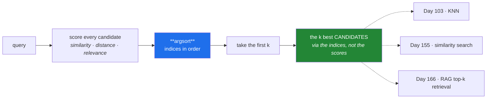

# Day 23 — Universal functions, statistics, and `argsort` top-k

**Phase 3 · Module 3** · IDs: **NP-06** (arithmetic and ufuncs), **NP-07** (statistics, sorting, searching, counting)

> **Yesterday:** broadcasting and reshaping.
> **Today:** the functions that do the work — and one in particular. `argsort` plus a slice is the
> **retrieval primitive**: score every candidate, take the best k. You will meet it again as KNN on
> Day 103, as cosine similarity on Day 155, and as the whole of vector search on Day 159.
> **Tomorrow:** linear algebra, and the matrix multiply every neural layer is.

```bash
./m start 23 && ./m scaffold 23
```

**Time:** 100 minutes. **Request budget:** 0 model calls.

---

## §1 The story

A **ufunc** — universal function — is an operation that applies element-wise, broadcasts, and runs in
compiled C. `np.sqrt`, `np.exp`, `+`, `>` are all ufuncs. There are about ninety of them, and the
practical consequence is: **if you are writing a loop over an array, there is almost certainly a ufunc
that does it.**

They share a small set of superpowers worth knowing once:

- `out=` writes into an existing array instead of allocating a new one.
- `where=` applies the operation only where a mask is true.
- `.reduce`, `.accumulate`, `.outer` turn any binary ufunc into an aggregate, a running total, or an
  all-pairs table. `np.add.reduce` **is** `np.sum`.

The second half is the day's real content: **`argsort`**.

`sort` gives you the values in order. `argsort` gives you the **indices** that would put them in
order — which is what you actually want, because the score and the thing being scored live in
different arrays.



That diagram is the entirety of retrieval. Everything Phase 18 and Phase 19 add — an index, a
reranker, a hybrid fusion — is an optimisation of the *scoring* step or a refinement of the
*selection* step. The shape never changes.

And one performance fact that matters at scale: sorting a million scores to take the top 10 is
O(n log n) work for an O(n) answer. **`np.argpartition`** is the O(n) version. You will write both
today and measure the difference.

---

## §2 Setup — run this

```bash
mkdir -p days/day-23/lab
touch days/day-23/lab/ufuncs.py
```

`src/setu/arrays.py` grows today. No new packages.

---

## §3 NP-06 — universal functions

`days/day-23/lab/ufuncs.py`:

```python
"""NP-06 / NP-07: ufuncs, aggregation, sorting, searching, counting."""

from __future__ import annotations

import time

import numpy as np


def what_a_ufunc_is() -> None:
    a = np.array([1.0, 4.0, 9.0, 16.0])
    print(f"\n{np.sqrt(a)=}")
    print(f"{np.exp([0, 1, 2])=}")
    print(f"{np.log([1, np.e, np.e**2])=}")
    print(f"{type(np.add).__name__=}   <- `+` IS np.add")
    print(f"{np.add(a, 1)=}")

    print(f"\n{np.add.reduce(a)=}        <- reduce: this is np.sum")
    print(f"{np.add.accumulate(a)=}   <- running total; this is np.cumsum")
    print(f"{np.multiply.outer([1, 2], [10, 20])=}   <- every pair")


def out_and_where() -> None:
    a = np.arange(6, dtype=float)
    target = np.zeros(6)

    np.multiply(a, 2, out=target)
    print(f"\n{target=}   <- written in place; no new array allocated")

    result = np.zeros(6)
    np.sqrt(a, out=result, where=a > 2)
    print(f"{result=}   <- only where the mask is True; the rest keeps its prior value")

    print("\n  `out=` matters at scale: on a 1 GiB array it is the difference")
    print("  between one allocation and two.")


def division_and_errors() -> None:
    a = np.array([1.0, 0.0, -1.0])

    with np.errstate(divide="ignore", invalid="ignore"):
        print(f"\n{1 / a=}   <- inf and -inf, no exception by default")
        print(f"{np.array([0.0]) / np.array([0.0])=}   <- nan")

    safe = np.divide(np.ones(3), a, out=np.zeros(3), where=a != 0)
    print(f"{safe=}   <- the safe-division idiom: out= + where=")

    with np.errstate(divide="raise"):
        try:
            1 / np.array([0.0])
        except FloatingPointError as exc:
            print(f"  errstate(divide='raise'): {exc}")
    print("  ^ turn this on while debugging a NaN in training (Day 129)")


def aggregation() -> None:
    rng = np.random.default_rng(0)
    m = rng.integers(0, 100, size=(4, 5))
    print(f"\n{m=}")
    print(f"{m.sum()=} {m.sum(axis=0)=} {m.sum(axis=1)=}")
    print(f"{m.min()=} {m.max()=} {m.mean().round(2)=}")
    print(f"{m.argmin()=}   <- index into the FLATTENED array")
    print(f"{np.unravel_index(m.argmin(), m.shape)=}   <- back to (row, col)")

    print(f"\n{m.cumsum(axis=1)=}")
    print(f"{np.median(m)=} {np.percentile(m, [25, 75])=}")
    print(f"{m.std(ddof=1).round(3)=}   <- ddof=1, as always in this project")

    with_nan = np.array([1.0, np.nan, 3.0])
    print(f"\n{with_nan.mean()=}      <- poisoned")
    print(f"{np.nanmean(with_nan)=}   <- nan-aware")


def counting_and_membership() -> None:
    a = np.array([3, 1, 4, 1, 5, 9, 2, 6, 5, 3])
    print(f"\n{np.unique(a)=}")
    values, counts = np.unique(a, return_counts=True)
    print(f"{dict(zip(values.tolist(), counts.tolist(), strict=True))=}")
    print(f"{np.bincount(a)=}   <- counts of 0..max; ints only, fast")

    print(f"\n{np.isin(a, [1, 5])=}   <- was np.in1d (Day 20)")
    print(f"{np.count_nonzero(a > 3)=}")
    print(f"{(a > 3).sum()=}   <- same thing; bool is an int")
    print(f"{np.any(a > 8)=} {np.all(a > 0)=}")
```

**Line by line:**

- `type(np.add).__name__` is `ufunc` — the `+` operator on arrays dispatches to it. Knowing that
  operators *are* ufuncs is what makes `.reduce` and `.outer` available on them.
- `np.add.reduce(a)` — repeatedly applies `add` across the array. It **is** `np.sum`. Likewise
  `np.multiply.reduce` is `np.prod` and `np.maximum.reduce` is `np.max`. One mechanism, many names.
- `np.multiply.outer(x, y)` — every element of `x` times every element of `y`, giving a
  `(len(x), len(y))` table. Yesterday's pairwise-distance broadcast, with a shorter spelling.
- `out=target` — writes into an existing buffer. On a 1 GiB array this is the difference between one
  allocation and two, and it is how you keep memory flat inside a training loop.
- `where=a > 2` — apply only where the mask is true; **elements outside the mask keep whatever was
  already in `out`**, which is why you must pass an initialised `out` and not `np.empty`.
- `np.divide(ones, a, out=zeros, where=a != 0)` — **the safe-division idiom.** Learn it as a unit. It
  is how Day 22's zero-variance column gets handled, and how any rate, ratio or normalisation avoids
  producing `inf`.
- `np.errstate(divide="raise")` — turns silent `inf`/`nan` production into a `FloatingPointError`
  **with a traceback pointing at the line that caused it**. When a Day-129 training run mysteriously
  produces NaN loss, wrapping the step in this is how you find the source in minutes instead of hours.
- `m.argmin()` returns an index into the **flattened** array. `np.unravel_index` converts it back to
  `(row, col)`. Forgetting this is a classic confusion when finding "the best cell in a matrix".
- `np.unique(a, return_counts=True)` — the value counts. `np.bincount` is much faster but works only
  on non-negative integers.
- `strict=True` on `zip` — Day 6's rule, still enforced.
- `np.isin` — the NumPy 2.x name; `np.in1d` is gone (Day 20).

---

## §4 NP-07 — sorting, searching, and top-k

Add to the same file:

```python
def sort_versus_argsort() -> None:
    scores = np.array([0.31, 0.95, 0.12, 0.78, 0.55])
    names = np.array(["a", "b", "c", "d", "e"])

    print(f"\n{np.sort(scores)=}      <- values, ascending")
    print(f"{np.argsort(scores)=}   <- the INDICES that would sort it")
    print(f"{names[np.argsort(scores)]=}   <- reorder ANOTHER array by those indices")

    order = np.argsort(scores)[::-1]
    print(f"\n{order=}   <- reversed for descending")
    print(f"{names[order][:3]=} {scores[order][:3]=}   <- top 3")

    print(f"\n{scores.argmax()=} {names[scores.argmax()]=}   <- top 1, cheaper")


def stability_and_descending() -> None:
    scores = np.array([0.5, 0.9, 0.9, 0.1])
    print(f"\n{np.argsort(scores)=}          <- stable: ties keep input order (1 before 2)")
    print(f"{np.argsort(scores)[::-1]=}   <- reversing also reverses the TIE order (2 before 1)")
    print(f"{np.argsort(-scores)=}        <- negate instead: ties stay in input order")
    print("  ^ this is why Day 21's top_k_indices negates rather than reversing.")

    print(f"\n{np.argsort(-scores, kind='stable')=}   <- be explicit when it matters")


def argpartition_is_the_fast_path() -> None:
    rng = np.random.default_rng(0)
    scores = rng.random(2_000_000)
    k = 10

    start = time.perf_counter()
    full = np.argsort(-scores)[:k]
    sort_time = time.perf_counter() - start

    start = time.perf_counter()
    candidates = np.argpartition(-scores, k)[:k]
    partial = candidates[np.argsort(-scores[candidates])]
    part_time = time.perf_counter() - start

    print(f"\ntop-{k} of {len(scores):,} scores")
    print(f"  argsort:      {sort_time:.4f}s   O(n log n)")
    print(f"  argpartition: {part_time:.4f}s   O(n)")
    print(f"  ~{sort_time / part_time:.1f}x faster")
    print(f"  same answer: {np.array_equal(full, partial)}")
    print("\n  argpartition guarantees the k best are in the first k SLOTS,")
    print("  in NO particular order - so you sort just those k afterwards.")


def searching() -> None:
    a = np.array([10, 20, 30, 40, 50])
    print(f"\n{np.searchsorted(a, 35)=}   <- insertion point in a SORTED array, O(log n)")
    print(f"{np.searchsorted(a, [5, 25, 99])=}")

    scores = np.array([0.3, 0.9, 0.1, 0.7])
    print(f"\n{np.where(scores > 0.5)=}   <- indices where true")
    print(f"{np.flatnonzero(scores > 0.5)=}   <- same, already flat")
    print(f"{np.argwhere(scores > 0.5)=}     <- as (n, ndim) coordinate pairs")


def lexsort_for_ties() -> None:
    years = np.array([2018, 2018, 2020, 2018])
    titles = np.array(["zebra", "alpha", "new", "beta"])

    order = np.lexsort((titles, -years))
    print(f"\n{order=}")
    print(f"{list(zip(years[order].tolist(), titles[order].tolist(), strict=True))=}")
    print("  ^ newest first, then title A-Z. NOTE: lexsort's LAST key is primary.")
    print("    This is Day 15's Paper.__lt__ as an array operation.")


if __name__ == "__main__":
    what_a_ufunc_is()
    out_and_where()
    division_and_errors()
    aggregation()
    counting_and_membership()
    sort_versus_argsort()
    stability_and_descending()
    argpartition_is_the_fast_path()
    searching()
    lexsort_for_ties()
```

**Line by line:**

- `names[np.argsort(scores)]` — **this is the point of `argsort`.** The scores and the things being
  scored are separate arrays; sorting the scores alone loses the correspondence. Indices preserve it.
- `np.argsort(scores)[::-1]` versus `np.argsort(-scores)` — both give descending order, and they
  differ on **ties**. `argsort` is stable, so equal scores keep input order; reversing the result
  reverses that too. Negating the values keeps stability intact. **This is exactly why Day 21's
  `top_k_indices` test insisted on tie-breaking by lower index.**
- `kind='stable'` — be explicit when order among ties is part of your contract. The default is
  introsort (`'quicksort'`), which is not stable.
- `np.argpartition(-scores, k)[:k]` — **O(n) instead of O(n log n).** It guarantees the k best land in
  the first k slots but says nothing about their order, so you sort only those k afterwards. Two steps
  instead of one, and dramatically faster at two million scores. Run it; the ratio is usually 5–20×.
- `np.searchsorted` — binary search on a sorted array, O(log n). Day 164's chunker uses it to find
  which chunk a character offset falls into.
- `np.where(cond)` with one argument returns a **tuple** of index arrays, one per dimension — which is
  why `np.flatnonzero` exists for the 1-D case and reads better.
- `np.lexsort((titles, -years))` — multi-key sorting. **The last key is the primary one**, which is
  backwards from every other API and catches everyone. This is Day 15's `Paper.__lt__` — sort by year
  descending, then title ascending — expressed over arrays.

---

## §5 Build brief

Extend `src/setu/arrays.py`:

```python
def safe_divide(numerator, denominator, *, fill: float = 0.0) -> np.ndarray:
    """TODO(me): element-wise division, returning `fill` where the denominator is 0.

    Use the out= + where= idiom. Must produce NO inf, NO nan, and NO RuntimeWarning.
    Must broadcast (a scalar numerator is allowed).
    """
    raise NotImplementedError


def top_k(scores, k: int, *, method: str = "auto") -> np.ndarray:
    """TODO(me): indices of the k largest, best first, ties by lower index.

    - method="sort"      -> np.argsort of the NEGATED scores
    - method="partition" -> np.argpartition, then sort only the k candidates
    - method="auto"      -> partition when k < len(scores) // 10, else sort
    - both methods must return IDENTICAL results, including tie order
    - k > len(scores) returns every index; k < 1 raises DataError
    - NaN scores must sort LAST, never first
    """
    raise NotImplementedError


def value_counts(values) -> dict:
    """TODO(me): {value: count}, ordered by count descending then value ascending.

    Use np.unique(return_counts=True) and np.lexsort. No Python Counter.
    Return plain Python types (int, not np.int64) so the result is JSON-serialisable.
    """
    raise NotImplementedError


def running_stats(values) -> dict[str, np.ndarray]:
    """TODO(me): {'cumsum', 'cummean', 'cummax'} - the running aggregates.

    cummean must not be a Python loop. Hint: cumsum / arange.
    Ignore NaN using the nan-aware functions where they exist.
    """
    raise NotImplementedError
```

- `top_k` implementing **both** methods and asserting they agree is the day's design point: the fast
  path must be provably equivalent to the obvious one. That is how you earn the right to use it.
- The NaN rule matters: `np.argsort` puts NaN **last** in ascending order, which means negating puts
  it **first** in your descending order — so a document with a NaN score would be your top hit. Handle
  it explicitly.
- `value_counts` returning Python types is the Day 21 note about NumPy scalars and JSON, made real.

---

## §6 The eval that must be able to fail

Add to `tests/test_arrays.py`:

```python
from setu.arrays import running_stats, safe_divide, top_k, value_counts


def test_safe_divide_returns_fill_not_inf():
    out = safe_divide([1.0, 2.0, 3.0], [1.0, 0.0, 3.0])
    assert np.array_equal(out, [1.0, 0.0, 1.0])
    assert np.all(np.isfinite(out))


def test_safe_divide_emits_no_warning(recwarn):
    safe_divide([1.0, 1.0], [0.0, 0.0])
    assert not [w for w in recwarn if issubclass(w.category, RuntimeWarning)], (
        "divide-by-zero warning leaked - use out= and where=, not errstate suppression"
    )


def test_safe_divide_broadcasts_a_scalar():
    assert np.array_equal(safe_divide(1.0, [1.0, 0.0, 2.0]), [1.0, 0.0, 0.5])


def test_top_k_is_descending():
    assert np.array_equal(top_k([0.1, 0.9, 0.5, 0.7], 2), [1, 3])


def test_top_k_ties_break_by_lower_index():
    assert np.array_equal(top_k([0.5, 0.9, 0.9], 2), [1, 2])


@pytest.mark.parametrize("method", ["sort", "partition"])
def test_both_methods_agree_with_each_other(method):
    rng = np.random.default_rng(4)
    scores = rng.random(5000)
    assert np.array_equal(top_k(scores, 25, method=method), top_k(scores, 25, method="sort"))


def test_both_methods_agree_when_there_are_many_ties():
    scores = np.repeat([0.9, 0.5, 0.9, 0.1], 50)
    assert np.array_equal(top_k(scores, 10, method="partition"), top_k(scores, 10, method="sort"))


def test_top_k_puts_nan_last():
    out = top_k([0.5, np.nan, 0.9], 3)
    assert out[0] == 2 and out[-1] == 1, "a NaN score became a top hit"


def test_top_k_larger_than_the_array():
    assert len(top_k([1.0, 2.0], 10)) == 2


def test_top_k_rejects_zero():
    with pytest.raises(DataError):
        top_k([1.0], 0)


def test_value_counts_orders_by_count_then_value():
    assert list(value_counts([3, 1, 3, 2, 1, 3]).items()) == [(3, 3), (1, 2), (2, 1)]


def test_value_counts_returns_json_serialisable_types():
    import json

    json.dumps(value_counts([1, 1, 2]))  # must not raise


def test_running_stats():
    out = running_stats([1.0, 3.0, 2.0, 8.0])
    assert np.array_equal(out["cumsum"], [1.0, 4.0, 6.0, 14.0])
    assert np.allclose(out["cummean"], [1.0, 2.0, 2.0, 3.5])
    assert np.array_equal(out["cummax"], [1.0, 3.0, 3.0, 8.0])


def test_running_stats_on_empty():
    out = running_stats([])
    assert all(v.size == 0 for v in out.values())
```

**Line by line:**

- `recwarn` — a built-in pytest fixture that collects every warning raised during the test.
  `test_safe_divide_emits_no_warning` is stricter than "no inf": an implementation that computes
  `n / d` and then patches up the infinities **works** but emits a `RuntimeWarning` on every call, and
  a million of those in a training loop drowns your log. The `out=`/`where=` idiom never performs the
  division at all. The failure message names the wrong fix explicitly, because suppressing the warning
  with `errstate` is the tempting shortcut.
- `test_both_methods_agree_with_each_other` — **the day's real assessment.** Two implementations, one
  fast and one obvious, asserted identical over 5000 random scores. This is how you earn the right to
  ship the fast one.
- `test_both_methods_agree_when_there_are_many_ties` — 200 values with only four distinct scores.
  `argpartition` makes no ordering promise among ties, so a naive partition implementation gives a
  *different but equally valid* answer and fails here. The fix is to sort the k candidates by
  `(-score, index)`, which is the same tie rule as `sort`.
- `test_top_k_puts_nan_last` — the trap from §5. Negating scores puts NaN first unless you handle it.
  In a RAG system that means a document with a broken score becomes your top citation.
- `test_value_counts_returns_json_serialisable_types` — `json.dumps` on `np.int64` raises `TypeError`.
  Calling it in the test is the whole assertion.
- `test_running_stats_on_empty` — the degenerate case. `cumsum / arange(1, n+1)` divides by an empty
  array, which is fine; a hand-rolled loop with an initial value is not.

```bash
uv run python -m pytest tests/test_arrays.py -v
```

---

## §7 Request budget

| Resource | Spent today |
|---|---|
| LLM calls | **0** |

---

## §8 Traps

- **Looping where a ufunc exists.** Ninety of them. Look first.
- **Suppressing a divide warning instead of avoiding the division.** Use `out=` + `where=`.
- **`argsort(x)[::-1]` for descending.** Reverses the tie order too. Negate instead.
- **Assuming `argpartition` returns sorted indices.** It does not. Sort the k candidates after.
- **NaN in scores.** Sorts last ascending, so **first** when negated. Handle it or it becomes your top hit.
- **`argmin`/`argmax` on a 2-D array.** Flattened index. `np.unravel_index` to recover `(row, col)`.
- **`lexsort` key order.** The **last** key is primary. Backwards from everything else.
- **`np.where(cond)` returning a tuple.** Use `np.flatnonzero` for the 1-D case.
- **NumPy scalars in JSON.** `np.int64` is not serialisable. `int()` first.
- **`.mean()` with NaN present.** Poisoned. `np.nanmean`.

---

## §9 Verify before you code

Written **2026-08-21**:

- <https://numpy.org/doc/stable/reference/ufuncs.html> — the ufunc list plus `out`, `where`, `reduce`.
- <https://numpy.org/doc/stable/reference/generated/numpy.argpartition.html> — what it does and does
  not guarantee.
- <https://numpy.org/doc/stable/reference/generated/numpy.lexsort.html> — confirm the last key is primary.
- <https://numpy.org/doc/stable/reference/generated/numpy.errstate.html> — the error-policy options.

---

## §10 Say it in an interview

> "`argsort` returning indices rather than values is the whole of retrieval: you score candidates in
> one array, sort the indices, and use them to reach into another. Two details bite. Descending order
> by reversing a stable sort also reverses the tie order, so I negate the scores instead. And at scale
> you don't sort — `argpartition` gets the top k in linear time and then you sort just those k, which
> is roughly ten times faster on a couple of million scores. I keep both implementations and there's a
> test asserting they're byte-identical, including on data that's almost all ties, because
> `argpartition` makes no ordering promise. NaN is the other one: it sorts last ascending, so negating
> puts it first — a broken score would become your top citation."

---

## §11 Done when

Tick [`CHECKLIST.md`](CHECKLIST.md), then `./m check && ./m done 23`.
