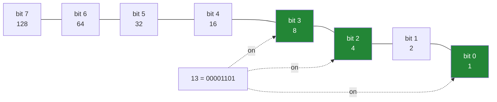

# 1.1 — A number is a row of switches

## One-line answer

Every integer in an array is physically a fixed row of on-or-off switches, and once you can see that row
you can read it, set it and count it — which is what the whole of this section is about.

---

## The story

Five people share a flat, and there is a chart on the fridge. Eight jobs down the side — bins, hoover,
dishes, bathroom, shopping, recycling, windows, post — and a tick for each job somebody has done this
week.

The chart is not a list of numbers. It is a grid of ticks and blanks. Nothing is written down about *how
much* anybody did; each box is only a yes or a no.

One evening somebody wants to text the chart to the person who is away. Reading out forty ticks and
blanks down the phone is ridiculous, so they do the obvious thing instead: they read each row as a single
run of yes-no-yes-no, and say it as one thing rather than eight.

That is the whole idea. Eight yes-or-no answers, in a fixed order, are one piece of information — and if
you fix the order in advance, the answers can travel as a single item instead of eight.

---

## The idea in plain language

A **bit** is a single yes-or-no. It has two possible values, usually written `0` and `1`.

Every integer a computer stores is a fixed-length row of bits. An `int8` is eight of them, a `uint8` is
eight of them, an `int64` is sixty-four
([Day 20, 2.2](../../../day-20-arrays-and-dtypes/parts/02-dtypes/2.2-integers-and-the-silent-wrap.md)).
The row is what is physically there; the number you usually see is an interpretation of it.

The interpretation is **binary**, which is counting with two digits instead of ten. In our usual notation
each position is worth ten times the one to its right — units, tens, hundreds. In binary each position is
worth **two** times the one to its right — 1, 2, 4, 8, 16, and so on. So the row `00001101` means
`8 + 4 + 0 + 1`, which is 13.

Two things follow immediately, and they are the reason this matters rather than being a curiosity.

**The row has a fixed length**, so there is a largest number it can hold. Eight bits, all on, is
`11111111`, which is 255. There is no room for 256, which is why `np.uint8` wraps around
([Day 20, 2.2](../../../day-20-arrays-and-dtypes/parts/02-dtypes/2.2-integers-and-the-silent-wrap.md)).
`np.iinfo` reports the limits of any integer dtype, and it is the function to reach for rather than
remembering the powers of two.

**One bit position can mean one thing.** If you decide in advance that the rightmost bit means "bins" and
the next one means "hoover", then a single `uint8` carries a whole row of the fridge chart. That is a
**bitmask**, and it is [1.5](1.5-a-bitmask.md)'s subject.

One more term, because the numbering is confusing the first time. Bits are conventionally counted from
the **right**, starting at zero: bit 0 is the rightmost and worth 1, bit 3 is worth 8. That is the
opposite direction from how you read the digits, and it is the source of most off-by-ones here.

Finally, the tool for looking. `np.binary_repr(n, width=8)` prints the row for a number, padded to a
stated width. Python's own `bin()` does something similar but adds a `0b` prefix and does **not** pad, so
the two are not interchangeable when you want columns that line up.

---

## Why Setu needs it

- **[1.2](1.2-the-four-bitwise-ufuncs.md) through [1.6](1.6-packbits.md)** all operate on these rows. None
  of them makes sense without being able to see one.
- **[1.6](1.6-packbits.md)'s `packbits`** is the plan's named example for `NP-08`: forty booleans stored
  in five bytes rather than forty.
- **Day 20's dtype work** said an `int8` holds −128 to 127 and this is why: one of the eight bits records
  the sign, leaving seven for the value
  ([Day 20, 2.2](../../../day-20-arrays-and-dtypes/parts/02-dtypes/2.2-integers-and-the-silent-wrap.md)).
- **Day 155's vector databases** store quantised embeddings, where a float is squeezed into eight bits or
  fewer, and binary hashes are compared with bit operations rather than arithmetic.
- **Day 42's SQL phase** meets permission flags stored as a single integer column, which is a bitmask that
  somebody chose for exactly the reasons this section gives.

---

## The mechanism

The rows behind some ordinary numbers:

```python
import numpy as np

for n in [0, 1, 5, 13, 255]:
    print(f"  {n:4d}  {bin(n):>12s}  {np.binary_repr(n, width=8)}")

print("  256 needs", len(np.binary_repr(256)), "bits:", np.binary_repr(256))
print()
print(np.iinfo(np.int8))
```

**Line by line:**

- `f"{n:4d}"` — the decimal number in a four-wide column, so the rows line up and the pattern is visible
  ([Day 7, 3.2](../../../day-07-strings/parts/03-formatting/3.2-the-format-spec.md)).
- `bin(n)` — Python's own binary form. It carries a `0b` prefix and **no padding**, which is why `1` prints
  as `0b1` and the column is ragged. Useful at a prompt, wrong for a table.
- `np.binary_repr(n, width=8)` — NumPy's, padded to eight. **This is the one to use**, because the padding
  is what makes the bit positions comparable between rows.
- `13` printing as `00001101` — read it right to left: 1 (bit 0), 0, 1 (bit 2, worth 4), 1 (bit 3, worth
  8). One plus four plus eight is thirteen.
- `255` as `11111111` — every bit on, and the largest an eight-bit row can hold.
- `np.binary_repr(256)` with **no width** — nine characters, because 256 does not fit in eight bits at
  all. Asking for `width=8` here does not pad and does not truncate: on NumPy 2.5 it **raises**, which is
  the first failure block below.
- `np.iinfo(np.int8)` — the limits of the dtype, printed as a small table. Reading them off rather than
  remembering them is the habit worth forming, because the same call works for `int8`, `uint8`, `int64`
  and everything between.

```text
     0           0b0  00000000
     1           0b1  00000001
     5         0b101  00000101
    13        0b1101  00001101
   255    0b11111111  11111111
  256 needs 9 bits: 100000000

Machine parameters for int8
---------------------------------------------------------------
min = -128
max = 127
---------------------------------------------------------------
```

The eight positions and what each is worth:



Note the direction. The bits are **numbered from the right** and **written from the left**, which is why
bit 0 appears at the end of the printed row.

Now the fridge chart, as rows of bits:

```python
import numpy as np

CHORES = np.array(
    ["bins", "hoover", "dishes", "bathroom", "shopping", "recycling", "windows", "post"]
)
did = np.array(
    [
        [1, 0, 1, 0, 1, 1, 0, 0],
        [0, 1, 1, 1, 0, 0, 1, 0],
        [1, 1, 0, 0, 1, 0, 0, 1],
        [0, 0, 1, 1, 0, 1, 1, 1],
        [1, 0, 0, 1, 1, 0, 1, 0],
    ],
    dtype=bool,
)

print("chores      :", CHORES)
print("shape       :", did.shape, "dtype", did.dtype)
print("one row     :", did[0].astype(np.uint8))
print("that row did:", CHORES[did[0]])
print("bytes stored:", did.nbytes, "for", did.size, "yes-or-no answers")
```

**Line by line:**

- `dtype=bool` — this is a chart of yes and no, not of counts. Saying so means every operation later is a
  boolean one, and a value of `2` becomes impossible rather than merely unlikely.
- `did[0].astype(np.uint8)` — printed as `1` and `0` rather than `True` and `False`, purely so the row
  reads like the bit rows above it. The conversion allocates a new array
  ([Day 20, 2.4](../../../day-20-arrays-and-dtypes/parts/02-dtypes/2.4-astype-and-the-copy.md)).
- `CHORES[did[0]]` — the boolean row used as a **mask** to select names
  ([Day 21, 3.2](../../../day-21-indexing-and-views/parts/03-boolean-masks/3.2-indexing-with-a-mask.md)).
  This is why the chart is stored as booleans rather than as `1` and `0`: a boolean array selects, and an
  integer array of ones and zeros would select element 1 and element 0 instead.
- `did.nbytes` — **40 bytes for 40 yes-or-no answers**. That is the number this whole section exists to
  improve on: a boolean in NumPy costs a whole byte, when one bit would do
  ([1.6](1.6-packbits.md)).

```text
chores      : ['bins' 'hoover' 'dishes' 'bathroom' 'shopping' 'recycling' 'windows'
 'post']
shape       : (5, 8) dtype bool
one row     : [1 0 1 0 1 1 0 0]
that row did: ['bins' 'dishes' 'shopping' 'recycling']
bytes stored: 40 for 40 yes-or-no answers
```

Forty bytes is three hundred and twenty bits, holding forty bits of actual information. **Eight times more
storage than the data needs**, which nobody would notice on a fridge chart and everybody notices at a
billion rows.

---

## When it breaks

**A width that was too small:**

```text
$ uv run python -c "
import numpy as np
np.binary_repr(300, width=8)
"
Traceback (most recent call last):
  File "<string>", line 3, in <module>
  File "...\numpy\_core\numeric.py", line 2082, in binary_repr
    err_if_insufficient(width, binwidth)
  File "...\numpy\_core\numeric.py", line 2066, in err_if_insufficient
    raise ValueError(
ValueError: Insufficient bit width=8 provided for binwidth=9
```

**What it means.** 300 needs nine bits and you asked for eight, so NumPy refuses rather than either
truncating — which would silently show you a different number — or quietly widening, which would break
any column you were lining up. Both alternatives are worse, and it is worth noticing that this is one of
the few places in NumPy where the strict choice was made. **`width=` is neither a minimum nor a maximum;
it is an assertion**, and the way to display values of unknown size is to compute the width from the
dtype: `np.iinfo(arr.dtype).bits`.

**A negative number, which is not what you expect:**

```text
$ uv run python -c "
import numpy as np
print('-5 no width:', np.binary_repr(-5))
print('-5 width 8 :', np.binary_repr(-5, width=8))
"
-5 no width: -101
-5 width 8 : 11111011
```

**What it means.** With no width it prints `-101`: a minus sign in front of the bits for 5, which is
**not** how a negative number is stored anywhere. With a width it prints `11111011`, which is how it
really is stored — a representation called **two's complement**, where the top bit being on means
negative and the rest counts backwards from zero. The two outputs describe the same value and only one of
them describes the memory. That is why an `int8` runs from −128 to 127 rather than −127 to 127
([Day 20, 2.2](../../../day-20-arrays-and-dtypes/parts/02-dtypes/2.2-integers-and-the-silent-wrap.md)),
and it is the reason `~` on a signed integer gives an answer that looks nothing like a flipped row
([1.3](1.3-tilde-on-bool-and-int.md)).

**A float has no bit row you can read this way:**

```text
$ uv run python -c "
import numpy as np
np.binary_repr(1.5)
"
Traceback (most recent call last):
  File "<string>", line 3, in <module>
TypeError: 'float' object cannot be interpreted as an integer
```

**What it means.** A float is also a row of bits, but the bits are divided into a sign, an exponent and a
fraction rather than being read as one number
([Day 20, 2.3](../../../day-20-arrays-and-dtypes/parts/02-dtypes/2.3-floats-nan-and-precision.md)), so
`binary_repr` refuses rather than giving a misleading answer. To see a float's actual bits you reinterpret
its memory with `.view(np.uint64)`, which is a different operation and worth knowing exists. **Every
bitwise operation in this section is defined for integers and booleans only**, and floats raise.

**The boolean row used as positions:**

```text
$ uv run python -c "
import numpy as np
CHORES = np.array(['bins', 'hoover', 'dishes', 'bathroom'])
as_bool = np.array([True, False, True, False])
as_int = np.array([1, 0, 1, 0])
print('bool mask :', CHORES[as_bool])
print('int index :', CHORES[as_int])
"
bool mask : ['bins' 'dishes']
int index : ['hoover' 'bins' 'hoover' 'bins']
```

**What it means.** The same-looking data indexes in two completely different ways. A boolean array
**selects** the positions where it is `True`; an integer array of ones and zeros **looks up** element 1,
element 0, element 1, element 0 — four results from a four-element array, all of them wrong
([Day 21, 4.1](../../../day-21-indexing-and-views/parts/04-fancy-indexing/4.1-a-list-of-positions.md)).
Neither raises. This is why the chart above is built with `dtype=bool` rather than left as integers: the
dtype is the only thing that distinguishes the two meanings.

---

## In production

**What a professional writes instead of the teaching version.** The bit positions get names, in one place,
and nothing else in the codebase is allowed to know the numbers:

```python
from __future__ import annotations

from enum import IntFlag

import numpy as np


class Chore(IntFlag):
    """One bit per chore. The values are the bit positions and must never be reordered."""

    BINS = 1 << 0
    HOOVER = 1 << 1
    DISHES = 1 << 2
    BATHROOM = 1 << 3
    SHOPPING = 1 << 4
    RECYCLING = 1 << 5
    WINDOWS = 1 << 6
    POST = 1 << 7


CHORE_DTYPE = np.uint8  # exactly eight chores; adding a ninth is a migration, not an edit


def describe(row: np.uint8) -> list[str]:
    """The chores set in one packed row, by name."""
    return [chore.name for chore in Chore if row & chore]
```

**Line by line:**

- `IntFlag` rather than a plain `Enum` — it is the standard library's type for exactly this, and it makes
  `Chore.BINS | Chore.DISHES` a legal value with a readable `repr`
  ([Day 13, 1.1](../../../day-13-inheritance-and-abstraction/parts/01-inheritance/1.1-one-form-that-starts-from-another.md)
  covers the class machinery underneath). The values still behave as integers, so they work directly in
  NumPy expressions.
- `1 << 0`, `1 << 1`, … rather than `1, 2, 4, 8` — **the shift form says "bit 0", "bit 1"**, which is what
  is actually meant. Writing the powers of two invites somebody to add `9` to the list one day, and `9` is
  two bits rather than one.
- The docstring warning that values must never be reordered — this is the real hazard. A bitmask is a
  **storage format**: swapping two names swaps the meaning of every already-stored row, and there is
  nothing in the data to say so.
- `CHORE_DTYPE = np.uint8` with the comment — eight chores fit in eight bits exactly, which is elegant and
  is also a wall. Adding a ninth chore means widening every stored value to `uint16`, and calling that a
  migration in a comment is how the next person finds out before they try it.
- `np.uint8` rather than `np.int8` — **unsigned**, deliberately. A signed eight-bit value uses its top bit
  for the sign, so setting the eighth chore would make the number negative and every comparison surprising
  ([1.3](1.3-tilde-on-bool-and-int.md)).
- `row & chore` in a truth test — the bitwise `and` of the row with a single-bit value is non-zero exactly
  when that bit is set, which is the standard membership test
  ([1.5](1.5-a-bitmask.md)).

**What changes at scale.** The eight-to-one saving is the whole point, and it appears the moment the data
is stored or sent rather than held. A billion boolean flags are a gigabyte as a NumPy `bool` array and 125
megabytes packed — which is the difference between a dataset that fits in memory and one that does not,
and a much larger difference over a network. Three cautions. Packed data is **not** directly computable:
you cannot compare, sum or index a packed array without unpacking it, so packing is for storage and
transport, never for working memory. The bit order becomes part of the file format, so it must be written
down somewhere a future reader will find it. And on the arithmetic side, bit operations are the cheapest
instructions a processor has — a 64-bit `and` does sixty-four comparisons in one instruction — which is
why a bitset intersection is dramatically faster than a set intersection, and why search engines store
posting lists as bitmaps.

**The failure that only appears with real data.** A permissions column stored eight flags in a `int8`.
Everything worked for two years, because only the first seven permissions were ever used. The eighth was
added, the top bit was set for the first time, and every stored value for those users became negative.
The comparison `WHERE permissions > 0` that had been filtering out unset rows silently began excluding the
most privileged users instead. The dtype should have been unsigned from the first line.

**The review comment a senior engineer leaves.** *"These flag constants are literal `1, 2, 4, 8`. Use
`1 << n` so it is obvious they are bit positions and not an arbitrary sequence, and put a comment on the
class saying the values are a storage format — the next person to alphabetise this enum will silently
rewrite the meaning of every row already in the database."*

**The interview question.** *"What is a bit, and why would you store flags in an integer?"* A bit is a
single yes-or-no, and an integer is physically a fixed row of them — eight for a `uint8`, sixty-four for an
`int64` — read in binary, where each position is worth twice the one to its right. Storing flags that way
turns many yes-or-no answers into one value, which matters for storage and for speed: a boolean array in
NumPy costs a whole **byte** per answer, so packing is an eight-fold saving, and bitwise operations
compare sixty-four flags in a single processor instruction. The details that show experience: use an
unsigned dtype, because the top bit of a signed integer is the sign and setting the last flag makes the
value negative; write the constants as `1 << n` so they read as bit positions; and treat the bit order as a
file format rather than as code, since reordering the names rewrites the meaning of every value already
stored.

---

## Check yourself

```bash
uv run python -c "
import numpy as np
for n in [1, 2, 4, 8, 13, 255]:
    print(f'{n:4d}  {np.binary_repr(n, width=8)}')
print('width from dtype   :', np.binary_repr(200, width=np.iinfo(np.uint8).bits))
print('negative, no width :', np.binary_repr(-5))
print('negative, width 8  :', np.binary_repr(-5, width=8))
print('int8 limits        :', np.iinfo(np.int8).min, np.iinfo(np.int8).max)
print('uint8 limits       :', np.iinfo(np.uint8).min, np.iinfo(np.uint8).max)
print('bool nbytes        :', np.array([True] * 40).nbytes, 'for 40 answers')
"
```

The last line reports forty bytes for forty yes-or-no answers. Say how many bits that actually is, how
many are carrying information, and what the ratio is.

**Answer out loud, without scrolling up:**

> Read `00001101` as a number, and say which bit numbers are on. Then say why `np.int8` runs to 127 and
> not to 255.

---

**Next:** [1.2 — the four bitwise ufuncs](1.2-the-four-bitwise-ufuncs.md).
