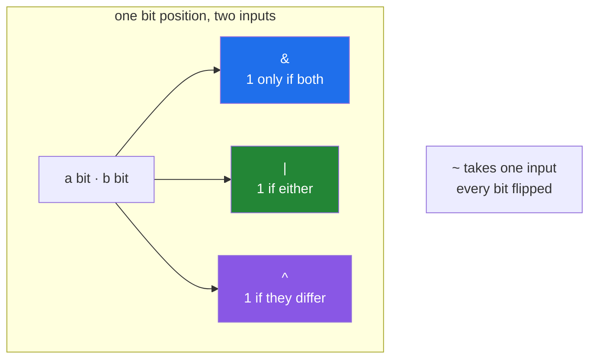

# 1.2 — `&`, `|`, `^`, `~` — the four bitwise ufuncs

## One-line answer

`&`, `|`, `^` and `~` line two rows of bits up and combine them one position at a time — they are
universal functions like every other operator, so they broadcast, they take `out=`, and they work on whole
arrays at once.

---

## The story

Two people in the flat compare their weeks. Each has a row of eight ticks and blanks — the jobs they did.

They ask three different questions, and each one is answered by laying the two rows side by side and going
along them together.

"Which jobs did we **both** do?" Tick only where both rows have a tick. That turns out to be one job:
dishes.

"Which jobs did **either** of us do?" Tick where either row has a tick. That is most of them.

"Which jobs did exactly **one** of us do?" Tick where the two rows disagree — which is the useful one for
an argument about fairness, because it is the list of jobs that were done by one person while the other
did not.

Nobody has to hold both rows in their head. You go along position by position, and each position's answer
depends only on the two ticks in that position.

---

## The idea in plain language

Those three questions are the three two-input **bitwise operations**, and there is a fourth for one input.

**`&` is bitwise and.** A bit in the result is 1 only when the bit in that position is 1 in *both*
inputs. That is "which did we both do".

**`|` is bitwise or.** A bit is 1 when it is 1 in *either* input. That is "which did either of us do".

**`^` is bitwise exclusive or**, usually shortened to **xor**. A bit is 1 when the two inputs *differ*.
That is "which did exactly one of us do", and it is the one people know least and use most, because it is
the difference between two states.

**`~` is bitwise not**, taking one input. Every bit is flipped: 1 becomes 0 and 0 becomes 1. It has a
surprise attached, and that surprise gets its own document
([1.3](1.3-tilde-on-bool-and-int.md)).

The important thing about all four, and the reason they appear on this day rather than being trivia, is
that they are **ufuncs** — the same kind of object as `np.add`
([Day 23, 1.1](../../../day-23-ufuncs-and-statistics/parts/01-ufuncs/1.1-one-operation-every-element.md)).
`np.bitwise_and` is the function and `&` is its spelling. Everything you learned about ufuncs applies
unchanged: they are elementwise, they broadcast, they loop in compiled code, and they take `out=` and
`where=`
([Day 23, 1.2](../../../day-23-ufuncs-and-statistics/parts/01-ufuncs/1.2-out-and-the-temporaries.md)).

That is why the same four operators do two different-looking jobs in NumPy. On a **boolean** array they
combine masks, which you met on Day 21
([Day 21, 3.3](../../../day-21-indexing-and-views/parts/03-boolean-masks/3.3-and-or-not-and-why-and-raises.md)).
On an **integer** array they combine bit rows. Those are the same operation: a boolean array is a row of
one-bit values, and an integer array is a row of eight-, sixteen- or sixty-four-bit values.

Two properties of xor are worth stating in advance, because they are why it turns up in so many places.

It is its own **undo**: `a ^ b ^ b` gives back `a`. Apply it twice with the same second value and you are
back where you started. That is the basis of the simplest possible encryption and of the trick for
swapping two values without a temporary.

And `a ^ a` is **zero**, for any `a`. Every bit differs from itself in no position at all.

---

## Why Setu needs it

- **[1.5](1.5-a-bitmask.md)** builds every one of its operations out of these four: setting a flag is `|`,
  clearing one is `& ~`, toggling one is `^`, and testing one is `&`.
- **[1.6](1.6-packbits.md)** compares packed rows, and comparing packed data means comparing bits.
- **Day 21's masks** used `&` and `|` on booleans without saying they were bitwise ufuncs
  ([Day 21, 3.3](../../../day-21-indexing-and-views/parts/03-boolean-masks/3.3-and-or-not-and-why-and-raises.md));
  this is the document that closes that gap.
- **Day 155's vector databases** compare binary hashes by counting the set bits in `a ^ b`, which is a
  measure called Hamming distance and is one xor followed by one count.
- **Day 76's feature work** combines several row filters, which is `&` on boolean arrays a dozen times a
  day.

---

## The mechanism

The four operations on three pairs of eight-bit rows:

```python
import numpy as np

a = np.array([12, 10, 5], dtype=np.uint8)
b = np.array([10, 6, 3], dtype=np.uint8)


def rows(arr: np.ndarray) -> list[str]:
    return [np.binary_repr(int(x), width=8) for x in arr]


print("a       :", a, rows(a))
print("b       :", b, rows(b))
print("a & b   :", a & b, rows(a & b))
print("a | b   :", a | b, rows(a | b))
print("a ^ b   :", a ^ b, rows(a ^ b))
print("~a      :", ~a, rows(~a))
print("is ufunc:", type(np.bitwise_and).__name__, np.bitwise_and.nin, np.bitwise_and.ntypes)
```

**Line by line:**

- `dtype=np.uint8` — **unsigned**, so `~` gives a positive answer and the printed rows are readable. On a
  signed dtype the same line produces negative numbers, which is [1.3](1.3-tilde-on-bool-and-int.md)'s
  whole subject.
- `rows()` as a small helper — the numbers alone teach nothing here; the bit rows are the point, and
  writing the conversion once keeps the seven print lines readable.
- `int(x)` inside the helper — `np.binary_repr` wants a Python integer, and passing the NumPy scalar
  directly works today but converting is the honest boundary
  ([Day 20, 2.5](../../../day-20-arrays-and-dtypes/parts/02-dtypes/2.5-nep-50-and-the-python-number.md)).
- `a & b` — compare the first pair by eye: `00001100` and `00001010` share exactly one position, bit 3,
  so the answer is `00001000`, which is 8.
- `a | b` — the same pair gives `00001110`, which is 14: every position on in either.
- `a ^ b` — `00000110`, which is 6: the two positions where they differ. Note that `and` plus `xor`
  accounts for `or` exactly, which is a good sanity check when reading these by hand.
- `~a` — `00001100` becomes `11110011`, which as an **unsigned** eight-bit number is 243. Every bit
  flipped, including the five leading zeros nobody was thinking about.
- `np.bitwise_and.nin` and `.ntypes` — two inputs, twelve compiled loops. **They are ufuncs**, with all
  the machinery that implies: `np.bitwise_and(a, b, out=a)` combines in place with no allocation, and the
  twelve loops are why a float raises rather than being converted.

```text
a       : [12 10  5] ['00001100', '00001010', '00000101']
b       : [10  6  3] ['00001010', '00000110', '00000011']
a & b   : [8 2 1] ['00001000', '00000010', '00000001']
a | b   : [14 14  7] ['00001110', '00001110', '00000111']
a ^ b   : [ 6 12  6] ['00000110', '00001100', '00000110']
~a      : [243 245 250] ['11110011', '11110101', '11111010']
is ufunc: ufunc 2 12
```

The four operations, position by position:



Now the same four operations on the fridge chart, where the rows are booleans rather than integers:

```python
import numpy as np

CHORES = np.array(
    ["bins", "hoover", "dishes", "bathroom", "shopping", "recycling", "windows", "post"]
)
did = np.array(
    [
        [1, 0, 1, 0, 1, 1, 0, 0],
        [0, 1, 1, 1, 0, 0, 1, 0],
        [1, 1, 0, 0, 1, 0, 0, 1],
        [0, 0, 1, 1, 0, 1, 1, 1],
        [1, 0, 0, 1, 1, 0, 1, 0],
    ],
    dtype=bool,
)
first, second = did[0], did[1]

print("first   :", CHORES[first])
print("second  :", CHORES[second])
print("both    :", CHORES[first & second])
print("either  :", CHORES[first | second])
print("just one:", CHORES[first ^ second])
print("neither :", CHORES[~(first | second)])
print("xor twice:", np.array_equal(first ^ second ^ second, first))
```

**Line by line:**

- `first, second = did[0], did[1]` — two rows of the chart, each a boolean array of eight
  ([Day 8, 1.4](../../../day-08-containers/parts/01-sequences/1.4-unpacking-and-star-rest.md)).
- `CHORES[first & second]` — the mask is combined first and then used to select names
  ([Day 21, 3.2](../../../day-21-indexing-and-views/parts/03-boolean-masks/3.2-indexing-with-a-mask.md)).
  **Exactly the same `&` as on the integers above**, running its boolean loop instead of its `uint8` one.
- `first ^ second` — "did by exactly one of us". There is no way to write this with `&` and `|` in one
  operation, which is why xor is a separate operator rather than a convenience.
- `~(first | second)` — the jobs nobody did, and the brackets are **required**. `~` binds more tightly
  than `|`, so `~first | second` flips the first row and then ors, which is a different and legal answer
  ([Day 21, 3.3](../../../day-21-indexing-and-views/parts/03-boolean-masks/3.3-and-or-not-and-why-and-raises.md)).
- `first ^ second ^ second` — back to `first` exactly. **This is xor being its own undo**, and it is worth
  running once so it stops being a claim.

```text
first   : ['bins' 'dishes' 'shopping' 'recycling']
second  : ['hoover' 'dishes' 'bathroom' 'windows']
both    : ['dishes']
either  : ['bins' 'hoover' 'dishes' 'bathroom' 'shopping' 'recycling' 'windows']
just one: ['bins' 'hoover' 'bathroom' 'shopping' 'recycling' 'windows']
neither : ['post']
xor twice: True
```

Between them the two people did seven of the eight jobs and both did only one. `post` is the job nobody
touched, and it took one `~` and one `|` to find.

---

## When it breaks

**A float:**

```text
$ uv run python -c "
import numpy as np
np.array([1.0, 2.0]) & np.array([1.0, 2.0])
"
Traceback (most recent call last):
  File "<string>", line 3, in <module>
TypeError: ufunc 'bitwise_and' not supported for the input types, and the inputs could not be safely coerced to any supported types according to the casting rule ''safe''
```

**What it means.** The twelve compiled loops of `np.bitwise_and` cover integers and booleans and nothing
else. A float's bits are divided into a sign, an exponent and a fraction
([Day 20, 2.3](../../../day-20-arrays-and-dtypes/parts/02-dtypes/2.3-floats-nan-and-precision.md)), so
combining them position by position would produce a number with no meaning at all, and NumPy refuses
rather than letting you. This appears in practice when a flags column arrived as `float64` because it had
a missing value in it
([Day 23, 2.5](../../../day-23-ufuncs-and-statistics/parts/02-statistics/2.5-the-nan-family.md)); the fix
is upstream, not an `.astype`.

**The brackets that were left off:**

```text
$ uv run python -c "
import numpy as np
steps = np.array([8213, 10442, 6180, 9000])
print(steps > 7000 & steps < 10000)
"
Traceback (most recent call last):
  File "<string>", line 4, in <module>
ValueError: The truth value of an array with more than one element is ambiguous. Use a.any() or a.all()
```

**What it means.** `&` binds **more tightly** than `>` and `<`, so Python read this as
`steps > (7000 & steps) < 10000`, which is a chained comparison on an array and cannot produce a single
yes or no. The error mentions truth values and says nothing about brackets, which is why this one costs
people ten minutes the first time. **Always bracket each comparison**: `(steps > 7000) & (steps < 10000)`.
The precedence is inherited from C and is not going to change.

**`&` where `and` was meant, on two ordinary numbers:**

```text
$ uv run python -c "
print('3 and 5 :', 3 and 5)
print('3 & 5   :', 3 & 5)
print('1 and 2 :', 1 and 2)
print('1 & 2   :', 1 & 2)
"
3 and 5 : 5
3 & 5   : 1
1 and 2 : 2
1 & 2   : 0
```

**What it means.** On plain Python integers the two operators are completely different and both are legal.
`and` returns one of its operands — the second, when the first is truthy — while `&` combines the bit
rows: `011 & 101` is `001`, which is 1. The last pair is the dangerous one: `1 and 2` is `2`, which is
truthy, and `1 & 2` is `0`, which is falsy, so swapping the operators inverts the meaning of an `if`.
This is the mirror image of the NumPy problem, where `and` raises and `&` is correct
([Day 21, 3.3](../../../day-21-indexing-and-views/parts/03-boolean-masks/3.3-and-or-not-and-why-and-raises.md)).
**On arrays use `&`; on plain booleans use `and`**, and never mix the two habits without thinking.

---

## In production

**What a professional writes instead of the teaching version.** The mask-combining is named, so that
neither the brackets nor the operator choice is retyped at each call site:

```python
from __future__ import annotations

from functools import reduce

import numpy as np


def all_of(*masks: np.ndarray) -> np.ndarray:
    """Elementwise AND of every mask. Raises rather than broadcasting a shape mistake."""
    if not masks:
        raise ValueError("all_of needs at least one mask")
    shapes = {m.shape for m in masks}
    if len(shapes) != 1:
        raise ValueError(f"masks must have one shape, got {sorted(shapes)}")
    for i, mask in enumerate(masks):
        if mask.dtype != np.bool_:
            raise TypeError(f"mask {i} has dtype {mask.dtype}, expected bool")
    out = masks[0].copy()
    for mask in masks[1:]:
        np.logical_and(out, mask, out=out)
    return out


def any_of(*masks: np.ndarray) -> np.ndarray:
    """Elementwise OR of every mask, with the same checks."""
    return reduce(lambda a, b: a | b, masks) if masks else np.array([], dtype=bool)
```

**Line by line:**

- `*masks` — any number of them, so a caller with five conditions writes `all_of(a, b, c, d, e)` rather
  than a line of `&` with ten brackets in it
  ([Day 10, 1.4](../../../day-10-functions/parts/01-the-signature/1.4-args-and-kwargs.md)). The
  bracket-precedence bug cannot be written at all in this form.
- `shapes = {m.shape for m in masks}` and the length check — **this is the important one**. `&`
  broadcasts, so a `(1000,)` mask combined with a `(1000, 1)` mask silently produces a `(1000, 1000)`
  array of a million elements
  ([Day 22, 1.7](../../../day-22-broadcasting-and-shape/parts/01-broadcasting/1.7-the-broadcast-that-ate-the-memory.md)).
  Requiring identical shapes turns that into an error, because masks that came from the same table should
  never differ.
- The dtype check naming `i` — an integer array of ones and zeros combines with `&` perfectly happily and
  then indexes completely differently
  ([1.1](1.1-a-number-is-switches.md)), so the dtype is the thing that has to be right.
- `masks[0].copy()` then `np.logical_and(out, mask, out=out)` — **one allocation for the whole chain**.
  Written as `a & b & c & d`, four masks over a hundred million rows allocate three full-size
  intermediates, three hundred megabytes, all of them discarded
  ([Day 23, 1.2](../../../day-23-ufuncs-and-statistics/parts/01-ufuncs/1.2-out-and-the-temporaries.md)).
- `np.logical_and` rather than `np.bitwise_and` — on boolean arrays they compute the same thing, and the
  name says which of the two meanings from
  [1.1](1.1-a-number-is-switches.md) is intended. On integers they differ completely, so the explicit name
  also documents that this function is for masks.
- `reduce` in `any_of` — the shorter, allocating version, shown deliberately next to the careful one so
  the difference is visible. It is the right choice when the masks are small and the wrong one when they
  are not.

**What changes at scale.** Bit operations are the cheapest instructions a processor has, so the cost is
never the operation — it is the memory. A boolean mask is a full byte per element
([Day 23, 4.1](../../../day-23-ufuncs-and-statistics/parts/04-counting/4.1-count-nonzero-and-the-mask.md)),
so combining five conditions over a hundred million rows moves half a gigabyte through the memory bus per
step and allocates four temporaries on the way. Two techniques follow. Chain with `out=` as above, which
removes the temporaries entirely. And where the flags are genuinely dense, store them **packed**
([1.6](1.6-packbits.md)) and combine the packed form: one `uint64` `and` combines sixty-four flags in one
instruction, which is the eight-times memory saving and a sixty-four-times instruction saving at once.
That is precisely what a search engine does with posting lists and what a database does with a bitmap
index, and it is why `a & b` on packed data can be hundreds of times faster than the same question asked
row by row.

**The failure that only appears with real data.** A filter combined three conditions with `&`. Two came
from the same table and one came from a lookup that returned a column-shaped `(n, 1)` array. On the test
fixture of fifty rows the broadcast produced a `(50, 50)` mask, which was still small enough to index with
and still returned rows, so the tests passed. In production the table had four million rows, the broadcast
tried to allocate sixteen trillion booleans, and the process was killed. **The bug was there the whole
time and only the size made it visible.**

**The review comment a senior engineer leaves.** *"`(a > 1) & (b < 2) & (c != 3)` allocates two
full-size temporaries on a 200-million-row column. Use `np.logical_and(..., out=...)` into one buffer.
Also, please assert the shapes match — `&` will happily broadcast a `(n, 1)` against an `(n,)` and the
result is n squared."*

**The interview question.** *"What is the difference between `and` and `&` in NumPy?"* `and` needs a single
truth value from each side, so on an array it raises `The truth value of an array with more than one
element is ambiguous`; `&` is the bitwise ufunc, which works elementwise and is what you want for
combining masks. The details worth adding: on a boolean array `&` combines masks and on an integer array
it combines bit rows, and those are the same operation at different widths; `&` binds more tightly than
the comparison operators, so each comparison must be bracketed or you get that same truth-value error from
a completely different cause; and on plain Python integers both operators are legal and mean different
things, with `1 and 2` being truthy and `1 & 2` being zero. The one that shows real experience is that
these are ufuncs, so a chain of them allocates a temporary per step, and `np.logical_and(a, b, out=a)`
removes them.

---

## Check yourself

```bash
uv run python -c "
import numpy as np
a = np.array([12], dtype=np.uint8)
b = np.array([10], dtype=np.uint8)
r = lambda x: np.binary_repr(int(x[0]), width=8)
print('a       :', r(a))
print('b       :', r(b))
print('a & b   :', r(a & b))
print('a | b   :', r(a | b))
print('a ^ b   :', r(a ^ b))
print('~a      :', r(~a))
print('xor undo:', (a ^ b ^ b)[0] == a[0])
print('a ^ a   :', (a ^ a)[0])
print('and+xor = or:', ((a & b) | (a ^ b))[0] == (a | b)[0])
"
```

The last line checks a claim made in the walkthrough. Say in words why `and` plus `xor` must always equal
`or`, thinking about one bit position at a time.

**Answer out loud, without scrolling up:**

> Two flatmates' rows of ticks. Say which operator answers "jobs exactly one of us did", which answers
> "jobs neither of us did", and why the second one needs brackets.

---

**Next:** [1.3 — `~` on a bool and `~` on an int](1.3-tilde-on-bool-and-int.md).
