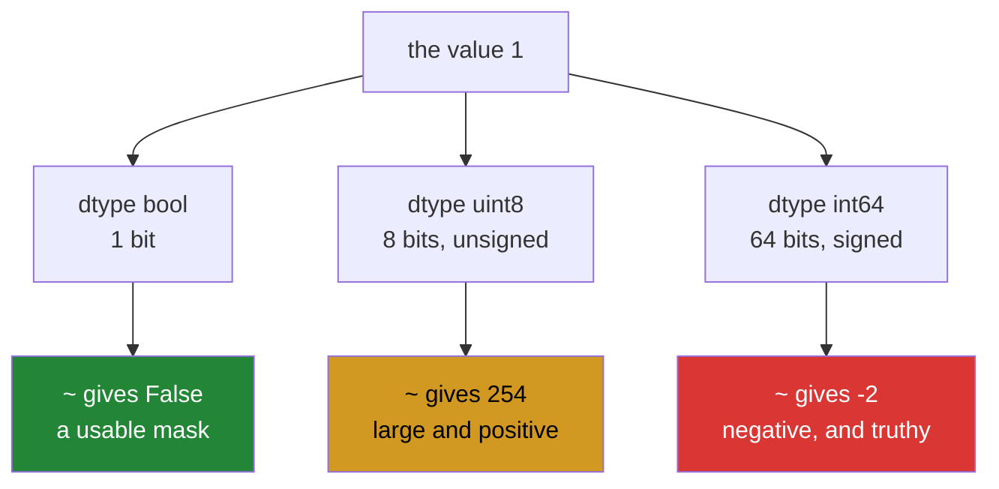

# 1.3 — `~` on a bool and `~` on an int — one symbol, two answers

## One-line answer

`~` flips every bit, which on a boolean array means "not" and on a signed integer array means
`-x - 1` — so the same character gives you a mask on one dtype and a negative number on the other, with
no warning either way.

---

## The story

Somebody wants the list of jobs nobody in the flat has done. They have the chart, so they take the row of
ticks and turn it inside out: every tick becomes a blank and every blank becomes a tick.

That works exactly as expected, and they get the answer.

The next week somebody has been keeping the chart as counts instead of ticks — how many times each job was
done, rather than whether it was done at all. A zero for the jobs nobody touched, a two for the bathroom.
They try the same trick to find the untouched jobs, turning the row inside out.

The answer comes back as a row of negative numbers. Minus one, minus three, minus one.

Nothing went wrong. "Turn it inside out" means one thing about a tick and something quite different about
a count, and the chart no longer said which kind it was.

---

## The idea in plain language

`~` is a single operation: **flip every bit**. What that produces depends entirely on the dtype it is
flipping, because the dtype decides both how many bits there are and how they are read back as a number.

**On a boolean array** there is one bit, and flipping it turns `True` into `False`. That is exactly what
"not" means, so `~mask` is the mask of everything the original did not select
([Day 21, 3.3](../../../day-21-indexing-and-views/parts/03-boolean-masks/3.3-and-or-not-and-why-and-raises.md)).
This is the case you have been using since Day 21 and it holds no surprises.

**On an unsigned integer array** every bit of the row flips, so `12` stored as `00001100` becomes
`11110011`, which as an unsigned eight-bit number is 243
([1.2](1.2-the-four-bitwise-ufuncs.md)). Large, positive, and slightly startling — but at least it is
recognisably "the row flipped".

**On a signed integer array** the same flip happens and the result is read as **two's complement**
([1.1](1.1-a-number-is-switches.md)), where the top bit being on means the number is negative. Flipping
`1` gives `-2`. Flipping `0` gives `-1`. In general `~x` is `-x - 1`, for any signed integer, and there is
a neat reason: flipping every bit and adding one is exactly how a machine negates a number, so flipping
alone lands one short of the negation.

That formula is the thing to remember, because it explains the symptom. Somebody expecting `~` to mean
"not" applies it to an array of counts and gets `-1` where the count was `0`. And `-1` is **truthy** in
every language that has a notion of truthiness, so a mask built that way selects everything.

Two more facts complete the picture, and both are the same trap from a different side.

Python's own `not` does **not** work on arrays at all. It demands a single yes-or-no and raises
`The truth value of an array with more than one element is ambiguous`
([Day 21, 3.3](../../../day-21-indexing-and-views/parts/03-boolean-masks/3.3-and-or-not-and-why-and-raises.md)).
So `~` is the only elementwise "not" available, which is why it gets used on things it should not be.

And `~` is not `-`. On an integer array `-x` negates and `~x` gives `-x - 1`. The two differ by exactly
one, which is small enough to look like a rounding problem and large enough to be wrong.

The defence is a rule rather than a memory aid: **`~` belongs on boolean arrays.** If the thing you are
flipping is not `dtype=bool`, either it should have been, or you wanted a comparison — `counts == 0` — and
not a bit flip at all.

---

## Why Setu needs it

- **[1.5](1.5-a-bitmask.md)** clears a flag with `flags & ~FLAG`, which is `~` on an integer used
  deliberately and correctly — the one place in the day where the integer meaning is the one you want.
- **Day 21's masks** are inverted with `~` constantly, and this document is why that is safe there and
  nowhere else
  ([Day 21, 3.3](../../../day-21-indexing-and-views/parts/03-boolean-masks/3.3-and-or-not-and-why-and-raises.md)).
- **Day 23's missing-value work** used `~np.isnan(x)` in almost every function
  ([Day 23, 2.5](../../../day-23-ufuncs-and-statistics/parts/02-statistics/2.5-the-nan-family.md)), which
  is safe because `isnan` returns booleans — and would not be if somebody replaced it with a count.
- **Day 76's filters** invert conditions constantly, and the bug below is one of the two most common ways
  a filter silently selects every row.
- **Day 91 onwards**, an all-selecting filter does not crash; it trains a model on the wrong subset, and
  the only evidence is a number that is slightly too good.

---

## The mechanism

The same operator on three dtypes:

```python
import numpy as np

as_bool = np.array([True, False, True])
as_uint = np.array([1, 0, 1], dtype=np.uint8)
as_int = np.array([1, 0, 1])

print("bool     :", as_bool, "->", ~as_bool)
print("uint8    :", as_uint, "->", ~as_uint)
print("int64    :", as_int, "->", ~as_int)
print("negate   :", as_int, "->", -as_int)
print("-x - 1   :", -as_int - 1)
print("matches ~:", np.array_equal(~as_int, -as_int - 1))
```

**Line by line:**

- Three arrays holding **the same information** — a yes, a no, a yes — in three dtypes. That is the point:
  nothing about the values distinguishes them, only the dtype does.
- `~as_bool` — `[False True False]`. The mask, inverted, as expected.
- `~as_uint` — `[254 255 254]`. Every bit of an eight-bit row flipped, read back as unsigned. `1` is
  `00000001`, so its flip is `11111110`, which is 254.
- `~as_int` — `[-2 -1 -2]`. The same flip on sixty-four bits, read back as signed. **Every one of these
  is truthy**, including the `-1` that came from the `0`, so using this as a mask selects everything.
- `-as_int` — `[-1 0 -1]`. Negation, which is a different operation and differs from `~` by exactly one.
- `np.array_equal(~as_int, -as_int - 1)` — `True`, which turns the rule from a claim into something you
  have watched hold.

```text
bool     : [ True False  True] -> [False  True False]
uint8    : [1 0 1] -> [254 255 254]
int64    : [1 0 1] -> [-2 -1 -2]
negate   : [1 0 1] -> [-1  0 -1]
-x - 1   : [-2 -1 -2]
matches ~: True
```

What `~` does to each dtype:



Now the failure as it actually happens, on the flat's chart kept as counts:

```python
import numpy as np

CHORES = np.array(
    ["bins", "hoover", "dishes", "bathroom", "shopping", "recycling", "windows", "post"]
)
times_done = np.array([3, 2, 4, 2, 3, 2, 3, 0])

untouched_right = CHORES[times_done == 0]
inverted = ~times_done
untouched_wrong = CHORES[inverted.astype(bool)]

print("times done   :", times_done)
print("~times_done  :", inverted)
print("as bool      :", inverted.astype(bool))
print("right answer :", untouched_right)
print("wrong answer :", untouched_wrong)
print("wrong count  :", untouched_wrong.size, "of", CHORES.size)
```

**Line by line:**

- `times_done` — the same chart as counts rather than ticks, with a single zero for the job nobody did.
  **This is the whole setup**: the data means the same thing and the dtype changed.
- `times_done == 0` — the correct way to ask "which were never done". A comparison produces a boolean array
  ([Day 21, 3.1](../../../day-21-indexing-and-views/parts/03-boolean-masks/3.1-a-comparison-makes-an-array.md)),
  which is what a mask has to be.
- `~times_done` — the bit flip on an `int64` array, giving `[-4 -3 -5 -3 -4 -3 -4 -1]`. Every value is
  negative, and none of them is `0`.
- `.astype(bool)` — the conversion somebody adds when the indexing complains. **Zero becomes `False` and
  everything else becomes `True`**, and since no value is zero, every entry becomes `True`.
- `untouched_wrong` — all eight chores, reported as never done. Seven of them were done between two and
  four times.
- `untouched_wrong.size` printed against `CHORES.size` — eight of eight. **A filter that selects
  everything is the shape of this bug**, and it is the number to watch for.

```text
times done   : [3 2 4 2 3 2 3 0]
~times_done  : [-4 -3 -5 -3 -4 -3 -4 -1]
as bool      : [ True  True  True  True  True  True  True  True]
right answer : ['post']
wrong answer : ['bins' 'hoover' 'dishes' 'bathroom' 'shopping' 'recycling' 'windows'
 'post']
wrong count  : 8 of 8
```

Note that the wrong answer **contains** the right one. Every job that was genuinely untouched is in the
list, along with all seven that were not, so a spot check of the first result confirms the bug rather than
finding it.

---

## When it breaks

**Using `not` on an array:**

```text
$ uv run python -c "
import numpy as np
mask = np.array([True, False, True])
print(not mask)
"
Traceback (most recent call last):
  File "<string>", line 4, in <module>
ValueError: The truth value of an array with more than one element is ambiguous. Use a.any() or a.all()
```

**What it means.** `not` needs one yes-or-no and there are three. The message suggests `any()` or `all()`,
which is right when you genuinely want one answer about the whole array and wrong when you want an
elementwise inverse — and it is the suggestion that sends people to `~`, which is where this document's
trouble starts. **When the message appears, decide first whether you want one answer or many**; only then
pick between `.any()` and `~`.

**A negative index from an inverted integer:**

```text
$ uv run python -c "
import numpy as np
CHORES = np.array(['bins', 'hoover', 'dishes', 'bathroom', 'shopping', 'recycling', 'windows', 'post'])
counts = np.array([3, 0, 2, 1, 4, 2, 3, 0])
print('~counts :', ~counts)
print(CHORES[~counts])
"
~counts : [-4 -1 -3 -2 -5 -3 -4 -1]
['shopping' 'post' 'recycling' 'windows' 'bathroom' 'recycling' 'shopping'
 'post']
```

**What it means.** No error, and a completely fabricated answer of exactly the right length. An integer
array is used as **positions**, not as a mask
([Day 21, 4.1](../../../day-21-indexing-and-views/parts/04-fancy-indexing/4.1-a-list-of-positions.md)),
and negative positions count from the end, so `-1` is `post` and `-4` is `shopping`. Eight real chore
names, none of them the answer, and `recycling` appearing twice. This is worse than the all-selecting
version above, because the result is the right length and contains no obviously wrong value, so a shape
assertion downstream passes and a spot check looks plausible.

The lucky version of this bug is a short array, where the negative index runs off the front:

```text
$ uv run python -c "
import numpy as np
CHORES = np.array(['bins', 'hoover', 'dishes'])
print(CHORES[~np.array([3, 0, 2])])
"
Traceback (most recent call last):
  File "<string>", line 4, in <module>
IndexError: index -4 is out of bounds for axis 0 with size 3
```

Three chores, and `~3` is `-4`, which is one past the front. **The small array raises and the large one
does not**, which is the opposite of how people expect bugs to behave and is why a fixture cannot be
relied on to find this.

**`~` where `-` was meant:**

```text
$ uv run python -c "
import numpy as np
scores = np.array([3, 0, -2])
print('negate :', -scores)
print('flip   :', ~scores)
print('differ by:', (-scores) - (~scores))
"
negate : [-3  0  2]
flip   : [-4 -1  1]
differ by: [1 1 1]
```

**What it means.** They differ by exactly one, everywhere, always — which is the worst possible size for
an error. Too small to look like a bug, too large to be a rounding issue. If a sign-flipped array is off
by one in every position, this is the reason, and the fix is a single character.

---

## In production

**What a professional writes instead of the teaching version.** The inversion is a named function that
refuses anything that is not a mask:

```python
from __future__ import annotations

import numpy as np


def invert(mask: np.ndarray) -> np.ndarray:
    """The elementwise NOT of a boolean mask.

    Refuses non-boolean input. ``~`` on an integer array is a bit flip giving ``-x - 1``,
    which is truthy for every value including zero, so an accidental integer mask selects
    every row instead of none.
    """
    if mask.dtype != np.bool_:
        raise TypeError(
            f"invert expects a boolean mask, got dtype {mask.dtype}; "
            f"did you mean a comparison such as (arr == 0)?"
        )
    return ~mask


def none_of(values: np.ndarray, target: object) -> np.ndarray:
    """Mask of the entries that do NOT equal ``target``. No ~ at the call site."""
    return values != target
```

**Line by line:**

- `mask.dtype != np.bool_` — **the single check this whole document argues for**. It costs one comparison
  and removes the class of bug entirely, because every wrong use of `~` starts with a non-boolean array.
- The error message ending in a question — *"did you mean a comparison such as `(arr == 0)`?"* This is the
  actual fix in the actual case, and an error that names the fix saves the reader a search. Compare it
  with what NumPy would have said, which is nothing at all.
- `np.bool_` rather than `bool` — NumPy's boolean type, which is what an array's dtype actually is
  ([Day 20, 2.1](../../../day-20-arrays-and-dtypes/parts/02-dtypes/2.1-a-dtype-is-a-promise.md)).
- `none_of` existing at all — **the better answer is usually to not invert**. `values != target` is one
  operation producing a correct mask directly, where `~(values == target)` is two operations, one
  allocation more, and an opportunity to get the dtype wrong. Most `~` in a codebase can be pushed into
  the comparison it inverts.
- Returning `~mask` rather than `np.logical_not(mask)` — identical on booleans, and `~` is what everybody
  reads. The function's value is the guard in front of it, not the operator behind it.

**What changes at scale.** The operator costs nothing; what changes is how the mistake presents. On a
fifty-row fixture an all-selecting filter returns fifty rows and looks like a filter that matched
generously. On a hundred-million-row table it returns the whole table, and the symptom is not a wrong
answer but an out-of-memory kill or a job that runs for hours — which sends everybody looking at
infrastructure rather than at a single character. Two habits follow. Assert the selectivity of any filter
whose job is to reduce: if `mask.sum() == mask.size` in production data, that is almost never a real
filter, and it is worth logging. And prefer the comparison to the inversion, because `values != target`
cannot be dtype-confused while `~something` can.

**The failure that only appears with real data.** A training pipeline excluded flagged rows with
`~flags`, where `flags` was an integer column of `0` and `1` loaded from a CSV. Because
`~0` is `-1` and `~1` is `-2`, both truthy, the exclusion selected everything and the flagged rows were
kept. Model accuracy went **up**, because the flagged rows were duplicates that made the test set easier,
and the change was celebrated. It was found four months later when the model performed far worse in
production than in evaluation. **A bug that improves your metric is the hardest kind to find**, and the
one-line fix was `flags.astype(bool)` at the point the CSV was read.

**The review comment a senior engineer leaves.** *"`~flags` — is `flags` a boolean array? If it is an
integer column this inverts the bits and every value comes out truthy, so the filter keeps everything.
Please write `flags == 0` instead, or cast at the boundary where the file is read."*

**The interview question.** *"What does `~` do in NumPy?"* It flips every bit, and what that means depends
on the dtype: on a boolean array it is elementwise `not`, on an unsigned integer it gives the flipped row
read as a large positive number, and on a signed integer it gives `-x - 1`. The consequence worth leading
with is that `~` on an integer array of zeros and ones produces `-1` and `-2`, both of which are truthy,
so a mask built that way selects every row rather than none — and it does not raise, so on a small fixture
it looks like a generous filter. Two more details: used as an index rather than a mask, those negative
values count from the end of the array and return plausible wrong elements at the right length; and `~x`
differs from `-x` by exactly one, which is a nasty size for an error. The habit is to guard on
`dtype == np.bool_`, and better still to push the inversion into the comparison — `values != target`
rather than `~(values == target)`.

---

## Check yourself

```bash
uv run python -c "
import numpy as np
counts = np.array([3, 2, 0, 1])
print('~counts        :', ~counts)
print('as bool        :', (~counts).astype(bool))
print('selects        :', (~counts).astype(bool).sum(), 'of', counts.size)
print('correct mask   :', counts == 0)
print('correct selects:', (counts == 0).sum(), 'of', counts.size)
print('~x == -x - 1   :', np.array_equal(~counts, -counts - 1))
print('on a real mask :', ~(counts == 0))
"
```

Two of those lines report how many rows a filter keeps. Say which number tells you immediately that a
filter is broken, and why the same number on a four-row fixture would not.

**Answer out loud, without scrolling up:**

> Somebody writes `~flags` where `flags` is an integer column of ones and zeros. Say exactly what the
> filter does, why nothing raises, and what one word in a guard clause would have stopped it.

---

**Next:** [1.4 — `<<` and `>>`, and the bit that fell off the end](1.4-shifts-and-the-bit-that-fell-off.md).
