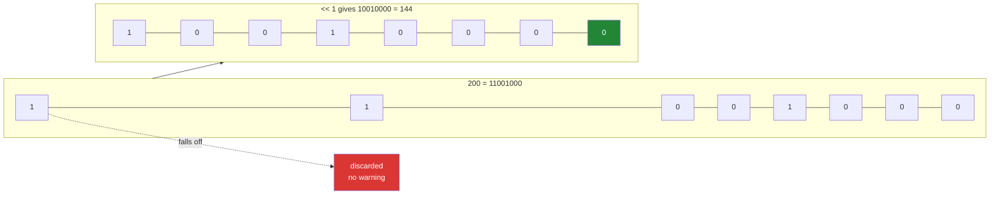

# 1.4 — `<<` and `>>` — shifting, and the bit that fell off the end

## One-line answer

`x << n` slides every bit `n` places to the left and `x >> n` slides them right — which multiplies or
divides by two each time, and quietly loses whatever slides off the end of the fixed-width row.

---

## The story

Somebody in the flat is writing the chore chart out again, and to make room at the right-hand end for a
new job they shift every existing tick one column to the left.

Everything moves along. There is a fresh empty column on the right for the new job, which is exactly what
they wanted.

But the chart only has eight columns. The tick that was in the leftmost column has nowhere to go, so it
slides off the edge of the paper and is gone. Nobody wrote it down anywhere; it simply stopped existing.

They do not notice, because seven of the eight columns look right and the missing one was the job that
happened to be at the far end. The chart is now quietly wrong, and there is no mark on the paper to say
so.

---

## The idea in plain language

A **shift** moves every bit of a row a fixed number of positions. `<<` moves them **left** and `>>` moves
them **right**. Positions vacated at the far end are filled with zeros, and positions that move past the
edge are discarded.

Because each position in a binary row is worth twice the one to its right
([1.1](1.1-a-number-is-switches.md)), shifting has an arithmetic meaning as well as a physical one.
Shifting left by one **doubles** the number; shifting left by `n` multiplies by `2ⁿ`. Shifting right by
one **halves** it, discarding any remainder.

That is why `1 << 3` is 8, and why the flag constants in
[1.5](1.5-a-bitmask.md) are written as `1 << 0`, `1 << 1`, `1 << 2`: each one is a single bit, in a
position the shift names directly.

Two things about shifts catch people out, and both come from the row being a **fixed width**.

**Left shifts lose the top bits.** A `uint8` has eight positions. Shift a value whose top bit is set and
that bit is gone — not wrapped, not warned about, gone. This is the same overflow you met on Day 20
([Day 20, 2.2](../../../day-20-arrays-and-dtypes/parts/02-dtypes/2.2-integers-and-the-silent-wrap.md)),
arriving through a different door.

**Right shifts lose the bottom bits**, which is the same thing as integer division discarding a
remainder. `5 >> 1` is 2, not 2.5, because there is nowhere for the half to live.

There is one more wrinkle, and it is the one that separates people who have used shifts from people who
have read about them. On a **signed** integer, `>>` is an *arithmetic* shift: it copies the sign bit into
the vacated positions rather than filling with zeros, so shifting a negative number right keeps it
negative. That makes `>>` behave as division rounding **towards negative infinity**, which is what Python's
`//` does and is *not* what truncation does. `-5 >> 1` is `-3`, while `int(-5 / 2)` is `-2`. If you have
ever seen an off-by-one in code that used a shift as a fast divide, this is where it came from.

Finally, the arithmetic reading is the reason shifts survive at all. Modern compilers already turn `x * 8`
into a shift, so writing the shift yourself buys no speed and costs readability. **Use `<<` when you mean
"bit position" and `*` when you mean "multiply."** The one place the shift is genuinely clearer is a flag
constant, and that is [1.5](1.5-a-bitmask.md).

---

## Why Setu needs it

- **[1.5](1.5-a-bitmask.md)** defines every flag as `1 << n`, so the constants say which bit they are
  rather than which number they equal.
- **[1.6](1.6-packbits.md)** is shifting done in bulk by a library call, and knowing what the library is
  doing is what makes its `count=` argument comprehensible.
- **Day 20's overflow** is the same failure with a different operator, and meeting it twice is how it
  stops being a surprise
  ([Day 20, 2.2](../../../day-20-arrays-and-dtypes/parts/02-dtypes/2.2-integers-and-the-silent-wrap.md)).
- **Day 155's quantised embeddings** pack several small values into one integer by shifting each into its
  own range of bits, which is exactly the operation here at a larger width.
- **Day 42's SQL phase** meets the same shift operators in Postgres, with the same overflow behaviour and
  the same fixed-width columns.

---

## The mechanism

Both directions, on a width small enough to lose something:

```python
import numpy as np

v = np.array([1, 3, 200], dtype=np.uint8)


def rows(arr: np.ndarray) -> list[str]:
    return [np.binary_repr(int(x), width=8) for x in arr]


print("v         :", v, rows(v))
print("v << 1    :", v << 1, rows(v << 1))
print("v >> 1    :", v >> 1, rows(v >> 1))
print("as int64  :", v.astype(np.int64) << 1)
print("v << 8    :", v << np.uint8(8))
print("5 << 3    :", np.int64(5) << 3, " and 5 * 8 =", 5 * 8)
print("5 >> 1    :", np.int64(5) >> 1, " and 5 // 2 =", 5 // 2)
```

**Line by line:**

- `dtype=np.uint8` — eight positions, chosen so that the loss is visible. On the default `int64` the same
  values would shift for another fifty-six positions before anything fell off, which is why this bug is
  invisible in casual experiments.
- `200` in the array — `11001000`, with its top bit set. **That top bit is the one about to be lost.**
- `v << 1` — `[2 6 144]`. The first two doubled as expected. 200 did not become 400; it became 144,
  because `11001000` shifted left is `110010000`, which is nine bits, and the eighth-and-beyond is
  discarded leaving `10010000`.
- `v >> 1` — `[0 1 100]`. The `1` became `0`, because its only bit slid off the right-hand end. Halving an
  odd number the same way loses the remainder: `3 >> 1` is `1`.
- `v.astype(np.int64) << 1` — `[2 6 400]`. **The same shift, the correct answer**, because sixty-four
  positions leave room. The dtype was the entire difference.
- `v << np.uint8(8)` — shifting by the full width gives all zeros. Every bit has slid off. On some
  languages shifting by the width or more is undefined behaviour; NumPy gives zeros, which is at least
  predictable, and neither is what anybody wanted.
- `5 << 3` printed beside `5 * 8` — the same answer, which is the arithmetic reading. Writing `x * 8` is
  clearer for a reader and just as fast, and the shift form is reserved for when the *position* is the
  point.
- `5 >> 1` beside `5 // 2` — also the same answer, and the agreement is exact for positive numbers only.
  The failure block below is where they part company.

```text
v         : [  1   3 200] ['00000001', '00000011', '11001000']
v << 1    : [  2   6 144] ['00000010', '00000110', '10010000']
v >> 1    : [  0   1 100] ['00000000', '00000001', '01100100']
as int64  : [  2   6 400]
v << 8    : [0 0 0]
5 << 3    : 40  and 5 * 8 = 40
5 >> 1    : 2  and 5 // 2 = 2
```

Look at the third row of bits. `11001000` became `10010000` — read it carefully and you can see the
leading `1` has gone and a `0` has appeared at the right. Seven of the eight positions are exactly what a
shift should produce.

The row, sliding:



The green box on the right is the zero that was shifted in; the red box is the bit that left. **Only one
of the two is visible in the answer.**

Now the shift used as it should be — naming bit positions for the flat's chores:

```python
import numpy as np

CHORES = ["bins", "hoover", "dishes", "bathroom", "shopping", "recycling", "windows", "post"]
BIT = {name: 1 << position for position, name in enumerate(CHORES)}

print("bit values :", BIT)
print("dishes     :", BIT["dishes"], np.binary_repr(BIT["dishes"], width=8))
print("post       :", BIT["post"], np.binary_repr(BIT["post"], width=8))
print("all eight  :", sum(BIT.values()), np.binary_repr(sum(BIT.values()), width=8))
print("a ninth?   :", 1 << 8, "needs", len(np.binary_repr(1 << 8)), "bits")
```

**Line by line:**

- `{name: 1 << position for ...}` — a dictionary comprehension building the constants from the list, so
  the bit positions and the names cannot drift apart
  ([Day 9, 2.1](../../../day-09-comprehensions/parts/02-dict-set-gen/2.1-dict-comprehensions.md)).
- `enumerate(CHORES)` — position and name together, which is what makes `1 << position` read as "the bit
  for this chore" ([Day 6, 1.3](../../../day-06-loops/parts/01-iteration/1.3-enumerate-and-zip.md)).
- `BIT["dishes"]` — `4`, which is `00000100`: the third chore, so bit 2. **The shift is the only spelling
  where the position and the constant are the same character**, which is why flag tables are written this
  way rather than as `1, 2, 4, 8`.
- `sum(BIT.values())` — 255, every bit set, which is the check that eight single-bit constants tile an
  eight-bit row exactly with no overlaps and no gaps. A duplicated position would make this sum smaller.
- `1 << 8` — 256, needing nine bits. **This is where the design runs out**: a ninth chore does not fit in
  a `uint8`, and finding that out from a shift is better than finding it out from a value that wrapped to
  zero.

```text
bit values : {'bins': 1, 'hoover': 2, 'dishes': 4, 'bathroom': 8, 'shopping': 16, 'recycling': 32, 'windows': 64, 'post': 128}
dishes     : 4 00000100
post       : 128 10000000
all eight  : 255 11111111
a ninth?   : 256 needs 9 bits
```

---

## When it breaks

**A negative shift:**

```text
$ uv run python -c "
import numpy as np
v = np.array([1, 3, 200], dtype=np.uint8)
print(v >> -1)
"
Traceback (most recent call last):
  File "<string>", line 4, in <module>
OverflowError: Python integer -1 out of bounds for uint8
```

**What it means.** Shifting by a negative amount is not "shift the other way"; it is not defined at all.
The message is about the dtype rather than about the shift, because NumPy first tries to make `-1` into a
`uint8` to match the array and cannot
([Day 20, 2.5](../../../day-20-arrays-and-dtypes/parts/02-dtypes/2.5-nep-50-and-the-python-number.md)).
This happens when the shift amount is computed — `x >> (target_bits - actual_bits)` — and the subtraction
comes out negative for an input nobody tested with. **Compute shift amounts with an explicit guard**, not
with a subtraction you assume is positive.

**A right shift on a negative number:**

```text
$ uv run python -c "
import numpy as np
s = np.array([-8, 8], dtype=np.int8)
print('values  :', s, [np.binary_repr(int(x), 8) for x in s])
print('s >> 1  :', s >> 1, [np.binary_repr(int(x), 8) for x in s >> 1])
print('-5 >> 1 :', np.int64(-5) >> 1)
print('-5 // 2 :', -5 // 2)
print('int(-5/2):', int(-5 / 2))
"
values  : [-8  8] ['11111000', '00001000']
s >> 1  : [-4  4] ['11111100', '00000100']
-5 >> 1 : -3
-5 // 2 : -3
int(-5/2): -2
```

**What it means.** Look at the vacated top position of `11111000`: it was filled with a `1`, not a `0`.
That is an **arithmetic** shift, copying the sign bit so the number stays negative — without it, `-8 >> 1`
would have become a large positive number. The consequence is the last three lines: `>>` on a negative
value rounds **towards negative infinity**, agreeing with Python's `//` and disagreeing with truncation by
one. Code that uses `>> 1` as a fast halve and is tested only on positive numbers will be off by one for
every negative input, silently.

**Shifting by the width, or past it:**

```text
$ uv run python -c "
import numpy as np
v = np.array([1, 3, 200], dtype=np.uint8)
print('<< 7 :', v << np.uint8(7))
print('<< 8 :', v << np.uint8(8))
print('<< 9 :', v << np.uint8(9))
"
<< 7 : [128 128   0]
<< 8 : [0 0 0]
<< 9 : [0 0 0]
```

**What it means.** By seven places, `1` and `3` have both collapsed to `128` — they have lost every bit
except one, and two different inputs now give the same output. By eight, everything is zero. NumPy's
behaviour here is at least consistent, but the same expression in C is **undefined behaviour** and in
Python's own integers would give a huge number rather than zero, because Python integers have no fixed
width at all. **A shift amount that can reach the dtype's width is a bug in the calling code**, and the
guard is `assert 0 <= n < np.iinfo(dtype).bits`.

---

## In production

**What a professional writes instead of the teaching version.** The width is checked, and the shift is
never used where multiplication was meant:

```python
from __future__ import annotations

import numpy as np


def bit_for(position: int, dtype: np.dtype = np.dtype(np.uint8)) -> np.integer:
    """A single-bit value at ``position``, checked against the dtype's width.

    Raises rather than returning 0 for a position the dtype cannot hold, because a silent
    0 is a flag that can never be set and never be tested for.
    """
    width = np.iinfo(dtype).bits
    if not 0 <= position < width:
        raise ValueError(f"bit {position} does not exist in {dtype} ({width} bits wide)")
    return dtype.type(1) << dtype.type(position)


def widen_for_shift(values: np.ndarray, places: int) -> np.ndarray:
    """Copy ``values`` into a dtype wide enough that ``<< places`` loses nothing."""
    needed = int(np.ceil(np.log2(values.max() + 1))) + places if values.size else places
    for candidate in (np.uint8, np.uint16, np.uint32, np.uint64):
        if needed <= np.iinfo(candidate).bits:
            return values.astype(candidate)
    raise OverflowError(f"shifting by {places} needs {needed} bits; no NumPy integer is that wide")
```

**Line by line:**

- `bit_for` taking the dtype as an argument with a default — the width is a property of where the flag
  will be **stored**, not of the code that computes it, so the caller who knows the column type is the one
  who states it.
- `np.iinfo(dtype).bits` — the width read from the dtype rather than written as `8`. Change the storage to
  `uint16` and the guard follows without an edit
  ([1.1](1.1-a-number-is-switches.md)).
- `raise` rather than returning `0` — **the important decision**. `1 << 8` in a `uint8` gives zero, and a
  flag whose value is zero can be set with `|` and tested with `&` and will silently do nothing in both
  cases. That is a flag that exists in the code and not in the data.
- `dtype.type(1) << dtype.type(position)` — both operands in the target dtype, so the shift happens at the
  intended width rather than in Python's unbounded integers and then being cast back.
- `widen_for_shift` computing `needed` from the actual maximum — `np.log2` of the largest value gives how
  many bits it currently occupies, and adding `places` gives how many it will need. **This is the check
  the failure blocks above are all about**, done arithmetically instead of by hope.
- The `for candidate in (...)` loop — the smallest dtype that fits, so widening costs the least memory it
  can. Jumping straight to `uint64` would work and would octuple the array.
- `values.astype(candidate)` — a copy, deliberately, so the caller's array is untouched
  ([Day 20, 2.4](../../../day-20-arrays-and-dtypes/parts/02-dtypes/2.4-astype-and-the-copy.md)). Shifting
  in place into a too-narrow dtype is the bug this function exists to prevent.

**What changes at scale.** Shifts are single processor instructions, so speed is never the issue — the
issue is that widening to avoid overflow doubles or quadruples the memory. On a billion-row column,
`uint8` to `uint32` is three extra gigabytes, which makes the width a real design decision rather than a
formality: it is worth knowing the true maximum before choosing. The related production use is **packing
several small numbers into one integer** — a category in the top eight bits, a score in the next twelve —
which is done with shifts and masks and is how a compact index entry is built. That trick trades memory
for the cost of unpacking on every read, and it is worth it exactly when the data is large enough that
memory bandwidth, not arithmetic, is the bottleneck. It is also how quantised embeddings are stored on
Day 155.

**The failure that only appears with real data.** A message format packed a version number and a length
into one `uint16`, with the version shifted left by twelve. It worked for years with versions 1 to 15.
Version 16 was released, `16 << 12` overflowed the sixteen bits, the version field read back as zero, and
every consumer treated the new messages as the oldest format. The messages were not rejected — they were
**misinterpreted**, which took far longer to diagnose than a rejection would have.

**The review comment a senior engineer leaves.** *"`counts << 4` on a `uint8` column — the maximum here is
already 40, so this loses the top two bits for anything above 15. Either widen to `uint16` first or use
`counts * 16` with a range assertion, and please say which of the two you mean."*

**The interview question.** *"What does `x << 3` do, and when would you use it?"* It slides every bit three
places left, filling with zeros, which multiplies by eight — and anything that slides off the fixed-width
end is discarded with no warning, so on a `uint8` it silently overflows for any value above 31. The place
it is genuinely the right spelling is a flag constant, `1 << n`, because there the bit *position* is the
meaning; for arithmetic, `x * 8` is clearer and a compiler produces the same instruction. The detail that
shows experience is the signed right shift: `>>` copies the sign bit into the vacated positions, so it
rounds towards negative infinity rather than truncating, which makes `-5 >> 1` equal to `-3` where
`int(-5 / 2)` is `-2` — an off-by-one that only appears once negative values reach the code. And shifting
by the dtype's width or more gives zero in NumPy, is undefined behaviour in C, and gives a huge number in
Python's unbounded integers, so a computed shift amount needs a guard.

---

## Check yourself

```bash
uv run python -c "
import numpy as np
v = np.array([1, 3, 200], dtype=np.uint8)
r = lambda a: [np.binary_repr(int(x), 8) for x in a]
print('v      :', v, r(v))
print('v << 1 :', v << 1, r(v << 1))
print('wide   :', v.astype(np.uint16) << 1)
print('v >> 1 :', v >> 1)
print('1 << 3 :', 1 << 3, ' 1 * 8 =', 1 * 8)
print('-5 >> 1:', np.int64(-5) >> 1, ' -5 // 2 =', -5 // 2, ' int(-5/2) =', int(-5 / 2))
print('bits   :', np.iinfo(np.uint8).bits)
"
```

The second and third lines shift the same values and disagree about one of them. Say which value, why, and
what single word in the third line prevented it.

**Answer out loud, without scrolling up:**

> `-5 >> 1` gives `-3` and `int(-5 / 2)` gives `-2`. Say which of the two a shift performs, what the
> vacated top bit is filled with on a signed integer, and when that difference would first show up in a
> codebase.

---

**Next:** [1.5 — a bitmask, many yes-or-no answers in one integer](1.5-a-bitmask.md).
