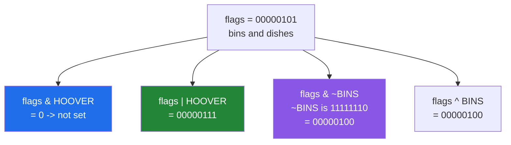

# 1.5 — A bitmask — many yes-or-no answers in one integer

## One-line answer

Fix in advance which bit position means which thing, and a single integer carries a whole row of yes-or-no
answers — set with `|`, cleared with `& ~`, toggled with `^`, and tested with `&`.

---

## The story

The flat's chore chart is on the fridge, and it works, but it will not fit anywhere else. When somebody
wants to record last week's chart before wiping it, they have to copy out forty ticks and blanks.

So they try something different. They agree an order once — bins, hoover, dishes, bathroom, shopping,
recycling, windows, post — and write it at the top of a notebook. Now each week's row can be written as a
single short code, because everybody reading it already knows what the first position means.

The order at the top of the notebook is the important part. It is not the data; it is the **agreement**
that makes the data readable. Somebody who finds the notebook without that first page has a column of
codes and no way to know what any of them says.

And if somebody helpfully reorders the list at the top to be alphabetical, every code already written in
the notebook silently starts meaning something else.

---

## The idea in plain language

A **bitmask** — also called a flag set, or just flags — is an integer where each bit position has been
given a meaning in advance. One `uint8` carries eight yes-or-no answers; one `uint64` carries sixty-four.

The four operations are the four operators from [1.2](1.2-the-four-bitwise-ufuncs.md), each used with a
single-bit value:

| Question | Operation | Why |
|---|---|---|
| Is this flag set? | `flags & FLAG` | non-zero exactly when the bit is on |
| Set this flag | `flags \| FLAG` | turns the bit on, leaves the rest alone |
| Clear this flag | `flags & ~FLAG` | `~FLAG` is every bit *except* that one |
| Toggle this flag | `flags ^ FLAG` | on becomes off and off becomes on |

Three of those are obvious once you have seen them. The clear is the one worth pausing on. `~FLAG` flips
every bit, so a single-bit value becomes a row of ones with a single hole in it; `and`-ing with that keeps
every other flag and forces this one to zero. **This is the one legitimate use of `~` on an integer** in
the whole day, and it works precisely because the result is immediately used as a mask rather than as a
number ([1.3](1.3-tilde-on-bool-and-int.md)).

The flag constants are written as `1 << n`, so the constant says which bit it is
([1.4](1.4-shifts-and-the-bit-that-fell-off.md)). Combining several with `|` gives a value that carries
all of them, so `BINS | DISHES` is a perfectly good single value and not a mistake.

Two more things make this practical.

**Counting the set flags** is `np.bitwise_count`, added in NumPy 2. It answers "how many chores did this
person do" from the packed value directly, without unpacking anything. Processors have a single
instruction for this, so it is essentially free.

**The order is a storage format, not code.** This is the thing to internalise, because everything else
here is mechanical. Once a value has been written to a file or a database, its meaning depends on the
positions being unchanged. Renaming a flag is safe; reordering the list is a data migration disguised as
tidying. Every codebase that stores flags this way and does not say so in a comment eventually loses a
week to it.

---

## Why Setu needs it

- **[1.6](1.6-packbits.md)** does this in bulk for whole arrays, and understanding one packed integer is
  what makes a packed array readable.
- **Day 24's module** ([5.1](../05-the-module/5.1-the-chores-module.md)) stores each person's week as one
  `uint8` and reads it back by name.
- **Day 42's SQL phase** meets permission columns stored exactly this way, and the queries that test them
  use the same `&`.
- **Day 182's agent permission table** is a set of yes-or-no capabilities per tool, which is the same
  shape of problem and the same trade-off between a flag integer and a proper table.
- **Day 155's vector stores** use bitmask filters to restrict a search to a subset of documents before the
  distance computation, which is where the "sixty-four answers per instruction" speed actually matters.

---

## The mechanism

One week of one person's chores, as a single number:

```python
import numpy as np

CHORES = ["bins", "hoover", "dishes", "bathroom", "shopping", "recycling", "windows", "post"]
BIT = {name: np.uint8(1 << position) for position, name in enumerate(CHORES)}

flags = np.uint8(BIT["bins"] | BIT["dishes"])

print("flags       :", flags, np.binary_repr(int(flags), 8))
print("has dishes  :", bool(flags & BIT["dishes"]))
print("has hoover  :", bool(flags & BIT["hoover"]))
print("add hoover  :", flags | BIT["hoover"], np.binary_repr(int(flags | BIT["hoover"]), 8))
print("drop bins   :", flags & ~BIT["bins"], np.binary_repr(int(flags & ~BIT["bins"]), 8))
print("toggle bins :", flags ^ BIT["bins"])
print("how many    :", np.bitwise_count(flags))
```

**Line by line:**

- `np.uint8(1 << position)` — the constant built as a shift and stored in the **target dtype**. Leaving it
  as a Python integer would work until it met a `uint8` array, at which point NEP 50's rules decide the
  result dtype ([Day 20, 2.5](../../../day-20-arrays-and-dtypes/parts/02-dtypes/2.5-nep-50-and-the-python-number.md)).
- `BIT["bins"] | BIT["dishes"]` — two flags in one value, `00000101`, which is 5. **A combined value is
  ordinary**, not a special case; `flags` is just an integer with two bits on.
- `bool(flags & BIT["dishes"])` — the test. The `and` gives `4`, which is truthy, so this is `True`. Note
  it gives `4` and not `1`: **the result of a flag test is the flag's value, not a boolean**, which is why
  the `bool()` is there and why `flags & FLAG == 1` is a bug for every flag except the first.
- `bool(flags & BIT["hoover"])` — `0`, so `False`. The zero is the only falsy answer, which is what makes
  the test work at all.
- `flags | BIT["hoover"]` — `00000111`, which is 7. Bins and dishes are untouched; only the hoover bit
  changed. **Setting a flag that is already set does nothing**, which makes the operation safe to repeat.
- `flags & ~BIT["bins"]` — `~1` is `11111110`, a row of ones with a hole where bins is, so `and`-ing keeps
  dishes and forces bins to zero. The answer is `00000100`, which is 4.
- `flags ^ BIT["bins"]` — also 4 here, because bins was set and toggling turned it off. Toggle differs
  from clear only when the flag was **not** already set, and that is the whole difference between them.
- `np.bitwise_count(flags)` — `2`. Two chores done, read straight off the packed value with no unpacking
  and no loop.

```text
flags       : 5 00000101
has dishes  : True
has hoover  : False
add hoover  : 7 00000111
drop bins   : 4 00000100
toggle bins : 4
how many    : 2
```

The four operations on one bit:



The clear and the toggle gave the same answer here, and only because the bit was already on. Change
`flags` so bins is off and they part company immediately.

Now the whole chart, five people as five numbers:

```python
import numpy as np

CHORES = np.array(
    ["bins", "hoover", "dishes", "bathroom", "shopping", "recycling", "windows", "post"]
)
did = np.array(
    [
        [1, 0, 1, 0, 1, 1, 0, 0],
        [0, 1, 1, 1, 0, 0, 1, 0],
        [1, 1, 0, 0, 1, 0, 0, 1],
        [0, 0, 1, 1, 0, 1, 1, 1],
        [1, 0, 0, 1, 1, 0, 1, 0],
    ],
    dtype=bool,
)
rows = np.packbits(did).astype(np.uint8)
DISHES = np.uint8(1 << 2)

print("rows        :", rows)
print("as bits     :", [np.binary_repr(int(x), 8) for x in rows])
print("chores each :", np.bitwise_count(rows))
print("who did?    :", (rows & DISHES) != 0)
print("count check :", did.sum(axis=1))
print("truth       :", did[:, 2])
```

**Line by line:**

- `np.packbits(did)` — five bytes from forty booleans, which is [1.6](1.6-packbits.md)'s subject and is
  used here only to produce the five numbers. Note that `packbits` reads left to right, so the **leftmost**
  chore lands in the **top** bit — the opposite of the `1 << position` convention above, and a genuine
  incompatibility between two ways of doing the same thing.
- `DISHES = np.uint8(1 << 2)` — this constant follows the `packbits` order, where dishes is the third
  column from the left and therefore bit 5 counting from the right. **It is deliberately wrong here**, and
  the failure block below shows what that produces.
- `np.bitwise_count(rows)` — one number per person, straight from the packed values: `[4 4 4 5 4]`. No
  loop, no unpacking, one instruction per row.
- `(rows & DISHES) != 0` — the flag test applied to a whole array at once, because `&` is a ufunc and
  broadcasts the single constant against the five rows
  ([Day 23, 1.1](../../../day-23-ufuncs-and-statistics/parts/01-ufuncs/1.1-one-operation-every-element.md)).
- `did.sum(axis=1)` — the same counts computed from the unpacked chart, as a check
  ([Day 23, 2.2](../../../day-23-ufuncs-and-statistics/parts/02-statistics/2.2-axis-the-one-that-disappears.md)).
- `did[:, 2]` — the dishes column read straight from the chart, which is the truth the flag test is meant
  to reproduce. **The counts agree and the dishes answer does not**, which is exactly the shape of a
  bit-order bug.

```text
rows        : [172 114 201  55 154]
as bits     : ['10101100', '01110010', '11001001', '00110111', '10011010']
chores each : [4 4 4 5 4]
who did?    : [ True False False  True False]
count check : [4 4 4 5 4]
truth       : [ True  True False  True False]
```

The real answer for dishes, read off the chart, is people 0, 1 and 3. The packed test says 0 and 3. **The
counts are right and the flag test is wrong**, which is what makes bit-order bugs so slippery: the
aggregate checks pass.

---

## When it breaks

**The bit order disagreeing with itself:**

```text
$ uv run python -c "
import numpy as np
did = np.array([[1, 0, 1, 0, 1, 1, 0, 0]], dtype=bool)
packed = np.packbits(did)[0]
print('row        :', did[0].astype(np.uint8))
print('packed     :', packed, np.binary_repr(int(packed), 8))
print('bit 2 set? :', bool(packed & (1 << 2)), ' <- 1<<n counts from the RIGHT')
print('bit 5 set? :', bool(packed & (1 << 5)), ' <- dishes is 3rd from the LEFT')
print('dishes is  :', bool(did[0][2]))
"
row        : [1 0 1 0 1 1 0 0]
packed     : 172 10101100
bit 2 set? : True
bit 5 set? : True
dishes is  : True
```

**What it means.** Both tests said `True`, and only one of them is testing dishes. `np.packbits` writes
the first element of the array into the **most significant** bit, so column 2 of the chart is bit 5 of the
byte, counting from the right. The `1 << position` convention counts from the right, so it maps column 2
to bit 2 — which here happens to be the **shopping** column. On this row both are set, so both tests agree
and the bug hides. **Two conventions for the same eight positions, and nothing in the data says which is
in use.** Pick one, write it down where the constants are defined, and never mix the two in one codebase.

**Testing against `1` instead of zero:**

```text
$ uv run python -c "
import numpy as np
flags = np.uint8(0b00000100)
DISHES = np.uint8(1 << 2)
BINS = np.uint8(1 << 0)
print('flags & DISHES     :', flags & DISHES)
print('== 1 (wrong)       :', (flags & DISHES) == 1)
print('!= 0 (right)       :', (flags & DISHES) != 0)
print('and for bit 0      :', (flags | BINS) & BINS, (((flags | BINS) & BINS) == 1))
"
flags & DISHES     : 4
== 1 (wrong)       : False
!= 0 (right)       : True
and for bit 0      : 1 True
```

**What it means.** `flags & FLAG` returns the **flag's value**, not `1`. For bit 0 the value happens to be
`1`, so `== 1` works — and that is why this bug ships: whoever wrote it tested it on the first flag. Every
other flag returns 2, 4, 8 and so on, and `== 1` is `False` for all of them. Compare against zero, or wrap
in `bool()`, and never against `1`.

**Overflowing the flag width:**

```text
$ uv run python -c "
import numpy as np
NINTH = np.uint8(1 << 8)
"
Traceback (most recent call last):
  File "<string>", line 3, in <module>
OverflowError: Python integer 256 out of bounds for uint8
```

**What it means.** `1 << 8` is computed in Python's unbounded integers, giving 256, and `np.uint8(256)`
refuses. This is the **good** outcome and it is worth knowing you get it, because the almost identical
spelling does not:

```text
$ uv run python -c "
import numpy as np
NINTH = np.uint8(1) << np.uint8(8)
flags = np.uint8(0)
print('the ninth flag is:', NINTH)
print('set it           :', flags | NINTH)
print('test it          :', bool((flags | NINTH) & NINTH))
"
the ninth flag is: 0
set it           : 0
test it          : False
```

Here the shift happens **inside** the eight-bit dtype, so every bit slides off and the result is zero
([1.4](1.4-shifts-and-the-bit-that-fell-off.md)) with no error at all. The ninth flag now has the value
`0`. Setting it does nothing, because `x | 0` is `x`. Testing it is always `False`, because `x & 0` is
`0`. **A flag that can be set and can be tested and never does either** — no error at any point, and the
feature that depends on it silently never activates. Which of the two spellings you happen to have
written decides whether you find out immediately or never, which is why the production code below checks
the width at import rather than trusting either.

---

## In production

**What a professional writes instead of the teaching version.** The flags are a type, the order is
documented as a format, and the width is enforced:

```python
from __future__ import annotations

from enum import IntFlag

import numpy as np

FLAG_DTYPE = np.uint8


class Chore(IntFlag):
    """One bit per chore, counted from the LEAST significant bit.

    STORAGE FORMAT. These values are written to disk. Renaming a member is safe;
    reordering or reusing a value silently rewrites the meaning of every stored row.
    Adding a ninth chore requires widening FLAG_DTYPE to uint16 and migrating.
    """

    BINS = 1 << 0
    HOOVER = 1 << 1
    DISHES = 1 << 2
    BATHROOM = 1 << 3
    SHOPPING = 1 << 4
    RECYCLING = 1 << 5
    WINDOWS = 1 << 6
    POST = 1 << 7


def _check_width() -> None:
    """Fail at import if a flag no longer fits its storage dtype."""
    widest = max(int(chore) for chore in Chore)
    if widest > np.iinfo(FLAG_DTYPE).max:
        raise ValueError(f"{Chore.__name__} needs more than {FLAG_DTYPE.__name__} can hold")


_check_width()


def has(flags: np.ndarray, chore: Chore) -> np.ndarray:
    """Boolean mask of the rows where ``chore`` is set."""
    return (flags & FLAG_DTYPE(chore)) != 0


def count_set(flags: np.ndarray) -> np.ndarray:
    """How many chores each row records, without unpacking anything."""
    return np.bitwise_count(flags)
```

**Line by line:**

- The docstring shouting **STORAGE FORMAT** — this is the highest-value line in the file. It is the one
  thing a future maintainer needs to know before they touch the class, and it is the one thing no type
  system or test will tell them.
- "counted from the LEAST significant bit" — the convention, stated, so nobody has to infer it from the
  first failure block above. Whichever convention you pick is fine; leaving it unstated is not.
- `_check_width()` called at **import time** — a flag that has overflowed its dtype is silently zero
  ([1.4](1.4-shifts-and-the-bit-that-fell-off.md)), and there is no later moment at which that becomes
  visible. Failing at import turns a feature that never works into a process that never starts, which is
  enormously easier to diagnose.
- `max(int(chore) for chore in Chore)` — iterating the enum rather than hard-coding the highest member, so
  adding a ninth chore is caught by the check rather than by the check needing an edit too.
- `has()` returning a **mask** rather than a truth value — it works on a whole column at once because `&`
  is a ufunc, and returning a boolean array is what every caller wants
  ([Day 21, 3.2](../../../day-21-indexing-and-views/parts/03-boolean-masks/3.2-indexing-with-a-mask.md)).
- `!= 0` rather than `== chore` or `== 1` — the correct comparison, written once, in the only place
  callers need it. The second failure block above is now unwritable.
- `FLAG_DTYPE(chore)` — the constant converted to the storage dtype at the point of use, so a `uint8`
  column stays `uint8` and does not get promoted to `int64` by the comparison
  ([Day 20, 2.5](../../../day-20-arrays-and-dtypes/parts/02-dtypes/2.5-nep-50-and-the-python-number.md)).
  On a billion-row column that promotion would be eight gigabytes.
- `count_set` wrapping `np.bitwise_count` — a one-line function that exists to give the operation a name.
  `np.bitwise_count` is recent enough that most readers will not recognise it, and "count set" is what
  they will search for.

**What changes at scale.** Bitmasks are a memory format, and that is where they win: eight flags in one
byte against eight bytes as booleans, and sixty-four in a `uint64`. Testing a flag across a
billion-row column is one vectorised `&` and one comparison, both of which run at memory speed, and
`bitwise_count` is a single processor instruction per value. The costs appear elsewhere. **The data is not
queryable in the ordinary way**: a database cannot index "rows where DISHES is set" when the flags are in
one integer column, so a query that would have been an index lookup becomes a full scan. That is the
trade-off, and it is why a permission column of flags is normal and a *filterable* attribute of flags is
usually a mistake — the moment somebody wants `WHERE dishes = true` with an index, the flags need to
become columns or a join table. The second cost is that the format outlives the code: values written five
years ago still have to be readable, so the enum becomes append-only, and retiring a flag means retiring
its bit position permanently rather than reusing it.

**The failure that only appears with real data.** A feature-flag column packed sixteen flags into a
`uint16`. Somebody removed a deprecated flag from the middle of the enum and let the rest renumber, which
looked like a clean-up and passed every test, because the tests wrote and read flags with the same code.
Every row already in the database now decoded one bit to the left of its true meaning. Users with the
"beta access" flag started getting the "internal admin" flag, which was the next bit along. **The bug was
in a deletion, and the tests could not see it because they never read a value the old code had written.**

**The review comment a senior engineer leaves.** *"This enum is written to the database, so removing
`LEGACY_SYNC` renumbers everything after it and reinterprets every existing row. Leave the member in place
marked deprecated, or write a migration. And please add a comment on the class saying these values are a
storage format — the next person will not guess."*

**The interview question.** *"How would you store twenty yes-or-no attributes per row compactly?"* As a
bitmask: one integer where each bit position has an agreed meaning, so twenty flags fit in a `uint32`
instead of twenty booleans. Set with `|`, clear with `& ~FLAG`, toggle with `^`, and test with
`flags & FLAG != 0` — compared against zero, never against one, because the test returns the flag's own
value and only bit 0 has the value 1. Counting set flags is `np.bitwise_count`, a single instruction. The
things that show experience are all about it being a **storage format** rather than code: reordering or
reusing a bit position silently reinterprets every value already written, so the enum is append-only and
retired flags keep their positions; the bit ordering convention has to be written down, because
`np.packbits` fills from the most significant bit while `1 << n` counts from the least, and mixing them
gives a bug where aggregate counts stay correct and individual lookups do not; and the real cost is that
flags in one column cannot be indexed by a database, so anything users will filter on should be a column,
not a bit.

---

## Check yourself

```bash
uv run python -c "
import numpy as np
BINS, HOOVER, DISHES = np.uint8(1), np.uint8(2), np.uint8(4)
flags = np.uint8(BINS | DISHES)
print('flags        :', np.binary_repr(int(flags), 8))
print('test dishes  :', flags & DISHES, '-> bool', bool(flags & DISHES))
print('== 1 wrong   :', (flags & DISHES) == 1)
print('set hoover   :', np.binary_repr(int(flags | HOOVER), 8))
print('set it twice :', np.binary_repr(int(flags | HOOVER | HOOVER), 8))
print('clear bins   :', np.binary_repr(int(flags & ~BINS), 8))
print('toggle hoover:', np.binary_repr(int(flags ^ HOOVER), 8))
print('toggle twice :', np.binary_repr(int(flags ^ HOOVER ^ HOOVER), 8))
print('count        :', np.bitwise_count(flags))
"
```

Two of those lines set or toggle the same flag twice. One ends up where it started and one does not. Say
which is which and why, and which of the two you would rather have in code that might retry.

**Answer out loud, without scrolling up:**

> Say the four operations and their operators. Then say why `flags & DISHES == 1` is a bug, and why
> whoever wrote it did not notice.

---

**Next:** [1.6 — `packbits` and `unpackbits`](1.6-packbits.md).
