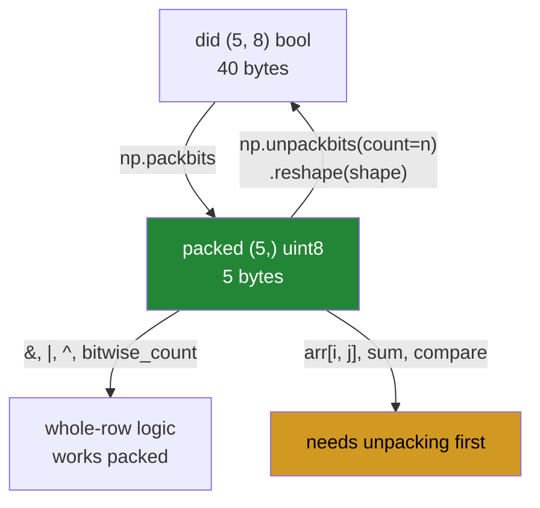

# 1.6 — `packbits` and `unpackbits` — forty booleans in five bytes

## One-line answer

`np.packbits` squeezes a boolean array eight values to a byte and `np.unpackbits` reverses it — an
eight-fold saving that costs you the ability to compute with the data until you unpack it, and that will
hand back padding you did not put in unless you pass `count=`.

---

## The story

The flat's chart is forty ticks and blanks: five people, eight jobs.

Somebody wants to keep a copy of every week for a year. Fifty-two charts. Written out longhand that is
two thousand and eighty ticks and blanks, which is a lot of paper for information that is genuinely tiny —
each box is a single yes or no, and there is nothing more to it than that.

So they do the sensible thing and write each row as one short code, using the agreed order
([1.5](1.5-a-bitmask.md)). Five codes per week, two hundred and sixty for the year, on one page.

There is one snag, and it only appears when the flat gets a sixth person. Codes are written in groups of
eight, and six people is not a multiple of eight, so the last code has two positions left over. They fill
them with blanks, because they have to fill them with something.

A year later somebody reads the page back and finds the flat had eight people. Two of them never did any
chores at all, which is suspicious, and they did not exist.

---

## The idea in plain language

A boolean in NumPy costs a whole **byte** — eight bits — to store a single yes-or-no
([1.1](1.1-a-number-is-switches.md)). That is eight times more storage than the information needs, and it
is a deliberate trade: a byte is individually addressable, so `arr[3]` is a memory read, whereas a bit
would need a read plus a shift plus a mask.

`np.packbits` makes the other trade. It walks the boolean array eight values at a time and writes each
group into one `uint8`, filling from the **most significant bit** downwards. Forty booleans become five
bytes. `np.unpackbits` reverses it.

Three things about that description matter more than the rest.

**The fill direction is most-significant-first.** The first element of the array becomes the top bit of
the byte. That is the opposite of the `1 << n` convention, where bit 0 is the first flag
([1.5](1.5-a-bitmask.md)), and mixing the two is the bug at the end of that document. `packbits` takes a
`bitorder=` argument — `"big"`, the default, or `"little"` — and stating it is worth the eight characters.

**A run that is not a multiple of eight is padded with zeros.** Six booleans become one byte with two
zero bits on the end, and those zeros are indistinguishable from real `False` values on the way back.
`np.unpackbits` therefore returns a multiple of eight unless you tell it how many you want, which is what
`count=` is for. **`count=` is not optional in real code**; without it the array you get back is the wrong
length whenever the original length was not a multiple of eight.

**Packed data cannot be computed with.** You cannot sum it, compare it elementwise, or index the third
person's dishes without unpacking. What you *can* do is the whole-row operations from
[1.5](1.5-a-bitmask.md): `&`, `|`, `^` and `np.bitwise_count` all work on the packed form directly, and
that is where packing pays for itself twice — once in memory and once because one `uint64` `and` combines
sixty-four flags in a single instruction.

The `axis=` argument decides where the grouping happens. Without it the array is flattened first, so the
groups of eight run across row boundaries. With `axis=1` each row is packed independently, which is
usually what you want for a table and which pads **each row** rather than only the end.

---

## Why Setu needs it

- **This is the plan's named example for `NP-08`**: a compact boolean mask, and the reason the ID exists.
- **[5.1](../05-the-module/5.1-the-chores-module.md)** stores the flat's chart packed and reads chores
  back by name, which is this operation with the padding handled.
- **Day 155's vector databases** store binary hashes for approximate search, and comparing two documents
  is one xor and one `bitwise_count` over packed rows — the technique this document makes available.
- **Day 76's feature work** produces one-hot encodings that are overwhelmingly zeros, and packing is one
  of the two standard ways to stop them dominating memory; sparse matrices are the other.
- **Day 42's SQL phase** meets bitmap indexes, which are exactly this idea applied to which rows match a
  predicate.

---

## The mechanism

The whole chart, packed and unpacked:

```python
import numpy as np

did = np.array(
    [
        [1, 0, 1, 0, 1, 1, 0, 0],
        [0, 1, 1, 1, 0, 0, 1, 0],
        [1, 1, 0, 0, 1, 0, 0, 1],
        [0, 0, 1, 1, 0, 1, 1, 1],
        [1, 0, 0, 1, 1, 0, 1, 0],
    ],
    dtype=bool,
)
packed = np.packbits(did)

print("did shape    :", did.shape, "dtype", did.dtype, "nbytes", did.nbytes)
print("packed       :", packed, "nbytes", packed.nbytes)
print("packed bits  :", [np.binary_repr(int(x), 8) for x in packed])
print("unpacked size:", np.unpackbits(packed).size, "vs original", did.size)
print(
    "round trip   :",
    np.array_equal(np.unpackbits(packed, count=did.size).reshape(did.shape).astype(bool), did),
)
```

**Line by line:**

- `did.nbytes` — 40, one byte per boolean. **This is the number being improved on**, and printing it beside
  the packed size is the only way the saving means anything.
- `np.packbits(did)` — no `axis`, so the `(5, 8)` array is flattened first and the forty values are cut
  into five groups of eight. It happens to line up with the rows here **only because there are exactly
  eight chores**, which is a coincidence of this data and not something to rely on.
- `packed.nbytes` — 5. Eight times smaller, exactly, because forty divides by eight with nothing left.
- `[np.binary_repr(int(x), 8) for x in packed]` — the bit rows, so the first one can be compared against
  the first row of the chart by eye. `10101100` against `[1 0 1 0 1 1 0 0]` — identical, left to right,
  which is what "fills from the most significant bit" looks like.
- `np.unpackbits(packed).size` — 40, matching, again because the original size was a multiple of eight.
  **On any other size this line is where the padding appears.**
- `count=did.size` inside the round trip — the argument that makes the reversal exact. It is unnecessary
  here and written anyway, because the day the chart gains a ninth chore is not the day to discover it was
  needed.
- `.reshape(did.shape)` — `unpackbits` returns a flat run, so the shape has to be restored by the caller
  ([Day 22, 2.1](../../../day-22-broadcasting-and-shape/parts/02-reshape/2.1-same-block-new-shape.md)).
  **The shape is not stored in the packed data** and is one of the things you have to record separately.
- `.astype(bool)` — `unpackbits` gives `uint8` values of 0 and 1, not booleans, so a mask built from it
  without this conversion indexes by position instead of selecting
  ([1.1](1.1-a-number-is-switches.md)).

```text
did shape    : (5, 8) dtype bool nbytes 40
packed       : [172 114 201  55 154] nbytes 5
packed bits  : ['10101100', '01110010', '11001001', '00110111', '10011010']
unpacked size: 40 vs original 40
round trip   : True
```

What packing does and what it costs:



The two things you must record separately are the **shape** and the **original length**, because neither
survives the packing.

Now the padding, on a chart whose width is not a multiple of eight:

```python
import numpy as np

five_chores = np.array(
    [
        [1, 0, 1, 0, 1],
        [0, 1, 1, 1, 0],
        [1, 1, 0, 0, 1],
    ],
    dtype=bool,
)
per_row = np.packbits(five_chores, axis=1)

print("original     :", five_chores.shape, "=", five_chores.size, "values")
print("packed       :", per_row.shape, "=", per_row.size * 8, "bit slots")
print("packed bits  :", [np.binary_repr(int(x), 8) for x in per_row.ravel()])
print("naive unpack :", np.unpackbits(per_row, axis=1).shape)
print("with count   :", np.unpackbits(per_row, axis=1, count=5).shape)
print(
    "exact        :",
    np.array_equal(np.unpackbits(per_row, axis=1, count=5).astype(bool), five_chores),
)
```

**Line by line:**

- Five chores rather than eight — **deliberately not a multiple of eight**, which is what every real table
  is. Eight columns is the special case that hides this problem.
- `axis=1` — each row packed on its own, giving one byte per row. Without it the fifteen values would be
  cut into two bytes with the groups running across row boundaries, and the rows would no longer be
  separable.
- `per_row.size * 8` — 24 bit slots holding 15 real values. **Nine of the slots are padding**, and nothing
  in the packed data marks them.
- The printed bit rows — `10101000` for a row that was `[1 0 1 0 1]`. The three trailing zeros are the
  padding, and they look exactly like three chores nobody did.
- `np.unpackbits(per_row, axis=1)` with no `count` — shape `(3, 8)`. Three phantom columns, and every one
  of them full of plausible `False` values. Any code that reads a chore name by position now reads three
  names that do not exist.
- `count=5` — shape `(3, 5)`, matching the original. **This is the argument the whole block exists for**,
  and it has to be supplied from a length you recorded, because the packed data does not know it.
- The `np.array_equal` on the last line — the round trip asserted rather than assumed, which is what the
  test in [5.2](../05-the-module/5.2-the-test-that-can-go-red.md) does for the real module.

```text
original     : (3, 5) = 15 values
packed       : (3, 1) = 24 bit slots
packed bits  : ['10101000', '01110000', '11001000']
naive unpack : (3, 8)
with count   : (3, 5)
exact        : True
```

Fifteen values in, twenty-four slots, and the reversal only gets back to fifteen because it was told to.

---

## When it breaks

**The padding read back as data:**

```text
$ uv run python -c "
import numpy as np
CHORES = np.array(['bins', 'hoover', 'dishes', 'bathroom', 'shopping'])
row = np.array([[1, 0, 1, 0, 1]], dtype=bool)
packed = np.packbits(row, axis=1)
naive = np.unpackbits(packed, axis=1).astype(bool)
print('original :', CHORES[row[0]])
print('unpacked :', naive.shape, naive[0].astype(np.uint8))
print('names    :', naive[0][:5])
print('phantom  :', naive[0][5:], '<- three columns that never existed')
"
original : ['bins' 'dishes' 'shopping']
unpacked : (1, 8) [1 0 1 0 1 0 0 0]
names    : [ True False  True False  True]
phantom  : [False False False] <- three columns that never existed
```

**What it means.** The five real answers survived and three extra columns appeared, all `False`. If the
next line of code is `CHORES[unpacked[0]]` it still works, because the mask is now longer than `CHORES` —
except that boolean indexing requires matching lengths, so it raises. The dangerous version is a table
where the number of columns is read from the unpacked array: it now reports eight chores where there are
five, three of them apparently never done by anybody. **A column that no one has ever done is exactly what
padding looks like**, which is why it survives review.

**A non-boolean input:**

```text
$ uv run python -c "
import numpy as np
counts = np.array([3, 0, 2, 1, 4, 2, 3, 0])
packed = np.packbits(counts)
print('counts   :', counts)
print('packed   :', packed, np.binary_repr(int(packed[0]), 8))
print('back     :', np.unpackbits(packed))
"
counts   : [3 0 2 1 4 2 3 0]
packed   : [190] 10111110
back     : [1 0 1 1 1 1 1 0]
```

**What it means.** No error. `packbits` treated every non-zero value as `True`, so `3`, `2`, `1` and `4`
all became `1` and the counts were destroyed. The reversal gives ones and zeros, which is a plausible
boolean row, and there is no way at all to tell from the packed data that it once held counts. This is the
counts-versus-ticks confusion from [1.3](1.3-tilde-on-bool-and-int.md) arriving through a different door,
and the defence is the same: **assert `dtype == np.bool_` before packing**.

**Packing without recording the shape:**

```text
$ uv run python -c "
import numpy as np
did = np.zeros((5, 8), dtype=bool)
packed = np.packbits(did)
print('packed shape :', packed.shape)
print('back flat    :', np.unpackbits(packed).shape)
print('was it (5,8)?:', 'the packed data does not say')
np.unpackbits(packed).reshape(5, 8)
print('only because we remembered')
"
packed shape : (5,)
back flat    : (40,)
was it (5,8)?: the packed data does not say
only because we remembered
```

**What it means.** Packing a `(5, 8)` array and a `(8, 5)` array and a `(40,)` array all give the same
five bytes. The shape is **not** part of the packed representation, so it has to be stored beside it —
and a file format that stores the bytes without the shape is a file format that can only be read by code
that already knows the answer. The same applies to the original length and to the bit order. Three pieces
of metadata, none of them optional.

---

## In production

**What a professional writes instead of the teaching version.** The packed bytes never travel alone:

```python
from __future__ import annotations

from dataclasses import dataclass

import numpy as np

BITORDER = "big"  # np.packbits default: first element -> most significant bit


@dataclass(frozen=True, slots=True)
class PackedMask:
    """Packed bits plus everything needed to get the original array back.

    The packed bytes alone are ambiguous: the same five bytes are a valid (5, 8),
    (8, 5) or (40,) array, and trailing zero bits are indistinguishable from real
    False values. Shape and bitorder therefore travel with the data.
    """

    data: np.ndarray
    shape: tuple[int, ...]
    bitorder: str = BITORDER

    @classmethod
    def pack(cls, mask: np.ndarray) -> "PackedMask":
        if mask.dtype != np.bool_:
            raise TypeError(
                f"packbits treats any non-zero value as True; expected bool, got {mask.dtype}"
            )
        return cls(
            data=np.packbits(mask, bitorder=BITORDER),
            shape=mask.shape,
            bitorder=BITORDER,
        )

    def unpack(self) -> np.ndarray:
        count = int(np.prod(self.shape)) if self.shape else 0
        flat = np.unpackbits(self.data, count=count, bitorder=self.bitorder)
        return flat.reshape(self.shape).astype(bool)

    @property
    def saving(self) -> float:
        """How many times smaller the packed form is than the boolean array."""
        return int(np.prod(self.shape)) / self.data.nbytes if self.data.nbytes else 1.0
```

**Line by line:**

- `shape` stored on the object — **the fix for the third failure block**, and the reason this is a class
  rather than two functions. The packed bytes and their shape are one thing and separating them loses the
  data.
- `bitorder` stored as well as used — a file written by this code is readable in five years even if the
  default changes or another team's code wrote it with `"little"`. It costs one string per array.
- `BITORDER = "big"` with the comment explaining what "big" means in this context — nobody remembers which
  end "big" refers to, and the comment says it in the words the reader needs
  ([1.5](1.5-a-bitmask.md)).
- `mask.dtype != np.bool_` raising, with a message that says **why** — "packbits treats any non-zero value
  as True" tells the caller what would have happened, which is more useful than "expected bool".
- `int(np.prod(self.shape))` — the original element count, computed from the stored shape rather than
  stored separately, so the two cannot disagree. `np.prod(())` of an empty shape is `1.0`, which is why
  the `if self.shape` guard is there.
- `count=count` in `unpack` — **not optional**, and this is the one line that makes the round trip exact
  for any width. Without it a five-column table comes back with eight columns.
- `.astype(bool)` at the end — `unpackbits` returns `uint8`, and a caller who indexes with the result
  needs booleans or they will get positional indexing
  ([1.1](1.1-a-number-is-switches.md)).
- `saving` as a property — the number that justifies the whole class, available to be logged. It is
  exactly 8.0 when the count is a multiple of eight and slightly less otherwise, and watching it fall is
  how you notice a table whose width has become badly aligned.

**What changes at scale.** The eight-fold memory saving is the headline and it is the least interesting
part. Three effects matter more. First, packed data moves eight times less through the memory bus, and on
large arrays that is the real bottleneck, so a packed intersection can be far more than eight times faster
than a boolean one — a `uint64` `and` handles sixty-four flags per instruction. Second, packing costs CPU
time on the way in and out, so it is a win for data that is stored, transmitted or intersected wholesale,
and a loss for data that is randomly indexed: reading one element from a packed array is a byte read, a
shift and a mask, which is several times the cost of reading a byte. Third, at the point where this
technique is genuinely load-bearing — a bitmap index over a hundred million rows — plain packing is
usually replaced by a **compressed** bitmap such as Roaring, which stores dense runs as ranges and sparse
ones as sorted integers, and gets far better than eight-to-one on the real data while keeping the fast
`and`. Knowing that packing is the floor rather than the ceiling is what stops you building the
compression yourself.

**The failure that only appears with real data.** A pipeline packed per-user feature flags. The feature
count was 32, a comfortable multiple of eight, and the round trip was exact for two years. A thirty-third
feature was added; `unpackbits` without `count=` started returning 40 columns; and the seven padding
columns were fed to a model as seven features that were `False` for every user. The model did not crash
and the accuracy barely moved, because seven constant features contribute nothing — so the bug was found
by a data scientist who noticed the feature-importance table had seven entries at exactly zero.

**The review comment a senior engineer leaves.** *"`np.unpackbits(packed)` with no `count=` — this returns
a multiple of eight, so as soon as the flag count stops being one, every downstream shape is wrong by up
to seven. Store the original length with the bytes and pass it. Also please assert the input dtype is
bool: `packbits` silently treats a count of 3 as True."*

**The interview question.** *"How would you store a large boolean mask compactly?"* `np.packbits`, which
writes eight values per byte and gives an exact eight-fold saving over NumPy's `bool` dtype — because a
NumPy boolean costs a whole byte. The details that matter are all about the reversal: `np.unpackbits`
returns a multiple of eight, so the original length has to be passed as `count=` or the array comes back
with up to seven phantom `False` values that are indistinguishable from real ones; the shape is not stored
at all, so it travels separately; and `bitorder=` decides whether the first element becomes the most or
least significant bit, which is a genuine incompatibility with the `1 << n` flag convention. The trade-off
worth stating is that packed data is not randomly indexable or computable without unpacking, but the
whole-array logic operations work directly on it and are dramatically faster there — one `uint64` `and`
combines sixty-four flags — which is why bitmap indexes exist, and why at real scale you reach for a
compressed bitmap rather than plain packing.

---

## Check yourself

```bash
uv run python -c "
import numpy as np
row = np.array([[1, 0, 1, 0, 1]], dtype=bool)
packed = np.packbits(row, axis=1)
print('original size :', row.size)
print('packed nbytes :', packed.nbytes, 'holding', packed.size * 8, 'bit slots')
print('bits          :', np.binary_repr(int(packed[0, 0]), 8))
print('no count      :', np.unpackbits(packed, axis=1).shape)
print('with count    :', np.unpackbits(packed, axis=1, count=5).shape)
print('exact         :', np.array_equal(np.unpackbits(packed, axis=1, count=5).astype(bool), row))
counts = np.array([3, 0, 2, 1, 4, 2, 3, 0])
print('counts packed :', np.unpackbits(np.packbits(counts)))
"
```

The last line packs an array of counts and gets ones and zeros back. Say what was lost, why nothing
raised, and what one check in front of the call would have stopped it.

**Answer out loud, without scrolling up:**

> Name the three pieces of information that do not survive `np.packbits`, and say what goes wrong for each
> one if you forget to store it.

---

**Next:** [2.1 — `<U8`, text in a fixed-width box](../02-strings/2.1-fixed-width-text.md).
