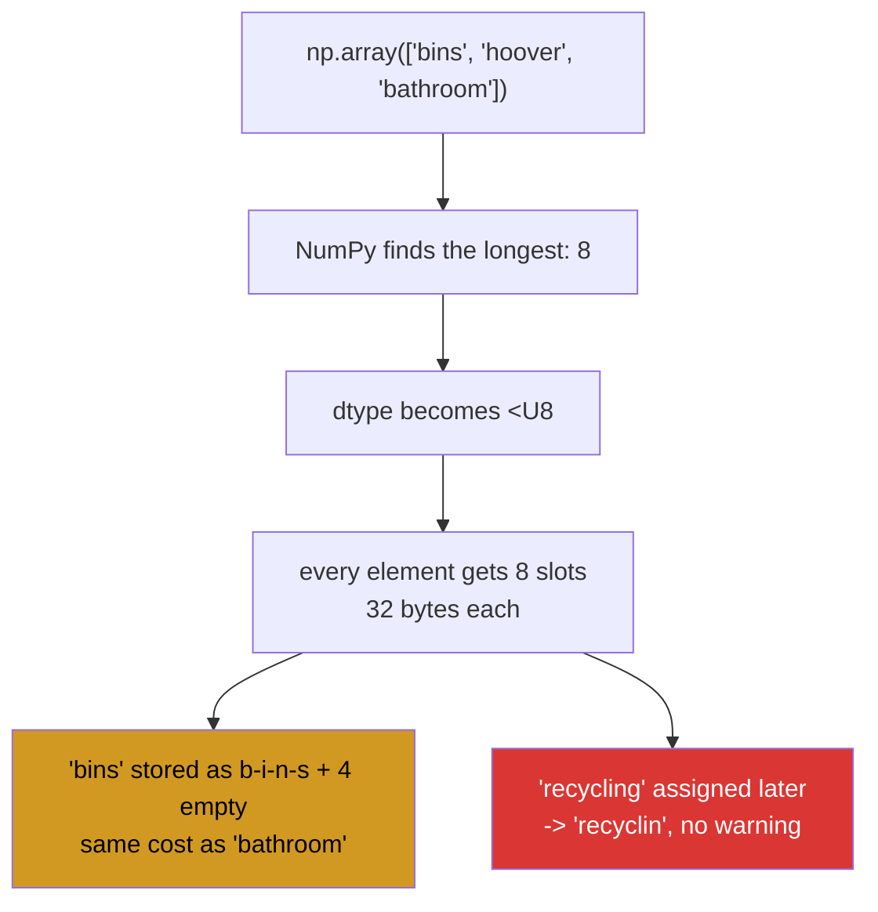

# 2.1 — `<U8` — text in a fixed-width box

## One-line answer

A NumPy text array gives **every** element the same fixed number of characters, decided once when the
array is made — so a longer word assigned later is silently cut off, and a short word still pays for the
full width.

---

## The story

Somebody is relabelling the boxes on the chore chart with a label maker. The label maker takes a cartridge
of tape, and it cuts every label to the same length: whatever the longest job name needed when they
started.

"bathroom" was the longest, so every label is eight characters wide. "bins" gets an eight-character label
with four blank spaces after it, which looks a bit silly and works fine.

Then the flat adds recycling to the chart. The label maker cuts it to eight characters and prints
"recyclin".

It does not beep. It does not refuse. It produces a label that looks like a label, sticks perfectly, and
is wrong. Somebody notices three weeks later and by then two people have been arguing about whose turn
"recyclin" is.

---

## The idea in plain language

An array holds one dtype and every element is the same size in bytes
([Day 20, 1.2](../../../day-20-arrays-and-dtypes/parts/01-the-block/1.2-shape-dtype-and-the-rest.md)).
That is what makes an array fast: element `i` is at a position you can compute rather than look up.

Text does not naturally have a fixed size, so NumPy imposes one. When you build an array from strings,
NumPy looks at the longest one and gives every element exactly that many characters. The dtype records
it: `<U8` means "up to 8 Unicode characters each".

Read the three parts of `<U8`:

- `<` is the **byte order**, little-endian, which is a detail of how the numbers are laid out in memory
  and almost never something you have to think about.
- `U` means **Unicode text**, as opposed to `S` for raw bytes.
- `8` is the **number of characters**, not bytes.

That last distinction costs more than it looks. NumPy stores each character in **four bytes** — enough for
any Unicode code point ([Day 7, 1.1](../../../day-07-strings/parts/01-text/1.1-a-string-is-code-points.md))
— so a `<U8` element occupies 32 bytes whether the word is "bathroom" or "bins". An array of five such
words is 160 bytes to hold 28 characters of actual text.

Two consequences follow, and they are the whole document.

**Assigning a longer string truncates it, silently.** The box is eight characters and "recycling" is
nine, so the ninth character is dropped. No error, no warning. This is the string version of the integer
overflow from Day 20
([Day 20, 2.2](../../../day-20-arrays-and-dtypes/parts/02-dtypes/2.2-integers-and-the-silent-wrap.md)) and
it behaves identically: a value goes in, a different value comes out, and nothing marks the moment.

**The width is decided by the data you happened to have first.** Build the array from four short names
and it is `<U8`; the fact that a nine-character name exists in the world is not something the array can
know. So the truncation appears on the first *new* value, which in practice means in production rather
than in a test.

You can state the width yourself with `dtype="<U20"`, which is what production code does. And you can opt
out entirely with `dtype=object`, which stores Python string objects and has no width at all — at the cost
of giving up almost everything an array is for. That is [2.4](2.4-where-text-does-not-belong.md).

---

## Why Setu needs it

- **[2.2](2.2-np-strings.md) and [2.3](2.3-comparison-is-not-a-match.md)** operate on these arrays, and
  every one of their operations can produce a value too long for the box it is being put back into.
- **[5.1](../05-the-module/5.1-the-chores-module.md)** stores chore names alongside the packed bits, and
  the width has to be stated rather than inferred.
- **Day 26 onwards**, this is the reason pandas does *not* use NumPy text arrays for its string columns —
  it used `object` and now has a dedicated string dtype, and knowing what it was escaping is what makes
  that history readable.
- **Day 117's NLP phase** handles tokens of wildly varying length, where a fixed width is either wasteful
  or lossy and there is no good middle value.
- **Day 42's SQL phase** meets `CHAR(n)` and `VARCHAR(n)`, which are the same decision made in a database,
  with the same truncation and the same argument about which to use.

---

## The mechanism

The chore names, and what the array decided about them:

```python
import numpy as np

names = np.array(["bins", "hoover", "dishes", "bathroom", "post"])

print("array     :", names)
print("dtype     :", names.dtype)
print("itemsize  :", names.itemsize, "bytes per element")
print("nbytes    :", names.nbytes, "for", sum(len(n) for n in names.tolist()), "characters of text")
print("longest   :", max(names.tolist(), key=len))
print("stated    :", np.array(["bins"], dtype="<U20").dtype)
print("bytes/char:", names.itemsize // 8)
```

**Line by line:**

- `np.array([...])` with no dtype — NumPy inspects every string, finds the longest, and sets the width.
  **The width is a fact about this particular list**, not about chore names in general.
- `names.dtype` — `<U8`, because "bathroom" is eight characters. Add a nine-character name to the literal
  and this becomes `<U9`, silently, which is fine here and is exactly what makes the truncation later
  surprising.
- `names.itemsize` — 32 bytes for eight characters, because Unicode characters are stored four bytes each.
  This is the number people do not expect
  ([Day 7, 1.1](../../../day-07-strings/parts/01-text/1.1-a-string-is-code-points.md)).
- `names.nbytes` against the real character count — 160 bytes holding 28 characters. **Nearly six times
  the storage the text needs**, and it gets worse as the lengths vary more.
- `max(..., key=len)` — the string that set the width, printed so the connection between the data and the
  dtype is visible rather than inferred
  ([Day 8, 1.5](../../../day-08-containers/parts/01-sequences/1.5-sort-sorted-and-key.md)).
- `dtype="<U20"` — the width **stated** rather than inferred. This is what production code does, and the
  20 is a decision about the domain rather than about this list.
- `names.itemsize // 8` — four bytes per character, confirmed by arithmetic rather than asserted.

```text
array     : ['bins' 'hoover' 'dishes' 'bathroom' 'post']
dtype     : <U8
itemsize  : 32 bytes per element
nbytes    : 160 for 28 characters of text
longest   : bathroom
stated    : <U20
bytes/char: 4
```

What the dtype is describing:



Now the truncation, on the array the flat actually has:

```python
import numpy as np

chores = np.array(["bins", "hoover", "dishes", "bathroom"])

print("dtype before :", chores.dtype)
chores[0] = "recycling"
print("assigned     : recycling")
print("stored       :", chores[0])
print("length       :", len(chores[0]), "of", len("recycling"))
print("dtype after  :", chores.dtype, "<- unchanged")
print("equal?       :", chores[0] == "recycling")
print("wider array  :", np.array(["bins"], dtype="<U20").astype("<U20")[0])
```

**Line by line:**

- `chores.dtype` printed before the assignment — `<U8`, set by "bathroom". **This is the box the next
  value has to fit in**, and nothing about the assignment line mentions it.
- `chores[0] = "recycling"` — nine characters into an eight-character slot. This is the moment the data is
  lost, and it produces no output at all.
- `chores[0]` — `recyclin`. A real string, of the right kind, that somebody could reasonably act on.
- `len(chores[0])` against `len("recycling")` — 8 against 9. **One character, silently gone**, and this is
  the only line in the block that makes it undeniable.
- `chores.dtype` after — still `<U8`. An array does not grow to fit an assignment; the assignment shrinks
  to fit the array. That direction is the whole design and it is the opposite of what a Python list does.
- `chores[0] == "recycling"` — `False`. Any later lookup, join or membership test against the full name
  now misses, which is how this bug is usually *found*: not as a wrong label but as a row that never
  matches ([2.3](2.3-comparison-is-not-a-match.md)).
- The last line shows the fix in miniature: state a width big enough for the domain when the array is
  built.

```text
dtype before : <U8
assigned     : recycling
stored       : recyclin
length       : 8 of 9
dtype after  : <U8 <- unchanged
equal?       : False
wider array  : bins
```

---

## When it breaks

**The truncation, on its own:**

```text
$ uv run python -c "
import numpy as np
box = np.array(['bathroom'], dtype='<U4')
print('dtype  :', box.dtype)
print('stored :', box[0])
short = np.array(['bins', 'hoover'])
print('dtype  :', short.dtype)
short[0] = 'recycling'
print('stored :', short[0])
"
dtype  : <U4
stored : bath
dtype  : <U6
stored : recycl
```

**What it means.** Both halves truncate and neither says so. The first is at construction: asking for
`<U4` and passing an eight-character string cuts it to four. The second is at assignment into an array
whose width was inferred from `hoover`. In a pipeline the second is the one that happens — the array is
built from one batch of data and written to from another, and the widths of the two batches are unrelated
facts. **The moment a text array is built from data rather than from a stated dtype, its width is an
accident.**

**Text and numbers in one array:**

```text
$ uv run python -c "
import numpy as np
mixed = np.array([9000, 'unknown', 6180])
print('dtype  :', mixed.dtype)
print('array  :', mixed)
print('sum?   :', end=' ')
try:
    print(mixed.sum())
except Exception as e:
    print(type(e).__name__, ':', e)
"
dtype  : <U21
array  : ['9000' 'unknown' '6180']
sum?   : TypeError : the resolved dtypes are not compatible with add.reduce. Resolved (dtype('<U21'), dtype('<U21'), dtype('<U42'))
```

**What it means.** One text value turned every number into text, because an array holds one dtype
([Day 20, 2.1](../../../day-20-arrays-and-dtypes/parts/02-dtypes/2.1-a-dtype-is-a-promise.md)). The width
`<U21` is not arbitrary: it is how many characters the longest possible `int64` needs, so NumPy sized the
box for the numbers it was converting. The array looks fine, prints fine, and refuses the first arithmetic
it meets. This is the normal outcome of reading a CSV column that has `"unknown"` or `"N/A"` in one row,
and it is why every load path needs a dtype assertion.

**A comparison that cannot warn you:**

```text
$ uv run python -c "
import numpy as np
stored = np.array(['bathroom', 'recycling'], dtype='<U8')
print('stored   :', stored)
print('lookup   :', stored == 'recycling')
print('truncated:', stored == 'recyclin')
"
stored   : ['bathroom' 'recyclin']
lookup   : [False False]
truncated: [False  True]
```

**What it means.** The array was built with an explicit `<U8` and one of its own initial values did not
fit, so it was truncated at construction. Looking the real name up finds nothing. **The symptom is a join
that loses rows**, and the cause is nine characters into an eight-character column — which nobody suspects
because the array was built from a literal list right there in the code. The width was stated and was
stated too small, which is the failure mode of stating it.

---

## In production

**What a professional writes instead of the teaching version.** The width is a domain decision, stated
once, and anything that would not fit is refused rather than cut:

```python
from __future__ import annotations

import numpy as np

# Chore names are a controlled vocabulary. 24 is chosen with headroom over the longest
# current name ("recycling", 9); widening later is cheap, and truncation is silent.
NAME_WIDTH = 24
NAME_DTYPE = np.dtype(f"<U{NAME_WIDTH}")


def as_names(values: list[str]) -> np.ndarray:
    """Build a text array at the stated width, refusing anything that would be cut."""
    too_long = [v for v in values if len(v) > NAME_WIDTH]
    if too_long:
        raise ValueError(
            f"{len(too_long)} name(s) exceed {NAME_WIDTH} characters and would be "
            f"silently truncated: {too_long[:3]}"
        )
    return np.array(values, dtype=NAME_DTYPE)


def widen_to_fit(values: np.ndarray, extra: np.ndarray) -> np.ndarray:
    """Return ``values`` in a dtype wide enough to also hold every element of ``extra``."""
    needed = max(values.dtype.itemsize // 4, extra.dtype.itemsize // 4)
    return values.astype(f"<U{needed}")
```

**Line by line:**

- `NAME_WIDTH = 24` with the reasoning in the comment — **the number and its justification travel
  together**. "24 because the longest current name is 9" is a decision a reviewer can argue with; a bare
  `24` is a magic number nobody will ever dare change.
- `np.dtype(f"<U{NAME_WIDTH}")` — the dtype built from the constant, so the two can never disagree. Writing
  `"<U24"` separately is how a codebase ends up with a width check against 24 and a dtype of `<U20`.
- `too_long` computed **before** the array is built — the check has to happen while the full strings still
  exist. Building the array first and then checking its contents checks the truncated values, which always
  pass.
- `too_long[:3]` in the message — the first three offenders, not all of them. A bad load can have a
  million, and a message that names three is readable while one that names a million is a log outage.
- `raise` rather than widening automatically — **the deliberate choice**. Auto-widening would work and
  would hide a real signal: a name longer than the vocabulary allows usually means the wrong column was
  passed, not that the vocabulary grew.
- `itemsize // 4` in `widen_to_fit` — bytes back to characters, because `<U8` has an `itemsize` of 32.
  This is the arithmetic from the mechanism section used in anger, and getting it wrong by a factor of four
  is the obvious mistake.
- `values.astype(...)` returning a **copy** — widening a text array cannot be done in place, because every
  element moves ([Day 20, 2.4](../../../day-20-arrays-and-dtypes/parts/02-dtypes/2.4-astype-and-the-copy.md)).
  On a large array this is a full duplication, which is a reason to state the width generously at the
  start.

**What changes at scale.** Fixed-width text is the wrong shape for most real text data, and the reason is
arithmetic: the cost is `n × longest`, not `n × average`. A million product descriptions averaging 40
characters with one outlier at 4 000 costs four gigabytes as `<U4000` — a hundred times what the text
needs. That single outlier is not hypothetical; it is a description field with a pasted article in it, and
every dataset has one. Three responses exist and it is worth knowing all three. Use `object` dtype and
accept that you are storing Python objects with none of an array's benefits
([2.4](2.4-where-text-does-not-belong.md)). Use a **categorical** encoding — store each distinct string
once and an integer code per row, which is `np.unique(..., return_inverse=True)`
([Day 23, 4.2](../../../day-23-ufuncs-and-statistics/parts/04-counting/4.2-unique.md)) — which is
overwhelmingly the right answer when the vocabulary is small, as it is for chore names. Or leave NumPy for
this column and use a library built for it, which after Day 26 is pandas' string dtype backed by Arrow.
**Fixed-width is right exactly when the values are a short controlled vocabulary**, and that is a narrower
case than it first appears.

**The failure that only appears with real data.** A pipeline built a country-code array from the first
batch it processed, which happened to contain only two-letter codes, giving `<U2`. Later batches included
`"USA"` and `"GBR"`, which were stored as `"US"` and `"GB"` — both of which are **real, different
countries**. No row failed to match; they matched the wrong thing. The error was found nine months later
when a regional report showed traffic from a country the company did not operate in.

**The review comment a senior engineer leaves.** *"`np.array(names)` infers the width from whatever this
batch contains. The next batch with a longer name gets truncated silently, and truncated codes can still
match a different valid code. Please state the dtype and validate lengths at the boundary."*

**The interview question.** *"What does a dtype of `<U8` mean, and what is the catch?"* Every element of
the array holds up to eight Unicode characters, in a fixed-size slot of 32 bytes — four bytes per
character regardless of the content. The catch is twofold. The width is inferred from the longest string
present when the array is built, so it is an accident of the first batch of data; and assigning anything
longer afterwards **truncates it silently**, with no error and no warning, exactly like integer overflow.
The consequence that actually bites is that a truncated value can still be a valid value — `"USA"` cut to
`"US"` is a different real country — so the symptom is not a crash but a join that matches the wrong row.
The details worth adding: the storage cost is `n × longest`, so one outlier makes the whole array
enormous; and for a short controlled vocabulary the better answer is a categorical encoding with integer
codes, which is why pandas moved away from fixed-width text entirely.

---

## Check yourself

```bash
uv run python -c "
import numpy as np
names = np.array(['bins', 'hoover', 'dishes', 'bathroom'])
print('dtype    :', names.dtype)
print('itemsize :', names.itemsize, 'bytes for', names.dtype.itemsize // 4, 'characters')
print('nbytes   :', names.nbytes, 'for', sum(len(n) for n in names.tolist()), 'real characters')
names[0] = 'recycling'
print('stored   :', names[0], 'len', len(names[0]))
print('matches? :', names[0] == 'recycling')
print('stated   :', np.array(['bins'], dtype='<U24').dtype)
wide = np.array(['bins'], dtype='<U24')
wide[0] = 'recycling'
print('now      :', wide[0], 'len', len(wide[0]))
"
```

The same assignment runs twice and only one of them keeps all nine characters. Say what differs, and say
which of the two arrays you would want a data-loading function to return.

**Answer out loud, without scrolling up:**

> Say what the three parts of `<U8` mean, how many bytes one element takes, and what happens when you
> assign a nine-character string into it. Then say why a truncated country code is worse than a crash.

---

**Next:** [2.2 — `np.strings`, the module `np.char` became](2.2-np-strings.md).
