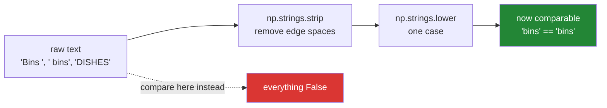

# 2.2 — `np.strings` — the module `np.char` became

## One-line answer

`np.strings` holds vectorised versions of Python's string methods — `strip`, `lower`, `startswith`,
`find` — that run over a whole text array at once instead of one element at a time, and it is the NumPy 2
home for the text operations that used to live in the now-legacy `np.char`.

---

## The story

The flat has been keeping the chore chart in a shared note on their phones, and everybody types the job
names themselves.

After a month the list of names is a mess. Somebody types "Bins" with a capital. Somebody else leaves a
space after it. One person types "DISHES" because their keyboard was stuck on caps lock. Another writes
" bins" with the space in front.

Nobody has done anything wrong. Four people typing the same word four times will produce four spellings,
and that is simply what happens when humans type.

Counting how many times the bins were emptied means fixing that first — trimming the spaces, putting
everything in the same case — and doing it for every entry, the same way, before counting anything.

---

## The idea in plain language

Python strings have methods: `"  Bins ".strip()` gives `"Bins"`, and `.lower()` gives `"bins"`
([Day 7, 2.1](../../../day-07-strings/parts/02-methods/2.1-normalising-strip-and-case.md)). Those methods
work on **one** string.

`np.strings` provides the same operations for a whole array. `np.strings.strip(names)` returns a new array
with every element trimmed. `np.strings.lower(names)` lowercases all of them. The name of each function
matches the Python method it corresponds to, so almost nothing new has to be learned — the knowledge
transfers directly.

The module's history is worth two sentences, because you will meet the old name. Before NumPy 2.0 all of
this lived in `np.char`, which only ever handled fixed-width text. NumPy's own documentation says that
module "will not be getting updates and will be deprecated at some point in the future"
(<https://numpy.org/doc/stable/reference/routines.strings.html>), and `np.strings` is where the work has
moved. **Seeing `np.char` in code tells you it predates NumPy 2**, and the fix is usually a rename.

One claim about `np.strings` needs care, because it is repeated widely and is only partly true. Some of
these functions are genuine **ufuncs**
([Day 23, 1.1](../../../day-23-ufuncs-and-statistics/parts/01-ufuncs/1.1-one-operation-every-element.md)) —
`add`, `equal`, `str_len` and `isalpha` among them — with everything that implies about broadcasting and
`out=`. Others, including `lower`, `strip`, `find` and `startswith`, are ordinary dispatcher functions
sitting on top of that machinery. **Check with `isinstance(np.strings.f, np.ufunc)` before relying on
ufunc behaviour**, rather than trusting any sentence about it, this one included. What is true of all of
them is the part that matters day to day: the loop runs in compiled code, not in Python.

The functions worth knowing by name divide into four groups:

**Cleaning** — `strip`, `lstrip`, `rstrip`, `lower`, `upper`, `title`, `replace`. These take text in and
give text out, and every one of them can produce a string longer than the input's box, which matters
because of [2.1](2.1-fixed-width-text.md).

**Asking** — `startswith`, `endswith`, `find`, `count`, `isdigit`, `isalpha`. These return **booleans or
numbers**, not text, which makes them directly usable as masks
([Day 21, 3.2](../../../day-21-indexing-and-views/parts/03-boolean-masks/3.2-indexing-with-a-mask.md)).

**Measuring** — `str_len`, which is `len()` per element. It is spelled with the underscore because `len`
is taken.

**Joining** — `add`, which concatenates elementwise and is what `+` calls.

Two behaviours are worth stating up front.

`find` returns `-1` when the substring is absent, exactly as Python's `str.find` does. It never raises, so
a mask built from it must compare against `-1` and not rely on truthiness — `-1` is truthy, and position
`0` is falsy, which is the wrong way round in both cases.

And the **result dtype is recomputed**. `np.strings.add(names, "!")` returns an array one character wider
than its input, because the operation needs the room. That is convenient and it is also the thing that
surprises people when a result no longer fits back where it came from.

---

## Why Setu needs it

- **[2.3](2.3-comparison-is-not-a-match.md)** is about why comparing raw text fails, and these are the
  functions that fix it before the comparison happens.
- **[5.1](../05-the-module/5.1-the-chores-module.md)** normalises chore names on the way in, so that four
  spellings of "bins" become one before anything is counted.
- **Day 7's normaliser** did this for one string at a time
  ([Day 7, 4.1](../../../day-07-strings/parts/04-normalising/4.1-the-title-normaliser.md)); this is the
  same idea applied to a column.
- **Day 26 onwards**, `Series.str.strip()` and `Series.str.lower()` are pandas' versions of exactly these,
  with the same names and the same gotchas.
- **Day 117's NLP phase** begins every pipeline with normalisation, and doing it vectorised rather than in
  a Python loop is the difference between seconds and minutes on a real corpus.

---

## The mechanism

The messy names, cleaned:

```python
import numpy as np

raw = np.array(["Bins ", "hoover", "DISHES", "bathroom", " bins"])

print("raw       :", raw, raw.dtype)
print("strip     :", np.strings.strip(raw))
print("lower     :", np.strings.lower(np.strings.strip(raw)))
print("upper     :", np.strings.upper(raw))
print("startswith:", np.strings.startswith(raw, "b"))
print("find 'in' :", np.strings.find(raw, "in"))
print("str_len   :", np.strings.str_len(raw))
print("add       :", np.strings.add(raw, "!"))
```

**Line by line:**

- `raw` — five names as four people would really have typed them, including one with a trailing space and
  one with a leading space. **These are the mistakes people actually make**, not invented ones.
- `raw.dtype` — `<U8`, set by "bathroom" ([2.1](2.1-fixed-width-text.md)). Every operation below has to
  produce something that fits in a box of some width, and the width is recomputed each time.
- `np.strings.strip(raw)` — spaces removed from both ends of every element, in one call. `"Bins "` becomes
  `"Bins"` and `" bins"` becomes `"bins"`.
- `np.strings.lower(np.strings.strip(raw))` — the two composed, which is the normalisation that actually
  matters. **Both are needed**: stripping alone leaves `"Bins"` and `"bins"` as different values, and
  lowercasing alone leaves the spaces.
- `np.strings.upper(raw)` — applied to the **unstripped** array deliberately, so the output shows
  `'BINS '` with its space intact. Case operations do not trim, and expecting them to is a common
  assumption.
- `np.strings.startswith(raw, "b")` — a **boolean** array, so it is a mask. Note that it is `False` for
  `"Bins "` (capital B) and for `" bins"` (leading space), and `True` only for `"bathroom"`. One of five,
  from an array where three names begin with the letter b. **This line is the argument for normalising
  first**, in a single output.
- `np.strings.find(raw, "in")` — the position of the substring in each element, or `-1` when absent. The
  single string `"in"` is applied against all five elements, which is what "vectorised" means here even
  though `find` is not itself a ufunc.
- `np.strings.str_len(raw)` — character counts, and they include the spaces: `"Bins "` is 5. This is how
  you find whitespace problems without looking at them.
- `np.strings.add(raw, "!")` — concatenation, and look at the output width: the result holds `'bathroom!'`,
  nine characters, in an array whose input was `<U8`. **The dtype grew to fit**, which it has to.

```text
raw       : ['Bins ' 'hoover' 'DISHES' 'bathroom' ' bins'] <U8
strip     : ['Bins' 'hoover' 'DISHES' 'bathroom' 'bins']
lower     : ['bins' 'hoover' 'dishes' 'bathroom' 'bins']
upper     : ['BINS ' 'HOOVER' 'DISHES' 'BATHROOM' ' BINS']
startswith: [False False False  True False]
find 'in' : [ 1 -1 -1 -1  2]
str_len   : [5 6 6 8 5]
add       : ['Bins !' 'hoover!' 'DISHES!' 'bathroom!' ' bins!']
```

The `lower` line has **two** entries reading `bins`, from `"Bins "` and `" bins"`. Before normalising they
were two different values; after it they are one, and only then can they be counted
([Day 23, 4.2](../../../day-23-ufuncs-and-statistics/parts/04-counting/4.2-unique.md)).

The order the operations have to happen in:



Now the counting that the normalisation was for:

```python
import numpy as np

raw = np.array(["Bins ", "hoover", "DISHES", "bathroom", " bins", "Hoover", "bins"])
clean = np.strings.lower(np.strings.strip(raw))

before_values, before_counts = np.unique(raw, return_counts=True)
after_values, after_counts = np.unique(clean, return_counts=True)

print("raw distinct   :", before_values.size)
print("raw counts     :", dict(zip(before_values.tolist(), before_counts.tolist())))
print("clean distinct :", after_values.size)
print("clean counts   :", dict(zip(after_values.tolist(), after_counts.tolist())))
```

**Line by line:**

- Seven entries with three real jobs among them — bins three times, hoover twice, and one each of dishes
  and bathroom. **That is the answer the counting should produce.**
- `np.strings.lower(np.strings.strip(raw))` — the composed normalisation, applied once and stored in a
  name. Composing it inline at each use site is how two call sites end up normalising differently.
- `np.unique(..., return_counts=True)` on the raw array — the distinct spellings, which is not the same
  question as the distinct jobs
  ([Day 23, 4.2](../../../day-23-ufuncs-and-statistics/parts/04-counting/4.2-unique.md)).
- `dict(zip(...))` — the values paired with their counts for reading. `.tolist()` converts to Python types
  so the printed dictionary is readable rather than a row of `np.str_` wrappers.
- The two `distinct` numbers side by side — seven against four. **Every raw entry was distinct**, so the
  raw counts are seven ones, and three of those seven were the same job typed three different ways.

```text
raw distinct   : 7
raw counts     : {' bins': 1, 'Bins ': 1, 'DISHES': 1, 'Hoover': 1, 'bathroom': 1, 'bins': 1, 'hoover': 1}
clean distinct : 4
clean counts   : {'bathroom': 1, 'bins': 3, 'dishes': 1, 'hoover': 2}
```

**Seven "jobs" became four.** Every one of the seven raw entries was distinct, so a chart of the raw counts
would have been seven bars all of height one — a flat, meaningless picture of a month in which the bins
were actually done three times. Nothing about the data changed; only whether the program could see that
three of the strings meant the same thing.

---

## When it breaks

**A Python method on the array itself:**

```text
$ uv run python -c "
import numpy as np
raw = np.array(['Bins ', 'hoover'])
raw.lower()
"
Traceback (most recent call last):
  File "<string>", line 4, in <module>
AttributeError: 'numpy.ndarray' object has no attribute 'lower'
```

**What it means.** An array is not a string, so it has none of `str`'s methods. This is the most common
first mistake with text arrays and the error is helpfully blunt. The functions live in `np.strings`, not
on the array. It is worth noticing that the **elements** do have the methods — `raw[0].lower()` works —
which is why people reach for a Python loop here, and why doing so on a large array is one of the slowest
things you can write.

**The deprecated module:**

```text
$ uv run python -c "
import numpy as np
raw = np.array(['Bins ', 'hoover'])
print('np.char exists     :', hasattr(np, 'char'))
print('np.char.lower      :', np.char.lower(raw))
print('np.strings.lower   :', np.strings.lower(raw))
print('same answer        :', np.array_equal(np.char.lower(raw), np.strings.lower(raw)))
print('lower is ufunc     :', isinstance(np.strings.lower, np.ufunc))
print('add is ufunc       :', isinstance(np.strings.add, np.ufunc))
"
np.char exists     : True
np.char.lower      : ['bins ' 'hoover']
np.strings.lower   : ['bins ' 'hoover']
same answer        : True
lower is ufunc     : False
add is ufunc       : True
```

**What it means.** Both modules work and give the same answer, so nothing forces the migration — which is
exactly why old code keeps using `np.char`. The last two lines correct a claim you will read in a lot of
places: **within the one module, some of these are ufuncs and some are not.** `np.strings.add` is;
`np.strings.lower` is not. So `out=` and the other ufunc arguments
([Day 23, 1.2](../../../day-23-ufuncs-and-statistics/parts/01-ufuncs/1.2-out-and-the-temporaries.md)) are
available for some of these functions and not for others, and the only reliable way to find out is to ask
the object. The reason to migrate anyway is the documented one: `np.char` "will not be getting updates and
will be deprecated at some point in the future"
(<https://numpy.org/doc/stable/reference/routines.strings.html>), and the migration is a rename.

**The result that no longer fits:**

```text
$ uv run python -c "
import numpy as np
names = np.array(['bins', 'hoover', 'dishes'])
print('dtype in  :', names.dtype)
longer = np.strings.add(names, ' (done)')
print('dtype out :', longer.dtype)
print('values    :', longer)
names[:] = longer
print('put back  :', names)
"
dtype in  : <U6
dtype out : <U13
values    : ['bins (done)' 'hoover (done)' 'dishes (done)']
put back  : ['bins (' 'hoover' 'dishes']
```

**What it means.** The operation correctly widened its **output** to `<U13`, and then assigning that back
into the original `<U6` array truncated every value
([2.1](2.1-fixed-width-text.md)). `'bins (done)'` became `'bins ('`. No error at any step: the function
was right, the assignment was legal, and the data is gone. **Never write a string operation's result back
into the array it came from**; bind the wider result to a new name and let the old array be collected.

---

## In production

**What a professional writes instead of the teaching version.** Normalisation is one named function, used
everywhere, so two call sites cannot disagree about what "the same job" means:

```python
from __future__ import annotations

import numpy as np

NAME_DTYPE = np.dtype("<U24")


def normalise(values: np.ndarray) -> np.ndarray:
    """Trim, lowercase and collapse the ways a person can type the same name.

    Applied at every boundary where text enters, so that two spellings of one job are
    one value before anything counts, joins or groups by it. Returns a new array; the
    caller's is untouched.
    """
    if values.dtype.kind not in "US":
        raise TypeError(f"expected text, got dtype {values.dtype}")
    cleaned = np.strings.lower(np.strings.strip(values))
    return np.strings.replace(cleaned, " ", "_").astype(NAME_DTYPE)


def unknown_names(values: np.ndarray, vocabulary: np.ndarray) -> np.ndarray:
    """The normalised names that are not in the controlled vocabulary."""
    cleaned = normalise(values)
    return np.unique(cleaned[~np.isin(cleaned, normalise(vocabulary))])
```

**Line by line:**

- One function called `normalise`, not three calls at each site — **the whole point**. If one place strips
  and lowercases while another only lowercases, the two produce different keys and the resulting bug looks
  like missing data rather than like inconsistent cleaning.
- `values.dtype.kind not in "US"` — `U` is Unicode text and `S` is bytes
  ([Day 20, 2.1](../../../day-20-arrays-and-dtypes/parts/02-dtypes/2.1-a-dtype-is-a-promise.md)). Accepting
  both means a column read as bytes from a file is not silently rejected, while a numeric column is.
- `np.strings.strip` **before** `np.strings.lower` — the order does not matter for these two, and writing
  them consistently does. `replace` after both is where order starts to matter, because replacing spaces
  before stripping would turn a trailing space into a trailing underscore.
- `np.strings.replace(cleaned, " ", "_")` — internal spaces become underscores, so "take out" and
  "take  out" with two spaces are still different but a name is never accidentally split by a later
  `split`. This is a policy, and having it inside `normalise` is what makes it uniform.
- `.astype(NAME_DTYPE)` at the end — **the width stated once**, so every normalised array in the system
  has the same dtype and can be compared and concatenated without a surprise widening
  ([2.1](2.1-fixed-width-text.md)). Without it, the dtype of a normalised array depends on the batch.
- `unknown_names` calling `normalise` on **both** sides — the input and the vocabulary. Normalising only
  one side is the single most common way a controlled-vocabulary check reports everything as unknown
  ([Day 23, 4.5](../../../day-23-ufuncs-and-statistics/parts/04-counting/4.5-isin-and-membership.md)).
- `np.unique(...)` on the result — a bad load produces a million unknown rows and a handful of distinct
  unknown names, and it is the names that identify the problem.

**What changes at scale.** These are ufuncs, so the loop is compiled and the cost is one pass — but each
one **allocates a full new array**, and a chain of three normalisation steps on a ten-million-row column
allocates three of them. At `<U24` that is 960 MB per copy. The techniques are the ones from Day 23:
compose fewer steps, and where the dtype allows it, write into a reused buffer with `out=`
([Day 23, 1.2](../../../day-23-ufuncs-and-statistics/parts/01-ufuncs/1.2-out-and-the-temporaries.md)).
The larger point is architectural: normalising a text column repeatedly is a sign the normalisation belongs
**earlier**, at the point the data is read, so it happens once instead of at every use. And past a certain
size the right answer stops being a text array at all — normalise once, map to integer codes with
`np.unique(..., return_inverse=True)`
([Day 23, 4.2](../../../day-23-ufuncs-and-statistics/parts/04-counting/4.2-unique.md)), and do every
subsequent comparison, group and join on the integers. That is what a categorical column is, and for a
controlled vocabulary like chore names it is between ten and a hundred times smaller.

**The failure that only appears with real data.** An events pipeline normalised its category column with
`strip().lower()` at the point of ingestion and again, differently, in a downstream report that only
lowercased. For a year the two agreed, because the ingested data had already been stripped. Then a new
producer began sending categories with trailing spaces, ingestion cleaned them, and the report — reading
from the raw archive rather than the cleaned table — began producing two rows per category. The bug was in
the **duplication** of the logic, not in either copy of it.

**The review comment a senior engineer leaves.** *"`np.strings.lower(col)` here and
`np.strings.lower(np.strings.strip(col))` in the loader. Those produce different keys the moment anything
upstream sends whitespace. Please extract one `normalise()` and call it from both — and apply it to the
vocabulary as well as the data, or the membership check will match nothing."*

**The interview question.** *"How do you lowercase a whole column of text in NumPy?"* `np.strings.lower`,
not `arr.lower()` — an array has no string methods, and looping over the elements in Python is the slow
answer. `np.strings` replaced `np.char` in NumPy 2, and NumPy's docs say `np.char` will not be updated and
will be deprecated eventually, so new code uses `np.strings`. One detail worth being precise about:
several `np.strings` functions are genuine ufuncs — `add`, `equal`, `str_len` — and several, including
`lower` and `strip`, are not, so `out=` is available for some and not for others and it is worth checking
rather than assuming. The details that show experience: `find` returns `-1` for absent rather than raising, so
a mask must compare against `-1` and never rely on truthiness, since `-1` is truthy and position `0` is
falsy; every text-producing operation recomputes the output dtype's width, so assigning a result back into
the original array truncates it silently; and normalisation must be a single named function applied at
every boundary, including to the lookup vocabulary, because two slightly different cleanings produce two
different keys and the symptom is duplicated groups rather than an error.

---

## Check yourself

```bash
uv run python -c "
import numpy as np
raw = np.array(['Bins ', 'hoover', 'DISHES', ' bins'])
print('raw       :', raw, raw.dtype)
print('strip     :', np.strings.strip(raw))
print('lower     :', np.strings.lower(raw))
print('both      :', np.strings.lower(np.strings.strip(raw)))
print('distinct raw  :', np.unique(raw).size)
print('distinct clean:', np.unique(np.strings.lower(np.strings.strip(raw))).size)
print('startswith b  :', np.strings.startswith(raw, 'b'))
print('after cleaning:', np.strings.startswith(np.strings.lower(np.strings.strip(raw)), 'b'))
print('add widens    :', np.strings.add(raw, ' (done)').dtype, 'from', raw.dtype)
"
```

The two `startswith` lines ask the same question of the same four names and disagree. Say how many each
finds, which is right, and what that means for any filter written before a normalisation step.

**Answer out loud, without scrolling up:**

> Name the module, say what it replaced and what changed, and say why `np.strings.find` returning `-1`
> makes `if np.strings.find(x, "in"):` a bug.

---

**Next:** [2.3 — comparison is not a match](2.3-comparison-is-not-a-match.md).
