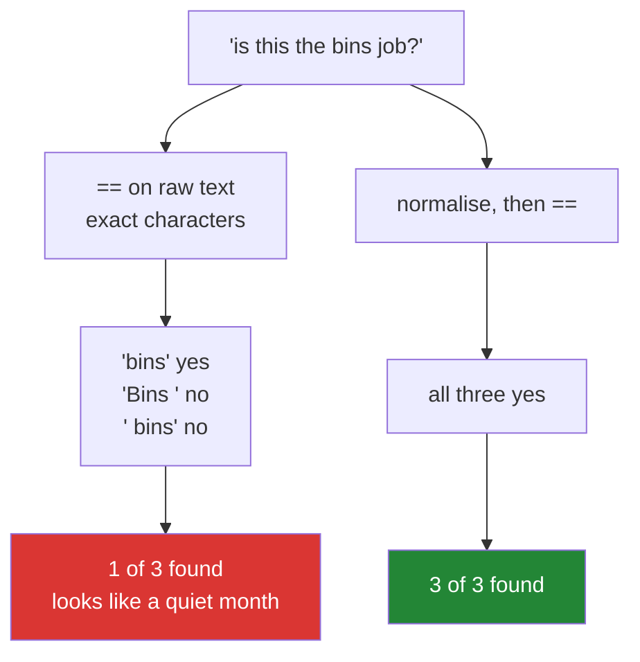

# 2.3 — Comparison is not a match — `==` on text, and what it misses

## One-line answer

`==` on text is exact, character for character, so `"Bins "` and `"bins"` are different values — and a
filter written against raw text quietly matches nothing while looking exactly like a filter that found no
rows.

---

## The story

Somebody is going through the flat's shared note counting how many times the bins were done.

They search the note for "bins". The phone finds one result.

They know that is wrong, because they emptied the bins themselves twice this month and they can see both
entries on the screen while the search says one. One of the entries has a capital B and the other has a
space after it, and the search box does not care that a human reading the list would count all three.

The search is not broken. It answered the question it was asked, exactly, and the question was narrower
than the one in the person's head.

---

## The idea in plain language

`==` on a text array compares **character for character**. Two strings are equal when they have the same
characters in the same order and no others. Everything else is different: a capital letter, a trailing
space, an accent, a different kind of dash.

That is the correct definition and it is almost never the question you meant. What people mean by "the
same job" is a **match**: the same after ignoring the things a human ignores. Case, surrounding
whitespace, and often punctuation and accents too.

The gap between the two has a shape worth naming. `==` is a decision about **values**; matching is a
decision about **meaning**, and the only way to make a computer do the second is to change the values
until the first gives the answer you want. That is what
[2.2](2.2-np-strings.md)'s normalisation is for, and it is why it has to happen on **both sides** of every
comparison.

Three tools do the comparing, and they differ in what they compare against.

`arr == "bins"` compares every element against one value and gives a boolean mask. This is a ufunc, so
the single string is broadcast against the whole array
([Day 23, 1.1](../../../day-23-ufuncs-and-statistics/parts/01-ufuncs/1.1-one-operation-every-element.md)).

`np.isin(arr, allowed)` compares every element against a **set** of values
([Day 23, 4.5](../../../day-23-ufuncs-and-statistics/parts/04-counting/4.5-isin-and-membership.md)). The
same exactness applies, and it applies to both arguments — so an unnormalised vocabulary is as damaging as
unnormalised data.

`np.strings.startswith`, `endswith` and `find` compare **parts** of each element
([2.2](2.2-np-strings.md)). These are the closest NumPy gets to a fuzzy match and they are still exact
about the part they look at.

There is a failure mode specific to text that is worth stating on its own, because it is the reason this
document is here rather than being a paragraph in 2.2. **A text filter that matches nothing does not look
like a bug.** A numeric filter that matches nothing is suspicious immediately; a text filter that matches
nothing looks like a category that had no rows this month. The two are indistinguishable downstream, and
the only defence is to check the *other* direction: how many of your filter values matched anything at all.

One more trap belongs here. NumPy compares text by **code point**, so ordering and equality both depend on
the exact characters stored. Two strings that look identical on screen can differ — an accented character
can be stored as one code point or as a letter followed by a combining mark
([Day 7, 4.2](../../../day-07-strings/parts/04-normalising/4.2-unicode-normalisation.md)). They render the
same and compare unequal, and no amount of `lower()` and `strip()` fixes it. That is what Unicode
normalisation is for, and it is a step above what `np.strings` offers.

---

## Why Setu needs it

- **[5.1](../05-the-module/5.1-the-chores-module.md)** looks chore names up against a controlled
  vocabulary, and the lookup has to normalise both sides or it finds nothing.
- **Day 23's `isin`** made exactly this point about dtypes
  ([Day 23, 4.5](../../../day-23-ufuncs-and-statistics/parts/04-counting/4.5-isin-and-membership.md));
  this is the same failure caused by content rather than by type.
- **Day 26 onwards**, joining two dataframes on a text key is this problem at its most expensive: the join
  succeeds, produces fewer rows than either input, and nothing says why.
- **Day 84's exploratory work** is where unnormalised categories become visible, as a bar chart with
  "Bins", "bins" and "bins " as three separate bars.
- **Day 162's RAG pipeline** filters retrieved chunks by source identifier, and a filter that silently
  matches nothing there returns an answer with no grounding at all.

---

## The mechanism

The same question asked of raw and normalised text:

```python
import numpy as np

raw = np.array(["Bins ", "hoover", "DISHES", "bathroom", " bins", "Hoover", "bins"])
clean = np.strings.lower(np.strings.strip(raw))

print("raw == 'bins'   :", raw == "bins")
print("clean == 'bins' :", clean == "bins")
print("raw matches     :", np.count_nonzero(raw == "bins"))
print("clean matches   :", np.count_nonzero(clean == "bins"))
print("isin raw        :", np.isin(raw, np.array(["bins", "hoover"])))
print("isin clean      :", np.isin(clean, np.array(["bins", "hoover"])))
print("startswith raw  :", np.count_nonzero(np.strings.startswith(raw, "b")))
print("startswith clean:", np.count_nonzero(np.strings.startswith(clean, "b")))
```

**Line by line:**

- `raw` — seven entries containing three real bins entries typed three different ways, plus two hoovers
  typed two ways. **The counts a human would give are bins 3, hoover 2.**
- `clean` — the normalisation from [2.2](2.2-np-strings.md), computed once into a name so both comparisons
  below use exactly the same cleaning.
- `raw == "bins"` — a mask with **one** `True`. Only the last entry is literally `"bins"`; `"Bins "` and
  `" bins"` are different values and the comparison is right to say so.
- `clean == "bins"` — three `True`s, which is the answer.
- The two `count_nonzero` lines — 1 against 3
  ([Day 23, 4.1](../../../day-23-ufuncs-and-statistics/parts/04-counting/4.1-count-nonzero-and-the-mask.md)).
  **A third of the data**, and the raw version does not look like an error.
- `np.isin(raw, ...)` — the same exactness applied to a set of allowed values. Two matches out of seven,
  where five entries name one of the two allowed jobs.
- `np.isin(clean, ...)` — five matches. Note that the **vocabulary** here was already lowercase and
  stripped; if it had not been, this line would fail too, which is the point made in the production
  section.
- The two `startswith` lines — 2 against 4. `"Bins "` fails on the capital and `" bins"` fails on the
  leading space, so only `"bathroom"` and the one correctly typed `"bins"` are found. A prefix filter is
  no more forgiving than an equality one.

```text
raw == 'bins'   : [False False False False False False  True]
clean == 'bins' : [ True False False False  True False  True]
raw matches     : 1
clean matches   : 3
isin raw        : [False  True False False False False  True]
isin clean      : [ True  True False False  True  True  True]
startswith raw  : 2
startswith clean: 4
```

Every "raw" line understates and every "clean" line is right. **Nothing on the raw side raised, warned or
looked unusual.**

Where the two questions diverge:



Now the check that catches it, which is the reverse question:

```python
import numpy as np

VOCABULARY = np.array(["bins", "hoover", "dishes", "bathroom"])
raw = np.array(["Bins ", "hoover", "DISHES", "bathroom", " bins", "Hoover", "bins"])

matched_raw = np.isin(raw, VOCABULARY)
rules_used_raw = np.isin(VOCABULARY, raw)

clean = np.strings.lower(np.strings.strip(raw))
matched_clean = np.isin(clean, VOCABULARY)
rules_used_clean = np.isin(VOCABULARY, clean)

print("raw   rows matched :", np.count_nonzero(matched_raw), "of", raw.size)
print("raw   rules used   :", np.count_nonzero(rules_used_raw), "of", VOCABULARY.size)
print("raw   unmatched    :", np.unique(raw[~matched_raw]))
print("clean rows matched :", np.count_nonzero(matched_clean), "of", clean.size)
print("clean rules used   :", np.count_nonzero(rules_used_clean), "of", VOCABULARY.size)
print("clean unmatched    :", np.unique(clean[~matched_clean]))
```

**Line by line:**

- `VOCABULARY` — the controlled list, already in its normalised form. **A vocabulary that is not
  normalised is the other half of this bug**, and writing it lowercase and stripped in the source is the
  cheapest way to guarantee it.
- `np.isin(raw, VOCABULARY)` — the usual direction: which rows match a rule.
- `np.isin(VOCABULARY, raw)` — **the reverse**, and the idea worth taking from this document. It asks
  which rules matched anything. A rule that never fires is almost always a bug rather than an absence.
- `np.count_nonzero(rules_used_raw)` — 3 of 4 on the raw data. Three of the four jobs matched something,
  which looks entirely tolerable and is the reason this check has to be watched as a **ratio over time**
  rather than judged once. A drop from 4 to 3 is the signal; 3 on its own is not obviously wrong.
- `np.unique(raw[~matched_raw])` — the distinct values that matched nothing
  ([Day 23, 4.2](../../../day-23-ufuncs-and-statistics/parts/04-counting/4.2-unique.md)). On the raw data
  this prints the four spelling variants, and **reading that list is how anybody diagnoses this in a
  minute rather than an afternoon**.
- `~matched_raw` — the inverted mask, which is safe because `isin` returns booleans
  ([1.3](../01-bits/1.3-tilde-on-bool-and-int.md)).
- The clean equivalents — 7 of 7 rows and 4 of 4 rules, with an empty unmatched list. **An empty unmatched
  list is the thing to assert on**, not the match count.

```text
raw   rows matched : 3 of 7
raw   rules used   : 3 of 4
raw   unmatched    : [' bins' 'Bins ' 'DISHES' 'Hoover']
clean rows matched : 7 of 7
clean rules used   : 4 of 4
clean unmatched    : []
```

Three rows of seven matched, and the four unmatched values name their own problem: two spellings of bins,
one of dishes, one of hoover. **The diagnosis is in the output**, and it took one extra line to get it.

---

## When it breaks

**The filter that matched nothing:**

```text
$ uv run python -c "
import numpy as np
entries = np.array(['Bins ', 'Hoover', 'DISHES'])
wanted = np.array(['bins', 'hoover', 'dishes'])
kept = entries[np.isin(entries, wanted)]
print('entries :', entries.size)
print('wanted  :', wanted.size)
print('kept    :', kept.size, kept)
print('looks like: a period with no matching activity')
"
entries : 3
wanted  : 3
kept    : 0 []
print('looks like: a period with no matching activity')
looks like: a period with no matching activity
```

**What it means.** Three entries, three rules, zero matches, and no error. Every entry names one of the
three wanted jobs and not one of them matched, because each differs in case. Downstream this is
indistinguishable from a genuinely empty period — the pipeline reports success, the chart shows no
activity, and the only clue is that it stayed at zero. **A membership filter over text needs the reverse
check**: `np.isin(wanted, entries)` would also have been all-`False`, and "none of my three rules matched
anything" is a sentence nobody can mistake for an empty month.

**Comparing an array against an array of a different width:**

```text
$ uv run python -c "
import numpy as np
short = np.array(['bins', 'post'], dtype='<U4')
long = np.array(['bins', 'post'], dtype='<U20')
print('dtypes  :', short.dtype, long.dtype)
print('equal   :', short == long)
print('isin    :', np.isin(short, long))
"
dtypes  : <U4 <U20
equal   : [ True  True]
isin    : [ True  True]
```

**What it means.** This one is the good news and it is worth confirming rather than assuming: comparison
is by **content**, not by dtype, so a `<U4` and a `<U20` holding the same characters compare equal. The
padding is not part of the value. That means a width mismatch alone does not break a comparison — but a
width mismatch that caused a **truncation** does ([2.1](2.1-fixed-width-text.md)), because then the
content genuinely differs. The distinction is worth holding: dtype differences are harmless, and the
truncation a dtype difference can cause is not.

**Two strings that look identical:**

```text
$ PYTHONIOENCODING=utf-8 uv run python -c "
import unicodedata
import numpy as np
one = 'cafe\u0301'
two = 'caf\u00e9'
arr = np.array([one, two])
print('same on screen :', arr[0], arr[1])
print('lengths        :', len(one), len(two))
print('array dtype    :', arr.dtype)
print('equal          :', arr[0] == arr[1])
print('after NFC each :', unicodedata.normalize('NFC', one) == unicodedata.normalize('NFC', two))
fixed = np.array([unicodedata.normalize('NFC', s) for s in (one, two)])
print('array from NFC :', fixed)
print('now equal      :', fixed[0] == fixed[1])
"
same on screen : café café
lengths        : 5 4
array dtype    : <U5
equal          : False
after NFC each : True
array from NFC : ['café' 'café']
now equal      : True
```

**What it means.** Two values that print identically, of different lengths, comparing unequal. The first
is `cafe` followed by a combining acute accent, so it is five code points; the second is `caf` followed by
a single precomposed accented letter, so it is four
([Day 7, 1.1](../../../day-07-strings/parts/01-text/1.1-a-string-is-code-points.md)). `lower()` and
`strip()` do nothing about this, because nothing is wrong with the case or the whitespace — the code
points genuinely differ. The fix is Unicode normalisation with `unicodedata.normalize`
([Day 7, 4.2](../../../day-07-strings/parts/04-normalising/4.2-unicode-normalisation.md)), and the last
three lines show it working.

Note **where** it had to be applied: to each Python string before the array was built, in a list
comprehension, because there is no `np.strings` function for it. That is the general shape of this
problem — the operations NumPy vectorises are the easy half of text cleaning, and the half that needs
Unicode awareness happens at the boundary, one string at a time. Note also the `<U5`: the array's width
was set by the longer *representation* of a word that is four characters as far as any reader is
concerned, which is [2.1](2.1-fixed-width-text.md) quietly compounding the problem.

---

## In production

**What a professional writes instead of the teaching version.** The comparison is a function that
normalises both sides and reports what did not match:

```python
from __future__ import annotations

from dataclasses import dataclass

import numpy as np


def normalise(values: np.ndarray) -> np.ndarray:
    """Trim and lowercase. Applied to both sides of every text comparison."""
    return np.strings.lower(np.strings.strip(values))


@dataclass(frozen=True, slots=True)
class MatchReport:
    """The mask, and the evidence that the mask means what you think."""

    matched: np.ndarray
    rows_matched: int
    rules_matched: int
    rules_total: int
    unmatched_values: np.ndarray

    @property
    def suspicious(self) -> bool:
        """True when no rule matched anything, which is a bug far more often than a fact."""
        return self.rules_matched == 0 and self.rules_total > 0


def match_vocabulary(values: np.ndarray, vocabulary: np.ndarray) -> MatchReport:
    """Match ``values`` against ``vocabulary``, normalising both sides."""
    clean_values = normalise(values)
    clean_vocab = normalise(vocabulary)
    matched = np.isin(clean_values, clean_vocab)
    return MatchReport(
        matched=matched,
        rows_matched=int(np.count_nonzero(matched)),
        rules_matched=int(np.count_nonzero(np.isin(clean_vocab, clean_values))),
        rules_total=int(clean_vocab.size),
        unmatched_values=np.unique(clean_values[~matched]),
    )
```

**Line by line:**

- `normalise` applied to **both** `values` and `vocabulary` — the single most important line in the file.
  Normalising one side is worse than normalising neither, because it looks like it was handled.
- `MatchReport` rather than a bare mask — **the mask alone cannot be audited**. Returning the evidence with
  it means a caller can log the numbers without recomputing them, and the numbers are what turn a silent
  zero into a visible one ([Day 23, 4.1](../../../day-23-ufuncs-and-statistics/parts/04-counting/4.1-count-nonzero-and-the-mask.md)).
- `rules_matched` alongside `rows_matched` — the reverse check, computed automatically so nobody has to
  remember it. This is the whole document turned into a field.
- `suspicious` as a property — "no rule matched anything" is a specific, nameable condition, and giving it
  a name is what lets a caller write `if report.suspicious: raise` rather than reasoning about it at each
  site.
- `rules_matched == 0 and rules_total > 0` — the guard on `rules_total` matters: an empty vocabulary
  legitimately matches nothing and is not the bug this is looking for.
- `unmatched_values` deduplicated with `np.unique` — a million unmatched rows have a handful of distinct
  values, and it is the values that name the problem
  ([Day 23, 4.2](../../../day-23-ufuncs-and-statistics/parts/04-counting/4.2-unique.md)).
- Storing the **normalised** unmatched values rather than the raw ones — deliberate, and arguable. The
  normalised form shows what the matcher actually looked for; the raw form shows what the data contained.
  For diagnosing an upstream typo the raw form is better, and a real system logs a sample of both.

**What changes at scale.** Text comparison is memory-bound rather than compute-bound, because fixed-width
elements are large ([2.1](2.1-fixed-width-text.md)) and every comparison walks all of them: a `<U24`
column of ten million rows is 960 MB to scan for one `==`. That has one dominant consequence and it is
architectural rather than a tuning tip. **Compare integers, not text.** Normalise once at ingestion, map
the distinct values to integer codes with
`np.unique(..., return_inverse=True)`
([Day 23, 4.2](../../../day-23-ufuncs-and-statistics/parts/04-counting/4.2-unique.md)), and every
subsequent filter, join and group operates on an `int32` column that is twenty-four times smaller and
compares in one instruction. That is what a categorical dtype is, what a dimension table is in a
warehouse, and what a vocabulary is in NLP — three names for the same move. The second effect is that a
join on unnormalised text at scale does not fail loudly; it silently drops the rows that did not match, so
the row count after a join is a metric worth alerting on. And the third is that fuzzy matching — edit
distance, phonetic keys — is genuinely expensive and does not vectorise in NumPy at all, which is when you
leave NumPy for a library built for it.

**The failure that only appears with real data.** A reporting job joined transactions to a merchant table
on merchant name. It worked for two years because both sides came from the same upstream system. A second
payment provider was added, whose names arrived in title case rather than upper case, and roughly eight
per cent of transactions stopped joining. They were not dropped with an error — they were dropped by an
inner join, so the revenue total simply came out eight per cent low and stayed there. It was found in a
quarterly reconciliation, three months later.

**The review comment a senior engineer leaves.** *"`np.isin(names, VOCAB)` compares raw text, so anything
with a capital or a trailing space silently misses and the result is indistinguishable from an empty
period. Normalise both sides through one function, and log how many vocabulary entries matched nothing —
that number going to zero is the alert we actually want."*

**The interview question.** *"You filter a text column against a list of allowed values and get no rows.
What do you check?"* Whether either side was normalised, because `==` and `isin` on text are exact —
character for character — so a capital letter or a trailing space is a different value, and the result is
indistinguishable from a legitimately empty result set. The move that finds it in a minute is to run the
membership check in **both directions**: how many rows matched a rule, and how many rules matched
anything. Zero rules matching is a bug, not a fact. The details that show experience: normalisation has to
be one function applied to the data *and* the vocabulary, since normalising one side is worse than
normalising neither; dtype width differences are harmless because comparison is by content, but a
truncation caused by a narrow dtype is not; two strings can look identical and compare unequal when an
accent is stored as a combining mark rather than a precomposed character, which needs Unicode
normalisation rather than `lower()`; and at scale the real answer is to stop comparing text at all —
normalise once, map to integer codes, and compare those.

---

## Check yourself

```bash
uv run python -c "
import numpy as np
raw = np.array(['Bins ', 'hoover', 'DISHES', ' bins', 'bins'])
VOCAB = np.array(['bins', 'hoover', 'dishes'])
clean = np.strings.lower(np.strings.strip(raw))
print('raw rows matched  :', np.count_nonzero(np.isin(raw, VOCAB)), 'of', raw.size)
print('raw rules matched :', np.count_nonzero(np.isin(VOCAB, raw)), 'of', VOCAB.size)
print('raw unmatched     :', np.unique(raw[~np.isin(raw, VOCAB)]))
print('clean rows matched:', np.count_nonzero(np.isin(clean, VOCAB)), 'of', clean.size)
print('clean rules       :', np.count_nonzero(np.isin(VOCAB, clean)), 'of', VOCAB.size)
print('clean unmatched   :', np.unique(clean[~np.isin(clean, VOCAB)]))
"
```

Two of those lines report how many **rules** matched something rather than how many rows. Say why that is
the more useful of the two numbers when a report comes back empty.

**Answer out loud, without scrolling up:**

> Your text filter returns zero rows. Name the two things that look identical from downstream, say the one
> extra line that tells them apart, and say why normalising only the data and not the vocabulary is worse
> than normalising neither.

---

**Next:** [2.4 — where text does not belong](2.4-where-text-does-not-belong.md).
