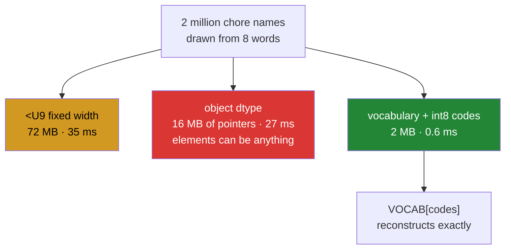

# 2.4 — Where text does not belong — `object` dtype, and the integer codes that replace it

## One-line answer

A NumPy text column is either fixed-width and wasteful, or `object` and no longer really an array — and
the answer that is actually right for a repeated vocabulary is neither: store each distinct string once
and an integer code per row.

---

## The story

The flat has been keeping the chore chart for a year now. Fifty-two weeks, five people, and every entry
is one of the same eight job names.

Somebody works out how much they have written. The word "recycling" has been written down about sixty
times. So has "bathroom". Across the year they have hand-copied the same eight words, over and over,
roughly two thousand times.

Which is silly, and everybody who has ever kept a list like this eventually does the obvious thing: number
the jobs one to eight, write the numbering once at the top of the page, and put numbers in the boxes.

The page gets much smaller, and nothing at all is lost — the eight names are still there, written once,
and every box still says exactly which job it was.

---

## The idea in plain language

[2.1](2.1-fixed-width-text.md) showed the cost of fixed-width text: every element pays for the longest
one, at four bytes per character. A column of a million chore names at `<U9` is 36 MB to store eight
distinct words.

NumPy's escape hatch is `dtype=object`. An object array stores **pointers to Python objects** rather than
the values themselves, so each element costs 8 bytes regardless of the string's length and the strings
live wherever Python put them. There is no width and therefore no truncation.

It solves the problem and costs almost everything an array is for. An `object` array cannot use a compiled
loop, because each element is an arbitrary Python object that has to be looked at individually. Operations
on it run at Python speed. The elements can be **anything**, so a `None` or an integer can hide in a
column of strings and nothing will complain until something downstream falls over. And the memory figure
is a lie: `nbytes` counts only the pointers, not the objects they point at.

So both NumPy options are bad, in opposite directions, and the correct answer is a third thing.

**Store each distinct value once, and an integer code per row.** That is exactly
`np.unique(values, return_inverse=True)`
([Day 23, 4.2](../../../day-23-ufuncs-and-statistics/parts/04-counting/4.2-unique.md)): the `values` array
is the vocabulary, the `inverse` array is one small integer per row, and `values[inverse]` reconstructs
the original exactly. Eight distinct chore names and a million rows becomes eight strings plus a million
`int8`s — one megabyte instead of thirty-six.

This has a name in every context it appears in. It is a **categorical** column in pandas and in Arrow, a
**dimension table** in a data warehouse, a **vocabulary** in natural language processing, and **dictionary
encoding** in a columnar file format. All four are this move.

The benefit is not only memory. Comparing integers is one instruction on a small value; comparing text
walks characters over a much larger array. Grouping, joining, sorting and filtering all become integer
work. The measurement in the mechanism section below puts the comparison at roughly sixty times faster,
and the gap comes from both effects at once.

The cost is a layer of indirection. Anything a human reads has to be mapped back through the vocabulary,
and **the vocabulary has to be fitted once and reused** — deriving it separately for two datasets shifts
every code when a category is missing from one of them, which is the leak
[Day 23, 4.2](../../../day-23-ufuncs-and-statistics/parts/04-counting/4.2-unique.md) warned about.

**When is fixed-width text still right?** When the values are short, of similar length, and mostly
distinct — identifiers, country codes, hashes. Then there is no repeated vocabulary to exploit and the
fixed width is not wasteful. Everything else with a repeating vocabulary wants codes.

---

## Why Setu needs it

- **[5.1](../05-the-module/5.1-the-chores-module.md)** stores the chart as packed bits plus a vocabulary
  of names, which is this decision made concretely.
- **Day 26 onwards**, pandas' `category` dtype is exactly this, and knowing what it replaces is what makes
  its cost model obvious rather than magical.
- **Day 76's encoding** turns categorical features into numbers for a model, and the leak it can cause —
  fitting the mapping on the whole dataset rather than the training split — is the one named above.
- **Day 117's NLP phase** builds a vocabulary and converts every token to an integer identifier before any
  model sees it, for exactly the reasons in this document.
- **Day 155's vector stores** keep document identifiers as integers and the text elsewhere, because the
  index does arithmetic and the text is only needed at the very end.

---

## The mechanism

The three ways to hold the same column:

```python
import sys

import numpy as np

VOCAB = np.array(
    ["bins", "hoover", "dishes", "bathroom", "shopping", "recycling", "windows", "post"]
)
rng = np.random.default_rng(20260902)
codes = rng.integers(0, VOCAB.size, size=2_000_000)

fixed = VOCAB[codes]
obj = fixed.astype(object)
small = codes.astype(np.int8)

print("fixed dtype   :", fixed.dtype, "nbytes", f"{fixed.nbytes:,}")
print("object nbytes :", f"{obj.nbytes:,}", "(pointers only)")
print("object real   :", f"{obj.nbytes + sum(sys.getsizeof(s) for s in VOCAB.tolist()):,}")
print("codes int8    :", f"{small.nbytes:,}")
print("vocabulary    :", VOCAB.nbytes, "bytes for", VOCAB.size, "names")
```

**Line by line:**

- `VOCAB[codes]` — building the text column **from** codes, which is the honest way to make two million
  rows drawn from eight names. It is also, quietly, the whole answer: the code array already existed.
- `fixed.dtype` — `<U9`, set by "recycling" ([2.1](2.1-fixed-width-text.md)), so every one of the two
  million elements occupies 36 bytes.
- `fixed.nbytes` — 72 million bytes. **Seventy-two megabytes to hold eight distinct words.**
- `obj.nbytes` — 16 million: two million pointers at 8 bytes each. This number is what people quote when
  they say `object` saves memory, and it is only counting the pointers.
- `sum(sys.getsizeof(s) for s in VOCAB.tolist())` — the actual strings, added in. Here they are shared, so
  eight objects cover all two million rows and the total barely moves. **That sharing is not guaranteed**:
  strings read from a file are usually separate objects, and then the real total is two million string
  objects of about 50 bytes each, which is more than the fixed-width version.
- `small.nbytes` — 2 million. `int8` because there are eight categories and eight fits comfortably in a
  byte; a vocabulary above 127 needs `int16`
  ([Day 20, 2.2](../../../day-20-arrays-and-dtypes/parts/02-dtypes/2.2-integers-and-the-silent-wrap.md)).
- `VOCAB.nbytes` — the vocabulary is 288 bytes and is stored once. **The total for the coded form is
  2 000 288 bytes against 72 000 000**, a thirty-six-fold saving.

```text
fixed dtype   : <U9 nbytes 72,000,000
object nbytes : 16,000,000 (pointers only)
object real   : 16,000,380
codes int8    : 2,000,000
vocabulary    : 288 bytes for 8 names
```

Now the speed, on the same three:

```python
import timeit

import numpy as np

VOCAB = np.array(
    ["bins", "hoover", "dishes", "bathroom", "shopping", "recycling", "windows", "post"]
)
rng = np.random.default_rng(20260902)
codes = rng.integers(0, VOCAB.size, size=2_000_000)
fixed = VOCAB[codes]
obj = fixed.astype(object)
small = codes.astype(np.int8)

t_fixed = min(timeit.repeat(lambda: fixed == "bins", number=3, repeat=3)) / 3
t_obj = min(timeit.repeat(lambda: obj == "bins", number=3, repeat=3)) / 3
t_code = min(timeit.repeat(lambda: small == 0, number=3, repeat=3)) / 3

print(f"fixed  == : {t_fixed * 1000:7.2f} ms")
print(f"object == : {t_obj * 1000:7.2f} ms")
print(f"int8   == : {t_code * 1000:7.2f} ms")
print(f"fixed/code: {t_fixed / t_code:.0f}x   object/code: {t_obj / t_code:.0f}x")
```

**Line by line:**

- The same question — "which rows are the bins job" — asked of all three representations, so the times are
  comparable.
- `small == 0` — the coded version compares against the **code**, not the name. That translation happens
  once, when the filter is set up, rather than two million times.
- `min(timeit.repeat(...))` with `/ 3` — the fastest of three runs of three executions, divided back to
  one ([Day 23, 3.3](../../../day-23-ufuncs-and-statistics/parts/03-sorting-and-searching/3.3-top-k-and-argpartition.md)).
- The ratios printed rather than left to the reader — the numbers move between machines and the **ratio**
  is the finding.

```text
fixed  == :   35.05 ms
object == :   27.20 ms
int8   == :    0.61 ms
fixed/code: 58x   object/code: 45x
```

Fifty-eight times faster, thirty-six times smaller, and nothing about the data has been lost. Note also
that `object` beat fixed-width here — comparing eight-byte pointers against a handful of shared string
objects is less memory traffic than walking 36-byte elements — which is a real result and not a reason to
choose `object`.

The three representations:



And the round trip that makes the green box safe:

```python
import numpy as np

raw = np.array(["bins", "hoover", "bins", "dishes", "bins", "hoover"])
vocabulary, codes = np.unique(raw, return_inverse=True)

print("raw        :", raw)
print("vocabulary :", vocabulary)
print("codes      :", codes, codes.dtype)
print("as int8    :", codes.astype(np.int8).nbytes, "bytes against", raw.nbytes)
print("rebuilt    :", vocabulary[codes])
print("exact      :", np.array_equal(vocabulary[codes], raw))
print("filter     :", np.count_nonzero(codes == np.searchsorted(vocabulary, "bins")))
```

**Line by line:**

- `np.unique(raw, return_inverse=True)` — **the whole encoding in one call**. The vocabulary comes back
  sorted, which is a property worth relying on
  ([Day 23, 4.2](../../../day-23-ufuncs-and-statistics/parts/04-counting/4.2-unique.md)).
- `codes.dtype` — `int64` by default, which is eight times larger than it needs to be for a
  three-word vocabulary. **Casting down is a deliberate step**, not something `unique` does for you.
- `codes.astype(np.int8).nbytes` against `raw.nbytes` — 6 bytes against 144 on this tiny example, and the
  ratio only improves as the row count grows because the vocabulary stops mattering.
- `vocabulary[codes]` — the reconstruction, by fancy indexing
  ([Day 21, 4.1](../../../day-21-indexing-and-views/parts/04-fancy-indexing/4.1-a-list-of-positions.md)).
  This is the operation that makes codes safe to use: nothing was thrown away.
- `np.array_equal(...)` — asserted rather than assumed, because "lossless" is a claim and this is the one
  line that checks it.
- `np.searchsorted(vocabulary, "bins")` — translating a **name** into a **code** once, so the filter on
  the next line is integer work. The binary search is valid because `unique` returns sorted values
  ([Day 23, 3.5](../../../day-23-ufuncs-and-statistics/parts/03-sorting-and-searching/3.5-searchsorted.md)).
  **This is the line that keeps the API in names and the work in integers.**

```text
raw        : ['bins' 'hoover' 'bins' 'dishes' 'bins' 'hoover']
vocabulary : ['bins' 'dishes' 'hoover']
codes      : [0 2 0 1 0 2] int64
as int8    : 6 bytes against 144
rebuilt    : ['bins' 'hoover' 'bins' 'dishes' 'bins' 'hoover']
exact      : True
filter     : 3
```

---

## When it breaks

**An object array holding something that is not a string:**

```text
$ uv run python -c "
import numpy as np
col = np.array(['bins', 'hoover', None, 'dishes'], dtype=object)
print('dtype   :', col.dtype)
print('array   :', col)
print('nbytes  :', col.nbytes, '<- pointers only')
print('equal   :', col == 'bins')
print('lower   :', end=' ')
try:
    print(np.strings.lower(col))
except Exception as e:
    print(type(e).__name__, ':', e)
"
dtype   : object
array   : ['bins' 'hoover' None 'dishes']
nbytes  : 32 <- pointers only
equal   : [ True False False False]
lower   : TypeError : string operation on non-string array
```

**What it means.** `None` sat in a column of strings without a word of complaint, because an `object`
array will hold anything. The comparison still worked, returning `False` for the `None`, so any code that
only filters keeps running happily. The failure arrives later and somewhere else — here at
`np.strings.lower`, in a real pipeline usually at a `.strip()` inside a loop, hundreds of lines from where
the `None` entered. **A fixed-width array could not have held that value at all**, which is the one real
advantage it has over `object`.

**Codes derived twice from different data:**

```text
$ uv run python -c "
import numpy as np
train = np.array(['bins', 'dishes', 'hoover', 'bins'])
test = np.array(['bins', 'hoover'])
train_vocab, train_codes = np.unique(train, return_inverse=True)
test_vocab, test_codes = np.unique(test, return_inverse=True)
print('train vocab :', train_vocab)
print('test vocab  :', test_vocab)
print('bins code   :', train_codes[0], 'in train,', test_codes[0], 'in test')
print('hoover code :', train_codes[2], 'in train,', test_codes[1], 'in test')
"
train vocab : ['bins' 'dishes' 'hoover']
test vocab  : ['bins' 'hoover']
bins code   : 0 in train, 0 in test
hoover code : 2 in train, 1 in test
```

**What it means.** "dishes" never appeared in the test data, so the test vocabulary is one shorter and
**every code above the gap is shifted by one**. "hoover" is 2 in training and 1 in testing. A model
trained on the first set and given the second is being told hoover jobs are dishes jobs, for every single
row, with no error anywhere. The fix is to fit the vocabulary **once**, on the training split, and apply
it — never to re-derive it. This is the same leakage discipline as fitting a scaler
([Day 22, 5.1](../../../day-22-broadcasting-and-shape/parts/05-the-module/5.1-mean-centring-the-month.md)).

**A vocabulary that outgrew its code dtype:**

```text
$ uv run python -c "
import numpy as np
codes = np.arange(200)
print('as int8  :', codes.astype(np.int8)[:5], '...', codes.astype(np.int8)[-5:])
print('max int8 :', np.iinfo(np.int8).max)
print('distinct :', np.unique(codes.astype(np.int8)).size, 'of', codes.size)
"
as int8  : [0 1 2 3 4] ... [-61 -60 -59 -58 -57]
max int8 : 127
distinct : 200
```

**What it means.** A vocabulary of two hundred categories cast to `int8` wraps past 127 and comes back
negative ([Day 20, 2.2](../../../day-20-arrays-and-dtypes/parts/02-dtypes/2.2-integers-and-the-silent-wrap.md)).
The count of distinct values happens to survive here, which is the sort of accident that makes a sanity
check pass. Using those codes to index the vocabulary gives negative positions, which count from the end
and return real category names for the wrong rows
([1.3](../01-bits/1.3-tilde-on-bool-and-int.md)). **Choose the code dtype from the vocabulary size and
assert it**, rather than picking `int8` because the vocabulary was small when the code was written.

---

## In production

**What a professional writes instead of the teaching version.** The vocabulary is a fitted object, applied
rather than re-derived:

```python
from __future__ import annotations

from dataclasses import dataclass

import numpy as np

UNKNOWN = -1


@dataclass(frozen=True, slots=True)
class Vocabulary:
    """A fitted mapping from names to integer codes.

    Fit ONCE, on the training split, then apply. Re-deriving the mapping for a second
    dataset shifts every code above any category the second dataset happens to lack.
    """

    names: np.ndarray

    @classmethod
    def fit(cls, values: np.ndarray) -> "Vocabulary":
        return cls(names=np.unique(np.strings.lower(np.strings.strip(values))))

    @property
    def code_dtype(self) -> np.dtype:
        """The narrowest signed dtype that holds every code and the UNKNOWN sentinel."""
        for candidate in (np.int8, np.int16, np.int32):
            if self.names.size <= np.iinfo(candidate).max:
                return np.dtype(candidate)
        return np.dtype(np.int64)

    def encode(self, values: np.ndarray) -> np.ndarray:
        """Codes for ``values``. Names not in the vocabulary become UNKNOWN."""
        clean = np.strings.lower(np.strings.strip(values))
        position = np.searchsorted(self.names, clean)
        position = np.clip(position, 0, self.names.size - 1)
        found = self.names[position] == clean
        return np.where(found, position, UNKNOWN).astype(self.code_dtype)

    def decode(self, codes: np.ndarray) -> np.ndarray:
        """Names for ``codes``. UNKNOWN decodes to an empty string, never to a real name."""
        safe = np.clip(codes, 0, self.names.size - 1)
        return np.where(codes == UNKNOWN, "", self.names[safe])
```

**Line by line:**

- `fit` as a **classmethod** and `encode` as an instance method — the shape that makes the discipline
  visible. You cannot accidentally re-fit inside `encode`, because `encode` has no code that builds a
  vocabulary.
- The docstring's "Fit ONCE, on the training split" — the second failure block turned into the one
  sentence a maintainer needs.
- `np.unique(normalised)` in `fit` — sorted by construction, which is what makes `searchsorted` legal in
  `encode` ([Day 23, 3.5](../../../day-23-ufuncs-and-statistics/parts/03-sorting-and-searching/3.5-searchsorted.md)).
  Normalising here and in `encode` through the same expression is
  [2.3](2.3-comparison-is-not-a-match.md)'s rule.
- `code_dtype` chosen from the vocabulary size, not hard-coded — the third failure block made impossible.
  It walks from narrowest to widest so the codes are as small as they can safely be.
- **Signed** dtypes throughout, so `UNKNOWN = -1` is representable. An unsigned dtype would wrap `-1` to
  its maximum, which is a valid-looking code
  ([Day 20, 2.2](../../../day-20-arrays-and-dtypes/parts/02-dtypes/2.2-integers-and-the-silent-wrap.md)).
- `np.clip(position, 0, ...)` before the lookup — `searchsorted` can return a position one past the end
  ([Day 23, 3.5](../../../day-23-ufuncs-and-statistics/parts/03-sorting-and-searching/3.5-searchsorted.md)),
  and indexing with it would raise. Clipping first makes the next line's comparison the thing that decides.
- `found = self.names[position] == clean` — **the check that turns "where it would go" into "whether it is
  there"**. Without it, an unknown name silently gets the code of its alphabetical neighbour, which is the
  worst outcome available.
- `np.where(found, position, UNKNOWN)` — the vectorised `if`
  ([Day 23, 1.4](../../../day-23-ufuncs-and-statistics/parts/01-ufuncs/1.4-np-where-the-vectorised-if.md)),
  so unknown names get a sentinel rather than a wrong answer or an exception. Whether that sentinel should
  be tolerated is the caller's decision, and it is visible in the data.
- `decode` clipping and then using `np.where` — an `UNKNOWN` of `-1` would otherwise index the **last**
  name, returning a real category for a row that had none.

**What changes at scale.** The measurements above are the argument, and two things extend them. Integer
codes make every later operation cheaper, not only comparison: grouping is `np.bincount`
([Day 23, 4.3](../../../day-23-ufuncs-and-statistics/parts/04-counting/4.3-bincount.md)), joining is an
integer merge, and sorting is a radix sort rather than a string comparison. And the saving compounds
through the storage stack — a columnar file format applies **dictionary encoding** automatically to a
repeated string column, which is this exact technique, so a Parquet file of chore names is already coded
and reading it into a fixed-width NumPy array undoes work that had been done for you. The one place codes
are the wrong answer is a column of nearly-distinct values: a million distinct identifiers give a
vocabulary as large as the data and a code array on top, which is worse than either plain option. **The
question to ask is the ratio of distinct values to rows**, and the technique wins overwhelmingly when it
is small.

**The failure that only appears with real data.** A recommendation pipeline encoded a category column with
`np.unique(..., return_inverse=True)` inside its feature builder, which ran separately for training and
for serving. For a year both saw all categories and agreed. A new category was introduced that appeared in
training but had no examples in the first day of serving traffic, so the serving vocabulary was one
shorter and every code above it shifted by one. Every prediction that day used the wrong category for
roughly forty per cent of rows. Nothing raised, and the metric drop was blamed on the new category itself.

**The review comment a senior engineer leaves.** *"`np.unique(col, return_inverse=True)` in the transform
step re-derives the vocabulary from whatever this batch contains. Fit it once in training, persist it, and
apply it here — otherwise a missing category shifts every code above it and there is no error. Also please
pick the code dtype from the vocabulary size; `int8` breaks silently at 128 categories."*

**The interview question.** *"How would you store a column of a million repeated category strings?"* Not
as text. Fixed-width NumPy text costs `n × longest × 4` bytes — seventy-two megabytes for two million
rows of eight distinct words — and `object` dtype gives up the compiled loop and lets anything into the
column, including `None`. The right answer is a vocabulary plus integer codes:
`np.unique(values, return_inverse=True)` gives both, `values[inverse]` reconstructs exactly, and the coded
form was about thirty-six times smaller and sixty times faster to filter in a measurement I ran. That is
what a pandas `category`, an Arrow dictionary column, a warehouse dimension table and an NLP vocabulary
all are. The details that show experience: fit the vocabulary **once** and apply it, because re-deriving
it on a second dataset shifts every code above any category the second one lacks — silently, with no
error; choose the code dtype from the vocabulary size and keep it signed so a `-1` unknown sentinel is
representable; and the technique loses when the values are nearly all distinct, so the ratio of distinct
values to rows is the thing to check first.

---

## Check yourself

```bash
uv run python -c "
import numpy as np
raw = np.array(['bins', 'hoover', 'bins', 'dishes', 'bins', 'hoover'])
vocab, codes = np.unique(raw, return_inverse=True)
print('vocabulary :', vocab)
print('codes      :', codes, codes.dtype)
print('bytes text :', raw.nbytes)
print('bytes coded:', codes.astype(np.int8).nbytes, '+', vocab.nbytes, 'vocabulary')
print('rebuilt    :', np.array_equal(vocab[codes], raw))
smaller = np.array(['bins', 'hoover'])
v2, c2 = np.unique(smaller, return_inverse=True)
print('vocab again:', v2)
print('hoover was :', codes[1], 'now', c2[1])
"
```

The last two lines encode `hoover` twice from two datasets and get two different codes. Say what has to be
true for that to be safe, and name the one word in `Vocabulary`'s docstring that prevents it.

**Answer out loud, without scrolling up:**

> Name the three ways to hold a repeated text column, say what each costs, and say what has to be fitted
> once rather than derived twice.

---

**Next:** [3.1 — a dot product is a total](../03-matmul/3.1-a-dot-product-is-a-total.md).
