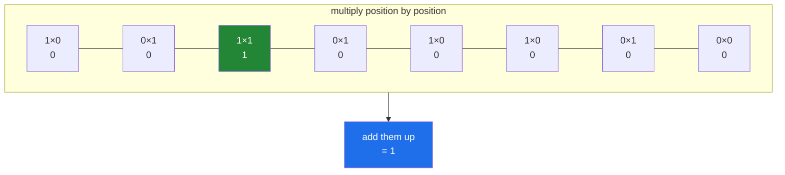

# 3.1 — A dot product is a total

## One-line answer

A **dot product** multiplies two equal-length runs of numbers position by position and adds up the
results — one number out — and every matrix operation in the rest of this section is that same total,
done many times.

---

## The story

Two people in the flat want to know how much they overlap. Not who did more — how much of the same work
they both ended up doing.

They put their two rows of the chart side by side, eight jobs across, and go along them together. For each
job they ask one question: did we **both** do it? Bins — one of us did, the other did not, so no. Hoover —
neither, so no. Dishes — both, so yes, that is one.

At the end they have counted the yeses. One job in common.

Nothing clever happened. They walked two rows in step, produced one small answer per position, and added
those answers up. The interesting part is that the *same* walk answers a completely different question if
the rows hold something other than ticks. Put prices in one row and quantities in the other, walk them the
same way, and the total at the end is a bill.

---

## The idea in plain language

A **dot product** of two equal-length runs of numbers is: multiply the first pair, multiply the second
pair, and so on, then add all the products together. One number comes out.

For the two chore rows it is exactly the counting above. `1 × 1` is 1 and every other combination is 0, so
multiplying position by position gives a 1 only where **both** rows had a tick — and adding those up
counts the shared jobs. Multiplication is doing the work of "and", and the sum is doing the counting.

That is the first thing to notice about the dot product: **it is one operation that answers several
questions, depending on what the numbers mean.**

- Two rows of ticks: how many things they share.
- Prices and quantities: the total bill.
- A row of values and a row of weights: a weighted average, before dividing.
- Two direction arrows: how much they point the same way, which is what a similarity score is.

The last one is why this operation matters more than any other in this curriculum. On Day 155 a document
becomes a long row of numbers, and "how similar are these two documents" is answered by a dot product of
their rows. The chore-overlap count and the similarity score are the same arithmetic.

NumPy spells it three ways and they agree for one-dimensional inputs: `np.dot(a, b)`, `a @ b`, and
`(a * b).sum()`. The third is the definition written out, and it is worth doing once so the other two stop
being magic. The first two are not identical in general — they part company on arrays with more axes,
which is [3.3](3.3-at-matmul-and-dot.md).

Two properties are worth having in advance.

**The lengths must match.** There is no broadcasting here; two rows of different lengths have no
positions to pair up, and NumPy raises.

**The answer is a single number**, not an array. A dot product is a **reduction**
([Day 23, 2.1](../../../day-23-ufuncs-and-statistics/parts/02-statistics/2.1-a-reduction-turns-many-into-one.md)),
so it collapses and loses information deliberately: the total tells you nothing about which positions
contributed.

---

## Why Setu needs it

- **[3.2](3.2-matmul-by-hand.md)** builds the whole matrix product out of this one operation, repeated
  once per pair of rows and columns. Nothing else is added.
- **[5.1](../05-the-module/5.1-the-chores-module.md)** scores every pair of flatmates against every other,
  which is this operation done twenty-five times by one `@`.
- **Day 155's cosine similarity** is a dot product of two normalised rows, and it is the reason
  `NP-09` sits this early in the plan.
- **Day 91's linear regression** predicts with a dot product of the features and the coefficients, which
  is the entire model at prediction time.
- **Day 125's neural network layer** is a matrix product, which is a grid of dot products
  ([3.6](3.6-every-neural-layer.md)).

---

## The mechanism

Two rows of the chart, walked together:

```python
import numpy as np

CHORES = np.array(
    ["bins", "hoover", "dishes", "bathroom", "shopping", "recycling", "windows", "post"]
)
did = np.array(
    [
        [1, 0, 1, 0, 1, 1, 0, 0],
        [0, 1, 1, 1, 0, 0, 1, 0],
        [1, 1, 0, 0, 1, 0, 0, 1],
        [0, 0, 1, 1, 0, 1, 1, 1],
        [1, 0, 0, 1, 1, 0, 1, 0],
    ]
)
first, second = did[0], did[1]

print("first       :", first)
print("second      :", second)
print("elementwise :", first * second)
print("which job   :", CHORES[(first * second) == 1])
print("np.dot      :", np.dot(first, second))
print("first @ sec :", first @ second)
print("sum form    :", (first * second).sum())
print("shape out   :", np.shape(first @ second))
```

**Line by line:**

- `did` built without `dtype=bool` this time — as **integers**, because a dot product multiplies and adds,
  and the point of this document is that the arithmetic is doing the logic. On booleans `@` runs happily
  and gives a completely different kind of answer, which is the second failure block below.
- `first * second` — the elementwise product
  ([Day 23, 1.1](../../../day-23-ufuncs-and-statistics/parts/01-ufuncs/1.1-one-operation-every-element.md)).
  **This is the intermediate step the dot product never shows you**, and printing it is the only way to see
  that multiplication is acting as "and": `1 × 1` is 1, everything else is 0.
- `CHORES[(first * second) == 1]` — naming the position that survived. One job, dishes, and it is the
  answer both people would have given by eye.
- `np.dot(first, second)` — `1`. The whole walk in one call.
- `first @ second` — the same `1`. The `@` operator exists for exactly this and reads better in a formula.
- `(first * second).sum()` — `1` again, and this is the **definition**: multiply, then sum
  ([Day 23, 2.1](../../../day-23-ufuncs-and-statistics/parts/02-statistics/2.1-a-reduction-turns-many-into-one.md)).
  Anybody who can write this line does not need to memorise what a dot product is.
- `np.shape(first @ second)` — `()`, the empty tuple, meaning a single number rather than an array. **The
  reduction, confirmed by its shape.**

```text
first       : [1 0 1 0 1 1 0 0]
second      : [0 1 1 1 0 0 1 0]
elementwise : [0 0 1 0 0 0 0 0]
which job   : ['dishes']
np.dot      : 1
first @ sec : 1
sum form    : 1
shape out   : ()
```

The walk, one position at a time:



Only the green position contributed. Everywhere else, one of the two people did not do that job, so the
product is zero and the sum ignores it.

Now the same operation answering a different question — the shopping bill:

```python
import numpy as np

ITEMS = np.array(["milk", "bread", "eggs"])
prices = np.array([1.20, 1.40, 2.60])
quantity = np.array([2, 1, 1])

print("items    :", ITEMS)
print("prices   :", prices)
print("quantity :", quantity)
print("each line:", prices * quantity)
print("total    :", prices @ quantity)
print("check    :", 2 * 1.20 + 1 * 1.40 + 1 * 2.60)
```

**Line by line:**

- The same shape of data as the chore rows — two equal-length runs — with completely different meanings.
  **Nothing about the operation changes.**
- `prices * quantity` — the per-line costs, `[2.40 1.40 2.60]`. This is the receipt before the total, and
  it is the same intermediate the chore version had.
- `prices @ quantity` — the bill. One number, 6.40.
- The `check` line, computed by hand in Python — worth writing once, because seeing `@` and longhand
  arithmetic agree is what makes the operator stop feeling like a black box.
- Note the dtypes: `prices` is float and `quantity` is integer, and the result is float. The multiplication
  promotes, exactly as any ufunc would
  ([Day 20, 2.5](../../../day-20-arrays-and-dtypes/parts/02-dtypes/2.5-nep-50-and-the-python-number.md)).

```text
items    : ['milk' 'bread' 'eggs']
prices   : [1.2 1.4 2.6]
quantity : [2 1 1]
each line: [2.4 1.4 2.6]
total    : 6.4
check    : 6.4
```

Two runs of numbers, one operation, and a bill instead of an overlap count. **Nothing about `@` knew the
difference.**

---

## When it breaks

**Lengths that do not match:**

```text
$ uv run python -c "
import numpy as np
np.array([1, 2, 3]) @ np.array([1, 2])
"
Traceback (most recent call last):
  File "<string>", line 3, in <module>
ValueError: matmul: Input operand 1 has a mismatch in its core dimension 0, with gufunc signature (n?,k),(k,m?)->(n?,m?) (size 2 is different from 3)
```

**What it means.** Three positions cannot be paired with two. The message is dense because `@` is defined
by a general signature — `(n?,k),(k,m?)->(n?,m?)` — where the `k` on both sides is the dimension that has
to agree, and the `?` marks axes that may be absent for one-dimensional input. Read past the notation to
the parenthesis at the end: **size 2 is different from 3**, and that is the whole message. Unlike
arithmetic ufuncs, `@` does not broadcast the shorter operand
([Day 22, 1.2](../../../day-22-broadcasting-and-shape/parts/01-broadcasting/1.2-the-rule-in-three-lines.md));
there is no sensible way to pair up runs of different lengths.

**Booleans — the one that does not raise and is still wrong:**

```text
$ uv run python -c "
import numpy as np
a = np.array([True, True, True])
b = np.array([True, True, True])
print('elementwise  :', a * b)
print('sum of that  :', (a * b).sum())
print('a @ b        :', repr(a @ b))
print('as integers  :', repr(a.astype(np.int8) @ b.astype(np.int8)))
"
elementwise  : [ True  True  True]
sum of that  : 3
a @ b        : np.True_
as integers  : np.int8(3)
```

**What it means.** Three positions overlap and `a @ b` says `True`. It does not raise and it is not `3`.
The accumulation happens **in the input dtype**, and adding booleans in boolean arithmetic saturates:
`True + True` is `True`, so the sum stops meaning "how many" and starts meaning "any". Casting to `int8`
first gives the count.

On a whole chart this is spectacular:

```text
$ uv run python -c "
import numpy as np
did = np.array([[1,0,1,0,1,1,0,0],[0,1,1,1,0,0,1,0],[1,1,0,0,1,0,0,1],
                [0,0,1,1,0,1,1,1],[1,0,0,1,1,0,1,0]], dtype=bool)
print('bool matmul:'); print(did @ did.T)
print('int  matmul:'); print(did.astype(np.int64) @ did.astype(np.int64).T)
"
bool matmul:
[[ True  True  True  True  True]
 [ True  True  True  True  True]
 [ True  True  True  True  True]
 [ True  True  True  True  True]
 [ True  True  True  True  True]]
int  matmul:
[[4 1 2 2 2]
 [1 4 1 3 2]
 [2 1 4 1 2]
 [2 3 1 5 2]
 [2 2 2 2 4]]
```

Every pair of flatmates shares at least one job, so every entry of the boolean version is `True` and the
grid carries no information at all. The integer version is the answer. **This is why the chart in the
mechanism section is built as integers**: `dtype=bool` is right for masking and wrong for anything that
adds, and `@` is the operation where that goes wrong without a word
([Day 23, 4.1](../../../day-23-ufuncs-and-statistics/parts/04-counting/4.1-count-nonzero-and-the-mask.md)).

**A dot product of two-dimensional input:**

```text
$ uv run python -c "
import numpy as np
grid = np.array([[1, 0, 1], [0, 1, 1]])
row = np.array([1, 1, 0])
print('grid shape :', grid.shape)
print('grid @ row :', grid @ row, 'shape', (grid @ row).shape)
print('row @ grid :', end=' ')
try:
    print(row @ grid)
except Exception as e:
    print(type(e).__name__, ':', e)
"
grid shape : (2, 3)
grid @ row : [1 1] shape (2,)
row @ grid : ValueError : matmul: Input operand 1 has a mismatch in its core dimension 0, with gufunc signature (n?,k),(k,m?)->(n?,m?) (size 2 is different from 3)
```

**What it means.** `grid @ row` worked and gave **two** numbers: one dot product per row of the grid. That
is the first step towards [3.2](3.2-matmul-by-hand.md) and it is what makes `@` more than a single dot
product. `row @ grid` failed, because the order decides which axes have to agree: the last axis of the
left operand must match the first axis of the right. **`@` is not commutative**, and unlike `*` it will
tell you so.

---

## In production

**What a professional writes instead of the teaching version.** The dot product is rarely called on its
own — but when it is, the shape and the dtype are checked, because the operator will happily pair up two
runs that mean different things:

```python
from __future__ import annotations

import numpy as np


def weighted_total(values: np.ndarray, weights: np.ndarray) -> float:
    """Sum of ``values`` scaled by ``weights``, elementwise.

    Both must be 1-D and the same length: there is no broadcasting here, and a length
    mismatch is a sign the two arrays came from different sources rather than something
    to pad around.
    """
    if values.ndim != 1 or weights.ndim != 1:
        raise ValueError(f"expected 1-D, got shapes {values.shape} and {weights.shape}")
    if values.shape != weights.shape:
        raise ValueError(f"length mismatch: {values.size} values, {weights.size} weights")
    return float(np.dot(values.astype(np.float64), weights))


def overlap(a: np.ndarray, b: np.ndarray) -> int:
    """How many positions are set in both boolean rows."""
    if a.dtype != np.bool_ or b.dtype != np.bool_:
        raise TypeError(f"expected boolean rows, got {a.dtype} and {b.dtype}")
    return int(np.count_nonzero(a & b))
```

**Line by line:**

- Two functions rather than one — the same arithmetic, two meanings, and giving each its own name is what
  stops a caller passing a boolean mask where weights were meant.
- `values.ndim != 1` checked before the length — a `(3, 1)` array and a `(3,)` array have the same number
  of elements and `@` would treat them completely differently
  ([3.3](3.3-at-matmul-and-dot.md)). Checking `ndim` first makes the shape error say the useful thing.
- The length message naming both sizes — "3 values, 2 weights" identifies which array is wrong; NumPy's
  own message needs the gufunc signature decoded first.
- `values.astype(np.float64)` — **the accumulation dtype, stated**. A dot product is a sum, so it drifts on
  large `float32` inputs exactly as any other sum does
  ([Day 23, 2.6](../../../day-23-ufuncs-and-statistics/parts/02-statistics/2.6-float-summation-and-the-drift.md)).
  `np.dot` has no `dtype=` argument, so widening the input is the only way to widen the accumulator — and
  it does cost a copy, which is the trade.
- `float(...)` at the boundary
  ([Day 20, 2.5](../../../day-20-arrays-and-dtypes/parts/02-dtypes/2.5-nep-50-and-the-python-number.md)).
- `overlap` using `a & b` and `count_nonzero` rather than `a @ b` — **the same answer, and the better
  spelling** for booleans. It says "and, then count" instead of "multiply, then add", which is what the
  question actually is, and it avoids the dtype promotion that `@` performs
  ([Day 23, 4.1](../../../day-23-ufuncs-and-statistics/parts/04-counting/4.1-count-nonzero-and-the-mask.md)).

**What changes at scale.** A dot product is `n` multiplications and `n` additions, so it is linear and
cheap — but it is memory-bound rather than compute-bound, because every value has to be read once and
almost nothing is done with it. Three consequences. On large `float32` vectors the accumulation drifts,
and unlike `np.sum` there is no `dtype=` to widen it, so the input has to be cast first
([Day 23, 2.6](../../../day-23-ufuncs-and-statistics/parts/02-statistics/2.6-float-summation-and-the-drift.md)).
Doing many dot products one at a time wastes the memory bandwidth entirely, which is why a similarity
search stacks the candidates into a matrix and does one `@` rather than looping
([3.4](3.4-the-measured-gap.md)) — the same values are read once and used many times. And at the point
where the vectors are long and mostly zeros, as a one-hot or bag-of-words row is, a dense dot product
spends nearly all its time multiplying zeros, and a sparse representation that only stores the non-zeros
is orders of magnitude faster. That is what Day 117's TF-IDF matrix is.

**The failure that only appears with real data.** A scoring service computed a weighted total of features
with `np.dot`. Someone added a feature to the feature list and forgot the weights table, so the two arrays
were different lengths — and the service raised `ValueError` on every request, which was noticed in
minutes. The **second** version of the bug was worse: a later change padded the weights with zeros to
"make the shapes work", which meant every request silently scored on the old feature set while the new
feature was multiplied by zero. That one ran for six weeks.

**The review comment a senior engineer leaves.** *"`np.dot(features, weights)` with no shape check. If
these ever drift you get a `ValueError`, which is fine — but please do not 'fix' that by padding. A length
mismatch here means the feature list and the weight table disagree, and padding turns a loud failure into
a silent one."*

**The interview question.** *"What is a dot product?"* Multiply two equal-length vectors position by
position and add the results, giving one number. It is a reduction, so the answer says nothing about which
positions contributed. The reason it matters is how many questions it answers with the same arithmetic: on
two rows of ticks it counts what they share, on prices and quantities it is a bill, and on two normalised
vectors it is a cosine similarity — which is what every vector search is doing. In NumPy it is `np.dot`,
`a @ b` or `(a * b).sum()`, which agree for 1-D input and diverge for higher dimensions. The details worth
adding: there is **no broadcasting**, so a length mismatch raises rather than padding; `@` is not
commutative and the last axis of the left operand must match the first axis of the right; and `np.dot` has
no `dtype=` argument, so on long `float32` vectors the accumulation drifts and the only fix is to widen the
input first.

---

## Check yourself

```bash
uv run python -c "
import numpy as np
first = np.array([1, 0, 1, 0, 1, 1, 0, 0])
second = np.array([0, 1, 1, 1, 0, 0, 1, 0])
print('elementwise :', first * second)
print('dot         :', first @ second)
print('sum form    :', (first * second).sum())
print('np.dot      :', np.dot(first, second))
print('shape       :', np.shape(first @ second))
print('with itself :', first @ first, '<- how many jobs first did')
print('commutative?:', (first @ second) == (second @ first))
grid = np.array([first, second])
print('grid @ first:', grid @ first)
"
```

The last line gives two numbers from one call. Say what each of them is, and how many dot products NumPy
performed to produce them.

**Answer out loud, without scrolling up:**

> Say the definition of a dot product in one sentence, then give three completely different questions the
> same arithmetic answers depending on what the numbers mean.

---

**Next:** [3.2 — writing `A @ B` by hand](3.2-matmul-by-hand.md).
