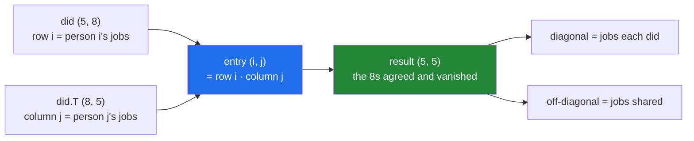

# 3.2 — Writing `A @ B` by hand — three loops, and the shape rule

## One-line answer

A matrix product is a **grid of dot products**: entry `(i, j)` of the answer is row `i` of the left matrix
dotted with column `j` of the right one — which is three nested loops to write and explains the shape rule
completely.

---

## The story

Two flatmates worked out how much they overlap by walking their two rows together
([3.1](3.1-a-dot-product-is-a-total.md)). One number.

Now all five of them want the full picture: how much does everybody overlap with everybody. Not one number
— a grid of them, five across and five down, where the entry in row three, column two says how many jobs
the third person and the second person both did.

There is no new idea in that. It is the same walk, done twenty-five times: once for each pair. Pick a
person, pick another person, walk their two rows together, write the total in the box where their row and
their column meet.

Twenty-five walks, each of eight steps. Two hundred multiplications and two hundred additions, and a
person with a pen could do it in an afternoon.

The grid that comes out has a nice property, and it is worth noticing before doing any of the arithmetic:
the box where somebody meets **themselves** is how many jobs they did in total, because every job they did
they also did.

---

## The idea in plain language

A **matrix** is a rectangular grid of numbers — a two-dimensional array
([Day 20, 1.2](../../../day-20-arrays-and-dtypes/parts/01-the-block/1.2-shape-dtype-and-the-rest.md)).
The chart is one: five rows, eight columns.

The **matrix product** `A @ B` is defined by one sentence: entry `(i, j)` of the result is the dot product
of row `i` of `A` with column `j` of `B`. Nothing else. If you can do a dot product you can do a matrix
product; the only new thing is the bookkeeping about which row and which column.

That definition hands you the shape rule for free, and it is worth deriving rather than memorising. A row
of `A` has as many numbers as `A` has columns. A column of `B` has as many numbers as `B` has rows. A dot
product needs those two to be equal ([3.1](3.1-a-dot-product-is-a-total.md)). Therefore:

> **`A` of shape `(n, k)` times `B` of shape `(k, m)` gives shape `(n, m)`.**

The two `k`s must match, and they **disappear**. Write the shapes side by side — `(n, k)(k, m)` — and the
inner pair has to agree and vanishes, leaving the outer pair. That is the whole rule, and it is why the
error message in [3.1](3.1-a-dot-product-is-a-total.md) talked about a "core dimension".

For the flat's question the two matrices are the chart and the chart **transposed**. `did` is `(5, 8)`;
`did.T` is `(8, 5)` ([Day 22, 3.1](../../../day-22-broadcasting-and-shape/parts/03-transpose/3.1-t-the-axes-swapped.md)).
So `did @ did.T` is `(5, 8)(8, 5)` — the eights agree and vanish — giving `(5, 5)`, one entry per pair of
people. The transpose is doing the work of turning "person two's row" into "person two's column".

Two properties follow from the definition and both matter later.

**Order matters.** `A @ B` and `B @ A` are different operations, and usually one of them is not even legal.
For the chart, `did.T @ did` is `(8, 5)(5, 8)` giving `(8, 8)` — a grid of **chores** rather than people,
saying how often each pair of jobs was done by the same person. Same data, same operator, a different
question entirely.

**It is not elementwise.** `A * B` multiplies matching positions and needs matching shapes; `A @ B`
combines rows with columns and needs the inner shapes to agree. They are unrelated operations that both
use two matrices, and confusing them is the most common matrix mistake there is.

---

## Why Setu needs it

- **[3.3](3.3-at-matmul-and-dot.md) through [3.6](3.6-every-neural-layer.md)** all rest on this definition;
  they are about spellings, speed, batching and use, not about new arithmetic.
- **Principle 2 — from scratch before library.** Writing the triple loop once is what makes `@` a thing you
  understand rather than a thing you trust, and [3.4](3.4-the-measured-gap.md) measures what the library
  gives you for giving it up.
- **[5.1](../05-the-module/5.1-the-chores-module.md)** computes the pair grid with a single `@` and asserts
  it against a hand-written version.
- **Day 125's neural network layer** is `inputs @ weights`, and the shape rule here is the rule that
  decides whether a layer's shapes line up ([3.6](3.6-every-neural-layer.md)).
- **Day 155's similarity search** is one matrix product of a query batch against a document matrix, which
  is `(queries, dims) @ (dims, documents)`.

---

## The mechanism

The definition, written out with nothing hidden:

```python
import numpy as np


def matmul_by_hand(left: np.ndarray, right: np.ndarray) -> np.ndarray:
    """The definition, three loops deep. Entry (i, j) is row i of left dotted with column j of right."""
    n, k = left.shape
    k_right, m = right.shape
    if k != k_right:
        raise ValueError(f"cannot multiply {left.shape} by {right.shape}: {k} != {k_right}")
    out = np.zeros((n, m), dtype=left.dtype)
    for i in range(n):
        for j in range(m):
            total = 0
            for x in range(k):
                total += left[i, x] * right[x, j]
            out[i, j] = total
    return out


did = np.array(
    [
        [1, 0, 1, 0, 1, 1, 0, 0],
        [0, 1, 1, 1, 0, 0, 1, 0],
        [1, 1, 0, 0, 1, 0, 0, 1],
        [0, 0, 1, 1, 0, 1, 1, 1],
        [1, 0, 0, 1, 1, 0, 1, 0],
    ]
)

by_hand = matmul_by_hand(did, did.T)

print("did shape   :", did.shape, " did.T shape :", did.T.shape)
print("result shape:", by_hand.shape)
print("by hand     :")
print(by_hand)
print("matches @   :", np.array_equal(by_hand, did @ did.T))
print("diagonal    :", np.diag(by_hand))
print("row sums    :", did.sum(axis=1))
```

**Line by line:**

- `n, k = left.shape` and `k_right, m = right.shape` — the four numbers of the shape rule, unpacked into
  names that match it. **Naming them is most of the explanation**: after this the loop bounds write
  themselves.
- `if k != k_right` — the rule checked before any work, with a message naming both shapes. NumPy's own
  message is correct and mentions a gufunc signature
  ([3.1](3.1-a-dot-product-is-a-total.md)); this one names the two numbers that disagree.
- `np.zeros((n, m), dtype=left.dtype)` — the output shape comes straight from the rule, and the dtype is
  inherited so an integer chart gives integer counts rather than floats.
- `for i in range(n)` — over the **rows of the left**. Each pass fills one row of the answer.
- `for j in range(m)` — over the **columns of the right**. Each pass fills one entry.
- `for x in range(k)` — the dot product itself, the innermost loop, running over the dimension that
  disappears. **This loop is `k` long and executes `n × m` times**, which is where the cost comes from and
  is the number [3.4](3.4-the-measured-gap.md) is about.
- `total += left[i, x] * right[x, j]` — the one line of arithmetic in the whole function. Note the index
  pattern: `x` moves **across** the left and **down** the right, which is the row-meets-column shape of the
  definition, written in indices.
- `did @ did.T` — the library version, compared with `np.array_equal`. **This is the assertion that
  Principle 2 exists for**: the hand version is a claim about what `@` does, and this line checks it.
- `np.diag(by_hand)` against `did.sum(axis=1)` — the diagonal is each person dotted with themselves, which
  counts the jobs they did ([Day 23, 2.2](../../../day-23-ufuncs-and-statistics/parts/02-statistics/2.2-axis-the-one-that-disappears.md)).
  The two lines agreeing is a second, independent check on the whole function.

```text
did shape   : (5, 8)  did.T shape : (8, 5)
result shape: (5, 5)
by hand     :
[[4 1 2 2 2]
 [1 4 1 3 2]
 [2 1 4 1 2]
 [2 3 1 5 2]
 [2 2 2 2 4]]
matches @   : True
diagonal    : [4 4 4 5 4]
row sums    : [4 4 4 5 4]
```

The grid is **symmetric** — entry `(1, 3)` and entry `(3, 1)` are both 3 — which they have to be, because
"how many jobs did we both do" does not depend on which of the two people you ask. That symmetry is a
property of `A @ A.T` specifically and is worth using as a check.

Where each entry comes from:



Now the other order, which is legal and answers something else:

```python
import numpy as np

CHORES = np.array(
    ["bins", "hoover", "dishes", "bathroom", "shopping", "recycling", "windows", "post"]
)
did = np.array(
    [
        [1, 0, 1, 0, 1, 1, 0, 0],
        [0, 1, 1, 1, 0, 0, 1, 0],
        [1, 1, 0, 0, 1, 0, 0, 1],
        [0, 0, 1, 1, 0, 1, 1, 1],
        [1, 0, 0, 1, 1, 0, 1, 0],
    ]
)

people = did @ did.T
chores = did.T @ did

print("did @ did.T shape :", people.shape, "- a grid of people")
print("did.T @ did shape :", chores.shape, "- a grid of chores")
print("chore grid diag   :", np.diag(chores))
print("times done        :", did.sum(axis=0))
print("bins with dishes  :", chores[0, 2])
print("elementwise?      :", (did * did).shape, "- a different operation entirely")
```

**Line by line:**

- `did @ did.T` against `did.T @ did` — **the same two matrices, both orders, both legal, different
  shapes**. `(5,8)(8,5)` gives `(5,5)`; `(8,5)(5,8)` gives `(8,8)`. The shape rule predicts both without
  running anything.
- `np.diag(chores)` against `did.sum(axis=0)` — the chore grid's diagonal is how many people did each
  chore, which is a column sum of the original
  ([Day 23, 2.2](../../../day-23-ufuncs-and-statistics/parts/02-statistics/2.2-axis-the-one-that-disappears.md)).
  Same check as before, on the other axis.
- `chores[0, 2]` — how many people did **both** bins and dishes. This is a co-occurrence count, and it is
  the shape of question that recommendation systems and market-basket analysis are built on.
- `(did * did).shape` — `(5, 8)`, the original shape, because `*` is elementwise and squares every entry in
  place ([Day 23, 1.1](../../../day-23-ufuncs-and-statistics/parts/01-ufuncs/1.1-one-operation-every-element.md)).
  **Printing it beside the two matrix products is the cheapest way to keep `*` and `@` separate**: two
  operators, three completely different shapes.

```text
did @ did.T shape : (5, 5) - a grid of people
did.T @ did shape : (8, 8) - a grid of chores
chore grid diag   : [3 2 3 3 3 2 3 2]
times done        : [3 2 3 3 3 2 3 2]
bins with dishes  : 1
elementwise?      : (5, 8) - a different operation entirely
```

Only one person did both bins and dishes. And note the last line: `did * did` kept the original shape, so
the two operators on the same pair of arrays produce `(5, 5)`, `(8, 8)` and `(5, 8)`.

---

## When it breaks

**The inner dimensions disagreeing:**

```text
$ uv run python -c "
import numpy as np
did = np.ones((5, 8))
other = np.ones((7, 5))
print('shapes :', did.shape, other.shape)
did @ other
"
shapes : (5, 8) (7, 5)
Traceback (most recent call last):
  File "<string>", line 5, in <module>
ValueError: matmul: Input operand 1 has a mismatch in its core dimension 0, with gufunc signature (n?,k),(k,m?)->(n?,m?) (size 7 is different from 8)
```

**What it means.** Write the shapes next to each other — `(5, 8)(7, 5)` — and the inner pair is 8 and 7,
which do not agree. The message says exactly that at the end: **size 7 is different from 8**. Everything
before that parenthesis is the general signature and can be read past. The usual cause is a missing
transpose: `did @ other.T` is `(5, 8)(5, 7)`, which still fails, while `other @ did` is `(7, 5)(5, 8)` and
works. **When the inner dimensions do not match, check whether swapping the operands fixes it** before
reaching for a transpose, because the two produce different answers.

**`*` where `@` was meant:**

```text
$ uv run python -c "
import numpy as np
a = np.array([[1, 2], [3, 4]])
b = np.array([[5, 6], [7, 8]])
print('a * b :'); print(a * b)
print('a @ b :'); print(a @ b)
print('same shape:', (a * b).shape == (a @ b).shape)
"
a * b :
[[ 5 12]
 [21 32]]
a @ b :
[[19 22]
 [43 50]]
same shape: True
```

**What it means.** Two square matrices, two operators, two completely different answers of **the same
shape**. `a * b` multiplied matching positions; `a @ b` combined rows with columns. Nothing raises and no
shape assertion downstream can tell them apart. This is the single most common matrix bug and it is
invisible on square inputs — which is why test fixtures for matrix code should be rectangular, exactly as
they should for axis code
([Day 23, 2.2](../../../day-23-ufuncs-and-statistics/parts/02-statistics/2.2-axis-the-one-that-disappears.md)).
On non-square inputs `*` raises a broadcasting error and the mistake is found immediately.

**A one-dimensional operand, which changes the rule:**

```text
$ uv run python -c "
import numpy as np
grid = np.ones((5, 8))
row = np.ones(8)
column = np.ones((8, 1))
print('grid @ row    :', (grid @ row).shape)
print('grid @ column :', (grid @ column).shape)
print('row is 1-D    :', row.shape, ' column is 2-D:', column.shape)
"
grid @ row    : (5,)
grid @ column : (5, 1)
row is 1-D    : (8,)  column is 2-D: (8, 1)
```

**What it means.** A `(8,)` array and an `(8, 1)` array hold the same eight numbers and give differently
shaped answers. `@` treats a one-dimensional right operand as a column, does the multiplication, and then
**removes** the axis it invented — that is what the `m?` in the gufunc signature means. The `(8, 1)`
version keeps its axis, so the result is `(5, 1)` rather than `(5,)`. Neither is wrong; they differ by one
axis, and that difference propagates into every later broadcast
([Day 22, 1.2](../../../day-22-broadcasting-and-shape/parts/01-broadcasting/1.2-the-rule-in-three-lines.md)).
**Assert the shape after any matrix product with a vector operand**, because a stray trailing `1` turns a
later subtraction into an accidental outer product.

---

## In production

**What a professional writes instead of the teaching version.** Nobody ships the triple loop — but the
shape reasoning it teaches goes into a check, because a matrix product that runs is not a matrix product
that is correct:

```python
from __future__ import annotations

import numpy as np


def pair_overlap(chart: np.ndarray) -> np.ndarray:
    """How many chores each pair of people both did.

    ``chart`` is (people, chores) of 0/1 counts. Returns (people, people), symmetric,
    with each person's own total on the diagonal.
    """
    if chart.ndim != 2:
        raise ValueError(f"expected (people, chores), got shape {chart.shape}")
    if chart.dtype == np.bool_:
        raise TypeError(
            "boolean input: @ accumulates in bool and saturates to True. "
            "Cast to an integer dtype first."
        )
    people, _ = chart.shape
    out = chart @ chart.T
    assert out.shape == (people, people), f"expected {(people, people)}, got {out.shape}"
    return out


def check_symmetry(grid: np.ndarray) -> None:
    """A pair grid must equal its own transpose; a failure means the operands were swapped."""
    if not np.array_equal(grid, grid.T):
        raise ValueError(
            "pair grid is not symmetric - the operands are probably the wrong way round"
        )
```

**Line by line:**

- The docstring stating **both** shapes — `(people, chores)` in and `(people, people)` out. A matrix
  function whose docstring does not name its shapes is a function nobody can call without reading its body.
- `chart.dtype == np.bool_` raising with a message that explains — **this is the failure from
  [3.1](3.1-a-dot-product-is-a-total.md) turned into a guard**. Boolean `@` does not raise and does not
  count; it saturates to `True`. The message names the cause and the fix in one sentence.
- `people, _ = chart.shape` — the number that determines the output shape, unpacked; the chore count is
  discarded with `_` because it vanishes in the product.
- `assert out.shape == (people, people)` — a shape assertion **after** the operation. It cannot fail here,
  which is exactly why it is worth writing: it documents the shape rule at the point of use and it will
  fire the day somebody adds a batch axis to `chart` and forgets what that does.
- `chart @ chart.T` rather than a loop — the library version, now that the definition is understood. The
  transpose is free ([Day 22, 3.1](../../../day-22-broadcasting-and-shape/parts/03-transpose/3.1-t-the-axes-swapped.md)),
  so this allocates only the result.
- `check_symmetry` as a separate function — `A @ A.T` is symmetric by construction, so testing it is
  testing that the second operand really was the transpose of the first. **It catches `chart.T @ chart`
  written by mistake** whenever the two dimensions differ, and it is the cheapest possible test of a matrix
  pipeline.

**What changes at scale.** The triple loop is `n × m × k` multiplications, and that number grows fast: two
matrices of a thousand by a thousand is a **billion** multiply-and-add operations for one `@`. Three things
follow. First, the library version is not a faster loop — it is a fundamentally different implementation
that reorders the work to reuse values already in cache and issues several multiplications per instruction,
which is why the measured gap in [3.4](3.4-the-measured-gap.md) is four orders of magnitude rather than the
ten or twenty you might expect from "compiled versus interpreted". Second, memory is the constraint before
arithmetic is: `(n, k) @ (k, m)` allocates `n × m` output values, so multiplying a hundred thousand
documents against a hundred thousand queries produces ten billion entries regardless of how small `k` is —
which is [Day 22, 1.7](../../../day-22-broadcasting-and-shape/parts/01-broadcasting/1.7-the-broadcast-that-ate-the-memory.md)'s
lesson arriving through a different operator, and the reason batched similarity search chunks its queries.
Third, when the matrices are mostly zeros — a one-hot chart with a thousand chores where each person did
eight — a dense product spends nearly all its time multiplying zeros, and a sparse representation is the
right answer instead.

**The failure that only appears with real data.** A recommendation service computed an item co-occurrence
grid with `chart.T @ chart` and a user-similarity grid with `chart @ chart.T`. During a refactor the two
expressions were swapped. The catalogue happened to have almost exactly as many items as active users, so
both grids came back nearly square and every downstream shape assertion passed. Recommendations became
subtly strange — users were being matched against items and items against users — and it took a fortnight,
because the only clue was that the results were worse rather than broken. A symmetry check would not have
caught this one; a **shape** check naming the expected dimensions would have.

**The review comment a senior engineer leaves.** *"`a * b` here — did you mean `a @ b`? Both are legal on
these shapes and give different answers. If it is the matrix product, please assert the output shape, and
make the test fixture non-square so the two cannot pass the same assertions."*

**The interview question.** *"How is a matrix product defined, and what is the shape rule?"* Entry `(i, j)`
of the result is the dot product of row `i` of the left matrix with column `j` of the right, so `(n, k)`
times `(k, m)` gives `(n, m)` — the inner dimensions must agree and they disappear. The rule is not
arbitrary: a row of the left has `k` numbers and a column of the right has `k` numbers, and a dot product
needs those to match. The details that show experience: it is not elementwise, and on square inputs `*` and
`@` both run and give different answers of the same shape, which is why matrix test fixtures should be
rectangular; the order matters, and `A @ A.T` and `A.T @ A` answer completely different questions about the
same data; a one-dimensional operand has an axis invented and then removed, so `A @ v` and `A @ v[:, None]`
differ by a trailing axis that propagates into every later broadcast; and the cost is `n × m × k`, so the
output size alone can be the constraint long before the arithmetic is.

---

## Check yourself

```bash
uv run python -c "
import numpy as np
did = np.array([[1,0,1,0,1,1,0,0],[0,1,1,1,0,0,1,0],[1,1,0,0,1,0,0,1],
                [0,0,1,1,0,1,1,1],[1,0,0,1,1,0,1,0]])
print('did          :', did.shape)
print('did @ did.T  :', (did @ did.T).shape, '<- (5,8)(8,5)')
print('did.T @ did  :', (did.T @ did).shape, '<- (8,5)(5,8)')
print('did * did    :', (did * did).shape, '<- elementwise')
print('symmetric?   :', np.array_equal(did @ did.T, (did @ did.T).T))
print('diagonal     :', np.diag(did @ did.T))
print('row sums     :', did.sum(axis=1))
print('vector form  :', (did @ np.ones(8)).shape, 'vs', (did @ np.ones((8, 1))).shape)
"
```

Three of those lines produce three different shapes from the same one array. Say which operator and which
order produced each, using the `(n, k)(k, m)` rule out loud.

**Answer out loud, without scrolling up:**

> State the definition of entry `(i, j)` in one sentence. Then say why `(5, 8) @ (7, 5)` fails and whether
> swapping the operands or transposing one of them is the fix.

---

**Next:** [3.3 — `@`, `np.matmul` and `np.dot`](3.3-at-matmul-and-dot.md).
