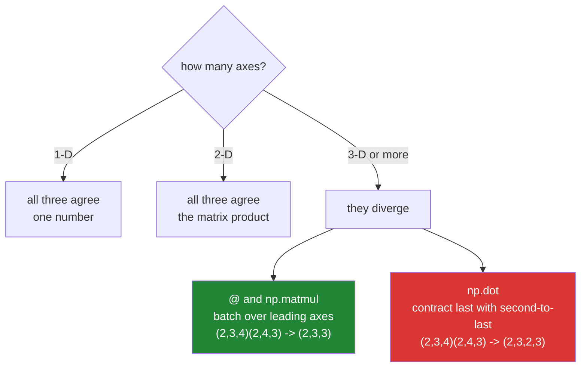

# 3.3 — `@`, `np.matmul` and `np.dot` — three spellings, two behaviours

## One-line answer

`@` and `np.matmul` are the same thing, `np.dot` agrees with them for one- and two-dimensional input and
does something completely different above that — so on stacked data the two produce differently shaped
answers, and only one of them is what anybody meant.

---

## The story

The flat has been keeping the chart for three months and somebody stacks the three months on top of each
other: three sheets of paper, each five people by eight jobs.

They want the overlap grid for each month. Three grids, five by five, one per sheet.

So they hand the stack to somebody and say "do the overlap thing". And the reasonable interpretation is
what they meant: take sheet one, work out its grid; take sheet two, work out its grid; and so on. Three
grids out.

But there is another reading, and it is not unreasonable either: pair up **every** row of the stack with
every column of the other stack, across sheets as well as within them. That produces something much
larger — a grid of grids — and it answers a question nobody asked.

Both readings are internally consistent. The trouble is only that two tools in the same toolbox picked
different ones.

---

## The idea in plain language

There are three ways to write a matrix product in NumPy and they are **not** three names for one thing.

`a @ b` is the matrix multiplication operator, added to Python for exactly this purpose. It calls
`np.matmul`.

`np.matmul(a, b)` is the same operation as `@`, spelled as a function so it can take extra arguments such
as `out=`.

`np.dot(a, b)` is older, and it agrees with the other two only for inputs of one or two dimensions.

For 1-D inputs all three give a single number ([3.1](3.1-a-dot-product-is-a-total.md)). For 2-D inputs all
three give the matrix product ([3.2](3.2-matmul-by-hand.md)). At **three or more** dimensions they part
company, and the difference is the whole reason to know which is which.

`np.matmul` treats every axis except the last two as a **batch**. Given `(2, 3, 4)` and `(2, 4, 3)`, it
sees two stacked matrix products — `(3, 4) @ (4, 3)` done twice — and returns `(2, 3, 3)`. The leading axes
are broadcast against each other exactly as arithmetic axes are
([Day 22, 1.2](../../../day-22-broadcasting-and-shape/parts/01-broadcasting/1.2-the-rule-in-three-lines.md)),
so a single matrix can be applied across a whole stack.

`np.dot` does something else: it pairs the **last** axis of the first argument with the
**second-to-last** axis of the second, and keeps every other axis of both. Given the same two arrays it
returns `(2, 3, 2, 3)` — a four-dimensional array, every sheet crossed with every sheet.

Neither is wrong. `np.dot`'s behaviour is the mathematical tensor contraction and it predates the `@`
operator; `matmul`'s batching is what almost every practical use wants. **The rule to carry is: use `@` for
matrix products, always.** Reach for `np.dot` only when you specifically want its contraction, and reach
for `np.einsum` when the index pattern is unusual enough to be worth writing out.

There is one more difference and it goes the other way. `np.dot(3, 4)` works and gives 12, because `dot`
accepts scalars; `np.matmul(3, 4)` raises, because a matrix product of two numbers is not defined. That is
`matmul` being stricter, and stricter is what you want.

---

## Why Setu needs it

- **[3.5](3.5-stacks-of-matrices.md)** is `matmul`'s batching used deliberately, and it only makes sense
  once you know `np.dot` would have done something else.
- **[5.1](../05-the-module/5.1-the-chores-module.md)** computes one grid per month from a stacked chart,
  which is precisely the case where the two functions disagree.
- **Day 125 onwards**, every neural network layer processes a **batch** of inputs, so batched matrix
  products are the normal case and the non-batched one is the exception
  ([3.6](3.6-every-neural-layer.md)).
- **Day 155's retrieval** scores a batch of queries against a document matrix, which is a batched product
  the moment more than one query is in flight.
- **Day 138's attention** multiplies stacks of matrices per attention head, and a `np.dot` there would
  produce an array with two extra axes and no error.

---

## The mechanism

The three spellings, at each number of dimensions:

```python
import numpy as np

a1 = np.array([1, 2, 3])
b1 = np.array([4, 5, 6])
a2 = np.array([[1, 2], [3, 4]])
b2 = np.array([[5, 6], [7, 8]])
a3 = np.arange(24).reshape(2, 3, 4)
b3 = np.arange(24).reshape(2, 4, 3)

print("1-D  @      :", a1 @ b1, " matmul:", np.matmul(a1, b1), " dot:", np.dot(a1, b1))
print("2-D  @      :", (a2 @ b2).tolist())
print("2-D  dot    :", np.dot(a2, b2).tolist(), " same:", np.array_equal(a2 @ b2, np.dot(a2, b2)))
print("3-D  matmul :", np.matmul(a3, b3).shape)
print("3-D  @      :", (a3 @ b3).shape)
print("3-D  dot    :", np.dot(a3, b3).shape, "<- two extra axes")
print("dot scalar  :", np.dot(3, 4))
print("matmul scalar:", end=" ")
try:
    print(np.matmul(3, 4))
except Exception as e:
    print(type(e).__name__, ":", e)
```

**Line by line:**

- Three pairs of inputs at one, two and three dimensions — the whole comparison in one block, because the
  point is where the three agree and where they stop.
- `a1 @ b1`, `np.matmul(a1, b1)`, `np.dot(a1, b1)` on one line — all `32`. **At 1-D there is nothing to
  choose between them.**
- `a2 @ b2` and `np.dot(a2, b2)` with an `array_equal` — identical at 2-D as well. Two-thirds of the cases
  people meet daily give no reason to prefer one.
- `a3` and `b3` shaped `(2, 3, 4)` and `(2, 4, 3)` — **two stacked matrices**, deliberately with different
  sizes in every axis so that the resulting shapes are unambiguous. Square test data would hide this
  entirely.
- `np.matmul(a3, b3).shape` — `(2, 3, 3)`. The leading `2` is carried through as a batch and the inner
  `(3, 4)(4, 3)` gives `(3, 3)`. **Two matrix products, stacked.**
- `(a3 @ b3).shape` — the same `(2, 3, 3)`, confirming that `@` is `matmul`.
- `np.dot(a3, b3).shape` — `(2, 3, 2, 3)`. Four axes. It paired the last axis of `a3` with the
  second-to-last of `b3` and kept everything else from both, so each of the two sheets is crossed with each
  of the two sheets. **Thirty-six values instead of eighteen**, and no error.
- `np.dot(3, 4)` — `12`. `dot` accepts plain numbers and multiplies them.
- `np.matmul(3, 4)` — raises. The message says the operand "does not have enough dimensions", naming the
  gufunc signature that requires at least one axis. **This strictness is a feature**: a scalar reaching a
  matrix product is a bug upstream.

```text
1-D  @      : 32  matmul: 32  dot: 32
2-D  @      : [[19, 22], [43, 50]]
2-D  dot    : [[19, 22], [43, 50]]  same: True
3-D  matmul : (2, 3, 3)
3-D  @      : (2, 3, 3)
3-D  dot    : (2, 3, 2, 3) <- two extra axes
dot scalar  : 12
matmul scalar: ValueError : matmul: Input operand 0 does not have enough dimensions (has 0, gufunc core with signature (n?,k),(k,m?)->(n?,m?) requires 1)
```

Where the three agree and where they split:



Now the flat's three months, both ways:

```python
import numpy as np

rng = np.random.default_rng(24)
months = rng.integers(0, 2, size=(3, 5, 8))

per_month = months @ months.transpose(0, 2, 1)
crossed = np.dot(months, months.transpose(0, 2, 1))

print("months shape    :", months.shape, "- 3 months, 5 people, 8 chores")
print("transposed      :", months.transpose(0, 2, 1).shape, "- each month's chart, on its side")
print("matmul result   :", per_month.shape, "- one 5x5 grid per month")
print("dot result      :", crossed.shape, "- every month crossed with every month")
print("values matmul   :", per_month.size)
print("values dot      :", crossed.size)
print("month 0 grid    :")
print(per_month[0])
print("same from dot?  :", np.array_equal(per_month[0], crossed[0, :, 0, :]))
```

**Line by line:**

- `rng.integers(0, 2, size=(3, 5, 8))` — three months of chart, seeded so the numbers are reproducible
  ([Day 20, 4.2](../../../day-20-arrays-and-dtypes/parts/04-random/4.2-the-seed-is-part-of-the-result.md)).
  Three different sizes in the three axes, again on purpose.
- `months.transpose(0, 2, 1)` — **not** `.T`. A bare `.T` on three axes reverses **all** of them, giving
  `(8, 5, 3)`, which is almost never what is meant
  ([Day 22, 3.2](../../../day-22-broadcasting-and-shape/parts/03-transpose/3.2-transpose-and-swapaxes.md)).
  Naming the axes keeps the batch axis in front where `matmul` expects it.
- `months @ months.transpose(0, 2, 1)` — `(3, 5, 8) @ (3, 8, 5)`. The leading 3 is the batch, the 8s agree
  and vanish, and the answer is `(3, 5, 5)`: **one overlap grid per month**, which is the question.
- `np.dot(months, ...)` — `(3, 5, 3, 5)`. Every month's people crossed with every month's people, including
  pairings across different months, which is meaningless here.
- `per_month.size` against `crossed.size` — 75 against 225. **Three times the memory for an answer nobody
  wanted**, and at real batch sizes the multiplier is the batch size itself.
- `crossed[0, :, 0, :]` — digging the wanted grid back out of the `dot` result by fixing both month axes to
  the same value. It matches, which shows the wanted answer is **in** there, buried along the diagonal of
  two axes. That is the tell: if you find yourself indexing a result with the same number twice, you used
  the wrong function.

```text
months shape    : (3, 5, 8) - 3 months, 5 people, 8 chores
transposed      : (3, 8, 5) - each month's chart, on its side
matmul result   : (3, 5, 5) - one 5x5 grid per month
dot result      : (3, 5, 3, 5) - every month crossed with every month
values matmul   : 75
values dot      : 225
month 0 grid    :
[[4 3 1 3 1]
 [3 5 3 3 1]
 [1 3 5 3 2]
 [3 3 3 5 1]
 [1 1 2 1 3]]
same from dot?  : True
```

---

## When it breaks

**`np.dot` where `@` was meant, on a batch:**

```text
$ uv run python -c "
import numpy as np
batch = np.ones((32, 4, 5))
weights = np.ones((32, 5, 3))
print('matmul :', np.matmul(batch, weights).shape)
print('dot    :', np.dot(batch, weights).shape)
print('bytes  :', np.matmul(batch, weights).nbytes, 'vs', np.dot(batch, weights).nbytes)
"
matmul : (32, 4, 3)
dot    : (32, 4, 32, 3)
bytes  : 3072 vs 98304
```

**What it means.** A batch of thirty-two produced thirty-two times the output, because `np.dot` crossed
every batch item with every batch item. It did not raise, and at this size it does not even hurt. At a
batch of 512 it is 512 times the memory, and the failure looks like an out-of-memory kill in a training
loop rather than like a wrong function. **The tell is an output shape with the batch size appearing
twice.** Assert the shape after a batched matrix product and this cannot survive a single run.

**`.T` on three axes:**

```text
$ uv run python -c "
import numpy as np
months = np.ones((3, 5, 8))
print('months     :', months.shape)
print('.T         :', months.T.shape, '<- all three axes reversed')
print('transpose  :', months.transpose(0, 2, 1).shape, '<- only the last two')
print('swapaxes   :', months.swapaxes(-1, -2).shape)
print('matmul .T  :', end=' ')
try:
    print((months @ months.T).shape)
except Exception as e:
    print(type(e).__name__, ':', str(e)[:90])
"
months     : (3, 5, 8)
.T         : (8, 5, 3) <- all three axes reversed
transpose  : (3, 8, 5) <- only the last two
swapaxes   : (3, 8, 5)
matmul .T  : ValueError : matmul: Input operand 1 has a mismatch in its core dimension 0, with gufunc si
```

**What it means.** `.T` reversed every axis, putting the chores axis in front and the months axis last
([Day 22, 3.2](../../../day-22-broadcasting-and-shape/parts/03-transpose/3.2-transpose-and-swapaxes.md)).
`months @ months.T` is then `(3, 5, 8) @ (8, 5, 3)`, whose batch axes are 3 and 8 and whose inner
dimensions are 8 and 5 — wrong in both places, so it raises. **This is the lucky outcome.** With a batch
of the right size it would broadcast and run. `swapaxes(-1, -2)` is the safe spelling because it names the
two axes relative to the end and leaves everything in front alone, whatever the number of leading axes.

**`out=` with the wrong shape:**

```text
$ uv run python -c "
import numpy as np
a = np.ones((3, 4))
b = np.ones((4, 2))
buf = np.zeros((3, 2))
np.matmul(a, b, out=buf)
print('with out :', buf.tolist())
wrong = np.zeros((2, 3))
np.matmul(a, b, out=wrong)
"
with out : [[4.0, 4.0], [4.0, 4.0], [4.0, 4.0]]
Traceback (most recent call last):
  File "<string>", line 7, in <module>
ValueError: matmul: Output operand 0 has a mismatch in its core dimension 0, with gufunc signature (n?,k),(k,m?)->(n?,m?) (size 2 is different from 3)
```

**What it means.** `np.matmul` takes `out=` and `@` does not, which is the one practical reason to write
the function form. Reusing a buffer across many products removes an allocation per call
([Day 23, 1.2](../../../day-23-ufuncs-and-statistics/parts/01-ufuncs/1.2-out-and-the-temporaries.md)),
which matters in a loop over batches. The buffer's shape has to be exactly the product's output shape and
is checked, which is a small mercy — `out=` is one of the easier ways to write a fast wrong answer.

---

## In production

**What a professional writes instead of the teaching version.** `@` everywhere, `np.dot` never, and the
output shape asserted because the wrong function does not raise:

```python
from __future__ import annotations

import numpy as np


def batched_overlap(charts: np.ndarray) -> np.ndarray:
    """One (people, people) overlap grid per leading batch entry.

    ``charts`` is (..., people, chores). Uses @ rather than np.dot: on 3-D input np.dot
    crosses every batch entry with every other and silently returns batch-squared results.
    """
    if charts.ndim < 2:
        raise ValueError(f"expected at least (people, chores), got shape {charts.shape}")
    people = charts.shape[-2]
    out = charts @ charts.swapaxes(-1, -2)
    expected = (*charts.shape[:-2], people, people)
    if out.shape != expected:
        raise AssertionError(f"expected {expected}, got {out.shape}")
    return out
```

**Line by line:**

- The docstring naming `np.dot`'s behaviour explicitly — **the comment that stops the next person
  "simplifying" this back**. `np.dot` is shorter to type and looks equivalent, and only this sentence says
  why it is not.
- `charts.ndim < 2` — the minimum this function can mean anything for. Any number of leading batch axes is
  fine, which is why the check is a floor rather than an equality.
- `charts.shape[-2]` — the people axis named **from the end**, so the function works for `(people, chores)`,
  `(months, people, chores)` and `(years, months, people, chores)` without change. Counting from the front
  would break the moment a batch axis is added
  ([Day 23, 2.2](../../../day-23-ufuncs-and-statistics/parts/02-statistics/2.2-axis-the-one-that-disappears.md)).
- `charts.swapaxes(-1, -2)` rather than `.T` — the fix for the second failure block, and the only transpose
  spelling that is correct for any number of leading axes.
- `expected = (*charts.shape[:-2], people, people)` — the shape rule written as code: keep the batch axes,
  replace the last two with `(people, people)`. Building it this way means the assertion is checking the
  **rule** rather than a hard-coded shape.
- `if out.shape != expected: raise AssertionError` — a real raise rather than a bare `assert`, because
  `assert` statements are removed when Python runs with `-O` and this check is load-bearing.
- The message printing both shapes — a shape mismatch is only diagnosable when both numbers are visible.

**What changes at scale.** The choice between `@` and `np.dot` stops being stylistic and becomes the
difference between a job that runs and one that does not. On a batch of `B`, `np.dot` produces `B` times
the output of `matmul`, so a batch of 512 turns a 4 MB result into 2 GB — and because it never raises, the
symptom is an out-of-memory kill inside a training loop, which sends everybody looking at the model rather
than at one function name. Two further things matter at size. `@` on large float arrays dispatches to a
tuned linear algebra library ([3.4](3.4-the-measured-gap.md)), and that dispatch is dtype-dependent:
`float32` and `float64` take the fast path, integers and booleans do not, so an integer chart of any real
size should be cast before the product. And `np.matmul(a, b, out=buffer)` is the form to reach for inside a
loop over batches, because it removes one full-size allocation per iteration; `@` has no way to express
that, which is the one place the function form earns its extra characters.

**The failure that only appears with real data.** A model's attention implementation used `np.dot` for its
per-head products. During development the batch size was 1, so the extra axis had length 1, every shape
assertion passed, and `squeeze` in a later step quietly removed it. Training with a batch of 64 allocated
sixty-four times the intended memory and died. The traceback pointed at the allocation, not at the
`np.dot` three functions earlier, and the batch size was reduced twice before anybody read the shapes.

**The review comment a senior engineer leaves.** *"`np.dot(batch, weights)` on 3-D input contracts rather
than batching — this returns `(B, n, B, m)`, not `(B, n, m)`. It works at batch size 1, which is why the
tests pass. Use `@`, and assert the output shape."*

**The interview question.** *"What is the difference between `np.dot` and `np.matmul`?"* They agree for one-
and two-dimensional input and diverge above that. `np.matmul`, which is what `@` calls, treats all leading
axes as a batch and broadcasts them, so `(B, n, k) @ (B, k, m)` gives `(B, n, m)` — one matrix product per
batch entry. `np.dot` contracts the last axis of the first argument with the second-to-last of the second
and keeps every other axis from both, so the same inputs give `(B, n, B, m)`: every batch entry crossed
with every batch entry. It does not raise, and at batch size 1 the shapes are indistinguishable, which is
how it survives testing. The rule is to use `@` for matrix products always. The details worth adding:
`np.dot` accepts scalars and `matmul` refuses them, which is `matmul` being usefully stricter; `np.matmul`
takes `out=` while the operator cannot, which matters in a loop; and on stacked data `.T` reverses **all**
axes, so the correct transpose for a batched product is `swapaxes(-1, -2)`.

---

## Check yourself

```bash
uv run python -c "
import numpy as np
a3 = np.arange(24).reshape(2, 3, 4)
b3 = np.arange(24).reshape(2, 4, 3)
print('matmul :', np.matmul(a3, b3).shape)
print('@      :', (a3 @ b3).shape)
print('dot    :', np.dot(a3, b3).shape)
print('sizes  :', np.matmul(a3, b3).size, 'vs', np.dot(a3, b3).size)
print('same 2D:', np.array_equal(a3[0] @ b3[0], np.dot(a3[0], b3[0])))
m = np.ones((3, 5, 8))
print('.T     :', m.T.shape)
print('swap   :', m.swapaxes(-1, -2).shape)
"
```

The first three lines give two different shapes from three function names. Say which two are the same
function, and what the fourth axis in the third line is counting.

**Answer out loud, without scrolling up:**

> You have a batch of 64 matrices and you use `np.dot` instead of `@`. Say what shape comes back, why
> nothing raises, and why the tests passed.

---

**Next:** [3.4 — the measured gap](3.4-the-measured-gap.md).
