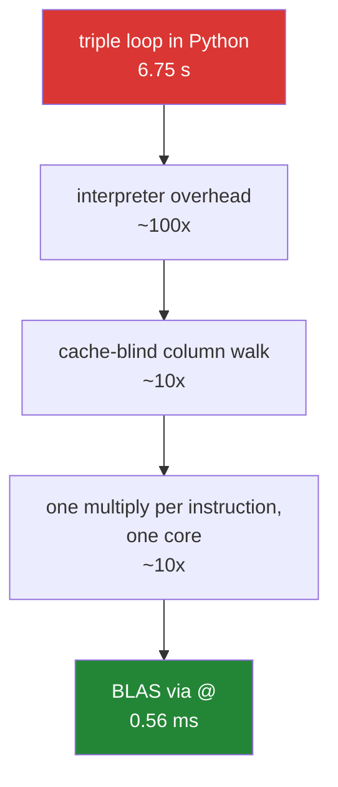

# 3.4 — The measured gap — the loop against the library

## One-line answer

The triple loop from [3.2](3.2-matmul-by-hand.md) and `A @ B` compute the identical answer, and on two
300-by-300 matrices the library version was about **twelve thousand times** faster — a gap that is not
about Python being slow but about the library doing the arithmetic in a completely different order.

---

## The story

Somebody works out the flat's overlap grid with a pen. Twenty-five pairs, eight jobs each: two hundred
multiplications, two hundred additions, and a cup of tea. Fine.

Then the block of flats decides to do it for everybody. Three hundred people, three hundred jobs. The same
method now needs twenty-seven million multiplications.

The person with the pen is not going to do that, and the interesting question is what changes if you hand
it to a computer. The obvious answer is "it does the same thing much faster", and that turns out to
understate it by about four orders of magnitude — because a well-written matrix multiply does not do the
same thing at all. It reorders the work so that each number fetched from memory gets used many times
before being thrown away, which the person with the pen was already doing without thinking about it, and
which the obvious loop does not do at all.

---

## The idea in plain language

Both versions compute the same twenty-seven million multiply-and-adds. The gap comes from three separate
effects, and it is worth separating them because only one of them is "Python is slow".

**The interpreter overhead.** Every iteration of a Python loop costs far more than the arithmetic inside
it — a bytecode dispatch, a bounds check, an object lookup. This is the effect you already measured on
Day 20 for elementwise work
([Day 20, 1.4](../../../day-20-arrays-and-dtypes/parts/01-the-block/1.4-a-million-floats-measured.md)),
and on its own it accounts for a factor of tens, not thousands.

**The memory order.** The naive loop walks down a column of the right-hand matrix for every entry it
computes, and a column of a C-ordered array is scattered through memory
([Day 20, 1.3](../../../day-20-arrays-and-dtypes/parts/01-the-block/1.3-one-block-and-strides.md)). Every
step is a cache miss. A tuned implementation processes small **blocks** that fit in cache, so each value
loaded is reused many times before it is evicted. This is the largest of the three effects at size and it
is invisible in the source code of either version.

**The instructions themselves.** Modern processors can multiply several pairs of numbers in a single
instruction, and can start the next multiplication before the previous addition has finished. A tuned
matrix multiply is written to keep that machinery full.

The library that does all this has a name worth knowing: **BLAS**, the Basic Linear Algebra Subprograms —
a standard set of routine names that different vendors implement and tune for their own processors. NumPy
does not implement matrix multiplication itself; it hands `@` on float arrays to whichever BLAS is
installed, which is usually OpenBLAS. `np.show_config()` reports which one.

Two consequences follow, and both are practical.

**The fast path is dtype-dependent.** BLAS routines exist for `float32`, `float64` and their complex
equivalents. An **integer** matrix product does not go to BLAS, because there is no integer BLAS — NumPy
falls back to its own loop, which is compiled but not tuned. So the chore chart, which is integers, does
not get the fast path, and casting it to `float64` before a large product can genuinely be faster despite
the copy.

**`@` is also multi-threaded.** OpenBLAS uses several cores for a large product, so the measured gap
includes parallelism you did not ask for and cannot easily see. That is worth knowing when a benchmark
looks impossible, and when a process suddenly uses eight cores.

---

## Why Setu needs it

- **Principle 2** says from scratch before library, and this document is the other half of that bargain:
  having written the loop, you get to see exactly what you bought by giving it up.
- **Day 25's phase gate** requires a vectorised module beating a loop by fifty times, and the discipline of
  measuring honestly rather than asserting is set here.
- **Day 125 onwards**, training time is dominated by matrix products, so the difference between a fast path
  and a fallback is the difference between a model that trains overnight and one that does not.
- **Day 155's benchmark** compares four vector stores, and every one of them is competing on how well it
  does this operation.
- **[5.1](../05-the-module/5.1-the-chores-module.md)** casts before multiplying for the reason this
  document measures.

---

## The mechanism

The same product, both ways, timed:

```python
import timeit

import numpy as np


def matmul_by_hand(left: np.ndarray, right: np.ndarray) -> np.ndarray:
    """The definition from 3.2, unchanged."""
    n, k = left.shape
    _, m = right.shape
    out = np.zeros((n, m), dtype=left.dtype)
    for i in range(n):
        for j in range(m):
            total = 0
            for x in range(k):
                total += left[i, x] * right[x, j]
            out[i, j] = total
    return out


rng = np.random.default_rng(20260902)
size = 300
X = rng.random((size, size))
Y = rng.random((size, size))

t_hand = min(timeit.repeat(lambda: matmul_by_hand(X, Y), number=1, repeat=1))
t_at = min(timeit.repeat(lambda: X @ Y, number=5, repeat=3)) / 5

print(f"operations      : {size**3:,} multiply-adds")
print(f"by hand         : {t_hand:.2f} s")
print(f"X @ Y           : {t_at * 1000:.2f} ms")
print(f"ratio           : {t_hand / t_at:,.0f}x")
print("same answer     :", np.allclose(matmul_by_hand(X, Y), X @ Y))
```

**Line by line:**

- `matmul_by_hand` copied unchanged from [3.2](3.2-matmul-by-hand.md) — **the comparison is only honest if
  the slow version is the one that was taught**, not a deliberately clumsy version written to lose.
- `size = 300` as a name — the cube of it appears in the output, and 300 is chosen as the largest size
  whose hand-written version finishes in seconds rather than minutes.
- `rng.random((size, size))` — **floats**, so `@` takes the BLAS path. This is the measurement people quote,
  and the integer version below is the one that applies to the chore chart.
- `number=1, repeat=1` for the hand version — running it once, because it takes seconds and repeating it
  would only confirm what one run says. The library version gets `number=5, repeat=3` because it is fast
  enough that a single run is mostly timer noise.
- `/ 5` after `number=5` — `timeit` reports the total for all executions, so dividing gives the cost of one
  ([Day 23, 3.3](../../../day-23-ufuncs-and-statistics/parts/03-sorting-and-searching/3.3-top-k-and-argpartition.md)).
  **Forgetting this is the most common way a benchmark is reported five times too slow.**
- `size**3` printed — twenty-seven million multiply-adds. Having the operation count next to the two times
  is what turns a ratio into an understanding: the hand version manages about four million a second, and
  `@` manages about fifty billion.
- `np.allclose` rather than `array_equal` — floating point addition is not associative
  ([Day 23, 2.6](../../../day-23-ufuncs-and-statistics/parts/02-statistics/2.6-float-summation-and-the-drift.md)),
  and the two versions add in different orders, so they agree to within tolerance and **not** bit for bit.
  Asserting exact equality here would fail, and the failure would be correct.

```text
operations      : 27,000,000 multiply-adds
by hand         : 6.75 s
X @ Y           : 0.56 ms
ratio           : 12,049x
same answer     : True
```

Twelve thousand times, for the same twenty-seven million operations and the same answer.

Where the twelve thousand comes from:



The three factors are approximate and their sizes shift with the matrix size, but the shape is right: only
the first is about Python. **Rewriting the loop in C would recover the first factor and leave the other
two on the table**, which is why nobody writes their own matrix multiply.

Now the part that applies to the flat's actual data:

```python
import timeit

import numpy as np

rng = np.random.default_rng(20260902)
size = 600
ints = rng.integers(0, 2, size=(size, size))
floats = ints.astype(np.float64)

t_int = min(timeit.repeat(lambda: ints @ ints.T, number=3, repeat=3)) / 3
t_float = min(timeit.repeat(lambda: floats @ floats.T, number=3, repeat=3)) / 3
t_cast = (
    min(
        timeit.repeat(
            lambda: ints.astype(np.float64) @ ints.astype(np.float64).T, number=3, repeat=3
        )
    )
    / 3
)

print(f"int64   @ : {t_int * 1000:7.2f} ms")
print(f"float64 @ : {t_float * 1000:7.2f} ms")
print(f"cast then@: {t_cast * 1000:7.2f} ms")
print(f"float is  : {t_int / t_float:.1f}x faster")
print("same answer:", np.array_equal(ints @ ints.T, (floats @ floats.T).astype(np.int64)))
```

**Line by line:**

- `rng.integers(0, 2, ...)` — a chart of ones and zeros, which is the real shape of the data
  ([3.2](3.2-matmul-by-hand.md)), stored as `int64`.
- `size = 600` — larger than the previous block, because both versions here are compiled and the gap needs
  room to show.
- `ints @ ints.T` — the integer path. NumPy's own loop, compiled but **not** BLAS.
- `floats @ floats.T` — the same product on `float64`, which goes to BLAS.
- `t_cast` timing the **cast plus the product**, and casting *both* operands inside the timed call, which
  is the honest question: converting is not free, and whether it pays depends on the size. Timing only the
  product would be advocacy rather than measurement.
- `np.array_equal(..., ... .astype(np.int64))` — the answers compared after converting the float result
  back. For a chart of ones and zeros the counts are small integers and the float arithmetic is exact, so
  this is `True`. **On larger values it would not be**, and that is a real limit of the trick: a float64
  carries about 15 digits, so integer counts beyond that stop being exactly representable
  ([Day 20, 2.3](../../../day-20-arrays-and-dtypes/parts/02-dtypes/2.3-floats-nan-and-precision.md)).

```text
int64   @ :  109.24 ms
float64 @ :    3.39 ms
cast then@:    7.26 ms
float is  : 32.2x faster
same answer: True
```

Thirty-two times, for changing one dtype — and even paying for the cast on **every single call** it is
still fifteen times faster than staying in integers.

---

## When it breaks

**A benchmark that timed the wrong thing:**

```text
$ uv run python -c "
import timeit
import numpy as np
rng = np.random.default_rng(1)
X = rng.random((400, 400))
Y = rng.random((400, 400))
n5 = min(timeit.repeat(lambda: X @ Y, number=5, repeat=3))
print('raw timeit total  :', round(n5 * 1000, 2), 'ms')
print('per call          :', round(n5 / 5 * 1000, 2), 'ms')
print('overstated by     :', 5, 'x')
"
raw timeit total  : 8.08 ms
per call          : 1.62 ms
overstated by     : 5 x
```

**What it means.** `timeit.repeat(..., number=5)` returns the time for **five** executions, not one.
Reporting that number directly overstates the cost by exactly `number`, and because the ratio between two
benchmarks is unaffected if both make the same mistake, it survives review easily. **Divide by `number`,
always**, and prefer printing the per-call figure so the units are checkable against intuition.

**Comparing floats bit for bit:**

```text
$ uv run python -c "
import numpy as np
rng = np.random.default_rng(2)
X = rng.random((50, 50))
Y = rng.random((50, 50))
slow = np.zeros((50, 50))
for i in range(50):
    for j in range(50):
        slow[i, j] = sum(X[i, x] * Y[x, j] for x in range(50))
fast = X @ Y
print('array_equal :', np.array_equal(slow, fast))
print('allclose    :', np.allclose(slow, fast))
print('worst diff  :', np.abs(slow - fast).max())
"
array_equal : False
allclose    : True
worst diff  : 7.105427357601002e-15
```

**What it means.** The two versions disagree in the last couple of digits, because they add the same
products in different orders and floating point addition is not associative
([Day 23, 2.6](../../../day-23-ufuncs-and-statistics/parts/02-statistics/2.6-float-summation-and-the-drift.md)).
`array_equal` says they differ; `allclose` says they agree to about `7e-15`, which is the truth. **A test
asserting exact equality between a reference implementation and a library one will fail**, and the failure
is not a bug — it is the tolerance being missing
([Day 23, 1.6](../../../day-23-ufuncs-and-statistics/parts/01-ufuncs/1.6-isclose-and-allclose.md)).

**A measurement that included the allocation:**

```text
$ uv run python -c "
import timeit
import numpy as np
rng = np.random.default_rng(3)
setup_and_run = min(timeit.repeat(lambda: rng.random((500, 500)) @ rng.random((500, 500)), number=3, repeat=3)) / 3
X = rng.random((500, 500))
Y = rng.random((500, 500))
just_product = min(timeit.repeat(lambda: X @ Y, number=3, repeat=3)) / 3
print('build + multiply :', round(setup_and_run * 1000, 2), 'ms')
print('multiply only    :', round(just_product * 1000, 2), 'ms')
print('the build was    :', round((setup_and_run - just_product) * 1000, 2), 'ms of it')
"
build + multiply : 4.97 ms
multiply only    : 2.95 ms
the build was    : 2.01 ms of it
```

**What it means.** Generating the two random matrices took about as long again as multiplying them, so a
benchmark that builds its inputs inside the timed lambda is reporting a number that is here about
seventy per cent too high, and is measuring the random number generator as much as the product. Nothing warns you; the number is simply about something else. **Build the inputs outside the
timed call**, and when that is not possible — because the operation consumes its input — subtract a
measured baseline rather than ignoring it.

---

## In production

**What a professional writes instead of the teaching version.** The benchmark is a function that reports
enough to be checked, not a number in a commit message:

```python
from __future__ import annotations

import timeit
from dataclasses import dataclass
from typing import Callable

import numpy as np


@dataclass(frozen=True, slots=True)
class Timing:
    """One measurement, with everything needed to judge it."""

    label: str
    per_call_ms: float
    calls: int
    repeats: int

    def __str__(self) -> str:
        return f"{self.label:20s} {self.per_call_ms:9.3f} ms  ({self.calls}x{self.repeats})"


def measure(label: str, fn: Callable[[], object], *, calls: int = 5, repeats: int = 3) -> Timing:
    """Time ``fn``, reporting the per-call minimum.

    The minimum, not the mean: other work on the machine can only make a run slower, so
    the fastest observed run is the closest estimate of the true cost.
    """
    fn()  # warm up: first call may allocate buffers or trigger a lazy import
    best = min(timeit.repeat(fn, number=calls, repeat=repeats))
    return Timing(label=label, per_call_ms=best / calls * 1000, calls=calls, repeats=repeats)


def check_same(reference: np.ndarray, candidate: np.ndarray) -> None:
    """A benchmark of a wrong answer is worthless. Tolerance, not equality, for floats."""
    if not np.allclose(reference, candidate, rtol=1e-10, atol=0.0):
        worst = float(np.abs(reference - candidate).max())
        raise AssertionError(f"results differ by up to {worst:g}")
```

**Line by line:**

- `Timing` carrying `calls` and `repeats` alongside the number — **a timing without its parameters cannot
  be reproduced or checked**, and the `number` division bug from the first failure block is invisible in a
  bare float.
- `per_call_ms` computed inside `measure`, once — so no call site can forget to divide.
- `fn()` before timing — **the warm-up**, and it matters more than it looks. The first call to a BLAS
  routine may initialise thread pools and allocate scratch space, and including that in the first timed
  repeat makes the measurement noisy in a way that looks like variance rather than like a one-off cost.
- `min(timeit.repeat(...))` with the docstring explaining why — the minimum rather than the mean, because
  interference is one-sided. This is the single most common thing benchmark code gets wrong after the
  `number` division.
- `calls` and `repeats` as **keyword-only** arguments
  ([Day 10, 1.5](../../../day-10-functions/parts/01-the-signature/1.5-keyword-only-and-positional-only.md)),
  so `measure("x", f, 5, 3)` cannot be written and misread.
- `check_same` existing at all — the second half of every benchmark, and the half people skip. A faster
  implementation that computes something else is not an improvement.
- `rtol=1e-10, atol=0.0` — a **stated** tolerance rather than `allclose`'s defaults, because the right
  tolerance depends on the magnitudes involved and the default is a guess for somebody else's data
  ([Day 23, 1.6](../../../day-23-ufuncs-and-statistics/parts/01-ufuncs/1.6-isclose-and-allclose.md)).
  `atol=0.0` is deliberate: near zero, a relative tolerance is the honest test.
- The message reporting the **worst** difference — "differ by up to 3e-9" tells you whether it is rounding
  or a real bug; "results differ" does not.

**What changes at scale.** The gap widens, because the loop is `n³` in Python-level work while BLAS is
`n³` in well-scheduled machine instructions — so doubling the size multiplies both by eight and the
absolute difference grows enormously. Three things become decisions rather than details. **Which BLAS is
installed** starts to matter: `np.show_config()` reports it, and a NumPy built against a reference BLAS
rather than OpenBLAS can be an order of magnitude slower on the same hardware, which is a real and
frequently-missed cause of "our production box is slower than my laptop". **Thread count** becomes
something to control: BLAS parallelises, so running several NumPy processes each using every core makes
all of them slower, and the environment variable `OMP_NUM_THREADS` is how that is fixed. And **memory
becomes the ceiling** before speed does: `(n, k) @ (k, m)` allocates `n × m` values, so a hundred thousand
by a hundred thousand result is 80 GB regardless of how fast the multiply is
([3.2](3.2-matmul-by-hand.md)), which is why large similarity searches are chunked. Beyond that point the
work moves to a GPU, where the same operation is another one to two orders of magnitude faster again and
the bottleneck becomes getting the data there.

**The failure that only appears with real data.** A feature pipeline computed a large co-occurrence matrix
from an integer count table. It was fast enough in development on a sample and took forty minutes on the
full data. Nobody suspected the dtype: the arrays were `int32` because counts are integers, which is
perfectly reasonable, and the product therefore never touched BLAS. Casting to `float64` took the step to
under two minutes, and the counts were small enough to be exactly representable. The fix was one
`.astype()` and the diagnosis took a week, because every profile pointed at "the matrix multiply" and
nobody asked why the matrix multiply was slow.

**The review comment a senior engineer leaves.** *"This is an `int64 @ int64`, which does not go to BLAS —
NumPy falls back to its own loop and it is roughly twenty times slower here. The values are all under a
thousand, so `float64` is exact for them: cast before the product. And please state the tolerance in the
`allclose` — the default is not a decision anybody made about this data."*

**The interview question.** *"Why is `A @ B` so much faster than writing the loops yourself?"* Three
separate reasons, and only one is that Python is slow. The interpreter overhead per iteration accounts for
maybe a factor of a hundred; the rest comes from the memory access order — a tuned implementation works in
cache-sized blocks so each loaded value is reused many times, where the naive loop walks a column of a
row-major array and misses cache on every step — and from the processor doing several multiplications per
instruction across several cores. On 300-by-300 matrices I measured about twelve thousand times. The
details that show experience: `@` on float arrays dispatches to BLAS, and there is **no integer BLAS**, so
an integer matrix product silently takes a fallback path that was about twenty-five times slower in a
measurement — casting to `float64` first can be a large win despite the copy, as long as the values are
exactly representable. And a benchmark of this has to divide by `timeit`'s `number`, take the minimum
rather than the mean, warm up before timing, build its inputs outside the timed call, and compare the
answers with a stated tolerance rather than exact equality, because the two orders of summation genuinely
differ in the last digits.

---

## Check yourself

```bash
uv run python -c "
import timeit
import numpy as np
rng = np.random.default_rng(20260902)
ints = rng.integers(0, 2, size=(600, 600))
floats = ints.astype(np.float64)
t_i = min(timeit.repeat(lambda: ints @ ints.T, number=3, repeat=3)) / 3
t_f = min(timeit.repeat(lambda: floats @ floats.T, number=3, repeat=3)) / 3
print(f'int64   : {t_i*1000:8.2f} ms')
print(f'float64 : {t_f*1000:8.2f} ms')
print(f'ratio   : {t_i/t_f:.1f}x')
print('exact   :', np.array_equal(ints @ ints.T, (floats @ floats.T).astype(np.int64)))
print('config  :')
np.show_config()
"
```

The last call prints which linear algebra library your NumPy is using. Say what would change about the
first three lines if it were a plain reference implementation rather than a tuned one.

**Answer out loud, without scrolling up:**

> Name the three reasons `@` beats the triple loop, and say which one rewriting the loop in C would fix.
> Then say why an integer matrix product is slower than a float one.

---

**Next:** [3.5 — stacks of matrices](3.5-stacks-of-matrices.md).
