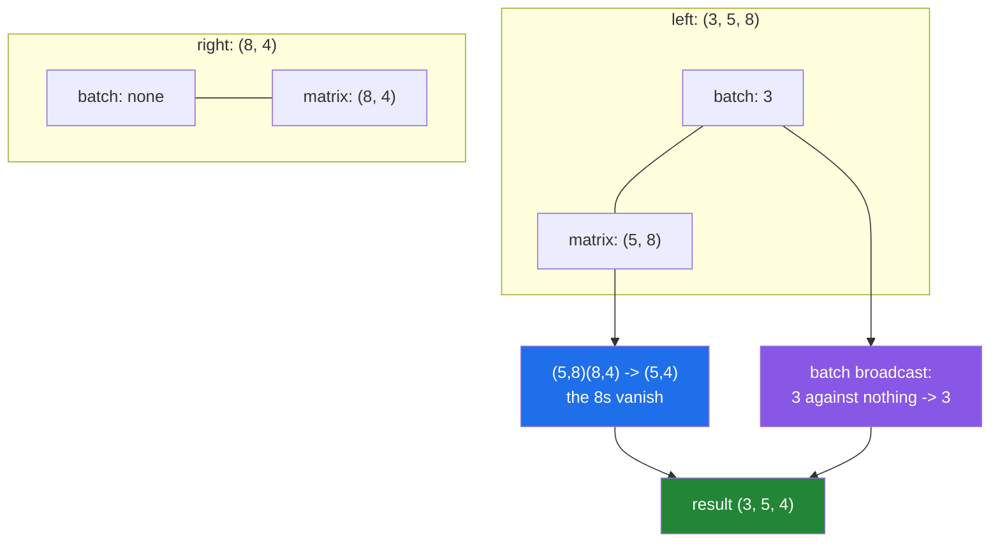

# 3.5 — Stacks of matrices — `matmul`'s batch axes

## One-line answer

`@` treats every axis except the last two as a **batch** and broadcasts those axes, so one matrix can be
applied across a whole stack in a single call — which is how a hundred separate matrix products become one
line with no loop.

---

## The story

The flat has three months of charts and a scoring sheet: eight jobs down the side, four columns saying how
long each job takes, how unpleasant it is, whether it needs doing weekly, and how many people it takes.

They want each month's chart scored against that sheet. Three months, one sheet.

Nobody would copy the sheet out three times. It is one sheet; you lay it against the first month's chart,
then against the second, then the third. The sheet does not change and does not need to.

That is the whole idea, and it has one wrinkle worth noticing before the arithmetic. If somebody later
decides each month should have its *own* sheet — because the flat's priorities changed — the operation is
the same shape, and the only difference is whether there is one sheet or three. A good tool should handle
both without being told which.

---

## The idea in plain language

[3.3](3.3-at-matmul-and-dot.md) established the rule: `@` uses the **last two** axes for the matrix
product and treats everything before them as a batch.

So for a stack of shape `(3, 5, 8)` and a matrix of shape `(8, 4)`:

- The last two axes of the left are `(5, 8)`. The right has only two, `(8, 4)`. The eights agree, giving
  `(5, 4)` per matrix product.
- The leading `3` on the left has nothing to line up against on the right, so it is carried through.
- The answer is `(3, 5, 4)`: three results, one per month.

That carrying-through is not a special case bolted on for convenience. It is the **broadcasting rule**
from Day 22 ([Day 22, 1.2](../../../day-22-broadcasting-and-shape/parts/01-broadcasting/1.2-the-rule-in-three-lines.md))
applied to the batch axes: line them up from the right, a missing axis counts as 1, and a 1 stretches. So
`(3, 5, 8) @ (8, 4)` works because the right operand has no batch axes at all, and
`(3, 5, 8) @ (3, 8, 4)` works because both have a batch of 3 and they match.

That gives three useful cases from one operator, and the whole value of this document is recognising them:

| Left | Right | Result | Meaning |
|---|---|---|---|
| `(B, n, k)` | `(k, m)` | `(B, n, m)` | one matrix applied to every batch entry |
| `(B, n, k)` | `(B, k, m)` | `(B, n, m)` | a different matrix per batch entry |
| `(1, n, k)` | `(B, k, m)` | `(B, n, m)` | one input against many matrices |

And the batch can be more than one axis deep. `(2, 1, 5, 8) @ (3, 8, 4)` broadcasts `(2, 1)` against `(3,)`
to give `(2, 3)`, so the answer is `(2, 3, 5, 4)`. That is rarely what you want by accident and exactly
what you want in an attention mechanism.

Two things follow, and they are the reason to prefer the batched form over a loop.

**The transpose has to be axis-aware.** `.T` reverses every axis
([Day 22, 3.2](../../../day-22-broadcasting-and-shape/parts/03-transpose/3.2-transpose-and-swapaxes.md)),
which destroys the batch layout. `swapaxes(-1, -2)` is the correct spelling for any number of leading axes,
and it is what you should reach for automatically once a batch axis exists.

**One call is faster than a loop of calls**, but by less than you might expect. The batched form does not
change the arithmetic; it removes the per-call overhead and lets the library schedule the whole job. The
measurement below puts it at a bit over twice as fast for two hundred small matrices — real, worth having,
and nothing like the twelve-thousand-fold gap from [3.4](3.4-the-measured-gap.md), because both versions
were already calling the library.

---

## Why Setu needs it

- **[3.6](3.6-every-neural-layer.md)** is this operation with the batch being a batch of training examples,
  which is the case it exists for.
- **[5.1](../05-the-module/5.1-the-chores-module.md)** scores several months of chart against one weighting
  sheet, which is row one of the table above.
- **Day 138's attention** computes `(batch, heads, tokens, dim) @ (batch, heads, dim, tokens)`, a two-deep
  batch, and getting the axis order wrong there is the classic transformer bug.
- **Day 155's retrieval** scores a batch of queries against a document matrix in one call rather than
  looping over queries, which is the difference between a usable endpoint and a slow one.
- **Day 107's ensembles** apply the same transform to many bootstrap samples, which is the same shape of
  problem.

---

## The mechanism

Three months, one sheet and then three sheets:

```python
import numpy as np

rng = np.random.default_rng(24)
months = rng.integers(0, 2, size=(3, 5, 8)).astype(np.float64)
one_sheet = rng.random((8, 4))
per_month_sheet = rng.random((3, 8, 4))

print("months          :", months.shape, "- 3 months, 5 people, 8 chores")
print("one sheet       :", one_sheet.shape, "- 8 chores, 4 scores")
print("months @ sheet  :", (months @ one_sheet).shape, "<- the sheet reused for every month")
print("per-month sheet :", per_month_sheet.shape)
print("months @ per    :", (months @ per_month_sheet).shape, "<- a different sheet each month")
print("month 0 alone   :", (months[0] @ one_sheet).shape)
print("matches batch   :", np.allclose(months[0] @ one_sheet, (months @ one_sheet)[0]))
```

**Line by line:**

- `.astype(np.float64)` on the chart — the fast path
  ([3.4](3.4-the-measured-gap.md)), and also necessary here because the sheet is float and mixing dtypes
  would promote anyway.
- Three different sizes — 3, 5, 8 and 4 — chosen so that **no two axes have the same length**. If any two
  matched, a wrong answer could have the right shape and every assertion below would pass. This is the same
  discipline as a non-square test fixture
  ([Day 23, 2.2](../../../day-23-ufuncs-and-statistics/parts/02-statistics/2.2-axis-the-one-that-disappears.md)).
- `months @ one_sheet` — `(3, 5, 8) @ (8, 4)`. The right operand has **no** batch axes, so it is used for
  every month. `(3, 5, 4)` out: three scored charts.
- `months @ per_month_sheet` — `(3, 5, 8) @ (3, 8, 4)`. Now both have a batch of 3 and they match up one to
  one. **The same shape of answer from a completely different pairing**, which is why the shapes have to be
  read rather than assumed.
- `months[0] @ one_sheet` — the single-month version, `(5, 8) @ (8, 4)` giving `(5, 4)`. One axis shorter,
  because indexing consumed the batch axis
  ([Day 21, 1.3](../../../day-21-indexing-and-views/parts/01-one-element/1.3-slicing-one-axis.md)).
- `np.allclose(months[0] @ one_sheet, (months @ one_sheet)[0])` — **the assertion that the batching is what
  it claims to be**. Doing one by hand and comparing it against the batched version's first entry is the
  only honest check that no axes were crossed.

```text
months          : (3, 5, 8) - 3 months, 5 people, 8 chores
one sheet       : (8, 4) - 8 chores, 4 scores
months @ sheet  : (3, 5, 4) <- the sheet reused for every month
per-month sheet : (3, 8, 4)
months @ per    : (3, 5, 4) <- a different sheet each month
month 0 alone   : (5, 4)
matches batch   : True
```

How the axes line up:



Now the batch axes broadcasting against each other, which is where it stops being obvious:

```python
import numpy as np

a = np.ones((1, 5, 8))
b = np.ones((3, 8, 4))
c = np.ones((2, 1, 5, 8))
d = np.ones((3, 8, 4))

print("(1,5,8) @ (3,8,4)   :", (a @ b).shape)
print("(2,1,5,8) @ (3,8,4) :", (c @ d).shape)
print("batch of a          :", a.shape[:-2], " batch of b:", b.shape[:-2])
print("broadcast to        :", np.broadcast_shapes(a.shape[:-2], b.shape[:-2]))
print("batch of c          :", c.shape[:-2], " batch of d:", d.shape[:-2])
print("broadcast to        :", np.broadcast_shapes(c.shape[:-2], d.shape[:-2]))
```

**Line by line:**

- `(1, 5, 8) @ (3, 8, 4)` — the left has a batch of **1**, which stretches to 3
  ([Day 22, 1.5](../../../day-22-broadcasting-and-shape/parts/01-broadcasting/1.5-no-data-is-copied.md)).
  One input matrix, three different right-hand matrices, three answers. That is row three of the table
  above.
- `(2, 1, 5, 8) @ (3, 8, 4)` — batch axes `(2, 1)` against `(3,)`. Lined up from the right: 1 against 3
  stretches to 3, and 2 has nothing to line up against so it is carried. `(2, 3)` batch, so `(2, 3, 5, 4)`
  out — **six matrix products from two arrays**.
- `a.shape[:-2]` — the batch axes, extracted by dropping the last two. Printing them separately is how you
  reason about a shape you did not expect.
- `np.broadcast_shapes(...)` — **the rule, checked without allocating anything**
  ([Day 22, 1.2](../../../day-22-broadcasting-and-shape/parts/01-broadcasting/1.2-the-rule-in-three-lines.md)).
  This is the function to reach for when a batched product gives a shape you cannot explain: it tells you
  what the batch axes did, separately from what the matrix axes did.

```text
(1,5,8) @ (3,8,4)   : (3, 5, 4)
(2,1,5,8) @ (3,8,4) : (2, 3, 5, 4)
batch of a          : (1,)  batch of b: (3,)
broadcast to        : (3,)
batch of c          : (2, 1)  batch of d: (3,)
broadcast to        : (2, 3)
```

And the reason to write it as one call:

```python
import timeit

import numpy as np

rng = np.random.default_rng(24)
stack = rng.random((200, 50, 60))
sheet = rng.random((60, 30))


def looped() -> np.ndarray:
    return np.stack([stack[i] @ sheet for i in range(stack.shape[0])])


t_loop = min(timeit.repeat(looped, number=3, repeat=3)) / 3
t_batch = min(timeit.repeat(lambda: stack @ sheet, number=3, repeat=3)) / 3

print(f"loop over 200 : {t_loop * 1000:7.2f} ms")
print(f"one batched @ : {t_batch * 1000:7.2f} ms")
print(f"ratio         : {t_loop / t_batch:.1f}x")
print("same answer   :", np.allclose(looped(), stack @ sheet))
```

**Line by line:**

- `looped()` doing exactly what the batched version does, one entry at a time, and `np.stack`-ing the
  results ([Day 22, 4.2](../../../day-22-broadcasting-and-shape/parts/04-joining-and-splitting/4.2-stack-versus-concatenate.md)).
  **This is the fair comparison**: both call the library for the actual arithmetic.
- `stack @ sheet` — the same work, one call.
- The ratio — **2.3 times, not twelve thousand**. That is the honest number, and it is worth having in your
  head: batching removes per-call overhead and lets the library plan the whole job, and it does not change
  the arithmetic. Anybody quoting a huge speedup for batching is comparing against a Python-level loop
  doing the multiplication itself, which is [3.4](3.4-the-measured-gap.md)'s comparison, not this one.
- `np.allclose` rather than `array_equal` — different orders of summation
  ([Day 23, 2.6](../../../day-23-ufuncs-and-statistics/parts/02-statistics/2.6-float-summation-and-the-drift.md)).

```text
loop over 200 :    2.75 ms
one batched @ :    1.20 ms
ratio         : 2.3x
same answer   : True
```

---

## When it breaks

**Batch axes that do not broadcast:**

```text
$ uv run python -c "
import numpy as np
left = np.ones((3, 5, 8))
right = np.ones((4, 8, 2))
print('batch axes :', left.shape[:-2], right.shape[:-2])
left @ right
"
batch axes : (3,) (4,)
Traceback (most recent call last):
  File "<string>", line 5, in <module>
ValueError: operands could not be broadcast together with remapped shapes [original->remapped]: (3,5,8)->(3,newaxis,newaxis) (4,8,2)->(4,newaxis,newaxis)  and requested shape (5,2)
```

**What it means.** The matrix axes were fine — `(5, 8)(8, 2)` gives `(5, 2)`, and the message says
`requested shape (5,2)` at the end. The **batch** axes failed: 3 against 4, neither of which is 1, so
there is no way to pair them
([Day 22, 1.6](../../../day-22-broadcasting-and-shape/parts/01-broadcasting/1.6-reading-the-broadcast-error.md)).
The `newaxis` notation in the message is NumPy showing you that it stripped the matrix axes off before
broadcasting the rest. **When a batched product fails, read the last parenthesis first**: if it names a
sensible matrix shape, the problem is the batch, not the matrices.

**`.T` on a stack:**

```text
$ uv run python -c "
import numpy as np
stack = np.ones((3, 5, 8))
print('stack   :', stack.shape)
print('.T      :', stack.T.shape)
print('swapaxes:', stack.swapaxes(-1, -2).shape)
print('stack @ stack.swapaxes(-1,-2) :', (stack @ stack.swapaxes(-1, -2)).shape)
print('stack @ stack.T :', end=' ')
try:
    print((stack @ stack.T).shape)
except Exception as e:
    print(type(e).__name__, ':', str(e)[:70])
"
stack   : (3, 5, 8)
.T      : (8, 5, 3)
swapaxes: (3, 8, 5)
stack @ stack.swapaxes(-1,-2) : (3, 5, 5)
stack @ stack.T : ValueError : matmul: Input operand 1 has a mismatch in its core dimension 0, with g
```

**What it means.** `.T` moved the batch axis to the end and the chores axis to the front, so the operation
that should have been "three overlap grids" is a shape error instead. Here it raises, which is lucky. **The
unlucky version is a batch whose size happens to equal one of the matrix dimensions**, in which case `.T`
produces something that multiplies successfully and means nothing — a batch of 8 on `(8, 5, 8)` data would
do exactly that. `swapaxes(-1, -2)` is correct for any number of leading axes and should be the reflex.

**A batch axis introduced by accident:**

```text
$ uv run python -c "
import numpy as np
chart = np.ones((5, 8))
sheet = np.ones((8, 4))
print('plain      :', (chart @ sheet).shape)
one_month = chart[np.newaxis, :, :]
print('with axis  :', one_month.shape, '->', (one_month @ sheet).shape)
print('squeezed   :', (one_month @ sheet).squeeze().shape)
batch_of_one = np.ones((1, 5, 8))
print('batch of 1 :', (batch_of_one @ sheet).squeeze().shape, '<- squeeze removed the batch too')
"
plain      : (5, 4)
with axis  : (1, 5, 8) -> (1, 5, 4)
squeezed   : (5, 4)
batch of 1 : (5, 4) <- squeeze removed the batch too
```

**What it means.** Adding a batch axis of 1 gives a result with a leading 1, and a bare `.squeeze()` removes
it — which is fine here and is a bug waiting for the day the batch size is genuinely 1 in production
([Day 22, 4.4](../../../day-22-broadcasting-and-shape/parts/04-joining-and-splitting/4.4-newaxis-and-expand-dims.md)).
A batch of one is not a special case that should lose its axis; it is a batch. **Use `squeeze(axis=0)` when
you mean a specific axis**, so a batch of one that should have stayed a batch raises instead of quietly
becoming a single matrix.

---

## In production

**What a professional writes instead of the teaching version.** The batch axes are named in the docstring,
checked, and never assumed:

```python
from __future__ import annotations

import numpy as np


def score_charts(charts: np.ndarray, sheet: np.ndarray) -> np.ndarray:
    """Score one or many (people, chores) charts against a (chores, scores) sheet.

    ``charts`` may carry any number of leading batch axes; they are broadcast against
    ``sheet``'s, so a single sheet applies to every chart and a per-batch stack of sheets
    applies one to one. Returns (..., people, scores).
    """
    if charts.ndim < 2 or sheet.ndim < 2:
        raise ValueError(f"need at least 2 axes each, got {charts.ndim} and {sheet.ndim}")
    chores_left, chores_right = charts.shape[-1], sheet.shape[-2]
    if chores_left != chores_right:
        raise ValueError(
            f"chart has {chores_left} chores, sheet expects {chores_right}; "
            f"shapes {charts.shape} and {sheet.shape}"
        )
    batch = np.broadcast_shapes(charts.shape[:-2], sheet.shape[:-2])
    expected = (*batch, charts.shape[-2], sheet.shape[-1])
    out = charts.astype(np.float64) @ sheet.astype(np.float64)
    if out.shape != expected:
        raise AssertionError(f"expected {expected}, got {out.shape}")
    return out
```

**Line by line:**

- The docstring saying "any number of leading batch axes" and naming the output as `(..., people, scores)` —
  **the `...` is the notation the whole function is about**, and a reader who sees it knows immediately that
  the function is batch-agnostic.
- `charts.shape[-1]` and `sheet.shape[-2]` — the two dimensions that must agree, named from the **end** so
  the check is correct whatever leading axes exist.
- The message naming the two counts in domain words — "chart has 8 chores, sheet expects 12" is diagnosable;
  NumPy's `core dimension` message needs decoding first
  ([3.1](3.1-a-dot-product-is-a-total.md)).
- `np.broadcast_shapes(charts.shape[:-2], sheet.shape[:-2])` — **the batch rule, evaluated separately from
  the matrix rule**. This is the single most useful idea in the function: it raises with a clear
  broadcasting error when the batches are incompatible, before the matmul produces its harder-to-read one.
- `expected = (*batch, charts.shape[-2], sheet.shape[-1])` — the full shape rule as code, batch axes and
  matrix axes composed. Asserting against a computed expectation rather than a literal means the assertion
  keeps working when a batch axis is added.
- `.astype(np.float64)` on both — the BLAS path ([3.4](3.4-the-measured-gap.md)). It costs a copy, and on an
  integer chart of any size it more than pays for itself.
- Raising `AssertionError` explicitly rather than using an `assert` statement — `assert` is stripped under
  `python -O` and this check is load-bearing.

**What changes at scale.** Batching is the difference between an implementation that keeps a processor busy
and one that does not, and the gains come in two forms. The measured one is small — a bit over twice, above
— because both versions call the library. The unmeasured one is larger: a batched call gives the library a
single large job it can split across cores and schedule as one blocked computation, where a loop hands it
two hundred small ones with a synchronisation point between each. That difference grows with the batch and
is the whole reason GPU code is written this way, where launching a kernel per matrix would be dominated by
launch overhead. Two cautions. **Memory is the constraint**: a batched product allocates the whole output
at once, so `(1000, 512, 512) @ (512, 512)` is a gigabyte of result, and the loop version — which people
reach for when memory is tight — is a legitimate answer to that, chunked rather than one at a time. And a
broadcast batch axis is free in the input and **not** free in the output: `(1, n, k) @ (B, k, m)` reads one
input matrix but writes `B` full results.

**The failure that only appears with real data.** An inference service transposed its batched activations
with `.T` instead of `swapaxes(-1, -2)`. The batch size in development was 32 and the hidden dimension was
also 32, so the reversed axes still multiplied successfully and produced an array of exactly the right
shape — with the batch and feature axes swapped. Predictions were wrong for every row and the shapes were
right for every assertion. It was found when the batch size was raised to 64 and the same code finally
raised.

**The review comment a senior engineer leaves.** *"`x.T` on a 3-D array reverses all three axes, not just
the last two. Use `swapaxes(-1, -2)`. This currently works because the batch size and the feature count are
both 32 — the day someone changes either, it either breaks or, worse, keeps running."*

**The interview question.** *"How do you apply the same matrix to a stack of inputs without a loop?"* Just
`stack @ matrix` — `@` uses the last two axes for the matrix product and broadcasts everything before them
as batch axes, so `(B, n, k) @ (k, m)` gives `(B, n, m)` with the one matrix reused, and
`(B, n, k) @ (B, k, m)` pairs them one to one. The batch axes follow the ordinary broadcasting rule, so a
leading 1 stretches and multi-level batches like `(2, 1, n, k) @ (3, k, m)` give `(2, 3, n, m)`. The details
that show experience: `.T` reverses **every** axis and destroys the batch layout, so the correct transpose
in batched code is `swapaxes(-1, -2)` — and the bug hides whenever the batch size happens to equal a matrix
dimension; the speedup over a loop of library calls is modest, roughly twice, because both do the same
arithmetic and only the per-call overhead and scheduling differ; and `np.broadcast_shapes(a.shape[:-2],
b.shape[:-2])` is how you debug a batched shape, because it separates the batch rule from the matrix rule.

---

## Check yourself

```bash
uv run python -c "
import numpy as np
stack = np.ones((3, 5, 8))
sheet = np.ones((8, 4))
per = np.ones((3, 8, 4))
print('stack @ sheet :', (stack @ sheet).shape)
print('stack @ per   :', (stack @ per).shape)
print('one entry     :', (stack[0] @ sheet).shape)
print('batch axes    :', np.broadcast_shapes(stack.shape[:-2], sheet.shape[:-2]))
print('deep batch    :', (np.ones((2, 1, 5, 8)) @ np.ones((3, 8, 4))).shape)
print('.T            :', stack.T.shape)
print('swapaxes      :', stack.swapaxes(-1, -2).shape)
print('grids         :', (stack @ stack.swapaxes(-1, -2)).shape)
"
```

Two of those lines produce `(3, 5, 4)` from different right-hand operands. Say what each one means about
how many sheets were involved, and how you would tell them apart from the result alone.

**Answer out loud, without scrolling up:**

> Give the three shape patterns `@` supports for batched input and say what each one means. Then say why
> `.T` is wrong in batched code and what to write instead.

---

**Next:** [3.6 — `A @ B` is every neural layer](3.6-every-neural-layer.md).
