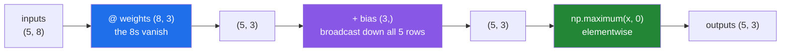

# 3.6 — `A @ B` is every neural layer

## One-line answer

A neural network layer is `inputs @ weights + bias` followed by one elementwise function — so everything
in this section is the whole of the arithmetic, and the shape rule you learned on a chore chart is the
rule that decides whether a network's layers fit together.

---

## The story

The flat wants a single number per person: how much did each of them pull their weight this month.

They already have the chart and a scoring sheet
([3.5](3.5-stacks-of-matrices.md)) — eight jobs down the side, some columns of what each job is worth.
Multiply and you get each person scored on each column.

Then somebody says the totals are unfair, because one person was away for a week, so they add a fixed
adjustment per column: a small number added to everybody's score in that column, the same for everyone.

And finally they decide that negative scores are silly — you cannot do less than nothing — so anything
below zero becomes zero.

Three steps: combine, adjust, clip. That is it. Nothing about that description mentions anything more
complicated than what the flat has already been doing, and it is, exactly, one layer of a neural network.

---

## The idea in plain language

A **layer** takes a batch of inputs, produces a batch of outputs, and consists of three things:

1. **A matrix product.** `inputs @ weights`, where `inputs` is `(batch, in_features)` and `weights` is
   `(in_features, out_features)`. The shape rule from [3.2](3.2-matmul-by-hand.md) says the result is
   `(batch, out_features)`, and the `in_features` vanishes — which is the whole reason the layer is
   described by those two numbers.
2. **A bias.** One number per output feature, **added to every row**. Shape `(out_features,)`, broadcast
   against `(batch, out_features)` by the rule from Day 22
   ([Day 22, 1.3](../../../day-22-broadcasting-and-shape/parts/01-broadcasting/1.3-a-row-against-a-table.md)).
   That is the "same adjustment for everybody" from the story.
3. **An activation.** One elementwise function applied to every value — a ufunc
   ([Day 23, 1.1](../../../day-23-ufuncs-and-statistics/parts/01-ufuncs/1.1-one-operation-every-element.md)).
   The most common is `np.maximum(x, 0)`, called a **rectified linear unit** or ReLU, which is "negative
   becomes zero" and nothing more.

Written out, one layer is one line:

```
outputs = np.maximum(inputs @ weights + bias, 0)
```

Everything you will meet from Day 125 onwards is built by stacking that. A network of three layers is that
line three times with different weights, and the output of one is the input of the next — which means the
`out_features` of one layer must equal the `in_features` of the next, or the shapes will not line up.
**Every "dimension mismatch" error in deep learning is [3.2](3.2-matmul-by-hand.md)'s shape rule.**

Two things are worth stating now, because they explain why so much of this curriculum's early NumPy work
exists.

**The activation is what makes the network more than one matrix.** Without it, stacking layers is
pointless: `(X @ W1) @ W2` is just `X @ (W1 @ W2)`, a single matrix product with a different matrix. The
elementwise nonlinearity is the only thing that stops a hundred layers collapsing into one.

**The batch axis is why [3.5](3.5-stacks-of-matrices.md) mattered.** A layer never processes one example;
it processes a batch, and the matrix product handles all of them in one call. The bias broadcasts across
the batch, the activation is elementwise across the batch, and no loop over examples appears anywhere.

There is no new arithmetic here at all. This document exists because knowing that in advance changes how
Day 125 reads.

---

## Why Setu needs it

- **Day 125's deep learning phase** opens with exactly this, and the plan's stated example for `NP-09` is
  "the operation every neural layer is". This is that claim, made concrete a hundred days early.
- **Day 125's backpropagation** differentiates this expression, and the gradient of a matrix product is
  another matrix product with a transpose — which is why [3.5](3.5-stacks-of-matrices.md)'s
  `swapaxes(-1, -2)` matters there.
- **Day 138's transformers** are the same three steps with an attention mechanism between them, and the
  attention itself is two batched matrix products.
- **Day 91's linear regression** is this with no activation and one output feature, which is why it is the
  right first model.
- **[5.1](../05-the-module/5.1-the-chores-module.md)** scores the chart with this exact expression, so the
  module you write today is a layer without the name.

---

## The mechanism

One layer, on the flat's chart:

```python
import numpy as np

CHORES = np.array(
    ["bins", "hoover", "dishes", "bathroom", "shopping", "recycling", "windows", "post"]
)
SCORES = np.array(["effort", "unpleasantness", "urgency"])

did = np.array(
    [
        [1, 0, 1, 0, 1, 1, 0, 0],
        [0, 1, 1, 1, 0, 0, 1, 0],
        [1, 1, 0, 0, 1, 0, 0, 1],
        [0, 0, 1, 1, 0, 1, 1, 1],
        [1, 0, 0, 1, 1, 0, 1, 0],
    ],
    dtype=np.float64,
)
rng = np.random.default_rng(24)
weights = rng.normal(0.0, 1.0, size=(CHORES.size, SCORES.size))
bias = np.array([-1.0, 0.5, 0.0])

combined = did @ weights
adjusted = combined + bias
activated = np.maximum(adjusted, 0.0)

print("did         :", did.shape, "(people, chores)")
print("weights     :", weights.shape, "(chores, scores)")
print("bias        :", bias.shape, "(scores,)")
print("combined    :", combined.shape, "- the chores axis vanished")
print("adjusted    :", adjusted.shape, "- bias broadcast across all 5 people")
print("activated   :", activated.shape)
print("before relu :", adjusted[0].round(3))
print("after relu  :", activated[0].round(3))
print("negatives   :", np.count_nonzero(adjusted < 0), "of", adjusted.size, "clipped to zero")
```

**Line by line:**

- `dtype=np.float64` on the chart — the BLAS path
  ([3.4](3.4-the-measured-gap.md)), and weights are floats so the product would promote anyway.
- `rng.normal(0.0, 1.0, size=(8, 3))` — random weights, seeded
  ([Day 20, 4.2](../../../day-20-arrays-and-dtypes/parts/04-random/4.2-the-seed-is-part-of-the-result.md)).
  In a real network these start random and are then learned; here they stay random, because the point is
  the shapes and not the learning.
- The shape `(CHORES.size, SCORES.size)` — `(in_features, out_features)`, written from the two things it
  connects rather than as `(8, 3)`. **This is the habit that makes shape errors impossible to write.**
- `did @ weights` — `(5, 8) @ (8, 3)` giving `(5, 3)`. The chores axis is the `k` that agrees and vanishes
  ([3.2](3.2-matmul-by-hand.md)). Five people, three scores each.
- `bias` of shape `(3,)` — **one number per output**, not per person. Adding it to a `(5, 3)` array lines
  up from the right, so the three biases apply to the three columns and are reused for all five rows
  ([Day 22, 1.3](../../../day-22-broadcasting-and-shape/parts/01-broadcasting/1.3-a-row-against-a-table.md)).
  A bias of shape `(5,)` would fail, and that failure is worth provoking once.
- `np.maximum(adjusted, 0.0)` — the ReLU. **Note it is `np.maximum` and not `np.max`**: elementwise, not a
  reduction ([Day 23, 1.5](../../../day-23-ufuncs-and-statistics/parts/01-ufuncs/1.5-maximum-clip-and-elementwise.md)).
  Using `np.max` here would collapse the whole array to one number and the shape error would appear two
  layers later.
- `adjusted[0]` and `activated[0]` printed together — one person's three scores, before and after. The
  negative becomes exactly `0.0` and the positives are untouched, which is the entire function.
- `np.count_nonzero(adjusted < 0)` — how many values the activation zeroed
  ([Day 23, 4.1](../../../day-23-ufuncs-and-statistics/parts/04-counting/4.1-count-nonzero-and-the-mask.md)).
  In a real network this number is watched: a layer where almost everything is zero has "died" and is
  learning nothing.

```text
did         : (5, 8) (people, chores)
weights     : (8, 3) (chores, scores)
bias        : (3,) (scores,)
combined    : (5, 3) - the chores axis vanished
adjusted    : (5, 3) - bias broadcast across all 5 people
activated   : (5, 3)
before relu : [ 1.977 -2.081  1.615]
after relu  : [1.977 0.    1.615]
negatives   : 7 of 15 clipped to zero
```

The three steps, and what each shape does:



Now two layers, which is where the shape chain appears:

```python
import numpy as np

rng = np.random.default_rng(24)
batch = rng.normal(size=(32, 8))

w1, b1 = rng.normal(size=(8, 16)), np.zeros(16)
w2, b2 = rng.normal(size=(16, 3)), np.zeros(3)


def layer(x: np.ndarray, w: np.ndarray, b: np.ndarray) -> np.ndarray:
    return np.maximum(x @ w + b, 0.0)


hidden = layer(batch, w1, b1)
output = layer(hidden, w2, b2)

print("batch     :", batch.shape)
print("w1        :", w1.shape, "-> hidden", hidden.shape)
print("w2        :", w2.shape, "-> output", output.shape)
print("chain     : 8 -> 16 -> 3")
print("collapse? :", np.allclose(batch @ w1 @ w2, layer(layer(batch, w1, b1), w2, b2)))
linear_only = (batch @ w1) @ w2
one_matrix = batch @ (w1 @ w2)
print("no relu   :", np.allclose(linear_only, one_matrix), "<- two layers = one matrix")
```

**Line by line:**

- `layer` as a three-line function — **the whole of a neural network's forward pass**, and it is worth
  noticing how little there is.
- `w1` of shape `(8, 16)` and `w2` of `(16, 3)` — the **16 appears twice**, once as `w1`'s output and once
  as `w2`'s input. That is the chain rule for shapes: each layer's `out_features` is the next layer's
  `in_features`, and the whole network is `8 → 16 → 3`.
- `b1 = np.zeros(16)` — biases start at zero in most initialisation schemes, which is a real convention and
  not a simplification for this example.
- `layer(layer(batch, w1, b1), w2, b2)` — two layers, composed. No loop over the batch of 32 anywhere: the
  matrix product handles all of them ([3.5](3.5-stacks-of-matrices.md)).
- `np.allclose(batch @ w1 @ w2, ...)` — `False`, and it has to be. The activation between the layers means
  the composition is **not** a single matrix product.
- `linear_only` against `one_matrix` — `True`. **Without the activation, two layers collapse into one
  matrix**: `(X @ W1) @ W2` equals `X @ (W1 @ W2)`, because matrix multiplication is associative. This is
  the single most important line in the document. It is why the nonlinearity exists, and it means a
  hundred-layer network with no activations has exactly the expressive power of one layer.

```text
batch     : (32, 8)
w1        : (8, 16) -> hidden (32, 16)
w2        : (16, 3) -> output (32, 3)
chain     : 8 -> 16 -> 3
collapse? : False
no relu   : True <- two layers = one matrix
```

---

## When it breaks

**The weights the wrong way round:**

```text
$ uv run python -c "
import numpy as np
batch = np.ones((32, 8))
weights = np.ones((3, 8))
print('batch   :', batch.shape, ' weights:', weights.shape)
batch @ weights
"
batch   : (32, 8)  weights: (3, 8)
Traceback (most recent call last):
  File "<string>", line 6, in <module>
ValueError: matmul: Input operand 1 has a mismatch in its core dimension 0, with gufunc signature (n?,k),(k,m?)->(n?,m?) (size 3 is different from 8)
```

**What it means.** The weight matrix is `(out, in)` where the layer needs `(in, out)`. This is the single
most common error in hand-written network code, because different frameworks store weights in different
orders — some keep `(out, in)` and transpose at use — so the convention you last read is often not the one
you are writing against. The fix is `batch @ weights.T`, and the fact that it is a transpose away is what
makes the mistake so easy: **it raises when the two numbers differ and silently works when they happen to
be equal**, which is why a hidden layer of the same size as its input is a bad place to test.

**`np.max` instead of `np.maximum`:**

```text
$ uv run python -c "
import numpy as np
x = np.array([[1.0, -2.0, 3.0], [-1.0, 4.0, -5.0]])
print('input        :', x.shape)
print('np.maximum   :', np.maximum(x, 0.0).tolist(), np.maximum(x, 0.0).shape)
print('np.max       :', np.max(x, 0), np.shape(np.max(x, 0)))
print('np.max no arg:', np.max(x), np.shape(np.max(x)))
"
input        : (2, 3)
np.maximum   : [[1.0, 0.0, 3.0], [0.0, 4.0, 0.0]] (2, 3)
np.max       : [1. 4. 3.] (3,)
np.max no arg: 4.0 ()
```

**What it means.** `np.maximum(x, 0.0)` is elementwise and keeps the shape; `np.max(x, 0)` read the `0` as
an **axis** and reduced along it, giving three numbers instead of six
([Day 23, 1.5](../../../day-23-ufuncs-and-statistics/parts/01-ufuncs/1.5-maximum-clip-and-elementwise.md)).
Both run. The shape error appears at the **next** layer, where a `(3,)` array meets a `(3, 16)` weight
matrix and produces something that may or may not raise depending on the sizes. **One letter, and the
error surfaces one function away from its cause.**

**A bias with the batch shape:**

```text
$ uv run python -c "
import numpy as np
combined = np.ones((5, 3))
per_output = np.zeros(3)
per_person = np.zeros(5)
print('per-output bias :', (combined + per_output).shape)
print('per-person bias :', end=' ')
try:
    print((combined + per_person).shape)
except Exception as e:
    print(type(e).__name__, ':', e)
print('with keepdims   :', (combined + per_person[:, np.newaxis]).shape)
"
per-output bias : (5, 3)
per-person bias : ValueError : operands could not be broadcast together with shapes (5,3) (5,) 
with keepdims   : (5, 3)
```

**What it means.** A bias is one number **per output feature**, so its shape is `(out_features,)` and it
broadcasts across the batch. A `(5,)` array — one per person — fails, because broadcasting lines shapes up
from the **right** and the 5 lands under the 3
([Day 22, 1.2](../../../day-22-broadcasting-and-shape/parts/01-broadcasting/1.2-the-rule-in-three-lines.md)).
The last line shows it can be forced with a new axis, and forcing it is almost always wrong: a per-example
adjustment is not a bias, it is a different idea. **This error is the good outcome**, and it becomes a
silent one the day the batch size equals the number of output features.

---

## In production

**What a professional writes instead of the teaching version.** The layer is a small frozen object that
validates its own shapes at construction, so a mismatch is found when the network is built rather than when
data flows:

```python
from __future__ import annotations

from dataclasses import dataclass

import numpy as np


@dataclass(frozen=True, slots=True)
class Dense:
    """One fully connected layer: maximum(x @ weights + bias, 0).

    ``weights`` is (in_features, out_features) - the input convention, not the
    (out, in) some frameworks store. ``bias`` is (out_features,), added to every row.
    """

    weights: np.ndarray
    bias: np.ndarray

    def __post_init__(self) -> None:
        if self.weights.ndim != 2:
            raise ValueError(f"weights must be (in, out), got shape {self.weights.shape}")
        if self.bias.shape != (self.weights.shape[1],):
            raise ValueError(
                f"bias must be (out_features,) = {(self.weights.shape[1],)}, got {self.bias.shape}"
            )

    @property
    def in_features(self) -> int:
        return int(self.weights.shape[0])

    @property
    def out_features(self) -> int:
        return int(self.weights.shape[1])

    def __call__(self, x: np.ndarray) -> np.ndarray:
        if x.shape[-1] != self.in_features:
            raise ValueError(
                f"layer expects {self.in_features} input features, got {x.shape[-1]} "
                f"from shape {x.shape}"
            )
        return np.maximum(x @ self.weights + self.bias, 0.0)


def stack_layers(*layers: Dense) -> None:
    """Check that each layer's outputs feed the next layer's inputs."""
    for i, (before, after) in enumerate(zip(layers, layers[1:])):
        if before.out_features != after.in_features:
            raise ValueError(
                f"layer {i} outputs {before.out_features} features, "
                f"layer {i + 1} expects {after.in_features}"
            )
```

**Line by line:**

- The docstring naming the weight convention explicitly — **the fix for the first failure block**, and the
  one sentence that stops somebody porting code from a framework with the other convention.
- `__post_init__` validating at construction
  ([Day 19, 2.4](../../../day-19-typing-dataclasses-and-concurrency/parts/02-dataclasses/2.4-post-init.md)) —
  a layer with a mismatched bias is broken the moment it is made, and finding that at build time is
  enormously cheaper than finding it in a training loop.
- `self.bias.shape != (self.weights.shape[1],)` — an exact tuple comparison, not a size comparison. A
  `(1, 3)` bias has the same number of elements as a `(3,)` one and broadcasts differently
  ([Day 22, 1.4](../../../day-22-broadcasting-and-shape/parts/01-broadcasting/1.4-keepdims-and-the-column.md)).
- `in_features` and `out_features` as properties rather than stored fields — derived from the weights, so
  they cannot disagree with them.
- `x.shape[-1]` in `__call__` — the input feature count taken from the **last** axis, so the layer works on
  `(batch, features)` and on `(batch, tokens, features)` without change
  ([3.5](3.5-stacks-of-matrices.md)).
- The error message naming the expected count, the actual count **and** the full shape — at three in the
  morning the full shape is what identifies which array arrived.
- `np.maximum(..., 0.0)` with an explicit float `0.0` rather than `0` — keeps the result `float64` rather
  than letting an integer participate in the dtype decision
  ([Day 20, 2.5](../../../day-20-arrays-and-dtypes/parts/02-dtypes/2.5-nep-50-and-the-python-number.md)).
- `stack_layers` checking the chain — **the whole network's shape correctness, in five lines**, run once at
  startup. `zip(layers, layers[1:])` walks consecutive pairs
  ([Day 6, 1.3](../../../day-06-loops/parts/01-iteration/1.3-enumerate-and-zip.md)).

**What changes at scale.** Almost everything about training a network at size is about this one operation.
Three consequences. **The dtype decides the speed**: real training runs in `float32` or `bfloat16` rather
than `float64`, because BLAS and GPU hardware are far faster on narrower types and the accuracy is
sufficient for gradients — but the reductions inside still accumulate in `float32`, for exactly the reason
[Day 23, 2.6](../../../day-23-ufuncs-and-statistics/parts/02-statistics/2.6-float-summation-and-the-drift.md)
gives. **Memory is dominated by activations, not weights**: a `(batch, features)` output must be kept for
every layer during the forward pass so the backward pass can use it, so doubling the batch doubles the
memory even though the weights are unchanged — which is why "reduce the batch size" is the first response
to an out-of-memory error. And **the batch axis is why any of this is fast**: the same weight matrix is
reused across every example in the batch, so a larger batch does more arithmetic per byte of weights read
from memory, which is the entire reason batching exists and the reason a batch of one is dramatically less
efficient per example than a batch of 256.

**The failure that only appears with real data.** A hand-written network used `np.max(x, 0)` instead of
`np.maximum(x, 0)` in its activation. With a hidden size equal to the batch size during development, the
reduced output still had a shape the next layer accepted, so the forward pass ran and the loss decreased —
slowly, because the network had been reduced to something with almost no capacity. It was assumed to be a
learning rate problem for three weeks. The letter `um` was the entire bug.

**The review comment a senior engineer leaves.** *"`weights` here is `(out, in)` but this code does
`x @ weights`. It works because the layer is square. Please settle on `(in, out)`, say so in the docstring,
and validate the bias shape at construction — a `(1, n)` bias broadcasts differently from an `(n,)` one and
neither will raise."*

**The interview question.** *"What is a neural network layer, arithmetically?"* A matrix product, a
broadcast addition and an elementwise function: `maximum(inputs @ weights + bias, 0)`. `inputs` is
`(batch, in_features)`, `weights` is `(in_features, out_features)`, so the shared dimension vanishes and the
output is `(batch, out_features)`; the bias is `(out_features,)` and broadcasts down every row of the batch.
The detail that matters most is why the activation is there at all: without it, `(X @ W1) @ W2` equals
`X @ (W1 @ W2)`, so any number of stacked linear layers collapses into a single matrix and the depth buys
nothing. The details that show experience: `np.maximum` is elementwise while `np.max` is a reduction, and
confusing them produces a shape error one layer downstream rather than where the bug is; the weight
convention differs between frameworks, so `(in, out)` versus `(out, in)` is a transpose away and only
raises when the two numbers differ; and at scale the memory is dominated by the stored activations rather
than the weights, which is why the batch size is the first thing reduced when a run runs out of memory.

---

## Check yourself

```bash
uv run python -c "
import numpy as np
rng = np.random.default_rng(24)
batch = rng.normal(size=(32, 8))
w1, b1 = rng.normal(size=(8, 16)), np.zeros(16)
w2, b2 = rng.normal(size=(16, 3)), np.zeros(3)
layer = lambda x, w, b: np.maximum(x @ w + b, 0.0)
h = layer(batch, w1, b1)
o = layer(h, w2, b2)
print('batch  :', batch.shape, '-> hidden', h.shape, '-> output', o.shape)
print('bias   :', b1.shape, 'broadcast over', h.shape)
print('dead   :', np.count_nonzero(h == 0), 'of', h.size, 'hidden values are zero')
print('collapse without relu :', np.allclose((batch @ w1) @ w2, batch @ (w1 @ w2)))
print('maximum vs max        :', np.maximum(batch, 0).shape, 'vs', np.max(batch, 0).shape)
"
```

The last line shows two functions one letter apart producing different shapes. Say which one is the
activation, and say where the error would surface if you used the other.

**Answer out loud, without scrolling up:**

> Write one layer as one line. Then say what breaks if you remove the activation, and why stacking a
> hundred layers without one is pointless.

---

**Next:** [4.1 — three trips, three prices](../04-linalg/4.1-three-trips-three-prices.md).
