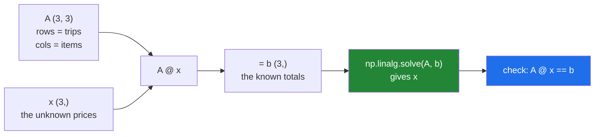

# 4.1 — Three trips, three prices — a system of equations

## One-line answer

When you know several totals and what went into each of them but not the individual prices, you have a
**system of equations** — and writing it as `A @ x = b` turns "work out the prices" into one function
call.

---

## The story

The flat does the shopping in turns and keeps the receipts, but the receipts have been through a washing
machine and only the totals are legible.

Three trips. They remember what was bought each time, because it is always the same three things.

The first trip: two milks, one bread, one dozen eggs. Six pounds forty.
The second: one milk, two breads, one eggs. Six pounds sixty.
The third: no milk, one bread, three eggs. Nine pounds twenty.

Nobody knows what a milk costs. But three totals and three known baskets is enough, and anybody can work
it out with patience: subtract one trip from another to cancel something out, keep going until one price is
alone, then work backwards.

It is fiddly and it always works, provided the three trips were genuinely different from each other. If
the third trip had been exactly the first trip doubled, it would have told them nothing they did not
already know, and no amount of algebra would produce the answer.

---

## The idea in plain language

An **equation** with unknowns in it is a statement that must hold. `2m + 1b + 1e = 6.40` says: two milks
plus a bread plus a box of eggs came to six forty.

A **system of equations** is several of those at once, sharing the same unknowns. Three equations, three
unknowns, and the answer — if there is one — is the set of prices that makes all three true.

The move that turns this into NumPy is to notice that the left-hand sides are a matrix product
([3.2](../03-matmul/3.2-matmul-by-hand.md)). Put the quantities in a matrix `A`, one row per trip and one
column per item. Put the unknown prices in a column `x`. Then `A @ x` is a column of three totals, and
setting it equal to the known totals `b` writes all three equations at once:

```
A @ x = b
```

That is the standard form of every linear system there is, and the whole of `np.linalg` is built around it.
`A` is what you know about the structure, `b` is what you observed, and `x` is what you want.

Three questions decide whether there is an answer, and it is worth having them in advance because
[4.4](4.4-singular-and-the-error.md) is about what happens when they go wrong.

**Are there enough equations?** Three unknowns need three independent equations. Two would leave a whole
family of answers; four would usually leave none that fits exactly, which is
[4.5](4.5-lstsq.md).

**Are they genuinely different?** If one trip is another trip doubled, it repeats information rather than
adding any. A matrix whose rows repeat each other in that sense is called **singular**, and it has no
unique answer.

**Is the answer meaningful?** Even when a unique answer exists, it can be enormously sensitive to tiny
changes in `b` — the trips were nearly-but-not-quite repeats. That is **conditioning**, and it is
[4.6](4.6-conditioning.md).

The function that does the work is `np.linalg.solve(A, b)`. It does not compute an inverse and multiply,
which is what the notation suggests and what [4.2](4.2-solve-and-never-inv.md) explains you should not do
either. And the way to check its answer is to put it back: `A @ x` should equal `b`.

---

## Why Setu needs it

- **[4.2](4.2-solve-and-never-inv.md) through [4.6](4.6-conditioning.md)** are all about this one equation:
  how to solve it, how to measure it, and the three ways it goes wrong.
- **Day 91's linear regression** is this system with more equations than unknowns, solved by
  [4.5](4.5-lstsq.md)'s least squares — so the shopping receipts are the whole of the mathematics behind
  the first model in the curriculum.
- **Day 58's statistics phase** uses matrix form for the same reason: it turns a page of algebra into one
  expression.
- **[5.1](../05-the-module/5.1-the-chores-module.md)** works out what each chore is worth from a few
  people's total scores, which is exactly this system with chores in place of groceries.
- **Day 125's networks** do not solve systems, and knowing why — they use gradient descent because the
  systems are far too large and not linear — needs this as the thing being contrasted with.

---

## The mechanism

The three trips, written down and solved:

```python
import numpy as np

ITEMS = np.array(["milk", "bread", "eggs"])
TRIPS = np.array(["trip 1", "trip 2", "trip 3"])

quantities = np.array(
    [
        [2.0, 1.0, 1.0],
        [1.0, 2.0, 1.0],
        [0.0, 1.0, 3.0],
    ]
)
totals = np.array([6.40, 6.60, 9.20])

prices = np.linalg.solve(quantities, totals)

print("items    :", ITEMS)
print("quantities:")
print(quantities)
print("totals   :", totals)
print("prices   :", prices)
print("rounded  :", prices.round(2))
print("check    :", quantities @ prices, "vs", totals)
print("agrees   :", np.allclose(quantities @ prices, totals))
```

**Line by line:**

- `quantities` as `float` rather than integers — `solve` needs floats and would convert anyway, and being
  explicit means the dtype of the answer is a decision
  ([Day 20, 2.1](../../../day-20-arrays-and-dtypes/parts/02-dtypes/2.1-a-dtype-is-a-promise.md)).
- The matrix laid out with **one row per trip and one column per item** — this orientation is the whole
  translation from the story to the code, and getting it transposed is the failure block below. Read the
  first row as "two milks, one bread, one eggs".
- The third row starting with `0.0` — trip three bought no milk. A zero is a real quantity and not a
  missing value, which matters: the equation still constrains bread and eggs.
- `np.linalg.solve(quantities, totals)` — one call, and it returns the three prices. **It is not `A.I @ b`
  and not `np.linalg.inv(A) @ b`**, for reasons that are [4.2](4.2-solve-and-never-inv.md)'s subject.
- `prices.round(2)` — `[1.2 1.4 2.6]`. Milk is £1.20, bread £1.40, eggs £2.60, which are prices a person
  would recognise. The unrounded version is printed too so you can see it came out essentially exact.
- `quantities @ prices` against `totals` — **the check, and it is the whole reason to trust the answer**.
  Substituting the solution back into the original equations is one matrix product
  ([3.2](../03-matmul/3.2-matmul-by-hand.md)), and it verifies without repeating the solving.
- `np.allclose` rather than `==` — the solution is computed in floating point, so it satisfies the
  equations to about `1e-16` rather than exactly
  ([Day 23, 1.6](../../../day-23-ufuncs-and-statistics/parts/01-ufuncs/1.6-isclose-and-allclose.md)).

```text
items    : ['milk' 'bread' 'eggs']
quantities:
[[2. 1. 1.]
 [1. 2. 1.]
 [0. 1. 3.]]
totals   : [6.4 6.6 9.2]
prices   : [1.2 1.4 2.6]
rounded  : [1.2 1.4 2.6]
check    : [6.4 6.6 9.2] vs [6.4 6.6 9.2]
agrees   : True
```

How the pieces line up:



Now the shape rule, because it is the same rule as everywhere else in this day:

```python
import numpy as np

quantities = np.array([[2.0, 1.0, 1.0], [1.0, 2.0, 1.0], [0.0, 1.0, 3.0]])
totals = np.array([6.40, 6.60, 9.20])
prices = np.linalg.solve(quantities, totals)

print("A shape  :", quantities.shape)
print("b shape  :", totals.shape)
print("x shape  :", prices.shape)
print("A @ x    :", (quantities @ prices).shape, "- matches b")
print("A is square:", quantities.shape[0] == quantities.shape[1])
print("determinant:", round(float(np.linalg.det(quantities)), 6))
print("rank     :", np.linalg.matrix_rank(quantities), "of", quantities.shape[0])
```

**Line by line:**

- `A` is `(3, 3)` and `b` is `(3,)` — **`solve` requires `A` to be square**, because anything else has
  either too few equations or too many
  ([4.5](4.5-lstsq.md)). The number of rows of `A` must match the length of `b`.
- `x` comes back as `(3,)` — the same shape as `b`, which follows from the matrix rule: `(3, 3) @ (3,)`
  gives `(3,)` ([3.2](../03-matmul/3.2-matmul-by-hand.md)).
- `np.linalg.det(quantities)` — the **determinant**, a single number that is zero exactly when the matrix
  is singular. Here it is 8, comfortably away from zero, so there is a unique answer. It is a useful
  diagnostic and a bad test, for reasons [4.4](4.4-singular-and-the-error.md) gives.
- `np.linalg.matrix_rank(quantities)` — **3 of 3**, meaning all three rows carry independent information.
  This is the machine-checkable version of "the three trips were genuinely different", and it is the better
  diagnostic of the two.

```text
A shape  : (3, 3)
b shape  : (3,)
x shape  : (3,)
A @ x    : (3,) - matches b
A is square: True
determinant: 8.0
rank     : 3 of 3
```

---

## When it breaks

**The matrix transposed:**

```text
$ uv run python -c "
import numpy as np
quantities = np.array([[2.0, 1.0, 1.0], [1.0, 2.0, 1.0], [0.0, 1.0, 3.0]])
totals = np.array([6.40, 6.60, 9.20])
right = np.linalg.solve(quantities, totals)
wrong = np.linalg.solve(quantities.T, totals)
print('right :', right.round(3))
print('wrong :', wrong.round(3))
print('right checks out :', np.allclose(quantities @ right, totals))
print('wrong checks out :', np.allclose(quantities @ wrong, totals))
"
right : [1.2 1.4 2.6]
wrong : [2.675 1.05  1.825]
right checks out : True
wrong checks out : False
```

**What it means.** The transposed system solved perfectly happily and returned three plausible prices —
£1.75, £1.05, £2.72 — that are simply not the answer to this question. Transposing turned "rows are trips"
into "rows are items", which is a different and equally well-formed system about nothing.

**The only thing that caught it is the substitution check.** No error, no warning, and the numbers are the
right shape and the right order of magnitude. This is why `np.allclose(A @ x, b)` belongs after every
`solve` in code that matters: it is one line and it is the only defence against a whole class of silent
wrong answers.

**A non-square matrix:**

```text
$ uv run python -c "
import numpy as np
four_trips = np.array([[2.0, 1.0, 1.0], [1.0, 2.0, 1.0], [0.0, 1.0, 3.0], [1.0, 1.0, 1.0]])
totals = np.array([6.40, 6.60, 9.20, 5.20])
np.linalg.solve(four_trips, totals)
"
Traceback (most recent call last):
  File "<string>", line 5, in <module>
  File "...
umpy\linalg\_linalg.py", line 258, in _assert_stacked_square
    raise LinAlgError('Last 2 dimensions of the array must be square')
numpy.linalg.LinAlgError: Last 2 dimensions of the array must be square
```

**What it means.** Four trips, three unknowns. There is no `x` that satisfies all four equations unless the
fourth happens to be consistent with the other three, and `solve` is defined only for the square case. The
error is clear and the fix is not to make the matrix square by throwing a trip away — it is
`np.linalg.lstsq` ([4.5](4.5-lstsq.md)), which finds the prices that come closest to explaining all four.
**More data is not a problem to be discarded**, and reaching for a different function is the right response.

**A length mismatch between `A` and `b`:**

```text
$ uv run python -c "
import numpy as np
quantities = np.array([[2.0, 1.0, 1.0], [1.0, 2.0, 1.0], [0.0, 1.0, 3.0]])
np.linalg.solve(quantities, np.array([6.40, 6.60]))
"
Traceback (most recent call last):
  File "<string>", line 4, in <module>
  File "...
umpy\linalg\_linalg.py", line 411, in solve
    r = gufunc(a, b, signature=signature)
ValueError: solve1: Input operand 1 has a mismatch in its core dimension 0, with gufunc signature (m,m),(m)->(m) (size 2 is different from 3)
```

**What it means.** Three equations and two totals. The signature `(m,m),(m)->(m)` says `A` must be square
and `b`'s length must match its size — the same gufunc notation as `matmul`
([3.1](../03-matmul/3.1-a-dot-product-is-a-total.md)), read the same way: skip to the parenthesis at the
end. In practice this means a row was dropped from one array and not the other, and the fix is upstream,
where the two were built.

---

## In production

**What a professional writes instead of the teaching version.** The system is a named object that checks
itself and verifies its own answer:

```python
from __future__ import annotations

from dataclasses import dataclass

import numpy as np


@dataclass(frozen=True, slots=True)
class LinearSystem:
    """A @ x = b, with the shapes and the solvability checked once."""

    a: np.ndarray
    b: np.ndarray

    def __post_init__(self) -> None:
        if self.a.ndim != 2 or self.a.shape[0] != self.a.shape[1]:
            raise ValueError(f"A must be square, got shape {self.a.shape}")
        if self.b.shape != (self.a.shape[0],):
            raise ValueError(
                f"b must be ({self.a.shape[0]},) to match A's {self.a.shape[0]} rows, "
                f"got {self.b.shape}"
            )
        rank = int(np.linalg.matrix_rank(self.a))
        if rank < self.a.shape[0]:
            raise ValueError(
                f"A has rank {rank} of {self.a.shape[0]}: the rows repeat information "
                f"and there is no unique solution"
            )

    def solve(self, *, verify: bool = True, rtol: float = 1e-8) -> np.ndarray:
        """Solve for x, checking by substitution unless told not to."""
        x = np.linalg.solve(self.a, self.b)
        if verify:
            residual = float(np.abs(self.a @ x - self.b).max())
            scale = float(np.abs(self.b).max()) or 1.0
            if residual > rtol * scale:
                raise AssertionError(f"A @ x differs from b by up to {residual:g}")
        return x
```

**Line by line:**

- `a` and `b` on one object — they are only meaningful together, and a system built from mismatched pieces
  is the third failure block above.
- `self.a.shape[0] != self.a.shape[1]` — the squareness check, done here rather than left to
  `LinAlgError`, so the message can say `A must be square` in the caller's terms.
- The `b` check naming **why** the length must be what it is — "to match A's 3 rows" is diagnosable;
  "shape mismatch" is not.
- `np.linalg.matrix_rank(self.a)` at construction — **the check that catches "the trips were not
  different"** before any solving happens, with a message in the language of the problem. `rank` is a
  better test than `det` because it is computed in a way that tolerates floating point
  ([4.4](4.4-singular-and-the-error.md)).
- `verify: bool = True` as a keyword-only argument defaulting to **on** — the substitution check from the
  first failure block, made the default rather than something to remember. Turning it off is possible and
  has to be asked for.
- `residual > rtol * scale` rather than a bare tolerance — the acceptable error depends on the size of the
  numbers, so comparing against `rtol * max(|b|)` is scale-aware where a fixed `1e-8` would be wrong for
  totals in pence and wrong again for totals in millions.
- `or 1.0` on the scale — guards the case where every total is zero, which is a legitimate system and would
  otherwise make every residual fail the test by dividing meaning out of it.
- `AssertionError` rather than returning a flag — a solution that does not satisfy its own equations is not
  a result to be handled downstream; it means something is wrong here.

**What changes at scale.** Solving is `n³` operations, so the size of the system is the thing that decides
everything. A thousand unknowns is about a billion operations and takes a moment; a million unknowns is
`10¹⁸` and is simply not solvable this way — which is why every large system in practice is either
**sparse** (mostly zeros, solved by methods that never form the full matrix) or solved **iteratively**
(guess, measure the error, improve, repeat) rather than exactly. Memory is the other wall: a dense `(n, n)`
matrix of `float64` is `8n²` bytes, so fifty thousand unknowns is 20 GB before any arithmetic. And the
third thing that changes is what "the answer" means: at small sizes the residual is around `1e-16` and can
be ignored, while at large sizes and poor conditioning it becomes the number you report alongside the
solution ([4.6](4.6-conditioning.md)). That is why the production code above returns a verified answer
rather than a bare array.

**The failure that only appears with real data.** A pricing model solved a small system to allocate a
bundled discount across line items. The matrix was built from a database query whose column order was not
pinned, and a schema change reordered two columns. The system still solved, still returned plausible
positive prices, and allocated the discount to the wrong items. There was no exception and the totals still
added up, because the totals were the `b` vector and those were still right. The substitution check would
not have caught this one either — `A @ x` still equalled `b` — which is why the **rank and shape checks are
not the whole story** and why the column order deserves to be pinned by name rather than by position.

**The review comment a senior engineer leaves.** *"`np.linalg.solve(A, b)` with no check that `A @ x`
recovers `b`. A transposed `A` here solves fine and returns different, entirely plausible numbers. Add the
substitution check, and please assert the rank at construction — a degenerate matrix raises with a message
that says nothing about our domain."*

**The interview question.** *"You know three totals and what went into each. How do you get the individual
prices?"* Write it as `A @ x = b`, where `A` holds the quantities with one row per observation and one
column per unknown, `b` holds the totals and `x` is what you want, then `np.linalg.solve(A, b)`. The things
that decide whether it works: `A` has to be square, so as many independent equations as unknowns; the rows
have to be genuinely independent, which `np.linalg.matrix_rank` checks and which fails when one observation
is a combination of the others; and the answer has to be verified by substitution, because a transposed `A`
solves perfectly and returns plausible wrong numbers with no error at all. If there are more equations than
unknowns the right function is `np.linalg.lstsq` rather than discarding rows, and if `A` is large the
answer is usually a sparse or iterative method, because solving is `n³` and a dense matrix is `8n²` bytes.

---

## Check yourself

```bash
uv run python -c "
import numpy as np
A = np.array([[2.0, 1.0, 1.0], [1.0, 2.0, 1.0], [0.0, 1.0, 3.0]])
b = np.array([6.40, 6.60, 9.20])
x = np.linalg.solve(A, b)
print('prices    :', x.round(2))
print('substitute:', (A @ x).round(2), 'vs', b)
print('agrees    :', np.allclose(A @ x, b))
print('rank      :', np.linalg.matrix_rank(A), 'of', A.shape[0])
print('det       :', round(float(np.linalg.det(A)), 6))
xt = np.linalg.solve(A.T, b)
print('transposed:', xt.round(2))
print('and checks:', np.allclose(A @ xt, b))
"
```

The last two lines solve a transposed system and get an answer that fails the substitution check. Say what
question the transposed system was answering, and why nothing raised.

**Answer out loud, without scrolling up:**

> Write three shopping trips as `A @ x = b` and say what each of the three letters holds. Then name the one
> line you write after every `solve`, and what it catches.

---

**Next:** [4.2 — `solve`, and never `inv`](4.2-solve-and-never-inv.md).
