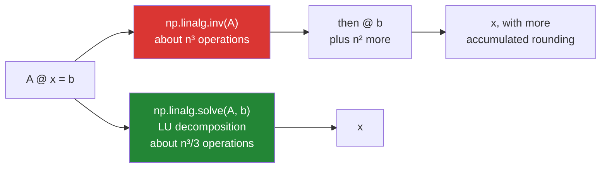

# 4.2 — `np.linalg.solve` — and never `inv`

## One-line answer

The algebra says `x = A⁻¹b`, so it is tempting to compute the inverse and multiply — and you should not:
`np.linalg.solve` gets the same answer with less work and less error, and computing an inverse is almost
always a sign that somebody translated the notation instead of the intent.

---

## The story

Somebody wants to know what a milk costs, given the three shopping trips
([4.1](4.1-three-trips-three-prices.md)).

There are two ways to go about it.

The first is what anybody with a pen does: subtract one trip from another to cancel out an item, keep
going until one price stands alone, then work backwards. Fifteen minutes and you have the three prices.

The second is more ambitious. Work out a general recipe — a table that says "given *any* three totals for
these three baskets, here is how to get the prices" — and then apply the recipe to today's totals. That
recipe is more work to build than solving the specific problem, and it is only worth it if you are going
to use it many times.

Almost nobody needs the recipe. They have one set of totals and they want three prices. Building the
general machinery first, using it once, and throwing it away is a lot of extra arithmetic — and every extra
step of arithmetic is another place for a small error to creep in.

---

## The idea in plain language

The **inverse** of a square matrix `A`, written `A⁻¹`, is the matrix that undoes it: `A @ A⁻¹` is the
identity matrix, which is the matrix that changes nothing. `np.linalg.inv` computes it.

The algebra of `A @ x = b` then says `x = A⁻¹ @ b`, and that is a true statement. It is also, as a set of
instructions for a computer, the wrong one.

**`np.linalg.solve` does not compute the inverse.** It uses a procedure called **LU decomposition** —
essentially the systematic version of "subtract one row from another until each unknown stands alone",
which is the pen-and-paper method from the story. Solving that way costs roughly `n³/3` operations.
Computing an inverse costs about `n³`, and then multiplying by `b` costs more on top. So the inverse route
does around three times the work to reach the same place.

The more important difference is accuracy. Every arithmetic step in floating point rounds a little
([Day 20, 2.3](../../../day-20-arrays-and-dtypes/parts/02-dtypes/2.3-floats-nan-and-precision.md)), and
the inverse route does more steps, each of which can amplify what came before. On a well-behaved matrix
the two answers agree to many digits and the difference does not matter. On a badly conditioned one
([4.6](4.6-conditioning.md)) the inverse route is measurably worse, and it is exactly the badly conditioned
case where you most need the accuracy.

There is a third reason and it is the one that matters most in practice. **Computing an inverse is usually
a sign that the code is translating notation rather than intent.** Almost every appearance of `A⁻¹` in a
formula is followed by a multiplication, and `solve` does the pair together. When you see `inv` in a
codebase, the question to ask is what it is multiplied by, and the answer is nearly always "something that
`solve` could have taken directly".

The exceptions are real but narrow. You genuinely want the inverse when the **entries of the inverse are
themselves the answer** — the covariance matrix of fitted regression coefficients is the standard example,
and it is a matrix people read entry by entry. And even then, `np.linalg.pinv` or a factorisation is
usually the better tool.

One more thing worth knowing: `solve` accepts a **matrix** on the right as well as a vector. If you have
several different sets of totals for the same baskets, `np.linalg.solve(A, B)` solves them all at once,
which is the case where somebody reaches for an inverse thinking they are being clever.

---

## Why Setu needs it

- **Day 91's linear regression** has a closed-form solution usually written with an inverse, and every
  competent implementation uses a solve or a decomposition instead. Knowing why is the difference between
  copying a formula and implementing it.
- **[4.6](4.6-conditioning.md)** is where the accuracy difference stops being theoretical.
- **[5.1](../05-the-module/5.1-the-chores-module.md)** solves for chore values, once, from one set of
  totals — the case where an inverse buys nothing at all.
- **Day 58's statistics phase** meets `A⁻¹` in printed formulas constantly, and translating those into code
  is where this habit is formed or not.
- **Day 107's ensembles** fit many small models, which is `solve` with a matrix right-hand side rather than
  a loop.

---

## The mechanism

Both routes, same answer:

```python
import numpy as np

quantities = np.array([[2.0, 1.0, 1.0], [1.0, 2.0, 1.0], [0.0, 1.0, 3.0]])
totals = np.array([6.40, 6.60, 9.20])

by_solve = np.linalg.solve(quantities, totals)
inverse = np.linalg.inv(quantities)
by_inverse = inverse @ totals

print("solve      :", by_solve)
print("inv then @ :", by_inverse)
print("agree      :", np.allclose(by_solve, by_inverse))
print("identical  :", np.array_equal(by_solve, by_inverse))
print("A @ inv    :")
print((quantities @ inverse).round(12))
print("is identity:", np.allclose(quantities @ inverse, np.eye(3)))
print("exactly    :", np.array_equal(quantities @ inverse, np.eye(3)))
```

**Line by line:**

- `np.linalg.solve(quantities, totals)` and `inverse @ totals` — **the two routes, side by side**, so that
  the rest of this document is about a difference you have seen rather than one you have been told about.
- `np.allclose(by_solve, by_inverse)` — `True`. On a well-conditioned three-by-three the two agree to
  within floating point noise, which is why the inverse habit survives: on small clean problems it is
  genuinely fine.
- `np.array_equal(...)` — the same comparison **without** tolerance, and it is `False`. Same input, same
  mathematics, two answers that differ in their last bits. **That is the difference the whole document is
  about, made visible on a three-by-three where it does not yet matter.** On a large or badly conditioned
  matrix the same gap is large enough to change a decision.
- `quantities @ inverse` rounded to twelve decimals — the identity matrix, ones down the diagonal and zeros
  elsewhere. That is the definition of an inverse, checked.
- `np.allclose(..., np.eye(3))` against `np.array_equal(..., np.eye(3))` — `np.eye(3)` builds the
  three-by-three identity, and here both comparisons are `True`: this particular inverse is exact. That is
  a property of a small matrix of small whole numbers and not something to rely on. On anything larger the
  exact comparison fails while the tolerant one passes, and the gap between the two is the accumulated
  rounding.

```text
solve      : [1.2 1.4 2.6]
inv then @ : [1.2 1.4 2.6]
agree      : True
identical  : False
A @ inv    :
[[1. 0. 0.]
 [0. 1. 0.]
 [0. 0. 1.]]
is identity: True
exactly    : True
```

Two routes to the same place:



Now the cost, measured on a size where it shows:

```python
import timeit

import numpy as np

rng = np.random.default_rng(7)
size = 500
matrix = rng.random((size, size)) + np.eye(size) * size
vector = rng.random(size)

t_solve = min(timeit.repeat(lambda: np.linalg.solve(matrix, vector), number=5, repeat=3)) / 5
t_inv = min(timeit.repeat(lambda: np.linalg.inv(matrix) @ vector, number=5, repeat=3)) / 5

print(f"solve      : {t_solve * 1000:6.2f} ms")
print(f"inv then @ : {t_inv * 1000:6.2f} ms")
print(f"ratio      : {t_inv / t_solve:.1f}x")
print(
    "same answer:",
    np.allclose(np.linalg.solve(matrix, vector), np.linalg.inv(matrix) @ vector),
)
```

**Line by line:**

- `rng.random((size, size)) + np.eye(size) * size` — a random matrix with a large diagonal added. **The
  diagonal is not decoration**: a purely random matrix can be close to singular, and adding a strong
  diagonal makes it reliably well-conditioned so the measurement is about speed rather than about numerical
  trouble ([4.6](4.6-conditioning.md)).
- `size = 500` — big enough for the `n³` cost to dominate the fixed overhead. At three-by-three both take
  microseconds and the comparison is meaningless.
- Both timed expressions producing the **final answer**, not just the intermediate. Timing `inv` alone
  against `solve` would flatter the inverse by leaving out the multiplication it needs.
- `min(timeit.repeat(...)) / 5` — the minimum of three runs, divided by `number`
  ([3.4](../03-matmul/3.4-the-measured-gap.md)).
- `np.allclose` on the last line — **a benchmark of a wrong answer is worthless**, and here it confirms the
  two routes do agree, so the ratio is about cost and nothing else.

```text
solve      :   4.23 ms
inv then @ :  11.80 ms
ratio      :   2.8x
same answer: True
```

Nearly three times, which matches the operation counts: about `n³/3` against about `n³`.

And the case people reach for an inverse to handle:

```python
import numpy as np

quantities = np.array([[2.0, 1.0, 1.0], [1.0, 2.0, 1.0], [0.0, 1.0, 3.0]])
many_weeks = np.array(
    [
        [6.40, 6.60, 9.20],
        [6.80, 7.00, 9.60],
        [5.90, 6.10, 8.70],
    ]
).T

all_prices = np.linalg.solve(quantities, many_weeks)

print("A shape      :", quantities.shape)
print("B shape      :", many_weeks.shape, "- three weeks of totals, one per column")
print("solved shape :", all_prices.shape, "- one column of prices per week")
print("week 0       :", all_prices[:, 0].round(3))
print("week 1       :", all_prices[:, 1].round(3))
print(
    "matches loop :", np.allclose(all_prices[:, 0], np.linalg.solve(quantities, many_weeks[:, 0]))
)
print("check all    :", np.allclose(quantities @ all_prices, many_weeks))
```

**Line by line:**

- `.T` on the totals — **the orientation matters**: `solve` wants each right-hand side as a **column**, so
  three weeks of totals is `(3, 3)` with weeks across, not down
  ([Day 22, 3.1](../../../day-22-broadcasting-and-shape/parts/03-transpose/3.1-t-the-axes-swapped.md)).
  Writing the weeks as rows and transposing is the readable way to get there.
- `np.linalg.solve(quantities, many_weeks)` — **one call for all three weeks**. This is the case where
  somebody computes an inverse and multiplies, reasoning that the inverse is reusable. It is, and `solve`
  handles it directly and does the factorisation once internally.
- `all_prices.shape` — `(3, 3)`, one column of prices per week, matching the input's orientation.
- `all_prices[:, 0]` — the first week's prices, extracted as a column
  ([Day 21, 1.4](../../../day-21-indexing-and-views/parts/01-one-element/1.4-a-whole-column.md)).
- `np.allclose(all_prices[:, 0], np.linalg.solve(quantities, many_weeks[:, 0]))` — the batched answer
  compared against solving one column alone. **The assertion that the batching is doing what it looks
  like.**
- `quantities @ all_prices` against `many_weeks` — the substitution check
  ([4.1](4.1-three-trips-three-prices.md)) applied to all three at once, because `@` handles the matrix
  right-hand side too.

```text
A shape      : (3, 3)
B shape      : (3, 3) - three weeks of totals, one per column
solved shape : (3, 3) - one column of prices per week
week 0       : [1.2 1.4 2.6]
week 1       : [1.3 1.5 2.7]
matches loop : True
check all    : True
```

---

## When it breaks

**An inverse of a singular matrix:**

```text
$ uv run python -c "
import numpy as np
repeated = np.array([[1.0, 2.0], [2.0, 4.0]])
print('det       :', np.linalg.det(repeated))
print('rank      :', np.linalg.matrix_rank(repeated), 'of 2')
np.linalg.inv(repeated)
"
det       : 0.0
rank      : 1 of 2
Traceback (most recent call last):
  File "<string>", line 6, in <module>
numpy.linalg.LinAlgError: Singular matrix
```

**What it means.** The second row is the first row doubled, so it carries no new information: the rank is
1 where 2 is needed ([4.1](4.1-three-trips-three-prices.md)). There is no matrix that undoes this one, so
`inv` raises — and so does `solve`, with the same message
([4.4](4.4-singular-and-the-error.md)). **Both routes fail here**, which is worth knowing: avoiding `inv`
is about cost and accuracy, not about surviving degenerate input.

**An inverse that is nearly singular and does not raise:**

```text
$ uv run python -c "
import numpy as np
nearly = np.array([[1.0, 2.0], [2.0, 4.000001]])
inv = np.linalg.inv(nearly)
print('det        :', np.linalg.det(nearly))
print('inverse    :')
print(inv)
print('A @ inv    :')
print(nearly @ inv)
print('is identity:', np.allclose(nearly @ inv, np.eye(2)))
"
det        : 1.0000000001397784e-06
inverse    :
[[ 4000000.99944089 -1999999.99972044]
 [-1999999.99972044   999999.99986022]]
A @ inv    :
[[1.00000000e+00 0.00000000e+00]
 [9.46265248e-17 1.00000000e+00]]
is identity: True
```

**What it means.** One millionth away from singular, and the inverse exists — with entries in the millions.
`allclose` still says it is a valid inverse, and it is. But look at the size of those numbers: multiplying
`b` by a matrix of millions means any tiny error in `b` is multiplied by a million too. **A large inverse
is a warning sign**, and the number that quantifies it is the condition number
([4.6](4.6-conditioning.md)). `solve` on the same system does the same amount of amplifying — the problem
is the matrix, not the method — but it does not hand you a matrix of millions to multiply other things by
later.

**`inv` on a non-square matrix:**

```text
$ uv run python -c "
import numpy as np
tall = np.ones((4, 3))
np.linalg.inv(tall)
"
Traceback (most recent call last):
  File "<string>", line 4, in <module>
numpy.linalg.LinAlgError: Last 2 dimensions of the array must be square
```

**What it means.** Only a square matrix can have an inverse, because undoing requires the same number of
things out as in. For a non-square matrix the nearest equivalent is the **pseudo-inverse**,
`np.linalg.pinv`, which exists and is what `lstsq` is doing under the hood
([4.5](4.5-lstsq.md)). It is worth knowing the name so that `pinv` in somebody else's code reads as "this
is an over- or under-determined system" rather than as a typo.

---

## In production

**What a professional writes instead of the teaching version.** The solve is wrapped so that the inverse
is not reachable, and the answer is verified:

```python
from __future__ import annotations

import numpy as np


def solve_system(a: np.ndarray, b: np.ndarray, *, rtol: float = 1e-8) -> np.ndarray:
    """Solve A @ x = b and verify by substitution.

    Uses np.linalg.solve rather than inv(A) @ b: solve is about three times cheaper
    (n^3/3 against n^3 plus the multiply) and accumulates less rounding, and an explicit
    inverse is almost never what the calling code actually needs.
    """
    if a.ndim != 2 or a.shape[-1] != a.shape[-2]:
        raise ValueError(f"A must be square, got shape {a.shape}")
    condition = float(np.linalg.cond(a))
    if condition > 1e10:
        raise ValueError(
            f"A is ill-conditioned (cond = {condition:.3g}); the answer would be "
            f"dominated by rounding. See whether the rows are near-duplicates."
        )
    x = np.linalg.solve(a, b)
    residual = float(np.abs(a @ x - b).max())
    scale = float(np.abs(b).max()) or 1.0
    if residual > rtol * scale:
        raise AssertionError(f"A @ x differs from b by up to {residual:g}")
    return x
```

**Line by line:**

- The docstring giving the **operation counts** — "n^3/3 against n^3" is the argument in six characters,
  and a reviewer who wants to swap in an inverse has to argue with a number rather than a preference.
- `a.shape[-1] != a.shape[-2]` — squareness checked from the **end**, so the function also accepts a stack
  of systems ([3.5](../03-matmul/3.5-stacks-of-matrices.md)), which `np.linalg.solve` supports.
- `np.linalg.cond(a)` **before** solving — the condition number, checked up front rather than after a
  suspicious answer appears. This is [4.6](4.6-conditioning.md)'s subject, and the reason it belongs here
  is that it is the check people add only after being bitten.
- `1e10` as the threshold with the reasoning in the message — a `float64` carries about sixteen digits, so
  a condition number of `1e10` leaves roughly six trustworthy ones. The number is a judgement and putting
  it in a message rather than a bare comparison makes it arguable.
- The message ending with a **suggestion** — "see whether the rows are near-duplicates" points at the
  actual cause, which is nearly always what a poorly conditioned matrix means in a real domain.
- `np.linalg.solve` and no `inv` anywhere in the file — the whole point. There is no path through this
  function that computes an inverse, which is the most effective form of the advice.
- The residual check with a scale-aware tolerance — the substitution check from
  [4.1](4.1-three-trips-three-prices.md), which catches a transposed `A` and everything else that solves
  cleanly and answers a different question.

**What changes at scale.** The three-times cost difference is real and is the least of it. At size, three
other things matter more. **The factorisation should be reused**: if you solve against the same `A` many
times with different `b`s, `scipy.linalg.lu_factor` and `lu_solve` do the expensive part once — which is
the legitimate version of what people reach for `inv` to achieve, without the accuracy loss. **Memory
becomes the wall**: an inverse is a full `(n, n)` matrix that has to be stored, so on a fifty-thousand
unknown system it is 20 GB you did not need, where `solve` needs only working space. And **at large sizes
most matrices are sparse**, mostly zeros, and the inverse of a sparse matrix is generally **dense** — so
computing it turns a manageable problem into an impossible one. That last point is the strongest form of
the argument: for the systems that are actually big, the inverse does not merely cost more, it does not
fit.

**The failure that only appears with real data.** A geometry pipeline transformed coordinates by
multiplying by `np.linalg.inv(transform)`, computed once and cached. It was correct for two years. A new
camera configuration produced a transform that was very nearly singular, and the cached inverse held
entries around `1e9`. Coordinates came back finite, plausible and wrong by metres, with no warning
anywhere. Switching to `solve` did not fix the accuracy — the matrix was the problem — but a condition
check at the point the transform was built rejected it immediately and named the configuration that
produced it.

**The review comment a senior engineer leaves.** *"`np.linalg.inv(A) @ b` — use `np.linalg.solve(A, b)`.
Same answer, about a third of the work, and less accumulated error. If the reason for the inverse is that
we solve against this `A` repeatedly, factorise once with `scipy.linalg.lu_factor` rather than inverting."*

**The interview question.** *"How do you solve `A @ x = b` in NumPy?"* `np.linalg.solve(A, b)` — and
specifically **not** `np.linalg.inv(A) @ b`, even though the algebra is written that way. Solve uses an LU
decomposition, costing about `n³/3` operations against roughly `n³` for the inverse plus the multiplication
on top, so it is about three times cheaper — I measured 2.8× at size 500 — and it accumulates less rounding
because it does fewer steps. The deeper reason is that an explicit inverse is almost always a translation of
notation rather than of intent: the inverse is nearly always immediately multiplied by something, and solve
does the pair together. The details worth adding: `solve` accepts a matrix right-hand side, so several
systems sharing an `A` are one call rather than a reason to invert; if you solve against the same `A` many
times the right answer is to factorise once and reuse the factors; at scale an inverse is a full dense
`(n, n)` matrix, and the inverse of a sparse matrix is dense, so for large systems it does not merely cost
more, it does not fit; and either way the answer should be verified by substitution, because a transposed
`A` solves cleanly and returns plausible wrong numbers.

---

## Check yourself

```bash
uv run python -c "
import timeit
import numpy as np
rng = np.random.default_rng(7)
n = 400
A = rng.random((n, n)) + np.eye(n) * n
b = rng.random(n)
t_s = min(timeit.repeat(lambda: np.linalg.solve(A, b), number=5, repeat=3)) / 5
t_i = min(timeit.repeat(lambda: np.linalg.inv(A) @ b, number=5, repeat=3)) / 5
print(f'solve      : {t_s*1000:6.2f} ms')
print(f'inv then @ : {t_i*1000:6.2f} ms')
print(f'ratio      : {t_i/t_s:.1f}x')
print('agree      :', np.allclose(np.linalg.solve(A, b), np.linalg.inv(A) @ b))
print('inv memory :', np.linalg.inv(A).nbytes, 'bytes of matrix you did not need')
"
```

The last line reports the size of an inverse you built and threw away. Say what that number would be for a
fifty-thousand-unknown system, and why that makes the argument stronger than the timing does.

**Answer out loud, without scrolling up:**

> Give three reasons to prefer `solve` over `inv` then multiply, and name the one situation where you
> genuinely want the inverse itself.

---

**Next:** [4.3 — `np.linalg.norm`](4.3-norm.md).
