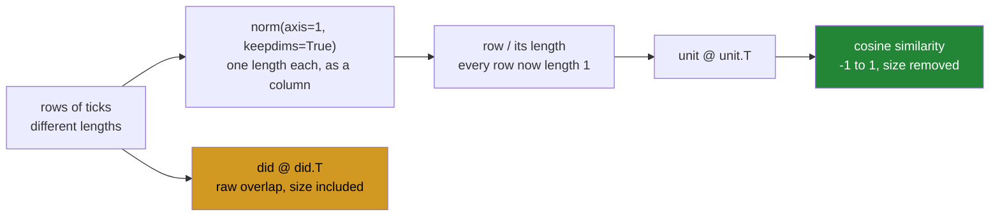

# 4.3 — `np.linalg.norm` — length, and the axis it reduces

## One-line answer

A **norm** turns a whole row of numbers into a single measure of how big it is, and dividing a row by its
own norm makes it length one — which is the step that turns a dot product into a similarity score.

---

## The story

Two people compare their weeks. One did four jobs, the other did five.

That is a fair comparison of effort. It is a bad comparison of *taste*, because the person who did five
jobs will look more similar to everybody simply by having done more. Their row has more ticks in it, so it
overlaps more with every other row, so every pairing involving them scores higher — regardless of whether
they and the other person like the same jobs.

To compare taste rather than volume you have to take the volume out first. Scale each row down by how much
that person did, so everybody's row is the same "size", and only the **pattern** of which jobs is left.

The person who did five jobs and the person who did four are now comparable, and a high score means they
chose the same kinds of job rather than that one of them was busier.

---

## The idea in plain language

A **norm** is a single number measuring how big a whole array is. `np.linalg.norm` computes one.

The default is the **Euclidean norm**, also called the L2 norm: square every element, add them up, take the
square root. For a row of two numbers it is exactly the length of an arrow from the origin, which is where
the word "length" comes from and why it is worth picturing.

Two more are common enough to name:

- **L1**, `ord=1`: add the absolute values, no squaring. For a row of ticks it is simply how many ticks
  there are.
- **L-infinity**, `ord=np.inf`: the largest absolute value. For a row of ticks it is 1 if anybody did
  anything.

Which one you want depends on what "big" should mean, and the default L2 is right far more often than not.

The `axis=` argument works exactly as it does for every reduction on this curriculum: **the axis you name
is the one that disappears**
([Day 23, 2.2](../../../day-23-ufuncs-and-statistics/parts/02-statistics/2.2-axis-the-one-that-disappears.md)).
`np.linalg.norm(did, axis=1)` gives one length per person; without an axis it collapses the whole array to
a single number, which is almost never what anybody wanted.

Now the operation this is really for. Dividing a row by its own norm gives a row of length exactly one,
called a **unit vector**, and the process is called **normalising**. Do that to every row and then take a
dot product between two of them ([3.1](../03-matmul/3.1-a-dot-product-is-a-total.md)), and the answer is
the **cosine similarity**: a number between −1 and 1 that measures how much the two rows point the same
way, with the effect of their sizes removed.

That is the whole of vector search, a hundred and thirty days early. A document becomes a row of numbers, a
query becomes a row of numbers, and "how relevant is this document" is the cosine similarity between them.
The normalising is what stops a long document scoring highly against everything simply for being long — the
same problem as the flatmate who did five jobs.

One practical detail that becomes a bug: dividing by the norm needs `keepdims=True`. The norms of five rows
come back as `(5,)`, and dividing a `(5, 8)` array by a `(5,)` array fails, because broadcasting lines up
from the right ([Day 22, 1.4](../../../day-22-broadcasting-and-shape/parts/01-broadcasting/1.4-keepdims-and-the-column.md)).
`keepdims=True` gives `(5, 1)`, which broadcasts down the rows correctly.

---

## Why Setu needs it

- **Day 155's vector databases** rank by cosine similarity, which is this operation followed by a matrix
  product. Every store benchmarked there is competing on how fast it can do it.
- **Day 162's RAG retriever** normalises embeddings once at index time so that retrieval is a plain dot
  product, which is the standard optimisation and only makes sense once you know what normalising is.
- **[5.1](../05-the-module/5.1-the-chores-module.md)** reports both a raw overlap grid and a normalised
  one, because the two answer different questions.
- **Day 76's feature scaling** normalises rows or columns for the same reason: to stop a feature dominating
  because of its units rather than its information.
- **Day 125's training** monitors the norm of the gradient, and clipping it when it grows too large is one
  of the standard fixes for a network that will not converge.

---

## The mechanism

Lengths, three ways, and the normalising:

```python
import numpy as np

did = np.array(
    [
        [1, 0, 1, 0, 1, 1, 0, 0],
        [0, 1, 1, 1, 0, 0, 1, 0],
        [1, 1, 0, 0, 1, 0, 0, 1],
        [0, 0, 1, 1, 0, 1, 1, 1],
        [1, 0, 0, 1, 1, 0, 1, 0],
    ],
    dtype=np.float64,
)

print("whole array :", round(float(np.linalg.norm(did)), 4))
print("per person  :", np.linalg.norm(did, axis=1).round(4))
print("sqrt(counts):", np.sqrt(did.sum(axis=1)))
print("L1 per person:", np.linalg.norm(did, ord=1, axis=1))
print("Linf         :", np.linalg.norm(did, ord=np.inf, axis=1))
print(
    "shape check  :",
    np.linalg.norm(did, axis=1).shape,
    "vs keepdims",
    np.linalg.norm(did, axis=1, keepdims=True).shape,
)
```

**Line by line:**

- `dtype=np.float64` — norms produce floats and the division below needs them; being explicit avoids an
  integer array being promoted at an unexpected moment
  ([Day 20, 2.5](../../../day-20-arrays-and-dtypes/parts/02-dtypes/2.5-nep-50-and-the-python-number.md)).
- `np.linalg.norm(did)` with **no axis** — one number for the whole forty-element array, 4.58. This is
  almost never the question, and it is the default, which is why the axis is the argument to remember.
- `np.linalg.norm(did, axis=1)` — five numbers, one per person. `axis=1` eats the chores
  ([Day 23, 2.2](../../../day-23-ufuncs-and-statistics/parts/02-statistics/2.2-axis-the-one-that-disappears.md)).
- `np.sqrt(did.sum(axis=1))` printed underneath — **the same numbers**, because squaring a 0 or a 1 changes
  nothing, so the L2 norm of a row of ticks is the square root of how many there are. Seeing that
  identity is what makes the norm concrete rather than a formula.
- `ord=1` — `[4. 4. 4. 5. 4.]`, which is the count of ticks exactly. For 0/1 data the L1 norm **is** the
  count, which is a useful thing to recognise.
- `ord=np.inf` — all ones, because the largest value in any row is 1. On this data it carries no
  information at all, which is a fair demonstration that the choice of norm is a choice about the question.
- The last line printing both shapes — `(5,)` against `(5, 1)`. **This is the line that prevents the
  failure block below**, and printing it beside the values is cheaper than remembering the rule.

```text
whole array : 4.5826
per person  : [2.     2.     2.     2.2361 2.    ]
sqrt(counts): [2.         2.         2.         2.23606798 2.        ]
L1 per person: [4. 4. 4. 5. 4.]
Linf         : [1. 1. 1. 1. 1.]
shape check  : (5,) vs keepdims (5, 1)
```

Now the normalising, and the similarity it makes possible:

```python
import numpy as np

did = np.array(
    [
        [1, 0, 1, 0, 1, 1, 0, 0],
        [0, 1, 1, 1, 0, 0, 1, 0],
        [1, 1, 0, 0, 1, 0, 0, 1],
        [0, 0, 1, 1, 0, 1, 1, 1],
        [1, 0, 0, 1, 1, 0, 1, 0],
    ],
    dtype=np.float64,
)

unit = did / np.linalg.norm(did, axis=1, keepdims=True)
raw_overlap = did @ did.T
cosine = unit @ unit.T

print("unit lengths :", np.linalg.norm(unit, axis=1))
print("raw overlap  :")
print(raw_overlap.astype(int))
print("cosine       :")
print(cosine.round(3))
print("diagonal     :", np.diag(cosine).round(6), "- every row against itself")
print("range        :", round(float(cosine.min()), 3), "to", round(float(cosine.max()), 3))
```

**Line by line:**

- `np.linalg.norm(did, axis=1, keepdims=True)` — `(5, 1)`, a **column** of lengths
  ([Day 22, 1.4](../../../day-22-broadcasting-and-shape/parts/01-broadcasting/1.4-keepdims-and-the-column.md)).
  Dividing `(5, 8)` by `(5, 1)` broadcasts the length across each row, which is exactly "scale this person's
  row by how much they did".
- `np.linalg.norm(unit, axis=1)` — all exactly 1.0. **The definition, checked**, and the line to write
  after any normalisation you did not watch happen.
- `did @ did.T` — the raw overlap grid from [3.2](../03-matmul/3.2-matmul-by-hand.md), counts of shared
  jobs.
- `unit @ unit.T` — **the same operation on the normalised rows**, which is the cosine similarity. Nothing
  new: one division and then the matrix product that was already there.
- `np.diag(cosine)` — all 1.0, because a unit row dotted with itself is its own squared length, which is
  one. That is the check that the normalisation actually took.
- `cosine.min()` and `.max()` — the range. For non-negative data like this it runs from 0 to 1; with
  negative values it would run from −1 to 1. Knowing the range is what lets you set a relevance threshold
  later.
- Comparing the two grids by eye is the point of printing both. Person 3 did five jobs and has the largest
  raw overlaps; in the cosine grid their advantage is gone, and the highest off-diagonal score is between
  persons 1 and 3 at 0.671 — a genuine similarity of taste rather than of volume.

```text
unit lengths : [1. 1. 1. 1. 1.]
raw overlap  :
[[4 1 2 2 2]
 [1 4 1 3 2]
 [2 1 4 1 2]
 [2 3 1 5 2]
 [2 2 2 2 4]]
cosine       :
[[1.    0.25  0.5   0.447 0.5  ]
 [0.25  1.    0.25  0.671 0.5  ]
 [0.5   0.25  1.    0.224 0.5  ]
 [0.447 0.671 0.224 1.    0.447]
 [0.5   0.5   0.5   0.447 1.   ]]
diagonal     : [1. 1. 1. 1. 1.] - every row against itself
range        : 0.224 to 1.0
```

Look at persons 2 and 3. Their raw overlap is 1, the lowest in the grid, and their cosine is 0.224, also
the lowest — so on this data the two agree about who is least alike. But persons 1 and 3 have a raw overlap
of 3, and persons 0 and 2 have 2, while their cosines are 0.671 and 0.5: **the ordering changed**, because
person 3's extra job was inflating their raw scores.

From length to similarity:



---

## When it breaks

**Dividing without `keepdims`:**

```text
$ uv run python -c "
import numpy as np
did = np.ones((5, 8))
lengths = np.linalg.norm(did, axis=1)
print('lengths shape :', lengths.shape)
did / lengths
"
lengths shape : (5,)
Traceback (most recent call last):
  File "<string>", line 5, in <module>
ValueError: operands could not be broadcast together with shapes (5,8) (5,) 
```

**What it means.** Broadcasting lines shapes up from the **right**, so the 5 lands under the 8 and they do
not match ([Day 22, 1.2](../../../day-22-broadcasting-and-shape/parts/01-broadcasting/1.2-the-rule-in-three-lines.md)).
`keepdims=True` gives `(5, 1)`, whose 1 stretches to 8. **On a square array this raises nothing and
normalises the wrong axis**, which is the same trap as every other axis operation on this curriculum: a
`(8, 8)` chart would divide each row by a different row's length, silently. Test fixtures should not be
square.

**A zero-length row:**

```text
$ uv run python -c "
import numpy as np
did = np.array([[1.0, 1.0, 0.0], [0.0, 0.0, 0.0], [1.0, 0.0, 1.0]])
lengths = np.linalg.norm(did, axis=1, keepdims=True)
print('lengths :', lengths.ravel())
unit = did / lengths
print('unit    :')
print(unit)
print('has nan :', np.isnan(unit).any())
print('similarity to itself :', (unit @ unit.T)[1, 1])
"
<string>:6: RuntimeWarning: invalid value encountered in divide
lengths : [1.41421356 0.         1.41421356]
unit    :
[[0.70710678 0.70710678 0.        ]
 [       nan        nan        nan]
 [0.70710678 0.         0.70710678]]
has nan : True
similarity to itself : nan
```

**What it means.** The second person did nothing, so their row is all zeros and its length is zero.
Dividing by zero gives `nan` for every element of that row, with a `RuntimeWarning` rather than an error
([Day 23, 1.3](../../../day-23-ufuncs-and-statistics/parts/01-ufuncs/1.3-divide-by-zero-warns.md)), and the
`nan` then spreads into every similarity involving that person
([Day 23, 2.5](../../../day-23-ufuncs-and-statistics/parts/02-statistics/2.5-the-nan-family.md)). **An
empty row is not an edge case; it is the first row of every real dataset** — a user who has done nothing, a
document with no recognised words. The fix is to decide what an empty row's similarity means before
dividing, usually by clamping the divisor with `np.maximum(lengths, tiny)` and excluding those rows from
the results.

**An invalid `ord` for the shape:**

```text
$ uv run python -c "
import numpy as np
did = np.ones((5, 8))
print('ord=3 on a row    :', np.linalg.norm(did[0], ord=3))
print('ord=3 on a matrix :', end=' ')
try:
    print(np.linalg.norm(did, ord=3))
except Exception as e:
    print(type(e).__name__, ':', e)
"
ord=3 on a row    : 2.0
ord=3 on a matrix : ValueError : Invalid norm order for matrices.
```

**What it means.** `ord` means different things for vectors and for matrices, and the sets of valid values
are different. For a **vector**, `ord=3` is a legitimate generalisation. For a **matrix**, only a handful
are defined — `'fro'`, `'nuc'`, 1, 2, `inf` and their negatives — and 3 is not among them. The error is
clear, and the subtler version is that `ord=2` means "largest singular value" for a matrix and "Euclidean
length" for a vector, which are different quantities. **Whether `norm` sees a vector or a matrix depends on
whether you passed `axis=`**, so adding an axis argument can silently change which family of norms you are
in.

---

## In production

**What a professional writes instead of the teaching version.** Normalising is a named function that
handles the empty row rather than producing `nan`:

```python
from __future__ import annotations

import numpy as np

TINY = 1e-12


def unit_rows(matrix: np.ndarray, *, axis: int = -1) -> np.ndarray:
    """Scale each row to length 1, leaving all-zero rows as zeros rather than nan.

    A row of zeros has no direction, so there is no unit version of it. Dividing anyway
    gives nan, which then spreads through every similarity that row participates in.
    """
    if matrix.dtype.kind != "f":
        matrix = matrix.astype(np.float64)
    lengths = np.linalg.norm(matrix, axis=axis, keepdims=True)
    return matrix / np.maximum(lengths, TINY)


def cosine_similarity(matrix: np.ndarray) -> np.ndarray:
    """Every row against every row, with row length divided out.

    Normalise once and multiply: for n rows this is one O(n*d) normalisation plus one
    matrix product, rather than a division inside every one of the n^2 comparisons.
    """
    unit = unit_rows(matrix)
    out = unit @ unit.T
    return np.clip(out, -1.0, 1.0)
```

**Line by line:**

- `axis: int = -1` — the **last** axis by default, so the function works on `(rows, features)` and on
  `(batch, rows, features)` without change
  ([3.5](../03-matmul/3.5-stacks-of-matrices.md)).
- `matrix.dtype.kind != "f"` then `astype` — an integer chart divided by a float norm would promote anyway;
  doing it explicitly means the dtype is a decision and the cast happens once rather than inside a
  broadcast.
- `keepdims=True` — **not optional**, and the fix for the first failure block. With `axis=-1` and
  `keepdims`, the divisor has shape `(..., 1)` whatever the input's rank.
- `np.maximum(lengths, TINY)` — **the whole reason this is a function**. A zero length becomes `1e-12`, so
  the division gives zeros rather than `nan`, and a row of zeros stays a row of zeros. That is the right
  answer: something with no direction has no unit direction, and zero is the value that scores zero
  similarity against everything, which is what you want.
- `TINY = 1e-12` as a named constant — small enough not to distort any real length, large enough to be far
  from the smallest representable float
  ([Day 20, 2.3](../../../day-20-arrays-and-dtypes/parts/02-dtypes/2.3-floats-nan-and-precision.md)).
- The `cosine_similarity` docstring explaining **why normalise first** — the alternative, dividing inside
  each comparison, is `n²` divisions instead of `n`, and it cannot use the matrix product at all. This is
  the single most valuable optimisation in vector search and it is one sentence of reasoning.
- `np.clip(out, -1.0, 1.0)` — cosine similarity is mathematically bounded by −1 and 1, and floating point
  can produce 1.0000000000000002 for a row against itself. A downstream `arccos` would then return `nan`,
  so clipping is cheap insurance against a bug that appears only on the diagonal.

**What changes at scale.** Normalising once and multiplying is the entire performance story of vector
search. For `n` rows of `d` dimensions, the normalisation is `n × d` work done once, and every subsequent
query is a single matrix product — which goes to BLAS ([3.4](../03-matmul/3.4-the-measured-gap.md)) and
runs at memory speed. The alternative, computing each similarity with its own divisions, is `n²` divisions
and no fast path. That is why **every production vector store normalises at index time**: the vectors are
stored as unit vectors, and at query time cosine similarity is a plain dot product with no division
anywhere. Two further effects. Memory: normalised embeddings are usually stored in `float32`, halving the
index, and the accuracy loss is irrelevant because the scores only need to be ordered correctly
([Day 23, 3.3](../../../day-23-ufuncs-and-statistics/parts/03-sorting-and-searching/3.3-top-k-and-argpartition.md)).
And the norm itself becomes a monitoring signal: in training, a gradient norm that grows without bound is
the standard symptom of divergence, and clipping it — scaling the whole gradient down when its norm exceeds
a threshold — is exactly `unit_rows` with a conditional.

**The failure that only appears with real data.** A recommendation service computed cosine similarity over
user activity vectors. It worked in testing and returned `nan` scores for a small fraction of users in
production. Those were the users who had done nothing yet — a zero vector, a zero norm, a division by zero
— and because the `nan` spread through the whole similarity row, those users were recommended nothing at
all, forever. The bug was in the one case the test data did not contain: a new user.

**The review comment a senior engineer leaves.** *"`x / np.linalg.norm(x, axis=1)` — this needs
`keepdims=True` or it raises, and on our square debug fixture it will not raise, it will normalise by the
wrong axis. Also clamp the divisor: an all-zero row gives `nan`, and new users are all-zero rows."*

**The interview question.** *"What is cosine similarity and how do you compute it for a whole matrix?"*
Normalise every row to length one by dividing by its own L2 norm, then take the matrix product of the
normalised matrix with its own transpose — every entry is then the cosine of the angle between two rows,
between −1 and 1, with the effect of row length removed. The reason to normalise **first** rather than
dividing inside each comparison is that it turns `n²` divisions into `n` and lets the whole thing be one
BLAS matrix product, which is why production vector stores normalise at index time and reduce query-time
cosine to a plain dot product. The details that show experience: the division needs `keepdims=True`,
because norms come back one axis shorter and broadcasting lines up from the right — and on a square matrix
the version without it silently normalises the wrong axis; an all-zero row has zero length, so dividing
gives `nan` that spreads through every score involving it, and a new user is exactly an all-zero row; and
the result should be clipped to `[-1, 1]`, because floating point can push a row's similarity with itself
just past 1 and a downstream `arccos` then returns `nan`.

---

## Check yourself

```bash
uv run python -c "
import numpy as np
did = np.array([[1.,0.,1.,0.,1.,1.,0.,0.],[0.,1.,1.,1.,0.,0.,1.,0.],[1.,1.,0.,0.,1.,0.,0.,1.],
                [0.,0.,1.,1.,0.,1.,1.,1.],[1.,0.,0.,1.,1.,0.,1.,0.]])
print('per-row norm  :', np.linalg.norm(did, axis=1).round(4))
print('sqrt of counts:', np.sqrt(did.sum(axis=1)).round(4))
print('L1            :', np.linalg.norm(did, ord=1, axis=1))
print('shape         :', np.linalg.norm(did, axis=1).shape, 'keepdims', np.linalg.norm(did, axis=1, keepdims=True).shape)
unit = did / np.linalg.norm(did, axis=1, keepdims=True)
print('unit lengths  :', np.linalg.norm(unit, axis=1))
print('raw overlap   :', (did @ did.T)[3].astype(int))
print('cosine        :', (unit @ unit.T)[3].round(3))
"
```

The last two lines are person 3's scores against everybody, raw and normalised. Person 3 did the most jobs.
Say what that does to their raw row and why the cosine row is the fairer comparison.

**Answer out loud, without scrolling up:**

> Say what normalising a row means and what it removes. Then say why `keepdims=True` is needed and what
> happens on a square array if you forget it.

---

**Next:** [4.4 — singular, and the error that says so](4.4-singular-and-the-error.md).
