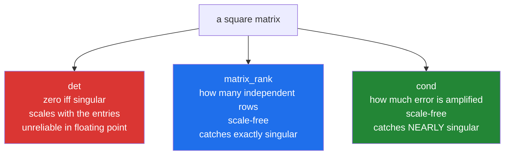

# 4.4 — Singular — the error that says there is no unique answer

## One-line answer

`LinAlgError: Singular matrix` means the equations repeat each other rather than adding information, so
there is no unique solution — and the useful diagnostic is `matrix_rank`, not the determinant.

---

## The story

Three shopping trips, three totals, three unknown prices
([4.1](4.1-three-trips-three-prices.md)). It worked.

Next month somebody writes the trips down again and one of them is a mistake: the third trip is recorded
as exactly twice the first — twice the milk, twice the bread, twice the eggs, and twice the total.

That third line is not wrong. It is perfectly true, and it is worth nothing. "Two milks and a bread and a
box of eggs came to six forty" and "four milks and two breads and two boxes of eggs came to twelve eighty"
are the same statement said twice. Anybody trying to work the prices out from those three lines will find
that after using the first two they are stuck: there is a whole family of prices that fits, and nothing in
the data picks one.

The information is missing, not hidden. No cleverer method would find it, because it was never written
down.

---

## The idea in plain language

A matrix is **singular** when its rows repeat each other's information — when one row can be built from
the others by scaling and adding. The technical phrase is that the rows are **linearly dependent**.

When that happens there is no unique `x` satisfying `A @ x = b`. Either there is no solution at all, or
there are infinitely many; in both cases `np.linalg.solve` raises
`numpy.linalg.LinAlgError: Singular matrix`.

Two numbers measure how close a matrix is to this, and choosing between them matters.

The **determinant**, `np.linalg.det`, is a single number that is exactly zero for a singular matrix. It is
the one everybody learns first and it is **a bad test in floating point**, for two reasons. Rounding means
a genuinely singular matrix rarely produces exactly `0.0`, so `det(A) == 0` is unreliable. And the
determinant scales with the size of the entries: multiplying a matrix by 10 multiplies the determinant of
an `n`-by-`n` by `10ⁿ`, so "is the determinant small" has no fixed meaning. A perfectly well-behaved
matrix of small numbers can have a tiny determinant.

The **rank**, `np.linalg.matrix_rank`, is the number of genuinely independent rows. For an `n`-by-`n`
matrix it should be `n`; anything less means rows are repeating. **This is the diagnostic to use.** It is
computed from the singular value decomposition with a tolerance that scales with the matrix, so it answers
the question you actually meant rather than a proxy for it.

There is a third number, and it is the one that matters most in practice because it covers the
*nearly* singular case: the **condition number**, `np.linalg.cond`. A singular matrix has an infinite
condition number, and a nearly-singular one has a huge one. That is [4.6](4.6-conditioning.md), and it is
where the real damage lives — because a matrix that is nearly singular does **not** raise.

When you meet a singular matrix, the fix is never numerical. It is one of three things about the data:
a duplicated row, a column that is a copy or a fixed multiple of another, or more unknowns than genuinely
independent observations. All three are questions about where the data came from.

---

## Why Setu needs it

- **[4.5](4.5-lstsq.md)** is what to do when the system has no exact solution, which is the far more common
  real-world case.
- **[4.6](4.6-conditioning.md)** is the silent version of this document, and it is the dangerous one.
- **Day 76's feature engineering** produces singular matrices routinely: one-hot encoding every level of a
  category creates columns that sum to a constant, which makes the matrix singular. That is why one level
  is always dropped.
- **Day 91's linear regression** fails in exactly this way when two features are perfectly correlated —
  height in centimetres and height in inches in the same table — and the error names the matrix rather than
  the columns.
- **[5.1](../05-the-module/5.1-the-chores-module.md)** checks rank before solving, so the message names the
  domain problem rather than the linear algebra.

---

## The mechanism

A matrix whose second row repeats the first:

```python
import numpy as np

repeated = np.array([[1.0, 2.0], [2.0, 4.0]])
independent = np.array([[1.0, 2.0], [2.0, 5.0]])

for name, matrix in [("repeated", repeated), ("independent", independent)]:
    print(
        f"{name:12s} det {np.linalg.det(matrix):8.3f}  rank {np.linalg.matrix_rank(matrix)}  cond {np.linalg.cond(matrix):.3g}"
    )

print()
print("solve the independent one :", np.linalg.solve(independent, np.array([1.0, 2.0])))
print("solve the repeated one    :", end=" ")
try:
    print(np.linalg.solve(repeated, np.array([1.0, 2.0])))
except Exception as e:
    print(type(e).__name__, ":", e)
```

**Line by line:**

- `repeated` has second row `[2, 4]`, which is the first row doubled — **the smallest possible example of
  the problem**, and small enough to see by eye.
- `independent` differs by one number, `5.0` instead of `4.0`. That single change makes the rows carry
  different information.
- The loop printing three diagnostics side by side for both — this is the comparison, and putting `det`,
  `rank` and `cond` next to each other is what shows their different characters.
- `np.linalg.det` — `0.000` for the repeated one and `1.000` for the other. Exactly zero here because the
  numbers are small whole numbers; on real data it would be `1e-17` or so.
- `np.linalg.matrix_rank` — `1` against `2`. **This is the readable answer**: one independent row out of
  two. Note it is scale-free, unlike the determinant below it.
- `np.linalg.cond` — about `4.8e16` against 34. The condition number grows without bound as a matrix
  approaches singularity ([4.6](4.6-conditioning.md)). It is not literally infinite here because the
  decomposition it is computed from is itself done in floating point, and `4.8e16` is roughly one divided
  by the smallest gap a `float64` can express — which is the numerical way of saying infinite.
- The two `solve` calls — one returns an answer, one raises. **The error is the good outcome**, and this
  block exists so the message is recognised on sight.

```text
repeated     det    0.000  rank 1  cond 4.8e+16
independent  det    1.000  rank 2  cond 34

solve the independent one : [ 1. -0.]
solve the repeated one    : LinAlgError : Singular matrix
```

Why the determinant is the wrong test:

```python
import numpy as np

small_numbers = np.eye(10) * 0.1
big_numbers = np.eye(10) * 10.0

print(
    "small entries : det",
    f"{np.linalg.det(small_numbers):.3g}",
    " rank",
    np.linalg.matrix_rank(small_numbers),
    " cond",
    np.linalg.cond(small_numbers),
)
print(
    "big entries   : det",
    f"{np.linalg.det(big_numbers):.3g}",
    " rank",
    np.linalg.matrix_rank(big_numbers),
    " cond",
    np.linalg.cond(big_numbers),
)
print()
nearly = np.array([[1.0, 2.0], [2.0, 4.000001]])
print(
    "nearly singular: det",
    f"{np.linalg.det(nearly):.3g}",
    " rank",
    np.linalg.matrix_rank(nearly),
    " cond",
    f"{np.linalg.cond(nearly):.3g}",
)
print("does it solve? :", np.linalg.solve(nearly, np.array([1.0, 2.0])))
```

**Line by line:**

- `np.eye(10) * 0.1` — the identity matrix scaled down, which is about as far from singular as a matrix can
  be: every row is independent and the whole thing is trivially invertible.
- Its determinant is `1e-10`, because the determinant of a ten-by-ten multiplies ten entries of 0.1
  together. **A tiny determinant on a perfectly good matrix**, which is the whole argument against using it
  as a test.
- `np.eye(10) * 10.0` — the same matrix scaled up, determinant `1e10`. Same structure, determinant
  twenty orders of magnitude apart.
- `rank` is 10 for both and `cond` is 1 for both — **the two useful numbers are unmoved by the scaling**,
  which is exactly the property a diagnostic needs.
- `nearly` — one millionth away from the singular example above. Its rank is **2**, so `matrix_rank` says
  it is fine, and it solves without complaint.
- `np.linalg.cond(nearly)` — around `2.5e7`, enormous. **This is the case rank misses and condition
  catches**, and it is why [4.6](4.6-conditioning.md) exists as its own document.

```text
small entries : det 1e-10  rank 10  cond 1.0
big entries   : det 1e+10  rank 10  cond 1.0

nearly singular: det 1e-06  rank 2  cond 2.5e+07
does it solve? : [ 1. -0.]
```

The three diagnostics and what each is good for:



---

## When it breaks

**The message that names nothing useful:**

```text
$ uv run python -c "
import numpy as np
trips = np.array([[2.0, 1.0, 1.0], [1.0, 2.0, 1.0], [4.0, 2.0, 2.0]])
totals = np.array([6.40, 6.60, 12.80])
np.linalg.solve(trips, totals)
"
Traceback (most recent call last):
  File "<string>", line 5, in <module>
numpy.linalg.LinAlgError: Singular matrix
```

**What it means.** The third trip is the first doubled. The message is correct and says nothing about which
rows, how many are independent, or what to look at — which is the whole reason for the production wrapper
below. `Singular matrix` is two words for "your data has a structural problem", and turning it into
"row 2 is a multiple of row 0" is a few lines of work that saves an hour every time it fires.

**A determinant test that passes a bad matrix:**

```text
$ uv run python -c "
import numpy as np
nearly = np.array([[1.0, 2.0], [2.0, 4.000001]])
print('det        :', np.linalg.det(nearly))
print('det == 0   :', np.linalg.det(nearly) == 0)
print('det > 1e-9 :', abs(np.linalg.det(nearly)) > 1e-9, '<- the usual guard, and it passes')
print('rank       :', np.linalg.matrix_rank(nearly), 'of 2')
print('cond       :', f'{np.linalg.cond(nearly):.3g}')
x = np.linalg.solve(nearly, np.array([1.0, 2.0]))
print('solution   :', x)
nudged = np.linalg.solve(nearly, np.array([1.0, 2.0000001]))
print('b nudged   :', nudged)
print('answer moved by :', np.abs(nudged - x))
"
det        : 1.0000000001397784e-06
det == 0   : False
det > 1e-9 : True <- the usual guard, and it passes
rank       : 2 of 2
cond       : 2.5e+07
solution   : [ 1. -0.]
b nudged   : [0.8 0.1]
answer moved by : [0.2 0.1]
```

**What it means.** Every guard people usually write passes: the determinant is not zero, it is comfortably
above a small threshold, and the rank is full. The matrix solves. And the condition number is twenty-five
million, which says the answer amplifies any error in `b` by roughly that factor — the last three lines
show it happening. Nudging one entry of `b` by **one ten-millionth** moved the answer by 0.2, a change two
million times larger than the change that caused it. **A determinant threshold is
not a check**, because the determinant's scale is arbitrary; the condition number is scale-free and is the
number to guard on.

**A singular matrix from one-hot encoding:**

```text
$ uv run python -c "
import numpy as np
one_hot = np.eye(3)
with_intercept = np.column_stack([one_hot, np.ones(3)])
print('one-hot          :', one_hot.shape, 'rank', np.linalg.matrix_rank(one_hot))
print('with intercept   :', with_intercept.shape, 'rank', np.linalg.matrix_rank(with_intercept))
print('columns sum to   :', one_hot.sum(axis=1))
print('drop one level   :', np.linalg.matrix_rank(np.column_stack([one_hot[:, 1:], np.ones(3)])))
"
one-hot          : (3, 3) rank 3
with intercept   : (3, 4) rank 3
columns sum to   : [1. 1. 1.]
drop one level   : 3
```

**What it means.** The three one-hot columns add up to a column of ones for every row, so adding an
intercept column of ones creates a **fourth column that is exactly the sum of the other three**. The rank
stays at 3 while there are now 4 columns, which is what "the dummy variable trap" means. Dropping one
level restores full rank. **This is the most common way a real regression matrix becomes singular**, and it
comes from the encoding rather than from the data — which is why every encoder has a `drop_first` option
and why Day 76 spends time on it.

---

## In production

**What a professional writes instead of the teaching version.** The check happens before the solve and the
message names the offending rows:

```python
from __future__ import annotations

import numpy as np


def check_solvable(a: np.ndarray, *, max_condition: float = 1e10) -> None:
    """Refuse a system that has no unique answer, or whose answer would be noise.

    Uses matrix_rank rather than det: the determinant scales with the entries, so a
    threshold on it means nothing, while rank and cond are both scale-free.
    """
    if a.ndim != 2 or a.shape[0] != a.shape[1]:
        raise ValueError(f"A must be square, got shape {a.shape}")
    n = a.shape[0]
    rank = int(np.linalg.matrix_rank(a))
    if rank < n:
        raise ValueError(
            f"A has rank {rank} of {n}: {n - rank} row(s) repeat information already in "
            f"the others, so there is no unique solution. {_dependent_rows(a)}"
        )
    condition = float(np.linalg.cond(a))
    if condition > max_condition:
        raise ValueError(
            f"A is ill-conditioned (cond = {condition:.3g}): the answer would be "
            f"dominated by rounding. Two rows are probably near-duplicates."
        )


def _dependent_rows(a: np.ndarray) -> str:
    """A best-effort hint at which rows are multiples of which."""
    lengths = np.linalg.norm(a, axis=1, keepdims=True)
    unit = a / np.maximum(lengths, 1e-12)
    similarity = np.abs(unit @ unit.T)
    np.fill_diagonal(similarity, 0.0)
    i, j = np.unravel_index(int(np.argmax(similarity)), similarity.shape)
    return f"Rows {i} and {j} are the most alike (cosine {similarity[i, j]:.4f})."
```

**Line by line:**

- The docstring naming **why not `det`** — the argument in one sentence, so the next person adding a
  determinant threshold has to disagree with it explicitly.
- `matrix_rank` first, `cond` second — the two checks in order of severity. A rank-deficient matrix cannot
  be solved at all; an ill-conditioned one can, badly.
- The rank message computing `n - rank` — "2 rows repeat information" is a count somebody can act on, where
  "rank 1 of 3" needs interpreting.
- `_dependent_rows` — **the hint that turns two words into a diagnosis**. It normalises each row
  ([4.3](4.3-norm.md)) and takes the cosine similarity grid, so two rows that are multiples of each other
  score 1.0 regardless of scale, which is exactly the relationship that causes singularity.
- `np.abs(unit @ unit.T)` — the absolute value, because a row that is the **negative** of another is just
  as dependent as a row that is a positive multiple.
- `np.fill_diagonal(similarity, 0.0)` — every row is perfectly similar to itself, so the diagonal has to be
  excluded or `argmax` always finds it.
- `np.unravel_index(np.argmax(...), shape)` — turning a flat `argmax` position back into a row and column
  pair ([Day 23, 2.2](../../../day-23-ufuncs-and-statistics/parts/02-statistics/2.2-axis-the-one-that-disappears.md)).
  **This is the standard move** for finding where in a grid the largest value is, and forgetting it gives a
  meaningless single number.
- "best-effort hint" in the docstring — honest. Dependence can involve three rows in combination with no
  pair being especially similar, so this finds the common case and does not claim to find all of them.

**What changes at scale.** Rank and condition are both computed from a **singular value decomposition**,
which costs about the same as solving the system — so checking is not free, and on a hot path solving many
similar systems the check belongs at setup rather than per call. Three further things. At size, exact
singularity almost never happens and **near**-singularity is constant, so `cond` becomes the operative
check and `rank` becomes a formality ([4.6](4.6-conditioning.md)). The usual cause at size is
**collinearity between columns** rather than duplicated rows — two features that measure the same thing in
different units — and the fix is feature selection or regularisation rather than anything numerical:
adding a small value to the diagonal, called ridge regularisation, makes an ill-conditioned system solvable
by deliberately biasing it, and that is the standard production answer. And for very large systems the
decomposition needed to compute rank is itself infeasible, so the check is replaced by monitoring the
residual of the answer you got ([4.1](4.1-three-trips-three-prices.md)).

**The failure that only appears with real data.** A model's design matrix included both "days since signup"
and "weeks since signup". They were perfectly collinear, so the matrix was singular, and the fit raised
`LinAlgError: Singular matrix` on the day the second column was added. That was the easy version. The
**hard** version came a month later, when somebody rounded weeks to whole numbers: the two columns were no
longer exactly collinear, the matrix was no longer singular, nothing raised, and the fitted coefficients
were enormous and opposite in sign — one saying each day helped enormously and the other saying each week
hurt enormously, cancelling out to something reasonable. The model scored fine and every coefficient was
nonsense.

**The review comment a senior engineer leaves.** *"`if abs(np.linalg.det(A)) < 1e-9: raise` — the
determinant scales with the entries, so this threshold means different things for different data and
passes matrices that are numerically hopeless. Check `matrix_rank` for exact singularity and
`np.linalg.cond` for the near case, and log the condition number so we can see it drifting."*

**The interview question.** *"What does `Singular matrix` mean and how do you check for it?"* It means the
rows are linearly dependent — one can be built from the others — so there is no unique solution to
`A @ x = b`. The check is `np.linalg.matrix_rank(A)`, which should equal the number of rows, and **not**
the determinant: the determinant scales with the size of the entries, so a threshold on it is meaningless,
and rounding means a truly singular matrix rarely gives exactly zero. The more important number is
`np.linalg.cond`, because the dangerous case is the **nearly** singular matrix, which does not raise, has
full rank, passes a determinant threshold, and returns an answer dominated by rounding. The details worth
adding: the cause is always in the data, most often two columns measuring the same thing in different
units, or one-hot encoding every level of a category alongside an intercept — the dummy variable trap,
which is why encoders offer to drop a level; and the production fix for near-singularity is usually ridge
regularisation, adding a small value to the diagonal, rather than anything about the solver.

---

## Check yourself

```bash
uv run python -c "
import numpy as np
repeated = np.array([[1.0, 2.0], [2.0, 4.0]])
nearly   = np.array([[1.0, 2.0], [2.0, 4.000001]])
good     = np.array([[1.0, 2.0], [2.0, 5.0]])
for name, m in [('repeated', repeated), ('nearly', nearly), ('good', good)]:
    print(f'{name:9s} det {np.linalg.det(m):12.3g}  rank {np.linalg.matrix_rank(m)}  cond {np.linalg.cond(m):.3g}')
print()
scaled = np.eye(10) * 0.1
print('identity*0.1 : det', f'{np.linalg.det(scaled):.3g}', 'rank', np.linalg.matrix_rank(scaled), 'cond', np.linalg.cond(scaled))
"
```

The last line has a determinant of `1e-10` on a matrix that could not be better behaved. Say what that
does to a guard written as `if abs(det) < 1e-9: raise`, and which of the other two numbers you would use
instead.

**Answer out loud, without scrolling up:**

> Say what singular means in terms of the rows, name the diagnostic you would use and the one you would
> not, and say why the nearly-singular case is more dangerous than the singular one.

---

**Next:** [4.5 — `lstsq`, when there is no exact answer](4.5-lstsq.md).
