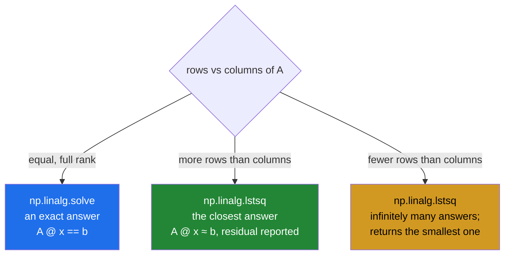

# 4.5 — `lstsq` — when there is no exact answer

## One-line answer

With more observations than unknowns there is usually no set of prices that fits every receipt exactly, so
`np.linalg.lstsq` finds the set that comes closest — and that is the whole of linear regression, arriving
sixty-seven days early.

---

## The story

The flat has four receipts now, not three.

The fourth trip was one milk, one bread, one box of eggs, and the total says five pounds twenty-five.

But the prices worked out from the first three trips say milk is £1.20, bread £1.40 and eggs £2.60, which
makes that basket £5.20. The receipt says £5.25.

Five pence. Nobody miscounted. Either something was on offer that week, or the till rounded, or somebody
picked up a slightly different loaf. Real receipts do this.

So there is no set of three prices that explains all four receipts exactly. Throwing the fourth receipt
away would be silly — it is real information — and so would insisting on an exact fit that does not exist.
What anybody actually wants is the set of prices that gets **closest** to explaining all four, and a way to
see how far off it still is.

---

## The idea in plain language

When `A` has more rows than columns — more observations than unknowns — the system is called
**overdetermined**. `np.linalg.solve` refuses it outright, because it requires a square matrix
([4.1](4.1-three-trips-three-prices.md)).

`np.linalg.lstsq` handles it. It finds the `x` that minimises the total squared error: take `A @ x - b`,
which is how far each equation is from being satisfied, square each of those, add them up, and choose the
`x` that makes that total as small as possible. The squaring is what "least squares" means, and it has two
consequences worth knowing: errors in either direction count the same, and a single large error counts far
more than several small ones.

`lstsq` returns **four** things, and all four are useful:

1. **`x`** — the best-fit values.
2. **`residuals`** — the sum of the squared errors, as a one-element array. Empty when the system is not
   overdetermined or is rank-deficient, which is a trap worth knowing about in advance.
3. **`rank`** — the rank of `A` ([4.4](4.4-singular-and-the-error.md)), so you find out about a degenerate
   system rather than being told nothing.
4. **`s`** — the singular values, whose ratio is the condition number
   ([4.6](4.6-conditioning.md)).

Most code unpacks the first and ignores the rest, and most code should not.

The `rcond=` argument decides how small a singular value has to be before it is treated as zero — which is
the same threshold question as rank ([4.4](4.4-singular-and-the-error.md)). NumPy changed its default some
versions ago and warned about it for a long time, which is why a great deal of code passes `rcond=None`
defensively. On NumPy 2.5 that transition is finished and the bare call warns about nothing; passing
`rcond=None` is now documentation of an intent rather than a workaround, and it is still worth writing.

Now the reason this document exists at this point in the curriculum. **This is linear regression.** Day 91
introduces fitting a line to data, and the fitting is exactly this call: `A` holds the features with one
row per observation, `b` holds the measured outcomes, and `x` is the coefficients. Everything Day 91 adds
is interpretation, diagnostics and the discipline of not fooling yourself — the arithmetic is here, and it
is four receipts and three prices.

---

## Why Setu needs it

- **Day 91's linear regression** is this call, and knowing that in advance turns that day from "a model" to
  "a solve with a story around it".
- **[4.6](4.6-conditioning.md)** is what the fourth return value is for, and why an over-determined fit can
  still be untrustworthy.
- **[5.1](../05-the-module/5.1-the-chores-module.md)** fits chore values from more people than there are
  chores, which is an overdetermined system by construction.
- **Day 58's statistics phase** derives least squares properly; this is the computational half arriving
  first, which is the order the plan chose deliberately.
- **Day 107's ensembles** stack model predictions by fitting weights over out-of-fold predictions, which is
  again this call.

---

## The mechanism

Four receipts, three prices:

```python
import numpy as np

quantities = np.array(
    [
        [2.0, 1.0, 1.0],
        [1.0, 2.0, 1.0],
        [0.0, 1.0, 3.0],
        [1.0, 1.0, 1.0],
    ]
)
totals = np.array([6.40, 6.60, 9.20, 5.25])

prices, residuals, rank, singular = np.linalg.lstsq(quantities, totals, rcond=None)

print("A shape   :", quantities.shape, " b shape:", totals.shape)
print("prices    :", prices.round(4))
print("residuals :", residuals)
print("rank      :", rank, "of", quantities.shape[1], " singular values:", singular.round(4))
print("A @ x     :", (quantities @ prices).round(4))
print("b         :", totals)
print("errors    :", (quantities @ prices - totals).round(4))
print("sum sq err:", round(float(((quantities @ prices - totals) ** 2).sum()), 8))
print("solve says:", end=" ")
try:
    print(np.linalg.solve(quantities, totals))
except Exception as e:
    print(type(e).__name__, ":", e)
```

**Line by line:**

- Four rows, three columns — **more equations than unknowns**, which is the situation the whole document is
  about and the normal situation with real data.
- `rcond=None` — the modern behaviour, stated. On NumPy 2.5 this is already the default and leaving it out
  warns about nothing, so passing it is documentation rather than necessity — and it is worth writing
  anyway, because `rcond` decides how small a singular value has to be before it is treated as zero, which
  is a real decision about rank ([4.4](4.4-singular-and-the-error.md)).
- Unpacking all **four** return values — most code writes `x = np.linalg.lstsq(...)[0]` and throws away the
  three numbers that say whether to trust `x`.
- `prices.round(4)` — `[1.2064 1.4013 2.6013]`. Close to the exact three-receipt answer of
  `[1.2, 1.4, 2.6]` and not equal to it, because the fourth receipt pulled it slightly.
- `residuals` — `[0.00205128]`, a **one-element array**, not a number. That is the total squared error, and
  its being an array rather than a float is the shape people get wrong when logging it.
- `rank` — 3 of 3, so all three price columns carry independent information
  ([4.4](4.4-singular-and-the-error.md)). If this came back as 2 the answer would still be returned and
  would be one of infinitely many.
- `quantities @ prices` against `totals` — the fit against the observations. **This is the substitution
  check from [4.1](4.1-three-trips-three-prices.md), and here it deliberately does not match**, which is
  the point: an overdetermined system's answer is not supposed to reproduce `b` exactly.
- `errors` — the per-receipt discrepancies. Three tiny positive ones and one of −0.041 on the fourth
  receipt. **The fit spread the five-pence discrepancy across all four receipts** rather than putting it
  all on the odd one out, which is what minimising the squared total does.
- `((...)**2).sum()` printed beside `residuals` — the same number, computed the obvious way, so the second
  return value stops being a mystery.
- `np.linalg.solve` on the same input — raises. The two functions divide the world between them by the
  shape of `A`.

```text
A shape   : (4, 3)  b shape: (4,)
prices    : [1.2064 1.4013 2.6013]
residuals : [0.00205128]
rank      : 3 of 3  singular values: [4.4413 2.0904 0.9513]
A @ x     : [6.4154 6.6103 9.2051 5.209 ]
b         : [6.4  6.6  9.2  5.25]
errors    : [ 0.0154  0.0103  0.0051 -0.041 ]
sum sq err: 0.00205128
solve says: LinAlgError : Last 2 dimensions of the array must be square
```

Exact against approximate:



Now the fitting-a-line case, which is what this becomes on Day 91:

```python
import numpy as np

weeks = np.array([1.0, 2.0, 3.0, 4.0, 5.0, 6.0])
spend = np.array([21.0, 23.5, 24.0, 27.5, 28.0, 31.0])

design = np.column_stack([weeks, np.ones_like(weeks)])
coefficients, residuals, rank, _ = np.linalg.lstsq(design, spend, rcond=None)
slope, intercept = coefficients

print("design    :")
print(design)
print("slope     :", round(float(slope), 4), "pounds per week")
print("intercept :", round(float(intercept), 4))
print("predicted :", (design @ coefficients).round(2))
print("actual    :", spend)
print("residual  :", residuals.round(6))
print("rank      :", rank, "of 2")
```

**Line by line:**

- `weeks` and `spend` — six weeks of shopping totals, an ordinary thing anybody might have.
- `np.column_stack([weeks, np.ones_like(weeks)])` — **the design matrix**, and the single most important
  line. The first column is the thing that varies; the second is a column of ones
  ([Day 22, 4.1](../../../day-22-broadcasting-and-shape/parts/04-joining-and-splitting/4.1-concatenate.md)).
  That column of ones is what gives the line an intercept: it multiplies a coefficient that is added to
  every prediction regardless of the week, which is exactly a constant term.
- `np.ones_like(weeks)` rather than `np.ones(6)` — same shape and same dtype as `weeks`, so the two columns
  cannot disagree ([Day 20, 3.5](../../../day-20-arrays-and-dtypes/parts/03-creating/3.5-like-and-the-identity.md)).
- `slope, intercept = coefficients` — unpacked in the **column order of the design matrix**. Swap the two
  columns and these two names swap meaning silently, which is why the column order deserves a comment in
  real code.
- `design @ coefficients` — the predictions, which is a matrix product
  ([3.2](../03-matmul/3.2-matmul-by-hand.md)). **This is the whole of "using a linear model"**: one `@`.
- `residuals` — the total squared error of the fit. Small relative to the spend values, which is what a
  good fit looks like; the interpretation of "small" is Day 91's subject.
- `rank` of 2 — both columns independent. If every week had the same value the first column would be
  constant, matching the ones column, and the rank would drop to 1
  ([4.4](4.4-singular-and-the-error.md)).

```text
design    :
[[1. 1.]
 [2. 1.]
 [3. 1.]
 [4. 1.]
 [5. 1.]
 [6. 1.]]
slope     : 1.9143 pounds per week
intercept : 19.1333
predicted : [21.05 22.96 24.88 26.79 28.7  30.62]
actual    : [21.  23.5 24.  27.5 28.  31. ]
residual  : [2.204762]
rank      : 2 of 2
```

Spending is rising by about £1.91 a week. That number came out of the same function as the milk price.

---

## When it breaks

**The residuals that came back empty:**

```text
$ uv run python -c "
import numpy as np
square = np.array([[2.0, 1.0], [1.0, 2.0]])
tall = np.array([[2.0, 1.0], [1.0, 2.0], [1.0, 1.0]])
b2 = np.array([6.4, 6.6])
b3 = np.array([6.4, 6.6, 5.2])
print('square residuals :', np.linalg.lstsq(square, b2, rcond=None)[1])
print('tall residuals   :', np.linalg.lstsq(tall, b3, rcond=None)[1])
print('square size      :', np.linalg.lstsq(square, b2, rcond=None)[1].size)
"
square residuals : []
tall residuals   : [0.61454545]
square size      : 0
```

**What it means.** When the system is square and full rank there is an **exact** answer, so the residual is
zero — and rather than returning a zero, `lstsq` returns an **empty array**. Any code that does
`float(residuals)` or `residuals[0]` to log the error crashes on exactly the systems that fitted perfectly.
The same happens for a rank-deficient `A`. **Check `residuals.size` before using it**, and treat empty as
"exact fit" rather than as an error.

**The missing `rcond`:**

```text
$ uv run python -c "
import warnings
import numpy as np
A = np.array([[2.0, 1.0], [1.0, 2.0], [1.0, 1.0]])
b = np.array([6.4, 6.6, 5.2])
with warnings.catch_warnings(record=True) as caught:
    warnings.simplefilter('always')
    np.linalg.lstsq(A, b)
    print('warnings :', [str(w.message)[:70] for w in caught])
np.linalg.lstsq(A, b, rcond=None)
print('with rcond=None: no warning')
"
warnings : []
with rcond=None: no warning
```

**What it means.** On NumPy 2.5 the transition is complete and the bare call no longer warns — `rcond`
already defaults to the modern behaviour. This block is here because **a great deal of existing code and
documentation still passes `rcond=None` defensively**, and reading it as a workaround for a warning that no
longer appears is better than copying it as a mystery. Passing it explicitly remains harmless and remains
the clearest thing to write, because it says which behaviour you meant.

**More unknowns than observations:**

```text
$ uv run python -c "
import numpy as np
wide = np.array([[2.0, 1.0, 1.0, 3.0], [1.0, 2.0, 1.0, 1.0]])
b = np.array([6.4, 6.6])
x, res, rank, s = np.linalg.lstsq(wide, b, rcond=None)
print('A shape   :', wide.shape, '- 2 equations, 4 unknowns')
print('x         :', x.round(4))
print('residuals :', res, '<- empty')
print('rank      :', rank, 'of 4 columns')
print('A @ x     :', (wide @ x).round(6), 'vs', b)
print('exact fit :', np.allclose(wide @ x, b))
print('norm of x :', round(float(np.linalg.norm(x)), 4))
"
A shape   : (2, 4) - 2 equations, 4 unknowns
x         : [0.7756 2.1366 0.9707 0.5805]
residuals : [] <- empty
rank      : 2 of 4 columns
A @ x     : [6.4 6.6] vs [6.4 6.6]
exact fit : True
norm of x : 2.5389
```

**What it means.** Two equations cannot pin down four unknowns, so there are **infinitely many** exact
answers and `lstsq` returned one of them — specifically the one with the smallest norm
([4.3](4.3-norm.md)), which is a defensible convention and is not the same as "the right one". It fits
perfectly, the residual is empty because the fit is exact, and the `rank` of 2 out of 4 columns is the only
thing in the output saying the answer is arbitrary. **This is the underdetermined case, and it does not
raise**: a model with more features than training rows produces coefficients that fit the training data
exactly and mean nothing, which is one description of overfitting.

---

## In production

**What a professional writes instead of the teaching version.** All four return values are used, and the
empty-residual case is handled:

```python
from __future__ import annotations

from dataclasses import dataclass

import numpy as np


@dataclass(frozen=True, slots=True)
class Fit:
    """A least-squares fit and everything needed to judge it."""

    coefficients: np.ndarray
    sum_squared_error: float
    rank: int
    n_columns: int
    condition: float

    @property
    def determined(self) -> bool:
        """True when the columns are independent, so the coefficients are the only answer."""
        return self.rank == self.n_columns


def fit(a: np.ndarray, b: np.ndarray) -> Fit:
    """Least-squares fit of A @ x = b, reporting the residual, the rank and the conditioning."""
    if a.ndim != 2:
        raise ValueError(f"A must be 2-D (observations, unknowns), got shape {a.shape}")
    if b.shape[:1] != a.shape[:1]:
        raise ValueError(f"A has {a.shape[0]} rows, b has {b.shape[0]}")
    if a.shape[0] < a.shape[1]:
        raise ValueError(
            f"{a.shape[0]} observations cannot determine {a.shape[1]} unknowns; "
            f"the fit would be exact and arbitrary"
        )
    x, residuals, rank, singular = np.linalg.lstsq(a, b, rcond=None)
    # residuals is EMPTY for an exact or rank-deficient fit, not zero.
    error = float(residuals[0]) if residuals.size else float(((a @ x - b) ** 2).sum())
    condition = float(singular[0] / singular[-1]) if singular[-1] > 0 else float("inf")
    return Fit(
        coefficients=x,
        sum_squared_error=error,
        rank=int(rank),
        n_columns=int(a.shape[1]),
        condition=condition,
    )
```

**Line by line:**

- `Fit` carrying `rank`, `n_columns` and `condition` beside the coefficients — **coefficients alone cannot
  be judged**. A perfect-looking fit from a rank-deficient matrix is one of infinitely many, and nothing
  about the numbers says so.
- `determined` as a property — the question "are these the only answer" given a name, so call sites do not
  each rewrite the comparison.
- `a.shape[0] < a.shape[1]` raising — **the underdetermined case refused**, which is the third failure block
  turned into a guard. The message says why: an exact and arbitrary fit is worse than no fit, because it
  looks like success.
- `b.shape[:1] != a.shape[:1]` — comparing the leading axis as a tuple rather than as integers, which also
  works when `b` is a matrix of several right-hand sides.
- The **comment above the residual line** — `residuals` being empty rather than zero is surprising enough
  that it earns a comment rather than only a conditional.
- `float(((a @ x - b) ** 2).sum())` as the fallback — computing the residual directly when `lstsq` declines
  to. It costs one matrix product and means `sum_squared_error` is always a number, so no caller has to
  know about the empty-array behaviour.
- `singular[0] / singular[-1]` — **the condition number, computed from a value `lstsq` already returned**.
  `np.linalg.cond` would recompute the whole decomposition; this is free
  ([4.6](4.6-conditioning.md)).
- `if singular[-1] > 0 else float("inf")` — the guard on the division. A zero smallest singular value means
  a rank-deficient matrix, and infinity is the honest answer rather than a `RuntimeWarning` and a `nan`
  ([Day 23, 1.3](../../../day-23-ufuncs-and-statistics/parts/01-ufuncs/1.3-divide-by-zero-warns.md)).

**What changes at scale.** `lstsq` decomposes `A`, which costs roughly `m × n²` for an `m`-by-`n` matrix —
so it scales linearly in observations and quadratically in unknowns, which is why adding rows is cheap and
adding features is not. Three things follow at size. The **normal equations** shortcut, `(AᵀA)⁻¹Aᵀb`, is
what the textbook formula says and it squares the condition number
([4.6](4.6-conditioning.md)) — it is faster and measurably less accurate, and `lstsq` uses a
decomposition instead for exactly that reason, which is the same argument as
[4.2](4.2-solve-and-never-inv.md). When the number of unknowns grows past a few thousand, or the matrix is
sparse, the exact decomposition stops being affordable and **iterative** solvers take over, which is
`scipy.sparse.linalg.lsqr`. And the statistical failure arrives before the computational one: with many
correlated features the condition number climbs, the coefficients become enormous and opposite in sign, and
the standard fix is **regularisation** — adding a penalty on the size of the coefficients, which is ridge
regression and is Day 91's subject.

**The failure that only appears with real data.** A forecasting job logged its fit quality with
`float(residuals)`. It ran nightly for a year. Then a data outage left exactly as many observations as
features for one region, the fit became exact, `residuals` came back as an empty array, and the job crashed
with `TypeError: only length-1 arrays can be converted to Python scalars`. The crash was in the logging,
so the fit itself had succeeded — and the alert that fired said nothing about the missing data that had
caused it. Two days were spent on the logging line before anybody looked at the row count.

**The review comment a senior engineer leaves.** *"`np.linalg.lstsq(A, b)[0]` throws away the rank and the
singular values. If the design matrix ever goes rank-deficient — and it will, the first time a category has
one level in a fold — the coefficients come back looking fine and are one of infinitely many. Please keep
the rank, compare it against the column count, and log the condition number."*

**The interview question.** *"What do you do when there is no exact solution to `A @ x = b`?"*
`np.linalg.lstsq`, which finds the `x` minimising the sum of squared differences between `A @ x` and `b` —
the overdetermined case, and the normal one with real measurements. It returns four things and most code
uses only the first: the coefficients, the sum of squared residuals, the rank of `A`, and the singular
values, whose ratio is the condition number. That is linear regression: the design matrix holds the
features with a column of ones for the intercept, and the fit is one call. The details that show
experience: `residuals` comes back **empty** rather than zero when the fit is exact or the matrix is
rank-deficient, so anything that logs it needs to check `.size`; the underdetermined case — more unknowns
than observations — does not raise, it returns the minimum-norm solution that fits perfectly and means
nothing, which is overfitting in one line; and `lstsq` uses a decomposition rather than the textbook normal
equations because forming `AᵀA` squares the condition number, which is the same reason you never invert a
matrix.

---

## Check yourself

```bash
uv run python -c "
import numpy as np
A = np.array([[2.0,1.0,1.0],[1.0,2.0,1.0],[0.0,1.0,3.0],[1.0,1.0,1.0]])
b = np.array([6.40, 6.60, 9.20, 5.25])
x, res, rank, s = np.linalg.lstsq(A, b, rcond=None)
print('prices     :', x.round(4))
print('residual   :', res, 'size', res.size)
print('rank       :', rank, 'of', A.shape[1])
print('condition  :', round(float(s[0]/s[-1]), 3))
print('errors     :', (A @ x - b).round(4))
print('sum sq     :', round(float(((A @ x - b)**2).sum()), 8))
sq = A[:3]
xs, rs, _, _ = np.linalg.lstsq(sq, b[:3], rcond=None)
print('square fit :', xs.round(4))
print('its residual:', rs, 'size', rs.size, '<- empty, not zero')
"
```

The last line returns an empty array where you might expect `0.0`. Say what that means about the fit, and
what a line of logging code written as `float(res)` would do on that input.

**Answer out loud, without scrolling up:**

> You have four receipts and three unknown prices. Say which function you use, what the four things it
> returns are, and which of them tells you whether the answer is the only one.

---

**Next:** [4.6 — conditioning, and the answer that was numerically meaningless](4.6-conditioning.md).
