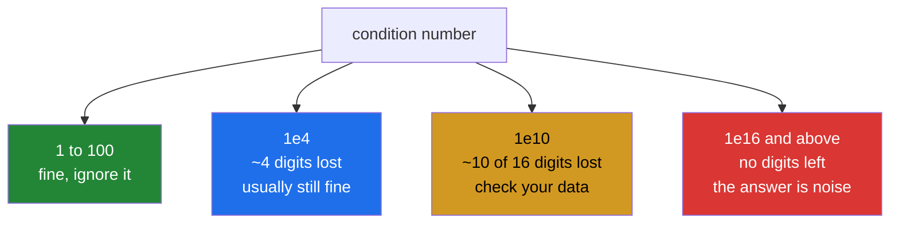

# 4.6 — Conditioning — the answer that was numerically meaningless

## One-line answer

The **condition number** says how much a tiny error in the input is multiplied on its way to the output —
and a system with a condition number of ten thousand solves cleanly, raises nothing, and hands back an
answer whose last four digits are noise.

---

## The story

Two shopping trips. The first bought one milk and one bread and came to two pounds. The second bought one
milk and one bread again, except this time the bread was very slightly bigger — call it 1.0001 of a bread —
and came to two pounds and one hundredth of a penny.

That is nearly the same trip twice, and it is not exactly the same trip twice. So in principle the two
receipts pin down both prices.

In practice they do nothing of the sort. The difference between the two trips is one ten-thousandth of a
loaf, and the difference between the two totals is a hundredth of a penny. Working the prices out means
dividing one tiny difference by the other, and a **hundredth of a penny of till rounding** in either total
changes the answer completely.

Nothing is wrong with the arithmetic. The information simply is not there: two nearly-identical
observations cannot separate two things, however carefully you divide.

---

## The idea in plain language

A problem is **ill-conditioned** when a small change in the input causes a large change in the answer. It
is a property of the **problem**, not of the method — no better solver rescues it, because the
sensitivity is in the question.

The **condition number** measures it. `np.linalg.cond(A)` returns a number that says, roughly: if `b` is
wrong by a relative amount, the answer `x` can be wrong by up to that amount **multiplied by the condition
number**.

That gives a rule of thumb worth carrying, and it is the practical form of everything here:

> **A condition number of `10ᵏ` costs you about `k` digits of accuracy.**

A `float64` carries about sixteen significant digits
([Day 20, 2.3](../../../day-20-arrays-and-dtypes/parts/02-dtypes/2.3-floats-nan-and-precision.md)). So a
condition number of `10⁴` leaves twelve trustworthy digits, which is fine. `10¹⁰` leaves six, which is
usually still fine. `10¹⁶` leaves none at all, and the answer is entirely rounding noise — which is
precisely what a singular matrix's condition number looks like
([4.4](4.4-singular-and-the-error.md)).

Where the number comes from is worth one sentence, because it makes it concrete. Every matrix has a set of
**singular values**, which `np.linalg.svd` returns and which `lstsq` hands back as its fourth result
([4.5](4.5-lstsq.md)). The condition number is the largest divided by the smallest. A matrix that stretches
some directions enormously and others hardly at all has a large ratio, and the directions it barely
stretches are the ones where information is lost.

Three things follow, and they are the whole of the practical advice.

**It does not raise.** An ill-conditioned system solves cleanly and returns plausible numbers. The only
signal is the condition number itself, so it has to be checked rather than waited for.

**The cause is always in the data.** Two rows that are nearly the same, two columns measuring the same
thing in different units, or a feature with a range of `1e-6` sitting beside one with a range of `1e6`.
That last case is the most common and the easiest to fix: **scaling the columns to comparable ranges
frequently drops the condition number by orders of magnitude**, which is one of the real reasons feature
scaling matters on Day 76.

**The standard fix when scaling is not enough is regularisation.** Adding a small value to the diagonal —
ridge regression — makes the matrix better conditioned at the cost of biasing the answer slightly. That is
a deliberate trade of a little correctness for a lot of stability, and it is Day 91's subject.

---

## Why Setu needs it

- **[5.1](../05-the-module/5.1-the-chores-module.md)** reports the condition number alongside its fitted
  chore values, because a fit without one cannot be judged.
- **Day 76's feature scaling** is presented as being about model convergence; this is the other half of the
  reason, and it is the half that can be measured directly.
- **Day 91's linear regression** meets enormous, opposite-signed coefficients that cancel out — the classic
  symptom of an ill-conditioned design matrix — and ridge regression as the fix.
- **Day 58's statistics phase** computes covariance matrices, which are ill-conditioned exactly when
  variables are correlated, which is most of the time.
- **[4.2](4.2-solve-and-never-inv.md)'s** argument against inverting is sharpest here: forming `AᵀA`, which
  the textbook regression formula does, **squares** the condition number and so doubles the digits lost.

---

## The mechanism

Two nearly-identical equations:

```python
import numpy as np

good = np.array([[2.0, 1.0, 1.0], [1.0, 2.0, 1.0], [0.0, 1.0, 3.0]])
awkward = np.array([[1.0, 1.0], [1.0, 1.0001]])

print("good cond    :", round(float(np.linalg.cond(good)), 3))
print("awkward cond :", f"{np.linalg.cond(awkward):.4g}")
print("digits lost  :", round(float(np.log10(np.linalg.cond(awkward))), 2), "of about 16")

totals = np.array([2.0, 2.0001])
nudged = np.array([2.0, 2.0002])

answer = np.linalg.solve(awkward, totals)
after = np.linalg.solve(awkward, nudged)

print("solve        :", answer)
print("b nudged     :", after)
print("b moved by   :", f"{np.abs(nudged - totals).max():.3g}")
print("x moved by   :", f"{np.abs(after - answer).max():.3g}")
print(
    "amplified by :", round(float(np.abs(after - answer).max() / np.abs(nudged - totals).max()), 1)
)
```

**Line by line:**

- `good` — the three shopping trips from [4.1](4.1-three-trips-three-prices.md), included as the control.
  Its condition number is 4.3, which is about as well-behaved as a matrix gets.
- `awkward` — two rows differing in one place by `0.0001`. **Not singular**: the rows are genuinely
  different, so the rank is 2 and `solve` will work
  ([4.4](4.4-singular-and-the-error.md)).
- `np.linalg.cond(awkward)` — 40 000. Four orders of magnitude, from a difference of one ten-thousandth.
- `np.log10(...)` — 4.6, so about **five digits of the sixteen are gone**. That is the rule of thumb applied,
  and it is the number worth logging rather than the raw condition.
- `totals` and `nudged` differing by `0.0001` in one entry — **one part in twenty thousand**, which is
  smaller than any real measurement error.
- The two `solve` calls — `[1. 1.]` and `[0. 2.]`. The prices went from "a pound each" to "free and two
  pounds". **Same matrix, one ten-thousandth of a change in one total, and a completely different answer.**
- `amplified by` — the ratio of the two movements, ten thousand. That is the condition number doing exactly
  what it says: multiplying the input's error on the way to the output.
- Neither `solve` warned about anything.

```text
good cond    : 4.329
awkward cond : 4e+04
digits lost  : 4.6 of about 16
solve        : [1. 1.]
b nudged     : [0. 2.]
b moved by   : 0.0001
x moved by   : 1
amplified by : 10000.0
```

Where the number comes from:

```python
import numpy as np

good = np.array([[2.0, 1.0, 1.0], [1.0, 2.0, 1.0], [0.0, 1.0, 3.0]])
awkward = np.array([[1.0, 1.0], [1.0, 1.0001]])

_, singular_good, _ = np.linalg.svd(good)
_, singular_awkward, _ = np.linalg.svd(awkward)

print("good singular values   :", singular_good.round(4))
print("largest / smallest     :", round(float(singular_good[0] / singular_good[-1]), 4))
print("np.linalg.cond         :", round(float(np.linalg.cond(good)), 4))
print()
print("awkward singular values:", singular_awkward)
print("largest / smallest     :", f"{singular_awkward[0] / singular_awkward[-1]:.4g}")
print("np.linalg.cond         :", f"{np.linalg.cond(awkward):.4g}")
```

**Line by line:**

- `np.linalg.svd` — the **singular value decomposition**, which factors any matrix into a rotation, a
  stretch and another rotation. The middle part is the list of singular values, and it is the only piece
  needed here, so the other two returns are discarded with `_`.
- `singular_good` — `[4.1107 2.0494 0.9496]`. Three numbers of comparable size, meaning the matrix stretches
  every direction by a similar amount.
- `singular_good[0] / singular_good[-1]` against `np.linalg.cond(good)` — **identical**. The condition
  number is defined as that ratio, and computing it by hand once is what turns `cond` from a black box into
  a division.
- `singular_awkward` — `[2.000050e+00 4.999875e-05]`. **One large, one tiny.** The matrix stretches one
  direction by 2 and another by five hundred-thousandths, and the direction it barely stretches is the
  direction along which the two rows differ — which is exactly where the information about the two separate
  prices would have to live.
- The ratio, `4e+04`, matching `cond` again. That is the whole definition: the most-stretched direction
  divided by the least.
- Note that `singular` values are always sorted largest first, so `[0]` and `[-1]` are the two you want
  without any sorting of your own ([Day 23, 3.1](../../../day-23-ufuncs-and-statistics/parts/03-sorting-and-searching/3.1-sort-and-the-copy.md)).

```text
good singular values   : [4.1107 2.0494 0.9496]
largest / smallest     : 4.3289
np.linalg.cond         : 4.3289

awkward singular values: [2.000050e+00 4.999875e-05]
largest / smallest     : 4e+04
np.linalg.cond         : 4e+04
```

The scale of the problem:



---

## When it breaks

**Features on wildly different scales:**

```text
$ uv run python -c "
import numpy as np
rng = np.random.default_rng(11)
n = 50
tiny = rng.random(n) * 1e-4
huge = rng.random(n) * 1e6
raw = np.column_stack([tiny, huge, np.ones(n)])
scaled = np.column_stack([tiny / tiny.std(), huge / huge.std(), np.ones(n)])
print('raw cond    :', f'{np.linalg.cond(raw):.3g}')
print('scaled cond :', f'{np.linalg.cond(scaled):.3g}')
print('digits lost :', round(float(np.log10(np.linalg.cond(raw))), 1), '->', round(float(np.log10(np.linalg.cond(scaled))), 1))
"
raw cond    : 1.82e+10
scaled cond : 6.39
digits lost : 10.3 -> 0.8
```

**What it means.** The same three features, the same information, and a condition number of eighteen
billion before scaling and under seven after. Nothing about the data changed — only the units. **Ten of
the sixteen digits were being thrown away because one column was measured in millions and another in
ten-thousandths**, and scaling recovered nine and a half of them.
This is why scaling features is not merely a convergence trick for gradient descent
(Day 76's feature engineering) but a numerical necessity for anything that solves a system, and it is the
cheapest single fix on this page.

**The textbook formula that squares the problem:**

```text
$ uv run python -c "
import numpy as np
A = np.array([[1.0, 1.0], [1.0, 1.0001], [1.0, 1.0002]])
print('cond A     :', f'{np.linalg.cond(A):.4g}')
print('cond A.T@A :', f'{np.linalg.cond(A.T @ A):.4g}')
print('squared?   :', f'{np.linalg.cond(A) ** 2:.4g}')
print('digits lost:', round(float(np.log10(np.linalg.cond(A))), 1), 'vs', round(float(np.log10(np.linalg.cond(A.T @ A))), 1))
"
cond A     : 2.45e+04
cond A.T@A : 6.001e+08
squared?   : 6.001e+08
digits lost: 4.4 vs 8.8
```

**What it means.** The closed-form solution to least squares is usually printed as `(AᵀA)⁻¹Aᵀb`, and
forming `AᵀA` **squares the condition number** — the last three lines confirm it to four digits. Four and
a half digits of loss became nine. `np.linalg.lstsq` does not form `AᵀA`; it decomposes `A` directly, which
is why it is the right function even though the formula suggests otherwise
([4.5](4.5-lstsq.md)). This is the strongest possible version of
[4.2](4.2-solve-and-never-inv.md)'s argument: the textbook expression is not merely slower, it destroys
half the accuracy you had.

**A `float32` system that is fine in `float64`:**

```text
$ uv run python -c "
import numpy as np
A = np.array([[1.0, 1.0], [1.0, 1.0001]])
b = np.array([2.0, 2.0001])
x64 = np.linalg.solve(A, b)
x32 = np.linalg.solve(A.astype(np.float32), b.astype(np.float32))
print('cond     :', f'{np.linalg.cond(A):.3g}')
print('float64  :', x64)
print('float32  :', x32)
print('differ by:', np.abs(x64 - x32))
"
cond     : 4e+04
float64  : [1. 1.]
float32  : [1.0011919 0.9988081]
differ by: [0.00119185 0.00119191]
```

**What it means.** A `float32` carries about seven significant digits, and this system loses between four
and five of them, so only two or three survive — and the two answers differ in the third decimal place.
The same matrix in `float64` starts with sixteen digits and ends with eleven, which is plenty. **The dtype
and the condition number interact**: an ill-conditioned system that is acceptable in `float64` can be
useless in `float32`, which is exactly the trade made when moving numerical work to a GPU or to
half precision.

---

## In production

**What a professional writes instead of the teaching version.** The condition number is computed, logged
and thresholded, and the threshold is expressed in digits rather than in orders of magnitude nobody can
read:

```python
from __future__ import annotations

from dataclasses import dataclass

import numpy as np

FLOAT64_DIGITS = 16.0


@dataclass(frozen=True, slots=True)
class Conditioning:
    """How much accuracy a system loses on the way from b to x."""

    condition: float
    digits_lost: float
    digits_left: float

    @property
    def usable(self) -> bool:
        """Somewhat arbitrary: fewer than six surviving digits is not a number to publish."""
        return self.digits_left >= 6.0


def conditioning(a: np.ndarray, *, digits: float = FLOAT64_DIGITS) -> Conditioning:
    """Measure the conditioning of ``a`` in digits rather than orders of magnitude."""
    singular = np.linalg.svd(a, compute_uv=False)
    if singular[-1] <= 0.0:
        return Conditioning(condition=float("inf"), digits_lost=digits, digits_left=0.0)
    condition = float(singular[0] / singular[-1])
    lost = float(np.log10(condition))
    return Conditioning(condition=condition, digits_lost=lost, digits_left=digits - lost)


def rescale_columns(a: np.ndarray) -> tuple[np.ndarray, np.ndarray]:
    """Divide each column by its own spread, returning the scaled matrix and the scales.

    Almost always the first thing to try on an ill-conditioned system: differing column
    units alone can cost ten digits. Coefficients from the scaled fit must be divided by
    the scales to be interpreted in the original units.
    """
    scales = np.abs(a).max(axis=0)
    scales = np.where(scales > 0, scales, 1.0)
    return a / scales, scales
```

**Line by line:**

- `digits_lost` and `digits_left` on the result — **the condition number in units anybody can act on**.
  "`cond = 3.2e9`" needs a mental log; "you have seven digits left" does not.
- `usable` with the threshold and the word "arbitrary" in its docstring — six digits is a judgement, and
  saying so is what makes it reviewable rather than a magic constant somebody is afraid to change.
- `np.linalg.svd(a, compute_uv=False)` — **the singular values only**. Computing the two rotation matrices
  as well would cost several times more and allocate two full matrices that get discarded immediately; the
  keyword is worth knowing for exactly this.
- `singular[-1] <= 0.0` returning infinity — a singular matrix has a zero smallest singular value, and
  dividing would give `inf` with a warning
  ([Day 23, 1.3](../../../day-23-ufuncs-and-statistics/parts/01-ufuncs/1.3-divide-by-zero-warns.md)).
  Returning it deliberately, with zero digits left, is the honest answer.
- `digits: float = FLOAT64_DIGITS` as an argument — so the same function answers the question for
  `float32` by passing 7, which is the third failure block above turned into a parameter.
- `rescale_columns` returning **both** the scaled matrix and the scales — the scales are not a detail to
  discard. Coefficients fitted on scaled columns are in scaled units, and dividing them back is the step
  everybody forgets; returning the scales makes forgetting harder.
- `np.abs(a).max(axis=0)` — one scale per **column**
  ([Day 23, 2.2](../../../day-23-ufuncs-and-statistics/parts/02-statistics/2.2-axis-the-one-that-disappears.md)).
  Using the maximum absolute value rather than the standard deviation keeps a column of ones as a column of
  ones, which matters because the intercept column should not be rescaled.
- `np.where(scales > 0, scales, 1.0)` — a column of all zeros would divide to `nan`
  ([Day 23, 1.4](../../../day-23-ufuncs-and-statistics/parts/01-ufuncs/1.4-np-where-the-vectorised-if.md)),
  and an all-zero column is a real thing in a design matrix built from data with a missing category.

**What changes at scale.** Conditioning gets worse as systems get bigger, because more columns means more
chances for two of them to be nearly related — so a model with a thousand features almost always has a
badly conditioned design matrix, and this stops being an occasional check and becomes a standing metric.
Three consequences. **Regularisation becomes standard rather than optional**: adding `λ` to the diagonal
puts a floor under the smallest singular value, so the condition number cannot exceed roughly `s₀/λ`,
and that is the real reason ridge regression is numerically well-behaved rather than merely
statistically fashionable. **The dtype becomes a decision**: training in `float32` or `bfloat16` is normal
and it means only seven or three significant digits, so anything ill-conditioned has to be fixed rather
than tolerated. And **computing the condition number stops being free** — it needs a decomposition costing
about as much as the solve — so at size it moves to a startup check or a sampled monitor rather than
running per request.

**The failure that only appears with real data.** A calibration service solved a small system to convert
sensor readings. Two of its input columns were the same measurement in different units — one had been added
years earlier and nobody had noticed the duplication, because they differed by a rounding in the fourth
decimal so the matrix was never singular. The condition number was around `1e12`. The service returned
finite, plausible calibration constants that drifted noticeably between runs on identical hardware, and
that drift was attributed to the sensors for eighteen months. A one-line condition check at startup would
have rejected the configuration on day one.

**The review comment a senior engineer leaves.** *"We solve this system on every request and never look at
its conditioning. These two columns are `duration_seconds` and `duration_hours` — please drop one, and add
a startup check on `np.linalg.cond` so the next duplicate pair is caught before it ships rather than after
the results start wobbling."*

**The interview question.** *"What is the condition number and why do you care?"* It measures how much a
relative error in the input is amplified on its way to the output — roughly the largest singular value
divided by the smallest — so a condition number of `10ᵏ` costs about `k` significant digits, out of the
sixteen a `float64` carries. The reason to care is that an ill-conditioned system **does not raise**: it
solves cleanly and returns plausible numbers whose last several digits are noise, and the only signal is
the condition number itself. The causes are always in the data — near-duplicate rows, columns measuring the
same thing, or features on wildly different scales, where rescaling alone can drop the condition number by
ten orders of magnitude, which is a real reason feature scaling matters beyond gradient descent. The
details that show experience: forming `AᵀA`, which the textbook least-squares formula does, **squares** the
condition number and doubles the digits lost, which is why `lstsq` decomposes `A` directly; the dtype
interacts with it, so a system that is fine in `float64` can be useless in `float32`; and the standard fix
when the data cannot be cleaned is ridge regularisation, which puts a floor under the smallest singular
value and buys stability with a little bias.

---

## Check yourself

```bash
uv run python -c "
import numpy as np
good = np.array([[2.0, 1.0, 1.0], [1.0, 2.0, 1.0], [0.0, 1.0, 3.0]])
awkward = np.array([[1.0, 1.0], [1.0, 1.0001]])
for name, m in [('good', good), ('awkward', awkward)]:
    c = np.linalg.cond(m)
    print(f'{name:8s} cond {c:10.4g}  digits lost {np.log10(c):5.2f}  left {16 - np.log10(c):5.2f}')
b = np.array([2.0, 2.0001])
print('solve     :', np.linalg.solve(awkward, b))
print('b + 1e-4  :', np.linalg.solve(awkward, np.array([2.0, 2.0002])))
s = np.linalg.svd(awkward, compute_uv=False)
print('singular  :', s)
print('ratio     :', f'{s[0]/s[-1]:.4g}')
print('AtA cond  :', f'{np.linalg.cond(awkward.T @ awkward):.4g}', '<- squared')
"
```

The two `solve` lines differ in the input by one ten-thousandth and in the output by a whole unit. Say what
number predicted that, and how many digits of a `float64` this system leaves you.

**Answer out loud, without scrolling up:**

> A system solves without complaint and the answer changes completely when a total moves by a hundredth of
> a penny. Say what to measure, what the number means in digits, and the two fixes to try in order.

---

**Next:** [5.1 — `src/setu/shelf.py`, the module](../05-the-module/5.1-the-chores-module.md).
