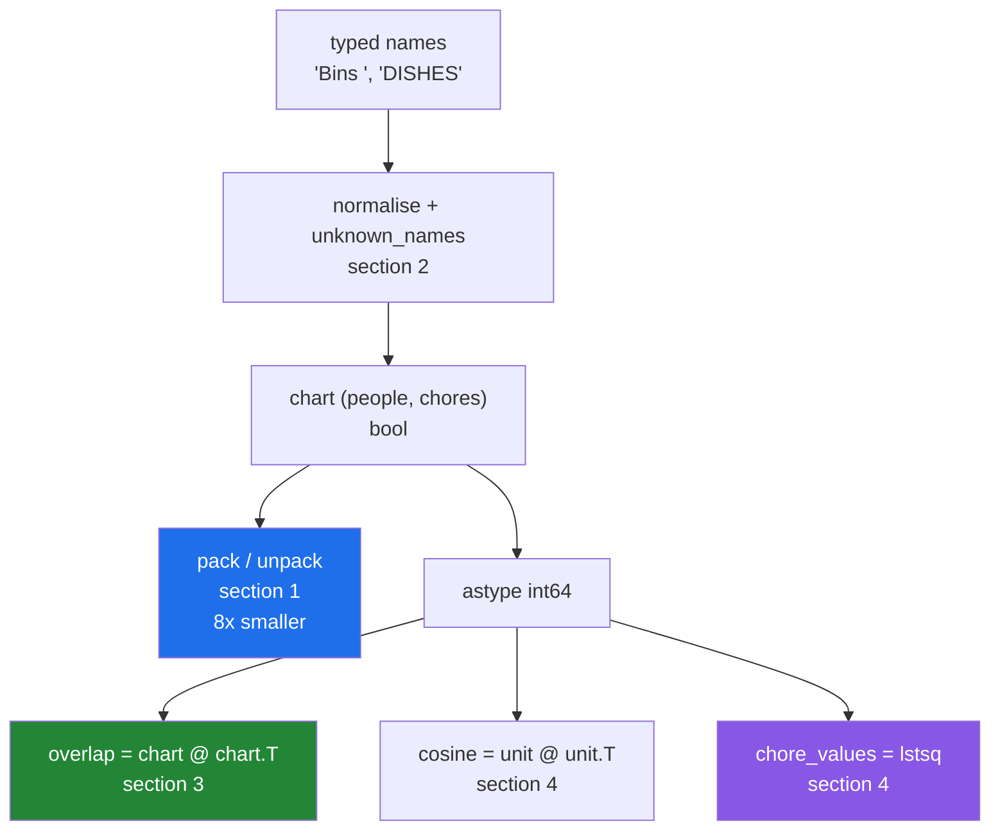

# 5.1 — `src/setu/chores.py` — bits, names and matrices in one module

## One-line answer

One module holds the whole day: the chart packed eight ticks to a byte, the names normalised against a
controlled vocabulary, the overlap grid from one matrix product, and the value of each chore fitted by
least squares — with a guard in front of every silent failure the day found.

---

## The story

The flat has been keeping the chart for three months and somebody finally wants to do something with it
rather than look at it.

Three questions, and they are the ones anybody would ask. Can we keep a year of these without it becoming
a spreadsheet nobody opens? Who actually does the same jobs as who? And which jobs are the ones people
avoid — not by asking, which produces polite answers, but by working it out from what people did and how
put-upon they said they felt at the end of each week?

Those are the three sections of today, in order, and none of them is a new idea at this point. What the
module adds is the thing a day of documents cannot: every one of them wired together, with the guards in
place, so that the failures the day catalogued cannot happen quietly.

---

## The idea in plain language

The module has four jobs and each one comes from a section of this day.

**Store it small.** A boolean chart costs a byte per tick and one bit would do
([1.1](../01-bits/1.1-a-number-is-switches.md)), so `pack` squeezes it eight to a byte with
`np.packbits` and keeps the shape and bit order beside the bytes, because neither survives the packing
([1.6](../01-bits/1.6-packbits.md)).

**Agree what a chore is called.** People type names four ways
([2.2](../02-strings/2.2-np-strings.md)), so `normalise` trims and lowercases, and `unknown_names` reports
what did not match the controlled vocabulary — in **both** directions, because a filter that matches
nothing looks exactly like a period with no activity
([2.3](../02-strings/2.3-comparison-is-not-a-match.md)).

**Compare people.** `overlap` is one matrix product against the transpose
([3.2](../03-matmul/3.2-matmul-by-hand.md)), and `cosine` is the same thing with each person's volume
divided out ([4.3](../04-linalg/4.3-norm.md)) so that somebody who did more jobs does not look similar to
everybody by default.

**Price the chores.** Given each person's total "how put-upon I felt" score, `chore_values` fits a value
per chore by least squares ([4.5](../04-linalg/4.5-lstsq.md)) and refuses when the answer would be
arbitrary or numerically meaningless ([4.6](../04-linalg/4.6-conditioning.md)).

Three design decisions run through all four, and they are the part worth arguing about rather than the
functions.

**The bit order is a storage format**, so the enum's docstring says so in capitals
([1.5](../01-bits/1.5-a-bitmask.md)). Reordering the members rewrites the meaning of every packed byte
already on disk, and nothing in the data records the old order.

**The dtype is stated at every boundary.** Booleans for the chart because they mask, integers for the
overlap because `@` on booleans saturates to `True`
([3.1](../03-matmul/3.1-a-dot-product-is-a-total.md)), and `float64` for anything that accumulates
([4.2](../04-linalg/4.2-solve-and-never-inv.md)).

**Every function that can be silently wrong raises instead.** That is most of them, and the guards are
what makes this module worth more than the four calls it wraps.

---

## Why Setu needs it

- **[5.2](5.2-the-test-that-can-go-red.md)** is this module's eval, and every assertion aims at one of the
  guards above.
- **Day 155's retrieval** uses `cosine` unchanged with documents in place of people, which is the test of
  whether the signature was designed or improvised.
- **Day 91's regression** is `chore_values` with features in place of chores, and the conditioning check
  here is the one that day needs.
- **Day 76's encoding** normalises categories exactly as `normalise` does, and fits the vocabulary once.
- **Day 42's SQL phase** stores flags in an integer column, which is `pack` and `Chore` moved into a
  database.

---

## The mechanism

The module in four pieces. First the storage format and the vocabulary:

```python
"""The flat's chore chart: packed into bits, scored with a matrix product, priced with a solve."""

from __future__ import annotations

from dataclasses import dataclass
from enum import IntFlag

import numpy as np

CHORE_DTYPE = np.uint8
NAME_WIDTH = 24
NAME_DTYPE = np.dtype(f"<U{NAME_WIDTH}")
BITORDER = "big"  # np.packbits: the first column lands in the most significant bit
ACCUMULATE_IN = np.float64
MAX_CONDITION = 1e10


class Chore(IntFlag):
    """One bit per chore, counted from the LEAST significant bit.

    STORAGE FORMAT. These values are written to disk. Renaming a member is safe;
    reordering or reusing a value silently rewrites the meaning of every stored row.
    A ninth chore needs CHORE_DTYPE widened to uint16 and a migration.
    """

    BINS = 1 << 0
    HOOVER = 1 << 1
    DISHES = 1 << 2
    BATHROOM = 1 << 3
    SHOPPING = 1 << 4
    RECYCLING = 1 << 5
    WINDOWS = 1 << 6
    POST = 1 << 7


CHORE_NAMES = np.array([chore.name.lower() for chore in Chore], dtype=NAME_DTYPE)


def _check_width() -> None:
    """Fail at import if a flag no longer fits its storage dtype."""
    widest = max(int(chore) for chore in Chore)
    if widest > np.iinfo(CHORE_DTYPE).max:
        raise ValueError(f"Chore needs more than {CHORE_DTYPE.__name__} can hold")


_check_width()
```

**Line by line:**

- `BITORDER = "big"` with the comment saying **what "big" means here** — nobody remembers which end the
  word refers to, and the comment says it in the reader's terms rather than the library's
  ([1.6](../01-bits/1.6-packbits.md)).
- `NAME_DTYPE` built from `NAME_WIDTH` — one number, one place, so the width check and the dtype cannot
  disagree ([2.1](../02-strings/2.1-fixed-width-text.md)).
- The **STORAGE FORMAT** paragraph — the highest-value comment in the file, and the only thing that will
  stop somebody alphabetising the enum
  ([1.5](../01-bits/1.5-a-bitmask.md)).
- `1 << 0`, `1 << 1` rather than `1, 2, 4, 8` — the shift form says "bit 0", "bit 1", which is what is
  meant ([1.4](../01-bits/1.4-shifts-and-the-bit-that-fell-off.md)).
- `CHORE_NAMES` built **from the enum** rather than typed out again — two lists of chore names is one list
  too many, and this way they cannot drift apart.
- `_check_width()` called at import — a flag that has overflowed `uint8` is silently `0`
  ([1.5](../01-bits/1.5-a-bitmask.md)), and there is no later moment where that becomes visible. Failing at
  import turns a feature that never works into a process that never starts.

Then the packing:

```python
@dataclass(frozen=True, slots=True)
class PackedChart:
    """A chart squeezed to one bit per tick, plus what is needed to unpack it."""

    data: np.ndarray
    shape: tuple[int, ...]
    bitorder: str = BITORDER

    @property
    def saving(self) -> float:
        original = int(np.prod(self.shape))
        return original / self.data.nbytes if self.data.nbytes else 1.0


def pack(chart: np.ndarray) -> PackedChart:
    """Pack a boolean chart eight ticks to a byte, keeping its shape and bit order."""
    if chart.dtype != np.bool_:
        raise TypeError(
            f"packbits treats any non-zero value as True; expected bool, got {chart.dtype}"
        )
    return PackedChart(
        data=np.packbits(chart, bitorder=BITORDER), shape=chart.shape, bitorder=BITORDER
    )


def unpack(packed: PackedChart) -> np.ndarray:
    """Restore the chart exactly. count= is what stops padding becoming phantom chores."""
    count = int(np.prod(packed.shape)) if packed.shape else 0
    flat = np.unpackbits(packed.data, count=count, bitorder=packed.bitorder)
    return flat.reshape(packed.shape).astype(bool)
```

**Line by line:**

- `shape` stored on the object — **the packed bytes alone are ambiguous**: the same five bytes are a valid
  `(5, 8)`, `(8, 5)` or `(40,)` array ([1.6](../01-bits/1.6-packbits.md)). This is why it is a class.
- `bitorder` stored as well as used — a file written today is readable in five years even if the default
  changes or another team's code wrote it the other way round.
- `chart.dtype != np.bool_` with a message that says **what would have happened** — "packbits treats any
  non-zero value as True" tells the caller their counts would have been destroyed, which "expected bool"
  does not.
- `count=count` in `unpack` — **not optional**, and the one argument that makes the round trip exact for a
  chart whose width is not a multiple of eight. Without it, a five-chore chart comes back with eight
  columns and three chores nobody ever did.
- `if packed.shape else 0` — `np.prod(())` of an empty shape is `1.0`, so an empty chart needs the guard.
- `.astype(bool)` at the end — `unpackbits` returns `uint8` ones and zeros, and a mask built from those
  indexes by position instead of selecting
  ([1.1](../01-bits/1.1-a-number-is-switches.md)).
- `saving` as a property — the number that justifies the class, available to be logged, and exactly 8.0
  when the size divides evenly.

Then the comparison:

```python
def overlap(chart: np.ndarray) -> np.ndarray:
    """How many chores each pair of people both did. (people, people), symmetric."""
    if chart.ndim < 2:
        raise ValueError(f"expected (..., people, chores), got shape {chart.shape}")
    if chart.dtype == np.bool_:
        raise TypeError(
            "boolean input: @ accumulates in bool and saturates to True. Cast to an integer dtype."
        )
    people = chart.shape[-2]
    out = chart @ chart.swapaxes(-1, -2)
    expected = (*chart.shape[:-2], people, people)
    if out.shape != expected:
        raise AssertionError(f"expected {expected}, got {out.shape}")
    return out


def cosine(chart: np.ndarray) -> np.ndarray:
    """Overlap with each person's volume divided out. All-zero rows score zero, not nan."""
    values = chart.astype(ACCUMULATE_IN)
    lengths = np.linalg.norm(values, axis=-1, keepdims=True)
    unit = values / np.maximum(lengths, 1e-12)
    return np.clip(unit @ unit.swapaxes(-1, -2), -1.0, 1.0)
```

**Line by line:**

- `chart.dtype == np.bool_` **raising** in `overlap` — the failure from
  [3.1](../03-matmul/3.1-a-dot-product-is-a-total.md), where boolean `@` saturates to `True` and returns a
  grid of nothing but `True`. It does not warn, so the guard is the only defence.
- `chart.shape[-2]` — the people axis named **from the end**, so the function works for `(people, chores)`
  and `(months, people, chores)` alike ([3.5](../03-matmul/3.5-stacks-of-matrices.md)).
- `chart.swapaxes(-1, -2)` and never `.T` — `.T` reverses **every** axis and destroys the batch layout, and
  the bug hides whenever the batch size equals a matrix dimension
  ([3.5](../03-matmul/3.5-stacks-of-matrices.md)).
- `expected = (*chart.shape[:-2], people, people)` — the shape rule as code
  ([3.2](../03-matmul/3.2-matmul-by-hand.md)), so the assertion checks the rule rather than a literal and
  keeps working when a batch axis is added.
- `raise AssertionError` rather than a bare `assert` — `assert` statements vanish under `python -O`, and
  this check is load-bearing.
- `keepdims=True` in `cosine` — the divisor must be a column
  ([4.3](../04-linalg/4.3-norm.md)), and without it this raises on a rectangular chart and normalises the
  wrong axis on a square one.
- `np.maximum(lengths, 1e-12)` — **a person who did nothing has a zero-length row**, and dividing gives
  `nan` that spreads through every score involving them
  ([4.3](../04-linalg/4.3-norm.md)). Zero is the right answer: no direction, no similarity.
- `np.clip(..., -1.0, 1.0)` — a unit row against itself can come out at 1.0000000000000002, and anything
  downstream taking an `arccos` would return `nan`.

And the fit:

```python
@dataclass(frozen=True, slots=True)
class Fit:
    """Fitted chore values, and everything needed to judge them."""

    values: np.ndarray
    sum_squared_error: float
    rank: int
    n_chores: int
    condition: float

    @property
    def determined(self) -> bool:
        return self.rank == self.n_chores

    @property
    def digits_left(self) -> float:
        return 16.0 - float(np.log10(self.condition)) if np.isfinite(self.condition) else 0.0


def chore_values(chart: np.ndarray, scores: np.ndarray) -> Fit:
    """Least-squares fit of how much each chore is worth, from people's total scores."""
    a = chart.astype(ACCUMULATE_IN)
    if a.ndim != 2:
        raise ValueError(f"expected (people, chores), got shape {a.shape}")
    if scores.shape[:1] != a.shape[:1]:
        raise ValueError(f"chart has {a.shape[0]} people, scores has {scores.shape[0]}")
    if a.shape[0] < a.shape[1]:
        raise ValueError(
            f"{a.shape[0]} people cannot determine {a.shape[1]} chore values; "
            f"the fit would be exact and arbitrary"
        )
    x, residuals, rank, singular = np.linalg.lstsq(a, scores, rcond=None)
    error = float(residuals[0]) if residuals.size else float(((a @ x - scores) ** 2).sum())
    condition = float(singular[0] / singular[-1]) if singular[-1] > 0 else float("inf")
    if condition > MAX_CONDITION:
        raise ValueError(
            f"chart is ill-conditioned (cond = {condition:.3g}); two chores are probably "
            f"always done by the same people and cannot be told apart"
        )
    return Fit(
        values=x,
        sum_squared_error=error,
        rank=int(rank),
        n_chores=int(a.shape[1]),
        condition=condition,
    )
```

**Line by line:**

- `a.shape[0] < a.shape[1]` raising — the **underdetermined** case
  ([4.5](../04-linalg/4.5-lstsq.md)), which does not raise in NumPy: it returns a minimum-norm answer that
  fits perfectly and means nothing. The message says why, in the domain's words.
- `residuals[0] if residuals.size else ...` — `lstsq` returns an **empty** residual array for an exact or
  rank-deficient fit, so the fallback computes it directly and `sum_squared_error` is always a number
  ([4.5](../04-linalg/4.5-lstsq.md)).
- `singular[0] / singular[-1]` — the condition number **from a value `lstsq` already returned**, so it is
  free where `np.linalg.cond` would recompute the decomposition
  ([4.6](../04-linalg/4.6-conditioning.md)).
- `if singular[-1] > 0 else float("inf")` — a rank-deficient chart has a zero smallest singular value, and
  infinity is honest where a division would give a warning and a `nan`.
- `condition > MAX_CONDITION` with the message naming the **domain** cause — "two chores are probably
  always done by the same people" is diagnosable; "ill-conditioned" is a word to search for.
- `digits_left` as a property — the condition number translated into the units a person can act on
  ([4.6](../04-linalg/4.6-conditioning.md)).
- `determined` — the rank check given a name, so no call site has to remember to compare it against the
  column count.

Running it on the chart:

```text
chore names   : ['bins' 'hoover' 'dishes' 'bathroom' 'shopping' 'recycling' 'windows'
 'post']
dtype         : <U24
packed        : [172 114 201  55 154] shape (5, 8) saving 8.0
round trip    : True

overlap       :
[[4 1 2 2 2]
 [1 4 1 3 2]
 [2 1 4 1 2]
 [2 3 1 5 2]
 [2 2 2 2 4]]
diagonal      : [4 4 4 5 4]
cosine        :
[[1.    0.25  0.5   0.447 0.5  ]
 [0.25  1.    0.25  0.671 0.5  ]
 [0.5   0.25  1.    0.224 0.5  ]
 [0.447 0.671 0.224 1.    0.447]
 [0.5   0.5   0.5   0.447 1.   ]]

normalised    : ['bins' 'hoover' 'dishes' 'bins' 'hoovering']
unknown       : ['hoovering']
```

Note the eight-fold saving, the symmetric grid with each person's own count on the diagonal, and the one
name that did not match the vocabulary. Somebody typed "hoovering" and the module said so rather than
silently dropping the row.

Now the fit, which needs more rows than chores:

```text
chart shape   : (60, 8) - 60 person-weeks, 8 chores
fitted values : [2.035 3.025 1.471 3.982 2.535 0.955 3.517 0.492]
true values   : [2.  3.  1.5 4.  2.5 1.  3.5 0.5]
largest error : 0.0452
sum sq error  : 1.1303
rank          : 8 of 8  determined: True
condition     : 4.538
digits left   : 15.34

worth most    : bathroom 3.98
worth least   : post 0.49
```

Sixty person-weeks recovered eight chore values to within five hundredths, and the module says how far off
it is, whether the answer is the only one, and how many digits survive. **Bathroom is the job people mind
most and post is the one they mind least**, which is a conclusion drawn from what people did rather than
from asking them.

How the four pieces fit:



---

## When it breaks

**A chart of counts handed to `pack`:**

```text
$ uv run python -c "
import numpy as np
from setu.chores import pack
counts = np.array([[3, 0, 2, 1, 4, 2, 3, 0]])
pack(counts)
"
Traceback (most recent call last):
  File "<string>", line 5, in <module>
TypeError: packbits treats any non-zero value as True; expected bool, got int64
```

**What it means.** `np.packbits` would have accepted this and turned every non-zero count into a `1`,
destroying the counts with no error at all ([1.6](../01-bits/1.6-packbits.md)). The guard turns a silent
data loss into a message naming the dtype and the behaviour that would have caused it. **The message
explains the danger rather than the rule**, which is what makes it useful to somebody who has not read
this day.

**A boolean chart handed to `overlap`:**

```text
$ uv run python -c "
import numpy as np
from setu.chores import overlap
did = np.array([[1, 0, 1], [1, 1, 0]], dtype=bool)
overlap(did)
"
Traceback (most recent call last):
  File "<string>", line 5, in <module>
TypeError: boolean input: @ accumulates in bool and saturates to True. Cast to an integer dtype.
```

**What it means.** Boolean `@` runs happily and returns a grid of `True`, because adding booleans in
boolean arithmetic saturates ([3.1](../03-matmul/3.1-a-dot-product-is-a-total.md)). Every pair shares at
least one chore, so the whole grid is `True` and carries no information — and nothing raises. This is the
single worst silent failure on the day, which is why the guard names both the cause and the fix.

**Two chores that are always done together:**

```text
$ uv run python -c "
import numpy as np
from setu.chores import chore_values
rng = np.random.default_rng(24)
weeks = rng.integers(0, 2, size=(60, 8))
weeks[:, 1] = weeks[:, 0]
scores = weeks @ np.array([2.0, 3.0, 1.5, 4.0, 2.5, 1.0, 3.5, 0.5])
chore_values(weeks, scores)
"
Traceback (most recent call last):
  File "<string>", line 9, in <module>
ValueError: chart is ill-conditioned (cond = 3.91e+16); two chores are probably always done by the same people and cannot be told apart
```

**What it means.** Column 1 was made identical to column 0, so the two chores are indistinguishable in the
data and no amount of fitting can separate their values
([4.6](../04-linalg/4.6-conditioning.md)). NumPy's `lstsq` would have returned an answer — some arbitrary
split of the combined value between the two columns — with no complaint. **The message names the domain
cause**, so the reader looks at the chart rather than at the linear algebra, which is where the problem
actually is.

---

## In production

**What a professional writes instead of the teaching version.** The module above is close to it, which is
the point of having built it this way. What changes is around it — the layer that reads the chart from
somewhere real and reports what it found:

```python
from __future__ import annotations

from dataclasses import dataclass

import numpy as np

from setu.chores import CHORE_NAMES, chore_values, cosine, normalise, overlap, pack


@dataclass(frozen=True, slots=True)
class ChartReport:
    """Everything a caller needs to decide whether to trust the numbers below it."""

    people: int
    chores: int
    rows_dropped: int
    unknown_names: list[str]
    packed_saving: float


def ingest(names: np.ndarray, ticks: np.ndarray) -> tuple[np.ndarray, ChartReport]:
    """Turn typed names and ticks into a chart, reporting what was thrown away."""
    clean = normalise(names)
    known = np.isin(clean, CHORE_NAMES)
    if not known.any():
        raise ValueError(
            f"none of the {clean.size} names matched a chore; the vocabulary or the "
            f"normalisation is wrong, not the data"
        )
    columns = np.searchsorted(np.sort(CHORE_NAMES), clean[known])
    chart = np.zeros((ticks.shape[0], CHORE_NAMES.size), dtype=bool)
    chart[:, columns] = ticks[:, known]
    return chart, ChartReport(
        people=chart.shape[0],
        chores=chart.shape[1],
        rows_dropped=int(np.count_nonzero(~known)),
        unknown_names=sorted(set(clean[~known].tolist())),
        packed_saving=pack(chart).saving,
    )
```

**Line by line:**

- Returning **both** the chart and a report — the chart alone cannot be audited. How many columns were
  dropped and which names were unrecognised are the two numbers that say whether the chart is the chart you
  meant ([2.3](../02-strings/2.3-comparison-is-not-a-match.md)).
- `if not known.any(): raise` — **the reverse check** from
  [2.3](../02-strings/2.3-comparison-is-not-a-match.md), made into a guard. Zero names matching is a
  normalisation or vocabulary bug and never a fact about the data, and the message says so.
- `np.searchsorted(np.sort(CHORE_NAMES), ...)` — turning names into column positions with a binary search
  ([Day 23, 3.5](../../../day-23-ufuncs-and-statistics/parts/03-sorting-and-searching/3.5-searchsorted.md)).
  The `np.sort` is there because `searchsorted` requires a sorted first argument and never checks — the
  promise the caller owns.
- `chart[:, columns] = ticks[:, known]` — assigning through a fancy index
  ([Day 21, 4.1](../../../day-21-indexing-and-views/parts/04-fancy-indexing/4.1-a-list-of-positions.md)), so
  the chore order in the input does not have to match the enum's.
- `unknown_names` deduplicated and sorted — a bad file has a million unmatched rows and a handful of
  distinct wrong names, and it is the names that identify the upstream problem
  ([Day 23, 4.2](../../../day-23-ufuncs-and-statistics/parts/04-counting/4.2-unique.md)).
- `packed_saving` reported — the eight-fold figure logged rather than assumed, so a chart whose width has
  become badly aligned shows up as a saving of 6.2 rather than 8.0.
- The module's own functions imported rather than reimplemented — the report layer knows about files and
  names; the module knows about arrays. Keeping that line clear is why `chores.py` has no I/O in it at all.

**What changes at scale.** The four operations scale very differently and that decides the architecture.
Packing is linear and its eight-fold saving is the difference between a year of charts fitting in memory
and not — and packed data can be intersected directly with `&` without unpacking
([1.6](../01-bits/1.6-packbits.md)), which is what a bitmap index does. `overlap` and `cosine` are
`people² × chores`, so they grow with the **square** of the people: five people is a 25-entry grid and
fifty thousand is 2.5 billion, which is 20 GB and is why similarity is computed in chunks or approximately
rather than as one grid ([3.2](../03-matmul/3.2-matmul-by-hand.md)). And `chore_values` is linear in rows
and quadratic in chores, so adding years of history is cheap and adding chores is not
([4.5](../04-linalg/4.5-lstsq.md)) — with the further catch that more columns means more chances for two of
them to be nearly identical, so the condition number climbs as the vocabulary grows and the guard fires
more often, which is the correct behaviour and the reason it reports a number rather than a boolean.

**The failure that only appears with real data.** A version of this module stored the chart packed and the
chore order in a separate configuration file. Somebody added a chore and put it in alphabetical position
rather than at the end. Every byte already stored decoded one bit out of place, so a year of history said
people had done chores they had not, and the overlap grids were quietly rearranged. Nothing raised, because
every byte was still a valid byte. The enum's docstring in this module exists because of that class of
mistake, and the `_check_width` call exists because the same person's next change would have been a ninth
chore.

**The review comment a senior engineer leaves.** *"`overlap` casts to `int64` internally? It should not —
make the caller do it, and keep the guard. Silently casting a boolean chart would fix the saturation bug
and hide the fact that somebody passed the wrong dtype, and that same wrong dtype will be wrong somewhere
else too."*

**The interview question.** *"Walk me through a module you have written that uses NumPy properly."* The
interesting parts are the guards rather than the calls. Packing a boolean chart is `np.packbits` for an
eight-fold saving, but the shape and the bit order do not survive it, so they travel with the bytes and
`unpack` passes `count=` or the padding comes back as real data. The overlap grid is one matrix product
against the transpose — and the module **refuses** a boolean chart, because `@` on booleans accumulates in
boolean and saturates to `True`, returning a grid with no information and no error. Cosine similarity is
the same product on normalised rows, with the divisor clamped so a person who did nothing scores zero
rather than `nan`. And fitting a value per chore is least squares, which returns four things: the module
keeps the rank, so it knows whether the answer is unique, and computes the condition number from the
singular values it already has, so it can refuse a chart where two chores are always done together and
cannot be separated. Every one of those guards exists because the failure it prevents is silent.

---

## Check yourself

```bash
uv run python -c "
import numpy as np
from setu.chores import CHORE_NAMES, chore_values, cosine, normalise, overlap, pack, unknown_names, unpack
did = np.array([[1,0,1,0,1,1,0,0],[0,1,1,1,0,0,1,0],[1,1,0,0,1,0,0,1],
                [0,0,1,1,0,1,1,1],[1,0,0,1,1,0,1,0]], dtype=bool)
p = pack(did)
print('saving     :', p.saving)
print('round trip :', np.array_equal(unpack(p), did))
counts = did.astype(np.int64)
print('overlap    :', np.diag(overlap(counts)))
print('row sums   :', counts.sum(axis=1))
print('cosine diag:', np.diag(cosine(counts)).round(6))
print('unknown    :', unknown_names(np.array(['Bins ', 'hoovering'])))
print('bool guard :', end=' ')
try:
    overlap(did)
except TypeError as e:
    print(str(e)[:60])
"
```

The overlap diagonal and the row sums print the same five numbers. Say why they must agree, and which of
the two you would use as a test assertion.

**Answer out loud, without scrolling up:**

> Name the four things this module does and the section each comes from. Then name the one guard you would
> keep if you could only keep one, and say what it prevents.

---

**Next:** [5.2 — `tests/test_chores.py`, the test that can go red](5.2-the-test-that-can-go-red.md).
