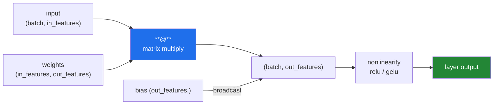

# Day 24 — Binary and string functions, and linear algebra

**Phase 3 · Module 3** · IDs: **NP-08** (binary and string functions), **NP-09** (matrix library, linear algebra)

> **Yesterday:** ufuncs and the retrieval primitive.
> **Today:** bit-packing for compact masks, NumPy's string arrays and their honest limits, and then
> the operation that matters most in the whole plan: `A @ B`. **Every neural network layer is a
> matrix multiply plus a bias plus a nonlinearity.** Day 126 will say that again; today you make it
> true with your hands.
> **Tomorrow:** copy vs view, a vectorised stats module, and Phase 3 closes.

```bash
./m start 24 && ./m scaffold 24
```

**Time:** 100 minutes. **Request budget:** 0 model calls.

---

## §1 The story

Three things today, and only the third is famous.

**Bit operations** exist because a boolean array costs one **byte** per element, not one bit. On
Day 159 you will hold a 100 000 × 100 000 candidate mask; at one byte each that is 10 GB, and
`np.packbits` turns it into 1.25 GB. It also gives you fast set operations: `mask_a & mask_b` is one
pass of C over contiguous memory, which is how a hybrid retriever intersects two candidate lists on
Day 167.

**String arrays** exist and are mostly a trap. `np.array(["a", "bb"])` gives dtype `<U2` — *fixed
width*, so every element is padded to the longest, and assigning a longer string **silently
truncates**. NumPy is a numerical library; text belongs in pandas' Arrow-backed `str` dtype (Day 26)
or in a plain Python list. You learn the failure mode today so you never debug it later.

**Then linear algebra**, which is the point of the day:



That diagram is a `Dense` layer in Keras, an `nn.Linear` in PyTorch, and the inner loop of attention.
There is no additional magic in Phase 15 — only more of these, stacked, with derivatives attached.
So the shape rule is worth burning in now:

> `(n, k) @ (k, m) → (n, m)`. **The inner dimensions must match and they vanish.**

Nearly every deep-learning shape error you will hit between Day 125 and Day 149 is that rule,
violated. Learn to read the error message as "which k disagreed".

---

## §2 Setup — run this

```bash
mkdir -p days/day-24/lab
touch days/day-24/lab/linalg.py
```

`src/setu/arrays.py` grows today. No new packages — `numpy.linalg` ships with NumPy.

---

## §3 NP-08 — bits and strings

`days/day-24/lab/linalg.py`:

```python
"""NP-08 / NP-09: bit packing, string-array limits, and linear algebra."""

from __future__ import annotations

import numpy as np


def bitwise_on_masks() -> None:
    a = np.array([True, True, False, False])
    b = np.array([True, False, True, False])

    print(f"\n{a & b=}   <- AND")
    print(f"{a | b=}   <- OR")
    print(f"{a ^ b=}   <- XOR")
    print(f"{~a=}      <- NOT")
    print(f"{np.bitwise_and(a, b)=}   <- the ufunc `&` dispatches to")

    print("\n  On Day 167 the hybrid retriever intersects two candidate masks:")
    print("  dense_hits & bm25_hits -> one C pass, no Python loop.")


def packing_saves_memory() -> None:
    rng = np.random.default_rng(0)
    mask = rng.random(1_000_000) > 0.5

    packed = np.packbits(mask)
    print(f"\n{mask.dtype=} {mask.nbytes:,} bytes   <- one BYTE per boolean")
    print(f"{packed.dtype=} {packed.nbytes:,} bytes   <- one BIT per boolean")
    print(f"  {mask.nbytes / packed.nbytes:.0f}x smaller")

    restored = np.unpackbits(packed)[: len(mask)].astype(bool)
    print(f"{np.array_equal(mask, restored)=}   <- round-trips")
    print("  NOTE the slice: unpackbits pads to a multiple of 8, so you must trim.")

    print(f"\n{np.binary_repr(37, width=8)=}")
    print(f"{np.left_shift(1, 10)=}   <- 1 << 10")


def string_arrays_are_a_trap() -> None:
    names = np.array(["a", "bb", "ccc"])
    print(f"\n{names.dtype=}   <- <U3: FIXED width, padded to the longest")
    print(f"{names.itemsize=} bytes per element")

    names[0] = "this is far too long"
    print(f"{names=}   <- SILENTLY TRUNCATED to 3 characters")

    print(f"\n{np.strings.upper(names)=}")
    print(f"{np.strings.str_len(names)=}")

    objects = np.array(["a", "bb", "ccc"], dtype=object)
    objects[0] = "no truncation here"
    print(f"\n{objects=}   <- dtype=object holds real Python strings")
    print(f"{objects.dtype=}   <- but it is a pointer array: no speed advantage")

    print("\n  Verdict: NumPy is a NUMERICAL library.")
    print("  Text goes in pandas' Arrow-backed str dtype (Day 26) or a Python list.")
```

**Line by line:**

- `a & b` on boolean arrays — element-wise AND. Yesterday's `&`-not-`and` rule (Day 21), now with the
  bitwise ufuncs named.
- `np.packbits(mask)` — eight booleans per byte. **8× smaller.** The saving is the difference between
  a mask that fits in RAM on Day 159 and one that does not.
- `np.unpackbits(packed)[: len(mask)]` — **the trim is mandatory.** Packing rounds up to a whole
  number of bytes, so unpacking a 1 000 000-element mask returns 1 000 000 padded to 1 000 000 (already
  a multiple of 8 here) — but with, say, 13 elements you get 16 back. Forgetting the slice silently
  appends up to seven `False` values.
- `np.binary_repr`, `np.left_shift` — bit inspection and shifting. Rarely needed, occasionally
  essential (hash buckets on Day 156).
- `names.dtype` is `<U3` — `U` for Unicode, `3` for the fixed width. **Every element occupies the same
  space**, which is what makes it an array rather than a list of pointers.
- `names[0] = "this is far too long"` — **truncated to `"thi"`, with no warning and no exception.**
  Run this line and look at the output. This is the single reason NumPy string arrays are not used in
  this project.
- `np.strings.upper(...)` — the vectorised string ufuncs live in `np.strings` in NumPy 2.x. (In 1.x
  they were `np.char`, which is deprecated — another Day-20 name change.)
- `dtype=object` — no truncation, because it stores pointers to real Python strings. It also gives up
  every performance advantage: you are back to a boxed list with extra steps.

---

## §4 NP-09 — linear algebra

Add to the same file:

```python
def the_shape_rule() -> None:
    a = np.arange(6).reshape(2, 3)
    b = np.arange(12).reshape(3, 4)
    print(f"\n{a.shape=} @ {b.shape=} -> {(a @ b).shape=}")
    print("  (2,3) @ (3,4) -> (2,4): the inner 3s match and VANISH")

    try:
        b @ a
    except ValueError as exc:
        print(f"\n  (3,4) @ (2,3) -> {exc}")
        print("  read it as: which inner dimension disagreed?")


def multiply_versus_matmul() -> None:
    a = np.array([[1, 2], [3, 4]])
    b = np.array([[10, 20], [30, 40]])
    print(f"\n{a * b=}     <- ELEMENT-WISE (Hadamard). Same shape in, same shape out.")
    print(f"{a @ b=}   <- MATRIX product. Rows times columns.")
    print("  ^ different operations, both spelled with two characters. Never confuse them.")

    v = np.array([1, 1])
    print(f"\n{a @ v=}     <- matrix times vector: (2,2) @ (2,) -> (2,)")
    print(f"{v @ v=}       <- vector times vector: the dot product, a SCALAR")
    print(f"{np.dot(v, v)=} {np.inner(v, v)=}")


def a_dense_layer_by_hand() -> None:
    rng = np.random.default_rng(0)
    batch, in_features, out_features = 4, 3, 2

    x = rng.normal(size=(batch, in_features))
    w = rng.normal(size=(in_features, out_features)) * 0.1
    bias = np.zeros(out_features)

    z = x @ w + bias
    out = np.maximum(z, 0)          # ReLU

    print(f"\n{x.shape=} @ {w.shape=} + {bias.shape=} -> {z.shape=}")
    print(f"{out.round(3)=}")
    print("\n  THAT IS A NEURAL NETWORK LAYER. Keras Dense, PyTorch nn.Linear.")
    print("  Day 126 adds derivatives. Nothing else changes.")


def norms_and_similarity() -> None:
    a = np.array([3.0, 4.0])
    print(f"\n{np.linalg.norm(a)=}   <- L2 length: sqrt(9+16)")
    print(f"{np.linalg.norm(a, ord=1)=}   <- L1: |3| + |4|")

    m = rng_matrix = np.array([[1.0, 2.0], [3.0, 4.0], [5.0, 6.0]])
    print(f"{np.linalg.norm(m, axis=1)=}   <- per-ROW length")

    def cosine(x, y):
        return float(x @ y / (np.linalg.norm(x) * np.linalg.norm(y)))

    u, v, w = np.array([1.0, 0.0]), np.array([1.0, 0.0]), np.array([0.0, 1.0])
    print(f"\n{cosine(u, v)=}   <- identical direction")
    print(f"{cosine(u, w)=}   <- orthogonal")
    print("  ^ Day 155 computes this over 100k embeddings. Same three tokens.")

    normalised = m / np.linalg.norm(m, axis=1, keepdims=True)
    print(f"\n{np.linalg.norm(normalised, axis=1)=}   <- all 1.0")
    print(f"{(normalised @ normalised.T).round(3)=}")
    print("  ^ pre-normalise, then ONE matmul gives every pairwise cosine. This is")
    print("    how a vector database answers a query without a Python loop.")


def solving_and_decomposition() -> None:
    a = np.array([[2.0, 1.0], [1.0, 3.0]])
    b = np.array([5.0, 10.0])

    x = np.linalg.solve(a, b)
    print(f"\n{x=}   <- solves ax = b")
    print(f"{np.allclose(a @ x, b)=}")

    slow = np.linalg.inv(a) @ b
    print(f"{np.allclose(x, slow)=}   <- same answer")
    print("  ...but NEVER use inv(): slower and numerically worse. solve() always.")

    print(f"\n{np.linalg.det(a)=} {np.linalg.matrix_rank(a)=}")
    values, vectors = np.linalg.eig(a)
    print(f"{values.round(3)=}   <- eigenvalues; Day 86's PCA is built on these")

    singular = np.array([[1.0, 2.0], [2.0, 4.0]])
    print(f"\n{np.linalg.det(singular)=} {np.linalg.matrix_rank(singular)=}")
    try:
        np.linalg.solve(singular, b)
    except np.linalg.LinAlgError as exc:
        print(f"  {exc}   <- Day 93's multicollinearity, as an exception")


def least_squares_is_linear_regression() -> None:
    rng = np.random.default_rng(1)
    n = 200
    x = rng.normal(size=(n, 1))
    design = np.hstack([np.ones((n, 1)), x])       # intercept column
    true = np.array([2.0, 3.0])
    y = design @ true + rng.normal(scale=0.1, size=n)

    coefficients, *_ = np.linalg.lstsq(design, y, rcond=None)
    print(f"\n{true=}")
    print(f"{coefficients.round(3)=}   <- recovered from noisy data")
    print("  ^ that is Day 92's linear regression, one function call.")
    print("    You will implement the normal equation by hand there. This is the check.")


if __name__ == "__main__":
    bitwise_on_masks()
    packing_saves_memory()
    string_arrays_are_a_trap()
    the_shape_rule()
    multiply_versus_matmul()
    a_dense_layer_by_hand()
    norms_and_similarity()
    solving_and_decomposition()
    least_squares_is_linear_regression()
```

**Line by line:**

- `(2,3) @ (3,4) -> (2,4)` — **the rule.** Read the `ValueError` when it fails: NumPy prints both
  shapes and which dimensions mismatched. That message is the fastest debugging tool in Phase 15.
- `a * b` versus `a @ b` — **element-wise versus matrix product.** Both are two characters. Confusing
  them produces an array of the right-ish shape with entirely wrong numbers, which is worse than an
  exception. When a model trains but does not learn, this is one of the first things to check.
- `a @ v` with `v` of shape `(2,)` — NumPy treats a 1-D operand as a row or column as needed, and the
  result loses the dimension. `v @ v` gives a **scalar**: the dot product.
- `x @ w + bias` — `x` is `(4, 3)`, `w` is `(3, 2)`, so `z` is `(4, 2)`; `bias` is `(2,)` and
  **broadcasts** across the batch (Day 22). Three concepts, one line.
- `np.maximum(z, 0)` — ReLU. Not `np.max`, which reduces to a single value. `np.maximum` is the
  element-wise two-argument ufunc. That naming confusion is a real Day-129 bug.
- `np.linalg.norm(m, axis=1, keepdims=True)` — per-row lengths, kept 2-D so the division broadcasts
  (Day 22's `keepdims` note, earning its place).
- `normalised @ normalised.T` — **pre-normalise once, then one matrix multiply gives every pairwise
  cosine similarity.** This is exactly how a vector database answers a query: it is not a loop over
  documents, it is one BLAS call. Day 155 and Day 159 are this line with an index in front of it.
- `np.linalg.solve(a, b)` versus `np.linalg.inv(a) @ b` — same answer; `solve` is faster and
  numerically far more stable. **Never invert a matrix to solve a system.** This is one of the few
  places where the obvious approach is genuinely wrong rather than merely slower.
- `np.linalg.eig` — eigenvalues. Day 86's PCA is eigen-decomposition of a covariance matrix; you will
  meet these properly there.
- The singular matrix — `det == 0`, `rank < n`, and `solve` raises `LinAlgError`. **That is
  multicollinearity** (Day 93): two perfectly correlated features make the system unsolvable. Seeing
  the exception now means the statistical explanation later lands on something concrete.
- `np.linalg.lstsq` — least squares. `design` has a column of ones for the intercept, and the
  recovered coefficients are close to the true `[2.0, 3.0]`. **This is linear regression.** Day 92
  implements the normal equation by hand (Principle 2); this is the reference answer to check against.

---

## §5 Build brief

Extend `src/setu/arrays.py`:

```python
def l2_normalise(matrix, *, axis: int = 1) -> np.ndarray:
    """TODO(me): scale each row (or column) to unit length. Return a NEW array.

    - use keepdims so the division broadcasts
    - a zero-length row must come back as all zeros, NOT nan (reuse safe_divide's idea)
    - must not modify the input
    """
    raise NotImplementedError


def cosine_similarity_matrix(matrix) -> np.ndarray:
    """TODO(me): (n, n) pairwise cosine similarity, via ONE matmul on normalised rows.

    - no Python loop, no pairwise broadcast
    - the diagonal must be exactly 1.0 for non-zero rows (clip to [-1, 1] afterwards:
      floating error can produce 1.0000000000000002, which breaks arccos downstream)
    - zero rows give 0.0 similarity to everything, including themselves
    """
    raise NotImplementedError


def query_top_k(query, matrix, k: int) -> tuple[np.ndarray, np.ndarray]:
    """TODO(me): return (indices, scores) of the k rows most similar to `query`.

    - normalise, one matvec, then reuse top_k from Day 23
    - raise DataError if query length does not match matrix.shape[1]
    THIS IS VECTOR SEARCH. Day 155 renames it; the body does not change.
    """
    raise NotImplementedError


def pack_mask(mask) -> tuple[np.ndarray, int]:
    """TODO(me): return (packed_bytes, original_length) using np.packbits."""
    raise NotImplementedError


def unpack_mask(packed, length: int) -> np.ndarray:
    """TODO(me): restore the boolean mask. Remember to trim the padding to `length`."""
    raise NotImplementedError
```

- `query_top_k` is the payoff of Phase 3. It composes Day 22 (broadcasting), Day 23 (`top_k`) and
  today (`@`) into the function Phase 18 is built on. Writing it now means Day 155 is a rename.
- The `[-1, 1]` clip is not pedantry: `arccos(1.0000000000000002)` is `nan`, and if Day 160 converts
  similarity to angular distance, one self-comparison poisons the result.

---

## §6 The eval that must be able to fail

Add to `tests/test_arrays.py`:

```python
from setu.arrays import (
    cosine_similarity_matrix,
    l2_normalise,
    pack_mask,
    query_top_k,
    unpack_mask,
)


def test_l2_normalise_gives_unit_rows():
    m = np.array([[3.0, 4.0], [1.0, 0.0]])
    out = l2_normalise(m)
    assert np.allclose(np.linalg.norm(out, axis=1), 1.0)


def test_l2_normalise_handles_a_zero_row():
    out = l2_normalise(np.array([[3.0, 4.0], [0.0, 0.0]]))
    assert np.all(np.isfinite(out)), "a zero row produced nan"
    assert np.array_equal(out[1], [0.0, 0.0])


def test_l2_normalise_does_not_modify_the_input():
    m = np.array([[3.0, 4.0]])
    before = m.copy()
    l2_normalise(m)
    assert np.array_equal(m, before)


def test_cosine_diagonal_is_exactly_one():
    rng = np.random.default_rng(0)
    out = cosine_similarity_matrix(rng.normal(size=(30, 8)))
    assert np.array_equal(np.diag(out), np.ones(30)), "floating error left 1.0000000000000002"


def test_cosine_is_bounded_and_symmetric():
    rng = np.random.default_rng(1)
    out = cosine_similarity_matrix(rng.normal(size=(40, 6)))
    assert out.min() >= -1.0 and out.max() <= 1.0
    assert np.allclose(out, out.T)


def test_cosine_matches_the_hand_computation():
    m = np.array([[1.0, 0.0], [1.0, 1.0], [0.0, 1.0]])
    out = cosine_similarity_matrix(m)
    assert out[0, 1] == pytest.approx(1 / np.sqrt(2))
    assert out[0, 2] == pytest.approx(0.0, abs=1e-12)


def test_cosine_zero_row_is_zero_everywhere():
    out = cosine_similarity_matrix(np.array([[1.0, 0.0], [0.0, 0.0]]))
    assert np.array_equal(out[1], [0.0, 0.0])


def test_query_top_k_finds_the_nearest_rows():
    matrix = np.array([[1.0, 0.0], [0.9, 0.1], [0.0, 1.0]])
    indices, scores = query_top_k(np.array([1.0, 0.0]), matrix, k=2)
    assert list(indices) == [0, 1]
    assert scores[0] == pytest.approx(1.0)


def test_query_top_k_rejects_a_dimension_mismatch():
    with pytest.raises(DataError):
        query_top_k(np.array([1.0, 0.0, 0.0]), np.zeros((5, 2)), k=1)


def test_query_top_k_uses_no_python_loop_over_rows():
    """A loop would be unusably slow here; a matvec is instant."""
    import time

    rng = np.random.default_rng(2)
    matrix = rng.normal(size=(200_000, 128))
    query = rng.normal(size=128)
    start = time.perf_counter()
    query_top_k(query, matrix, k=10)
    assert time.perf_counter() - start < 2.0, "are you looping over rows?"


def test_mask_packing_round_trips():
    rng = np.random.default_rng(3)
    mask = rng.random(1000) > 0.5
    packed, length = pack_mask(mask)
    assert np.array_equal(unpack_mask(packed, length), mask)


@pytest.mark.parametrize("n", [1, 7, 8, 9, 13, 64, 65])
def test_mask_packing_handles_non_multiples_of_eight(n):
    rng = np.random.default_rng(4)
    mask = rng.random(n) > 0.5
    packed, length = pack_mask(mask)
    restored = unpack_mask(packed, length)
    assert len(restored) == n, "padding was not trimmed"
    assert np.array_equal(restored, mask)


def test_packing_actually_saves_memory():
    mask = np.ones(80_000, dtype=bool)
    packed, _ = pack_mask(mask)
    assert packed.nbytes <= mask.nbytes / 8 + 1
```

**Line by line:**

- `test_cosine_diagonal_is_exactly_one` — `array_equal`, not `allclose`. A row's cosine with itself is
  mathematically exactly 1, but floating arithmetic gives `1.0000000000000002`. That value is outside
  the domain of `arccos` and returns `nan`. The clip is not cosmetic.
- `test_cosine_matches_the_hand_computation` — checks against numbers you can verify on paper:
  `[1,0]·[1,1]` normalised is `1/√2`, and orthogonal vectors give 0. **Every vectorised implementation
  needs at least one test against a hand-computed value**, or you are only testing that it is
  self-consistent.
- `test_query_top_k_uses_no_python_loop_over_rows` — **the day's real assessment.** 200 000 × 128 is
  one BLAS call taking milliseconds; a Python loop over rows takes minutes. The test is a performance
  assertion because the difference is algorithmic, not marginal — the same justification as Day 8's
  O(n²) timing test.
- `test_mask_packing_handles_non_multiples_of_eight` — sizes 1, 7, 8, 9, 13, 64, 65. **Forgetting the
  trim in `unpackbits` fails on 1, 7, 9, 13 and 65 and passes on 8 and 64**, which is exactly the kind
  of bug that survives a casual test.
- `test_cosine_zero_row_is_zero_everywhere` — including its own diagonal. A zero vector has no
  direction, so similarity is undefined; returning 0 rather than `nan` keeps downstream code simple.

```bash
uv run python -m pytest tests/test_arrays.py -v
```

---

## §7 Request budget

| Resource | Spent today |
|---|---|
| LLM calls | **0** |

---

## §8 Traps

- **`*` when you meant `@`.** Right-ish shapes, wrong numbers, no exception.
- **Inner dimensions reversed.** Read the `ValueError`; it names both shapes.
- **`np.max` when you meant `np.maximum`.** One reduces, one is element-wise. ReLU needs the latter.
- **`np.linalg.inv(a) @ b`.** Slower and numerically worse. Use `solve`.
- **A cosine of `1.0000000000000002`.** `arccos` returns `nan`. Clip to `[-1, 1]`.
- **Dividing by a zero norm.** A zero row gives `nan` and poisons the matrix.
- **Forgetting `keepdims`** when normalising rows. The broadcast fails or, worse, succeeds wrongly.
- **`unpackbits` without trimming.** Up to seven phantom `False` values appended.
- **Assigning a long string into a `<U3` array.** Silently truncated.
- **Using NumPy string arrays for real text.** Fixed width. Use pandas or a list.
- **Looping rows to compute similarity.** It is one matmul.

---

## §9 Verify before you code

Written **2026-08-21**:

- <https://numpy.org/doc/stable/reference/routines.linalg.html> — the `linalg` surface.
- <https://numpy.org/doc/stable/reference/generated/numpy.linalg.solve.html> — and the note on `inv`.
- <https://numpy.org/doc/stable/reference/generated/numpy.packbits.html> — the padding behaviour.
- <https://numpy.org/doc/stable/reference/routines.strings.html> — `np.strings` in 2.x (was `np.char`).

---

## §10 Say it in an interview

> "A dense layer is `x @ w + b` followed by a nonlinearity — that's it, and everything in the deep
> learning phase is more of those with derivatives attached. The shape rule is `(n,k) @ (k,m) → (n,m)`,
> and most tensor bugs are that rule violated. For retrieval the trick is to L2-normalise the rows
> once, after which a single matrix multiply gives every pairwise cosine — that's how a vector database
> answers a query, not a loop over documents. I have a test that runs it over 200 000 × 128 and fails
> if it takes more than two seconds, because a loop there is minutes. And I clip similarities to
> [-1, 1]: floating error produces 1.0000000000000002 on the diagonal, which makes `arccos` return NaN
> if anything downstream converts to angular distance."

---

## §11 Done when

Tick [`CHECKLIST.md`](CHECKLIST.md), then `./m check && ./m done 24`.
