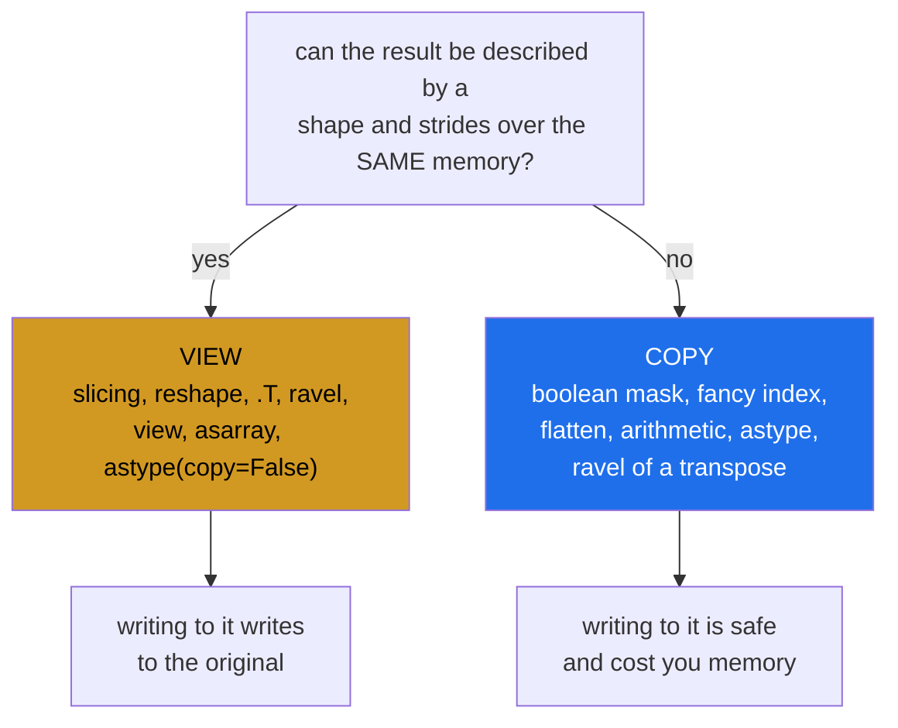

# 1.1 — Sixteen operations, one question — the table for the whole phase

## One-line answer

Every operation you have met in this phase either hands back a **window onto the same memory** or a
**separate copy**, and the whole of `NP-10` is knowing which — because writing to a window changes
something you did not name.

---

## The story

Somebody keeps the month of step counts on squared paper, and their flatmate wants to work on last week.

There are two ways to hand it over. Slide the paper across and point at the last row — now both of them
are looking at the same piece of paper, and if the flatmate crosses a number out, it is crossed out for
everybody. Or photocopy that row and hand over the copy, in which case the flatmate can scribble on it
freely and the original is untouched.

Both are reasonable. What is not reasonable is not knowing which one happened, and that is the whole
situation with NumPy: some operations slide the paper across and some photocopy, and nothing about how
they are written says which.

Day 21 established that a slice slides the paper across. Day 22 added that reshaping and transposing do
too. This day is the point where all of it becomes one table you can answer from.

---

## The idea in plain language

A **view** is a second array object that reads and writes the **same memory** as the first. It has its own
shape and strides ([Day 20, 1.3](../../../day-20-arrays-and-dtypes/parts/01-the-block/1.3-one-block-and-strides.md)),
and no values of its own. Writing to it writes to the original.

A **copy** is a second array with its own memory, filled with the same values. Writing to it changes
nothing else.

You have met both repeatedly:

- Day 21 showed that basic slicing gives a view and boolean or fancy indexing gives a copy
  ([Day 21, 4.3](../../../day-21-indexing-and-views/parts/04-fancy-indexing/4.3-fancy-indexing-always-copies.md)).
- Day 22 showed that reshape and transpose give views, and that `ravel` gives a view while `flatten` gives
  a copy ([Day 22, 2.4](../../../day-22-broadcasting-and-shape/parts/02-reshape/2.4-ravel-and-flatten.md)).
- Day 23 showed that `np.sort` copies and `.sort()` does not
  ([Day 23, 3.1](../../../day-23-ufuncs-and-statistics/parts/03-sorting-and-searching/3.1-sort-and-the-copy.md)).

This document does not add a new mechanism. It puts the whole phase in one place and turns it into a rule
you can apply to an operation you have not met, which is what a gate day is for.

The rule underneath all of it is one sentence:

> **If NumPy can describe the result with a shape and strides over the existing memory, it gives you a
> view. If it cannot, it has to copy.**

That explains every row of the table. A slice can be described by strides, so it is a view. Picking out
the elements where a mask is `True` cannot — the surviving elements are not evenly spaced — so it must
copy. Transposing is a stride rearrangement, so it is a view. Flattening a transposed array asks for
elements in an order no single stride can produce, so it copies.

Two entries in the table are worth flagging in advance because they surprise people.

**`np.asarray(x)` on an array that already has the right dtype returns the very same object.** Not a view
of it — literally `x`. So it shares memory with itself, and the probes that ask about provenance say it
owns its data, because it does.

**`x.astype(dtype, copy=False)` may return the same object too**, when the dtype already matches. The
default is `copy=True`, which always allocates, and the `copy=False` form is a request rather than a
promise.

Both of those are correct, useful behaviour, and both mean that a function returning "an array" may be
returning **its own argument**.

---

## Why Setu needs it

- **[1.2](1.2-the-three-probes.md) through [1.5](1.5-the-api-contract.md)** are about how to check this,
  how to enforce it and how to declare it in a signature.
- **[2.1](../02-the-bug/2.1-ravel-changed-it-flatten-did-not.md)** is the plan's named example for `NP-10`,
  and it is one row of this table becoming a bug.
- **[3.4](../03-the-module/3.4-the-boundary-that-decides.md)** is the gate module's copy-or-view boundary,
  which is a decision this table makes possible.
- **Day 26 onwards**, pandas has the same distinction with a different vocabulary and a
  `SettingWithCopyWarning` that exists entirely because of it — and Copy-on-Write, which pandas 3.0 makes
  the default, is the library deciding to remove the ambiguity.
- **Day 125 onwards**, an in-place operation on a tensor that something else is holding a view of is one
  of the standard ways a gradient silently becomes wrong.

---

## The mechanism

Every operation in the phase, asked the same question:

```python
import numpy as np

month = np.array(
    [
        [8213.0, 10442.0, 6180.0, 9000.0, 12007.0, 9631.0, 7204.0],
        [7788.0, 9120.0, 11345.0, 8402.0, 6733.0, 14210.0, 5096.0],
        [9004.0, 8765.0, 7621.0, 10188.0, 9950.0, 8317.0, 11002.0],
        [6540.0, 12488.0, 9873.0, 7106.0, 8899.0, 10540.0, 9218.0],
    ]
)

operations = [
    ("month[0]", lambda a: a[0]),
    ("month[:, 2]", lambda a: a[:, 2]),
    ("month[::2]", lambda a: a[::2]),
    ("month.reshape(7, 4)", lambda a: a.reshape(7, 4)),
    ("month.T", lambda a: a.T),
    ("month.ravel()", lambda a: a.ravel()),
    ("month.T.ravel()", lambda a: a.T.ravel()),
    ("month.flatten()", lambda a: a.flatten()),
    ("month[month > 9000]", lambda a: a[a > 9000]),
    ("month[[0, 2]]", lambda a: a[[0, 2]]),
    ("month + 0", lambda a: a + 0),
    ("month.astype(np.float64)", lambda a: a.astype(np.float64)),
    ("month.astype(np.float64, copy=False)", lambda a: a.astype(np.float64, copy=False)),
    ("month.view()", lambda a: a.view()),
    ("np.asarray(month)", lambda a: np.asarray(a)),
    ("np.array(month)", lambda a: np.array(a)),
]

for name, operation in operations:
    result = operation(month)
    verdict = "VIEW " if np.shares_memory(result, month) else "COPY "
    print(f"  {verdict} {name}")
```

**Line by line:**

- The list of `(name, lambda)` pairs — every operation stored with its own label, so the output is a table
  rather than sixteen unlabelled booleans. Building it this way also means adding an operation is one line.
- `month` built with `np.array([...])` from literals — so it **owns its memory**, `base` is `None` and
  `owndata` is `True`. That matters more than it looks: if `month` were itself a view, every row of the
  table would be reporting on a chain rather than on one operation
  ([1.2](1.2-the-three-probes.md)).
- `np.shares_memory(result, month)` as the verdict — **the exact test**, and the one this whole document
  is defined in terms of ([1.2](1.2-the-three-probes.md)).
- `month[0]`, `month[:, 2]`, `month[::2]` — basic slicing, all views, including the strided one. A step of
  2 is still a stride ([Day 21, 1.5](../../../day-21-indexing-and-views/parts/01-one-element/1.5-the-step-and-the-reverse.md)).
- `month.reshape(7, 4)` and `month.T` — views, because both are a new shape and strides over the same block
  ([Day 22, 2.1](../../../day-22-broadcasting-and-shape/parts/02-reshape/2.1-same-block-new-shape.md)).
- `month.ravel()` against `month.T.ravel()` — **the same call, two answers**. The first is a view; the
  second copies, because reading a transposed array in flat order is not something a single stride can
  express ([Day 22, 2.4](../../../day-22-broadcasting-and-shape/parts/02-reshape/2.4-ravel-and-flatten.md)).
- `month.flatten()` — always a copy, which is the whole difference between it and `ravel`.
- `month[month > 9000]` and `month[[0, 2]]` — boolean and fancy indexing, both copies, because the selected
  elements are not evenly spaced
  ([Day 21, 4.3](../../../day-21-indexing-and-views/parts/04-fancy-indexing/4.3-fancy-indexing-always-copies.md)).
- `month + 0` — a copy, because arithmetic allocates a new array
  ([Day 23, 1.2](../../../day-23-ufuncs-and-statistics/parts/01-ufuncs/1.2-out-and-the-temporaries.md)).
  Adding zero changes nothing and still costs a full allocation.
- `astype(np.float64)` against `astype(np.float64, copy=False)` — copy and view respectively, for an array
  that is **already** `float64`. The keyword is the entire difference.
- `np.asarray(month)` against `np.array(month)` — **the pair worth memorising**. `asarray` returns the
  input unchanged when it can; `array` always copies. That is the difference between a function that
  quietly hands your caller's array back and one that does not.

```text
  VIEW  month[0]
  VIEW  month[:, 2]
  VIEW  month[::2]
  VIEW  month.reshape(7, 4)
  VIEW  month.T
  VIEW  month.ravel()
  COPY  month.T.ravel()
  COPY  month.flatten()
  COPY  month[month > 9000]
  COPY  month[[0, 2]]
  COPY  month + 0
  COPY  month.astype(np.float64)
  VIEW  month.astype(np.float64, copy=False)
  VIEW  month.view()
  VIEW  np.asarray(month)
  COPY  np.array(month)
```

The rule, applied:



Note that neither box is the good one. A view is cheap and dangerous; a copy is safe and costs memory. The
whole of `NP-10` is choosing deliberately rather than discovering which you got.

Now the two entries that surprise people, on their own:

```python
import numpy as np

month = np.array([[8213.0, 10442.0], [6180.0, 9000.0]])

same = np.asarray(month)
fresh = np.array(month)
kept = month.astype(np.float64, copy=False)
made = month.astype(np.float64)

print("asarray is the same object     :", same is month)
print("array   is the same object     :", fresh is month)
print("astype(copy=False) same object :", kept is month)
print("astype()           same object :", made is month)
print()
print("asarray shares memory          :", np.shares_memory(same, month))
print("array   shares memory          :", np.shares_memory(fresh, month))
print()
same[0, 0] = -1.0
print("wrote through asarray, month is:", month[0, 0])
```

**Line by line:**

- `same is month` — `True`. **`np.asarray` did not make a view; it returned the argument.** That is the
  documented behaviour when the input is already an array of the right dtype, and it is why `asarray` is
  the standard way to accept "an array or something array-like" without paying for a copy.
- `fresh is month` — `False`, and it does not share memory either. `np.array` always copies unless told
  otherwise, which is why it is the right call when you need to own the result.
- `kept is month` — `True` as well. `copy=False` says "do not copy **if you do not have to**", and with a
  matching dtype it does not have to.
- `made is month` — `False`. The default `copy=True` allocates even when the dtype already matches, which
  is a real cost people pay by habit in loading code.
- `same[0, 0] = -1.0` then printing `month[0, 0]` — **the consequence**. A function that did
  `arr = np.asarray(arr)` and then wrote into `arr` has written into its caller's array, and the `asarray`
  call is what made it look safe.

```text
asarray is the same object     : True
array   is the same object     : False
astype(copy=False) same object : True
astype()           same object : False

asarray shares memory          : True
array   shares memory          : False

wrote through asarray, month is: -1.0
```

---

## When it breaks

**A function that wrote through `asarray`:**

```text
$ uv run python -c "
import numpy as np

def scale_to_thousands(counts):
    counts = np.asarray(counts, dtype=np.float64)
    counts /= 1000.0
    return counts

month = np.array([[8213.0, 10442.0], [6180.0, 9000.0]])
print('before :', month)
result = scale_to_thousands(month)
print('after  :', month)
print('same?  :', result is month)
"
before : [[ 8213. 10442.]
 [ 6180.  9000.]]
after  : [[ 8.213 10.442]
 [ 6.18   9.   ]]
same?  : True
```

**What it means.** The `np.asarray` line looks like a defensive conversion and is the opposite of one: it
returned the caller's array, and `/=` then modified it in place
([Day 23, 1.2](../../../day-23-ufuncs-and-statistics/parts/01-ufuncs/1.2-out-and-the-temporaries.md)). The
caller's month is now in thousands, permanently, and the function returned successfully. **This is the
most common way `asarray` causes damage**, and the fix is either `np.array(counts, dtype=np.float64)` to
own the result or `counts = counts / 1000.0` to allocate a new one.

**A view outliving the array it points into:**

```text
$ uv run python -c "
import numpy as np
def first_week(path_bytes):
    whole = np.frombuffer(path_bytes, dtype=np.float64)
    return whole[:7]

payload = np.arange(2_000_000, dtype=np.float64).tobytes()
week = first_week(payload)
print('week size    :', week.size, 'values')
print('week nbytes  :', week.nbytes)
print('base nbytes  :', week.base.nbytes if week.base is not None else None)
print('kept alive   :', week.base is not None)
"
week size    : 7 values
week nbytes  : 56
base nbytes  : 16000000
kept alive   : True
```

**What it means.** Seven values are being used and sixteen megabytes are being kept alive, because a view
holds a reference to the array it points into and that array cannot be freed while the view exists
([Day 21, 5.1](../../../day-21-indexing-and-views/parts/05-in-anger/5.1-the-leak-a-view-causes.md)). Do
that once per request in a service and the memory climbs steadily with no single large allocation to blame.
The fix is `.copy()` on the way out, which costs 56 bytes and releases the rest.

**A view of a read-only buffer:**

```text
$ uv run python -c "
import numpy as np
payload = np.arange(10, dtype=np.float64).tobytes()
view = np.frombuffer(payload, dtype=np.float64)
print('shares with buffer:', view.flags.owndata is False)
print('writeable         :', view.flags.writeable)
view[0] = 1.0
"
shares with buffer: True
writeable         : False
Traceback (most recent call last):
  File "<string>", line 7, in <module>
ValueError: assignment destination is read-only
```

**What it means.** `bytes` objects are immutable in Python, so NumPy marks any array viewing one as
read-only rather than letting you break that promise. The error is a **good** outcome and it is the
mechanism [1.3](1.3-writeable-the-flag.md) turns into a deliberate tool: marking an array read-only is how
you make an accidental write raise instead of corrupting.

---

## In production

**What a professional writes instead of the teaching version.** The conversion at a boundary says which of
the two it is doing:

```python
from __future__ import annotations

import numpy as np


def as_owned(values: np.ndarray, dtype: np.dtype = np.dtype(np.float64)) -> np.ndarray:
    """A float array this function owns and may modify.

    np.array copies unconditionally, unlike np.asarray, which returns the caller's own
    array when the dtype already matches. Use this when the result will be written to.
    """
    return np.array(values, dtype=dtype, copy=True)


def as_readable(values: np.ndarray, dtype: np.dtype = np.dtype(np.float64)) -> np.ndarray:
    """A float array this function will only read.

    May be the caller's own array. Cheap, and it must never be written to - see as_owned.
    """
    return np.asarray(values, dtype=dtype)
```

**Line by line:**

- **Two functions rather than one with a flag** — the name says the intent at every call site, and a
  reviewer can see which one a function used without reading its body.
- `copy=True` written out in `as_owned` even though it is the default — the whole point of the function is
  that it copies, and stating it means a future "optimisation" to `copy=False` has to argue with the
  keyword rather than with a default.
- The docstrings naming the **other** function — each says what the other is for, which is the only way a
  reader arriving at one of them learns the pair exists.
- `as_readable`'s docstring saying "must never be written to" — an unenforceable promise, which is exactly
  why [1.3](1.3-writeable-the-flag.md) exists as the enforceable version.
- `dtype` as an argument with a default rather than hard-coded — both functions are conversions, and the
  target type is the caller's business.

**What changes at scale.** The choice stops being stylistic and becomes the memory budget. `np.asarray` on
a 4 GB array costs nothing; `np.array` costs 4 GB, and a loading pipeline that converts defensively at
four boundaries has peaked at 20 GB for a 4 GB dataset. That is the real reason `asarray` exists and the
real reason it is dangerous: the cheap option is the one that aliases. Two habits follow at size. Convert
**once**, at the outermost boundary, and pass the owned array inward — every inner function then uses
`asarray` and reads. And when a large array must be handed to code you do not control, hand it a
**read-only view** ([1.3](1.3-writeable-the-flag.md)) rather than a copy: it costs nothing and turns any
write into an exception rather than into corruption.

**The failure that only appears with real data.** A preprocessing function normalised a feature column
with `col = np.asarray(col, dtype=np.float64); col /= col.max()`. In testing it was always handed a fresh
column from a CSV reader, which returned `float64`, so `asarray` returned the caller's array — and the
caller was a fresh object nobody else held. In production the same function was called twice on the same
cached column. The second call divided the already-normalised column by its own maximum of 1.0, which
happened to be a no-op, so it went unnoticed. Then a third caller was added that used the column before
normalisation, and got values between 0 and 1 where it expected raw counts.

**The review comment a senior engineer leaves.** *"`np.asarray(x)` followed by `x /= something` modifies
the caller's array — `asarray` returns the input itself when the dtype matches, it does not copy. Use
`np.array(..., copy=True)` if this function owns the result, or write `x = x / something` to allocate."*

**The interview question.** *"Which NumPy operations return a view and which return a copy?"* The rule is
one sentence: if the result can be described by a shape and strides over the same memory, it is a view;
otherwise it has to copy. So basic slicing, reshape, transpose, `ravel` and `.view()` are views, while
boolean masks, fancy indexing, `flatten`, arithmetic and `astype` copy — and `ravel` on a transposed array
copies, because the order it needs cannot be expressed as a stride. The two that catch people are
`np.asarray`, which returns the **caller's own array** when the dtype already matches rather than a copy of
it, and `astype(copy=False)`, which does the same — so a function doing `x = np.asarray(x)` and then
writing into `x` has modified its caller's data. Neither view nor copy is the good option: a view is free
and aliases, a copy is safe and costs memory, and the point is to choose rather than to discover.

---

## Check yourself

```bash
uv run python -c "
import numpy as np
month = np.array([[8213., 10442.], [6180., 9000.]])
for name, out in [
    ('month[0]', month[0]),
    ('month.T', month.T),
    ('month.ravel()', month.ravel()),
    ('month.T.ravel()', month.T.ravel()),
    ('month.flatten()', month.flatten()),
    ('month[month > 9000]', month[month > 9000]),
    ('month + 0', month + 0),
    ('np.asarray(month)', np.asarray(month)),
    ('np.array(month)', np.array(month)),
]:
    print(f'  {\"VIEW\" if np.shares_memory(out, month) else \"COPY\"}  {name}')
print('asarray is the same object:', np.asarray(month) is month)
"
```

Two of those lines involve `ravel` and give different answers. Say what is different about the second one,
using the word "strides".

**Answer out loud, without scrolling up:**

> Give the one-sentence rule that decides view or copy. Then say what `np.asarray` returns when handed an
> array that already has the right dtype, and why that is dangerous in a function that writes.

---

**Next:** [1.2 — the three probes, and which one is exact](1.2-the-three-probes.md).
