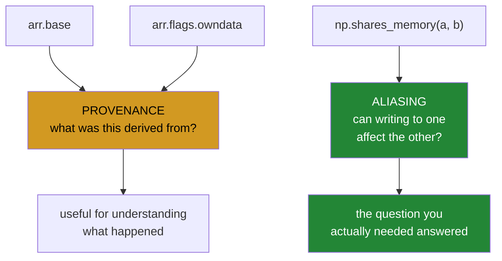

# 1.2 — The three probes — and which one actually answers the question

## One-line answer

`base`, `flags.owndata` and `np.shares_memory` look like three ways to ask the same thing and are not:
the first two describe where an array **came from** and only the third answers whether two arrays can
**affect each other**.

---

## The story

Two people are looking at a page of step counts and want to know whether they are looking at the same
page or at two photocopies.

The obvious way to check is to ask each of them where they got it. "I was handed this by somebody" is a
good sign it might be shared; "I made this one myself" is a good sign it is not.

That works most of the time and it is not the question. The question is whether crossing something out on
one page changes the other, and the way to answer *that* is to hold the two pages up and see whether they
are physically the same sheet.

The difference matters in one specific case, and it is the case that catches people: somebody hands you a
page and you say "thanks, I made a copy" — and then hand back the original by mistake. Asked where they
got it, they will say they made it themselves, because they believe they did.

---

## The idea in plain language

There are three ways to interrogate an array about this, and they answer different questions.

**`arr.base`** is the array this one was derived from, or `None` if it was not derived from anything. It
is a question about **provenance**: where did this come from?

**`arr.flags.owndata`** says whether this array allocated its own memory. Also provenance, asked the other
way round.

**`np.shares_memory(a, b)`** says whether the two arrays' memory actually overlaps. This is a question
about **aliasing**: can writing to one affect the other?

For most of the table in [1.1](1.1-six-operations-one-question.md) the three agree, which is why people
treat them as interchangeable. A slice has a `base`, does not own its data, and shares memory. A copy has
no `base`, owns its data, and does not share.

They come apart in two situations, and both are common enough to matter.

**When an operation returns its own argument.** `np.asarray(x)` on an array of the right dtype returns
`x` itself ([1.1](1.1-six-operations-one-question.md)). Ask that result where it came from and it answers
truthfully: it allocated its own memory, and it has no base — because it *is* the original. So both
provenance probes say "independent array" about two names for one object, while `shares_memory` correctly
says they overlap.

**When the chain is longer than one step.** `month[::2][:, 1:]` has a `base`, and NumPy usually collapses
the chain so that `base` is the original array rather than the intermediate — but that collapsing is an
implementation detail, not a promise. Writing `result.base is original` as a test is depending on
something NumPy is free to change, and it will read as `False` the moment a chain is not collapsed.

So the rule is short:

> **Use `np.shares_memory` to answer "can these affect each other". Use `base` and `owndata` to understand
> what happened, never to decide behaviour.**

There is a second function worth knowing and one argument that goes with it.

`np.may_share_memory(a, b)` is the **cheap, conservative** version. It compares the memory ranges the two
arrays occupy and says `True` if they overlap at all — even when, because of strides, no individual
element is shared. It is fast and it gives false alarms.

`np.shares_memory` is **exact**. Deciding whether two strided arrays share any element is a genuinely
hard problem in general — NumPy's documentation describes it as NP-complete
(<https://numpy.org/doc/stable/reference/generated/numpy.shares_memory.html>) — and the `max_work=`
argument bounds the effort, raising `numpy.exceptions.TooHardError` rather than running unbounded. In
practice the hard cases have to be constructed on purpose: the awkward three-dimensional pair in the
failure section below is answered correctly with a budget of one. Knowing the argument exists is what
stops a surprise; needing it is rare.

---

## Why Setu needs it

- **[1.3](1.3-writeable-the-flag.md)** is how to make an accidental write raise, and it is only reachable
  once you can tell whether a write would be accidental.
- **[1.4](1.4-out-and-aliasing.md)** is about arrays overlapping **within one call**, which is exactly
  `shares_memory`'s question.
- **[5.1](../05-the-gate/5.1-the-eval.md)** asserts the module's copy-or-view promises, and every one of
  those assertions is a `shares_memory` call.
- **Day 21's introduction** used `base` and `shares_memory` together
  ([Day 21, 2.2](../../../day-21-indexing-and-views/parts/02-the-view-trap/2.2-how-to-tell-base-and-shares-memory.md));
  this is where the difference between them becomes a rule.
- **Day 155's retrieval** hands slices of a large embedding matrix to scoring code, and whether those
  slices alias the index is the difference between a safe optimisation and a corrupted store.

---

## The mechanism

The case where the three disagree:

```python
import numpy as np

month = np.array(
    [
        [8213.0, 10442.0, 6180.0, 9000.0, 12007.0, 9631.0, 7204.0],
        [7788.0, 9120.0, 11345.0, 8402.0, 6733.0, 14210.0, 5096.0],
        [9004.0, 8765.0, 7621.0, 10188.0, 9950.0, 8317.0, 11002.0],
        [6540.0, 12488.0, 9873.0, 7106.0, 8899.0, 10540.0, 9218.0],
    ]
)

print("month owns its data        :", month.flags.owndata, " base is None:", month.base is None)
print()

same = np.asarray(month)
print("np.asarray(month) is month :", same is month)
print("  shares_memory            :", np.shares_memory(same, month))
print("  base is None             :", same.base is None)
print("  owndata                  :", same.flags.owndata)
print("  -> both provenance probes say INDEPENDENT, and it is the same object")
print()

row = month[0]
print("month[0].base is month     :", row.base is month)
print("  shares_memory            :", np.shares_memory(row, month))
print()

chain = month[::2][:, 1:]
print("chained slice:")
print("  base is month            :", chain.base is month)
print("  base.base is month       :", chain.base.base is month if chain.base is not None else None)
print("  shares_memory            :", np.shares_memory(chain, month))
```

**Line by line:**

- `month.flags.owndata` and `month.base is None` printed **first** — establishing that `month` itself owns
  its memory. Without that, every line below would be describing a chain, and this is the single easiest
  way to get confused about `base`.
- `np.asarray(month) is month` — `True`. **The same object**, not a view of it
  ([1.1](1.1-six-operations-one-question.md)).
- `same.base is None` and `same.flags.owndata` — `True` and `True`. Both provenance probes report an
  independent array that allocated its own memory, and both are **correct**: it is `month`, and `month` did
  allocate its own memory. The probes are not lying; they are answering a different question.
- `np.shares_memory(same, month)` — `True`, which is the answer anybody asking actually wanted. **This is
  the whole document in three lines of output.**
- `row.base is month` — `True` here, because `month` owns its data and a single slice's base is the array
  it sliced.
- `chain.base is month` — also `True`, because NumPy collapsed the two-step chain. `chain.base.base is
  month` is `False`, because there is no second level to walk. **Both of those are implementation
  details**, and code that depends on either is depending on something that is free to change.
- Every `shares_memory` line is `True` throughout, whatever the provenance probes said. That consistency
  is the reason to use it.

```text
month owns its data        : True  base is None: True

np.asarray(month) is month : True
  shares_memory            : True
  base is None             : True
  owndata                  : True
  -> both provenance probes say INDEPENDENT, and it is the same object

month[0].base is month     : True
  shares_memory            : True

chained slice:
  base is month            : True
  base.base is month       : False
  shares_memory            : True
```

What each probe is actually asking:



Now the cheap probe and the exact one:

```python
import numpy as np

month = np.arange(28, dtype=np.float64)

left = month[:12]
right = month[16:]
odds = month[1::2]
evens = month[0::2]

print("left and right, exact  :", np.shares_memory(left, right))
print("left and right, cheap  :", np.may_share_memory(left, right))
print()
print("odds and evens, exact  :", np.shares_memory(odds, evens))
print("odds and evens, cheap  :", np.may_share_memory(odds, evens))
print()
big = np.arange(1_000_000)
x, y = big[::3], big[1::3]
print("strided pair, exact    :", np.shares_memory(x, y))
print("strided pair, cheap    :", np.may_share_memory(x, y))
print("bounded to 10 units    :", np.shares_memory(x, y, max_work=10))
```

**Line by line:**

- `left = month[:12]` and `right = month[16:]` — two slices that genuinely do not overlap, with a gap
  between them. Both probes agree: `False`.
- `odds` and `evens` — **the interesting pair**. They cover the same range of memory and share no single
  element, because one takes the odd positions and the other the even ones. `shares_memory` works that out
  and says `False`; `may_share_memory` looks at the address ranges, sees them overlapping, and says `True`.
- **That `True` is a false alarm and it is deliberate.** `may_share_memory` is allowed to over-report and
  never under-reports, which makes it safe as a cheap pre-check and useless as a decision.
- `big[::3]` and `big[1::3]` — the same situation on a million elements, where the exact answer takes real
  work to compute. `shares_memory` still gets it right.
- `max_work=10` — the effort bound. Here the answer is reachable within it, so it returns `False` rather
  than raising. **On a harder pair it would raise `np.exceptions.TooHardError`**, which is the honest
  outcome: NumPy telling you it cannot answer cheaply rather than either guessing or hanging.

```text
left and right, exact  : False
left and right, cheap  : False

odds and evens, exact  : False
odds and evens, cheap  : True

strided pair, exact    : False
strided pair, cheap    : True
bounded to 10 units    : False
```

---

## When it breaks

**A test written against `base`:**

```text
$ uv run python -c "
import numpy as np
month = np.arange(28, dtype=np.float64).reshape(4, 7)
row = month[0]
print('month itself owns data :', month.flags.owndata)
print('month.base is None     :', month.base is None)
print('row.base is month      :', row.base is month)
print('row shares with month  :', np.shares_memory(row, month))
"
month itself owns data : False
month.base is None     : False
row.base is month      : False
row shares with month  : True
```

**What it means.** `month` here was built with `np.arange(28).reshape(4, 7)`, so **`month` is itself a
view** of the `arange` result. Its `base` is that intermediate array, and `row.base` points at the same
intermediate rather than at `month`. So `row.base is month` is `False` while the two demonstrably share
memory. A test asserting `result.base is original` passes when the original happens to own its data and
fails when it does not — and whether it does depends on how the caller built it, which is not something a
function can control. **`shares_memory` is `True` in both cases**, which is why it is the assertion to
write.

**`may_share_memory` used as a decision:**

```text
$ uv run python -c "
import numpy as np
data = np.arange(20, dtype=np.float64)
odds, evens = data[1::2], data[0::2]
if np.may_share_memory(odds, evens):
    print('refusing: these overlap')
else:
    print('safe to write')
print('do they really overlap?', np.shares_memory(odds, evens))
"
refusing: these overlap
do they really overlap? False
```

**What it means.** The guard refused a perfectly safe operation. `may_share_memory` compares address ranges
and cannot see that the strides interleave, so it over-reports — which is correct for its purpose and wrong
as a decision. Used this way it makes a function reject valid input, and the symptom is a defensive copy
being taken every time on data that never needed it. **Use it as a cheap pre-check before the exact one**,
never on its own.

**The exact probe on deliberately awkward input:**

```text
$ uv run python -c "
import numpy as np
a = np.arange(10**6)
x = a.reshape(100, 100, 100)[::3, ::5, ::7]
y = a.reshape(100, 100, 100)[1::3, 2::5, 3::7]
print('cheap :', np.may_share_memory(x, y))
for w in [1, 5, 50]:
    try:
        print(f'max_work={w:<3}:', np.shares_memory(x, y, max_work=w))
    except Exception as e:
        print(f'max_work={w:<3}:', type(e).__name__, ':', e)
print('exact :', np.shares_memory(x, y))
"
cheap : True
max_work=1  : False
max_work=5  : False
max_work=50 : False
exact : False
```

**What it means.** Two three-dimensional views with different strides in every axis, which is about as
awkward as this question gets in practice — and NumPy answered it correctly with a budget of **one** unit
of work. That is the useful finding: on anything you are likely to write, the exact test is cheap, and
`may_share_memory`'s `True` is a false alarm the exact test clears up immediately.

`max_work=` is still worth knowing about. NumPy's documentation for `shares_memory`
(<https://numpy.org/doc/stable/reference/generated/numpy.shares_memory.html>) describes the general
problem as NP-complete and states that exceeding the bound raises `numpy.exceptions.TooHardError` rather
than returning a guess. Reaching that takes an adversarially constructed pair rather than an unlucky one,
so **treat the argument as a safety valve for a hot loop, not as something you will meet by accident** —
and if it ever does fire, the correct fallback is to assume the arrays might overlap and copy.

---

## In production

**What a professional writes instead of the teaching version.** The aliasing question gets a name, and the
provenance probes are used only for the message:

```python
from __future__ import annotations

import numpy as np


def assert_independent(result: np.ndarray, source: np.ndarray, *, what: str) -> None:
    """Raise unless ``result`` can be written to without affecting ``source``.

    Uses np.shares_memory, not `base` or `owndata`: those describe where an array came
    from, and both report "independent" for np.asarray's return value, which is the
    caller's own array.
    """
    if np.shares_memory(result, source):
        raise AssertionError(
            f"{what} returned a view of its input: writing to it would change the "
            f"caller's array (result.base is None: {result.base is None}, "
            f"owndata: {result.flags.owndata})"
        )


def defensive_copy_if_shared(values: np.ndarray, other: np.ndarray) -> np.ndarray:
    """A version of ``values`` that is safe to write to, copying only if it has to."""
    if not np.may_share_memory(values, other):
        return values  # cheap check settled it; no exact test needed
    if not np.shares_memory(values, other):
        return values  # the cheap check over-reported
    return values.copy()
```

**Line by line:**

- `assert_independent` taking `what` — a message saying which function broke its promise is worth more than
  a generic assertion, and the caller is the only one who knows the name.
- `np.shares_memory` as the **condition** and `base`/`owndata` in the **message** — exactly the division
  this document argues for. The decision uses the exact probe; the diagnostics use the provenance ones,
  because they are what a reader needs to understand *how* the view came about.
- `defensive_copy_if_shared` calling the cheap probe **first** — `may_share_memory` never under-reports, so
  a `False` from it is conclusive and costs almost nothing. That short-circuit is the whole reason the
  cheap probe exists.
- The second check only reached when the cheap one said `True` — this is the over-report from the second
  failure block, caught rather than acted on, so an interleaved pair does not get a pointless copy.
- `values.copy()` only at the end — one allocation, taken only when both probes agree there is real
  overlap.
- The two comments on the early returns explaining **which** check settled it — this function is three
  branches and the reason for each is not obvious from the code alone.

**What changes at scale.** `np.shares_memory` on ordinary slices is effectively free, and its worst case is
genuinely hard, so on a hot path the pattern above matters: cheap probe first, exact probe only when the
cheap one fires, and a `max_work=` bound if the arrays are heavily strided. The bigger scale effect is what
you do with the answer. Copying defensively at every boundary is safe and turns a 4 GB array into 8 or 12;
the alternative is to establish ownership **once** at the outermost boundary and pass read-only views
inward ([1.3](1.3-writeable-the-flag.md)), which costs nothing and makes the rule enforceable rather than
documented. The third thing that changes is that `base` starts keeping large arrays alive: a small view
returned from a function holds its entire source in memory
([Day 21, 5.1](../../../day-21-indexing-and-views/parts/05-in-anger/5.1-the-leak-a-view-causes.md)), so at
size the provenance probes stop being merely diagnostic and become the thing you check when memory climbs
with no obvious allocation.

**The failure that only appears with real data.** A caching layer asserted that its returned arrays were
copies by checking `result.base is None`. It passed for two years. Then an upstream loader changed from
building arrays with `np.array(...)` to `np.frombuffer(...).reshape(...)`, which makes every array a view
of a buffer — so `base` was no longer `None` for anything, the assertion started failing on correct code,
and it was deleted as a false alarm. Six weeks later a genuine aliasing bug shipped through the gap the
deleted assertion had been covering.

**The review comment a senior engineer leaves.** *"`assert out.base is None` — that tests where the array
came from, not whether it aliases the input, and it fails whenever the caller's array is itself a view.
Use `np.shares_memory(out, inp)`; keep `base` in the failure message, where it is genuinely useful."*

**The interview question.** *"How do you check whether two NumPy arrays share memory?"* `np.shares_memory`,
which is the exact test. Not `arr.base` and not `flags.owndata` — those describe provenance, where the
array came from, and they disagree with the aliasing question in two common cases: `np.asarray` returns the
caller's own array, which correctly reports that it owns its data and has no base while sharing memory with
itself; and `base` chains get collapsed in a way that is an implementation detail, so `result.base is
original` is `False` whenever the original was itself a view. There is also `np.may_share_memory`, which is
the cheap conservative version — it compares address ranges, never under-reports, and over-reports for
interleaved strides, so it is a good short-circuit before the exact test and a bad decision on its own. The
detail worth adding is `max_work=`: the exact test is genuinely hard for heavily strided arrays and will
raise `TooHardError` rather than run unbounded, which is what you want on a hot path.

---

## Check yourself

```bash
uv run python -c "
import numpy as np
owned = np.array([[1.0, 2.0], [3.0, 4.0]])
derived = np.arange(4, dtype=np.float64).reshape(2, 2)
for name, arr in [('owned', owned), ('derived', derived)]:
    row = arr[0]
    print(f'{name:8s} owndata={arr.flags.owndata!s:5s} base_is_None={arr.base is None!s:5s} '
          f'| row.base is arr: {row.base is arr!s:5s} shares: {np.shares_memory(row, arr)}')
same = np.asarray(owned)
print('asarray  is the same object:', same is owned)
print('  base is None             :', same.base is None, ' owndata:', same.flags.owndata)
print('  shares_memory            :', np.shares_memory(same, owned))
d = np.arange(20, dtype=np.float64)
print('odds/evens cheap :', np.may_share_memory(d[1::2], d[0::2]))
print('odds/evens exact :', np.shares_memory(d[1::2], d[0::2]))
"
```

The first two lines differ only in how the array was built, and one of them reports `row.base is arr` as
`False`. Say why, and say which column of that output you would put in a test.

**Answer out loud, without scrolling up:**

> Name the three probes and say what question each answers. Then give the one case where the provenance
> probes say "independent" about two names for the same array.

---

**Next:** [1.3 — `WRITEABLE`, the flag that turns a bug into an error](1.3-writeable-the-flag.md).
