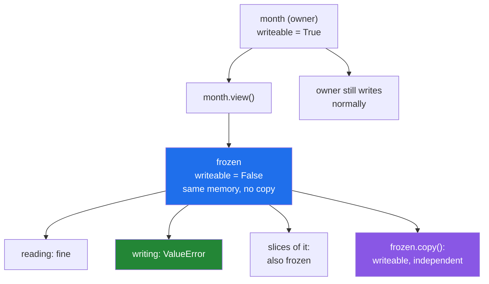

# 1.3 — `WRITEABLE` — the flag that turns a silent bug into an error

## One-line answer

Setting `arr.flags.writeable = False` makes any write through that array raise instead of corrupting
something, which turns the whole copy-versus-view problem from a discipline you have to remember into a
rule the machine enforces.

---

## The story

Somebody hands their flatmate the month of step counts to look at, and says "have a look but do not change
anything".

That works exactly as well as saying it ever does. The flatmate is not malicious and will not deliberately
cross anything out; they will absorb-mindedly correct a number they think is wrong, three weeks later, and
neither of them will connect the two events.

The alternative takes one second: hand over a photocopy printed on the sort of laminated card you cannot
write on. Now "do not change anything" is not a request anybody has to remember. Somebody trying to write
on it discovers immediately, at the moment they try, rather than a fortnight later when the numbers stop
adding up.

The rule did not change. What changed is who is responsible for keeping it.

---

## The idea in plain language

Every NumPy array carries a set of **flags**, and one of them is `WRITEABLE`. When it is `False`, any
attempt to write into that array raises `ValueError` rather than changing anything.

You have already met it without setting it. A broadcast array is read-only
([Day 22, 1.5](../../../day-22-broadcasting-and-shape/parts/01-broadcasting/1.5-no-data-is-copied.md)),
because its stretched axis has a stride of zero and many positions map to the same byte, so a write would
have nowhere sensible to go. An array viewing a `bytes` object is read-only too
([1.1](1.1-six-operations-one-question.md)), because Python's `bytes` are immutable.

What this document adds is that **you can set it yourself**, and doing so is the enforceable version of
every promise the last two documents described.

The pattern is three lines:

```
view = arr.view()
view.flags.writeable = False
return view
```

`arr.view()` gives a new array object over the same memory ([1.1](1.1-six-operations-one-question.md)).
Marking **that** read-only leaves the original writeable, so the owner keeps full access and the recipient
gets a window they cannot break. Setting the flag on `arr` itself would freeze it for everybody, which is
occasionally what you want and usually not.

Three properties make this practical.

**It costs nothing.** No memory is allocated and no values are copied. Returning a frozen view is as cheap
as returning a view, which is the whole reason it beats a defensive copy.

**It is inherited.** A slice of a read-only array is read-only. So freezing once at a boundary protects
everything downstream derives from it, without every derived array having to be frozen individually.

**A copy of it is writeable.** `frozen.copy()` gives an ordinary array somebody can work on. So the flag
does not prevent anybody from doing anything; it makes them **say** they are doing it, which is exactly
the property you want.

One limitation worth knowing. A view you froze yourself can be unfrozen — `view.flags.writeable = True`
works, because the underlying memory is writeable and NumPy will let you take the guard off. It is a guard
rail, not a lock: it stops accidents, not somebody who has decided to. Arrays that are read-only for a
structural reason, like a broadcast one, cannot be unfrozen at all.

---

## Why Setu needs it

- **[1.5](1.5-the-api-contract.md)** is about declaring copy-or-view in a signature, and this is the half
  of that contract the machine can check.
- **[2.3](../02-the-bug/2.3-the-defences.md)** lists the three defences against the day's named bug, and
  this is the cheapest of them.
- **[3.4](../03-the-module/3.4-the-boundary-that-decides.md)** is the gate module's boundary, and it hands
  out frozen views rather than copies.
- **Day 76's pipelines** pass the training split through many transformers, and freezing it is how a
  transformer that fits on the training data is prevented from modifying it.
- **Day 155's vector store** hands slices of its index to scoring code; a frozen view is what makes that
  safe without copying gigabytes per query.

---

## The mechanism

Freezing a view, and what it does and does not stop:

```python
import numpy as np

month = np.array([[8213.0, 10442.0, 6180.0], [7788.0, 9120.0, 11345.0]])

frozen = month.view()
frozen.flags.writeable = False

print("frozen shares memory :", np.shares_memory(frozen, month))
print("frozen writeable     :", frozen.flags.writeable)
print("original writeable   :", month.flags.writeable)
try:
    frozen[0, 0] = 0.0
except ValueError as error:
    print("write through frozen : ValueError:", error)
try:
    frozen += 1
except ValueError as error:
    print("in-place through it  : ValueError:", error)
print("reading is fine      :", frozen.mean())
print("original untouched   :", month[0, 0])
```

**Line by line:**

- `month.view()` — a **new array object** over the same memory. The whole approach depends on this: the
  flag is a property of the array object, not of the memory, so two objects over one block can have
  different flags.
- `frozen.flags.writeable = False` — the guard. One assignment, no allocation.
- `np.shares_memory(frozen, month)` — `True`, confirming it really is a window and not a copy
  ([1.2](1.2-the-three-probes.md)). **A frozen copy would be pointless**; the value here is that it is free.
- `month.flags.writeable` — still `True`. **The owner keeps full access**, which is the difference between
  freezing a view and freezing the array.
- `frozen[0, 0] = 0.0` — `ValueError: assignment destination is read-only`. The write is refused at the
  moment it happens, naming the destination.
- `frozen += 1` — a **different** message: `output array is read-only`. In-place arithmetic goes through
  the ufunc machinery with the array as its output
  ([Day 23, 1.2](../../../day-23-ufuncs-and-statistics/parts/01-ufuncs/1.2-out-and-the-temporaries.md)),
  so the error comes from a different place and says so. Both are worth recognising.
- `frozen.mean()` — reading works normally. The flag restricts writing and nothing else.
- `month[0, 0]` printed last — unchanged. **Two attempted writes, no damage**, which is the entire point.

```text
frozen shares memory : True
frozen writeable     : False
original writeable   : True
write through frozen : ValueError: assignment destination is read-only
in-place through it  : ValueError: output array is read-only
reading is fine      : 8848.0
original untouched   : 8213.0
```

Now the three properties that make it usable:

```python
import numpy as np

month = np.array([[8213.0, 10442.0, 6180.0], [7788.0, 9120.0, 11345.0]])
frozen = month.view()
frozen.flags.writeable = False

sub = frozen[0]
print("slice of a frozen view :", sub.flags.writeable)

working = frozen.copy()
print("copy of it is writeable:", working.flags.writeable)
working[0, 0] = -1.0
print("copy changed, month is :", working[0, 0], month[0, 0])

broadcast = np.broadcast_to(month, (2, 2, 3))
print("broadcast writeable    :", broadcast.flags.writeable)

frozen.flags.writeable = True
print("unfroze the view       :", frozen.flags.writeable)
```

**Line by line:**

- `frozen[0]` — its `writeable` is `False`. **Inheritance**, and it is what makes freezing at a boundary
  worth doing: everything anybody derives from the frozen view is frozen too, without further work
  ([Day 21, 2.1](../../../day-21-indexing-and-views/parts/02-the-view-trap/2.1-a-slice-does-not-copy.md)).
- `frozen.copy()` — writeable, and independent. The escape hatch: somebody who genuinely needs to modify
  the data takes a copy, which is one word and is **visible in their code**.
- `working[0, 0] = -1.0` then printing both — the copy changed and `month` did not, which is the copy doing
  its job.
- `np.broadcast_to(...)` — read-only **without anybody setting the flag**, because a stretched axis has a
  stride of zero and one byte would receive many writes
  ([Day 22, 1.5](../../../day-22-broadcasting-and-shape/parts/01-broadcasting/1.5-no-data-is-copied.md)).
  This is the flag appearing for a structural reason rather than a chosen one.
- `frozen.flags.writeable = True` — **it works**. A view you froze can be unfrozen, because the memory
  underneath is writeable and NumPy permits taking the guard off. This is a guard rail against accidents,
  not a security boundary, and knowing which it is prevents relying on the wrong thing.

```text
slice of a frozen view : False
copy of it is writeable: True
copy changed, month is : -1.0 8213.0
broadcast writeable    : False
unfroze the view       : True
```

What the flag does:



The green box is the point. An exception at the moment of the write is the outcome you want, and it is
what the alternative — a docstring saying "please do not modify this" — cannot give you.

---

## When it breaks

**Freezing the original instead of a view:**

```text
$ uv run python -c "
import numpy as np
month = np.array([[8213.0, 10442.0], [6180.0, 9000.0]])
month.flags.writeable = False
print('month writeable :', month.flags.writeable)
try:
    month[0, 0] = 1.0
except ValueError as e:
    print('owner blocked   : ValueError:', e)
month.flags.writeable = True
print('unfrozen again  :', month.flags.writeable)
"
month writeable : False
owner blocked   : ValueError: assignment destination is read-only
unfrozen again  : True
```

**What it means.** Setting the flag on the array itself locks out **everybody**, including the code that
owns the data and legitimately needs to write to it. That is occasionally what you want — a constant table
loaded once at start-up — and it is not what "hand somebody a safe window" means. **Freeze a view, not the
array**, so the owner keeps its access and only the recipient is constrained.

**Expecting the flag to survive a copy:**

```text
$ uv run python -c "
import numpy as np
month = np.array([[8213.0, 10442.0], [6180.0, 9000.0]])
frozen = month.view()
frozen.flags.writeable = False
onward = frozen.copy()
print('frozen writeable :', frozen.flags.writeable)
print('copy writeable   :', onward.flags.writeable)
print('copy shares      :', np.shares_memory(onward, month))
onward[0, 0] = -1.0
print('wrote to the copy, month is:', month[0, 0])
"
frozen writeable : False
copy writeable   : True
copy shares      : False
wrote to the copy, month is: 8213.0
```

**What it means.** The copy is writeable and does not alias the original, which is **correct and is what
the escape hatch is for** — but it means the flag is not a taint that follows the data around. Anybody
downstream can take a copy and modify that freely, and nothing about the frozen view stops them. That is
the right design: the flag prevents accidental writes to **your** memory, not modification of the values in
general. Expecting more from it than that is where people get disappointed.

**A frozen array reaching a function that writes:**

```text
$ uv run python -c "
import numpy as np
def normalise_in_place(counts):
    counts /= counts.max()
    return counts
month = np.array([[8213.0, 10442.0], [6180.0, 9000.0]])
frozen = month.view()
frozen.flags.writeable = False
normalise_in_place(frozen)
"
Traceback (most recent call last):
  File "<string>", line 8, in <module>
  File "<string>", line 4, in normalise_in_place
ValueError: output array is read-only
```

**What it means. This is the flag working**, and the traceback is exactly what you want: it names the
function and the line that tried to write. Without the frozen view, that function would have quietly
rescaled the caller's month and returned successfully
([1.1](1.1-six-operations-one-question.md)). The cost of getting this protection was one line at the
boundary and no memory at all. **Note the message is `output array is read-only` rather than `assignment
destination`**, because `/=` is a ufunc writing to its output — the same distinction as in the mechanism
section, and worth recognising because it tells you the write came from arithmetic rather than an
assignment.

---

## In production

**What a professional writes instead of the teaching version.** Freezing is a named function used at every
boundary where data leaves the code that owns it:

```python
from __future__ import annotations

import numpy as np


def readonly(values: np.ndarray) -> np.ndarray:
    """A read-only window onto ``values``. Costs nothing; writing through it raises.

    Freezes a VIEW, not the argument, so the owner keeps write access. Slices of the
    result are read-only too, so one call at a boundary protects everything downstream.
    A caller who genuinely needs to modify the data takes .copy(), which is visible.
    """
    view = values.view()
    view.flags.writeable = False
    return view


def require_writeable(values: np.ndarray, *, what: str) -> None:
    """Fail early and clearly when a function that writes is handed a frozen array."""
    if not values.flags.writeable:
        raise ValueError(
            f"{what} writes to its argument, but this array is read-only. It is either "
            f"a frozen view, a broadcast result, or a view of an immutable buffer. "
            f"Pass a copy if the change is intended."
        )
```

**Line by line:**

- `values.view()` before the flag — **the fix for the first failure block**, done once so no call site can
  get it wrong. The docstring says why in its second sentence.
- The docstring's third sentence about `.copy()` — telling the reader the escape hatch exists is what stops
  this being perceived as an obstacle. A guard people work around by disabling it is worse than no guard.
- `require_writeable` as a separate function — the **other** side of the boundary. A function that writes
  in place should check on entry rather than raising from three frames down inside a ufunc, and the message
  it can give is far better than `output array is read-only`.
- The message listing the **three** ways an array ends up read-only — a frozen view, a broadcast result
  ([Day 22, 1.5](../../../day-22-broadcasting-and-shape/parts/01-broadcasting/1.5-no-data-is-copied.md)),
  or a view of an immutable buffer ([1.1](1.1-six-operations-one-question.md)). Somebody hitting this needs
  to know which, and listing them is faster than making them search.
- "Pass a copy if the change is intended" — the message ends with the fix, which is the difference between
  an error that stops work and one that resumes it.
- `what: str` — the caller names itself, because a message saying which function refused is worth more than
  a generic one.

**What changes at scale.** This is one of the few safety measures that gets **cheaper** as the data grows,
because it costs nothing at any size while the alternative — a defensive copy — costs the whole array. On a
4 GB embedding index, handing out frozen views instead of copies is the difference between one copy in
memory and one per consumer. Two further effects. Because the flag is inherited by slices, freezing once at
the outermost boundary covers every derived array downstream, which means the discipline is one line per
**system** rather than one line per function. And under concurrency it becomes more than a convenience: if
several threads read one array and one of them writes, the result is a data race that no amount of testing
finds reliably, and freezing the views handed to readers converts that into an immediate, deterministic
exception in the thread that broke the rule. The limit is worth restating: a frozen view can be unfrozen,
so this stops accidents and is not a security boundary — code you do not trust needs a copy or a different
mechanism entirely.

**The failure that only appears with real data.** A feature store handed each model a slice of a shared
in-memory table, documented as read-only. For a year every model read it. Then one model added a
normalisation step that used `/=` for speed, which modified the shared table, and every model that ran
after it in the same process received pre-normalised features. The scores of the later models degraded by
a few per cent — enough to notice, not enough to look like corruption — and the investigation went to the
models before it went to the store. One `readonly()` at the hand-out point would have raised on the first
run.

**The review comment a senior engineer leaves.** *"This returns a slice of the shared table, so any caller
can write into our cache. Wrap it in `readonly()` — it costs nothing and turns a silent corruption into a
`ValueError` in the caller that did it. And please do not freeze the table itself; the loader needs to
write to it."*

**The interview question.** *"How do you stop a caller modifying an array you handed them?"* Take a view,
set `view.flags.writeable = False`, and return that. It costs nothing — no allocation, no copy — and any
write through it raises `ValueError` at the moment it happens rather than corrupting your data silently.
The properties that make it practical: the flag is inherited, so slices of the frozen view are frozen too
and one call at a boundary covers everything downstream; and `.copy()` of it is writeable, so a caller who
genuinely needs to modify the data can, but has to say so in their code. Freeze a **view**, not the array
itself, or the owner loses write access too. The details worth adding: `arr[i] = x` and `arr += 1` give
different messages — `assignment destination is read-only` against `output array is read-only` — because
the second goes through the ufunc machinery; broadcast results and views of `bytes` objects are read-only
for structural reasons without anybody setting the flag; and a view you froze can be unfrozen, so it is a
guard rail against accidents rather than a security boundary.

---

## Check yourself

```bash
uv run python -c "
import numpy as np
month = np.array([[8213., 10442.], [6180., 9000.]])
frozen = month.view()
frozen.flags.writeable = False
print('shares memory  :', np.shares_memory(frozen, month))
print('frozen         :', frozen.flags.writeable, ' owner:', month.flags.writeable)
print('slice of it    :', frozen[0].flags.writeable)
print('copy of it     :', frozen.copy().flags.writeable)
for attempt, label in [(lambda: frozen.__setitem__((0, 0), 1.0), 'assignment'),
                       (lambda: frozen.__iadd__(1), 'in-place add')]:
    try:
        attempt()
        print(f'{label:13s}: no error')
    except ValueError as e:
        print(f'{label:13s}: ValueError: {e}')
print('broadcast      :', np.broadcast_to(month, (2, 2, 2)).flags.writeable)
print('month unchanged:', month[0, 0])
"
```

The two failed attempts give two different messages. Say which one came from the ufunc machinery and how
you can tell.

**Answer out loud, without scrolling up:**

> Say the three lines that hand somebody a safe window onto your array, and what each costs. Then say why
> you freeze a view rather than the array, and what a caller does when they genuinely need to modify it.

---

**Next:** [1.4 — aliasing inside one call, and what `out=` does about it](1.4-out-and-aliasing.md).
