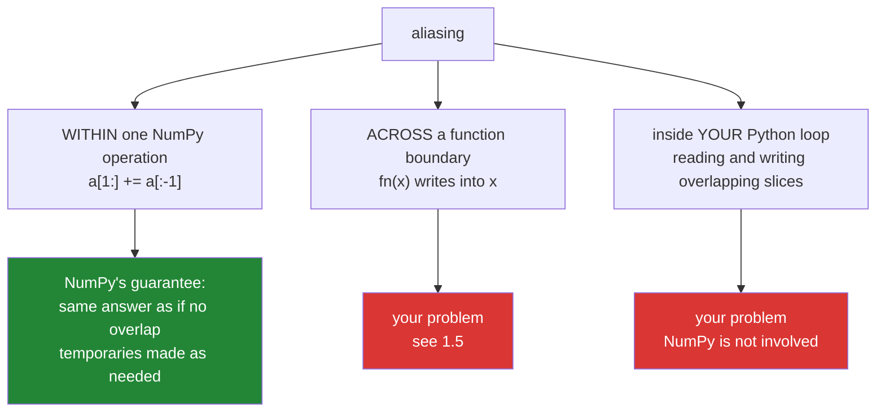

# 1.4 — Aliasing inside one call — what NumPy handles, and what it does not

## One-line answer

When a ufunc's output overlaps its input, NumPy makes a temporary copy so the answer is the same as if
they had not overlapped — so `a[1:] += a[:-1]` is correct, and the aliasing that is still your problem is
the kind that crosses a function boundary.

---

## The story

Somebody is copying a column of step counts down one row, so that each day's box holds the day before's
number.

Doing it with a pencil, top to bottom, goes wrong immediately. Copy row one into row two, and row two's
original value is gone — so when you come to copy row two into row three, you copy the value you just
wrote rather than the one that was there. By the end, every row holds the first row's number.

Anybody who has done this notices halfway down and starts again from the bottom, which works. Or they
write the column out on a scrap of paper first and copy from that, which also works and needs no
cleverness at all.

The interesting question is not how to avoid the problem. It is whether the tool you are using has already
thought about it, because if it has, the careful version and the naive version give the same answer and
you can stop worrying.

---

## The idea in plain language

Two arrays **alias** when they share memory ([1.2](1.2-the-three-probes.md)). Inside a single operation
that reads one and writes the other, that raises the pencil problem: values may be overwritten before they
are read.

NumPy's answer for **ufuncs** is explicit, and it is good news. The documentation for universal functions
states it directly:

> "Operations where ufunc input and output operands have memory overlap are defined to be the same as for
> equivalent operations where there is no memory overlap. Operations affected make temporary copies as
> needed to eliminate data dependency."
> (<https://numpy.org/doc/stable/reference/ufuncs.html>)

So `a[1:] += a[:-1]` gives the same answer as computing it into a fresh array and assigning back. NumPy
detects the dependency and buffers what it needs to. It is a **defined guarantee**, not a happy accident,
and it means one whole category of aliasing bug does not exist here.

Two qualifications come with it, and both are in that same passage.

The detection is a **heuristic**, and it is allowed to make an unnecessary copy when it cannot prove one
is unneeded. So overlapping operands may cost you a temporary you did not want, silently. That is a
performance consideration rather than a correctness one.

And the guarantee is about **ufuncs**. Simple cases are recognised and skip the copy entirely — the
documentation names `np.add(a, b, out=a)` as an example that does not copy — which is why `out=` on a
non-overlapping-in-the-dangerous-way operation stays free
([Day 23, 1.2](../../../day-23-ufuncs-and-statistics/parts/01-ufuncs/1.2-out-and-the-temporaries.md)).

So what is left to worry about? Three things, and they are the reason this document is in a gate day.

**Aliasing across a function boundary.** NumPy protects you inside one call. It cannot protect you from a
function that writes to an array its caller is still holding
([1.1](1.1-six-operations-one-question.md)), because from NumPy's point of view that is two separate
correct operations.

**Aliasing in your own loops.** The guarantee covers NumPy's operations, not a Python loop you wrote that
reads and writes overlapping slices. There, the pencil problem is entirely yours.

**Other libraries.** The guarantee is NumPy's. Code calling into a C extension, a GPU kernel or another
array library is making its own arrangements, and "NumPy handles this" does not transfer.

The practical upshot is a rule that is shorter than people expect: **stop worrying about aliasing within a
NumPy expression, and put all of the worry at your function boundaries.** That is where
[1.5](1.5-the-api-contract.md) picks it up.

---

## Why Setu needs it

- **[1.5](1.5-the-api-contract.md)** is the boundary problem, which is what remains once this document has
  removed the within-call one.
- **[3.3](../03-the-module/3.3-one-pass-or-five.md)** uses `out=` to remove temporaries from the gate
  module, and knowing when `out=` is free and when it silently copies is what makes that a real
  optimisation.
- **Day 23's `out=`** was introduced as a way to avoid allocations
  ([Day 23, 1.2](../../../day-23-ufuncs-and-statistics/parts/01-ufuncs/1.2-out-and-the-temporaries.md));
  this is the safety half of the same argument.
- **Day 125 onwards**, in-place operations on tensors are the standard memory optimisation, and the
  frameworks' guarantees about overlap are weaker than NumPy's — which is why they raise about in-place
  operations on values needed for a gradient.

---

## The mechanism

The pencil problem, handed to NumPy:

```python
import numpy as np

start = np.arange(1.0, 7.0)

shifted = start.copy()
shifted[1:] += shifted[:-1]

reference = start.copy()
reference[1:] = start[1:] + start[:-1]

print("start          :", start)
print("overlap slices :", np.shares_memory(shifted[1:], shifted[:-1]))
print("in place       :", shifted)
print("via a temporary:", reference)
print("agree          :", np.array_equal(shifted, reference))
```

**Line by line:**

- `np.arange(1.0, 7.0)` — six values, small enough that the answer can be checked by eye and the pencil
  problem would be obvious if it happened.
- `shifted[1:] += shifted[:-1]` — **the dangerous-looking line**. Both operands are views of the same
  array and they overlap in five of their six positions
  ([Day 21, 2.1](../../../day-21-indexing-and-views/parts/02-the-view-trap/2.1-a-slice-does-not-copy.md)).
- `np.shares_memory(shifted[1:], shifted[:-1])` — `True`, confirming that the overlap is real and not
  something being imagined ([1.2](1.2-the-three-probes.md)).
- `reference[1:] = start[1:] + start[:-1]` — the same computation with **no** overlap: both operands come
  from the untouched `start`, and the result goes into a different array.
- `np.array_equal(shifted, reference)` — `True`. **The in-place version and the careful version agree**,
  which is the documented guarantee doing its job. Written with a pencil, the first would have given
  `[1, 3, 6, 10, 15, 21]` — a running total — rather than the pairwise sums.

```text
start          : [1. 2. 3. 4. 5. 6.]
overlap slices : True
in place       : [ 1.  3.  5.  7.  9. 11.]
via a temporary: [ 1.  3.  5.  7.  9. 11.]
agree          : True
```

The same thing through three different spellings:

```python
import numpy as np

for label, build in [
    ("a[1:] += a[:-1]", lambda a: a.__setitem__(slice(1, None), a[1:] + a[:-1])),
    ("np.add(a[1:], a[:-1], out=a[1:])", lambda a: np.add(a[1:], a[:-1], out=a[1:])),
    ("a[1:] = a[:-1]", lambda a: a.__setitem__(slice(1, None), a[:-1])),
]:
    values = np.arange(1.0, 7.0)
    build(values)
    print(f"  {label:34s} -> {values}")

shifted = np.arange(1.0, 7.0)
np.cumsum(shifted, out=shifted)
print(f"  {'np.cumsum(a, out=a)':34s} -> {shifted}")
print(f"  {'np.cumsum(a) fresh':34s} -> {np.cumsum(np.arange(1.0, 7.0))}")
```

**Line by line:**

- The list of `(label, lambda)` pairs — three spellings of an overlapping in-place operation, each on a
  fresh array so they cannot influence each other.
- `a.__setitem__(slice(1, None), ...)` — the ugly explicit form of `a[1:] = ...`, needed only because a
  lambda cannot contain an assignment statement. In real code you would write the slice assignment.
- `np.add(a[1:], a[:-1], out=a[1:])` — the same operation written as a ufunc call with an explicit `out=`
  that **is** one of the inputs. This is the case the documentation's guarantee is stated about.
- `a[1:] = a[:-1]` — the pure shift, with no arithmetic. This is the pencil problem in its simplest form:
  every destination overlaps a source. The answer `[1 1 2 3 4 5]` is what copying from the *original*
  values gives, not the `[1 1 1 1 1 1]` that a naive top-to-bottom copy would produce.
- `np.cumsum(shifted, out=shifted)` against a fresh `np.cumsum` — a **reduction** writing into its own
  input, where every output depends on every earlier one. It agrees. That is about as strong a test of the
  guarantee as this operation offers.

```text
  a[1:] += a[:-1]                    -> [ 1.  3.  5.  7.  9. 11.]
  np.add(a[1:], a[:-1], out=a[1:])   -> [ 1.  3.  5.  7.  9. 11.]
  a[1:] = a[:-1]                     -> [1. 1. 2. 3. 4. 5.]
  np.cumsum(a, out=a)                -> [ 1.  3.  6. 10. 15. 21.]
  np.cumsum(a) fresh                 -> [ 1.  3.  6. 10. 15. 21.]
```

What NumPy covers and what it does not:



---

## When it breaks

**The loop NumPy is not in:**

```text
$ uv run python -c "
import numpy as np
values = np.arange(1.0, 7.0)
print('start   :', values)
for i in range(1, values.size):
    values[i] = values[i] + values[i - 1]
print('by hand :', values, '<- a running total, not pairwise sums')
fresh = np.arange(1.0, 7.0)
fresh[1:] += fresh[:-1]
print('vectorised:', fresh, '<- what was actually asked for')
"
start   : [1. 2. 3. 4. 5. 6.]
by hand : [ 1.  3.  6. 10. 15. 21.] <- a running total, not pairwise sums
vectorised: [ 1.  3.  5.  7.  9. 11.]
```

**What it means.** The hand-written loop reads the value it wrote on the previous iteration, so it
accumulates — and it produces a completely different answer from the vectorised line that looks equivalent.
**NumPy's guarantee does not extend to a loop you wrote**, because NumPy is not doing the iterating. This
is not a NumPy bug and it is worth seeing next to the guarantee, because the two lines look like the same
computation and the difference is which one owns the loop. It is also, incidentally, why translating a
loop to a vectorised expression is not always a mechanical substitution.

**The temporary you did not want — and the one you did not get:**

```text
$ uv run python -c "
import timeit
import tracemalloc
import numpy as np
n = 5_000_000
a = np.ones(n)
b = np.ones(n); c = np.ones(n)
def forward():  np.add(a[1:], a[:-1], out=a[1:])
def backward(): np.add(a[1:], a[:-1], out=a[:-1])
def clean():    np.add(b, c, out=b)
for name, fn in [('out=a[1:]  (depends)', forward),
                 ('out=a[:-1] (does not)', backward),
                 ('no overlap at all', clean)]:
    t = min(timeit.repeat(fn, number=3, repeat=3)) / 3
    tracemalloc.start(); fn(); _, peak = tracemalloc.get_traced_memory(); tracemalloc.stop()
    print(f'{name:24s} {t*1000:7.2f} ms   peak alloc {peak:>12,} bytes')
"
out=a[1:]  (depends)       15.50 ms   peak alloc   40,001,448 bytes
out=a[:-1] (does not)       3.85 ms   peak alloc          352 bytes
no overlap at all           4.49 ms   peak alloc            0 bytes
```

**What it means.** The first and second lines have **exactly the same two inputs** and differ only in
which overlapping slice they write into — and one of them allocates forty megabytes and takes four times
as long while the other allocates nothing.

The reason is the direction of the dependency. Writing into `a[1:]` while reading `a[:-1]` means each
output position overwrites a value a later position still needs, so NumPy must buffer to keep its
guarantee. Writing into `a[:-1]` while reading `a[1:]` reads ahead of where it writes, so the heuristic
can prove no copy is needed and skips it — which is the same reasoning as the documentation's example of
`np.add(a, b, out=a)` being copy-free.

**That is the price of the guarantee, and it is invisible**: there is no warning, and `out=` looks like it
is avoiding an allocation while quietly making one. `tracemalloc` is how you find out, and the fix in a hot
loop is a scratch buffer so the operands never overlap at all.

**Aliasing across a boundary, which nothing catches:**

```text
$ uv run python -c "
import numpy as np
def rescale(values):
    values /= values.max()
    return values

month = np.array([[8213.0, 10442.0], [6180.0, 9000.0]])
week = month[0]
print('before      :', month)
result = rescale(week)
print('after       :', month)
print('result is week:', result is week)
print('week aliases month:', np.shares_memory(week, month))
"
before      : [[ 8213. 10442.]
 [ 6180.  9000.]]
after       : [[7.86535147e-01 1.00000000e+00]
 [6.18000000e+03 9.00000000e+03]]
result is week: True
week aliases month: True
```

**What it means.** Every individual operation here is correct and NumPy's guarantee is fully honoured. The
damage is that `week` was a view of `month` ([1.1](1.1-six-operations-one-question.md)), so a function
modifying its argument in place modified half of an array the caller never passed in. **This is the
aliasing NumPy cannot help with**, because there is nothing anomalous about it from inside any single call
— and it is the whole subject of [1.5](1.5-the-api-contract.md) and of
[2.2](../02-the-bug/2.2-in-a-pipeline.md).

---

## In production

**What a professional writes instead of the teaching version.** The within-call worry is dropped and the
boundary worry is made explicit:

```python
from __future__ import annotations

import numpy as np


def accumulate_into(target: np.ndarray, addend: np.ndarray) -> None:
    """Add ``addend`` into ``target`` in place, warning if the two overlap.

    NumPy guarantees the RESULT is correct when they overlap - it buffers as needed -
    but when the dependency runs the wrong way it buffers a full temporary,
    which defeats the point of using out=. Overlap here is almost always an accident.
    """
    if target.shape != addend.shape:
        raise ValueError(f"shapes must match: {target.shape} and {addend.shape}")
    if not target.flags.writeable:
        raise ValueError("target is read-only; pass a writeable array or a copy")
    if np.may_share_memory(target, addend) and np.shares_memory(target, addend):
        raise ValueError(
            "target and addend overlap. The answer would be correct, but NumPy must "
            "allocate a full temporary to guarantee it, which is what out= was avoiding. "
            "Pass a copy of one of them if the overlap is intended."
        )
    np.add(target, addend, out=target)
```

**Line by line:**

- The docstring saying **the answer would be correct** — this function is not preventing a wrong answer, it
  is preventing a silent performance loss, and being honest about which is what makes the check defensible
  rather than superstitious.
- `np.may_share_memory` **before** `np.shares_memory` — the cheap conservative probe short-circuits the
  common case at almost no cost, and the exact one only runs when it fires
  ([1.2](1.2-the-three-probes.md)).
- `target.flags.writeable` checked — a function that writes should say so on entry rather than raising from
  inside a ufunc three frames down ([1.3](1.3-writeable-the-flag.md)).
- The overlap message explaining **what the caller loses** rather than what they did wrong — "which is what
  `out=` was avoiding" is the sentence that lets somebody decide whether they care. Note the check is
  deliberately conservative: some overlaps cost nothing, and distinguishing them requires knowing which
  direction the dependency runs, which is not something a general-purpose guard can work out.
- "Pass a copy of one of them if the overlap is intended" — the message ends with the fix, and it
  acknowledges that deliberate overlap is a legitimate thing to want.
- `return None` implicitly — the convention that a function changing its argument returns nothing, so
  `x = accumulate_into(x, y)` cannot be written by accident
  ([Day 23, 3.1](../../../day-23-ufuncs-and-statistics/parts/03-sorting-and-searching/3.1-sort-and-the-copy.md)).

**What changes at scale.** The correctness guarantee is free of charge and stays free; the **cost** of
honouring it grows with the array, because the temporary NumPy allocates is full size. On a five-million
element array that was a measured four-times slowdown and a forty-megabyte allocation where the
non-dependent version allocated nothing — so at gigabyte scale an accidental overlap can turn an `out=`
optimisation into an out-of-memory kill, which is a spectacular way for a performance improvement to
fail. Two habits follow. In a hot loop, allocate an explicit scratch
buffer once and use it as `out=`, so operands never overlap and the heuristic never fires. And be aware
that the guarantee is **NumPy's alone**: the moment data crosses into another library, a C extension or a
GPU, the arrangements are that library's, and frameworks that are aggressive about in-place operations
generally warn or refuse rather than buffering — which is what "a variable needed for gradient computation
has been modified by an inplace operation" means when you meet it after Day 125.

**The failure that only appears with real data.** A signal-processing step applied a filter with
overlapping input and output slices, which was correct and roughly three times slower than the author
expected. Nobody investigated, because the function was fast enough. Two years later the array size grew
by an order of magnitude, the hidden temporary became a two-gigabyte allocation on a machine with little
headroom, and the job started failing intermittently under memory pressure. The profile showed the time in
the ufunc, not in an allocation, so the cause took a week to find.

**The review comment a senior engineer leaves.** *"`np.add(a[1:], a[:-1], out=a[1:])` is correct — NumPy
buffers overlapping operands — but the buffering allocates a full temporary, which is exactly what `out=`
was here to avoid. Either use a scratch buffer or drop the `out=` and be honest that this allocates."*

**The interview question.** *"What happens if a ufunc's `out=` array overlaps its input?"* NumPy guarantees
the result is the same as if there were no overlap — it makes temporary copies as needed to remove the
data dependency, and the ufunc documentation states that explicitly. So `a[1:] += a[:-1]` is correct, and
gives the pairwise sums rather than the running total a hand-written loop would produce. Two qualifications: the
detection is a heuristic, so it can make an unnecessary copy, and when it does fire the copy is full-size.
I measured two calls with identical inputs differing only in which overlapping slice they wrote into — one
allocated forty megabytes and took four times as long, the other allocated nothing — so an accidental
overlap turns an `out=` optimisation into an extra allocation with no warning at all. The important thing is what the guarantee does **not** cover: a Python loop you
wrote, where the pencil problem is entirely yours; another library or a GPU kernel, which makes its own
arrangements; and aliasing across a **function boundary**, where a function modifies an array its caller
still holds. That last one is the real remaining risk, and NumPy cannot help with it because each
individual operation is perfectly correct.

---

## Check yourself

```bash
uv run python -c "
import numpy as np
a = np.arange(1.0, 7.0)
b = a.copy()
a[1:] += a[:-1]
expected = b.copy(); expected[1:] = b[1:] + b[:-1]
print('in place  :', a)
print('reference :', expected)
print('agree     :', np.array_equal(a, expected))
print('overlapped:', np.shares_memory(b[1:], b[:-1]))
loop = np.arange(1.0, 7.0)
for i in range(1, loop.size):
    loop[i] = loop[i] + loop[i - 1]
print('hand loop :', loop, '<- NumPy was not doing the iterating')
"
```

The vectorised line and the hand-written loop compute what looks like the same thing and disagree. Say
which one NumPy's guarantee applies to and why the other is different.

**Answer out loud, without scrolling up:**

> State NumPy's guarantee about an overlapping `out=`, and what it costs. Then name the three kinds of
> aliasing the guarantee does not cover.

---

**Next:** [1.5 — the API contract: saying it in the signature](1.5-the-api-contract.md).
