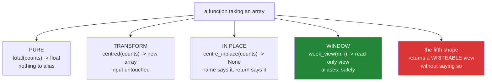

# 1.5 — The API contract — saying it in the name and the signature

## One-line answer

A function that takes an array is making a promise about whether it will modify it and whether its result
aliases it — and the only useful place to put that promise is the **name and the signature**, because
nobody reads the docstring at the call site.

---

## The story

The flat's chore chart gets handed around, and after a while people work out the etiquette without anybody
writing it down.

If somebody says "can I see the chart", they get it and they hand it back unchanged. If somebody says "can
you add my ticks", they are asking to write on it and everybody knows the chart will come back different.
Nobody has to check afterwards, because the request said which it was.

That works because the two requests are different **sentences**. If both were phrased as "can I have the
chart", the flat would need a rule that everybody remembers, and rules everybody remembers are rules
somebody eventually forgets at eleven at night.

Function names are the same. `summarise(month)` and `centre_inplace(month)` are two different sentences,
and a reader of either call site knows what happens to `month` without opening anything.

---

## The idea in plain language

A function taking a NumPy array makes two promises whether it means to or not.

**Does it modify the argument?** If it does, the caller's data changes and any view of it changes too
([1.1](1.1-six-operations-one-question.md)).

**Does the result alias the argument?** If it does, the caller now holds two names for one block of memory,
and writing to either affects both.

Both promises are invisible in a call. `result = process(month)` says nothing about either, and the caller
has to either read the source or find out the hard way.

There are three places to put the promise, and they are worth ranking because only one of them works
reliably.

**The name.** A function that modifies its argument should say so: `centre_inplace`, `sort_in_place`,
`fill_`. This is the only one that is visible at the **call site**, which is where somebody reading
unfamiliar code is standing. It is by far the most effective.

**The return type.** A function that modifies its argument should return `None`, following the convention
of `list.sort()` and `arr.sort()`
([Day 23, 3.1](../../../day-23-ufuncs-and-statistics/parts/03-sorting-and-searching/3.1-sort-and-the-copy.md)).
That makes `x = centre_inplace(x)` a bug that shows up immediately rather than a working line that
misleads. The rule is: **a function either returns a new array or modifies the old one, never both.**

**The docstring.** Necessary and insufficient. It is where the detail goes — "returns a view", "the input
is never modified" — and it is not read at the call site, so it cannot be the primary mechanism.

For the aliasing half there is a fourth option, and it is the one this day has been building towards: make
the promise **enforceable** by returning a read-only view ([1.3](1.3-writeable-the-flag.md)). "This result
is a window onto my data, do not write to it" stops being a request and becomes a `ValueError` for anybody
who tries.

That gives four honest shapes for a function that takes an array, and almost every function is one of
them:

| Shape | Name | Returns | Modifies input | Result aliases input |
|---|---|---|---|---|
| pure | `summarise` | new values | no | no |
| transform | `centre` | a new array | no | no |
| in place | `centre_inplace` | `None` | **yes** | — |
| window | `week_view` | a read-only view | no | **yes**, safely |

The one shape not in that table is the one to avoid: a function that returns a **writeable** view of its
argument without saying so. That is the shape of every bug in
[section 2](../02-the-bug/2.1-ravel-changed-it-flatten-did-not.md).

---

## Why Setu needs it

- **[2.2](../02-the-bug/2.2-in-a-pipeline.md)** is three functions with no contract between them, which is
  how the day's named bug survives.
- **[3.4](../03-the-module/3.4-the-boundary-that-decides.md)** applies this table to the gate module, and
  every function in it is one of the four shapes.
- **[5.1](../05-the-gate/5.1-the-eval.md)** asserts the contract, which is only possible because the
  contract was stated.
- **Day 76's transformers** have exactly this problem, and scikit-learn's answer — `fit`, `transform`,
  `fit_transform`, with `transform` never modifying its input — is this table with different names.
- **Day 26 onwards**, pandas' `inplace=` argument is the alternative design, and it is widely regarded as a
  mistake for precisely the reasons this document gives: it makes one function two, and the name does not
  say which.

---

## The mechanism

The four shapes, written out:

```python
from __future__ import annotations

import numpy as np


def total(counts: np.ndarray) -> float:
    """PURE. Reads ``counts``, returns a number. Nothing to alias."""
    return float(np.nansum(counts, dtype=np.float64))


def centred(counts: np.ndarray) -> np.ndarray:
    """TRANSFORM. Returns a NEW array; ``counts`` is not modified and is not aliased."""
    return counts - np.nanmean(counts, dtype=np.float64)


def centre_inplace(counts: np.ndarray) -> None:
    """IN PLACE. Modifies ``counts`` and everything sharing its memory. Returns None."""
    if not counts.flags.writeable:
        raise ValueError("counts is read-only; pass a writeable array or a copy")
    counts -= np.nanmean(counts, dtype=np.float64)


def week_view(month: np.ndarray, index: int) -> np.ndarray:
    """WINDOW. Returns a READ-ONLY view: no copy, and writing through it raises."""
    view = month[index].view()
    view.flags.writeable = False
    return view
```

**Line by line:**

- `total` returning a `float` — **a pure function cannot alias anything**, because a number is not a
  window. Converting at the boundary is what makes that true
  ([Day 20, 2.5](../../../day-20-arrays-and-dtypes/parts/02-dtypes/2.5-nep-50-and-the-python-number.md)):
  returning `np.nansum(...)` unconverted would give a NumPy scalar, which is still not a view but is one
  step less final.
- `centred` named with a **participle** rather than a verb — "centred" is a thing you get back, where
  "centre" sounds like something being done. Small, and it is the difference a reader picks up on.
- `counts - np.nanmean(...)` rather than `counts -= ...` — the subtraction allocates
  ([1.1](1.1-six-operations-one-question.md)), which is exactly what this shape promises.
- `centre_inplace` with `_inplace` in the name — **the promise where it is visible**, at the call site.
- Its return annotation of `None` — the second half of the promise, and the thing that makes
  `x = centre_inplace(x)` fail loudly.
- The `writeable` check at the top of `centre_inplace` — a function that writes should refuse a frozen
  array with its own message rather than raising from inside a ufunc
  ([1.3](1.3-writeable-the-flag.md)).
- `week_view` returning a **frozen** view — the fourth shape. It aliases deliberately and safely: no copy,
  and any write raises. This is the shape that would otherwise be the dangerous one.
- The docstrings all beginning with the shape in capitals — `PURE`, `TRANSFORM`, `IN PLACE`, `WINDOW`. That
  is a small convention and it makes the four shapes greppable, which matters when a codebase has three
  hundred of these.

Running them:

```python
import numpy as np

month = np.array(
    [
        [8213.0, 10442.0, 6180.0, 9000.0, 12007.0, 9631.0, 7204.0],
        [7788.0, 9120.0, 11345.0, 8402.0, 6733.0, 14210.0, 5096.0],
    ]
)
before = month.copy()

print("total          :", round(total(month), 1))
print("month touched? :", not np.array_equal(before, month))

out = centred(month)
print("centred aliases:", np.shares_memory(out, month))
print("month touched? :", not np.array_equal(before, month))

own = month.copy()
print("in place returns:", centre_inplace(own))
print("own changed    :", not np.array_equal(own, month))

window = week_view(month, 0)
print("window aliases :", np.shares_memory(window, month))
print("window writeable:", window.flags.writeable)
try:
    window[0] = 0.0
except ValueError as error:
    print("writing to it  : ValueError:", error)
print("month still ok :", np.array_equal(before, month))
```

**Line by line:**

- `before = month.copy()` — the reference, taken once and compared against after every call. **This is how
  you test a no-modification promise** ([5.1](../05-the-gate/5.1-the-eval.md)).
- `not np.array_equal(before, month)` after `total` and after `centred` — `False` both times. Two functions
  that read and do not write, demonstrated rather than documented.
- `np.shares_memory(out, month)` — `False`. The transform's result is independent
  ([1.2](1.2-the-three-probes.md)).
- `centre_inplace(own)` printed **inside** the `print` — its return value is `None`, which is the visible
  half of the convention.
- `own` compared against `month` rather than against `before` — `own` was a copy, so the in-place function
  changed the copy and left `month` alone. That is the caller controlling the damage by making a copy
  first, which is the correct use of this shape.
- `np.shares_memory(window, month)` — `True`. **The window aliases on purpose**, which is its entire value:
  no copy of a potentially enormous array.
- `window.flags.writeable` — `False`, so the aliasing is safe
  ([1.3](1.3-writeable-the-flag.md)).
- `np.array_equal(before, month)` at the end — `True`. Four calls, one of them deliberately in place on a
  copy and one of them returning a live window, and the original is untouched.

```text
total          : 125371.0
month touched? : False
centred aliases: False
month touched? : False
in place returns: None
own changed    : True
window aliases : True
window writeable: False
writing to it  : ValueError: assignment destination is read-only
month still ok : True
```

The four shapes:



The red box is not a shape to use carefully. It is the shape section 2 is entirely about, and the point of
the other four is that none of them is it.

---

## When it breaks

**A function that is two shapes at once:**

```text
$ uv run python -c "
import numpy as np
def centre(counts):
    counts -= counts.mean()
    return counts

month = np.array([[8213.0, 10442.0], [6180.0, 9000.0]])
before = month.copy()
result = centre(month)
print('returned something:', result is not None)
print('input modified    :', not np.array_equal(before, month))
print('result is input   :', result is month)
"
returned something: True
input modified    : True
result is input   : True
```

**What it means.** It modifies its argument **and** returns it, so it reads like a transform at the call
site and behaves like an in-place operation. `new = centre(old)` looks like it left `old` alone and did
not. This is the single most common contract failure, and it is easy to write by accident: `-=` was chosen
for speed and the `return` was added because returning something feels tidy. **Pick one.** Either drop the
`return` and rename it `centre_inplace`, or change `-=` to `-` and return the new array.

**An in-place function whose return value was assigned:**

```text
$ uv run python -c "
import numpy as np
def centre_inplace(counts):
    counts -= counts.mean()

month = np.array([8213.0, 10442.0, 6180.0])
month = centre_inplace(month)
print('month is now:', month)
print(month.mean())
"
month is now: None
Traceback (most recent call last):
  File "<string>", line 8, in <module>
AttributeError: 'NoneType' object has no attribute 'mean'
```

**What it means.** The `None` return did its job. The assignment threw the array away and the next line
failed, loudly, one line later — which is a far better outcome than the alternative where the function
returns the array and `month = centre_inplace(month)` works, teaching the reader that it is a transform.
**The `None` is a feature**, and it is the same reasoning as `list.sort()` returning `None`
([Day 8, 1.5](../../../day-08-containers/parts/01-sequences/1.5-sort-sorted-and-key.md)).

**A window handed out writeable:**

```text
$ uv run python -c "
import numpy as np
class Store:
    def __init__(self, data):
        self._data = data
    def week(self, i):
        return self._data[i]

month = np.array([[8213.0, 10442.0], [6180.0, 9000.0]])
store = Store(month)
week = store.week(0)
print('store data before:', store._data[0])
week *= 2
print('store data after :', store._data[0])
print('aliases the store:', np.shares_memory(week, store._data))
"
store data before: [ 8213. 10442.]
store data after : [16426. 20884.]
aliases the store: True
```

**What it means.** `store.week(0)` looks like an accessor and hands out a **writeable window into the
store's private data**. The caller doubled their week and doubled the store's copy of it, permanently,
with no error. The leading underscore on `_data` said "private" and protected nothing, because the method
handed the memory out anyway. **One line fixes it** — freeze the view before returning
([1.3](1.3-writeable-the-flag.md)) — and it costs nothing, which is why there is no argument for not doing
it.

---

## In production

**What a professional writes instead of the teaching version.** The four shapes are a stated convention,
and the one that hands out memory does it safely by default:

```python
from __future__ import annotations

import numpy as np


class MonthStore:
    """Holds one month of readings. Hands out windows, never its own array.

    Every public method is one of four shapes, named in its docstring:
    PURE (reads, returns a number), TRANSFORM (returns a new array), IN PLACE
    (modifies, returns None), WINDOW (returns a read-only view of internal data).
    """

    def __init__(self, readings: np.ndarray) -> None:
        # Own our data: np.array copies, np.asarray would have kept the caller's array
        # and let them modify our contents behind our back.
        self._readings = np.array(readings, dtype=np.float64, copy=True)

    def week(self, index: int) -> np.ndarray:
        """WINDOW. A read-only view of one week. No copy; writing through it raises."""
        view = self._readings[index].view()
        view.flags.writeable = False
        return view

    def snapshot(self) -> np.ndarray:
        """TRANSFORM. An independent copy the caller may modify freely."""
        return self._readings.copy()

    def total(self) -> float:
        """PURE. Nothing to alias."""
        return float(np.nansum(self._readings, dtype=np.float64))

    def record(self, week: int, day: int, value: float) -> None:
        """IN PLACE. Changes our data. Returns None."""
        self._readings[week, day] = value
```

**Line by line:**

- The class docstring naming the **four shapes** — a convention stated once at the top, so every method's
  one-word docstring prefix means something.
- `np.array(readings, copy=True)` in `__init__` with the comment — **the store owns its data**. Using
  `np.asarray` here would keep the caller's array, so the caller could modify the store's contents by
  writing to the variable they passed in ([1.1](1.1-six-operations-one-question.md)). The comment says so
  rather than leaving the next person to reason it out.
- `week()` returning a frozen view — **cheap and safe**, which is the combination the whole day has been
  building to. On a real store this is the difference between a per-caller copy and none.
- `snapshot()` existing alongside it — the escape hatch, named so that a caller who needs to modify has an
  obvious thing to reach for. Without it, somebody will unfreeze the view instead
  ([1.3](1.3-writeable-the-flag.md)).
- `total()` returning `float` — pure, and there is nothing for a caller to hold on to.
- `record()` returning `None` — in place, named as a verb, and the `None` makes an assignment fail.
- **No method returns a writeable view of `_readings`**, which is the invariant the class exists to
  maintain, and it is checkable by reading four short methods.

**What changes at scale.** The contract becomes the difference between a system that can share memory and
one that must copy. A store holding a 4 GB array can serve a hundred readers from one copy if every one of
them gets a frozen window, and needs 400 GB if each gets a snapshot — so the window shape is not a
nicety, it is what makes the design possible at all. Two further effects. Under **concurrency** the
contract stops being about tidiness: several threads reading one array is safe, one thread writing while
others read is a data race, and the four shapes are exactly the vocabulary for saying which methods are
which — a class whose only mutating method is named `record` and returns `None` is one whose thread-safety
can be reasoned about. And at the point where data crosses a process or a machine boundary, the aliasing
question disappears and is replaced by a serialisation cost, which is why shared-memory designs
(`multiprocessing.shared_memory`, memory-mapped files) reintroduce all of it — a memory-mapped array is a
window onto a file, and every rule in this document applies to it with the added detail that the write
lands on disk.

**The failure that only appears with real data.** A configuration service loaded a lookup table once and
returned slices of it from a getter. For two years every caller only read. Then a new caller normalised the
slice it received, in place, for speed — modifying the shared table — and every subsequent request in that
process got normalised values. Restarting the service fixed it, so it was diagnosed as a memory leak and a
periodic restart was added. The actual cause was found eight months later by someone reading the getter.

**The review comment a senior engineer leaves.** *"`week()` returns `self._readings[i]`, which is a
writeable view of our internal array — any caller can modify the store by writing to what they think is
their own week. Freeze the view before returning it; it costs nothing. And add a `snapshot()` so callers
who legitimately need to modify have somewhere to go."*

**The interview question.** *"How do you make it clear whether a function modifies its array argument?"*
In the name and the return type, not the docstring — the docstring is not read at the call site. A function
that modifies says so in its name and returns `None`, following the `list.sort()` convention, so
`x = f(x)` fails immediately rather than silently working and teaching the reader the wrong thing; a
function that does not modify returns a new array. The shape people forget is the fourth one: a function
returning a **view** of its argument, which is cheap and lets the caller modify your data by accident — and
the fix is to freeze the view before returning it, which costs nothing and turns the accident into a
`ValueError`. The related trap on the way in is `np.asarray`, which keeps the caller's array rather than
copying it, so a constructor that wants to own its data needs `np.array(..., copy=True)`. At scale this
stops being style: a store that hands out frozen windows serves a hundred readers from one copy, and one
that hands out snapshots needs a hundred.

---

## Check yourself

```bash
uv run python -c "
import numpy as np
def centred(c):
    return c - c.mean()
def centre_inplace(c):
    c -= c.mean()
def window(m, i):
    v = m[i].view(); v.flags.writeable = False; return v

month = np.array([[8213., 10442.], [6180., 9000.]])
before = month.copy()
out = centred(month)
print('transform: aliases', np.shares_memory(out, month), ' input changed', not np.array_equal(before, month))
own = month.copy()
print('in place : returns', centre_inplace(own), ' own changed', not np.array_equal(own, month))
w = window(month, 0)
print('window   : aliases', np.shares_memory(w, month), ' writeable', w.flags.writeable)
try:
    w[0] = 0.0
except ValueError as e:
    print('           write ->', e)
print('month untouched throughout:', np.array_equal(before, month))
"
```

Three functions, three shapes. Say which one you would be most nervous about if its name were just
`process`, and why the other two would survive being badly named.

**Answer out loud, without scrolling up:**

> Name the four honest shapes a function taking an array can have, and say what each returns. Then name the
> fifth shape, the one to avoid, and the one line that turns it into a safe one.

---

**Next:** [2.1 — `.ravel()` changed the original and `.flatten()` did not](../02-the-bug/2.1-ravel-changed-it-flatten-did-not.md).
